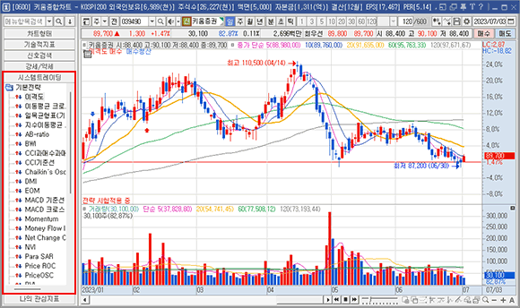
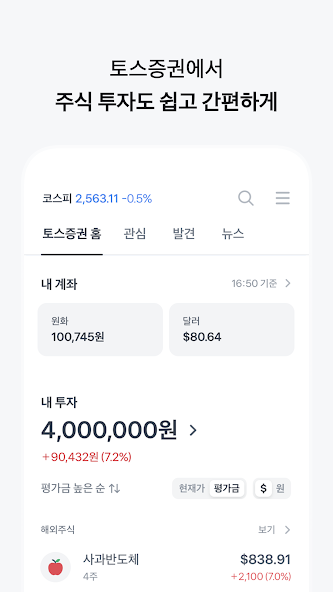
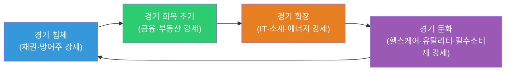
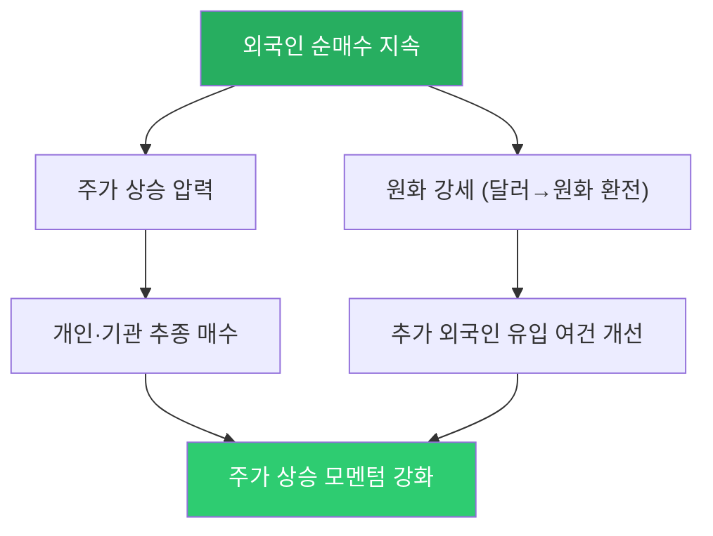
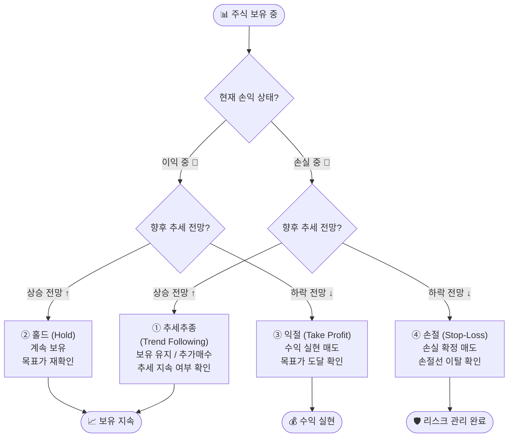

# 8단원 — 금융상품 이해 (주식·ETF·채권·파생·대출)

> 8차 통합 — domain-rag-lab 샘플 문서 묶음.

## 이 단원을 왜 두는가

- 어드바이저가 종목을 추천하려면 상품 구조(주식·ETF·채권·파생·대출)가 먼저 입에 붙어야 한다.
- ETF 비용 3종(총보수·스프레드·추적오차)은 내 로보어드바이저의 종목 스크리닝 기준으로 쓴다.
- 채권·파생 파트는 "구조와 위험"까지만. 가격 결정 모델은 본 프로젝트에서 LEAN과 함께 다룬다.
- 대출·여신 파트(제1·2금융권·대부업)는 투자 조언의 경계선을 아는 용도다. 어드바이저가 선을 넘지 않게 한다.
- HTS/KRX·NXT 시세 파트는 주문 실행 파이프라인(한투 API)의 사전 지식으로 읽는다.
- 이 단원을 마치면 "이 ETF를 고른 비용적 근거"를 3줄로 말할 수 있어야 한다.


---

## 원문: finance_financial_products_classification.txt

# 투자자산운용사(2과목) 문항 구성 한눈에 보기

> 과목: **투자운용 및 전략 Ⅱ(2) 및 투자분석**  
> 총 문항 수: **30문항**  
> 과락 기준: **12문항 미만 정답 시 과락**

## 세부과목별 문항 수 + 초급자도 이해되는 예시

| 세부과목 | 문항 수 | 아주 쉬운 예시 |
|---|---:|---|
| 대안투자운용/투자전략 | 5 | 주식·ETF만 보지 않고 금, 부동산처럼 다른 종류 자산도 함께 담아보는 전략 |
| 해외증권투자운용/투자전략 | 5 | 한국 가게에서만 장보지 않고 해외 가게 물건도 함께 사듯, 해외 주식도 같이 담아보는 전략 |
| 투자분석기법 | 12 | 시험 전에 문제집을 풀며 "어떤 문제를 자주 틀리는지" 확인하듯, 투자 전에 숫자와 흐름을 먼저 분석 |
| 리스크관리 | 8 | 비 오는 날 우산을 챙기듯, 손해가 커지지 않게 미리 안전장치를 준비하는 것 |
| 한국금융투자협회규정 | 3 | 학교 규칙(예: 복도에서 뛰지 않기)처럼, 투자업무에서도 꼭 지켜야 하는 약속을 배우는 영역 |
| 주식투자운용/투자전략 | 6 | 용돈을 한 번에 다 쓰지 않고 계획표를 짜서 쓰듯, 주식을 언제·얼마나 살지 계획하는 방법 |
| 투자운용결과분석 | 4 | 시험 보고 나서 오답노트를 만들듯, 투자 후에도 무엇이 잘됐는지/아쉬웠는지 다시 점검하는 것 |
| 거시경제 | 4 | 날씨를 보고 옷을 고르듯, 금리·물가·환율 같은 큰 경제 날씨를 보고 투자 방향을 정하는 것 |
| 분산투자기법 | 5 | 색연필을 한 색만 사지 않고 여러 색을 사는 것처럼, 자산을 나눠 담아 한 가지 자산의 위험을 줄이는 방법 |

> 참고: 위 표는 학습자가 빠르게 범위를 잡을 수 있도록 정리한 요약표입니다.

---

## 금융투자분석사 관점 추가 학습 범위

| 세부과목 | 문항 수 | 아주 쉬운 예시 |
|---|---:|---|
| 주식평가/분석, 재무제표론 | 10 | 가게 성적표(매출·비용)를 보고 "이 가게가 돈을 잘 버는지" 판단하듯 기업 재무상태를 읽는 공부 |
| 기업가치평가/분석 | 10 | 중고 자전거 값을 정할 때 상태·연식·인기 등을 보고 가격을 정하듯, 회사의 적정가치를 계산하는 공부 |
| 회사법 | - | 학교 반 규칙처럼, 회사가 어떻게 만들어지고 운영되는지 지켜야 할 법 규칙을 배우는 내용 |

> 참고: 회사법 문항 수는 현재 사용자 입력 기준에 숫자가 없어 `-`로 표기했습니다.

---

## 1과목(증권분석기초) 문항 구성 한눈에 보기

> 과목: **증권분석기초**  
> 총 문항 수: **25문항**  
> 과락 기준: **10문항 미만 정답 시 과락**

| 세부과목 | 문항 수 | 아주 쉬운 예시 |
|---|---:|---|
| 계량분석 | 5 | 운동회 기록을 숫자로 비교하듯, 투자 데이터도 숫자·공식으로 비교해 보는 공부 |
| 증권경제 | 10 | 날씨(경제)가 바뀌면 옷차림(주가)도 달라지듯, 금리·물가·경기와 증권시장 관계를 배우는 내용 |
| 기업금융/포트폴리오 관리 | 10 | 용돈을 저금/간식/학용품으로 나눠 쓰는 계획처럼, 회사 돈 관리와 투자 바구니 관리 방법을 배우는 내용 |

---

# 주식 및 ETF 상품 이해


---


## 오늘 배울 것

- 주식 시장 구조: 코스피, 코스닥, 나스닥
- 주식 기본 개념: EPS, 배당, 시가총액, 유동주식
- ETF(상장지수펀드)의 구조와 종류
- ETF 운용 전략: 패시브, 액티브, 팩터 ETF
- 실습: ETF 성과 비교 분석

---

## 🔗 참고 사이트 & 데이터 원천

> 이 문서(주식·ETF 상품 이해)의 실습에 필요한 공식 데이터 출처와 참고 사이트입니다. ⚿ 는 API 키 또는 승인이 필요한 항목입니다.

### 📊 국내 공식 데이터

| 기관 | URL | API 키 | 제공 데이터 |
|------|-----|--------|-------------|
| KRX 정보데이터시스템 | <https://data.krx.co.kr> | 불필요(웹 조회) | 주식·ETF 가격, 거래량, 상장 정보 |
| KRX Data Marketplace | <https://openapi.krx.co.kr> | ⚿ 필요 | 주식·ETF 시계열, 지수, 증권상품 |
| 금융감독원 DART | <https://opendart.fss.or.kr> | ⚿ 필요 | 사업보고서, 재무제표, 배당 |
| 네이버 금융 | <https://finance.naver.com> | 불필요 | 국내 주식·ETF 가격 참고 |
| 한국거래소 ETF | <https://etf.krx.co.kr> | 불필요 | ETF 구성종목, 순자산, 수익률 |

### 🌍 해외 공식 데이터

| 기관 | URL | API 키 | 제공 데이터 |
|------|-----|--------|-------------|
| SEC EDGAR | <https://www.sec.gov/edgar> | 불필요 | 미국 상장기업 공시 |
| Nasdaq Data Link | <https://data.nasdaq.com> | ⚿ 권장 | 미국 주식·ETF·경제 데이터 |
| ETF.com | <https://www.etf.com> | 불필요 | ETF 분류, 운용보수, 구성 |
| iShares | <https://www.ishares.com> | 불필요 | iShares ETF 구성종목·팩트시트 |
| State Street SPDR | <https://www.ssga.com> | 불필요 | SPDR ETF 상품 정보 |
| Vanguard | <https://investor.vanguard.com> | 불필요 | Vanguard ETF 상품 정보 |

### 📈 차트 & 뉴스 참고

| 분류 | 사이트 | URL | 활용 용도 |
|------|--------|-----|-----------|
| 차트 플랫폼 | TradingView | <https://www.tradingview.com> | 주식·ETF 가격 차트 |
| 시장 데이터 | Yahoo Finance | <https://finance.yahoo.com> | ETF 가격, 배당, 간단한 성과 비교 |
| 국내 금융 포탈 | 네이버 금융 | <https://finance.naver.com> | 국내 ETF 조회 |
| 금융 미디어 | 한국경제 | <https://www.hankyung.com> | ETF·증시 뉴스 |
| 금융 미디어 | 이데일리 | <https://www.edaily.co.kr> | ETF·시장 기사 |

---

## 🧒 주식이란? — 초급자도 이해하는 설명


> **한 줄 요약**: 회사의 아주 작은 주인이 되는 것

### 피자 한 판 비유

삼성전자라는 회사가 피자 한 판이라고 상상해보세요.  
이 피자를 **1억 조각**으로 잘라서 사람들에게 나눠 판다고 합시다.  
그 조각 하나가 바로 **주식 1주**입니다.

```
삼성전자 (피자 한 판)
├── 주식 1주  ← 당신이 살 수 있는 아주 작은 조각
├── 주식 1주
├── 주식 1주  (× 약 60억 주)
└── ...
```

| 상황 | 무슨 일이 일어나나요? |
|------|----------------------|
| 회사가 돈을 많이 벌면 | 피자 조각(주식)이 더 비싸집니다 → 주가 상승 |
| 회사가 손해를 보면 | 피자 조각 값이 내려갑니다 → 주가 하락 |
| 이익을 나눠줄 때 | 가지고 있는 조각 수만큼 돈을 받습니다 → 배당 |

> 💡 주식을 산다 = 회사의 주인(주주)이 된다 = 회사가 잘 되면 같이 이익, 못 되면 같이 손해

---

### 1. 주식 시장 구조 (코스피, 코스닥, 나스닥)

> 📖 **Wikipedia**: [주식시장](https://ko.wikipedia.org/wiki/주식시장) · [코스피](https://ko.wikipedia.org/wiki/코스피) · [코스닥](https://ko.wikipedia.org/wiki/코스닥) · [나스닥](https://ko.wikipedia.org/wiki/나스닥)

**핵심 개념**

주식 시장은 기업이 자본을 조달하고 투자자가 기업의 소유권 일부를 사고파는 장소입니다. 퀀트 분석에서는 시장별 특성이 다르기 때문에, 같은 전략이라도 어느 시장에 적용하는지 먼저 구분해야 합니다.

| 시장 | 주요 특징 | 퀀트 분석 포인트 |
|------|-----------|------------------|
| 코스피 | 대형·우량 기업 중심 | 시가총액, 외국인 수급, 경기 민감도 |
| 코스닥 | 성장주·중소형주 중심 | 변동성, 거래대금, 테마 민감도 |
| 나스닥 | 기술주·성장주 비중 높음 | 금리 민감도, 성장률, 밸류에이션 |


---

#### 1-A. 코스피(KOSPI)란?

> 📖 **Wikipedia**: [코스피](https://ko.wikipedia.org/wiki/코스피)

**KOSPI(Korea Composite Stock Price Index)**는 한국거래소(KRX)가 운영하는 **유가증권시장(Main Board)**의 종합주가지수입니다. 1956년 대한증권거래소 출범과 함께 시작된 국내 최초의 공식 주식시장으로, 상장 요건이 엄격하여 재무 안정성이 검증된 대형·우량 기업들이 주로 상장되어 있습니다.

| 항목 | 내용 |
|------|------|
| 운영 기관 | 한국거래소(KRX) — 유가증권시장본부 |
| 지수 기준일 | 1980년 1월 4일 = 100 |
| 주요 구성 | 삼성전자, SK하이닉스, LG에너지솔루션 등 대형 블루칩 |
| 시가총액 | 약 1,700~2,100조 원 수준(2024년 기준) |
| 상장 종목 수 | 약 800개 내외 |
| 대표 지수 | KOSPI 200 (시가총액 상위 200종목) |
| 증권거래세 | 0.03% (+ 농어촌특별세 0.15%) |

> 💡 코스피 200은 선물·옵션·ETF의 기초자산으로 활발하게 활용됩니다.

---

#### 1-B. 코스닥(KOSDAQ)이란?

> 📖 **Wikipedia**: [코스닥](https://ko.wikipedia.org/wiki/코스닥)

**KOSDAQ(Korea Securities Dealers Automated Quotations)**은 한국거래소(KRX)가 운영하는 **코스닥시장**의 주가지수입니다. 중소·벤처·기술 성장 기업을 위한 시장으로, 이름에서 알 수 있듯이 미국 나스닥(NASDAQ)을 모델로 삼아 설계되었습니다.

| 항목 | 내용 |
|------|------|
| 운영 기관 | 한국거래소(KRX) — 코스닥시장본부 |
| 지수 기준일 | 1996년 7월 1일 = 1,000 |
| 주요 구성 | IT·바이오·게임·엔터테인먼트·중소제조 기업 |
| 시가총액 | 약 350~450조 원 수준(2024년 기준) |
| 상장 종목 수 | 약 1,700개 내외 |
| 대표 지수 | 코스닥 150 (시가총액 상위 150종목) |
| 증권거래세 | 0.18% |

> 💡 코스닥은 상장 요건이 코스피보다 완화되어 있어, 설립 초기 혹은 적자 상태인 기술 기업도 미래 성장성을 인정받으면 상장할 수 있습니다.

---

#### 1-C. 코스닥의 역사


```
1996 ─ 코스닥 설립 (7월 1일)
          미국 나스닥을 모델로, 장외 거래 제도화
          증권업협회(KSDA) 주도로 운영
1997 ─ 외환위기 (IMF)
          코스닥 지수 급락, 기술 기업 구조조정
1999 ─ IT 버블 호황
          벤처 붐·인터넷 기업 폭발적 증가 → 지수 2,800 돌파(역대 최고)
2000 ─ IT 버블 붕괴 (닷컴 버블)
          지수 급락, 다수 벤처 기업 상폐
2005 ─ 코스닥위원회 → 코스닥증권시장(주) 독립법인 전환
2005 ─ 한국증권선물거래소(KRX) 통합
          코스닥도 KRX 산하로 편입, 통합 거래 인프라 공유
2013 ─ 코스닥 활성화 정책
          상장 요건 완화, 기술특례상장 제도 도입
2016 ─ 코스닥 스케일업 펀드·정책 지속 확대
2018 ─ 정부 코스닥 활성화 방안 발표
          공매도 제한 강화, 기관 투자자 코스닥 편입 확대
2020 ─ 코로나19 팬데믹 충격 후 반등
          바이오·게임·언택트 주도로 급등
2023 ─ 현재
          이차전지·AI·바이오 테마 중심 시장 형성
```

| 연도 | 주요 사건 | 코스닥 영향 |
|------|-----------|------------|
| 1996 | 코스닥 개설 | 벤처 자금 조달 창구 마련 |
| 1999~2000 | IT 버블 급등·붕괴 | 지수 고점 2,800 → 300대로 폭락 |
| 2005 | KRX 통합 | 시장 신뢰도 및 거래 인프라 향상 |
| 2013 | 기술특례상장 도입 | 바이오·IT 혁신 기업 상장 확대 |
| 2020 | 팬데믹 반등 | 바이오·언택트 테마 폭발적 성장 |
| 2023~ | 이차전지·AI 부각 | 고성장 테마 집중 → 변동성 확대 |

---

#### 1-D. 코스피 vs 코스닥 — 상세 비교


두 시장은 같은 KRX 내에서 운영되지만 **상장 기업의 성격, 요건, 투자자 행동, 리스크 프로파일**이 크게 다릅니다.

##### 1) 설립 목적

| 항목 | 코스피 | 코스닥 |
|------|--------|--------|
| 목적 | 안정적·성숙한 기업의 자본 조달 | 중소·벤처·기술 성장기업의 자금 조달 |
| 모델 | 뉴욕증권거래소(NYSE) | 미국 나스닥(NASDAQ) |
| 운영 시작 | 1956년 (유가증권시장) | 1996년 |

##### 2) 상장 요건 비교

| 요건 항목 | 코스피 | 코스닥 |
|-----------|--------|--------|
| 자기자본 | 300억 원 이상 | 30억 원 이상 (일반) |
| 매출액 | 1,000억 원 이상 (기준에 따라 다름) | 100억 원 이상 (일부 기준 완화) |
| 이익 요건 | 최근 3년 중 2년 이상 흑자 | 흑자 요건 완화, 기술특례는 적자도 가능 |
| 주식 분산 | 25% 이상 | 20% 이상 |
| 기술특례상장 | 제한적 | 바이오·IT 등 기술평가 통과 시 가능 |

> 💡 **기술특례상장**: 매출·이익 요건을 충족하지 못하더라도 전문 기관의 기술 평가(기술력·성장 잠재성)에서 일정 등급 이상을 받으면 코스닥에 상장 가능한 제도. 바이오·AI 스타트업이 주로 활용합니다.

##### 3) 시장 특성 비교

| 특성 | 코스피 | 코스닥 |
|------|--------|--------|
| 상장 기업 규모 | 대형주 중심 (시총 1조 원 이상 다수) | 중소형주 중심 (시총 수백억~수천억 원) |
| 대표 업종 | 반도체·자동차·금융·화학·에너지 | IT·바이오·게임·엔터테인먼트·2차전지 |
| 외국인 비중 | 높음 (시총의 약 30~35%) | 낮음 (시총의 약 10~15%) |
| 일반 거래대금 | 크고 안정적 | 상대적으로 작고 변동 폭 큼 |
| 주가 변동성 | 낮음 (연 변동성 약 15~20%) | 높음 (연 변동성 약 25~35%) |
| 테마·이슈 민감도 | 낮음 (펀더멘털 중심) | 높음 (테마·뉴스 단기 급등락 잦음) |
| 증권거래세 | 0.03% + 농특세 0.15% | 0.18% |

##### 4) 투자자 성향 차이

| 투자자 유형 | 코스피 선호 이유 | 코스닥 선호 이유 |
|------------|----------------|----------------|
| 기관 투자자 | 안정적 수급, KOSPI200 벤치마크 | 고성장 테마 편입으로 알파 추구 |
| 외국인 투자자 | 글로벌 지수 편입 종목 집중 | 특정 섹터(바이오 등) 직접 투자 |
| 개인 투자자 | 삼성전자 등 우량주 장기 보유 | 단기 테마·모멘텀 트레이딩 |

##### 5) 퀀트 분석 관점 비교


##### 6) 초급자도 이해하는 비유

| 비유 | 코스피 | 코스닥 |
|------|--------|--------|
| 학교 비유 | **고등학교 졸업생 취업 시장** — 이미 실력이 검증된 어른들이 큰 회사에 취직 | **신입생 입시 시장** — 아직 실력을 증명 중인 학생들이 가능성을 보고 선발 |
| 식당 비유 | **오래된 맛집 체인** — 안정적이고 믿을 수 있지만 대박 가능성은 낮음 | **새로 생긴 인기 식당** — 리스크는 크지만 대박 날 수도 있음 |

> ⚠️ **투자 유의사항**: 코스닥은 변동성이 높고 테마에 민감하므로, 단기 급등락에 휩쓸리지 않도록 기업의 펀더멘털(실적·기술력·재무구조)을 먼저 확인하는 것이 중요합니다.

---

#### 1-E. 코스닥 주요 섹터 및 대표 기업 유형

| 섹터 | 특징 | 투자 포인트 |
|------|------|------------|
| IT·소프트웨어 | 국내 SaaS·플랫폼·보안 기업 | 매출 성장률, ARR, 영업이익 전환 시점 |
| 바이오·헬스케어 | 신약 개발·CRO·의료기기 | 임상 단계, 파이프라인 수, 기술이전 실적 |
| 게임·엔터테인먼트 | 모바일·PC 게임, K-팝 레이블 | 신작 출시 일정, 글로벌 매출 비중 |
| 이차전지·소재 | 배터리 셀·소재·부품 | 수주 잔고, 고객사 다변화, 원재료 가격 |
| 반도체 장비·부품 | 팹리스, 테스트 장비, 소재 | 삼성·SK하이닉스 의존도, 글로벌 수주 |


---

#### 1-F. 비상장주식, 제3시장, 기업공개(IPO)란?

주식은 항상 코스피·코스닥처럼 거래소에 상장되어 거래되는 것은 아닙니다.  
회사가 아직 상장 전이라면 **비상장주식** 상태이며, 일부는 장외시장(OTC)에서 거래됩니다.

| 용어 | 뜻 | 핵심 포인트 |
|------|----|-------------|
| 비상장주식 | 거래소(코스피·코스닥·코넥스)에 상장되지 않은 주식 | 정보 비대칭·유동성 부족·가격 변동성 위험이 큼 |
| 장외시장(OTC) | 거래소 밖에서 주식을 사고파는 시장 | 호가 스프레드가 크고 체결이 느릴 수 있음 |
| 제3시장 | 비상장주식의 조직적 장외거래 시장을 가리키는 전통적 표현 | 국내에서는 현재 K-OTC 체계로 이해하면 실무에 유용 |
| 기업공개(IPO) | 비상장회사가 일반 투자자에게 주식을 공개 모집해 상장하는 절차 | 공모가 산정, 수요예측, 청약, 상장 후 유통이 핵심 |

**흐름 한눈에 보기**

```
[비상장 기업]
   └─(장외/제3시장 거래 가능)→ [비상장주식 거래]
        └─(기업공개, IPO 진행)→ [코스피/코스닥/코넥스 상장]
```

##### IPO(Initial Public Offering) 기본 절차

| 단계 | 설명 |
|------|------|
| 1. 상장 준비 | 주관사(증권사) 선정, 감사·내부통제·지배구조 정비 |
| 2. 심사 청구 | 거래소에 상장예비심사 청구, 사업 지속성·재무 요건 점검 |
| 3. 수요예측 | 기관투자자 대상 희망 공모가 밴드 검증 |
| 4. 일반청약 | 개인·일반 투자자 공모주 청약 진행 |
| 5. 상장/유통 | 상장일 시초가 형성 후 거래소에서 실시간 거래 시작 |

> ⚠️ **투자 유의사항**  
> 비상장·장외주식은 공시 빈도와 유동성이 낮아 가격 왜곡 가능성이 큽니다.  
> IPO 청약도 상장 직후 변동성이 높을 수 있으므로, 사업모델·락업(보호예수)·적정가치 검토가 필요합니다.

---

#### 1-G. 단기과열 지정예고 및 단기과열 종목 지정

> 📖 **참고**: [KRX 시장감시 — 단기과열 종목 지정제도](https://mss.krx.co.kr)

**단기과열 종목 지정제도**란 특정 종목이 단기간에 비정상적으로 급등·급증하여 투기 과열 우려가 있을 때, **한국거래소(KRX) 시장감시위원회**가 해당 종목에 투자 주의를 촉구하는 제도입니다.

> 🧒 **초급자 비유**: 반에서 갑자기 한 아이가 이유 없이 인기가 급상승하면 선생님이 "왜 이렇게 갑자기 인기 많아졌지?" 하고 지켜보는 것과 비슷해요.

##### ① 지정 주체

| 기관 | 역할 |
|------|------|
| **한국거래소(KRX) 시장감시위원회** | 단기과열 종목 지정·해제 결정 및 공표 |

##### ② 지정 예고 요건 (코스피·코스닥 공통)

지정 예고는 다음 기준 중 하나 이상을 충족할 때 이루어집니다.

| 구분 | 요건 |
|------|------|
| 주가 상승률 | 최근 3거래일간 주가 상승률이 일정 기준(종목 유형별 차등) 이상 |
| 거래량 급증 | 최근 3거래일 평균 거래량이 직전 40거래일 평균 대비 크게 증가 |
| 괴리 지속 | 주가 상승이 기업 재무·공시 내용으로 설명되지 않는 수준 |

> 💡 구체적인 수치 기준(예: 상승률 몇 % 이상)은 KRX 규정 개정에 따라 변동될 수 있으므로, [KRX 시장감시](https://mss.krx.co.kr) 공시를 직접 확인하세요.

##### ③ 지정 절차 흐름

```
[요건 충족 감지]
   └─ KRX 시장감시위원회 검토
        └─ 「단기과열 지정 예고」 공표 (전 거래일 장 종료 후)
             └─ 익일부터 지정 효력 발생 → 「단기과열 종목」으로 지정
                  └─ 지정 기간(통상 3거래일~10거래일) 경과 후 해제 or 재지정
```

##### ④ 지정되면 어떻게 달라지나?

| 항목 | 정규 매매(지정 전) | 단기과열 종목(지정 후) |
|------|-------------------|----------------------|
| 매매 방식 | **연속매매** (실시간 체결) | **단일가매매** (일정 시간마다 모아서 한 번에 체결) |
| 체결 빈도 | 수시 | 30분마다 1회 체결 |
| 목적 | 정상 유동성 공급 | 단기 투기 수요 억제·가격 안정화 |

> ⚠️ **투자 유의사항**  
> 단기과열 종목으로 지정되면 매매가 연속 체결되지 않아 원하는 가격에 즉시 체결되지 않을 수 있습니다.  
> 지정 예고·지정 여부는 KRX 홈페이지 및 HTS/MTS 종목 상세화면에서 확인할 수 있습니다.

---

#### 1-H. 사이드카(Sidecar) 발동

> 📖 **Wikipedia**: [사이드카 (증권)](https://ko.wikipedia.org/wiki/사이드카_(증권))

**사이드카**는 선물 시장의 급격한 가격 변동이 현물(주식) 시장의 프로그램 매매를 통해 충격을 확산시키는 것을 막기 위해, **프로그램 매매 호가를 일시적으로 정지**하는 안전장치입니다.

> 🧒 **초급자 비유**: 자동차 레이스에서 사고가 나면 옆에 있던 사이드카가 달려나와 다른 차들을 잠깐 멈추게 하는 것처럼, 주식 시장에서도 선물 가격이 너무 빠르게 변하면 일부 거래를 잠깐 멈추는 거예요.

##### ① 발동 주체

| 기관 | 역할 |
|------|------|
| **한국거래소(KRX)** | 요건 충족 시 자동 발동 및 해제 |

##### ② 발동 요건

| 시장 | 기초자산 | 발동 조건 |
|------|---------|----------|
| 코스피 | KOSPI200 선물 | 직전 거래일 최종 결제가격 대비 ±5% 이상 변동 + 1분 이상 지속 |
| 코스닥 | 코스닥150 선물 | 직전 거래일 최종 결제가격 대비 ±6% 이상 변동 + 1분 이상 지속 |

##### ③ 발동되면 어떻게 달라지나?

| 항목 | 내용 |
|------|------|
| 효력 정지 대상 | 코스피·코스닥 주식시장의 **프로그램 매매 호가** |
| 정지 시간 | **5분간** 프로그램 매매 호가 효력 정지 |
| 정지 후 재개 | 5분 경과 후 자동 해제, 프로그램 매매 재개 |
| 발동 횟수 제한 | 동일 방향(상승 또는 하락)으로 당일 **1회**만 발동 가능 |
| 시간 제한 | 장 종료 **40분 전**(14:50) 이후에는 발동 불가 |

> 💡 사이드카는 프로그램 매매(차익거래·비차익거래 바스켓 주문)만 제한하며, **일반 개인 투자자의 개별 종목 매매는 계속 가능**합니다.

---

#### 1-I. 서킷브레이커(Circuit Breaker) 발동

> 📖 **Wikipedia**: [서킷 브레이커 (금융)](https://ko.wikipedia.org/wiki/서킷_브레이커_(금융))

**서킷브레이커**는 주식시장 전체 지수가 급락할 때 **모든 종목의 거래를 일시 중단**시켜 투자자에게 냉정한 판단 시간을 주는 제도입니다. 사이드카보다 더 강력한 조치입니다.

> 🧒 **초급자 비유**: 전기가 너무 많이 흐르면 집의 두꺼비집(차단기)이 내려가서 전체 전기를 끊어 화재를 막는 것처럼, 주가가 너무 많이 떨어지면 모든 거래를 잠깐 멈추는 거예요.

##### ① 발동 주체

| 기관 | 역할 |
|------|------|
| **한국거래소(KRX)** | 요건 충족 시 자동 발동 및 해제 |

##### ② 발동 요건 (코스피·코스닥 동일 구조, 각각 독립 발동)

| 단계 | 발동 조건 | 거래 중단 시간 | 비고 |
|------|----------|--------------|------|
| 1단계 | 전일 종가 대비 **8% 이상** 하락 + 1분 지속 | **20분** 전 종목 매매 중단 | 재개 후 단일가 10분 |
| 2단계 | 전일 종가 대비 **15% 이상** 하락 + 1분 지속 | **20분** 전 종목 매매 중단 | 1단계 발동 후 추가 |
| 3단계 | 전일 종가 대비 **20% 이상** 하락 + 1분 지속 | **당일 장 종료** | 즉시 조기 폐장 |

| 제한 조건 | 내용 |
|----------|------|
| 1·2단계 일일 발동 횟수 | 각 **1회** 한도 |
| 발동 불가 시간 | 장 종료 **40분 전**(14:50) 이후 |

##### ③ 사이드카 vs 서킷브레이커 한눈에 비교

| 구분 | 사이드카 | 서킷브레이커 |
|------|---------|------------|
| 발동 주체 | 한국거래소(KRX) | 한국거래소(KRX) |
| 기준 지표 | 선물(KOSPI200·코스닥150) 가격 | 현물 지수(KOSPI·KOSDAQ) 수익률 |
| 발동 방향 | 상승·하락 모두 해당 | 하락만 해당 |
| 영향 범위 | 프로그램 매매 호가만 | **모든 종목** 전체 거래 |
| 정지 시간 | **5분** | **20분** (3단계는 장 종료) |
| 강도 | 약 (경고 수준) | 강 (전면 중단) |

> ⚠️ **투자 유의사항**  
> 서킷브레이커 발동 중에는 신규 주문·정정·취소 모두 불가합니다.  
> 거래 재개 시 단일가 방식으로 시초가가 결정되므로, 재개 직후 변동성이 클 수 있습니다.

---

### 2. 주식 기본 개념 (주당순이익, 배당 등)

> 📖 **Wikipedia**: [주당순이익](https://ko.wikipedia.org/wiki/주당순이익) · [배당](https://ko.wikipedia.org/wiki/배당) · [시가총액](https://ko.wikipedia.org/wiki/시가총액)

**핵심 개념**

주식 1주의 가치는 기업 전체 가치와 주식 수를 함께 보아야 해석할 수 있습니다.

| 지표 | 계산식 | 해석 |
|------|--------|------|
| EPS | 순이익 ÷ 발행주식수 | 1주가 벌어들인 이익 |
| PER | 주가 ÷ EPS | 이익 대비 주가 수준 |
| 배당수익률 | 주당배당금 ÷ 주가 | 현금 배당 매력 |
| 시가총액 | 주가 × 발행주식수 | 시장이 평가한 기업 전체 가치 |


#### 배당 심화 — 언제 받나? 누가 정하나? 주총이란? 법적 의무인가?

> 📖 **Wikipedia**: [배당금](https://ko.wikipedia.org/wiki/배당금) · [주주총회](https://ko.wikipedia.org/wiki/주주총회) | 근거: 상법 제462조(이익배당), 제449조(정기주주총회)

---

**① 배당은 언제 받나? — 배당 일정 흐름**

배당금을 받으려면 '배당기준일'에 주주명부에 이름이 올라 있어야 합니다.  
국내 상장사(12월 결산 기준) 기준 일반적 흐름은 다음과 같습니다.

| 단계 | 시점 (12월 결산 기준) | 설명 |
|------|-----------------------|------|
| **배당기준일** | 12월 31일 (결산일) | 이 날 주주명부에 등록된 주주가 배당 대상 |
| **배당락일** | 배당기준일 전 영업일 | 이 날 이후 매수하면 해당 배당을 받지 못함 |
| **주주총회 결의** | 다음 해 3월 (정기 주총) | 배당액을 공식 확정 |
| **배당금 지급** | 주총 결의 후 1개월 이내 (통상 4월) | 증권사 계좌로 입금 |

> 💡 **배당락(配當落)**: 배당 권리가 '떨어진' 날. 배당락일 당일 주가는 이론적으로 배당금만큼 하락합니다.  
> 💡 한국은 결제 주기가 T+2이므로, 배당기준일 2영업일 전(=배당락일 전날)까지 매수해야 배당을 받을 수 있습니다.

```
매수 마감      배당락일       배당기준일(12/31)    주총 결의(3월)   배당 입금(4월)
    │              │                │                    │               │
────●──────────────●────────────────●────────────────────●───────────────●──→ 시간
 (T+2 고려)
```

---

**② 배당액은 누가 얼마로 정하나? — 결정 주체와 절차**

| 단계 | 주체 | 내용 |
|------|------|------|
| 1. 이사회 제안 | 이사회 (Board of Directors) | 당기순이익, 현금 흐름, 투자 계획 등을 고려해 주당배당금(DPS) 안을 제안 |
| 2. 감사 의견 | 감사 또는 감사위원회 | 재무제표와 배당안의 적정성 검토 |
| 3. 주주총회 결의 | 주주 (보통결의, 과반수) | 이사회 제안을 승인하거나 하향 수정 가능 (상향은 불가) |
| 4. 공시 | 금융감독원 DART | 배당 결정 공시 → 투자자 열람 가능 |

> 💡 주주총회는 이사회 제안을 **낮추거나 부결**할 수 있지만, 이사회 안보다 **높이는 결의는 할 수 없습니다** (상법 제462조 제2항).

---

**③ 주주총회(주총)란?**

**주주총회(株主總會, General Meeting of Shareholders)**는 주주 전원이 모여 회사의 주요 사항을 의결하는 최고 의사결정 기관입니다.

| 구분 | 정기주주총회 (정기주총) | 임시주주총회 (임시주총) |
|------|------------------------|------------------------|
| 시기 | 사업연도 종료 후 3개월 이내 (보통 3월) | 필요할 때 수시 개최 |
| 주요 안건 | 재무제표 승인, 이익배당 결의, 이사·감사 선임 | 합병·분할, 정관 변경 등 긴급 안건 |
| 의결 방식 | 보통결의(과반수) 또는 특별결의(2/3 이상) | 안건에 따라 상이 |

> 💡 소액주주도 의결권을 행사할 수 있으며, 전자투표(e-투표)·위임장(proxy) 제도를 통해 현장 참석 없이도 참여할 수 있습니다.  
> 💡 배당 결의는 **보통결의** 사항으로, 출석 주주 의결권의 과반수 + 발행주식 총수의 1/4 이상 찬성이 필요합니다.

---

**④ 배당은 법적 의무인가?**

결론부터: **배당은 법적 의무가 아닙니다.** 단, 배당을 하려면 반드시 법적 요건을 충족해야 합니다.

| 항목 | 내용 |
|------|------|
| **배당 의무 여부** | 없음 — 회사는 이익이 있어도 배당을 하지 않을 수 있음 |
| **배당 가능 요건** | 배당가능이익(순이익 - 법정적립금 등)이 있어야만 배당 가능 (상법 제462조) |
| **법정적립금** | 회사는 배당액의 10% 이상을 이익준비금으로 적립해야 함 (자본금의 50%까지) |
| **무배당 전략** | 성장 기업(예: 아마존, 카카오 초기)은 이익을 재투자에 사용하며 배당을 지급하지 않는 경우가 많음 |
| **배당 불가 상황** | 결손(손실)이 있는 경우 배당 금지 (자본 잠식 방지) |

> 💡 **배당성향(Payout Ratio)**: 당기순이익 중 배당금으로 지급한 비율 (`배당총액 ÷ 당기순이익`).  
> 성숙 기업(통신, 유틸리티 등)은 배당성향이 높고, 성장 기업은 낮거나 0%인 경우가 많습니다.


---

#### 순자산(자본), BPS, PBR

주식에서 말하는 **순자산(순자본, Equity)**은 회사의 자산에서 부채를 뺀 값입니다.

| 지표 | 계산식 | 의미 |
|------|--------|------|
| **순자산(자본)** | `자산 - 부채` | 주주에게 귀속되는 장부상 가치 |
| **BPS** (주당순자산) | `순자산 ÷ 발행주식수` | 주식 1주당 장부가치 |
| **PBR** | `주가 ÷ BPS` | 시장가격이 장부가치의 몇 배인지 |

> 💡 PBR이 1배보다 낮으면 장부가치 대비 저평가로 해석되기도 하지만, 업황·수익성 악화가 반영된 결과일 수도 있어 단독 판단은 위험합니다.

#### 주식 거래 기본 — 매수호가·매도호가

| 용어 | 뜻 | 실전 해석 |
|------|----|----------|
| **매수호가(Bid)** | 사려는 사람이 제시한 가격 | 높을수록 즉시 체결 가능성↑ |
| **매도호가(Ask)** | 팔려는 사람이 제시한 가격 | 낮을수록 즉시 체결 가능성↑ |
| **호가 스프레드** | `최우선 매도호가 - 최우선 매수호가` | 좁을수록 거래비용·슬리피지 부담↓ |
| **체결 원리** | 매수호가가 매도호가 이상이면 체결 | 주문 가격을 공격적으로 넣을수록 체결 속도↑ |


---

## 🧒 펀드란? — 초급자도 이해하는 설명


> **한 줄 요약**: 여럿이 돈을 모아 전문가에게 대신 투자하게 맡기는 것

### 학급 공동 간식 비유

반 친구 30명이 각자 1만 원씩 모아서 **반장(전문 펀드매니저)**에게 맡겼습니다.  
반장은 그 30만 원으로 여러 과자(주식, ETF 등)를 골라 사 두고,  
나중에 이익이 나면 낸 돈 비율대로 돌려줍니다.

```
투자자 A (1만원) ─┐
투자자 B (1만원) ─┤  → 펀드매니저 → 주식·ETF·리츠 등에 분산 투자
투자자 C (1만원) ─┘
```

| 항목 | 설명 |
|------|------|
| 장점 | 혼자서는 사기 어려운 여러 자산을 한 번에 분산 투자 |
| 단점 | 운용 보수(수수료)가 있고, 원금 손실 가능성도 있음 |
| 전문가 | 펀드매니저가 대신 골라줌 — 하지만 성과는 보장 안 됨 |

> 💡 펀드는 **집합투자**라고도 부릅니다. 여러 사람의 돈을 모아(집합) 함께 투자(투자)한다는 뜻이에요.

### 펀드 클래스 — A, C, Ae, Ce 뒤에 붙는 알파벳의 뜻

> 📖 **Wikipedia**: [수익증권](https://ko.wikipedia.org/wiki/수익증권) | 근거 규정: 금융투자협회 펀드 클래스 분류 기준

펀드 이름 뒤에 붙는 알파벳은 **판매 채널**과 **수수료 부과 방식**을 나타냅니다.  
같은 펀드라도 클래스에 따라 투자자가 내는 비용이 다릅니다.

| 클래스 | 수수료 구조 | 특징 | 유리한 경우 |
|--------|-----------|------|-------------|
| **A** | 선취수수료 O + 연간 보수 낮음 | 가입 시 수수료를 미리 냄 | 장기 보유 (2년 이상) |
| **C** | 선취수수료 X + 연간 보수 높음 | 가입 시 수수료 없음, 대신 매년 보수 높음 | 단기 보유 (1년 미만) |
| **Ae** | A클래스 온라인 전용 | 판매사 직접 방문 없이 인터넷·앱으로만 가입, 수수료 할인 | 온라인 가입 + 장기 |
| **Ce** | C클래스 온라인 전용 | C클래스를 온라인에서 가입, 보수 일부 할인 | 온라인 가입 + 단기 |
| **S** | 펀드슈퍼마켓 전용 | 금융투자협회 펀드슈퍼마켓에서만 판매, 낮은 보수 | 비용 절약 + 다양한 펀드 비교 |
| **I** | 기관투자자 전용 | 대규모 투자(수억원 이상), 매우 낮은 보수 | 기관·법인 투자자 |
| **P** (또는 **P2**) | 연금저축 전용 | 연금저축계좌에서만 매수 가능, 세제혜택 연계 | 노후 대비 연금저축 |
| **W** | 랩(Wrap) 전용 | 증권사 랩어카운트에서 자동 편입 | 자산관리 서비스 이용 고객 |

**비용 계산 예시** — 1,000만원을 2년간 투자했을 때


> 💡 **클래스 선택 기준**: 2년 이상 장기라면 A(Ae), 1년 미만 단기라면 C(Ce)가 일반적으로 유리합니다.  
> 동일한 펀드라도 클래스별 ISIN 코드가 다르므로, 가입 전 클래스명과 보수를 반드시 확인하세요.

---

## 🧒 ETF란? — 초급자도 이해하는 설명


> **한 줄 요약**: 주식처럼 실시간으로 사고팔 수 있는 펀드

### 과일 바구니 비유

사과(삼성), 바나나(SK하이닉스), 딸기(현대차) … 를  
**하나하나 사는 대신**, 과일 바구니 자체를 통째로 사는 것이 ETF입니다.

```
KODEX 200 ETF 한 주를 사면
  → 코스피 상위 200개 회사를 아주 조금씩 전부 소유하게 됩니다.
```

| 비교 | 일반 펀드 | ETF |
|------|-----------|-----|
| 어디서 사나요? | 은행·증권사 창구 / 앱 가입 | 주식처럼 거래소에서 실시간 매매 |
| 가격 확인 | 하루 한 번 (장 마감 후) | 실시간 (장이 열린 동안 계속 변함) |
| 수수료 | 상대적으로 높음 | 상대적으로 낮음 |
| 대표 예시 | 국내 주식형 펀드 | KODEX 200, TIGER 미국S&P500 |

> 💡 ETF = **E**xchange(거래소) **T**raded(거래되는) **F**und(펀드)  
> "거래소에서 거래할 수 있는 펀드"를 짧게 줄인 이름입니다.

---

### 2-1. 일반펀드 vs ETF — 차이 보완 정리

| 항목 | 일반펀드(공모펀드) | ETF | 실전 체크포인트 |
|---|---|---|---|
| 매매 방식 | 가입/환매 신청 | 주식처럼 주문(지정가·시장가) | 단기 대응은 ETF가 유리 |
| 체결 시점 | 기준가로 일괄 처리 | 주문 즉시 체결 가능 | 장중 변동 대응 가능 여부 확인 |
| 운용 공개 | 보유 종목 공시 주기 상대적으로 김 | 구성종목·지수 정보가 비교적 투명 | 전략 이해 난이도 차이 |
| 비용 구조 | 판매보수·운용보수·환매수수료 가능 | 총보수(TER) + 매매수수료/스프레드 | 총비용(보수+거래비용) 함께 비교 |
| 최소 투자 단위 | 금액 기준(만원 단위) | 1주 단위 가능 | 소액 분할매수는 ETF가 편리 |
| 자동적립 | 금융사 자동이체 중심 | 증권사 자동매수/정기매수 설정 | 투자 습관에 맞는 채널 선택 |

#### 일반펀드가 유리한 경우
- 퇴직연금/연금저축 등 계좌에서 장기 자동적립을 주로 할 때
- 운용사의 액티브 판단(종목선택)을 그대로 맡기고 싶을 때

#### ETF가 유리한 경우
- 장중 가격을 보며 분할매수·분할매도를 하고 싶을 때
- 지수 추종 + 낮은 비용 + 높은 투명성을 우선할 때

#### 비교용 최소 체크리스트
1. 총보수(TER)와 최근 1년 추적오차
2. 일평균 거래대금(유동성)과 스프레드
3. 분배금 정책(분배/재투자)과 과세 구조

---
#### Net vs Gross — 꼭 구분해야 할 두 단어

- **Gross(그로스)**: 비용·세금 등을 빼기 전 수치(총액)
- **Net(넷)**: 비용·세금 등을 뺀 뒤 실제 남는 수치(순액)

| 항목 | Gross | Net |
|---|---|---|
| 의미 | 총수익/총자산 기준 | 비용 차감 후 실제 수익/자산 |
| ETF 비교 시 | 지수 자체 상승률 확인용 | 투자자가 체감하는 성과 확인용 |
| 실무 해석 | 전략 성능의 원자료 | 실제 계좌 성과에 더 가까움 |

> 💡 같은 기간이라도 **Gross 수익률 > Net 수익률**이 일반적입니다.

---

### 3. ETF(상장지수펀드) 개요 및 종류

> 📖 **Wikipedia**: [상장지수 펀드](https://ko.wikipedia.org/wiki/상장지수_펀드) · [인덱스 펀드](https://ko.wikipedia.org/wiki/인덱스_펀드) · [순자산가치](https://ko.wikipedia.org/wiki/순자산가치)

**ETF란 무엇인가**

ETF는 펀드처럼 여러 자산을 담고 있지만 주식처럼 거래소에서 실시간 매매할 수 있는 상품입니다. 퀀트 실습에서는 개별 종목보다 데이터가 안정적이고, 섹터·국가·팩터를 쉽게 비교할 수 있어 자주 사용합니다.


#### 3-1. NAV(순자산가치)와 괴리율

ETF를 이해하려면 **NAV**를 먼저 알아야 합니다.

| 개념 | 정의 | 계산식 |
|------|------|--------|
| **NAV** (Net Asset Value, 순자산가치) | ETF가 보유한 자산에서 부채를 뺀 실제 가치를 주식 수로 나눈 것 | `NAV = (총자산 - 부채) ÷ 발행주식수` |
| **iNAV** (Intraday NAV) | 장중 실시간으로 추정한 NAV. ETF 호가창 옆에 표시됨 | 기초자산 실시간 가격 반영 |
| **괴리율** | ETF 시장가격이 NAV에서 얼마나 벗어났는지 | `(시장가격 - NAV) ÷ NAV × 100` |
| **추적오차** (Tracking Error) | ETF 수익률과 추종 지수 수익률의 차이 | `std(ETF 수익률 - 지수 수익률)` |


> 💡 괴리율이 크면 NAV보다 비싸게(또는 싸게) 사게 됩니다. **±1% 이내**의 괴리율이 정상 범위입니다.  
> 유동성이 낮은 ETF(거래량 적음)는 괴리율이 커질 수 있어 주의가 필요합니다.

#### 3-1A. ETF 시장의 LP(유동성공급자) 역할

ETF에서는 **LP(Liquidity Provider)**가 호가를 지속적으로 제시해 매수·매도 체결을 돕습니다.  
즉, 이 문맥의 LP는 VC 문맥의 Limited Partner(유한책임조합원)와 다른 의미입니다.

| 구분 | 역할 | 투자자에게 중요한 이유 |
|------|------|-------------------------|
| **LP (유동성공급자)** | 양방향 호가(매수/매도)를 제시해 스프레드 완화 | 원하는 시점에 더 안정적으로 체결 가능 |
| **AP (지정참가회사)** | ETF 설정·환매를 통해 시장가격과 NAV 괴리를 축소 | 괴리율이 과도하게 벌어지는 것을 완화 |

> 💡 거래량이 적은 ETF라도 LP/AP가 정상적으로 기능하면 체결 품질과 가격 괴리 리스크를 줄일 수 있습니다.

#### 3-1B. ETF 선택 조건 — 수익률·괴리율·추적오차·펀드보수

ETF를 고를 때는 단순히 수익률 1개만 보지 말고, 아래 4가지를 함께 봐야 합니다.

| 항목 | 무엇을 보는가 | 일반 해석 |
|------|---------------|-----------|
| **수익률** | 3개월·1년·3년 성과가 일관적인가 | 높을수록 유리하지만 단기 급등은 지속성 점검 필요 |
| **괴리율** | 시장가격이 NAV에서 얼마나 벗어나는가 | 절대값이 작을수록 체결 가격 리스크가 낮음 |
| **추적오차** | ETF 수익률이 지수를 얼마나 잘 따라가는가 | 낮을수록 지수 추종 품질이 좋음 |
| **펀드보수(TER/총보수)** | 연간 보수가 얼마나 차감되는가 | 장기일수록 낮은 보수가 복리에 유리 |

#### 거래 수수료 vs 펀드보수(TER) — 이름이 비슷하지만 다른 비용

| 구분 | 언제 발생 | 누구에게 내는가 | ETF 선택 시 해석 |
|------|----------|------------------|------------------|
| **주식거래 수수료** | 매수/매도 주문 체결 시마다 | 증권사(브로커) | 매매가 잦을수록 비용 부담 증가 |
| **펀드보수(TER/총보수)** | ETF를 보유하는 기간 동안 매일/연간 누적 | 운용사·신탁·사무관리 등 | 장기 보유일수록 누적 차이가 커짐 |

> 💡 거래 수수료는 **거래할 때 한 번씩** 내는 비용이고, 펀드보수는 **보유하는 동안 계속** 반영되는 비용입니다.  
> 따라서 단기 매매자는 수수료·스프레드를, 장기 투자자는 TER·추적오차를 더 민감하게 봐야 합니다.

**실전 체크 순서 (간단 버전)**

1. 같은 지수를 추종하는 ETF끼리 후보를 2~3개 고른다.
2. 최근 1년 수익률만이 아니라 3년 추세도 함께 본다.
3. 괴리율 절대값이 큰 ETF는 우선순위를 낮춘다.
4. 추적오차가 작은 ETF를 우선 고려한다.
5. 조건이 비슷하면 총보수가 더 낮은 ETF를 선택한다.


> ⚠️ 위 점수식은 학습용입니다. 실제 투자에서는 거래량, 상장폐지 위험, 분배금 정책, 과세 구조까지 함께 확인해야 합니다.

#### 3-2. ETF 종류 — 5가지 기준으로 분류

#### 섹터(Sector) = 업종(Industry Group)

ETF 문맥에서 **섹터는 업종**을 뜻합니다.
즉, 반도체·헬스케어·금융처럼 같은 산업군 기업들을 묶어 부르는 말입니다.

#### 한국 ETF 브랜드 / 미국 ETF 브랜드

| 구분 | 대표 브랜드 |
|---|---|
| 한국 | KODEX, TIGER, KINDEX, KOSEF, KBSTAR, SOL, HANARO, ACE, RISE |
| 미국 | iShares, Vanguard, SPDR, Invesco, Schwab, WisdomTree, VanEck, Global X |

#### ETF 이름의 숫자 의미 (200, 500)

- **200**: 보통 200개 종목으로 구성된 대표 지수(예: KOSPI 200) 추종을 의미
- **500**: 보통 500개 대형주 지수(예: S&P 500) 추종을 의미
- 숫자는 대개 **추종 지수의 구성 종목 수/지수명**을 반영한 표기입니다.

**① 추종 자산 유형별**

| 분류 | 대표 국내 ETF | 대표 해외 ETF | 특징 |
|------|--------------|--------------|------|
| 주식형 — 시장지수 | KODEX 200, TIGER 코스닥150 | SPY(S&P500), QQQ(나스닥100) | 시장 전체 베타 노출 |
| 주식형 — 섹터 | KODEX 반도체, TIGER 2차전지 | XLK(기술), XLV(헬스케어) | 특정 산업 집중 투자 |
| 주식형 — 테마 | TIGER 글로벌AI&로보틱스 | ARKK(혁신기업), BOTZ(로봇) | 메가트렌드 집중 |
| 부동산형(리츠) | TIGER 부동산인프라고배당 | VNQ(미국리츠), REET(글로벌리츠) | 임대수익+시세차익 |
| 멀티에셋 | TIGER 올웨더 | AOM, AOR | 자산배분 원스톱 |

**② 운용 방식별**

| 방식 | 설명 | 비용(TER) | 예시 |
|------|------|----------|------|
| 패시브 (지수 추종) | 특정 지수를 그대로 복제 | 낮음 (0.05~0.3%) | KODEX 200, SPY |
| 액티브 | 펀드매니저가 지수 초과수익 추구 | 높음 (0.5~1.0%) | TIGER 액티브배당 |
| 스마트베타/팩터 | 가치·모멘텀 등 특정 요인 집중 | 중간 (0.2~0.5%) | VLUE(가치), MTUM(모멘텀) |

**③ 레버리지·인버스 여부**

| 유형 | 일일 수익률 | 장기 보유 시 | 용도 |
|------|-----------|------------|------|
| 일반 (1×) | 지수와 동일 | 적합 | 장기 적립 |
| 레버리지 (2×) | 지수의 2배 | 복리 손실 위험 | 단기 방향성 거래 |
| 인버스 (−1×) | 지수의 반대 | 장기 보유 비권고 | 하락장 헤지 |
| 곱버스 (−2×) | 지수의 −2배 | 매우 위험 | 단기 매매만 |

> ⚠️ 레버리지·인버스 ETF는 **일일 수익률** 기준으로 운용됩니다. 횡보장이 지속되면 복리 손실로 원금이 줄어드는 **변동성 끌림(Volatility Drag)** 현상이 발생합니다.

**④ 실물 복제 vs 합성 복제**

| 방식 | 방법 | 장점 | 단점 |
|------|------|------|------|
| 실물 복제 | 기초자산(주식 등)을 직접 보유 | 투명성 높음, 상대방 위험 없음 | 일부 자산은 직접 보유 어려움 |
| 합성 복제 | 스왑 계약으로 지수 수익률 교환 | 접근 어려운 자산도 추종 가능 | 스왑 상대방 부도 위험 존재 |

**⑤ 환헤지(H) 여부**

| 구분 | 의미 | 예시 |
|------|------|------|
| 환헤지 `(H)` | 원/달러 환율 변동 위험을 제거 | TIGER 미국S&P500**TR(H)** |
| 환노출 (없음) | 환율 변동이 수익률에 그대로 반영 | TIGER 미국S&P500 |

> 💡 달러 강세 국면에서는 환노출이 유리하고, 달러 약세 국면에서는 환헤지가 유리합니다.  
> 어느 쪽이 맞는지 알 수 없으므로 **두 ETF를 반반 섞는** 방법도 있습니다.


---

### 4. ETF 운용 전략 (패시브, 액티브, 팩터 ETF)

> 📖 **Wikipedia**: [패시브 운용](https://ko.wikipedia.org/wiki/인덱스_펀드) · [액티브 운용](https://ko.wikipedia.org/wiki/투자신탁)

**전략별 차이**

| 전략 | 목표 | 장점 | 주의점 |
|------|------|------|--------|
| 패시브 ETF | 지수 추종 | 낮은 비용, 높은 투명성 | 시장 하락을 그대로 반영 |
| 액티브 ETF | 지수 초과수익 추구 | 운용자 판단 반영 | 높은 보수, 운용 성과 불확실 |
| 팩터 ETF | 특정 요인 노출 | 가치·모멘텀 등 규칙 기반 | 팩터 부진 구간 존재 |
| 레버리지/인버스 | 단기 방향성 거래 | 큰 수익 가능 | 장기 보유 시 복리 손실 위험 |


---

### 5. 실습: ETF 성과 비교 분석

이번 실습의 목표는 ETF 가격 데이터를 수집해 **수익률, 누적수익률, 변동성, MDD**를 비교하는 것입니다.


## 6. 한국인을 위한 해외 주식 투자 완전 가이드


### 6-0. 왜 해외 투자인가? — 분산 효과 한눈에 보기

| 항목 | 국내(코스피·코스닥)만 | 해외 포함 분산 포트폴리오 |
|------|----------------------|--------------------------|
| 시장 노출 | 한국 경제·원화에 집중 | 미국·일본·중국 등 전 세계 성장 공유 |
| 환율 리스크 | 없음(원화 고정) | 달러·엔·위안 변동 반영 |
| 섹터 다양성 | IT·바이오 편중 | 에너지·헬스케어·소비재 등 폭넓음 |
| 규제 리스크 | 국내 규제 집중 | 국가별 분산으로 완화 |
| 평균 연환산 변동성 | 약 22~26% | 약 12~18% (자산 간 상관관계 낮을 때) |

> 💡 국내 주식과 미국 주식의 상관계수는 단기적으로 0.5~0.7 수준이나, **장기(10년)** 로는 0.3 이하로 낮아지는 경향이 있어 진정한 분산 효과가 발생합니다.

---

### 6-1. 해외 투자 방법 — 3가지 루트

```
┌────────────────────────────────────────────────────────────────┐
│  한국 투자자                                                      │
│                                                                  │
│  ① 국내 증권사 해외주식 계좌  ──→  미국·일본·중국·유럽 거래소 직접 접근│
│                                                                  │
│  ② 국내 ETF (상장지수펀드)   ──→  코스피/코스닥에 상장된          │
│                                   해외지수 ETF 매수               │
│                                                                  │
│  ③ 국내 펀드 (해외주식형)    ──→  운용사가 대신 해외 자산 운용     │
└────────────────────────────────────────────────────────────────┘
```

| 루트 | 장점 | 단점 | 적합 대상 |
|------|------|------|----------|
| ① 직접 매수 (해외주식 계좌) | 원하는 종목 직접 선택, 배당 달러 수령 | 환전 필요, 거래 시간 달라짐 | 특정 종목·섹터 집중 원하는 투자자 |
| ② 국내 상장 ETF | 원화 거래, 세금 단순(배당소득세) | 환헤지 여부 주의, 괴리율 발생 가능 | 소액·간편 투자 입문자 |
| ③ 해외주식형 펀드 | 전문 운용, 환헤지 옵션 다양 | 보수 높음, 환매 T+3 이상 | 장기 적립, 직접 관리 부담 낮추고 싶을 때 |

---

### 6-2. 미국 주식 투자

#### 6-2-A. 거래소 & 대표 지수

| 거래소 | 특징 | 대표 지수 | 주요 종목 예시 |
|--------|------|----------|--------------|
| NYSE (뉴욕증권거래소) | 전통 대형주 중심 | S&P 500, DJIA | 버크셔해서웨이, JP모건 |
| NASDAQ | 기술·성장주 중심 | 나스닥 100 | 애플, 엔비디아, 메타 |
| NYSE Arca | ETF·리츠 특화 | — | SPY, QQQ 상장 시장 |

#### 6-2-B. 거래 시간

| 구분 | 한국 시간 (표준시) | 한국 시간 (서머타임, 3월~11월) |
|------|------------------|-------------------------------|
| 프리마켓 (pre-market) | 17:00 ~ 22:30 | 16:00 ~ 21:30 |
| **정규 거래** | **22:30 ~ 05:00** | **21:30 ~ 04:00** |
| 애프터마켓 | 05:00 ~ 09:30 | 04:00 ~ 08:30 |

> ⚠️ 한국 증권사 앱을 통한 주문은 대부분 **정규 거래 시간** 기준이며, 일부 증권사만 프리/애프터마켓을 지원합니다.

#### 6-2-B-1. 애프터마켓(After-hours) 핵심 정리

- **의미**: 미국 정규장(현지 09:30~16:00) 종료 후 이어지는 시간외 거래 구간
- **주요 활용**: 실적 발표·가이던스 공시·FOMC 등 장 마감 후 뉴스에 빠르게 반응
- **거래 방식**: 거래소 정규장보다 ECN(전자통신네트워크) 비중이 커 체결 품질이 종목별로 다를 수 있음

| 체크 포인트 | 왜 중요한가 | 초보자 권장 행동 |
|------------|-------------|------------------|
| 유동성 | 참여자 수가 줄어 체결이 느리거나 일부만 체결될 수 있음 | 소형주·저유동성 종목은 주문 수량을 더 작게 나눔 |
| 스프레드 | 매수/매도 호가 차이가 커 불리한 가격 체결 가능 | 시장가보다 지정가 우선 사용 |
| 변동성 | 뉴스 직후 급등·급락이 잦아 손실 확대 가능 | 손절 기준·최대 손실 한도를 주문 전 확정 |
| 지원 범위 | 증권사/종목별로 프리·애프터 지원 여부와 주문 조건이 다름 | 주문 전 MTS/HTS 안내문에서 지원 시간·주문유형 확인 |

> 실전 팁: 애프터마켓에서 급변한 가격은 다음 정규장에서 다시 재평가되는 경우가 많으므로, 진입 전 **정규장 거래량 회복 여부**까지 함께 확인하면 판단 오류를 줄일 수 있습니다.

#### 6-2-C. 계좌 개설 절차

```
1. 국내 증권사 앱 접속 (키움·미래에셋·삼성·NH·한국투자 등)
   └─ 해외주식 서비스 신청 (비대면 가능)
2. 외화 계좌 개설 (USD 결제용 달러 예수금 계좌)
3. 원화 → 달러 환전 (현찰 환전 또는 환전 예약)
4. 해외주식 주문 창에서 종목 검색 (NYSE·NASDAQ 구분 확인)
5. 매수 후 결제: 미국은 T+1 (2024년 5월부터 T+2→T+1 단축)
```

#### 6-2-D. 환전·환율 상세 가이드

**① 환전 방법**

| 방법 | 설명 | 특징 |
|------|------|------|
| 즉시 환전 | 주문 시 자동으로 원화 → 달러 전환 | 편리하나 스프레드 높음 |
| 환전 예약 | 원하는 환율 구간 설정 후 자동 환전 | 유리한 환율 기회 포착 가능 |
| 달러 보유 전략 | 미리 달러를 매수해 외화 예수금에 보관 | 환율이 낮을 때 매수해 두는 방식 |
| 소액 분할 환전 | 매월 일정 금액씩 나눠서 환전 | 환율 평균 단가 낮추기 (DCA) |

**② 환전 수수료 (스프레드)**

증권사·은행마다 다르지만 일반적으로:
- 은행 창구: 기준환율 ± 1.5~2.0%
- 인터넷·앱 우대 환율: 기준환율 ± 0.3~0.5%
- 증권사 MTS 환전: 기준환율 ± 0.1~0.5% (이벤트 시 0원 가능)

> 💡 **환전 꿀팁**: 장기 적립식이라면 **매월 정해진 날 분할 환전** → 환율 리스크 분산  
> 목돈 투자 시에는 **환율 차트 추세** 확인 후 원화 강세(달러 약세) 구간에 집중 환전

**③ 원/달러 환율이 수익률에 미치는 영향**


> ⚠️ 반대로 원화 강세(달러 약세) 시에는 달러 수익이 원화 환산 시 줄어들 수 있습니다.

---

### 6-3. 일본 주식 투자

#### 6-3-A. 일본 시장 개요

| 항목 | 내용 |
|------|------|
| 주요 거래소 | TSE (도쿄증권거래소): 프라임·스탠다드·그로스 시장으로 구분 |
| 대표 지수 | 닛케이 225(Nikkei 225), TOPIX |
| 통화 | 일본 엔(JPY) — 원/엔 환율 영향 |
| 거래 시간(한국 시각) | 오전장 09:00~11:30 / 오후장 12:30~15:30 (서머타임 없음) |
| 결제 | T+2 |
| 단위주 (단元株) | 100주 단위 거래 기본 — 소수점 거래 불가, 최소 투자금 높은 경우 多 |

#### 6-3-B. 일본 투자 방법

**국내 증권사 직접 매수 가능 여부**

| 증권사 | 일본 주식 직접 매수 지원 |
|--------|------------------------|
| 미래에셋증권 | ✅ 지원 |
| 키움증권 | ✅ 지원 |
| 삼성증권 | ✅ 지원 |
| NH투자증권 | ✅ 지원 |
| 한국투자증권 | ✅ 지원 |

> 대부분의 국내 대형 증권사는 일본·미국·중국·홍콩·유럽 등 **12~20개 해외 시장** 직접 거래를 지원합니다.

**ETF를 통한 일본 투자**

| 상품 유형 | 상품 예시 | 특징 |
|----------|---------|------|
| 국내 ETF | KODEX 일본TOPIX100, TIGER 일본니케이225 | 원화로 쉽게 매수, 환헤지 여부 확인 |
| 미국 ETF | EWJ (iShares MSCI Japan), DXJ (WisdomTree Japan Hedged) | 달러 결제, 추가 환율 레이어 |

**일본 투자 시 유의사항**

- **엔화 약세 리스크**: 2024년 일본 엔은 역대급 약세(달러당 155엔 초과). 엔화 강세로 돌아서면 환차익이 발생하지만, 약세 지속 시 원화 환산 손실
- **단元株(단위주) 제도**: 종목마다 최소 거래 단위(100주)가 있어 초기 투자금이 수십만~수백만 원 이상 필요할 수 있음
- **거래 세금**: 일본은 **매도 차익 20.315%** (소득세 15.315% + 지방세 5%)를 부과하지만, 한국 투자자는 **한-일 조세조약**에 따라 일본 현지 원천징수 제외 → 한국에서 양도소득세 신고

---

### 6-4. 중국 주식 투자

#### 6-4-A. 중국 시장 구조 (3가지 주식 클래스)

| 주식 종류 | 상장지 | 통화 | 외국인 접근성 | 특징 |
|-----------|--------|------|--------------|------|
| **A주** (A-share) | 상하이(SSE)·선전(SZSE) | 위안(CNY) | 제한적 (QFII·후강퉁·선강퉁 경유) | 중국 내국인·외국기관 위주 |
| **B주** (B-share) | 상하이(USD), 선전(HKD) | USD/HKD | 외국인 직접 거래 가능 | 거래량 매우 적음 |
| **H주** (H-share) | 홍콩(HKEX) | HKD | 비교적 자유로움 | 중국 본토 기업 홍콩 상장 |
| **ADR/CDR** | NYSE·NASDAQ | USD | 매우 자유로움 | 알리바바(BABA), 바이두(BIDU) 등 |

#### 6-4-B. 한국 투자자의 중국 주식 투자 루트

**루트 1: 후강퉁·선강퉁 (滬港通·深港通)**

```
한국 증권사 → 홍콩 HKEX 경유 → 상하이·선전 A주 직접 매수
  • 국내 증권사에서 '후강퉁 주문' 또는 '선강퉁 주문'으로 신청
  • 일일 투자 한도: 스탁커넥트 총 한도 520억 위안(남향)/130억 위안(북향) 소진 여부 확인
  • 결제: T+1 (중국 거래일 기준)
```

**루트 2: 홍콩 H주 직접 매수**

```
한국 증권사 → 홍콩거래소(HKEX) → H주(홍콩달러 결제)
  • 삼성전자처럼 중국 기업이 홍콩에 상장한 H주 매수
  • 예: 공상은행(1398.HK), 텐센트(0700.HK)
```

**루트 3: 미국 ADR/NYSE 상장 중국주**

```
일반 미국 주식 계좌 → NYSE·NASDAQ → 미국 상장 중국기업
  • 알리바바(BABA), 바이두(BIDU), JD닷컴(JD), 핀둬둬(PDD)
  • 달러 결제, 미국 시간 거래 — 가장 접근 용이
  • 단, 회계 투명성·상장 폐지 리스크(HFCAA) 주의
```

**루트 4: 국내 ETF**

| ETF | 추종 지수 | 통화 |
|-----|----------|------|
| TIGER 차이나CSI300 | CSI 300 (본토 대형 300종목) | 원화 |
| KODEX 차이나H | HSCEI (홍콩 H주 지수) | 원화 |
| TIGER 차이나항셍테크 | 항셍테크 (텐센트·알리바바 등 30종목) | 원화 |

#### 6-4-C. 중국 투자 시 유의사항

- **규제 리스크**: 중국 정부의 플랫폼·교육·게임 산업 규제 돌발 사태 (2021년 디디·알리바바 사례)
- **회계 투명성**: 변동이익실체(VIE) 구조로 인해 외국인 투자자는 회사 직접 소유 아닌 **계약 기반** 권리 보유
- **HFCAA 리스크**: 미국 상장 중국기업 감사 자료 미제출 시 상장 폐지 가능 (2022년 해소 협약, 지속 모니터링 필요)
- **위안화·홍콩달러 환율**: 본토 A주는 CNY, 홍콩은 HKD 별도 환전
- **거래 시간**: 상하이/선전 09:15~11:30 / 13:00~15:00 (한국 시각 동일, 1시간 차이 없음)

---

### 6-5. 국가별 세금 완전 정리

#### 한국 거주자 기준 해외 투자 세금 3종

| 세금 종류 | 대상 | 세율 | 신고 방법 |
|----------|------|------|----------|
| **양도소득세** | 해외주식 매도 차익 | 22% (지방소득세 포함, 기본공제 250만원) | 매년 5월 종합소득세 신고 |
| **배당소득세** | 해외 배당금 수령 | 14% 원천징수 (금융소득 2000만원 초과 시 종합과세) | 자동 원천징수 + 금소세 초과 시 종합과세 |
| **현지 원천징수** | 일부 국가 자체 과세 | 국가별 상이 (미국 배당 15%, 일본 면제 등) | 외국납부세액공제로 이중과세 방지 |

```
📌 양도소득세 계산 예시
매도금액:   10,000,000원 (1,000만원)
취득금액:    7,500,000원 (750만원, 취득 시 환율 환산)
양도 차익:   2,500,000원
기본공제:    2,500,000원 (연 250만원 공제)
과세표준:            0원  ← 250만원 이하이면 세금 없음

📌 차익이 500만원인 경우:
과세표준: 5,000,000 - 2,500,000 = 2,500,000원
세액: 2,500,000 × 22% = 550,000원
```

> ⚠️ **같은 해 여러 해외 주식 거래의 손익을 합산**합니다. 손실 종목과 이익 종목의 손익통산이 가능합니다.

#### 국가별 현지 원천징수 요약

| 국가 | 배당 현지 원천징수율 | 한국과 조세조약 | 실질 부담 |
|------|-------------------|----------------|----------|
| 미국 | 15% | ✅ 있음 | 15% → 외국납부세액공제 적용 |
| 일본 | 15.315% (일반) | ✅ 있음 | 조약 면제 또는 공제 |
| 중국(본토) | 10% | ✅ 있음 | 공제 적용 |
| 홍콩 | 0% | ✅ 있음 | 없음 |

---

### 6-6. 해외 투자 실전 체크리스트

#### ✅ 투자 전 준비 체크리스트

```
[ ] 1. 해외주식 거래 가능한 증권사 계좌 개설 완료
[ ] 2. 외화 예수금 계좌(달러·엔·위안 등) 신청 완료
[ ] 3. 해외주식 서비스 신청 (증권사 앱 내 별도 신청 필요한 경우)
[ ] 4. 투자할 국가의 거래 시간 파악 (미국·일본·중국 각 상이)
[ ] 5. 환전 방법 결정: 즉시 환전 vs 예약 환전 vs 분할 환전
[ ] 6. 목표 환율 설정 (기준환율 모니터링)
[ ] 7. 투자 자금의 환헤지 여부 결정 (ETF 이용 시 H 옵션 확인)
```

#### ✅ 종목·상품 선택 체크리스트

```
[ ] 8.  투자 대상 국가·거래소 확정 (미국 NYSE/NASDAQ, 일본 TSE, 중국 SSE/SZSE/HKEX)
[ ] 9.  개별 주식 vs ETF 결정 (ETF = 분산, 개별주 = 집중)
[ ] 10. ETF 선택 시: TER(총보수), 괴리율, 추적오차, 환헤지 여부 확인
[ ] 11. 중국 투자 시: A주/H주/ADR 중 접근 루트 결정
[ ] 12. 단위주 제도 확인 (일본은 최소 100주 단위)
[ ] 13. 해당 국가의 규제·정치 리스크 파악 (특히 중국)
```

#### ✅ 거래 시 체크리스트

```
[ ] 14. 외화 예수금 잔액 충분한지 확인 (결제일 T+1 또는 T+2 기준)
[ ] 15. 지정가 주문 활용 (시장가는 스프레드 넓어질 수 있음)
[ ] 16. 수수료 확인 (해외주식 수수료 0.1~0.25% 수준)
[ ] 17. 환율 영향 확인 후 주문 (강세/약세 국면 인지)
```

#### ✅ 세금·신고 체크리스트

```
[ ] 18. 연간 해외주식 매도 차익 합계 계산 (250만원 공제 기준)
[ ] 19. 매년 5월 양도소득세 신고 (홈택스 전자신고 가능)
[ ] 20. 배당금 수령 시 원천징수 내역 증권사 자료 수집
[ ] 21. 금융소득(이자+배당) 연 2000만원 초과 여부 확인 → 종합과세
[ ] 22. 외국납부세액공제 적용으로 이중과세 방지
[ ] 23. 해외금융계좌 신고: 잔액 합계 5억원 초과 시 매년 6월 신고 의무 (국세청)
```

#### ✅ 리스크 관리 체크리스트

```
[ ] 24. 환율 분산: 원화·달러·엔·위안 비중 관리
[ ] 25. 포트폴리오 내 해외 비중 목표 설정 (예: 50% 이하)
[ ] 26. 손절 기준 설정 (-10~-15%에서 재검토)
[ ] 27. 배당재투자 vs 현금보유 전략 수립
[ ] 28. 환율 급변동 시 행동 매뉴얼 (예: 5% 이상 급변 시 비중 재조정)
```

---

### 6-7. 국가별 투자 비교 요약표

| 항목 | 🇺🇸 미국 | 🇯🇵 일본 | 🇨🇳 중국 |
|------|--------|--------|--------|
| 대표 거래소 | NYSE, NASDAQ | TSE (도쿄) | SSE, SZSE, HKEX |
| 대표 지수 | S&P 500, 나스닥100 | 닛케이225, TOPIX | CSI 300, HSCEI, 항셍테크 |
| 거래 통화 | USD (달러) | JPY (엔) | CNY/HKD/USD |
| 한국 거래 시간 | 22:30~05:00 (서머타임 21:30~04:00) | 09:00~15:30 | 09:15~15:00 |
| 결제일 | T+1 | T+2 | T+1 |
| 외국인 접근성 | ★★★★★ | ★★★★☆ | ★★★☆☆ |
| 최소 투자금 | 1주 단위 (소수점 가능) | 100주 단위 (소수점 불가) | A주 100주, H주 100~1000주 |
| 배당 현지 원천세 | 15% | 15.315% (조약 우선) | 10% (본토) / 0% (홍콩) |
| 양도세(한국) | 22% (250만원 공제) | 22% (250만원 공제) | 22% (250만원 공제) |
| 주요 리스크 | 금리·달러 변동 | 엔저 장기화, 단위주 | 규제·VIE·상장폐지 |
| 국내 ETF 경유 | TIGER 미국S&P500, QQQ | KODEX 일본TOPIX100 | TIGER 차이나CSI300 |

---

### 6-8. 초보자 추천 단계별 로드맵

```
1단계 (0~3개월): 국내 ETF로 간접 해외 투자 시작
   └─ TIGER 미국S&P500 + TIGER 나스닥100 → 원화, 세금 단순
   
2단계 (3~6개월): 미국 주식 직접 계좌 개설 + 분할 환전 연습
   └─ SPY, QQQ 등 미국 ETF 직접 매수 체험
   
3단계 (6개월~1년): 개별 미국 주식 소수점 매수 + 배당주 경험
   └─ 애플, 마이크로소프트 등 소수점 주문
   
4단계 (1년 이상): 일본·중국·신흥국 ETF 포함한 글로벌 포트폴리오 구성
   └─ 국가·통화·섹터 분산 완성
```

> 📌 **핵심 원칙**: 환전도 투자의 일부입니다. 주가 수익률 못지않게 환율 관리가 장기 수익의 핵심입니다.

---

## 해보기 활동


1. 국내 ETF 3개와 해외 ETF 3개를 골라 운용보수, 거래대금, 추종지수를 비교해보세요.
2. `SPY`, `QQQ`, `TLT`, `GLD`의 누적수익률과 MDD를 계산해 어떤 자산이 방어 역할을 했는지 확인해보세요.
3. 레버리지 ETF와 일반 ETF의 1년 성과를 비교하고, 변동성이 커질 때 차이가 어떻게 벌어지는지 설명해보세요.

---

# 원자재공포 및 동전주 상폐 이슈

## 개요
2026년 한국 증시(주로 코스닥)에서 **동전주 상장폐지 규제 강화**가 주요 이슈입니다.  
“원자재공포”는 직접적인 정책 연계는 아니나, 시장 불안 요인과 함께 투자자 공포를 증폭시키는 배경으로 작용하고 있습니다.

## 주요 정책 내용

### 1. 동전주 상폐 요건 (2026년 7월 1일 시행)
- 주가가 **1,000원 미만** 상태가 **30거래일 연속** 지속 → 관리종목 지정  
- 이후 **90거래일** 동안 **45거래일 연속** 1,000원 이상 회복 실패 시 → **최종 상장폐지**

### 2. 시가총액 기준 강화
- 코스닥 시장  
  - 2026년 7월부터: **200억 원 미만** → 상폐 심사 대상  
  - 2027년 1월부터: **300억 원 미만** → 상폐 심사 대상

### 3. 꼼수 차단 조치
- 주식 병합(리버스 스플릿) 등을 통한 인위적 주가 부양 제한  
- 최근 1년 내 병합·감자 이력 기업은 관리종목 지정 후 추가 병합 제한  
- 과도한 병합 비율(10:1 초과) 제한

## 시장 영향
- 정책 발표 후 다수 동전주 급락 및 투자자 공포 확산  
- 예상 상폐 규모: **150~220여 개** 기업 (코스닥 상장사 약 10% 수준)  
- **긍정적 측면**: 시장 정화, 우량주 집중, 코스닥 밸류업 기대  
- **부정적 측면**: 개인 투자자 피해 우려, 저가주 보유자 패닉 매도

## 추가 규제 조치
- 반기 완전자본잠식 기업 → 즉시 상폐 심사  
- 공시 위반 벌점 기준 강화

## 참고 사항
본 정책은 해외 저가주 규제 사례를 참고하여 장기적인 시장 건전성 제고를 목적으로 합니다.  
보유 종목의 주가, 시가총액, 재무 상태를 면밀히 확인하시기 바랍니다.

**최신 정보 확인처**: 한국거래소, 금융감독원 공시

---

# 공매도, 옵션, 선물 쉽게 이해하기

## 1. 공매도 (Short Selling)

**친구에게 장난감을 빌려서 파는 것**이라고 생각하세요.

- 지금 장난감 가격이 10,000원이에요.
- 너는 “이 장난감 가격이 곧 떨어질 거야”라고 생각해요.
- 친구에게 장난감을 빌려서 다른 친구에게 **10,000원에 팔아요**.
- 나중에 가격이 6,000원으로 떨어지면, 6,000원에 사서 친구에게 돌려줍니다.
- **차액 4,000원을 너의 돈으로 가져요!**

**주의**: 가격이 오르면 (예: 15,000원) 더 비싸게 사서 돌려줘야 해서 **큰 손해**를 볼 수 있어요.

---

## 2. 옵션 (Options)

**아이스크림을 살 수 있는 ‘우선권 티켓’**이라고 생각하세요.

- 지금 아이스크림 가격은 3,000원이에요.
- 너는 “나중에 오를 수도 있으니” **500원**을 주고 우선권 티켓을 사요.
- 나중에 아이스크림 값이 5,000원이 되면, **티켓으로 3,000원에 살 수 있어요** → 큰 이익!
- 값이 2,000원으로 떨어지면? → 티켓을 버리고 시장에서 2,000원에 사면 됩니다. (손해는 500원뿐)

**중요 포인트**: 살 권리는 있지만, **사지 않아도 되는** 자유가 있어요.

- **콜 옵션** = 살 수 있는 권리 티켓
- **풋 옵션** = 팔 수 있는 권리 티켓

---

## 3. 선물 (Futures)

**미리 약속하고 나중에 꼭 지키는 계약**입니다.

- 농부 아저씨가 “올 가을에 사과를 1개에 **5,000원**에 팔게요”라고 너와 미리 약속해요.
- 너는 “그때 **5,000원**에 꼭 사겠습니다”라고 약속합니다.
- 가을에 사과 값이 7,000원이 되어도 → 너는 **5,000원**에 사야 해요.
- 값이 3,000원으로 떨어져도 → 농부 아저씨는 **5,000원**에 팔아야 해요.

**둘 다 꼭 지켜야 하는 약속**이기 때문에 가격이 어떻게 변하든 정해진 가격으로 거래합니다.

---

## 간단 비교

| 항목     | 공매도               | 옵션                        | 선물                     |
|----------|----------------------|-----------------------------|--------------------------|
| 비유     | 장난감 빌려서 팔기   | 우선권 티켓 사기            | 미리 가격 약속하기       |
| 해야 할까? | 나중에 꼭 사서 돌려줘야 함 | 안 해도 됨 (권리만 있음)    | 둘 다 꼭 해야 함         |
| 위험     | 가격 오르면 큰 손해  | 산 돈(500원)만큼만 손해     | 가격 크게 변하면 큰 손해 |

---

**한 줄 요약**  
이 세 가지는 모두 **미래의 가격이 오를지, 내릴지를 예상하고 돈을 거는** 방법입니다.  
재미있지만 실제로는 **큰 돈을 잃을 수도** 있으니 어른이 될 때까지는 조심하세요!

---

# 주식 단타 거래 시 우상향 종목의 1.5% 수익 도달 시간 예측

주식 단타 매매(스캘핑 및 데이트레이딩)에서 우상향 흐름을 탄 종목이 내 평가금 기준 **0%에서 1.5% 수익권에 도달하기까지 걸리는 시간**은 공식처럼 고정된 수치로 예측하는 것이 불가능합니다. 시장 상황, 종목의 거래량, 변동성 등에 따라 **수초에서 수십 분까지 천차만별**로 달라지기 때문입니다.

그러나 실전 매매에서 참고할 수 있는 **종목별 대략적인 감각적 기준**과 **핵심 변수**를 정리하면 다음과 같습니다.

---

## 1. 시장 상황 및 종목 유형별 예상 시간 (우상향 가정)

| 종목 유형 | 특징 | 1.5% 도달 예상 시간 |
| :--- | :--- | :--- |
| **뉴스/공시 직후 변동성 종목** | 순간적인 매수세가 한 번에 몰려 VI 발동 등을 동반하는 경우 | **약 10초 ~ 1분** |
| **당일 주도주 / 거래대금 상위** | 거래량이 폭발하며 호가창이 매우 빠르게 회전하는 상태 | **약 30초 ~ 3분** |
| **일반적인 우상향 추세선 매매** | 일정한 거래량을 유지하며 1분봉 기준 계단식으로 상승 | **약 5분 ~ 15분** |
| **대형주 단타** | 시가총액이 무겁지만 프로그램 매수세 등으로 완만하게 상승 | **약 15분 ~ 30분 이상** |

---

## 2. 1.5% 도달 시간을 결정짓는 3대 핵심 변수

1. **변동성 (Volatility)**
   * 단타는 변동성을 먹고 삽니다. 분봉 하나가 2~3%짜리 장대양봉을 뽑아내는 구간(예: 장 초반 9시~10시)에서는 진입과 동시에 1분 만에 목표치를 달성할 수 있습니다.
2. **체결 강도와 거래량**
   * 추세가 우상향이더라도 거래량이 동반되지 않는 '지루한 상승'은 호가창을 한 칸씩 채우며 올라가기 때문에 10~20분 이상 소요될 수 있습니다.
3. **호가창의 두께와 거래대금**
   * 거래대금이 수천억 원씩 터지는 종목은 1.5%를 올리기 위해 엄청난 매수세가 필요하므로 시간이 조금 더 걸릴 수 있습니다. 반면 매도 호가가 얇은 소형주는 적은 거래량으로도 순식간에 2~3%가 튀기도 합니다.

---

## 3. 실전 매매를 위한 통계적 접근법 및 팁

단타로 꾸준히 수익을 내는 프로 트레이더들은 시간이 얼마나 걸릴지 무작정 예측하기보다, **본인의 매매 데이터를 통계화하고 기준을 세워 대응**합니다.

* **분봉 크기 기준으로 가늠하기**
  * 만약 **1분봉**을 보고 매매한다면, 해당 종목이 상승할 때 평균 1분봉 한 개의 크기(고가-저가 %)를 확인해 보세요. 주도주의 경우 1분봉 하나가 0.5%~1%인 경우가 많으므로, 정상적인 '강한 흐름'이라면 봉 2~3개(2~3분) 만에 목표가에 도달해야 합니다.
* **시간 제한(Time Cut) 설정하기**
  * "내가 생각한 우상향 시나리오대로라면 늦어도 **5분 안**에는 1.5%를 가야 한다. 만약 10분이 지났는데도 제자리거나 0.5% 부근에서 정체된다면 추세가 약한 것이므로 본전이라도 매도(탈출)한다"와 같은 자기만의 시간 손절 기준을 세우는 것이 안전합니다.

---

### 💡 요약
* 장 초반(09:00~10:00) 거래대금이 몰리는 **핫한 주도주**에서는 **1분~3분** 내외 도달이 이상적입니다.
* 장중(11:00 이후) 완만하게 흘러가는 **추세 매매**에서는 **10분~20분** 정도를 대략적인 기준으로 잡고 대응하는 것이 좋습니다.


---

## 원문: finance_high_school_product_guide.txt

# 고등학생을 위한 금융상품 첫걸음

이 문서는 금융상품을 처음 배우는 고등학생이 ‘상품의 이름’보다 **돈이 어디에 쓰이고, 언제 손실이 생길 수 있는지**를 이해하도록 돕는 학습 자료입니다. 특정 상품의 매수를 권하는 자료가 아닙니다.

## 1. 투자 전에 꼭 구분할 세 가지

| 구분 | 뜻 | 쉬운 질문 |
|---|---|---|
| 수익 | 돈이 늘어나는 정도 | “잘되면 얼마나 늘 수 있지?” |
| 위험 | 예상과 다르게 돈이 줄어들 가능성 | “나빠지면 얼마나 줄 수 있지?” |
| 유동성 | 필요할 때 현금으로 바꾸기 쉬운 정도 | “급하게 돈이 필요하면 바로 쓸 수 있지?” |

수익이 커 보이는 상품은 보통 위험도 함께 커질 수 있습니다. ‘무조건 안전하면서 수익도 아주 높은 상품’은 경계해야 합니다.

## 2. 예금·적금

예금과 적금은 은행에 돈을 맡기고 이자를 받는 상품입니다. 예금은 목돈을 한 번에 맡기는 방식이고, 적금은 매달 일정 금액을 넣는 방식입니다.

- **장점**: 원금 변동이 상대적으로 작아 처음 돈을 모을 때 이해하기 쉽습니다.
- **주의할 점**: 약속한 기간 전에 해지하면 이자가 줄 수 있습니다. 모든 상품이 같은 보호 조건을 갖는 것은 아니므로 예금자보호 여부와 한도를 확인해야 합니다.
- **비유**: 용돈을 잠금장치가 있는 저금통에 넣고, 오래 약속을 지키면 은행이 작은 보상을 더해 주는 것과 같습니다.

## 3. 채권

채권은 정부·지방자치단체·기업에 돈을 빌려주고, 나중에 이자와 원금을 받기로 한 약속입니다. 국채는 정부가 발행하고, 회사채는 기업이 발행합니다.

- **금리와 가격**: 새로 발행되는 채권의 금리가 높아지면, 예전에 낮은 이자로 발행된 채권의 매력은 줄어 가격이 내려갈 수 있습니다.
- **신용위험**: 돈을 빌린 곳이 약속대로 갚지 못할 가능성입니다. 보통 신용위험이 크면 더 높은 이자를 제시하려 하지만, 그만큼 위험도 커질 수 있습니다.
- **비유**: “1년 뒤에 10만 원과 이자를 돌려줄게”라고 적은 차용증을 사는 것과 비슷합니다.

## 4. 주식

주식은 회사의 작은 지분입니다. 주식을 산 사람은 회사의 공동 주인 중 한 명이 되며, 회사가 성장하면 주가 상승이나 배당을 통해 이익을 얻을 수 있습니다. 반대로 회사 실적이나 경제 상황이 나빠지면 가격이 내려갈 수 있습니다.

- **배당**: 회사가 낸 이익 일부를 주주에게 나누어 주는 것입니다. 모든 회사가 배당하는 것은 아닙니다.
- **분산투자**: 한 회사의 문제가 내 모든 돈에 영향을 주지 않도록 여러 자산으로 나누어 투자하는 방법입니다.
- **비유**: 내가 좋아하는 빵집의 아주 작은 공동 주인이 되어, 빵집이 잘되면 내 지분 가치도 커질 수 있는 것과 같습니다.

## 5. ETF와 펀드

ETF와 펀드는 여러 투자 대상에 나누어 투자할 수 있게 만든 ‘바구니 상품’입니다. ETF는 거래소에서 주식처럼 장중에 사고팔 수 있고, 일반 펀드는 보통 운용사가 정한 기준가와 절차에 따라 가입·환매합니다.

| 확인 항목 | 의미 |
|---|---|
| 무엇을 담는가 | 국내 주식, 해외 주식, 채권, 금 등 투자 대상 |
| 총보수 | 운용에 드는 비용. 낮다고 무조건 좋은 것은 아니지만 비교가 필요함 |
| 거래량·스프레드 | ETF를 사고팔기 쉬운지, 매수·매도 가격 차이가 큰지 |
| 추적오차 | ETF가 목표 지수 움직임을 얼마나 잘 따라갔는지 |

- **비유**: 과일을 하나씩 고르는 대신 사과·바나나·귤이 함께 든 과일 바구니를 고르는 것과 비슷합니다.
- **주의할 점**: ETF도 안에 담긴 자산 가격이 떨어지면 같이 떨어질 수 있습니다. ‘여러 개를 담았으니 손실이 없다’는 뜻은 아닙니다.

## 6. 파생상품

선물·옵션 같은 파생상품은 주식, 금리, 환율, 원자재 등의 가격 변화를 바탕으로 만든 계약입니다. 위험을 줄이는 헤지(hedge) 목적으로 쓸 수 있지만, 구조가 복잡하고 손실이 빠르게 커질 수 있습니다.

- **헤지**: 예상하지 못한 손실을 줄이기 위한 안전장치입니다.
- **옵션**: 미래에 정한 가격으로 사고팔 수 있는 ‘권리’와 관련된 계약입니다.
- **주의할 점**: 투자금보다 큰 손실 가능성, 만기, 증거금 등 어려운 개념이 있으므로 구조를 모른 채 거래하지 않아야 합니다.
- **비유**: 비가 올지 확실하지 않을 때 우산을 준비하는 행동처럼 위험을 줄이기 위해 사용할 수 있지만, 우산을 너무 많이 사면 비용이 커질 수도 있습니다.

## 7. 자산배분이 필요한 이유

자산배분은 주식·채권·현금·대체자산 등에 돈을 나누어 담는 계획입니다. 어떤 자산이 항상 가장 좋을지 맞히는 일보다, 한 자산이 크게 흔들릴 때 전체 포트폴리오가 버틸 수 있도록 설계하는 데 목적이 있습니다.

처음 계획을 세울 때는 다음을 적어보세요.

1. 이 돈은 언제 쓸 예정인가?
2. 가격이 내려갈 때 어느 정도까지 견딜 수 있는가?
3. 한 달·한 해에 얼마나 꾸준히 넣을 수 있는가?
4. 비중이 달라졌을 때 언제 다시 조정(리밸런싱)할 것인가?

## 8. 기억할 원칙

- 모르는 상품에는 투자하지 않습니다.
- 수익률 광고보다 비용·위험·손실 가능성을 먼저 읽습니다.
- 과거 수익률은 미래 수익률을 보장하지 않습니다.
- 급하게 쓸 돈과 장기적으로 투자할 돈을 구분합니다.
- 투자 판단과 책임은 투자자 본인에게 있습니다.


---

## 원문: finance_etf_deep_dive.txt

# ETF 심화 (일반펀드 vs ETF 비교)


---

>
> 📝 **한자 병기 및 어원 사전**: 이 문서에 등장하는 용어의 한자·어원·일제강점기 유래는 → [voca.md](voca.md)

## 오늘 배울 것

- 일반펀드와 ETF의 구조 차이
- 비용(보수·수수료·스프레드) 비교 방법
- 유동성·추적오차·괴리율 체크 방법
- 실습: 동일 자산군에서 일반펀드 vs ETF 비교 리포트

---

## 일반펀드 vs ETF 비교 프레임

| 항목 | 일반펀드 | ETF |
|---|---|---|
| 거래 방식 | 기준가 기반 신청/환매 | 거래소 실시간 매매 |
| 가격 반영 | 하루 1회 중심 | 장중 실시간 |
| 비용 구조 | 판매보수/운용보수 중심 | 총보수 + 매매비용(수수료/스프레드) |
| 정보 투명성 | 운용 보고서 주기 공시 | 지수/구성종목 비교적 즉시 확인 |
| 적합한 투자자 | 자동적립·장기 유지 중심 | 직접 매매·리밸런싱 중심 |

### 실전 체크리스트
1. 총보수(TER)와 최근 추적오차
2. 일평균 거래대금, 호가 스프레드
3. 계좌 목적(연금/일반)과 매매 빈도

---

## 실습: 비교 점수 계산 예시


---

## 해보기 활동

1. 같은 지수를 추종하는 일반펀드 1개와 ETF 1개를 골라 총비용을 비교해보세요.
2. ETF의 일평균 거래대금과 호가 스프레드를 확인해 체결 리스크를 설명해보세요.
3. 자신의 투자 스타일(자동적립/직접매매)에 맞는 상품을 선택하고 이유를 써보세요.


---

# 📊 국내 주식 거래 수수료와 세금 기준

## 1. [거래소 수수료](ca://s?q=거래소_수수료_기준)
- 코스피·코스닥: 약 0.0036%  
- 코넥스: 약 0.01%  
- 투자자가 직접 내는 것이 아니라 증권사가 대신 납부하며 전체 수수료에 포함됨.

## 2. [증권사 수수료](ca://s?q=증권사_수수료_기준)
- 기본: 약 0.015%  
- 비대면 계좌 개설 이벤트: 사실상 무료 (0.003~0.004% 수준 최소 비용)  
- 예시: 1천만 원 거래 시 약 1,500원 발생.

## 3. [증권거래세](ca://s?q=증권거래세_기준)
- 코스피·코스닥: 0.15% (2025년 기준, 농특세 포함)  
- 코넥스: 0.10%  
- 장외시장(K-OTC): 0.25%  
- 매도 시에만 부과되며, 손실을 보더라도 반드시 납부해야 함.

## 4. [농어촌특별세](ca://s?q=농어촌특별세_기준)
- 코스피 매도 시 증권거래세 외에 0.15% 추가 부과  
- 따라서 코스피 매도 시 총 0.35% 부담.

## 5. [양도소득세](ca://s?q=양도소득세_대주주_기준)
- 일반 개인 투자자는 해당 없음.  
- 대주주 기준:  
  - 코스피: 1% 이상 또는 50억 원 이상 보유  
  - 코스닥: 2% 이상 또는 50억 원 이상 보유  
- 세율:  
  - 과세표준 3억 원 이하: 22%  
  - 3억 원 초과: 27.5% (지방소득세 포함).

## 6. [배당소득세](ca://s?q=배당소득세_기준)
- 배당금 지급 시 원천징수  
- 세율: 15.4% (소득세 14% + 지방소득세 1.4%)  
- 연간 금융소득 2,000만 원 초과 시 종합소득세(6.6~49.5%) 추가.

---

## 📌 요약 비교표

| 구분 | 세율/비용 | 적용 시점 |
|------|-----------|-----------|
| [거래소 수수료](ca://s?q=거래소_수수료_기준) | 코스피·코스닥 0.0036% | 매수·매도 시 |
| [증권사 수수료](ca://s?q=증권사_수수료_기준) | 약 0.015% (이벤트 시 무료) | 매수·매도 시 |
| [증권거래세](ca://s?q=증권거래세_기준) | 코스피·코스닥 0.15% | 매도 시 |
| [농어촌특별세](ca://s?q=농어촌특별세_기준) | 코스피 0.15% | 매도 시 |
| [양도소득세](ca://s?q=양도소득세_대주주_기준) | 22~27.5% (대주주만) | 매도 차익 발생 시 |
| [배당소득세](ca://s?q=배당소득세_기준) | 15.4% | 배당금 지급 시 |

---

## 💡 투자자가 알아야 할 핵심 팁
- [비대면 계좌 이벤트](ca://s?q=비대면_계좌_개설_이벤트) 활용 시 수수료 절감 효과 큼  
- [코스피 매도](ca://s?q=코스피_매도_세금) 시 농특세 추가 확인 필요  
- [단타매매](ca://s?q=단타매매_비용_부담) 시 거래 비용 급증  
- [ISA·연금계좌](ca://s?q=ISA_연금계좌_절세) 활용으로 절세 가능

---

# 🌍 해외 주식 거래 수수료와 세금 기준

## 1. [거래 수수료](ca://s?q=해외_주식_거래_수수료)
- 증권사별로 0.2~0.3% 수준 (국내보다 높음)  
- 일부 증권사는 이벤트로 할인 제공  
- 미국 기준: SEC 수수료는 2025년 이후 면제, FINRA TAF는 매도 시 주당 약 0.000166달러(최대 8.30달러)

## 2. [환전 수수료](ca://s?q=해외_주식_환전_수수료)
- 0.2~0.3% 수준 (증권사별 차이)  
- 환전우대 이벤트 활용 시 최대 90% 할인 가능  
- 달러 RP 계좌, 미리 환전 전략으로 절감 가능

## 3. [양도소득세](ca://s?q=해외_주식_양도소득세)
- 모든 투자자 과세 대상  
- 연간 순이익에서 250만 원 공제 후 22% 과세 (지방소득세 포함)  
- 다음 해 5월 종합소득세 신고·납부 필요  
- 손실 이월 불가, 동일 과세기간 내 통산만 가능

## 4. [배당소득세](ca://s?q=해외_주식_배당소득세)
- 미국 배당금: 현지에서 15% 원천징수  
- 한국에서 종합과세 신고 시 외국납부세액공제 적용 가능 → 이중과세 방지  
- 국가별 조세조약에 따라 세율 상이

## 5. [ETF/ETN 과세](ca://s?q=해외_ETF_세금)
- 국내 ETF: 거래세 부과  
- 해외 ETF: 증권거래세 없음, 대신 양도소득세 22% (250만 원 공제 후)

---

## 📌 요약 비교표

| 구분 | 세율/비용 | 적용 시점 |
|------|-----------|-----------|
| [거래 수수료](ca://s?q=해외_주식_거래_수수료) | 0.2~0.3% (증권사별) | 매수·매도 시 |
| [환전 수수료](ca://s?q=해외_주식_환전_수수료) | 0.2~0.3% | 환전 시 |
| [양도소득세](ca://s?q=해외_주식_양도소득세) | 22% (250만 원 공제 후) | 매도 차익 발생 시 |
| [배당소득세](ca://s?q=해외_주식_배당소득세) | 현지 원천징수 + 국내 종합과세 | 배당금 지급 시 |
| [ETF/ETN](ca://s?q=해외_ETF_세금) | 해외 ETF는 양도소득세 22% | 매도 시 |

---

## 💡 투자자가 알아야 할 핵심 팁
- [해외 주식은 무조건 신고 의무](ca://s?q=해외_주식_종합소득세_신고): 5월 종합소득세 신고 필수  
- [환전 비용 관리](ca://s?q=해외_주식_환전_비용_절감): 환전우대 이벤트 적극 활용  
- [외국납부세액공제](ca://s?q=외국납부세액공제_배당소득): 배당소득 이중과세 방지  
- [ISA·연금계좌](ca://s?q=ISA_연금계좌_해외_주식_절세) 활용으로 절세 가능

---

# 주식 관련 세계의 유명한 석학

주식과 투자 이론의 기틀을 닦고 시장을 분석해 온 세계적인 석학들은 크게 **학문적 이론을 정립한 경제·재무학자**와 **수학·과학적 모델을 시장에 접목한 천재 과학자**들로 나눌 수 있습니다. 

단순히 감에 의존하는 투자가 아닌, 데이터와 이론으로 금융 시장의 패러다임을 바꾼 대표적인 석학들을 정리해 드립니다.

---

## 1. 현대 투자 이론의 기틀을 닦은 경제·재무학자

| 석학 이름 | 대표 업적 및 이론 | 핵심 개념 |
| :--- | :--- | :--- |
| **벤저민 그레이엄**<br>*(Benjamin Graham)* | 가치투자의 아버지 | 기업의 실제 가치보다 주가가 낮을 때 매수하는 **'안전마진(Margin of Safety)'** 개념을 정립하여 워런 버핏 등의 제자를 양성했습니다. |
| **해리 마코위츠**<br>*(Harry Markowitz)* | 현대 포트폴리오 이론 (MPT) | "달걀을 한 바구니에 담지 마라"는 격언을 수학적으로 증명해 냈습니다. 자산 배분을 통해 위험을 줄이고 수익을 극대화하는 법을 정립하여 노벨 경제학상을 받았습니다. |
| **유진 파마**<br>*(Eugene Fama)* | 효율적 시장 가설 (EMH) | 주식시장의 가격은 이미 이용 가능한 모든 정보를 즉각 반영하고 있다는 이론입니다. 이 이론은 훗날 개인 투자자들이 시장 평균을 추종하는 **인덱스 펀드(ETF)**가 탄생하는 이론적 배경이 되었습니다. |
| **로버트 실러**<br>*(Robert Shiller)* | 행동경제학 및 자산 가격 버블 연구 | 인간의 심리가 시장에 미치는 영향을 분석했습니다. 주가가 기업 가치에 비해 얼마나 고평가되었는지 측정하는 **'CAPE 지수(실러 PER)'**를 개발하여 닷컴 버블과 서브프라임 모기지 사태를 예측했습니다. |

---

## 2. 시장을 공식으로 풀어낸 수학·물리학 석학 (퀀트의 시조)

현대 주식시장에서 컴퓨터 알고리즘과 데이터 분석으로 투자하는 **'퀀트(Quant) 투자'**를 개척한 석학들입니다.

* **짐 사이먼스 (James Simons):** 세계적인 수학자이자 헤지펀드 '르네상스 테크놀로지'의 설립자입니다. 금융 데이터 뒤에 숨겨진 패턴을 수학적 모델로 찾아내어, 그가 이끈 메달리온 펀드는 30년 넘게 연평균 약 66%(수수료 차감 전)라는 경이적인 수익률을 기록했습니다.
* **에드워드 소프 (Edward Thorp):** MIT 수학 교수 출신으로 '퀀트의 아버지'라 불립니다. 확률 이론을 바탕으로 라스베이거스 카지노의 블랙잭 이기는 법을 개발한 뒤, 주식시장으로 넘어와 최초의 컴퓨터 알고리즘 기반 헤지펀드를 운용하며 시장을 지배했습니다.
* **피셔 블랙 & 마이런 숄즈 (Fisher Black & Myron Scholes):** 물리학과 경제학을 접목해 옵션 등 파생상품의 적정 가격을 계산하는 **'블랙-숄즈 모형'**을 만들었습니다. 이 공식의 정립으로 현대 금융공학이라는 학문이 탄생하게 되었습니다.

---

> 💡 **흥미로운 사실:** > 거시경제학의 거두인 **존 메이너드 케인스**는 이론뿐만 아니라 실제 주식 투자에서도 연평균 16%에 달하는 엄청난 수익을 올린 탁월한 투자자였습니다. 반면, 만유인력의 법칙을 발견한 천재 물리학자 **아이작 뉴턴**은 "천체의 움직임은 계산할 수 있어도, 인간의 광기는 계산할 수 없다"는 유명한 말을 남기며 주식 투기(남해회사 사건)로 전 재산을 날리기도 했습니다.

---

# 📊 GitHub 주식 투자 관련 레포지토리

GitHub에는 주식 투자와 관련된 인기 오픈소스 프로젝트들이 다수 있으며,  
백테스트, 포트폴리오 최적화, 데이터 분석, 알고리즘 트레이딩 등 다양한 기능을 제공합니다.  
대표적으로 `ghostfolio`, `backtesting.py`, `PyPortfolioOpt` 같은 레포지토리가 많이 활용됩니다.

---

## 주요 레포지토리

| **레포지토리** | **설명** | **스타 수** |
|---|---|---|
| **ghostfolio** | 오픈소스 자산 관리 소프트웨어. Angular + NestJS 기반으로 개인 포트폴리오 관리 가능 | ⭐ 8.5k |
| **backtesting.py** | 파이썬 기반 트레이딩 전략 백테스트 프레임워크 | ⭐ 8.4k |
| **PyPortfolioOpt** | 포트폴리오 최적화 라이브러리 (효율적 투자선, Black-Litterman 등) | ⭐ 5.7k |
| **FinanceToolkit** | 재무 데이터 분석 및 주식 지표 계산 툴킷 | ⭐ 4.8k |
| **mlfinlab** | 머신러닝 기반 금융 데이터 분석 툴 | ⭐ 4.8k |
| **awesome-investing** | 투자 및 금융 관련 리소스 모음집 | ⭐ 2.4k |
| **investpy** | Investing.com 데이터 추출 API (파이썬) | ⭐ 1.8k |
| **NextTrade** | 알고리즘 트레이딩 시스템 | ⭐ 1.8k |

---

## 추가 인기 레포지토리

- **Qlib**: AI 기반 퀀트 투자 플랫폼 (MSRA 개발)  
- **FinRL**: 강화학습 기반 금융 트레이딩 프레임워크  
- **Stocksight**: 뉴스/트위터 감성 분석을 통한 주식 예측  
- **TradeMaster**: 강화학습 기반 퀀트 트레이딩 플랫폼  

---

# 🎢 VIX(공포지수) 계산 원리

VIX(변동성지수)의 원리를 대형 주식시장 대신, 우리가 잘 아는 **‘놀이공원 우비 가게’** 예시로 생각하면 아주 쉽습니다.

---

## 🌦️ 놀이공원의 우비 가게 이야기

날씨가 맑을지, 비가 올지, 아니면 갑자기 태풍이 불지 알 수 없는 이상한 날씨의 놀이공원이 있습니다. 이 놀이공원 앞에는 **우비를 파는 가게**가 하나 있어요.

* **날씨가 아주 맑고 평화로울 때 ☀️**
  - 사람들은 비가 올 걱정을 전혀 하지 않습니다. 우비를 사려는 사람이 없으니 우비 가격은 **1,000원**으로 아주 쌉니다.
* **하늘에 먹구름이 끼고 태풍이 올 것 같을 때 ⛈️**
  - 사람들은 옷이 젖을까 봐 무서워져서 너도나도 우비를 사려고 길게 줄을 냅니다. 우비 가격은 순식간에 **10,000원**으로 폭등합니다.

여기서 우리는 하늘을 직접 보지 않아도, **우비 가격이 치솟는 것을 보고 "아, 지금 사람들이 날씨가 엄청 나빠질 거라고 예상하고 무서워하는구나!"**라는 걸 눈치챌 수 있습니다.

---

## 📉 주식시장과 VIX 연결하기

이 원리를 주식시장에 그대로 가져온 것이 바로 **VIX**입니다.

* **놀이공원 날씨** = 주식시장의 상황 (주가가 평화로울지, 폭락할지)
* **우비** = 옵션 (주가가 떨어질 때를 대비해 투자자들이 드는 **'보험'**)
* **우비 가격** = 옵션 가격 (보험료)
* **우비 가격을 보고 맞춘 '동네의 공포 수준'** = **VIX 지수**

---

## 👀 3단계로 정리하는 VIX 계산 프로세스

1. **사람들의 불안감 감지**
   - 주식시장이 앞으로 불안해질 것 같으면, 투자자들은 손해를 보기 싫어서 '보험(옵션)'을 비싼 돈을 주고서라도 막 사기 시작합니다.
2. **보험료 실시간 확인**
   - 컴퓨터(시카고옵션거래소)가 지금 주식시장에서 사람들이 사고파는 **보험들의 가격이 얼마인지 실시간으로 전부 조사**합니다.
3. **공포 점수(VIX) 매기기**
   - 보험 가격이 비싸면 비쌀수록 **"아하, 사람들이 한 달 뒤에 엄청난 폭풍(주가 변동)이 올 거라고 믿고 무서워하는구나!"** 하고 점수를 높게 매깁니다. 이 점수가 바로 VIX입니다.

> 📌 **한 줄 요약**
> VIX는 과거에 주가가 얼마나 움직였는지 계산하는 게 아니라, **"지금 사람들이 미래의 위험에 대비해 보험료(옵션 가격)를 얼마나 많이 내고 있는지"**를 보고 시장의 무서움을 점수로 나타낸 것입니다!


---

## 원문: finance_stock_dividend_basics.txt

# 주식·배당·금융상품 기초 상식


> 📖 **Wikipedia**: [주식](https://ko.wikipedia.org/wiki/주식) · [배당](https://ko.wikipedia.org/wiki/배당금) · [상장지수 펀드](https://ko.wikipedia.org/wiki/상장지수_펀드)
>
> 📝 **한자 병기 및 어원 사전**: 이 문서에 등장하는 용어의 한자·어원·일제강점기 유래는 → [voca.md](voca.md)

---

## A. 주식거래 기초 상식


### A.1 주식이란 무엇인가

**주식(株式, Share)**은 회사의 **소유권 조각**입니다.

```
삼성전자의 예
──────────────────────────────────────
삼성전자 전체 회사 = 1억 개의 주식 조각으로 나뉨

내가 주식 1개 보유
= 삼성전자의 1억 분의 1 지분 소유자
= 주주(株主)

주주의 권리:
  ① 의결권 — 주주총회에서 투표 (1주 1표)
  ② 배당권 — 이익을 나눠 받을 권리
  ③ 잔여재산 청구권 — 회사 청산 시 자산 분배 순위
```

> 💡 주식을 사면 그 회사의 **부분 소유자**가 됩니다. 회사가 성장하면 주가가 오르고, 이익이 나면 배당을 받습니다. 반대로 회사가 어려워지면 주가가 떨어지거나 배당이 없어질 수 있습니다.

---

### A.1-1 주주가 주장할 수 있는 3가지 핵심권리 🏆

> 🎒 **초급자도 이해하는 쉬운 설명**: 주식을 사면 회사의 주인이 되는 거예요! 주인이니까 당연히 권리가 있겠죠? 크게 **3가지**로 나눌 수 있어요.

#### 1️⃣ 경제적 권리 — "내 돈을 돌려받을 권리"

회사가 돈을 벌면, 주주도 그 이익을 나눠 받을 수 있어요.

**🍰 배당(配當, Dividend)**

- **쉬운 말**: 회사가 이익을 내면 주주에게 "감사합니다!" 하고 돈을 나눠주는 것이에요.
- 마치 부모님이 용돈을 올려주는 것처럼, 회사도 이익이 나면 주주에게 돈을 줘요.
- 예: 삼성전자가 1,000억 원 이익 → 주주들에게 300억 원을 나눠줌  
  내가 주식 100주를 갖고 있고, 회사 주식이 총 1억 주라면 → 나는 300억 × (100 ÷ 1억) = **300원** 수령!

```
내가 삼성전자 주식 100주 보유 (총 발행주식 1억 주)

배당 총액 300억 원이면:
  내 몫 = 300억 × (100주 ÷ 1억 주) = 300원 💰
```

**🗑️ 자사주 소각(自社株消却, Share Buyback & Cancellation)**

- **쉬운 말**: 회사가 자기 회사 주식을 직접 사서 없애버리는 것이에요.
- 피자 8조각이 있는데 회사가 2조각을 사서 버리면 → 남은 **6조각만** 남아요!  
  그러면 내가 가진 1조각의 가치가 ⅛에서 ⅙로 **올라가요** 🎉
- 주식 수가 줄어드니 내 주식 1주가 더 값어치 있어지는 효과예요.
- 배당처럼 현금을 직접 받는 게 아니어도, 보유 주식의 가치가 높아지는 방식으로 이익을 돌려줘요.

```
자사주 소각 전: 발행주식 1억 주 (내 보유: 100주 = 0.0001%)
자사주 소각 후: 발행주식 9,000만 주 (내 보유: 100주 = 0.000111...)
→ 같은 100주인데, 전체에서 내 비율이 더 커짐 = 주주 가치 ↑
```

> 💡 **핵심**: 회사가 번 돈을 직접 주거나(배당), 주식 수를 줄여 주가를 올리는 방법(자사주 소각)으로 경제적 이익을 주주에게 돌려줄 수 있어요.

---

#### 2️⃣ 경영적 권리 — "회사 운영에 참여할 권리"

주주는 그냥 돈만 받는 게 아니라, 회사의 중요한 결정에도 참여할 수 있어요.

**🗳️ 의결권(議決權, Voting Right)**

- **쉬운 말**: 주주총회에서 "찬성!" "반대!" 투표할 수 있는 권리예요.
- 학급회의에서 반장을 뽑거나 소풍 장소를 정할 때 손드는 것처럼, 주주도 회사의 중요한 사항을 직접 투표해요.
- **보통 주식 1주 = 투표 1표** (1주 1표 원칙)

**📝 주주제안권(株主提案權, Shareholder Proposal Right)**

- **쉬운 말**: 주주가 직접 회의 안건을 제안할 수 있는 권리예요.
- 학급회의 때 "소풍을 과천 대공원으로 가요!"라고 제안할 수 있듯이, 주주도 주주총회에 안건을 올릴 수 있어요.

```
주주제안 예시
──────────────────────────────────────────────────
✅ "배당금을 더 많이 주세요!"
✅ "대표이사를 교체해주세요!"
✅ "이사회 구성을 바꿔주세요!"
✅ "환경·사회 책임 경영을 강화해주세요!"
```

- **조건 (국내 기준)**:
  - 발행주식의 **1%** 이상 (코스피 대형사 0.5%) 을 **6개월 이상** 보유한 주주만 제안 가능
  - 제출 기한: 주주총회 **6주 전**까지 서면으로 제출

> 💡 **핵심**: 주주는 단순한 투자자가 아니라 회사의 공동 소유자예요! 회사가 어떻게 운영되어야 하는지 목소리를 낼 수 있어요.

---

#### 3️⃣ 정보의 권리 — "알 권리"

투자를 잘 하려면 회사에 대한 정보가 필요하겠죠? 주주는 회사에 대한 중요한 정보를 받을 권리가 있어요.

**📢 공시의무(公示義務, Disclosure Obligation)**

- **쉬운 말**: 회사는 중요한 일이 생기면 **반드시 공개적으로 알려야** 해요.
- 마치 선생님이 "이번 주 시험 있어요!"라고 미리 알려주는 것처럼, 회사도 주주와 투자자에게 중요한 정보를 공개해야 해요.
- 공시를 숨기거나 거짓으로 하면 금융감독원이 벌금·형사처벌을 내릴 수 있어요.
- 어디서 볼 수 있나요? → [전자공시시스템 DART](https://dart.fss.or.kr) 에서 누구나 무료로 확인 가능!

| 공시 종류 | 쉬운 설명 | 예시 |
|---------|---------|------|
| **정기공시** | 1년에 한 번·분기마다 회사의 성적표를 공개해요 | 사업보고서, 분기보고서 |
| **수시공시** | 중요한 일이 생기면 바로 알려요 | 대규모 투자 결정, 대표이사 교체 |
| **주요사항보고** | 회사에 큰 변화가 생길 때 알려요 | 합병, 자사주 소각, 유상증자 |

**📚 회계장부 열람권(閱覽權)**

- **쉬운 말**: "회사의 가계부를 보여달라"고 요청할 수 있는 권리예요.
- 발행주식의 **1% 이상** 보유한 소수주주는 법원을 통해 회사의 장부를 볼 수 있어요.

> 💡 **핵심**: 회사는 주주에게 중요한 정보를 숨기면 안 돼요! 금융감독원이 이를 감시하고, 거짓 공시를 하면 크게 벌을 받아요.

---

#### 📊 3가지 핵심권리 한눈에 보기

| 권리 종류 | 핵심 내용 | 쉬운 설명 | 관련 제도 |
|---------|---------|---------|---------|
| **① 경제적 권리** | 이익을 나눠받을 권리 | 회사가 번 돈을 내가 받는 권리 | 배당, 자사주 소각 |
| **② 경영적 권리** | 회사 운영에 참여할 권리 | 회사 결정에 내 의견을 낼 권리 | 의결권, 주주제안권 |
| **③ 정보의 권리** | 알 권리 | 회사의 중요한 정보를 받을 권리 | 공시의무, 회계장부 열람 |

> 🌟 **정리**: 주식을 산다는 것은 주가가 오르기만을 기다리는 게 아니에요. 회사의 진짜 주인이 되어서, **이익도 받고(경제적), 의견도 내고(경영적), 정보도 받을 수 있는(정보)** 3가지 권리를 가지는 거예요!

---

### A.2 주식 시장의 종류

| 시장 | 영문 | 상장 요건 | 특성 | 대표 기업 |
|------|------|---------|------|---------|
| **코스피(KOSPI)** | Korea Composite Stock Price Index | 자기자본 300억 이상, 높은 요건 | 대형 우량 기업, 안정성 | 삼성전자, 현대차, KB금융 |
| **코스닥(KOSDAQ)** | Korea Securities Dealers Automated Quotation | 낮은 요건, 성장성 중심 | 기술·바이오·중소기업 | 셀트리온, 에코프로, HLB |
| **코넥스(KONEX)** | Korea New Exchange | 가장 낮은 요건 | 초기 벤처기업 | 스타트업 단계 기업 |
| **K-OTC** | 비상장 장외 | 없음 (비상장) | 거래소 외 주식 거래 | 비상장 스타트업 구주 |

---

# KOSPI 지수와 포인트 의미

## 📊 코스피 포인트의 의미
- **기준 시점**: 1980년 1월 4일 당시 전체 시가총액을 100포인트로 설정.
- **포인트 값**: 현재 시가총액 ÷ 기준 시가총액 × 100 → 지수화된 숫자.
- **대표성**: 한국거래소(KRX)에 상장된 모든 보통주·우선주의 시가총액을 반영.
- **영향력**: 시가총액 가중방식이므로 삼성전자, SK하이닉스 같은 대형주가 지수에 큰 영향을 미침.

## 📈 역사적 흐름
- 1983년: 코스피 산출 시작, 기준 100포인트.
- 1997년 외환위기: 300포인트 아래로 급락.
- 2007년: 처음으로 2,000포인트 돌파.
- 2021년 7월: 사상 최고치 3,316포인트 기록.
- 2020년 코로나19: 1,439포인트까지 급락 후 회복.

## 🔍 코스피 포인트 해석 방법
- 상승: 한국 증시 전체 시가총액 증가 → 기업 가치 상승.
- 하락: 시가총액 감소 → 경기 불안, 외국인 자금 유출.
- 변동성 요인: 금리, 환율, 지정학적 리스크, 글로벌 경기 사이클.

---

# 코스피 vs 코스닥 비교

| 지수 | 코스피 | 코스닥 |
|------|--------|--------|
| 성격 | 대형·우량주 중심 | 중소·벤처·기술주 중심 |
| 상장 종목 수 | 약 800개 | 약 1,700개 |
| 시가총액 | 약 2,000조 원 | 약 400조 원 |
| 기준 시점 | 1980년 1월 4일 (100포인트) | 1996년 7월 1일 (1,000포인트) |
| 대표 종목 | 삼성전자, SK하이닉스 | 에코프로, 셀트리온 |
| 변동성 | 상대적으로 낮음 | 상대적으로 높음 |

---

# 코스피 지수 상승률 적용 예시

- 6000 → 7000포인트 = 약 16.7% 상승
- 주식 가격 10,000원 × (1 + 0.167) ≈ 11,670원
- 단, 개별 종목은 지수와 반드시 같은 비율로 움직이지 않음.

---

# 코스피 지수와 개별 주가의 관계

- **시가총액 가중방식**: 대형주가 지수에 큰 영향.
- **대형주 영향력**: 삼성전자, SK하이닉스가 지수 변동을 좌우.
- **개별 종목 변동성**: 기업 실적·산업 트렌드에 따라 지수와 무관하게 움직임.
- **투자자 심리**: 지수는 시장 분위기 반영, 개별 종목은 독자적 요인 반영.

| 구분 | 코스피 지수 | 개별 주가 |
|------|-------------|-----------|
| 계산 방식 | 전체 시가총액 가중 평균 | 기업 실적·수급·뉴스 |
| 영향 요인 | 대형주, 외국인 자금, 거시경제 | 산업 트렌드, 기업 펀더멘털 |
| 변동성 | 낮음 | 높음 |
| 투자 활용 | 시장 분위기·ETF 추종 | 종목 선택·테마 투자 |

---

# 현재 한국 대형주 Top 5 (2026년 기준)

| 종목 | 업종 | 시가총액 비중(대략) | 특징 |
|------|------|------------------|------|
| 삼성전자 | 반도체 | 약 25% | 한국 최대 기업, 글로벌 1위 |
| SK하이닉스 | 반도체 | 약 22% | D램·낸드플래시 강자 |
| 삼성바이오로직스 | 바이오 | 약 4~5% | 글로벌 위탁생산 선두 |
| 현대차 | 자동차 | 약 4% | 전기차·수소차 확대 |
| LG에너지솔루션 | 2차전지 | 약 3~4% | 전기차 배터리 세계 2위 |

- 삼성전자 + SK하이닉스 = 코스피 전체의 약 47%  
- 코스피 지수는 사실상 반도체 업황에 크게 좌우됨.

---

### A.2-1 IPO(기업공개)와 상장절차 — 쉬운 설명

> 📖 **Wikipedia**: [기업공개(IPO)](https://ko.wikipedia.org/wiki/기업공개) · [상장](https://ko.wikipedia.org/wiki/상장_(금융))


#### IPO란 무엇인가?

**IPO(Initial Public Offering, 기업공개)**는 비상장 기업이 처음으로 주식을 일반 투자자에게 공개해서 팔고, 주식시장(거래소)에 올라가는 것입니다.

```
🍰 케이크 가게 비유

[비상장 단계]
김씨 가게 (혼자 소유)
  └── 직접 운영, 돈 필요하면 은행 대출

[IPO 상장 후]
김씨 가게 → 주식회사 → 주식시장 상장
  ├── 주식 100만 주 발행
  ├── 일반 투자자에게 팜 → 수백억 원 조달
  └── 투자자들은 주식시장에서 자유롭게 사고팔 수 있음
```

#### 왜 IPO를 하나?

| 이유 | 설명 |
|------|------|
| **자금 조달** | 은행 대출 없이 투자자로부터 대규모 자금 확보 |
| **기업 인지도 향상** | 상장만으로도 언론·기관투자자 관심 집중 |
| **창업자·초기투자자 회수** | 보유 지분을 시장에서 팔아 이익 실현 |
| **우수 인재 확보** | 스톡옵션 등 주식 기반 보상 제도 활용 가능 |

#### 상장절차 한눈에 보기

```
1단계: 상장 준비 (약 1~2년)
  ├── 외부감사 법인 선임 (회계장부 투명화)
  ├── 주간사 증권사 선정 (삼성증권, KB증권 등)
  └── 내부 지배구조·법무 정비

2단계: 금융위원회·한국거래소 심사 (약 3~6개월)
  ├── 상장예비심사 신청 → 거래소 심사
  ├── 증권신고서 제출 → 금융위 심사
  └── 심사 통과 시 공모 일정 확정

3단계: 공모 (일반 투자자 청약)
  ├── 기관 투자자 수요예측 (공모가 결정)
  ├── 일반 투자자 청약 (보통 2일, 증권사 앱)
  └── 배정 발표 (경쟁률에 따라 주식 배정)

4단계: 상장 & 거래 시작
  └── 거래소에서 일반 투자자 간 자유 거래 시작
```

**공모가 vs 시초가 vs 상한가**

| 용어 | 뜻 |
|------|-----|
| **공모가** | IPO 때 청약으로 주식 사는 가격 (사전에 결정) |
| **시초가** | 상장 첫날 거래가 시작될 때의 첫 번째 가격 |
| **따상** | 시초가가 공모가의 2배 + 당일 상한가(+30%) 달성 → 공모가 대비 약 2.6배 |

> ⚠️ **투자 주의**: IPO 직후 주가가 급등했다가 급락하는 경우도 많습니다.  
> 공모가가 비싸게 결정됐거나, 상장 직후 기존 주주(창업자·벤처캐피털)의 **보호예수** 해제 물량이 쏟아질 수 있습니다.

**발행시장 vs 유통시장**

| 구분 | 설명 | 예시 |
|------|------|------|
| **발행시장 (1차 시장)** | 기업이 새로운 주식을 처음 발행해서 파는 시장 | IPO 청약, 유상증자 |
| **유통시장 (2차 시장)** | 이미 발행된 주식을 투자자끼리 사고파는 시장 | 코스피·코스닥 일반 거래 |

### A.3 주식 거래 방법

#### HTS와 MTS — 온라인 투자 플랫폼

> 📖 **Wikipedia**: [홈트레이딩시스템](https://ko.wikipedia.org/wiki/홈트레이딩시스템)

**HTS(Home Trading System, 홈트레이딩시스템)**와 **MTS(Mobile Trading System, 모바일트레이딩시스템)**는 투자자가 증권사 창구에 직접 방문하지 않고 온라인으로 주식을 매매할 수 있도록 해주는 거래 플랫폼입니다.

| 구분 | HTS | MTS |
|------|-----|-----|
| **정의** | PC(데스크톱·노트북)에 설치해 사용하는 주식 거래 프로그램 | 스마트폰·태블릿에 설치하는 주식 거래 앱 |
| **화면** | 대형 화면, 다중 창 동시 표시 | 모바일 UI, 터치 최적화 |
| **기능** | 차트·호가창·복합 지표 등 전문 기능 풍부 | 핵심 거래 기능 집중, 알림 푸시 지원 |
| **장점** | 고급 기술 분석, 다화면 모니터링 | 언제 어디서나 즉시 거래 가능 |
| **단점** | PC 앞에 있어야 함 | 화면 크기 제한, 전문 기능 일부 미지원 |
| **대표 예시** | 키움증권 영웅문, 삼성증권 POP | 카카오페이증권, 토스증권, 미래에셋 m.Hero |

> 💡 **HTS·MTS 핵심 기능**: 실시간 주가 조회, 주문 입력(시장가·지정가 등), 잔고 확인, 거래 내역, 차트 분석 도구, 뉴스·공시 연동

**예시 화면 — 키움증권 HTS "영웅문4" (차트·기술적지표 창)**



> 출처: 키움증권 영웅문4 공식 도움말(download.kiwoom.com) 캡처 이미지

- 종목별 캔들차트(봉차트)와 이동평균선·거래량을 한 화면에서 동시에 확인
- 좌측 패널에서 이동평균, 볼린저밴드, MACD, RSI 등 수십 종의 기술적지표를 선택·중첩 적용
- 여러 창(관심종목·호가창·차트·뉴스·주문창)을 동시에 띄워 다중 모니터링 가능
- 실시간 시황뉴스·공시를 별도 창에서 종목과 연동해 확인
- 자동매매(조건검색·API), 백테스트 등 PC 자원을 활용한 고급 기능 지원

**예시 화면 — 토스증권 MTS 홈 화면**



> 출처: 구글 플레이스토어 토스(Toss) 앱 공식 스크린샷(play.google.com)

- 코스피·코스닥 지수를 홈 화면 상단에 바로 표시해 시장 흐름을 한눈에 파악
- "관심 · 발견 · 뉴스" 탭 구조로 종목 발굴부터 투자 정보 탐색까지 단순한 동선 제공
- 원화·달러 잔액과 국내·해외 보유 종목 평가금액을 통합해서 표시
- 평가금 정렬(현재가/평가금 기준), 손익률(%) 실시간 표시로 초보자도 직관적으로 파악 가능
- 토스 계좌·송금·카드 등 다른 금융 서비스와 하나의 앱에서 연동되는 것이 특징 (별도 앱 설치 불필요)

```
주식 거래 흐름

투자자
  │ HTS(홈트레이딩)/MTS(모바일) 앱으로 주문
  ▼
증권사 (키움증권, 삼성증권 등)
  │ 투자중개업자로서 주문 전달
  ▼
한국거래소 (KRX) — 주문 매칭
  │
  ├── 매수 주문과 매도 주문이 가격·수량 일치 시 → 체결
  │
  └── T+2 결제: 체결 후 2 영업일 뒤 증권↔현금 교환
                 (KSD 한국예탁결제원이 처리)
```

**거래 시간 (한국 주식시장)**

| 시간 | 내용 |
|------|------|
| 08:00~09:00 | 시간외 단일가 (장 전) |
| **09:00~15:30** | **정규 장** |
| 15:20~15:30 | 동시호가 (종가 결정) |
| 15:30~16:00 | 시간외 단일가 (장 후) |
| 16:00~18:00 | 시간외 대량매매 |

**왜 주식은 일부 시간대만 거래하고, 코인은 24시간 거래될까?**

- **주식시장**은 거래소(KRX·NYSE 등) 중심의 중앙집중 시장으로, 정규 장 운영·호가 관리·시장감시·공시 반영·청산/결제 업무를 안정적으로 처리하기 위해 거래 시간을 정해 둡니다.
- **코인시장**은 블록체인 네트워크 자체가 24시간 작동하고, 거래소도 글로벌 서버 기반으로 주문을 상시 매칭하기 때문에 원칙적으로 연중무휴 거래가 가능합니다.
- 다만 코인도 거래소 점검 시간, 서버 장애, 급격한 유동성 저하 등으로 실제 체결 품질은 시간대별 차이가 날 수 있습니다.

### A.4 주문 종류

> 📖 **Wikipedia**: [주식 주문](https://ko.wikipedia.org/wiki/주문_(금융)) · [지정가주문](https://ko.wikipedia.org/wiki/지정가주문) · [시장가주문](https://ko.wikipedia.org/wiki/시장가주문)

| 주문 유형 | 내용 | 특징 |
|---------|------|------|
| **시장가 주문** | 현재 시장 가격으로 즉시 체결 | 빠른 체결, 가격 불확실 |
| **지정가 주문 (보통가)** | 내가 원하는 가격 지정 | 원하는 가격에만 체결, 미체결 가능 |
| **조건부 지정가** | 장중 지정가, 미체결 시 종가로 전환 | 국내 대표 기본 주문 방식 |
| **최유리 지정가** | 상대방 최우선 호가로 즉시 체결 | 시장가와 유사, 가격 확정 |
| **IOC** | 즉시 체결 가능한 수량만, 나머지 취소 | 일부 체결 허용 |
| **FOK** | 전량 즉시 체결 또는 전량 취소 | 분할 체결 거부 |

#### 핵심 주문 유형 상세

**① 시장가 주문 (Market Order)**

- 현재 호가에서 가장 유리한 가격으로 **즉시** 체결되는 주문
- 매수 시 → 현재 가장 낮은 매도 호가부터 순서대로 체결
- 매도 시 → 현재 가장 높은 매수 호가부터 순서대로 체결
- **장점**: 체결 속도 빠름, 물량 소화 확실
- **단점**: 체결 가격 예측 불가 (슬리피지 발생 가능), 거래량 적은 종목에서 불리
- **사용 시점**: 급등락 시 빠른 진입·탈출이 필요할 때, 거래량 충분한 대형주

**② 지정가 주문 (Limit Order) — 보통가**

- 투자자가 직접 매수·매도 **가격을 지정**하여 제출하는 주문
- HTS·MTS에서 주문 유형을 **"보통"** 으로 선택하면 이 방식이 적용됨
- 지정 가격 이하(매수) 또는 이상(매도)에서만 체결; 조건 미충족 시 당일 장 종료까지 대기
- **장점**: 원하는 가격에 정확히 체결, 불리한 체결 방지
- **단점**: 주가가 지정 가격에 도달하지 않으면 미체결로 종료
- **사용 시점**: 특정 가격에 진입·청산하고 싶을 때, 단기 변동성이 큰 종목

> 💡 **"보통가"란?** 국내 증권사 HTS·MTS의 주문 입력 화면에서 **주문 유형을 "보통"**으로 선택하면 정규 장 시간 동안 유효한 **지정가 주문**이 적용됩니다. "보통가" = "지정가 주문(정규장)"으로 이해하면 됩니다. 시장가·조건부지정가 등 특수 유형과 달리 가장 기본적인 주문 방식입니다.

**③ 시장가 vs 지정가 선택 가이드**

```
상황별 주문 유형 선택

빠른 체결이 우선?  ───────→  시장가 주문
       │
      아니오
       │
원하는 가격이 있다?  ────────→  지정가(보통가) 주문
       │
      아니오
       │
당일 체결은 원하지만 가격도 중요?  →  조건부지정가
```

### A.5 거래 비용

| 비용 유형 | 부과 주체 | 비율 | 비고 |
|---------|---------|------|------|
| **증권거래세** | 국가 | 코스피 0.18%, 코스닥 0.18% (2024년) | 매도 시에만 부과 |
| **수수료** | 증권사 | 0.0~0.5% (회사별 상이) | 매수·매도 각각 부과 |
| **농어촌특별세** | 국가 | 0.15% (코스피) | 증권거래세에 포함 |


### A.6 고객예탁금 (Customer Deposit)

> 📖 **Wikipedia**: [예탁금](https://ko.wikipedia.org/wiki/예탁금)

**고객예탁금**이란 투자자가 주식 매매를 위해 증권사 계좌에 **미리 넣어 둔 현금**을 말합니다. 주식을 살 때 쓰이는 '대기 자금'입니다.

```
투자자 현금 입금
     │
     ▼
증권사 고객 계좌 (예탁금 보관)
     │  (증권사 자체 자금과 분리 보관)
     ▼
한국증권금융(KSFC) — 별도 예치 (투자자 보호)
     │
     └── 증권사 파산 시에도 투자자 예탁금은 보호됨
```

| 구분 | 내용 |
|------|------|
| **정의** | 투자자가 주식 매매 목적으로 증권사 계좌에 예치한 현금 |
| **보호 방식** | 한국증권금융(KSFC)에 별도 예치 → 증권사 파산과 무관하게 보호 |
| **예금자보호법** | 증권사 예탁금 자체는 예금자보호법 대상 아님 (별도 제도로 보호) |
| **시장 의미** | 고객예탁금 총액 ↑ → 시장 매수 대기 자금 증가 → 상승 잠재력 |

**고객예탁금이 시장 지표로 쓰이는 이유**

고객예탁금은 **주식 시장에 투입될 준비가 된 자금**입니다. 전체 고객예탁금 규모를 모니터링하면 시장 심리와 수급 동향을 파악하는 데 도움이 됩니다.


> ⚠️ **주의**: 고객예탁금 증가가 반드시 주가 상승을 의미하지는 않습니다. 시장 참가자들이 관망할 때도 예탁금은 늘어날 수 있습니다. 다른 지표(외국인 수급, 기관 순매수 등)와 함께 종합 판단해야 합니다.

---

## B. 배당 상식


### B.1 배당이란?

**배당(配當, Dividend)**은 회사가 이익의 일부를 주주에게 나눠주는 것입니다.

```
회사 이익 1,000억 원
    │
    ├── 회사 내부 유보 (재투자·미래 성장) 700억
    │
    └── 주주에게 배당 300억
            │
            ├── 주주 A (100만주 보유) → 30억 × (100만/1억) = 3억 원
            ├── 주주 B (10만주 보유)  → 3천만 원
            └── 주주 C (1만주 보유)   → 300만 원
```

### B.1-1 재투자(내부유보) — 쉬운 설명

> 📖 **Wikipedia**: [이익잉여금](https://ko.wikipedia.org/wiki/이익잉여금) · [재투자](https://ko.wikipedia.org/wiki/재투자)

**재투자(再投資, Reinvestment / 내부유보)**란 회사가 벌어들인 이익을 주주에게 전부 돌려주지 않고, **회사 안에 쌓아두거나 미래 성장을 위해 다시 쓰는 것**입니다.

```
🌱 씨앗 비유

사과나무에서 사과 100개 수확
  ├── 70개: 먹지 않고 씨앗으로 다시 심음 (재투자)
  └── 30개: 사람들에게 나눠줌 (배당)

→ 씨앗을 많이 심을수록 나중에 더 큰 나무, 더 많은 수확
→ 하지만 지금 당장 받을 것은 적음
```

**재투자의 두 가지 형태**

| 형태 | 설명 | 예시 |
|------|------|------|
| **설비·R&D 투자** | 공장 증설, 연구개발, 신사업 진출 | 반도체 공장 건설, AI 연구소 개설 |
| **이익잉여금 적립** | 이익을 배당하지 않고 회사 자본에 쌓아둠 | 대차대조표 자기자본 증가 |

**배당 vs 재투자 — 어느 쪽이 유리할까?**

| 상황 | 선호 방식 | 이유 |
|------|----------|------|
| 성장 초기 기업 (테슬라, 아마존 과거) | 재투자 | 투자 기회가 많아 회사가 더 잘 굴릴 수 있음 |
| 성숙 대형 기업 (삼성전자, SK텔레콤) | 배당 + 재투자 혼합 | 성장 여력 제한, 주주에게 돌려주는 게 효율적 |

> 💡 **복리(複利)의 힘**: 재투자로 이익이 이익을 낳는 구조가 만들어지면, 시간이 갈수록 기업가치가 기하급수적으로 커집니다. 워런 버핏이 코카콜라·아메리칸익스프레스를 수십 년 보유한 이유이기도 합니다.

**DRIP (배당 재투자 프로그램)**

일부 기업·증권사는 배당금으로 자동으로 같은 주식을 다시 사는 **DRIP(Dividend Reinvestment Plan)** 서비스를 제공합니다.  
→ 배당을 현금으로 받지 않고 주식으로 바꿔 복리 효과를 극대화하는 방법입니다.

### B.2 배당 관련 핵심 날짜

| 날짜 | 의미 | 주의사항 |
|------|------|---------|
| **배당기준일** | 이 날 주주명부에 있는 사람이 배당 받음 (보통 12월 31일) | 기준일 당일 보유 필요 |
| **배당락일** | 기준일 전날 (이 날 매수하면 배당 못 받음) | 통상 주가 하락 |
| **배당선언일** | 이사회가 배당 결정을 공식 발표하는 날 | |
| **배당지급일** | 실제 배당금이 입금되는 날 (보통 4월) | |

```
예시: 2024년 12월 결산 배당
─────────────────────────────────────────
12월 26일 (배당락일): 이 날까지 매수해야 배당 수령 가능
                      T+2 결제 → 28일에 주주 확정
12월 28일 (배당기준일): 주주명부 기준 확정
2025년 4월: 배당금 지급

⚠️ 12월 27일에 매수하면 29일 결제 → 배당 못 받음!
```

### B.3 배당 관련 지표

| 지표 | 계산식 | 의미 |
|------|--------|------|
| **주당배당금 (DPS)** | 총 배당금 ÷ 발행주식수 | 주식 1주당 받는 배당금 |
| **배당수익률** | DPS ÷ 현재 주가 × 100 | 주가 대비 배당 수익 비율 |
| **배당성향** | 배당총액 ÷ 당기순이익 × 100 | 이익 중 배당 비중 |
| **배당성장률** | 전년 DPS 대비 증가율 | 배당 증가 추세 |


### B.4 배당 세금

| 구분 | 세율 | 비고 |
|------|------|------|
| **국내 주식 배당** | **15.4%** 원천징수 (소득세 14% + 지방소득세 1.4%) | 금융소득 2,000만원 초과 시 종합과세 |
| **미국 주식 배당** | **15%** 원천징수 (미국 세율) | 한미 조세조약 적용 |
| **ETF 분배금** | **15.4%** 원천징수 | 국내 상장 ETF 기준 |

> ⚠️ **금융소득 종합과세**: 이자+배당 합계가 연 2,000만 원 초과 시 다른 소득과 합산해 종합소득세 신고 의무 발생 (최고세율 45%)

### B.5 주주환원 — 쉬운 설명

> 📖 **Wikipedia**: [주주환원](https://ko.wikipedia.org/wiki/주주환원) · [자사주매입](https://ko.wikipedia.org/wiki/자사주_매입)


**주주환원(株主還元, Shareholder Return)**이란 회사가 벌어들인 이익을 주주에게 돌려주는 모든 행위입니다.

```
🎁 주주환원 = 주주에게 이익을 돌려주는 방법

회사가 번 돈
  ├── 재투자 (미래 성장)
  └── 주주환원 (이익 돌려주기)
        ├── 1️⃣ 배당 (현금으로 지급)
        ├── 2️⃣ 자사주 매입 (주식시장에서 직접 구매)
        └── 3️⃣ 자사주 소각 (산 주식을 없애버림)
```

**주주환원의 세 가지 방법**

| 방법 | 설명 | 효과 |
|------|------|------|
| **배당 (Dividend)** | 이익의 일부를 현금으로 주주에게 지급 | 주주에게 즉시 현금 수익 |
| **자사주 매입 (Buyback)** | 회사가 시장에서 자기 회사 주식을 사들임 | 유통 주식 수 감소 → 주당 가치 상승 |
| **자사주 소각 (Cancellation)** | 매입한 자사주를 완전히 없애버림 | 영구적으로 주식 수 감소 → 주당 이익(EPS) 상승 |

**자사주 매입이 왜 주주에게 좋은가?**

```
예시: 순이익 100억, 주식 100만 주

[자사주 매입 전]
주당순이익(EPS) = 100억 ÷ 100만주 = 10,000원

[자사주 10만주 매입·소각 후]
유통 주식수 = 90만주
주당순이익(EPS) = 100억 ÷ 90만주 = 11,111원  ← 11% 상승!
```

→ 이익이 그대로여도 주당 가치가 올라가므로, 남은 주주에게 유리합니다.

**주주환원율(총주주환원율)**

```
주주환원율(%) = (배당총액 + 자사주 매입액) ÷ 당기순이익 × 100

예시: 순이익 1조원, 배당 3,000억, 자사주 매입 2,000억
      주주환원율 = (3,000억 + 2,000억) ÷ 1조 × 100 = 50%
```

> 💡 **한국 vs 해외 주주환원**: 미국 S&P500 기업의 평균 주주환원율은 70~90%에 달하지만, 한국 코스피 기업은 역사적으로 20~30% 수준이었습니다. 최근 '밸류업 프로그램' 등으로 한국 기업들의 주주환원이 늘어나는 추세입니다.

---

## C. 원금손실 가능성 — 초급자도 이해하는 쉬운 설명


### C.1 은행 예금 vs 투자의 차이

**은행 예금**: 돈을 맡기면 약속한 이자를 주는 것. 원금은 무조건 돌려받음.

> 은행에 100만원을 맡기면 → 1년 후 103만원을 받을 수 있어요 (이자 3%)
> 은행이 망해도 5,000만원까지는 정부가 보호해줘요 (예금자보호법)

**투자**: 기업이나 자산에 돈을 넣어서 **함께 성공하거나 함께 위험을 나누는 것**.

> 피자 가게를 같이 차렸다고 생각해봐요.
> 장사가 잘 되면 → 돈을 더 많이 받아요
> 장사가 안 되면 → 넣은 돈을 잃을 수 있어요

### C.2 왜 원금손실이 생기는가?

```
[원금손실 예시 — 초급자 눈높이]

상황: 친구가 아이스크림 가게를 차린다고 해서
      내 용돈 10만원을 투자했어요.

경우 1 — 잘 됐을 때 (수익)
  가게가 대박!
  내 투자금 10만원 → 15만원으로 돌아옴 (+50% 수익)

경우 2 — 망했을 때 (원금손실)
  가게가 망함 😢
  내 투자금 10만원 → 3만원만 돌아옴 (-70% 손실)
  또는 0원이 될 수도 있음 (완전 손실)

핵심: 투자는 결과를 미리 알 수 없어요!
      더 벌 수도 있지만, 잃을 수도 있어요.
```

### C.3 다양한 투자 상품과 손실 가능성

| 상품 | 원금 보장? | 최대 손실 | 쉬운 설명 |
|------|---------|---------|---------|
| 은행 예금 | ✅ 보장 | 없음 (5천만원까지) | 은행에 돈 맡기기 |
| 공모펀드 | ❌ 비보장 | 펀드 규모만큼 | 여럿이 모아 함께 투자 |
| ETF | ❌ 비보장 | 최대 100% (0원) | 여러 종목을 묶어 실시간 거래 |
| 주식 | ❌ 비보장 | 최대 100% (0원) | 회사 주인이 되기 |
| 레버리지 ETF | ❌ 비보장 | 최대 100% (0원) | 변동폭이 큰 단기형 ETF |

---

## E. 금융상품 구분 — 한눈에 보기


### E.1 수신성·보장성·투자성 구분

```
내 돈 1,000만원, 어디에 넣을까?
─────────────────────────────────────────────────────

① 안전하게 맡기고 싶어 → 수신성 상품 (은행)
   예금자보호 5천만원 | 이자율 낮음 | 원금 보장

② 만약에 대비하고 싶어 → 보장성 상품 (보험)
   병원비/사망 보장 | 원금 없음 | 보험료 납입

③ 더 많이 불리고 싶어 → 투자성 상품 (증권)
   원금손실 가능 | 수익 가능성 높음 | 내가 위험 부담
```

| 구분 | 수신성 (저축·예금) | 보장성 (보험) | 투자성 (투자) |
|------|-----------------|------------|-------------|
| 핵심 목적 | **원금 보존 + 이자** | **위험 보장** | **자산 증식** |
| 원금 | 보장 | 없음 (보험료 납입) | 비보장 |
| 예금자보호 | ✅ (5천만원) | ❌ | ❌ |
| 수익 | 확정 이자 | 없음 (보장 수령) | 변동 (손익 발생) |
| 근거 법률 | 은행법, 저축은행법 등 | 보험업법 | 자본시장법 |
| 예시 | 정기예금, CMA | 종신보험, 실손보험 | 주식, ETF, 펀드 |

### E.2 안전자산 vs 위험자산 스펙트럼

```
위험 낮음 ←──────────────────────────────→ 위험 높음
           예금   혼합펀드   ETF   개별주식   레버리지 ETF
            │       │       │      │          │
            │    손실 가능  시장 위험  큰 손실   변동성 매우 큼
         예금자
         보호
```

| 자산 종류 | 위험 등급 | 기대 수익 | 특성 |
|---------|---------|---------|------|
| 현금·예금 | 6등급 (최저) | 1~4% | 안정, 유동성 높음 |
| 혼합 펀드 | 3~4등급 | 4~8% | 주식+ETF 혼합 |
| 주식 ETF | 2등급 | 5~15% | 분산투자, 시장 위험 |
| 개별 주식 | 1~2등급 | 무한대~-100% | 기업 위험 집중 |
| 레버리지 | 1등급 | 무한대~-100%+ | 변동성 2배 |

### E.3 자본시장법 금융투자상품 분류

```
금융투자상품 (자본시장법)
─ 정의: "원본(원금) 손실 가능성"이 있는 상품
         + 투자자 보호를 위해 설명의무·적합성 원칙 적용

├── 증권 (Securities)   → 권리를 문서·전자등록 형태로 표시한 투자상품
└── 파생상품 (Derivatives) → 기초자산 가격 변동에 따라 손익이 결정되는 계약
```

| 큰 분류 | 세부 종류 | 대표 예시 | 투자자 체크포인트 |
|--------|---------|---------|----------------|
| **증권** | 지분증권 | 보통주, 우선주 | 의결권·배당권, 기업 리스크 |
| **증권** | 채무증권 | 국채, 회사채, 전단채 | 금리 변화·신용위험 |
| **증권** | 수익증권 | 공모펀드, ETF 수익증권 | 운용보수·추적오차 |
| **증권** | 투자계약증권 | 프로젝트/사업 수익참여형 구조 | 구조 이해·유동성 |
| **증권** | 파생결합증권 | ELS, DLS, ELB, DLB | 조기상환·녹인 조건 |
| **증권** | 증권예탁증권 | DR(해외주식 예탁증서) | 기초주식·환율 리스크 |
| **파생상품** | 장내/장외 파생 | 선물, 옵션, 스왑 | 레버리지·증거금·만기 |

### E.4 펀드상품(집합투자기구) 보완 정리

```
펀드 = 여러 투자자의 자금을 모아
      운용전문가(자산운용사)가 규약에 따라 운용하는 구조
```

| 구분 기준 | 유형 | 특징 | 적합한 투자자 |
|---------|------|------|--------------|
| **설정·환매 구조** | 개방형(Open-end) | 수시 설정/환매 가능 | 정기 적립·현금 유동성 중시 |
|  | 폐쇄형(Closed-end) | 만기 전 환매 제한(시장 매매 가능) | 장기·대체투자 성향 |
| **자산 비중** | 주식형/채권형/혼합형 | 편입 자산 비중에 따라 변동성 달라짐 | 위험성향별 선택 |
| **운용 방식** | 액티브/인덱스 | 시장 초과수익 추구 vs 지수 추종 | 보수·성과 기대 비교 |
| **상장 여부** | ETF(상장)/일반 공모펀드(비상장) | ETF는 장중 실시간 거래 가능 | 거래 편의성 중시 시 ETF |

| 펀드 비용 항목 | 의미 | 확인 위치 |
|--------------|------|---------|
| **총보수(TER)** | 운용·판매·수탁·사무관리 보수 합계 | 투자설명서, KOFIA 공시 |
| **판매수수료** | 가입 시 선취/후취로 부과 가능 | 가입 채널 안내서 |
| **환매수수료** | 단기 환매 시 페널티 | 펀드 규약 |

> 💡 펀드는 "수익률"만 보지 말고 **총보수 + 환매 조건 + 편입자산 구성**을 함께 비교해야 합니다.

### E.5 기타 금융투자상품 보완

| 상품군 | 한 줄 정의 | 장점 | 주의할 위험 |
|------|-----------|------|-----------|
| **ETN** | 증권사가 발행한 지수연동 채권형 상품 | 다양한 지수 접근 | 발행사 신용위험, 괴리율 |
| **리츠(REITs)** | 부동산 임대수익을 배당하는 상장/비상장 구조 | 배당 중심 현금흐름 | 공실·금리상승 리스크 |
| **ELS/DLS** | 기초자산 조건에 연동되는 구조화 상품 | 조건 충족 시 쿠폰 수익 | 녹인·만기손실 가능 |
| **RP(환매조건부채권)** | 일정 기간 후 재매입 약정된 단기 채권거래 | 단기 유동성 운용 | 만기/금리조건 확인 필요 |
| **MMF** | 초단기 우량채 중심 단기 금융펀드 | 현금성 운용, 변동성 낮음 | 원금 비보장, 시장 급변 영향 |


---

## F. 투자 전 꼭 알아야 할 원칙


### F.1 분산투자 (Don't Put All Eggs in One Basket)

```
전체 자산을 하나에 넣으면:
  삼성전자 100% 보유 → 삼성전자 반토막 → 전 재산 반토막

분산투자 시:
  삼성전자 20% + SK하이닉스 20% + 현대차 20% + 현금성 ETF 40%
  → 삼성전자 반토막이어도 전체 손실은 10%로 완화
```

### F.2 장기투자 (Time in the Market)

| 기간 | 코스피 연평균 수익률 | 변동성 |
|------|-----------------|------|
| 1년 | 매우 불규칙 (-50% ~ +80%) | 매우 높음 |
| 5년 | 5~10% | 보통 |
| 10년 | 6~8% | 낮음 |
| 20년 | 6~7% | 낮음 |

> 💡 단기 등락에 흔들리지 않고 장기 보유하면 **복리 효과**로 자산이 불어납니다.

### F.3 투자 전 체크리스트

- [ ] 이 상품의 **위험 등급**이 몇 등급인가?
- [ ] 원금 손실 가능성이 있는가? 있다면 **최대 얼마**까지 잃을 수 있나?
- [ ] **예금자보호** 대상인가?
- [ ] 중도 해지·환매가 자유로운가? 환매 수수료는?
- [ ] 총보수(수수료)는 연 몇 %인가?
- [ ] 투자 기간은 얼마나 되는가?
- [ ] 나의 **위험 감수 성향**과 맞는가?

---

## G. 해외 투자 보완 — 이론·시장·전략


### G.1 해외 투자에 대한 이론적 접근

| 이론/프레임 | 핵심 질문 | 실무 적용 |
|------------|---------|---------|
| **국제분산투자(Markowitz)** | "국가를 나누면 변동성이 줄어드는가?" | 미국·유럽·신흥국 ETF 혼합 |
| **CAPM/글로벌 베타** | "시장위험 대비 기대수익은 적정한가?" | 국가 ETF의 베타·샤프 비교 |
| **환노출 vs 환헤지** | "수익의 원천이 자산인가, 환율인가?" | `(H)` ETF와 환노출 ETF 비교 |
| **거시 레짐 접근** | "금리·달러·유가 사이클 어디인가?" | 경기확장/침체 국면별 비중 조절 |
| **밸류에이션 상대가치** | "어느 시장이 상대적으로 저평가인가?" | PER/PBR, 금리 수준, 이익전망 동시 비교 |

```
핵심 요약
  해외 투자는 "종목 분석 + 국가 분석 + 통화 분석" 3가지를 함께 봐야 합니다.
```

### G.2 국제 증권시장 구조 한눈에 보기

| 권역 | 대표 시장/지수 | 특징 | 유의점 |
|------|---------------|------|------|
| **미국** | NYSE, NASDAQ / S&P500, NASDAQ100 | 유동성·정보 접근성 최고, 기술주 비중 큼 | 밸류에이션 과열 구간 주의 |
| **유럽** | LSE, Euronext / STOXX Europe 600 | 산업·배당주 비중 높음 | 경기둔화·정책 분산 이슈 |
| **일본** | TSE / TOPIX, Nikkei225 | 제조·수출 대형주, 엔화 민감 | 엔화 변동과 BOJ 정책 영향 |
| **중국/홍콩** | SSE, SZSE, HKEX / CSI300, HSI | 성장 섹터와 정책 모멘텀 혼재 | 규제·정책 리스크 큼 |
| **신흥국** | 인도/NSE, 브라질/B3 등 | 고성장 잠재력 | 환율·정치·유동성 리스크 |

### G.3 해외 증권투자전략 보완

| 전략 | 실행 방식 | 장점 | 리스크 관리 |
|------|---------|------|-----------|
| **코어-새틀라이트** | 코어(선진국 광범위 ETF) + 새틀라이트(섹터/테마) | 장기 안정 + 초과수익 기회 | 새틀라이트 비중 20~30% 제한 |
| **지역 분산 전략** | 미국 중심 + 유럽/일본/신흥국 분할 | 단일 국가 편중 완화 | 권역별 리밸런싱 주기 설정 |
| **환헤지 선택 전략** | 단기: 환헤지, 장기: 환노출 병행 | 환율 변동 완충 가능 | 헤지 비용·괴리율 점검 |
| **정기적립(DCA)** | 월별/분기별 동일 금액 매수 | 타이밍 리스크 완화 | 급등장 추격매수 자제 |
| **리스크 예산 전략** | 변동성·최대낙폭 기준으로 비중 배분 | 감당 가능한 손실 범위 관리 | VaR/MDD 한도 사전 설정 |

> 💡 해외투자는 "좋은 종목 찾기"보다 **통화·세금·거래시간·국가 리스크를 함께 관리**할 때 성과의 재현성이 높아집니다.

---

## H. 증권분석 보완 — 개념·가치평가·기업분석·주식투자

### H.1 증권분석의 개념 및 기본체계

| 분석 축 | 핵심 질문 | 대표 도구 |
|--------|---------|---------|
| **거시 분석(Top-down)** | 지금은 어떤 경기 국면인가? | 금리·물가·환율·유가·정책 |
| **산업 분석** | 어떤 산업이 상대적으로 유리한가? | 산업수명주기, 경쟁강도, 규제 |
| **기업 분석(Bottom-up)** | 어떤 기업이 더 좋은가? | 재무제표, 경쟁우위, 지배구조 |
| **가격/수급 분석** | 시장이 현재 어떻게 반응하는가? | 거래량, 추세, 기술적 지표 |

```
증권분석 기본체계
  거시 → 산업 → 기업(가치) → 가격/수급(타이밍)
```

### H.2 유가증권의 가치평가 (Valuation)

| 평가 방식 | 핵심 아이디어 | 자주 쓰는 지표 |
|---------|-------------|-------------|
| **절대가치평가** | 미래 현금흐름을 현재가치로 할인 | DCF, DDM |
| **상대가치평가** | 유사 기업과 비교해 저평가 여부 판단 | PER, PBR, EV/EBITDA |
| **자산가치평가** | 순자산 중심으로 가치 산정 | BPS, 청산가치, NAV |

| 지표 | 계산식(요약) | 해석 포인트 |
|------|------------|------------|
| **PER** | 주가 ÷ EPS | 낮을수록 저평가 가능, 성장성 함께 확인 |
| **PBR** | 주가 ÷ BPS | 1배 미만이면 자산가치 대비 저평가 가능 |
| **EV/EBITDA** | 기업가치 ÷ EBITDA | 자본구조 차이를 줄여 비교 가능 |

### H.3 기업분석 — 재무제표 분석 핵심

| 재무제표 | 무엇을 보는가 | 대표 항목 |
|---------|-------------|---------|
| **손익계산서** | 수익성 | 매출성장률, 영업이익률, 순이익률 |
| **재무상태표** | 안정성 | 부채비율, 유동비율, 순차입금 |
| **현금흐름표** | 현금창출력 | 영업현금흐름(OCF), 잉여현금흐름(FCF) |

| 분석 관점 | 체크 포인트 |
|---------|-----------|
| **성장성** | 매출·이익의 지속 성장 여부 |
| **수익성** | ROE, ROA, 영업이익률의 추세 |
| **안정성** | 부채비율, 이자보상배율, 단기유동성 |
| **현금흐름** | 이익 증가가 실제 현금 증가로 연결되는지 |

### H.4 주식투자 실행 프레임

| 단계 | 실행 항목 | 실패 방지 포인트 |
|------|---------|----------------|
| **종목 발굴** | 산업·테마·스크리닝으로 후보군 선정 | 유행만 보고 추격매수 금지 |
| **가치 점검** | 적정가치 대비 할인율 확인 | "좋은 회사"와 "좋은 가격" 구분 |
| **매수 계획** | 분할매수, 목표 비중 설정 | 1회 올인 금지 |
| **사후 관리** | 리밸런싱, 실적 점검, 손절/익절 규칙 | 감정 매매 금지 |

---

## I. 기술적 분석 보완 — 추세·패턴·캔들·지표·엘리어트

### I.1 기술적 분석 개요

```
기술적 분석(Technical Analysis)
  = "가격·거래량에는 시장 심리가 반영된다"는 전제 하에
    차트 패턴과 지표로 확률이 높은 구간을 찾는 방법
```

### I.2 추세 분석 (Trend Analysis)

| 구분 | 정의 | 실전 기준 |
|------|------|---------|
| **상승추세** | 고점·저점이 함께 높아짐 | 20일선 > 60일선, 저점 상향 |
| **하락추세** | 고점·저점이 함께 낮아짐 | 20일선 < 60일선, 고점 하향 |
| **횡보추세** | 박스권 내 등락 반복 | 지지·저항 사이 단기 매매 |

#### I.2-1 라운드넘버(Round Number) 개념

라운드넘버는 `10,000원`, `50,000원`, `100,000원`처럼 **사람이 기억하기 쉬운 '딱 떨어지는 가격'**을 말합니다.  
이 구간에는 주문이 몰리기 쉬워 **심리적 지지·저항선**처럼 작동합니다.

| 상황 | 자주 나타나는 반응 | 실전 해석 |
|------|-------------------|----------|
| 라운드넘버 아래에서 접근 | 매도 대기 물량 증가 | 저항 가능성, 거래량 동반 돌파 확인 필요 |
| 라운드넘버 위에서 하락 | 매수 대기 물량 유입 | 지지 가능성, 종가 이탈 여부 확인 |
| 강한 거래량 동반 돌파 | 손절·추격 매수 동시 유입 | 추세 가속 가능, 눌림 재진입 전략 검토 |

**활용 팁**

- 라운드넘버 단독으로 매매하지 말고, **추세선·이동평균·거래량**과 함께 확인합니다.
- 장중 순간 돌파보다 **종가 기준 안착 여부**를 우선 봅니다.
- 손절선은 라운드넘버 바로 위/아래가 아니라, 노이즈를 고려해 여유를 둡니다.

### I.3 패턴 분석 (Pattern Analysis)

| 패턴 | 의미 | 해석 |
|------|------|------|
| **헤드앤숄더** | 상승 후 추세 전환 가능성 | 넥라인 이탈 시 하락 경고 |
| **이중바닥(W)** | 하락 후 반등 시도 | 넥라인 돌파 시 반전 신호 |
| **삼각수렴** | 변동성 축소 후 방향성 대기 | 돌파 방향으로 추세 재개 가능 |
| **박스권** | 수급 균형 구간 | 상단 저항/하단 지지 활용 |

### I.4 캔들 차트 분석

| 캔들 | 신호 의미 | 실무 체크 |
|------|---------|---------|
| **양봉/음봉** | 매수·매도 우위 | 거래량 동반 여부 확인 |
| **망치형(Hammer)** | 하락 말 반등 가능성 | 지지선 근처 출현 시 신뢰도↑ |
| **유성형(Shooting Star)** | 상승 말 약세 전환 가능성 | 저항선·과열 구간과 함께 확인 |
| **장악형(Engulfing)** | 단기 추세 전환 시사 | 직전 추세와 함께 해석 필수 |

#### I.4-1 캔들 한 봉(OHLC) 아주 쉽게 읽기

- **시가(Open)**: 장 시작 가격  
- **고가(High)**: 그날 가장 높았던 가격  
- **저가(Low)**: 그날 가장 낮았던 가격  
- **종가(Close)**: 장 마감 가격

> 핵심: **종가가 시가보다 높으면 양봉**, 낮으면 음봉입니다.

| 상황 | 숫자 예시 | 해석 |
|------|-----------|------|
| **양봉** | 시가 10,000원 → 종가 10,500원 | 장 마감까지 매수세 우위 |
| **음봉** | 시가 10,000원 → 종가 9,700원 | 장 마감까지 매도세 우위 |
| **긴 윗꼬리 양봉** | 고가 10,800원, 종가 10,500원 | 중간에 크게 올랐지만 일부 차익실현 |
| **긴 아랫꼬리 음봉** | 저가 9,400원, 종가 9,700원 | 하락 중 저가 매수 유입으로 낙폭 축소 |

#### I.4-2 양봉/음봉 해석을 실패하지 않는 3단계

1. **봉 색만 보지 말고 위치를 먼저 본다**  
   - 같은 양봉이라도 **지지선 근처 양봉**과 **고점권 양봉**은 의미가 다릅니다.
2. **거래량을 같이 본다**  
   - 거래량이 평소보다 크게 늘어난 양봉은 신뢰도가 높아집니다.
3. **다음 봉 확인 후 판단한다**  
   - 첫 신호(망치, 장악형 등) 뒤에 확인봉이 나와야 속임수 가능성이 줄어듭니다.

#### I.4-3 초보자용 빠른 예시

- **예시 A (반등 가능성)**: 3일 연속 하락 후, 지지선에서 긴 아랫꼬리 양봉 + 거래량 증가 → 단기 반등 확률 상승  
- **예시 B (상승 둔화)**: 강한 상승 뒤 긴 윗꼬리 음봉 반복 → 고점 매도 압력 증가, 분할익절 검토  
- **예시 C (추세 전환 힌트)**: 음봉 다음 날 큰 양봉이 전일 몸통을 완전히 덮는 불리쉬 장악형 → 하락 추세 약화 신호

### I.5 지표 분석 (Indicator Analysis)

| 지표 | 핵심 해석 | 일반 기준 |
|------|---------|---------|
| **이동평균선(MA)** | 추세 방향·지지/저항 | 단기선/장기선 골든·데드크로스 |
| **RSI** | 과매수·과매도 진단 | 70 이상 과매수, 30 이하 과매도 |
| **MACD** | 추세 모멘텀 판단 | 시그널선 상향돌파 시 매수 우위 |
| **볼린저밴드** | 변동성 및 이탈 구간 파악 | 밴드 상단/하단 이탈 후 회귀 관찰 |
| **거래량** | 신호 신뢰도 검증 | 돌파 시 거래량 증가 여부 필수 |

#### I.5-1 MA(이동평균선) 한 줄 정의

- **MA(Moving Average)**: 최근 N일 종가 평균을 선으로 연결한 것  
- 많이 쓰는 조합: **5일(초단기), 20일(단기), 60일(중기), 120일(장기)**

| MA 조합 | 초보자 해석 |
|--------|-------------|
| 5일선이 20일선 위 | 단기 탄력 우세 |
| 20일선이 60일선 위 | 중기 상승 추세 가능성 |
| 주가가 20일선 아래 이탈 | 단기 약세 전환 경계 |

#### I.5-2 골든크로스 vs 데드크로스

- **골든크로스(Golden Cross)**: 단기 MA가 장기 MA를 **아래에서 위로** 돌파  
  - 보통 상승 전환 신호로 해석
- **데드크로스(Dead Cross)**: 단기 MA가 장기 MA를 **위에서 아래로** 이탈  
  - 보통 하락 전환 신호로 해석

| 구분 | 실제로 자주 보는 예시 | 대응 아이디어 |
|------|---------------------|--------------|
| **골든크로스** | 20일선이 60일선을 상향 돌파, 동시에 거래량 증가 | 분할매수 시작, 손절 기준은 직전 저점 |
| **데드크로스** | 20일선이 60일선을 하향 이탈, 반등 시도도 20일선 저항 | 비중 축소, 반등 매도 중심 대응 |
| **속임수 크로스** | 횡보장(박스권)에서 골든/데드가 짧게 반복 | 추세 확인 전에는 소액·짧게 대응 |

#### I.5-3 크로스 신호를 더 정확히 보는 법

1. **크로스 + 거래량 증가**가 같이 나오면 신뢰도 상승  
2. **크로스 + 지지/저항 돌파**가 동반되면 추세 지속 확률 상승  
3. **횡보장 크로스**는 노이즈가 많아 과신 금지  
4. MA는 **후행지표**라서, 항상 손절 기준(예: 직전 저점/고점)을 같이 설정

### I.6 엘리어트 파동이론 (Elliott Wave Theory)

```
기본 구조
  상승 5파(1-2-3-4-5) + 조정 3파(A-B-C)
```

| 포인트 | 내용 |
|-------|------|
| **핵심 전제** | 시장은 군중심리로 반복적인 파동을 만든다 |
| **실무 활용** | 현재가 상승/조정 어느 구간인지 시나리오화 |
| **주의점** | 주관적 해석 위험이 커서 단독 판단보다 보조지표와 병행 필요 |

> 💡 기술적 분석은 "정답 찾기"보다 **확률·시나리오·손절 규칙 관리**에 강점이 있습니다.

---

## J. 산업분석 보완 — 구조·연관·사이클·경쟁력·정책

### J.1 산업분석 개요

| 질문 | 왜 중요한가 | 대표 지표 |
|------|-----------|---------|
| 시장이 커지는가? | 매출 성장의 상한을 결정 | 시장규모, 침투율, CAGR |
| 누가 돈을 버는가? | 산업 내 수익 분배 확인 | 영업이익률, ROIC |
| 누가 이길 가능성이 큰가? | 종목 선택 정확도 향상 | 점유율, 진입장벽, 브랜드/기술 우위 |

### J.2 산업구조 변화 분석

| 변화 요인 | 관찰 포인트 | 투자 해석 |
|---------|-----------|---------|
| **기술 변화** | AI, 자동화, 플랫폼 전환 | 기존 강자 교체 가능성 |
| **수요 변화** | 인구구조, 소비 패턴, 규제 인식 | 성장 산업/사양 산업 구분 |
| **공급 변화** | CAPEX, 원재료, 공급망 재편 | 마진 확장/축소 가능성 |
| **규제 변화** | 환경·보안·금융 규제 강화/완화 | 비용 증가 또는 진입장벽 강화 |

### J.3 산업연관분석 (Input-Output Analysis)

```
산업연관분석 = 한 산업의 생산 변화가
              다른 산업에 얼마나 파급되는지 보는 방법
```

| 용어 | 의미 | 투자 포인트 |
|------|------|-----------|
| **전방연관효과** | 내 산업 산출물이 다른 산업의 투입재로 쓰이는 효과 | 중간재 산업의 수요 확대 판단 |
| **후방연관효과** | 내 산업이 다른 산업의 제품을 많이 사용하는 효과 | 원재료/장비 수요 수혜 산업 탐색 |
| **유발계수** | 최종수요 1 증가 시 총생산 유발 규모 | 정책·투자 지출의 파급력 정량화 |

### J.4 라이프사이클 분석 (Life Cycle Analysis)

| 단계 | 특징 | 투자전략 |
|------|------|--------|
| **도입기** | 시장 작고 불확실성 큼 | 소수 선도기업 선별, 변동성 감수 |
| **성장기** | 수요 급증, 점유율 경쟁 | 매출 고성장 기업 중심 |
| **성숙기** | 성장 둔화, 효율·점유율 경쟁 | 배당/현금흐름 우수 기업 선호 |
| **쇠퇴기** | 수요 감소, 구조조정 진행 | 턴어라운드·재편 수혜 여부 점검 |

### J.5 경기순환 분석 (Business Cycle Analysis)

| 국면 | 거시 특징 | 유리한 산업(일반론) |
|------|---------|------------------|
| **회복기** | 금리 낮고 수요 반등 | 경기민감주, 소비재, 산업재 |
| **확장기** | 고용·투자 증가 | IT, 소재, 금융 |
| **둔화기** | 금리 부담·이익 증가 둔화 | 방어주, 헬스케어, 필수소비재 |
| **침체기** | 수요 위축·실적 악화 | 현금흐름 안정 업종, 고배당 |

### J.6 산업경쟁력 분석

| 항목 | 체크 포인트 |
|------|-----------|
| **진입장벽** | 특허·규모의 경제·네트워크 효과 존재 여부 |
| **대체재 위협** | 기술 대체 가능성, 가격전환비용 |
| **구매자/공급자 교섭력** | 가격결정력과 마진 방어력 |
| **산업 내 경쟁강도** | 점유율 구조, 가격경쟁 수준 |

### J.7 산업정책 분석

| 정책 유형 | 기업에 미치는 경로 | 투자 시 확인사항 |
|---------|------------------|----------------|
| **보조금·세제지원** | CAPEX 확대, 수익성 개선 | 지원 지속성·조건 충족 여부 |
| **규제 강화** | 비용 증가, 진입 제한 | 대형사 vs 중소형사 영향 차이 |
| **무역·관세 정책** | 수출입 가격·점유율 변화 | 공급망·환율 영향 동시 점검 |
| **인프라 투자 정책** | 연관 산업 수요 확대 | 수주잔고·실행 속도 확인 |

> 💡 산업분석은 "좋은 회사 찾기" 이전에 **좋은 운동장(산업)인지**를 먼저 검증하는 과정입니다.

### J.8 순환매 (Sector Rotation)

> 📖 **Wikipedia**: [섹터 로테이션](https://ko.wikipedia.org/wiki/섹터_로테이션)

**순환매(循環買, Sector Rotation)**란 주식 시장에서 자금이 한 섹터(업종)에서 다른 섹터로 이동하는 현상을 말합니다. 경기 사이클, 금리, 정책 변화 등에 따라 유망 섹터가 바뀌면서 투자자들이 수익이 기대되는 섹터로 자금을 옮깁니다.

**경기 국면별 순환매 패턴 (일반론)**



| 경기 국면 | 주도 섹터 | 이유 |
|----------|---------|------|
| **침체 → 회복** | 금융, 경기민감 소비재 | 저금리·부양책 → 대출·소비 증가 기대 |
| **회복 → 확장** | IT, 산업재, 소재 | 설비투자·기업이익 빠르게 성장 |
| **확장 → 둔화** | 에너지, 원자재 | 공급 부족·수요 지속으로 원자재 가격 강세 |
| **둔화 → 침체** | 헬스케어, 유틸리티, 필수소비재 | 경기 방어적·안정적 현금흐름 선호 |

**순환매 포착 방법**

| 방법 | 내용 | 활용 도구 |
|------|------|---------|
| **상대강도(RS) 분석** | 특정 섹터 ETF가 전체 지수 대비 강세인지 | KODEX 섹터 ETF, TradingView |
| **자금 흐름 추적** | 섹터별 외국인·기관 순매수 동향 | KRX 투자자별 매매동향 |
| **경기 선행지수** | 경기선행지수가 꺾이면 방어 섹터로 전환 | 통계청 경기동행·선행지수 |
| **52주 신고가 업종** | 새 고가를 경신하는 업종에 자금 유입 중 | 한국거래소(KRX) 데이터 |


> 💡 **투자자 포인트**: 순환매는 단기 트레이딩에서 활용되지만, 경기 사이클이 예측보다 길게 또는 짧게 진행될 수 있어 과도한 섹터 교체는 거래비용과 실기 위험을 높입니다. 장기 투자자는 핵심 포트폴리오를 유지하면서 일부만 전술적으로 섹터 비중을 조정하는 것이 일반적입니다.

### J.9 외국인의 주가상승 신호

> 📖 **Wikipedia**: [외국인 투자자](https://ko.wikipedia.org/wiki/외국인_투자자)

한국 주식시장에서 **외국인 투자자(외인)**는 전체 코스피 시가총액의 약 30~35%를 보유하는 핵심 수급 주체입니다. 외국인의 매매 동향은 주가 방향에 강력한 영향을 미칩니다.

**외국인 순매수가 주가 상승 신호로 해석되는 이유**

| 이유 | 설명 |
|------|------|
| **대규모 자금** | 글로벌 기관·펀드의 자금 규모가 커 매수 자체가 주가를 밀어올림 |
| **장기 펀더멘털 중심** | 외국인은 주로 실적·밸류에이션 기반 투자 → 질적으로 우량한 기업 선별 |
| **심리적 효과** | 개인투자자·기관도 외국인 매수를 긍정 신호로 인식해 추종 매수 |
| **지수 편입 효과** | 글로벌 지수(MSCI 등) 리밸런싱 시 외국인 순매수 집중 → 주가 상승 |

**외국인 주가상승 신호 체크리스트**

```
✅ 외국인 주가상승 신호 판단 기준

1. 연속 순매수 확인
   └── 5일 이상 연속 순매수: 추세적 매수 신호
   └── 단발성 매수는 신뢰도 낮음

2. 외국인 보유비율 증가
   └── 보유비율 꾸준히 상승 → 비중 확대 의도
   └── 한국거래소(data.krx.co.kr)에서 확인 가능

3. 대형주 중심 매수
   └── 코스피200 핵심 종목 매수 → 지수 전체 상승 견인
   └── 개별 소형주보다 지수 상승 효과 큼

4. 환율 안정 또는 원화 강세 동반
   └── 외국인에게 환율도 수익률 결정 요소
   └── 원화 강세 → 달러 환산 수익률 증가 → 추가 유입 가능

5. 거래대금 동반 증가
   └── 순매수 + 거래대금 증가 = 확신있는 매수
   └── 순매수만 있고 거래대금 감소면 신뢰도 낮음
```

**외국인 순매수/순매도 시장 영향 흐름**




| 외국인 동향 | 주가 해석 | 투자 대응 |
|------------|---------|---------|
| **5일 이상 연속 순매수** | 강한 상승 신호 | 비중 확대 검토 |
| **단기 대규모 순매수** | 이벤트성, 신뢰도 낮음 | 이유 확인 후 판단 |
| **연속 순매도** | 하락 압력 신호 | 손절 기준 재점검 |
| **보유비율 한도 접근** | 추가 매수 여력 제한 | 상승 속도 둔화 가능 |

> ⚠️ **주의**: 외국인 순매수가 항상 주가 상승으로 이어지지는 않습니다. 외국인이 선물 헤지 목적이나 인덱스 리밸런싱 목적으로 매수하는 경우도 있어, **순매수 지속성과 거래대금, 원화 환율 흐름을 함께 확인**해야 합니다.

### K.1 운용과정과 주식투자

| 운용 단계 | 핵심 활동 | 산출물 |
|---------|---------|------|
| **목표 설정** | 수익률 목표·손실 허용치·기간 설정 | 투자정책서(IPS) |
| **투자 유니버스 정의** | 국가·섹터·시가총액·유동성 기준 설정 | 종목 후보군 |
| **분석/선정** | 거시·산업·기업·밸류·기술 분석 결합 | 우선순위 종목 리스트 |
| **집행/체결** | 분할매수·호가전략·거래비용 관리 | 체결 리포트 |
| **모니터링/리밸런싱** | 성과·위험·제약조건 점검 | 월간 운용보고서 |

### K.2 자산배분 전략의 정의 및 준비사항

| 항목 | 내용 |
|------|------|
| **정의** | 자산배분은 주식·채권·현금·대체자산 비중을 정해 전체 위험/수익을 설계하는 과정 |
| **준비사항 1** | 투자 목적(은퇴/단기자금/절대수익) 명확화 |
| **준비사항 2** | 위험성향·유동성 필요·세금·규제 제약 파악 |
| **준비사항 3** | 벤치마크, 허용 오차밴드, 리밸런싱 룰 사전 정의 |

### K.3 전략적 자산배분 (Strategic Asset Allocation)

| 특징 | 내용 |
|------|------|
| **목적** | 장기 기대수익과 위험을 기준으로 기준 비중(Target Weight) 설정 |
| **방식** | 연 1~2회 점검 중심, 큰 틀 유지 |
| **예시** | 주식 60 / 채권 30 / 현금 10 |
| **장점** | 감정 매매 억제, 장기 일관성 확보 |

### K.4 전술적 자산배분 (Tactical Asset Allocation)

| 특징 | 내용 |
|------|------|
| **목적** | 경기·밸류·수급 변화에 맞춰 단기적으로 비중 조정 |
| **방식** | 목표 비중 대비 ±5~15% 범위 내 오버/언더웨이트 |
| **예시** | 침체 우려 시 주식 비중 60→50, 채권/현금 확대 |
| **주의점** | 타이밍 오류 위험, 사전 룰(진입·청산 조건) 필요 |

### K.5 보험자산배분 (Insured Asset Allocation)

| 항목 | 내용 |
|------|------|
| **핵심 아이디어** | 최소 보장 자산(바닥가치, Floor)을 지키면서 위험자산 비중을 조절 |
| **대표 기법** | CPPI(쿠션 × 승수), 보호풋 결합 전략 |
| **적합 투자자** | 원금·손실 한도를 엄격히 관리해야 하는 장기 투자자 |
| **주의사항** | 급락장 갭리스크, 거래비용, 재조정 빈도 관리 필요 |

### K.6 주식 포트폴리오 운용전략

| 전략 유형 | 핵심 로직 | 리스크 관리 |
|---------|---------|-----------|
| **가치(Value)** | 저PER·저PBR·고FCF 중심 | 가치 함정(실적 훼손) 필터링 |
| **성장(Growth)** | 고매출성장·고ROE 기업 중심 | 밸류 과열 구간 분할매수 |
| **배당/퀄리티** | 안정 배당·우량 재무구조 | 배당 지속가능성 점검 |
| **모멘텀** | 상대강도 상위 종목 추종 | 추세 이탈 손절 규칙 필수 |
| **바벨 전략** | 방어주 + 고성장주 양극 배치 | 한쪽 쏠림 비중 제한 |

### K.7 주식 포트폴리오 구성의 실제

| 실무 체크리스트 | 실행 예시 |
|---------------|---------|
| **종목 수 결정** | 15~30종목(개인), 30~60종목(기관형) |
| **비중 결정** | 균등가중, 시총가중, 리스크패리티 중 선택 |
| **섹터 한도** | 단일 섹터 25~35% 상한 설정 |
| **종목 한도** | 단일 종목 5~10% 상한 설정 |
| **리밸런싱 주기** | 월간 점검, 분기 정기 리밸런싱 |
| **성과평가** | 벤치마크 대비 초과수익(α), MDD, 샤프지수 추적 |

> 💡 좋은 포트폴리오는 "수익률이 높아 보이는 포트폴리오"가 아니라 **손실 구간에서도 유지 가능한 포트폴리오**입니다.

---

## L. 투자운용 결과분석 보완

### L.1 서론

투자운용 결과분석은 "**얼마 벌었는가**"만 보는 것이 아니라,  
"**어떤 위험을 감수해서 벌었는가**", "**벤치마크 대비 얼마나 잘했는가**",  
"**성과를 재현 가능한 방식으로 설명할 수 있는가**"를 함께 평가하는 과정입니다.

### L.2 성과평가 기초사항

| 항목 | 설명 | 예시 |
|------|------|------|
| **평가 기간** | 일/월/분기/연 단위 성과 측정 | 1년 누적수익률, 월별 성과 |
| **수익률 산식** | 단순수익률 vs 로그수익률 | 월간 단순수익률 2.1% |
| **현금흐름 처리** | 입출금 반영 방식(TWR, MWR) 구분 | 펀드평가는 TWR, 개인계좌는 MWR 참고 |
| **비용 반영** | 수수료·세금 차감 후 성과 확인 | 총보수 차감 후 순수익률 |

### L.3 기준지표(Benchmark)

| 목적 | 기준지표 예시 | 해석 |
|------|-------------|------|
| **초과성과 판단** | KOSPI200, S&P500, MSCI ACWI | 포트폴리오 수익률 - 벤치마크 수익률 = α |
| **전략 적합성 확인** | 배당전략 → 고배당지수, 성장전략 → 성장지수 | 전략 성격에 맞는 지표 선택 필요 |
| **운용역량 분리** | 시장효과(β)와 선택효과(α) 구분 | 단순 상승장 수익과 실력 구분 |

### L.4 위험조정 성과지표

| 지표 | 계산 개념 | 해석 기준(예시) |
|------|---------|---------------|
| **Sharpe Ratio** | (포트수익률-무위험수익률) ÷ 변동성 | 높을수록 우수 (1 이상 양호) |
| **Sortino Ratio** | (초과수익률) ÷ 하방변동성 | 하락위험 대비 성과 측정 |
| **Information Ratio** | 초과수익률 ÷ 추적오차(TE) | 벤치마크 대비 일관된 초과성과 |
| **Calmar Ratio** | 연환산수익률 ÷ 최대낙폭(MDD) | 낙폭 대비 회복력 판단 |

### L.5 성과특성 분석

| 분석 항목 | 질문 | 실무 해석 |
|---------|------|---------|
| **일관성** | 좋은 성과가 특정 달에만 집중됐나? | 월별 승률·분산 확인 |
| **드로우다운** | 최악 손실 구간이 감내 가능한가? | MDD와 회복기간 동시 확인 |
| **요인 노출** | 성과가 시장/섹터/스타일 중 무엇에서 왔나? | 팩터(가치·성장·모멘텀) 분해 |
| **회전율/비용** | 과도한 매매로 성과가 잠식되나? | 회전율↑면 비용·세금 영향 재점검 |

### L.6 성과발표 방법

| 발표 방식 | 핵심 구성 |
|---------|---------|
| **요약 1페이지** | 누적수익률, 벤치마크 대비, MDD, 샤프 |
| **월간 운용보고서** | 시장 코멘트, 포지션 변화, 성과분해 |
| **분기 리뷰** | 전략 유효성, 리밸런싱 근거, 리스크 점검 |
| **대시보드(웹)** | 실시간 수익률·낙폭·팩터 노출 시각화 |

### L.8 웹 화면 예시 (HTML + JS)

```html
<section>
  <h2>투자운용 성과 대시보드 (예시)</h2>
  <div class="kpi-row">
    <div>누적수익률: <b>12.4%</b></div>
    <div>벤치마크 대비: <b>+3.3%p</b></div>
    <div>최대낙폭(MDD): <b>-8.6%</b></div>
    <div>Sharpe: <b>0.78</b></div>
  </div>
  <canvas id="equityCurve"></canvas>
</section>
<script>
  // 예시: Chart.js/Plotly로 누적수익률·MDD·월별 초과성과 시각화
  // 1) equity curve line chart
  // 2) drawdown area chart
  // 3) monthly alpha bar chart
</script>
```

> 💡 발표 자료는 "수익률 자랑"보다 **벤치마크 비교 + 위험 설명 + 재현 가능한 근거**를 같이 제시해야 신뢰도가 높아집니다.

---

## M. 거시경제분석 보완

### M.1 경제모형과 경제정책 분석: IS-LM 모형

| 구성 | 의미 | 정책 해석 |
|------|------|---------|
| **IS 곡선** | 재화시장 균형(투자=저축) 조합 | 재정지출 확대 → IS 우측 이동 |
| **LM 곡선** | 화폐시장 균형(화폐수요=공급) 조합 | 통화공급 확대 → LM 우측 이동 |
| **교차점** | 균형 국민소득(Y)과 이자율(r) 결정 | 경기·금리의 동시 판단 프레임 |

| 정책 | IS-LM에서의 이동 | 시장 파급(일반론) |
|------|------------------|----------------|
| **확장 재정정책** | IS 우측 이동 | 성장↑, 금리↑ 압력 |
| **긴축 재정정책** | IS 좌측 이동 | 성장↓, 금리↓ 압력 |
| **확장 통화정책** | LM 우측 이동 | 금리↓, 위험자산 선호↑ 가능 |
| **긴축 통화정책** | LM 좌측 이동 | 금리↑, 밸류에이션 부담↑ |

### M.2 이자율의 결정과 기간구조

| 항목 | 설명 | 투자자 포인트 |
|------|------|--------------|
| **단기금리** | 중앙은행 정책금리 영향이 큼 | 정책회의 일정·포워드가이던스 확인 |
| **장기금리** | 기대 단기금리 + 기간프리미엄 반영 | 성장/물가 기대 변화에 민감 |
| **수익률곡선(기간구조)** | 만기별 금리 곡선(정상/평탄/역전) | 경기선행 신호로 활용 |

| 곡선 형태 | 해석(일반론) | 자산배분 힌트 |
|----------|------------|---------------|
| **정상곡선** | 성장 기대 양호 | 경기민감·주식 비중 확대 여지 |
| **평탄곡선** | 전환 국면 가능성 | 중립적 배분, 듀레이션 점검 |
| **역전곡선** | 경기둔화/침체 경고 신호 | 방어주·우량채 비중 점검 |

### M.3 이자율 변동요인 분석

| 요인 | 금리에 미치는 방향(일반론) | 체크 데이터 |
|------|--------------------------|------------|
| **기대인플레이션** | 기대물가↑ → 금리↑ | CPI, BEI |
| **성장률 전망** | 성장↑ → 실질금리↑ 경향 | GDP, PMI |
| **중앙은행 정책** | 긴축 시 단기금리↑ | 기준금리, 점도표 |
| **재정수지·국채발행** | 국채공급↑ 시 장기금리↑ 압력 | 국채입찰, 재정전망 |
| **글로벌 리스크오프** | 안전자산 선호 시 국채금리↓ 가능 | VIX, 신용스프레드 |

### M.4 경기변동과 경기예측

| 경기 국면 | 선행지표 특징 | 투자 시사점 |
|---------|--------------|-----------|
| **회복기** | 재고순환 개선, PMI 반등 | 경기민감 자산 비중 확대 검토 |
| **확장기** | 고용·소비·투자 동반 증가 | 성장주/사이클주 선별 |
| **둔화기** | 선행지수 하락, 이익추정치 조정 | 품질주·현금흐름 중심 |
| **침체기** | 실업률 상승, 신용스프레드 확대 | 방어자산·현금 비중 점검 |

```
경기예측 실무 팁
  단일 지표보다 "선행지표 + 동행지표 + 금융변수(금리/신용스프레드)"를 조합해 확률적으로 해석
```

---

## N. 분산투자기법 보완

### N.1 포트폴리오 관리의 기본체계

| 단계 | 내용 |
|------|------|
| **정책 수립** | 목표수익률·위험한도·제약조건(유동성/세금/규제) 정의 |
| **자산배분** | 전략적(SAA) 기준 비중과 전술적(TAA) 조정 범위 설정 |
| **종목 선정** | 팩터·밸류·퀄리티·모멘텀 등 기준 적용 |
| **리스크 관리** | VaR, MDD, 섹터/종목 한도, 손절 규칙 운영 |
| **성과평가** | 벤치마크 대비 α, IR, 드로우다운, 회전율 점검 |

### N.2 포트폴리오 관리 핵심

| 원칙 | 실무 적용 |
|------|---------|
| **상관관계 분산** | 서로 다른 자산/국가/섹터 조합 |
| **리밸런싱 규율** | 정기(월/분기) + 임계치(밴드 이탈) 병행 |
| **비용 통제** | 매매회전율·세금·수수료를 성과관리에 포함 |
| **스트레스 테스트** | 금리 급등·환율 급변·침체 시나리오 점검 |

### N.3 자본자산 가격결정모형 (CAPM)

| 식 | 의미 |
|----|------|
| **E(Ri)=Rf+βi(E(Rm)-Rf)** | 기대수익률 = 무위험수익률 + 시장위험보상 × 베타 |

| 변수 | 해석 포인트 |
|------|------------|
| **β(베타)** | 시장 대비 변동 민감도 (1보다 크면 공격적) |
| **시장위험프리미엄** | 위험자산 보상 수준 |
| **α(알파)** | CAPM 기대수익률 대비 초과성과 |

### N.4 단일지표 모형 (Single Index Model)

| 항목 | 내용 |
|------|------|
| **개념** | 개별 종목 수익률을 시장수익률 + 고유요인으로 분해 |
| **장점** | 공분산 추정 부담 감소, 실무 계산 단순화 |
| **활용** | 대규모 종목군 포트폴리오 최적화의 근사 모델 |

### N.5 차익거래 가격결정이론 (APT)

| 항목 | 내용 |
|------|------|
| **개념** | 수익률은 여러 체계적 요인(금리·물가·성장 등)의 선형 결합으로 설명 |
| **CAPM과 차이** | 단일 시장요인 대신 다요인 접근 |
| **실무 적용** | 팩터 모델(가치·모멘텀·퀄리티·저변동성) 기반 포트폴리오 |

### N.6 포트폴리오 투자전략과 투자성과 평가

| 전략 | 핵심 아이디어 | 평가 지표 |
|------|-------------|---------|
| **인덱스 추종** | 저비용으로 시장수익 확보 | 추적오차(TE), 비용률 |
| **액티브 알파 추구** | 종목선택/타이밍으로 초과성과 목표 | α, IR, 승률 |
| **팩터 투자** | 장기 검증된 요인에 규칙적 노출 | 팩터 기여도, 드로우다운 |
| **리스크 패리티** | 위험기여도를 균등화 | 변동성, 하방위험, 샤프 |

> 💡 분산투자는 "많이 사는 것"이 아니라 **상관관계·위험기여도·규율 있는 리밸런싱**으로 만드는 체계입니다.

---

## O. 증권경제 보완

### O.1 거시경제의 기초

| 핵심 변수 | 의미 | 금융시장 영향 |
|---------|------|-------------|
| **성장률(GDP)** | 경제의 총생산 증가율 | 이익 전망·주가 밸류에이션 |
| **물가(CPI)** | 구매력 변화 지표 | 금리·채권가격·실질수익률 |
| **고용/실업** | 경기 체력·가계소득 반영 | 소비주·정책 기대 변화 |
| **금리** | 자금의 가격 | 주식 할인율·채권수익률 |

### O.2 소비 이론 / 투자 이론

| 구분 | 핵심 아이디어 | 투자 시사점 |
|------|-------------|-----------|
| **소비 이론** | 가처분소득·기대소득·금리에 따라 소비 결정 | 소비 회복 국면에서 내수·리테일 주목 |
| **투자 이론** | 기대수익률과 자본비용(금리) 비교로 투자 결정 | 금리 하락 시 설비투자 민감 업종 수혜 가능 |

### O.3 IS-LM 모형

| 요소 | 의미 | 해석 |
|------|------|------|
| **IS** | 재화시장 균형곡선 | 재정정책 변화 반영 |
| **LM** | 화폐시장 균형곡선 | 통화정책 변화 반영 |
| **균형점** | 소득(Y), 이자율(r) 동시 결정 | 주식·채권 상대매력 판단 기준 |

### O.4 총수요·총공급 (AD-AS 모형)

| 충격 | AD-AS 변화 | 시장 해석 |
|------|-----------|---------|
| **수요 확대** | AD 우측 이동 | 성장↑, 물가↑ 압력 |
| **공급 충격(원가 상승)** | AS 좌측 이동 | 성장↓, 물가↑(스태그플레이션 위험) |
| **생산성 개선** | AS 우측 이동 | 성장↑, 물가 안정 가능 |

### O.5 화폐의 수요 / 공급

| 항목 | 설명 | 체크 포인트 |
|------|------|-----------|
| **화폐수요** | 거래·예비·투기 목적 보유 | 소득↑ 시 수요↑, 금리↑ 시 수요↓ 경향 |
| **화폐공급** | 중앙은행과 금융시스템이 공급 | 본원통화·M2 증가율, 정책 스탠스 확인 |

### O.6 이자율의 결정과 변화

| 결정 요인 | 금리 방향(일반론) |
|---------|-----------------|
| 기대인플레이션 상승 | 금리 상승 압력 |
| 성장 기대 상승 | 실질금리 상승 경향 |
| 통화긴축 강화 | 단기금리 상승 |
| 위험회피 심화 | 안전자산 금리 하락 가능 |

### O.7 실업과 인플레이션

| 개념 | 핵심 | 투자 시사점 |
|------|------|-----------|
| **필립스 곡선** | 단기적으로 실업률과 물가상승률의 상충관계 가능 | 과열 국면의 긴축 리스크 점검 |
| **NAIRU** | 물가 가속 없이 유지 가능한 실업률 | 고용지표 과열 여부 판단 기준 |

### O.8 환율의 결정과 변화

| 요인 | 환율 영향(원/달러 기준) | 관련 자산 |
|------|---------------------|---------|
| 금리차 확대(미국 우위) | 원화 약세(환율↑) 압력 | 수출주/수입원가 민감주 |
| 경상수지 개선 | 원화 강세(환율↓) 요인 | 내수·해외자산 환산손익 |
| 글로벌 위험회피 | 달러 강세 경향 | 신흥국 자산 변동성 확대 |

### O.9 국민소득 결정 모형

| 모형 | 식/개념 | 활용 |
|------|--------|-----|
| **케인즈 단순모형** | Y = C + I + G + NX | 재정승수·총수요 분석 |
| **개방경제 모형** | 순수출과 환율까지 포함 | 수출주/내수주 상대강도 해석 |

### O.10 경기변동 이론

| 이론 관점 | 설명 |
|---------|------|
| **수요측 요인** | 소비·투자·정책 변화가 경기순환 유발 |
| **공급측 요인** | 생산성·원자재·기술 변화가 순환 영향 |
| **금융순환 관점** | 신용 팽창/수축이 실물경기와 동행 |

### O.11 경제성장 이론

| 이론 | 핵심 요인 | 투자 연결 |
|------|---------|---------|
| **고전/신고전 성장** | 자본축적, 노동, 기술진보 | 장기 성장률과 할인율의 균형 |
| **내생적 성장** | R&D, 인적자본, 혁신 | 기술·교육·플랫폼 산업 프리미엄 |
| **생산성 중심 성장** | TFP 개선이 장기 성장을 좌우 | 자동화/AI 투자 수혜 산업 점검 |

> 💡 증권경제는 개별 종목 분석의 배경지식이 아니라, **시장 방향·섹터 순환·자산배분 결정을 좌우하는 상위 프레임**입니다.

---

## P. 기업금융 보완

### P.1 개요

기업금융(Corporate Finance)은 기업가치 극대화를 목표로  
투자결정(자본예산)·자금조달·배당정책을 통합 관리하는 분야입니다.

### P.2 현금흐름의 분석

| 구분 | 핵심 질문 | 지표 예시 |
|------|---------|---------|
| **영업현금흐름(OCF)** | 본업으로 현금이 꾸준히 들어오는가? | OCF/매출, OCF/순이익 |
| **투자현금흐름(ICF)** | 성장투자가 과도/부족한가? | CAPEX, 인수투자 규모 |
| **재무현금흐름(FCF)** | 차입·상환·배당 구조가 건전한가? | 순차입 변화, 배당지급 |
| **잉여현금흐름(FCF)** | 투자 후 주주에게 남는 현금이 충분한가? | FCF 수익률 |

### P.3 자본예산

| 기법 | 기준 | 해석 |
|------|------|------|
| **NPV** | 0보다 크면 채택 | 기업가치 증가 여부 직접 측정 |
| **IRR** | 자본비용(WACC)보다 크면 채택 | 프로젝트 수익성 직관적 비교 |
| **회수기간** | 짧을수록 유동성 유리 | 보조지표로 활용 권장 |

### P.4 재무구조 이론 Ⅰ (기초)

| 이론 | 핵심 내용 |
|------|---------|
| **MM 정리(무세)** | 자본구조가 기업가치에 중립적이라는 기준점 제시 |
| **MM 정리(법인세)** | 부채의 이자 절세효과로 기업가치 증가 가능 |
| **WACC 관점** | 최적 부채비율 구간에서 자본비용 최소화 가능 |

### P.5 재무구조 이론 Ⅱ (확장)

| 이론 | 핵심 아이디어 | 시사점 |
|------|-------------|------|
| **Trade-off** | 절세편익 vs 파산/대리인비용 균형 | 업종별 적정 레버리지 존재 |
| **Pecking Order** | 내부유보 → 부채 → 증자 순 선호 | 정보비대칭이 조달순서 결정 |
| **신호이론** | 조달방식이 경영진 신호로 해석 | 대규모 유상증자/자사주 정책 주목 |

### P.6 배당 이론

| 관점 | 내용 | 투자 포인트 |
|------|------|-----------|
| **배당무관론** | 완전시장에서는 배당정책 중립 | 현실 시장에서는 제약 많음 |
| **배당선호(버드인핸드)** | 확실한 배당 선호 | 고배당주 프리미엄 가능 |
| **세금효과 이론** | 자본이득 과세/배당과세 차이에 영향 | 세후수익 기준 비교 필요 |

### P.7 자금조달 방법과 재무분석

| 조달 수단 | 장점 | 유의점 |
|---------|------|------|
| **내부유보** | 이자부담 없음, 유연성 높음 | 성장기회 대비 자금 부족 가능 |
| **차입(채권·대출)** | 절세효과, 지분희석 없음 | 이자부담·재무위험 증가 |
| **유상증자** | 재무안정성 개선 | 기존주주 지분희석 |
| **전환사채/신주인수권부사채** | 초기 금리부담 완화 | 잠재적 희석·조건 복잡성 |

### P.7-1 유상증자 — 쉬운 설명

> 📖 **Wikipedia**: [유상증자](https://ko.wikipedia.org/wiki/유상증자)


#### 유상증자란?

**유상증자(有償增資)**는 회사가 새로운 주식을 추가로 발행해서 투자자에게 **돈을 받고** 파는 것입니다.  
쉽게 말하면 **"회사가 주식을 더 찍어서 자금을 조달하는 것"** 입니다.

```
🍕 피자 가게 비유

[기존]
피자 가게 지분: 총 100조각 (주주 10명이 각 10조각씩 보유)

[유상증자 후]
새로 50조각 발행 → 새로운 투자자에게 매각
총 150조각으로 늘어남

기존 주주 1인 보유 비율:
  전: 10/100 = 10%
  후: 10/150 ≈ 6.7%  ← 지분이 희석됨!
```

#### 유상증자의 3가지 방식

| 방식 | 대상 | 설명 | 특징 |
|------|------|------|------|
| **주주배정 증자** | 기존 주주 | 현재 주주에게 비율대로 새 주식 살 권리 부여 | 기존 주주 보호, 권리 포기 가능 |
| **일반공모 증자** | 불특정 일반인 | 공모 방식으로 시장에서 일반 투자자 모집 | 넓은 자금 조달, 주가 희석 우려 |
| **제3자배정 증자** | 특정 제3자 | 특정 기업·기관에게만 새 주식 배정 | 전략적 투자자 유치, 기존 주주 반발 가능 |

#### 유상증자가 주가에 미치는 영향

```
[부정적 영향 (일반적)]
주식 수 증가 → 주당 가치 희석 → 주가 하락 압력

예시: 주가 10,000원, 주식 100만주 → 시가총액 100억
      유상증자로 50만주 추가 (할인발행 8,000원에)
      → 새 시가총액: (100억 + 40억) = 140억
      → 새 주당 가치: 140억 ÷ 150만주 = 9,333원  ← 하락!

[예외: 긍정적 해석이 가능한 경우]
· 조달 자금을 고수익 사업에 투자 → 미래 이익 증가 기대
· 부채 상환용 → 재무 건전성 개선 신호
· 전략적 파트너 유치 → 사업 시너지 기대
```

**유상증자 공시 시 투자자 체크포인트**

| 확인 항목 | 왜 중요한가? |
|-----------|-------------|
| **자금 사용 목적** | 성장투자(긍정) vs 채무상환·운영자금(부정적 신호) |
| **발행 규모** | 기존 주식 대비 증자 비율이 클수록 희석 영향 큼 |
| **발행가 할인율** | 시장가 대비 크게 할인이면 주가 하락 압력 강함 |
| **방식** | 제3자배정은 희석 집중, 배정 대상이 누구인지 확인 |

> ⚠️ **무상증자와 혼동 주의**: 무상증자(無償增資)는 돈을 받지 않고 기존 주주에게 무료로 주식을 나눠주는 것으로, 총 자본은 변하지 않습니다. 주식 수만 늘어나므로 이론적으로 주가가 그 비율만큼 낮아집니다.

### P.7-2 액면분할 (Stock Split)

> 📖 **Wikipedia**: [주식분할](https://ko.wikipedia.org/wiki/주식분할)

**액면분할**이란 1주의 **액면가(額面價)**를 낮추고 그 비율만큼 주식 수를 늘리는 것입니다. 시가총액은 변하지 않고, 주당 가격만 낮아집니다.

```
[액면분할 예시: 1주 → 5주 (5:1 분할)]

분할 전                 분할 후
──────────────────────────────────────────────
주가:     500,000원     주가:     100,000원
주식 수:  1,000만주     주식 수:  5,000만주
시가총액: 5조 원   →   시가총액: 5조 원 (변동 없음)
액면가:   5,000원       액면가:   1,000원
```

**왜 액면분할을 하는가?**

| 목적 | 설명 |
|------|------|
| **유동성 제고** | 주당 가격이 낮아지면 소액 투자자도 매수 가능 → 거래량 증가 |
| **투자 접근성 향상** | 고가주(高價株)의 심리적 진입 장벽 완화 |
| **주주층 확대** | 더 많은 투자자가 주식을 보유할 수 있어 안정적 주주 기반 형성 |

**대표 사례**

| 기업 | 분할 비율 | 분할 전 주가 | 분할 후 주가 (이론) |
|------|----------|------------|-----------------|
| 삼성전자 (2018) | 50:1 | 약 2,600,000원 | 약 52,000원 |
| 애플 (2020) | 4:1 | 약 $500 | 약 $125 |

**액면분할 vs 무상증자 vs 유상증자 비교**

| 구분 | 주식 수 | 자본금 | 주가 | 시가총액 | 투자자 부담 |
|------|---------|--------|------|--------|-----------|
| **액면분할** | 증가 | 변동 없음 | 하락 | 변동 없음 | 없음 |
| **무상증자** | 증가 | 변동 없음 | 하락 | 변동 없음 | 없음 |
| **유상증자** | 증가 | 증가 | 희석 | 증가 | 새 주식 매입 비용 |

> 💡 **투자자 포인트**: 액면분할 발표 자체가 주가 상승 신호로 해석되기도 합니다. 고가주가 분할에 나선다는 것은 기업이 주가 수준에 자신감이 있다는 신호로 받아들여지기 때문입니다.


| 단계 | 핵심 내용 | 체크 포인트 |
|------|---------|-----------|
| **전략 수립** | 시너지 가설(매출/비용/기술) 설정 | 과대시너지 가정 경계 |
| **실사(DD)** | 재무·법무·세무·사업 실사 | 우발부채·회계이슈 확인 |
| **가치평가** | DCF, 멀티플, 시나리오 분석 | 인수가격 적정성 |
| **통합(PMI)** | 조직·시스템·인력 통합 | PMI 실패가 성과 훼손 핵심 |

---

## Q. 포트폴리오 관리 보완

### Q.1 투자수익과 투자위험

| 항목 | 정의 | 대표 지표 |
|------|------|---------|
| **기대수익률** | 미래 평균 수익 기대치 | 평균수익률, 기하수익률 |
| **총위험** | 수익률 변동성 | 표준편차(σ), VaR |
| **하방위험** | 손실 측면 위험 | MDD, 하방편차 |

### Q.2 효율적 분산투자

| 개념 | 설명 |
|------|------|
| **효율적 프런티어** | 동일 위험 대비 최대수익(또는 동일 수익 대비 최소위험) 조합 |
| **상관관계 활용** | 상관 낮은 자산 결합으로 포트 변동성 축소 |
| **실무 적용** | 자산군·국가·섹터·스타일 다변화 |

### Q.3 단일지표 모형 / CAPM

| 모형 | 핵심 식/아이디어 | 활용 |
|------|-----------------|-----|
| **단일지표 모형** | Ri = αi + βiRm + εi | 공분산 추정 단순화 |
| **CAPM** | E(Ri)=Rf+βi(E(Rm)-Rf) | 기대수익률·자본비용 기준선 |

### Q.4 증권시장의 효율성

| 형태 | 의미 | 실무 해석 |
|------|------|---------|
| **약형 효율성** | 과거 가격정보 반영 | 단순 차트 패턴 초과수익 한계 |
| **준강형 효율성** | 공개정보 반영 | 공시 기반 알파 난이도↑ |
| **강형 효율성** | 비공개정보까지 반영(이론적) | 현실에서는 완전강형 성립 어려움 |

### Q.5 통합적 투자관리

| 축 | 통합 포인트 |
|----|------------|
| **전략** | 거시-산업-기업-수급 분석 연결 |
| **위험** | 사전한도(VaR/MDD) + 사후모니터링 결합 |
| **집행** | 거래비용·세금·유동성 반영 |
| **평가** | 벤치마크·위험조정지표·성과분해 일관 관리 |

---

## R. 주식 평가·분석 보완

### R.1 주식과 주식시장

| 주제 | 핵심 내용 |
|------|---------|
| **주식의 본질** | 기업 잔여현금흐름에 대한 청구권 |
| **시장 구조** | 발행시장(IPO/증자) + 유통시장(거래소/장외) |
| **가격 형성** | 펀더멘털 + 수급 + 심리 + 유동성 |

### R.2 경제·산업·기업분석

| 단계 | 질문 | 주요 도구 |
|------|------|---------|
| **경제 분석** | 경기/금리/물가/환율 국면은? | 선행지수, 금리곡선, PMI |
| **산업 분석** | 성장산업·경쟁강도·정책수혜는? | 산업수명주기, 5 Forces |
| **기업 분석** | 수익성·성장성·재무안정성은? | ROE, FCF, 부채비율, 이익추정 |

### R.3 주식가치평가모형

| 모형 | 핵심 아이디어 | 적합한 케이스 |
|------|-------------|-------------|
| **DDM** | 배당의 현재가치 합으로 주가 평가 | 배당 안정 대형주 |
| **FCFF/FCFE DCF** | 현금흐름 할인으로 내재가치 산정 | 성장주·가치주 전반 |
| **상대가치(멀티플)** | PER/PBR/EVEBITDA로 비교평가 | 동종업계 비교 용이 |
| **잔여이익모형(RIM)** | 장부가치 + 초과이익의 현재가치 | 금융주/자본집약 업종 활용 |

> 💡 주식 분석은 단일 지표가 아니라 **거시 → 산업 → 기업 → 가치평가 → 리스크관리**의 연결 프로세스로 접근할 때 정확도가 올라갑니다.

---

## 해보기 활동


1. 본인이 가입한 금융상품(예금·펀드·보험·주식 등)을 위 분류표에서 찾아 위험 등급과 원금보장 여부를 확인해보세요.
2. 본인이 보유한 주식(또는 ETF)의 최근 1년 배당수익률과 배당성향을 증권사 HTS에서 확인해보세요.
3. 한국거래소(KRX) 홈페이지에서 코스피200 ETF의 거래량과 순자산 변화를 확인해보세요.
4. ETF 총보수와 증권사 매매수수료를 합쳐 연간 총비용을 계산해보세요.
5. 미국/유럽/일본/신흥국 ETF 4개를 골라 최근 3년 수익률·변동성·최대낙폭(MDD)을 비교해보세요.
6. 같은 지수의 환헤지형/환노출형 ETF를 골라 1년 수익률 차이를 환율 변동과 함께 해석해보세요.
7. 동일 업종 2개 기업을 골라 PER·PBR·ROE·OCF를 비교해 "좋은 회사 vs 비싼 회사"를 구분해보세요.
8. 관심 종목 1개의 일봉 차트에서 추세선, 지지·저항, RSI, MACD, 거래량을 함께 표시해 매수/매도 시나리오를 작성해보세요.
9. 본인 자금 조건으로 전략적 자산배분(SAA) 1안과 전술적 자산배분(TAA) 1안을 각각 작성하고 차이를 설명해보세요.
10. 보유 종목으로 섹터 비중·종목 비중 상한을 적용해 포트폴리오를 재구성하고 리밸런싱 전후 위험(변동성/MDD)을 비교해보세요.
11. 위 PDF 예시 코드를 실행해 본인 계좌 기준 성과보고서 초안을 만들어보세요.
12. 웹 대시보드 예시에 누적수익률·MDD·월별 초과수익 그래프를 직접 연결해보세요.
13. IS-LM 관점에서 "금리 인하 + 재정확대" 시나리오를 가정하고 주식/채권/현금 비중 변화를 작성해보세요.
14. CAPM과 APT를 각각 이용해 같은 종목의 기대수익률을 계산하고, 차이가 나는 이유를 정리해보세요.
15. AD-AS 관점에서 "유가 급등" 충격이 성장·물가·주식섹터에 미치는 경로를 시나리오로 작성해보세요.
16. 최근 6개월의 금리·실업·물가·환율 데이터를 연결해 현재 경기국면(회복/확장/둔화/침체)을 스스로 판정해보세요.
17. 임의 기업 1개를 선택해 OCF/FCF 추세와 부채비율을 함께 보고 적정 자금조달 방식(차입/증자)을 제안해보세요.
18. 주식 5종목으로 효율적 분산 포트폴리오를 구성하고 CAPM 기대수익률 대비 실제수익률(α)을 계산해보세요.
19. 동일 산업 내 2개 기업에 DCF와 PER 멀티플을 각각 적용해 목표주가 범위를 비교해보세요.

# 투자자 행동 4분면 — 홀드·손절·추세추종·익절

> **보충 자료: 주식 투자 의사결정 기초** | 📊 | 학습시간: 1시간

---

>
> 📝 **관련 문서**: [11.md](11.md) — 기술적 분석 II | [12.md](12.md) — 기술적 분석 I

## 이 문서에서 다루는 것

- **투자자의 4가지 핵심 행동** — 홀드(Hold), 손절(Stop-Loss), 추세추종(Trend Following), 익절(Take Profit)
- **사방(四方) 4분면 표** — 현재 손익 상태 × 향후 추세 전망으로 구분
- 각 행동의 개념, 실전 적용 기준, 심리적 함정

---

## 1. 핵심 개념 한눈에 보기


주식을 보유한 투자자는 매 순간 **두 가지 질문**에 답해야 합니다.

1. **지금 내 계좌는 이익 중인가, 손실 중인가?** (현재 손익 상태)
2. **앞으로 주가는 오를 것인가, 내릴 것인가?** (향후 추세 전망)

이 두 축을 조합하면 **4가지 상황**이 만들어지고, 각 상황에서 합리적인 투자자가 취하는 행동이 달라집니다.

---

## 2. 사방(四方) 4분면 표 — 투자자 행동 매트릭스


```
                    ┌─────────────────────────────────────────────────┐
                    │            향후 추세 전망: 상승 ↑              │
                    │                                                 │
      이익 중 📈    │   ② 홀드 (Hold)          ① 추세추종 📉        │  손실 중 📉
      (매수가 <      │   "수익을 더 키우자"       "흐름을 믿고 버티자" │  (매수가 >
       현재가)      │   ★ 보유 유지             ★ 보유 유지/추가매수  │   현재가)
                    ├─────────────────────────────────────────────────┤
      이익 중 📈    │   ③ 익절 (Take Profit)   ④ 손절 (Stop-Loss)   │  손실 중 📉
                    │   "이 정도면 충분해"       "더 잃기 전에 나가자" │
                    │   ★ 매도(수익 실현)        ★ 매도(손실 확정)    │
                    │                                                 │
                    │            향후 추세 전망: 하락 ↓              │
                    └─────────────────────────────────────────────────┘
```

### 정리 표

|  | **이익 중** (현재가 > 매수가) | **손실 중** (현재가 < 매수가) |
|:---:|:---:|:---:|
| **상승 전망** ↑ | ② **홀드** (계속 보유) | ① **추세추종** (보유 유지 / 추가 매수) |
| **하락 전망** ↓ | ③ **익절** (수익 실현 후 매도) | ④ **손절** (손실 확정 후 매도) |

> 💡 **핵심 원칙**: 수익이 나고 있을 때는 "전망"에 따라 홀드 vs 익절을 결정하고,  
> 손실이 나고 있을 때는 "전망"에 따라 추세추종 vs 손절을 결정합니다.

---

## 3. 4가지 행동 상세 설명


---

### ① 추세추종 (Trend Following) — 손실 중 + 상승 전망


> 📖 **Wikipedia**: [추세추종](https://ko.wikipedia.org/wiki/추세_추종)

**상황**: 현재는 손실 중이지만, 장기 추세가 여전히 우상향이라고 판단될 때

| 항목 | 내용 |
|------|------|
| **행동** | 보유 유지 또는 추가 매수 (물타기와 구분 필요) |
| **논리** | "일시적 조정이며 추세는 살아있다" |
| **적용 조건** | 이동평균선(MA) 상향, 거래량 감소한 조정, 펀더멘털 훼손 없음 |
| **위험** | 추세가 꺾였는데도 착각하는 경우 → 손실 심화 |
| **실전 기준 예시** | MA20·MA60이 모두 우상향 + 현재가가 MA60 위에 있을 때 |

```
주가 흐름 예시:
  10,000원 매수 → 9,000원으로 하락 (현재 -10% 손실)
  BUT: MA20 우상향 + 거래량 감소 + 시장 전체는 건강
  → "일시 눌림목 조정" 판단 → 보유 유지 or 9,000원 추가 매수
```

> ⚠️ **주의**: 추세추종과 **무작정 물타기(평균단가 낮추기)**는 다릅니다.  
> 추세추종은 **추세가 살아있을 때**만 유효하며, 추세가 꺾인 경우 손절로 전환해야 합니다.

---

### ② 홀드 (Hold) — 이익 중 + 상승 전망


**상황**: 수익이 나고 있고, 앞으로도 계속 오를 것으로 전망될 때

| 항목 | 내용 |
|------|------|
| **행동** | 현재 포지션 그대로 유지 |
| **논리** | "수익을 더 키울 수 있다" |
| **적용 조건** | 목표가 미달, 추세 지속, 펀더멘털 개선 중 |
| **위험** | 탐욕으로 인해 적절한 익절 타이밍을 놓치는 경우 |
| **실전 기준 예시** | 목표주가까지 20% 여유 + 골든크로스 유지 + 실적 성장 중 |

```
주가 흐름 예시:
  10,000원 매수 → 12,000원 (현재 +20% 수익)
  목표가 15,000원 도달 전, MA 골든크로스 유지
  → "아직 덜 올랐다" 판단 → 홀드
```

> 💡 **홀드의 핵심**: 막연한 기대가 아닌 **구체적 근거(목표주가, 기술적 지표)**를 기반으로 해야 합니다.

---

### ③ 익절 (Take Profit) — 이익 중 + 하락 전망


**상황**: 수익이 나고 있으나, 앞으로 하락할 것으로 전망될 때

| 항목 | 내용 |
|------|------|
| **행동** | 보유 주식 매도 → 수익 실현 |
| **논리** | "지금 이익을 확정 짓자" |
| **적용 조건** | 목표가 도달, 데드크로스 출현, 거래량 급감, 실적 피크 신호 |
| **위험** | 너무 빨리 익절해서 추가 수익 놓침 (일명 "홀더 FOMO") |
| **실전 기준 예시** | 목표주가 도달 + MA60 데드크로스 + RSI 70 이상(과열) |

```
주가 흐름 예시:
  10,000원 매수 → 15,000원 (현재 +50% 수익)
  BUT: RSI 75 과열 + 거래량 급감 + 섹터 로테이션 신호
  → "상승 동력 소진" 판단 → 익절 매도
```

> 💡 **익절의 핵심**: 미리 설정한 **목표가(Target Price)**에 도달하면 기계적으로 실행.  
> "더 오를 것 같다"는 감정보다 **사전 계획**을 우선합니다.

---

### ④ 손절 (Stop-Loss) — 손실 중 + 하락 전망


> 📖 **Wikipedia**: [손절매](https://ko.wikipedia.org/wiki/손절매)

**상황**: 이미 손실 중이며, 앞으로도 더 하락할 것으로 전망될 때

| 항목 | 내용 |
|------|------|
| **행동** | 보유 주식 매도 → 손실 확정 |
| **논리** | "더 잃기 전에 탈출하자" |
| **적용 조건** | 손절선 이탈, 데드크로스, 펀더멘털 훼손(적자 전환, 회계 부정 등) |
| **위험** | 심리적 저항으로 손절을 미루다 손실 더 심화 ("본전 심리") |
| **실전 기준 예시** | 매수가 대비 -8~10% 이탈 + MA60 이탈 + 거래량 급증 |

```
주가 흐름 예시:
  10,000원 매수 → 8,500원 (현재 -15% 손실)
  + 데드크로스 발생 + 기업 실적 하향
  → "추세 반전" 판단 → 8,500원에 손절 매도
  (8,000원, 7,000원으로 더 빠지기 전에 손실 확정)
```

> ⚠️ **손절의 핵심**: 손절은 **실패가 아니라 리스크 관리**입니다.  
> 1억 원을 투자해 50% 손실(-5,000만 원)이 나면, 원금 회복에 +100% 수익이 필요합니다.  
> 반면 10% 손절(-1,000만 원)이면 +11% 수익으로 회복 가능합니다.

---

## 4. 손실·수익률 회복 비대칭성


손절이 중요한 이유를 수치로 이해합니다.

| 손실률 | 원금 회복에 필요한 수익률 |
|:------:|:------------------------:|
| -5%   | +5.3%                    |
| -10%  | +11.1%                   |
| -20%  | +25.0%                   |
| -30%  | +42.9%                   |
| -50%  | +100.0%                  |
| -70%  | +233.3%                  |
| -90%  | +900.0%                  |

> 💡 **손실이 클수록 회복이 기하급수적으로 어려워집니다.**  
> 작은 손절이 큰 손실보다 훨씬 빠른 회복을 가능하게 합니다.

---

## 5. 실전 의사결정 흐름도




---

## 6. 추세 전망 판단 기준


"향후 추세가 상승인지 하락인지"를 판단하는 기술적 기준입니다.

| 지표 | 상승 전망 신호 | 하락 전망 신호 |
|------|:--------------:|:--------------:|
| **이동평균선(MA)** | 골든크로스(MA20 > MA60 상향 돌파) | 데드크로스(MA20 < MA60 하향 이탈) |
| **RSI** | 30~50 구간 반등 (과매도 탈출) | 70 이상 → 하락 전환 (과매수) |
| **MACD** | MACD선 > 시그널선 상향 돌파 | MACD선 < 시그널선 하향 이탈 |
| **거래량** | 상승 시 거래량 증가 | 하락 시 거래량 급증 (공황 매도) |
| **지지/저항** | 지지선 유지 + 저항선 돌파 | 지지선 붕괴 |
| **펀더멘털** | 실적 개선, 목표주가 상향 | 실적 하향, 회계 이슈, 섹터 약화 |

---

## 7. 투자자가 빠지기 쉬운 심리적 함정


> 📖 **Wikipedia**: [행동경제학](https://ko.wikipedia.org/wiki/행동경제학) · [손실 회피](https://ko.wikipedia.org/wiki/손실_회피)

| 함정 | 설명 | 올바른 대응 |
|------|------|-------------|
| **본전 심리** | "본전만 되면 팔겠다"며 손절을 미룸 | 미리 손절선을 설정하고 기계적 실행 |
| **이익 조기 실현** | 수익이 조금 나면 급하게 익절 → 큰 수익 포기 | 목표가까지 홀드 계획을 사전에 수립 |
| **손실 회피 편향** | 손실이 확정되는 것이 두려워 손절 못 함 | 손절은 손실 확정이 아닌 자본 보호임을 인식 |
| **확증 편향** | 내가 사면 오를 것이라는 믿음 | 반대 시나리오도 항상 검토 |
| **군중 심리** | 남들이 사니까 사고, 남들이 파니까 팜 | 자신의 매수 근거와 손절선을 명확히 설정 |
| **포모(FOMO) 투자** | "나만 기회를 놓칠까 봐" 불안해서 충분한 분석 없이 뒤늦게 추격 매수 | 매수 전 체크리스트(근거·목표가·손절선) 완성 전에는 진입 금지 |
| **무작정 물타기** | 손실 중에 평균단가를 낮추려 추가 매수 | 추세 확인 후 추세추종과 구분하여 실행 |

### 포모(FOMO) 투자란?

**포모(FOMO, Fear Of Missing Out) 투자**란  
남들이 투자로 수익을 내는 모습을 보며 **"나만 기회를 놓치는 것 같다"**는 불안감 때문에,
충분한 분석 없이 뒤늦게 시장에 뛰어드는 심리를 말합니다.

즉, **투자 기회를 놓칠까 두려워 충동적으로 매수하는 상황**을 가리키는 표현입니다.

#### FOMO가 자주 나타나는 상황

- 급등 뉴스·SNS 인증 글을 보고 "지금 안 사면 끝"이라고 느낄 때
- 원래 관심 없던 자산을 단기간 급등 후 뒤늦게 매수할 때
- 매수 근거보다 "다들 산다"는 분위기에 의존할 때

#### 왜 위험한가?

1. **고점 추격 위험**: 이미 많이 오른 가격에서 진입해 변동성에 크게 노출됩니다.
2. **손절 기준 부재**: 감정 매수라 손절선·목표가가 불명확해 대응이 늦어집니다.
3. **반복 매매 중독**: 짧은 성공/실패 경험이 과도한 재진입으로 이어지기 쉽습니다.

#### FOMO 투자 예방 체크리스트

- 매수 전에 "왜 이 자산을 사는가?"를 한 문장으로 설명할 수 있는가
- 목표가·손절가·보유 기간이 사전에 숫자로 정해져 있는가
- 지금 매수 이유가 **분석 결과**인지, **놓칠까 두려운 감정**인지 구분했는가
- 10~30분 재검토 후에도 같은 판단을 유지하는가

---

## 8. 투자자 행동 체크리스트


주식을 매수하기 전 미리 아래 항목을 결정합니다.

```
✅ 매수 전 설정 항목
┌────────────────────────────────────┬────────────────────────────┐
│ 항목                               │ 나의 기준                  │
├────────────────────────────────────┼────────────────────────────┤
│ 매수 근거 (왜 사는가?)             │ 예) 실적 개선 + 골든크로스 │
│ 목표주가 (익절 기준)               │ 예) 매수가 대비 +20%       │
│ 손절선 (손절 기준)                 │ 예) 매수가 대비 -8%        │
│ 투자 기간                          │ 예) 3개월 단기 스윙        │
│ 추세 지속 판단 기준                │ 예) MA60 이탈 시 재검토    │
└────────────────────────────────────┴────────────────────────────┘
```

---

## 9. 요약 정리


| 행동 | 현재 상태 | 전망 | 핵심 한마디 |
|------|:---------:|:----:|-------------|
| **① 추세추종** | 손실 중 | 상승 ↑ | "일시 조정, 추세는 살아있다 → 보유/추가매수" |
| **② 홀드** | 이익 중 | 상승 ↑ | "아직 목표가에 못 미쳤다 → 계속 보유" |
| **③ 익절** | 이익 중 | 하락 ↓ | "지금이 팔 때다 → 수익 실현" |
| **④ 손절** | 손실 중 | 하락 ↓ | "더 잃기 전에 나가자 → 손실 확정" |

> 🎯 **투자의 핵심**: 감정이 아닌 **사전에 설정한 기준**으로 행동합니다.  
> 수익이 나고 있어도 하락이 예상되면 익절, 손실이 나도 추세가 살아있으면 추세추종.  
> 자신의 판단 기준을 명확히 세우고 **일관성** 있게 실행하는 것이 장기 투자 성공의 열쇠입니다.

---

## 해보기 활동


1. 관심 종목 하나를 골라 현재 매수가 대비 손익 상태와 이동평균선 방향을 확인한 후, 위 4분면 표 중 어디에 해당하는지 분류해보세요.
2. 가상으로 1,000만 원을 특정 종목에 투자한다고 가정하고, 목표주가(익절가)와 손절선을 미리 설정해보세요.
3. 과거에 손절하지 못해서 손실이 커진 경험이 있다면, 그 당시 어떤 심리적 함정(본전 심리, 확증 편향 등)이 작동했는지 분석해보세요.
4. 손실률 회복 비대칭 표를 보고, -30% 손실을 만회하려면 얼마의 수익률이 필요한지 직접 계산해 확인해보세요.


---

## 원문: finance_lending_sectors_guide.txt

# 금융권·대부업·사적 대출 이해 가이드

> 이 문서는 금융 교육용입니다. 대출 계약, 채무조정, 추심 피해는 개인 사정과 계약 내용에 따라 결과가 달라질 수 있으므로 금융감독원·서민금융진흥원·법률 전문가의 최신 안내를 확인합니다.

## 1. 용어를 먼저 구분하기

‘제1금융권’과 ‘제2금융권’은 일상에서 널리 쓰는 편의상 구분입니다. 법률이 하나의 공식 분류로 모든 회사를 둘 중 하나로 나누는 것은 아닙니다. 실제로는 은행, 저축은행, 보험회사, 증권회사, 여신전문금융회사, 상호금융 등 회사 유형과 상품마다 적용 법령·감독·보호 제도가 다릅니다.

| 구분 | 흔한 예 | 확인할 점 |
|---|---|---|
| 제1금융권(통상) | 은행 | 은행명, 상품 종류, 금리·중도상환 조건, 예금자보호 대상 여부 |
| 제2금융권(통상) | 저축은행·보험·증권·카드·캐피탈·상호금융 등 | 회사 유형, 상품별 금리·수수료·담보·보호 범위 |
| 등록 대부업 | 등록 대부업자 | 등록 여부, 계약서, 실제 연이율, 수수료·중도상환 조건 |
| 미등록 또는 불법 사금융 | 등록 확인 불가, 불법 광고·추심이 의심되는 경우 | 송금 전 중단, 증거 보관, 공식 신고·상담 창구 확인 |

## 2. 안전성은 ‘업권 이름’만으로 판단하지 않습니다

은행 상품이라고 모든 금전 거래가 보호되는 것은 아니며, 예금자보호는 법에서 정한 금융회사와 보호 대상 상품·한도에 적용됩니다. 증권의 투자상품, 보험의 보장성 계약, 펀드·ETF, 카드·캐피탈 대출은 각각 구조와 위험이 다릅니다.

따라서 다음 네 가지를 같이 확인합니다.

1. **등록과 신원**: 계약 상대방의 상호, 등록 정보, 연락처가 일치하는가
2. **총비용**: 표면 금리뿐 아니라 이자, 수수료, 연체 조건, 중도상환 비용은 무엇인가
3. **법·보호 범위**: 적용 법령, 예금자보호 여부, 민원·분쟁조정 경로는 무엇인가
4. **기록**: 계약서, 설명서, 광고 화면, 계좌이체 내역, 대화 기록을 보관했는가

## 3. 사채와 사인 간 금전거래

‘사채’라는 말은 개인 간 차용, 등록 대부업, 불법 사금융을 섞어 부르는 경우가 있어 주의가 필요합니다. 개인 간 거래가 곧바로 불법이라는 뜻은 아니지만, 금전 대차에는 이자율 제한 등 관련 법이 적용될 수 있습니다. 금융위원회는 대부업자·여신금융기관뿐 아니라 일정 금액 이상 사인 간 금전거래에도 최고금리 규율이 적용됨을 안내하고 있습니다.

등록 확인이 되지 않거나, 선입금·개인정보 요구·협박성 추심·비정상적 고금리 광고가 있다면 돈을 보내거나 추가 정보를 주지 않습니다. 관련 화면과 대화는 보관하고 금융감독원 불법사금융신고센터(1332), 서민금융진흥원(1397), 법률구조 상담 등 공식 창구를 확인합니다.

## 4. 학습용 비교 질문

- 이 회사·업체는 어떤 업권 또는 등록 체계에 속하는가?
- 계약서의 실제 연이율과 총 상환금은 얼마인가?
- 예금자보호·분쟁조정·피해 신고 등 보호 장치는 어떤 조건에서 작동하는가?
- 계약을 하지 않거나 중도상환할 때 비용과 불이익은 무엇인가?

## 참고 자료

- 금융위원회, [법정 최고금리 연 20% 안내](https://www.fsc.go.kr/no010101/75641)
- 금융위원회, [최고금리 초과 이자 관련 생활 금융법령 안내](https://www.fsc.go.kr/edu/cardnews?cnId=1100)
- 금융위원회, [불법사금융 피해구제 강화 안내](https://www.fsc.go.kr/po010103/84930)
- 서민금융진흥원, [불법사금융예방대출 및 상담 안내](https://mmc.kinfa.or.kr/ipl/KFA_IPL_10000000)


---

## 원문: finance_kospi200_foreign_futures_options_hts_guide.txt

# HTS에서 외국인의 KOSPI 200 선물·옵션 거래 보는 법

이 문서는 국내 HTS/MTS에서 외국인 수급을 조회하는 **공통적인 방법**을 설명한다. 증권사마다 메뉴명·화면번호·표시 단위는 다르지만, 핵심은 `투자자별 매매동향(또는 투자자별 거래동향)`에서 **외국인 열**, **KOSPI 200 선물·콜옵션·풋옵션 행**, **조회 기간과 단위**를 함께 확인하는 것이다.

> **중요:** 아래 화면은 메뉴 구조와 표 읽는 법을 보여 주는 공식 도움말의 예시 화면이다. 과거 화면이며 현재 시세나 매매 신호가 아니다. HTS 화면은 증권사·버전·계좌 권한에 따라 달라질 수 있다.

## 1. 가장 빠른 조회 순서

1. HTS 화면 검색창 또는 전체 메뉴에서 `투자자별 매매동향`, `투자자별 거래동향`, `투자주체`, `수급`을 검색한다.
2. 시장을 **국내 파생상품/선물옵션**으로 설정하고, 가능하면 **정규장**과 **야간장**을 구분한다.
3. 상품 행에서 다음을 각각 확인한다.
   - `KOSPI 200 선물` (표준 선물)
   - `KOSPI 200 콜옵션`
   - `KOSPI 200 풋옵션`
   - 필요하면 `미니 선물·미니 콜·미니 풋`도 별도로 확인한다. 표준과 미니의 계약 단위가 다르므로 합산 수치만 보고 비교하면 안 된다.
4. 투자자 구분에서 **외국인** 열을 찾고 `매수`, `매도`, `순매수`를 읽는다. 일반적으로 순매수는 `매수 - 매도`이지만, HTS별 정의·표시 기준을 화면 도움말로 한 번 확인한다.
5. `당일`, `전일`, `기간 누적`, `시간대별` 중 무엇을 보고 있는지 확인한다. 당일 순매수와 누적 순매수는 전혀 다른 질문에 답한다.

## 2. 화면 예시: 투자자별 매매동향 표

아래는 한국투자증권 HTS 도움말의 `야간선물 투자자별 매매동향 [5336]` 예시다. 상단에서 선물/옵션 조회 구분을 선택하고, 표에서 외국인·개인·기관 등 투자자별 매수·매도·순매수 행을 확인하는 구조다. 같은 형식의 표는 다른 증권사 HTS에서도 흔히 `투자자별`, `수급`, `투자주체` 메뉴에 있다.

[공식 화면 도움말 열기](https://securities.koreainvestment.com/pro_help/5336.html)


화면을 읽을 때는 다음 위치를 차례대로 본다.

| 화면 위치 | 무엇을 확인하나 | 해석 예시 |
|---|---|---|
| 시장구분 행 | 정규장인지 야간장인지, 선물·콜·풋 중 무엇인지 | `정규시장 동향`의 `선물`과 `야간 선물`은 같은 시간대 자료가 아니다. |
| 외국인 열 | 외국인 매도·매수·순매수 | 순매수 양수면 해당 조회 기준에서 매수가 매도보다 많았다는 뜻이다. |
| 개인·기관 열 | 반대편·동반 수급 | 외국인만 단독으로 보지 말고 개인·기관의 반대 거래와 함께 본다. |
| 조회 조건 | 날짜, 시간, 상품 구분, 단위 | `당일` 수치인지 누적인지와 계약 수인지 금액인지가 결론을 바꾼다. |

### 화면의 확대 예시

정규장 구간에는 선물·콜옵션·풋옵션이 별도 행으로 나타난다. 외국인 선물 순매수만 보고 옵션 수급까지 같다고 가정하지 말고, 콜과 풋을 분리해서 읽는다.


## 3. HTS가 다를 때의 메뉴명 예시

| 찾을 키워드 | 주로 나오는 화면 | 용도 |
|---|---|---|
| 투자자별 매매동향 / 투자자별 거래실적 | 외국인·개인·기관별 매수·매도·순매수 표 | 가장 기본적인 당일·기간 수급 확인 |
| 투자주체별 상세분석 / 수급종합 | 수급 표와 차트 | 기간별 추세, 다른 주체와의 비교 |
| 선물옵션 시세 / 옵션 체인 | 최근월물, 행사가·만기별 옵션 표 | 어떤 계약이 활발한지와 가격·거래량 확인 |
| 미결제약정(OI) | 계약이 아직 청산되지 않은 수량 | 단순 매매량과 포지션 변화의 차이 점검 |

예를 들어 키움증권 영웅문4의 공식 도움말은 수급매매종합 화면에서 `투자종합` 탭으로 코스피·코스닥·선물·콜옵션·풋옵션 시장의 개인·외국인·기관 매수/매도 현황을 종합 조회할 수 있다고 안내한다. 메뉴번호가 다른 HTS에서는 화면명 검색이 더 안전하다.

## 4. 읽는 예시

### 예시 A: 외국인 선물 순매수

- 조건: 정규장, KOSPI 200 표준 선물, 당일 기준, 외국인 `순매수 +3,000계약`
- 뜻: 그 **조회 기준**에서 외국인의 매수 체결 수량이 매도 체결 수량보다 3,000계약 많았다는 뜻이다.
- 해석: 지수 상승에 유리한 거래일 수는 있지만, 현물 주식 또는 ETF의 헤지 해제·차익거래·월물 교체(롤오버)도 가능하다. 따라서 “외국인 순매수 = KOSPI 상승 확정”으로 해석하면 안 된다.

### 예시 B: 선물은 순매수, 옵션은 콜·풋 모두 거래량 증가

- 조건: 외국인은 선물 순매수이고, 콜옵션·풋옵션 모두 거래량이 평소보다 크게 증가했다.
- 확인할 것: 옵션의 매수/매도 체결만으로는 외국인이 콜·풋을 **사서** 방향을 베팅한 것인지, 이미 가진 포지션을 정리한 것인지 알기 어렵다. 해당 만기·행사가의 미결제약정(OI) 변화와 옵션 가격, 기초지수 변화를 같이 본다.
- 해석: 변동성 확대에 대비한 양방향 거래, 스프레드 전략, 헤지 조정일 수 있으므로 콜 거래 증가만으로 강세, 풋 거래 증가만으로 약세라고 결론 내리지 않는다.

### 예시 C: 표준 선물과 미니 선물이 반대 방향

- 조건: 표준 KOSPI 200 선물은 외국인 순매수, 미니 선물은 순매도다.
- 확인할 것: 두 상품의 거래승수·유동성·참여자 구성이 다르고, 단순 계약 수는 동일한 위험 노출을 뜻하지 않는다.
- 해석: 계약 수를 그대로 더하거나 비교하지 말고, `순계약 수 × 거래승수 × 지수 수준`으로 대략적인 명목 규모를 가늠한다. 실제 상품명세와 당일 거래승수는 거래소·HTS 화면에서 재확인한다.

## 5. 반드시 구분할 것

1. **외국인 vs 외국계 창구**: 외국인은 투자자 분류이고, 외국계 창구는 주문을 중개한 증권사 창구 분류일 수 있다. 서로 같은 의미가 아니다.
2. **거래량 vs 순매수 vs 미결제약정**: 거래량은 체결된 양, 순매수는 매수와 매도의 차이, OI는 남아 있는 계약 수다. 세 숫자가 답하는 질문이 다르다.
3. **콜·풋의 매수/매도 주체**: 옵션은 매수자와 매도자의 손익 구조가 다르다. “콜 순매수”라는 표기만으로는 전략 전체의 위험 방향을 단정하기 어렵다.
4. **정규장 vs 야간장**: 야간장 수급은 정규장 수급과 분리해 읽는다. 서로 다른 세션의 숫자를 단순 합산해 장중 방향을 예측하지 않는다.
5. **계약 수 vs 금액**: 파생상품 화면은 계약 수로, 주식 수급 화면은 금액으로 표시되는 경우가 많다. 단위가 다른 숫자를 직접 비교하지 않는다.

## 6. 최종 교차확인

HTS는 빠른 장중 확인에 적합하고, 장 마감 후 검증은 한국거래소(KRX) Data Marketplace의 `통계 > 기본 통계 > 파생상품 > 거래실적 > 투자자별 거래실적`에서 할 수 있다. KRX는 파생상품의 투자자별 거래실적, 최근월물 시세 추이, 옵션의 P/C Ratio·행사가격/만기별 가격표 등도 제공한다.

## 참고 출처

- [한국투자증권 HTS 도움말 — 야간선물 투자자별 매매동향 [5336]](https://securities.koreainvestment.com/pro_help/5336.html): 선물/옵션 구분 선택과 외국인·개인·기관 투자자별 매매동향 표의 공식 화면 예시.
- [키움증권 영웅문4 도움말 — 수급매매종합 [1700]](https://download.kiwoom.com/hero4_help_new/1700.htm): 투자종합 탭에서 선물·콜옵션·풋옵션의 투자자별 매수/매도 현황을 종합 조회하는 화면 설명.
- [KRX Data Marketplace](https://data.krx.co.kr/contents/MDC/MAIN/main/index.cmd): 파생상품 투자자별 거래실적 및 세부 통계의 장 마감 후 교차확인 경로.