# 12단원 — 투자분석 실무 (재무·밸류·기술·산업·매크로)

> 8차 통합 — domain-rag-lab 샘플 문서 묶음.

## 왜 이 단원인가 (노아 정리)

- 종목 선정 근거 3종 세트: 재무제표(숫자) → 밸류에이션(가격) → 기술적 분석(타이밍).
- DART·수급 데이터는 RAG가 아니라 직접 조회 파이프라인으로 붙일 것이라 이 단원은 판단 기준용이다.
- 매크로·산업 파트는 "지금 이 종목을 봐도 되는 장인가"의 게이트로만 쓴다. 원문: `domain-rag-lab/data/samples/`


---

## 원문: finance_financial_statements_1.txt

# 재무제표 분석 I (손익계산서 & 대차대조표)


>
> 📝 **한자 병기 및 어원 사전**: 이 문서에 등장하는 용어의 한자·어원·일제강점기 유래는 → [voca.md](voca.md)

## 오늘 배울 것 (아주 쉽게)


- 손익계산서(Income Statement) 구조 이해
- 매출액, 영업이익, 순이익 분석
- 대차대조표(Balance Sheet) 구조 이해
- 자산·부채·자본 분석
- 실습: DART 공시 재무제표 데이터 수집 및 분석

---

## 🔗 참고 사이트 & 데이터 원천


> 이 문서(재무제표 분석 I — 손익계산서·대차대조표)의 실습에 필요한 공식 데이터 출처와 참고 사이트입니다. ⚿ 는 API 키 또는 승인이 필요한 항목입니다.

### 📊 국내 공식 데이터

| 기관 | URL | API 키 | 제공 데이터 |
|------|-----|--------|-------------|
| DART(전자공시시스템) | <https://opendart.fss.or.kr> | ⚿ 필요 | 사업보고서, 손익계산서, 대차대조표, 현금흐름표 |
| KIND(상장공시시스템) | <https://kind.krx.co.kr> | 불필요(웹 조회) | 상장 기업 재무 요약·공시 |
| 금융감독원(FSS) | <https://www.fss.or.kr> | 불필요(웹 조회) | 금융회사 재무 현황·감독 자료 |
| 금융위원회 | <https://www.fsc.go.kr> | 불필요(웹 조회) | 회계·공시 제도 정보 |

### 🌍 해외 공식 데이터

| 기관 | URL | API 키 | 제공 데이터 |
|------|-----|--------|-------------|
| SEC EDGAR | <https://www.sec.gov/cgi-bin/browse-edgar> | 불필요 | 미국 기업 재무제표(10-K, 10-Q) |
| SEC EDGAR API | <https://data.sec.gov/api/xbrl/companyfacts> | 불필요 | 구조화된 XBRL 재무 데이터 |
| yfinance (PyPI) | <https://pypi.org/project/yfinance> | 불필요 | 재무제표·밸류에이션 데이터 |

### 📈 리서치·뉴스·포탈 참고

| 분류 | 사이트 | URL | 활용 용도 |
|------|--------|-----|-----------|
| 리서치 플랫폼 | FnGuide | <https://www.fnguide.com> | 재무비율·컨센서스 데이터 |
| 금융 포탈 | 네이버 금융 | <https://finance.naver.com> | 기업별 재무제표 요약 |
| 금융 포탈 | 다음 금융 | <https://finance.daum.net> | 재무 현황·종목 정보 |
| 차트 플랫폼 | TradingView | <https://www.tradingview.com> | 재무지표·주가 차트 비교 |
| 금융 미디어 | 머니투데이 방송(MTN) | <https://mtn.co.kr> | 기업 실적·재무 뉴스 |
| 금융 미디어 | 이데일리 | <https://www.edaily.co.kr> | 기업 실적 발표·재무 분석 |
| 증권사 리서치 | 키움증권 리서치 | <https://www.kiwoom.com> | 기업 분석 리포트 |
| 증권사 리서치 | 한국투자증권 | <https://www.truefriend.com> | 재무 분석·목표주가 리포트 |

---

### 1. 손익계산서(Income Statement) 구조 이해

> 📖 **Wikipedia**: [손익계산서](https://ko.wikipedia.org/wiki/손익계산서)

손익계산서는 회사가 **일정 기간 동안** 얼마나 벌고, 얼마나 쓰고, 마지막에 얼마나 남겼는지를 보여주는 성적표입니다.


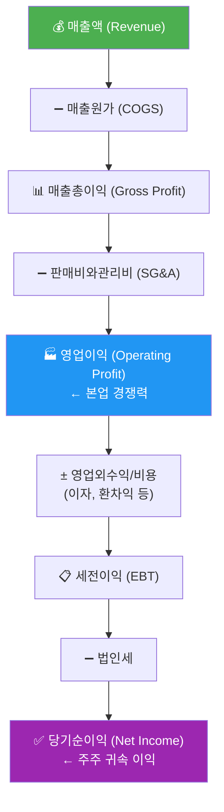
```mermaid
flowchart TD
    A["💰 매출액 (Revenue)"]
    B["➖ 매출원가 (COGS)"]
    C["📊 매출총이익 (Gross Profit)"]
    D["➖ 판매비와관리비 (SG&A)"]
    E["🏭 영업이익 (Operating Profit)\n← 본업 경쟁력"]
    F["±️ 영업외수익/비용\n(이자, 환차익 등)"]
    G["📋 세전이익 (EBT)"]
    H["➖ 법인세"]
    I["✅ 당기순이익 (Net Income)\n← 주주 귀속 이익"]

    A --> B --> C --> D --> E --> F --> G --> H --> I

    style A fill:#4CAF50,color:#fff
    style E fill:#2196F3,color:#fff
    style I fill:#9C27B0,color:#fff
```

- 숫자를 외우기보다, "돈이 들어오고 비용이 빠져서 이익이 남는다"는 구조를 이해하는 것이 핵심입니다.

### 2. 매출액, 영업이익, 순이익 분석

> 📖 **Wikipedia**: [영업이익](https://ko.wikipedia.org/wiki/영업이익) · [당기순이익](https://ko.wikipedia.org/wiki/당기순이익) · [매출총이익](https://ko.wikipedia.org/wiki/매출총이익)


| 지표 | 공식 | 의미 |
|------|------|------|
| **영업이익률** | 영업이익 / 매출액 × 100 | 본업의 수익성 |
| **순이익률** | 순이익 / 매출액 × 100 | 최종 수익성 |
| **매출 성장률** | (금기-전기) / 전기 × 100 | 외형 성장 속도 |

- 매출이 늘어도 이익이 줄 수 있으므로, **성장**과 **수익성**을 항상 함께 봐야 합니다.
- 순이익이 영업이익보다 크면 일회성 자산 매각 등 비경상 이익이 있을 수 있어 주의가 필요합니다.

**손익계산서에서 꼭 확인할 5가지**

| 확인 항목 | 보는 방법 | 해석 포인트 |
|-----------|-----------|-------------|
| **매출액 추세** | 최근 3~5년 매출 성장률 | 시장이 커지는지, 점유율을 잃는지 확인 |
| **매출총이익률** | 매출총이익 / 매출액 | 원가 경쟁력, 가격 결정력 확인 |
| **판관비율** | 판매비와관리비 / 매출액 | 인건비·마케팅비·관리비 부담 확인 |
| **영업이익률** | 영업이익 / 매출액 | 본업의 수익성, 경쟁력 확인 |
| **순이익의 질** | 순이익 vs 영업이익 | 일회성 이익, 금융비용, 세금 영향 확인 |

**좋은 흐름의 예시**


```mermaid
flowchart LR
    A["📈 매출액 증가"] --> B["✅ 매출총이익률\n유지 또는 개선"]
    B --> C["✅ 판관비율 안정"]
    C --> D["📈 영업이익률 개선"]
    D --> E["🏆 본업 경쟁력\n강화 가능성"]

    style A fill:#4CAF50,color:#fff
    style E fill:#2196F3,color:#fff
```

**주의해야 할 흐름의 예시**

| 상황 | 가능한 해석 |
|------|-------------|
| 매출은 증가하지만 영업이익률 하락 | 가격 경쟁, 원가 상승, 마케팅비 증가 |
| 영업이익은 흑자인데 순이익 적자 | 이자비용, 외환손실, 일회성 손실 |
| 영업이익은 적자인데 순이익 흑자 | 자산 매각, 투자수익 등 비경상 이익 가능성 |
| 매출 정체인데 판관비 급증 | 고정비 부담 증가, 경영 효율성 저하 |

### 2-1. 이익·흑자·적자 — 초급자도 이해하는 쉬운 설명

> 📖 **Wikipedia**: [이익](https://ko.wikipedia.org/wiki/이익) · [적자](https://ko.wikipedia.org/wiki/적자_(경제))

**이익(利益, Profit)이란?**

회사가 물건을 팔거나 서비스를 제공해서 번 돈에서, 그것을 만들고 운영하는 데 쓴 비용을 뺀 나머지입니다.

```
🍕 피자 가게 예시

피자 10판 팔아서 번 돈:  100,000원  (매출액)
재료비 + 임대료 + 인건비:  70,000원  (비용)
─────────────────────────────────────
남은 돈:                   30,000원  ← 이것이 "이익"
```

| 용어 | 한자 | 뜻 | 기호 |
|------|------|----|------|
| **이익 (흑자)** | 利益 / 黑字 | 번 돈 > 쓴 돈 → 플러스(+) | ✅ |
| **손실 (적자)** | 損失 / 赤字 | 번 돈 < 쓴 돈 → 마이너스(−) | ❌ |
| **손익분기점** | 損益分岐點 | 이익도 손실도 없는 딱 그 지점 | ➖ |

> 💡 **흑자·적자의 유래**: 옛날 장부에서 이익은 검은 잉크(黑), 손실은 빨간 잉크(赤)로 기록한 데서 비롯됩니다.

**재무제표에서 이익의 3단계**

```
매출액 1,000억
  └─ 매출원가 빼면 → 매출총이익 400억   ← 제품 자체가 얼마나 남기나?
       └─ 판관비 빼면 → 영업이익 200억   ← 본업으로 얼마나 버나?
            └─ 세금 등 빼면 → 순이익 150억 ← 최종적으로 주주에게 남는 이익
```

**적자가 위험한 이유**

적자가 계속되면 회사의 현금이 줄어들고, 결국 빚을 갚지 못해 **부도(不渡)** 또는 **파산(破産)**에 이를 수 있습니다.  
반대로 흑자가 쌓이면 **이익잉여금**으로 자본에 누적되어 회사의 재무 체력이 강해집니다.

### 2-2. 손익계산서 항목별 심층 이해

> 📖 **Wikipedia**: [매출원가](https://ko.wikipedia.org/wiki/매출원가) · [판매비와관리비](https://ko.wikipedia.org/wiki/판매비와관리비) · [고정비](https://ko.wikipedia.org/wiki/고정비) · [변동비](https://ko.wikipedia.org/wiki/변동비)

손익계산서를 처음 보면 숫자가 많아 복잡하게 느껴집니다. 각 항목이 **어떤 비용인지, 왜 중요한지**를 이해하면 기업의 수익 구조를 한눈에 읽을 수 있습니다.

```
매출액 (Revenue)
 ├─ ➖ 매출원가 (COGS)              ← 제품·서비스를 만드는 데 든 직접 비용
 │       └─ 원자재, 제조인건비, 공장 감가상각비 등
 ├─ = 매출총이익 (Gross Profit)     ← "제품 그 자체"의 경쟁력
 ├─ ➖ 판관비 (SG&A)               ← 판매·마케팅·관리 비용
 │       └─ 광고비, 임원 급여, 물류비, 연구개발비(일부) 등
 ├─ = 영업이익 (Operating Profit)   ← 본업으로 번 이익
 ├─ ➖ 이자비용 (Interest Expense)  ← 차입금에 대한 비용 (영업외)
 ├─ ± 기타 영업외 손익              ← 환차익/손, 투자이익 등
 ├─ = 세전이익 (EBT)
 ├─ ➖ 법인세 (Corporate Tax)       ← 세전이익 × 법인세율
 └─ = 당기순이익 (Net Income)       ← 주주에게 귀속되는 최종 이익
```

#### ① 매출원가(COGS, Cost of Goods Sold)

**매출원가**는 제품이나 서비스를 **만드는 데 직접 들어간 비용**입니다.

| 업종 | 매출원가의 주요 구성 |
|------|----------------------|
| 제조업(반도체·자동차) | 원자재비 + 공장 인건비 + 설비 감가상각비 |
| 유통업(편의점·마트) | 상품 매입원가 |
| 소프트웨어·플랫폼 | 서버 운영비 + 클라우드 비용 + 개발인건비(일부) |
| 금융업(은행) | 이자 지급비용(예금 이자 등) ← 은행은 '매출원가'라는 용어 대신 '이자비용'을 영업비용으로 처리하므로 개념적 유사항목으로 이해 |

> 💡 **매출원가율(원가율) = 매출원가 ÷ 매출액 × 100**
> - 원가율이 낮을수록 제품 자체가 "비싸게 팔리고 싸게 만든다"는 뜻 → 높은 경쟁력
> - 명품 브랜드나 소프트웨어 회사는 원가율이 20~40%로 매우 낮음
> - 유통업·식품업은 원가율이 70~85%에 달하기도 함

#### ② 매출 총이익(Gross Profit)

```
매출총이익 = 매출액 − 매출원가
```

**매출총이익**은 가격 결정력과 원가 경쟁력을 보여주는 **가장 순수한 지표**입니다.  
판관비나 금융비용이 포함되기 전이므로, 제품/서비스 자체의 수익성을 나타냅니다.

| 매출총이익률 수준 | 해석 |
|------------------|------|
| **40% 이상** | 브랜드·독점 기술 등 가격 결정력 우수 (애플·LVMH·엔비디아 등) |
| **20~40%** | 제조·소비재 평균 구간, 업종별 편차 큼 |
| **10% 미만** | 경쟁 심한 유통업·원자재 산업, 마진 확보 어려움 |

> 📌 **투자 체크포인트**: 매출이 늘어나는데 매출총이익률이 하락한다면, 원가 상승(원자재·인건비)이나 가격 인하 압력이 있다는 신호입니다.

#### ③ 판매비와관리비(SG&A, Selling, General & Administrative Expenses)

**판관비**는 제품을 만든 이후에 발생하는 **운영·관리 비용** 전체입니다.

| 구분 | 주요 항목 | 특징 |
|------|-----------|------|
| **판매비** | 광고·마케팅비, 영업사원 인건비, 물류비, A/S 비용 | 매출 규모에 따라 변동 |
| **관리비** | 임원·사무직 급여, 임차료, 감가상각비(본사), 법률·회계비용 | 상대적으로 고정적 |

**영업비용(판관비)에 포함되는 주요 종류**

| 종류 | 설명 |
|------|------|
| **급여/복리후생비** | 영업·관리 인력 인건비와 복리후생비로, 기업의 고정비 성격이 강한 핵심 항목 |
| **광고선전비/마케팅비** | 브랜드 인지도·고객 유입을 위한 비용으로, 성장기 기업에서 비중이 크게 나타날 수 있음 |
| **지급수수료** | 외부 용역, 플랫폼 사용료, 결제 수수료, 자문료 등 제3자 서비스 이용 대가 |
| **임차료/관리비** | 사무실·매장 임차료, 공용관리비 등 영업 인프라 유지 비용 |
| **감가상각비** | 본사 비품·IT 장비·매장 인테리어 등 유형자산의 사용분을 기간비용으로 배분한 금액 |
| **운반비/배송비** | 제품·상품을 고객에게 전달하는 과정에서 발생하는 물류 관련 비용 |
| **대손상각비(판매채권 관련)** | 외상매출금 회수 불능 가능성을 반영하는 비용으로, 신용판매 비중이 큰 업종에서 중요 |
| **연구개발비(R&D)** | 회계정책과 업종 특성에 따라 판관비 또는 매출원가로 분류될 수 있어 별도 확인 필요 |

> 💡 판관비는 일반적으로 **고정비 성격**이 강합니다.  
> 따라서 매출이 급증할 때 판관비율(판관비/매출)이 낮아지면 영업 레버리지 효과가 발생합니다.

**판관비 분석 시 주의점**

- 스타트업이나 성장기 기업은 판관비(특히 마케팅비)가 커도 미래 성장을 위한 투자일 수 있음
- 성숙기 기업인데 판관비가 매년 매출보다 빠르게 증가한다면 비효율 신호
- **R&D(연구개발비)**: 회계 처리에 따라 매출원가 또는 판관비에 포함될 수 있으며, R&D 비중이 높은 반도체·바이오는 별도로 확인 필요

#### ④ 이자비용(Interest Expense)과 세금(Tax)

**이자비용**은 영업이익 아래 **'영업외비용'** 으로 처리됩니다.

```
영업이익  →  (+ 이자수익 / − 이자비용 / ± 기타 영업외)  →  세전이익  →  (− 법인세)  →  당기순이익
```

| 항목 | 발생 이유 | 투자자 관점 포인트 |
|------|-----------|-------------------|
| **이자비용** | 은행 차입금, 회사채 등 타인자본 조달 비용 | 부채 규모·금리 수준 확인 → 이자보상배율 = 영업이익 ÷ 이자비용 (일반적으로 3배 이상을 안정으로 보나, 업종·자본집약도에 따라 기준이 다름) |
| **법인세** | 세전이익에 법인세율(한국 약 24%)을 곱한 금액 | 유효세율 = 법인세 ÷ 세전이익, 세금 감면·이연세 등으로 실효세율이 달라짐 |

> 📌 **이자보상배율 < 1**이면 영업이익으로 이자도 못 내는 상황 → 재무 위기 신호

#### ⑤ 고정비 vs 변동비 — 비용 구조의 핵심

비용을 **매출 변화에 따라 움직이는지** 여부로 나누면 기업의 수익 구조가 명확해집니다.

| 구분 | 정의 | 대표 항목 | 특징 |
|------|------|-----------|------|
| **고정비** (Fixed Cost) | 매출이 늘거나 줄어도 **거의 변하지 않는** 비용 | 공장 임차료, 감가상각비, 정규직 인건비, 이자비용 | 매출 증가 시 단위당 고정비 감소 → 이익 폭발 |
| **변동비** (Variable Cost) | 매출·생산량에 **비례해서 늘어나는** 비용 | 원자재비, 판매 수수료, 포장재비, 배송비 | 매출에 따라 선형적으로 증가 |

**변동비 더 알아보기**

변동비는 제품 1개를 더 만들거나 팔 때마다 추가로 드는 비용(한계비용, Marginal Cost)에 가깝습니다.

- 변동비 비중이 높은 업종(유통·식품): 매출이 늘어도 이익이 완만하게 증가, 대신 매출이 줄어도 손실 폭이 작음
- 변동비 비중이 낮은 업종(소프트웨어·반도체): 초반에 적자가 크지만, 손익분기점을 넘으면 이익이 가파르게 증가

**손익분기점(BEP, Break-Even Point) 계산**

```
손익분기점 매출액 = 고정비 ÷ (1 − 변동비율)
변동비율 = 변동비 ÷ 매출액
```

> 예) 고정비 100억, 변동비율 60% → BEP = 100억 ÷ 0.4 = **250억 매출이면 이익 0**
> → 매출 1원당 공헌이익(기여마진) = 1원 × (1 − 0.6) = **40전**. BEP(250억)를 초과하는 매출에서 이 40전이 이익으로 쌓임
> ※ 변동비(60전)는 BEP 이후에도 여전히 발생하므로, 매출 전체가 이익이 되는 것은 아님

#### ⑥ 반도체 기업의 영업 레버리지 — "고정비가 높아도 이익이 폭발하는 이유"

반도체 회사(삼성전자·SK하이닉스·TSMC 등)는 **공장(팹) 건설에 수십조 원**이 들어갑니다. 이 설비 투자는 감가상각비라는 **거대한 고정비**로 매년 손익계산서에 반영됩니다.

```
🏭 반도체 공장 시나리오 (단위: 억 원)

                    불황기 (매출 낮음)    호황기 (매출 높음)
매출액              5,000               15,000
 ─ 변동비(40%)      2,000                6,000
 ─ 고정비(감가상각 등)  4,000                4,000   ← 고정비는 그대로!
 = 영업이익          -1,000  ❌            5,000  🚀

영업이익률           -20%                +33%
```

- 고정비 4,000억은 매출이 5,000억이든 15,000억이든 **변하지 않습니다**.
- 매출이 3배로 늘면, **고정비는 3등분되어 제품 1개당 부담이 줄고** 이익이 폭발적으로 증가합니다.
- 반대로 매출이 줄면 고정비를 커버하지 못해 **적자 전환 속도도 빠릅니다**.

> 💡 **영업 레버리지(Operating Leverage)**: 고정비 비중이 높을수록, 매출 증가에 따른 이익 증가 폭이 커지는 현상입니다.  
> **영업 레버리지 배율 = 매출총이익 ÷ 영업이익** — 배율이 높을수록 매출 변화에 이익이 크게 반응합니다.

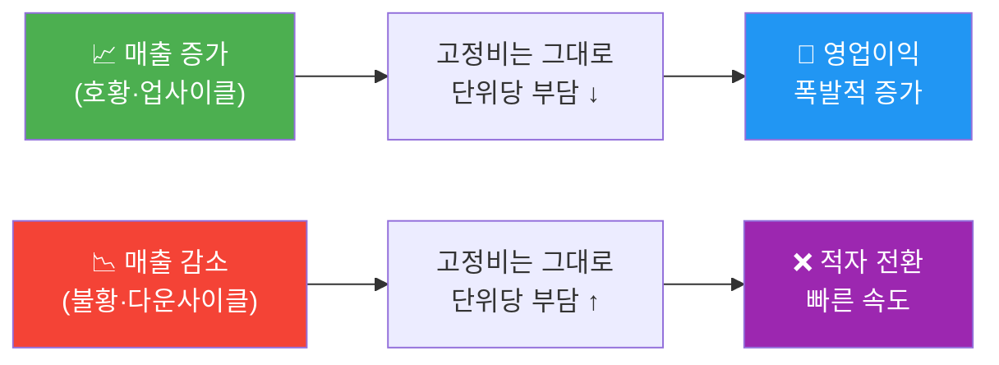
```mermaid
graph LR
    A["📈 매출 증가\n(호황·업사이클)"] --> B["고정비는 그대로\n단위당 부담 ↓"]
    B --> C["🚀 영업이익\n폭발적 증가"]
    D["📉 매출 감소\n(불황·다운사이클)"] --> E["고정비는 그대로\n단위당 부담 ↑"]
    E --> F["❌ 적자 전환\n빠른 속도"]

    style A fill:#4CAF50,color:#fff
    style C fill:#2196F3,color:#fff
    style D fill:#F44336,color:#fff
    style F fill:#9C27B0,color:#fff
```

**반도체·디스플레이·배터리 업종 공통 특성**

| 특성 | 설명 | 투자자 시사점 |
|------|------|---------------|
| 초기 고정비 매우 큼 | 팹 1개에 수십조 투자, 매년 수조 감가상각 | 불황기 적자가 크지만 매출 회복 시 이익 회복도 빠름 |
| 변동비 비중 낮음 | 원자재·전기료는 들지만 고정비 대비 작음 | 가동률(Utilization Rate)이 이익의 핵심 변수 |
| 사이클 산업 | 공급·수요 불균형으로 가격 급변 | 업사이클 진입 초기에 투자 매력도가 가장 높음 |

> 📌 **가동률 = 실제 생산량 ÷ 최대 생산능력 × 100**  
> 가동률이 70%→90%로 오르면 추가 고정비 없이 매출과 이익이 동시에 급증합니다.

#### ⑦ 금융업의 주사업 수익 종류와 영업비용 — 쉬운 예시로 이해하기

일반 제조업·서비스업과 달리 **금융업(은행·증권·보험 등)**은 수익과 비용 구조가 독특합니다.  
손익계산서에서도 '매출액' 대신 **'영업수익'**, '매출원가' 대신 **'이자비용·보험금 등'** 이라는 용어를 씁니다.

---

##### 🏦 금융업종별 주사업 수익 종류

| 금융업종 | 주요 수익 항목 | 쉬운 예시 |
|----------|--------------|-----------|
| **은행** | **이자수익** | 내가 은행에서 연 5% 대출을 받으면 → 은행 입장에선 그 5% 이자가 수익 |
| | **수수료수익** | 인터넷뱅킹 이체 수수료, ATM 출금 수수료, 외환 환전 수수료 |
| | **외환·파생 거래이익** | 달러를 싸게 사서 비싸게 팔아 남기는 환차익 |
| **증권사** | **위탁매매 수수료** | 고객이 삼성전자 주식 1,000만 원어치 살 때 0.015% 받는 거래 수수료 |
| | **IB(투자은행) 수수료** | 기업이 IPO(상장)하거나 회사채 발행 시 받는 주관 수수료 |
| | **자기매매이익** | 증권사가 자기 돈으로 주식·채권을 사고팔아 남기는 시세차익 |
| | **운용보수** | 펀드 순자산의 연 1~2%씩 떼는 펀드 운용보수 |
| **보험사** | **보험료수익(수입보험료)** | 가입자가 매달 내는 보험료 — 사고가 없으면 보험사가 남기는 구조 |
| | **투자(운용)수익** | 모아 둔 보험료를 채권·주식에 투자해서 얻는 이자·배당·시세차익 |
| **카드사·캐피탈** | **카드 수수료수익** | 편의점에서 카드 결제 시 가맹점에서 받는 1~2%의 가맹점 수수료 |
| | **할부·리스 이자수익** | "36개월 무이자" 대신 유이자 할부 시 고객에게 받는 할부 금융이자 |
| | **연회비** | 카드 연회비(예: 프리미엄 카드 연 10만 원) |

> 💡 **핵심 포인트**: 금융업은 "돈을 빌려주거나 중간에서 연결해주는 대가"로 돈을 법니다.  
> - 은행: 예금 이자(저금리)로 모아 → 대출 이자(고금리)로 빌려줌 → **예대마진**이 핵심 수익  
> - 증권사: 매매를 대신 해주고 → **수수료**를 받음  
> - 보험사: 미리 보험료를 모아 → 사고가 날 때 보험금 지급 → 남은 돈을 **투자해서 운용**

---

##### 💸 금융업의 주요 영업비용 종류

| 영업비용 항목 | 해당 업종 | 쉬운 예시 |
|--------------|----------|-----------|
| **이자비용(수신이자)** | 은행·저축은행 | 내 예금통장에 연 3% 이자를 줄 때 → 은행 입장에선 그 3%가 비용 |
| **보험금 지급비용** | 보험사 | 가입자가 교통사고 났을 때 보험사가 치료비·수리비로 지급하는 돈 |
| **매매손실·평가손실** | 증권사·보험사 | 자기가 보유한 주식·채권 가격이 내려갔을 때 인식하는 손실 |
| **대손상각비(충당금)** | 은행·캐피탈 | "이 대출, 못 받을 것 같다"며 미리 비용으로 잡아두는 금액 (부실채권 충당금) |
| **운용보수 지급** | 자산운용사 → 판매사 | 펀드를 판 은행·증권사에 판매수수료 나눠주는 비용 |
| **인건비·복리후생비** | 전 업종 공통 | 지점 행원 급여, 딜러·애널리스트 성과급 등 |
| **전산·IT 운영비** | 전 업종 공통 | 온라인뱅킹·HTS·MTS 서버 유지비, 보안 시스템 운영비 |
| **지점 임차료·감가상각** | 은행·보험 | 전국 지점 임차료, ATM 기기 감가상각비 |
| **마케팅·광고비** | 카드사·핀테크 | 신규 카드 발급 혜택 광고비, 앱 다운로드 이벤트 비용 |

> 💡 **은행의 핵심 수익성 지표: NIM(순이자마진)**
>
> ```
> NIM(Net Interest Margin) = (이자수익 − 이자비용) ÷ 평균 이자부 자산
> ```
>
> NIM이 1.5~2.5% 수준이면 양호한 편이며, 금리가 오르면 NIM이 확대되어 은행 이익이 늘어납니다.

**금융업 손익 흐름 한눈에 보기 (은행 예시)**

```
[수익]
  이자수익(대출 이자 5%)     +100억
  수수료수익                  +10억
  외환거래이익                 +5억
                            ─────────
  영업수익 합계               115억

[비용]
  이자비용(예금 이자 3%)      -60억
  대손충당금전입액             -10억
  인건비·운영비               -20억
                            ─────────
  영업비용 합계                90억

[결과]
  영업이익                     25억  ← 예대마진 + 수수료로 남긴 이익
```

> 📌 **투자 체크포인트**: 금융업 분석 시 일반 제조업 비율(영업이익률, 원가율)보다  
> **NIM(순이자마진), 대손비율(NPL), BIS 자기자본비율, 손해율(보험)**을 우선 확인하세요.

---

### 2-3. 매출은 잡혔는데 현금은 왜 없을까? (재고·외상·진행률 인식)

매출과 현금은 **기록 기준 시점이 다릅니다.**

| 구분 | 언제 잡히나? | 핵심 포인트 |
|------|--------------|-------------|
| **매출(손익계산서)** | 상품·서비스를 제공한 시점(발생주의) | "팔았다"가 기준 |
| **현금흐름(현금흐름표)** | 실제로 돈이 입금된 시점(현금주의) | "돈이 들어왔다"가 기준 |

#### ① 재고가 늘면 왜 현금이 나빠질까?

- 회사가 원재료·상품을 사서 재고로 쌓으면, 이미 현금은 나갔습니다.
- 그런데 아직 판매되지 않았다면 매출은 안 잡히므로, **현금은 먼저 줄고 이익은 아직 안 보이는** 구간이 생깁니다.
- 재고가 과도하게 늘면 할인 판매·평가손실 위험까지 커집니다.

#### ② 외상매출(매출채권)은 이익일까?

- 외상으로 판매하면 회계상 매출·이익은 인식될 수 있습니다.
- 하지만 돈을 아직 못 받았으므로 현금흐름에는 바로 도움이 안 됩니다.
- 즉, **"이익은 났는데 현금이 부족한"** 상황이 생길 수 있습니다.

> 한 줄 정리: **외상매출은 회계상 이익일 수 있지만, 곧바로 현금은 아닙니다.**

#### ③ 조선·건설처럼 몇 년 걸리는 사업은 왜 매출이 먼저 잡히나?

- 조선·건설·플랜트는 계약부터 완공까지 2~5년 이상 걸릴 수 있습니다.
- 그래서 보통 공사 진행 정도(진행률)에 따라 매출을 나눠 인식합니다.
- 대금은 중간·완공 시점에 단계적으로 들어오므로, **매출 인식 속도와 현금 입금 속도**가 다를 수 있습니다.

#### ④ 그럼 현금흐름이 "좋다/나쁘다"는 어떻게 판단할까?

| 점검 질문 | 좋지 않은 신호 |
|-----------|----------------|
| 영업이익이 늘 때 영업현금흐름(CFO)도 같이 느는가? | 이익은 증가하는데 CFO 정체/감소 |
| 매출채권 증가율이 매출 증가율보다 높은가? | 외상 비중 확대로 회수 지연 가능성 |
| 재고자산 증가율이 매출 증가율보다 높은가? | 재고 적체·현금 묶임 가능성 |
| CFO가 계속 마이너스인데 차입으로 버티는가? | 본업 현금창출력 약화 가능성 |

#### ⑤ 주식 투자에서 꼭 함께 체크할 것

1. **손익계산서**: 매출·영업이익 추세가 좋아지는지
2. **재무상태표**: 매출채권·재고자산이 과도하게 늘지 않는지
3. **현금흐름표**: 영업현금흐름(CFO)이 순이익과 함께 개선되는지
4. **결론**: "이익 성장"과 "현금 회수"가 같이 가는 기업을 우선 검토

> 📌 투자 실무에서는 **매출 성장 자체보다, 매출이 현금으로 잘 전환되는지(현금 전환력)**를 더 중요하게 봅니다.

### 3. 대차대조표(Balance Sheet) 구조 이해

> 📖 **Wikipedia**: [대차대조표](https://ko.wikipedia.org/wiki/대차대조표)


손익계산서가 **기간의 흐름**이라면, 대차대조표는 **특정 시점의 스냅샷**입니다.

#### 자산·부채·자본이란?

| 구분 | 한 마디 | 회계 정의 |
|------|---------|-----------|
| **자산 (Assets)** | 🏦 회사가 가진 것 | **미래에 경제적 이익을 가져다 줄 자원** — 현금을 벌어주거나, 비용을 줄이거나, 다른 자산으로 교환할 수 있는 모든 것 |
| **부채 (Liabilities)** | ⚠️ 남의 돈 | 언젠가 갚아야 하는 의무 — 은행 대출, 회사채, 외상매입금 등 |
| **자본 (Equity)** | 💚 내 돈 | 주주가 투자한 돈 + 회사가 벌어서 쌓아온 이익잉여금 |

> 💡 **핵심 항등식**: **자산 = 부채(남의 돈) + 자본(내 돈)**  
> 즉, 회사의 모든 자산은 "남에게 빌려온 돈"과 "주주 스스로의 돈" 두 가지 원천에서 만들어집니다.

#### 조달 · 비용 · 운용 · 성과 프레임으로 읽는 재무상태표

재무상태표를 "돈의 흐름"으로 이해하면 4가지 질문으로 정리됩니다.

| 관점 | 질문 | 재무상태표 위치 | 핵심 내용 |
|------|------|----------------|-----------|
| **조달** — 어떻게 돈을 모았나? | 자금을 어디서 가져왔는가? | **오른쪽** (부채 + 자본) | 부채(남의 돈 차입)와 자본(주주 투자·이익 적립)의 비율이 얼마인가 |
| **비용** — 조달 비용은 얼마인가? | 빌린 돈의 이자, 주주의 기대수익은? | 손익계산서 이자비용 / ROE 기준 | 부채는 **이자비용**, 자본은 **주주 기대수익률(COE)** |
| **운용** — 조달한 돈을 어디에 썼나? | 자산으로 어떻게 배치했는가? | **왼쪽** (자산) | 유동자산(단기 활용)·비유동자산(장기 투자)의 구성 |
| **성과** — 운용 결과는? | 자산이 얼마나 이익을 냈는가? | 손익계산서 순이익 → 이익잉여금 | ROA(자산 대비 이익), ROE(자본 대비 이익)로 측정 |

```
[조달] 부채(남의 돈) + 자본(내 돈)
          ↓ 투자·배치
[운용] 자산: 유동자산 + 비유동자산
          ↓ 영업·사업 활동
[성과] 손익계산서 → 순이익
          ↓ 이익 적립
[환류] 이익잉여금 → 자본 증가 → 재투자
```

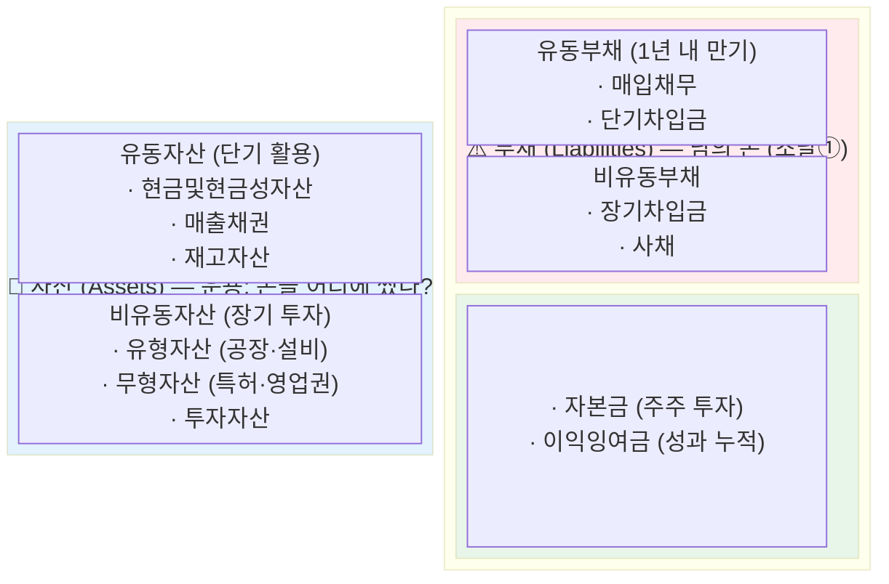
```mermaid
block-beta
  columns 2

  block:assets["🏦 자산 (Assets) — 운용: 돈을 어디에 썼나?"]:1
    columns 1
    A1["유동자산 (단기 활용)\n· 현금및현금성자산\n· 매출채권\n· 재고자산"]
    A2["비유동자산 (장기 투자)\n· 유형자산 (공장·설비)\n· 무형자산 (특허·영업권)\n· 투자자산"]
  end

  block:right:1
    columns 1
    block:liabilities["⚠️ 부채 (Liabilities) — 남의 돈 (조달①)"]:1
      columns 1
      L1["유동부채 (1년 내 만기)\n· 매입채무\n· 단기차입금"]
      L2["비유동부채\n· 장기차입금\n· 사채"]
    end
    block:equity["💚 자본 (Equity) — 내 돈 (조달②)"]:1
      columns 1
      E1["· 자본금 (주주 투자)\n· 이익잉여금 (성과 누적)"]
    end
  end

  style assets fill:#E3F2FD
  style liabilities fill:#FFEBEE
  style equity fill:#E8F5E9
```

> **핵심 항등식**: 자산(Assets) = 부채(Liabilities) + 자본(Equity)

- 자산이 크더라도 부채가 과도하면 위험할 수 있으므로 **규모보다 구성과 균형**을 봐야 합니다.

### 4. 자산·부채·자본 분석

> 📖 **Wikipedia**: [자기자본이익률](https://ko.wikipedia.org/wiki/자기자본이익률) · [부채비율](https://ko.wikipedia.org/wiki/부채비율) · [유동비율](https://ko.wikipedia.org/wiki/유동비율)


**주요 안전성 지표**

| 지표 | 공식 | 해석 기준 |
|------|------|-----------|
| **부채비율** | 부채 / 자본 × 100 | 100% 이하 안정, 200% 이상 주의 |
| **유동비율** | 유동자산 / 유동부채 × 100 | 150% 이상 양호 |
| **이자보상배율** | 영업이익 / 이자비용 | 1배 이하 위험 |

- 자산이 얼마나 효율적으로 쓰이는지 (ROA = 순이익 / 자산), 부채가 감당 가능한 수준인지, 자본이 꾸준히 늘어나는지를 함께 확인합니다.

**대차대조표에서 꼭 확인할 6가지**

| 확인 항목 | 질문 | 투자 관점 |
|-----------|------|-----------|
| **현금및현금성자산** | 당장 쓸 수 있는 현금이 충분한가? | 경기 둔화와 투자 기회에 버틸 여력 |
| **매출채권** | 매출보다 매출채권이 더 빨리 늘지는 않는가? | 팔았지만 아직 돈을 못 받은 매출 가능성 |
| **재고자산** | 재고가 매출보다 빠르게 쌓이지 않는가? | 수요 둔화, 가격 인하, 평가손실 위험 |
| **유형자산** | 설비투자가 매출 증가로 이어지는가? | 제조업·반도체·배터리에서 중요 |
| **단기차입금/유동부채** | 1년 안에 갚아야 할 부담이 큰가? | 유동성 위험, 차환 리스크 |
| **이익잉여금** | 벌어둔 이익이 자본에 누적되는가? | 장기 수익성과 재무 체력 |

**대차대조표 분석 순서**

1. 자산이 늘었는지 먼저 봅니다.
2. 자산 증가가 부채 증가 때문인지, 이익 누적 때문인지 나눠 봅니다.
3. 유동자산과 유동부채를 비교해 단기 지급능력을 봅니다.
4. 매출채권·재고자산이 매출보다 빠르게 늘면 이익의 질을 의심합니다.
5. 부채비율과 이자보상배율로 차입 부담을 확인합니다.

**손익계산서와 연결해서 읽기**

| 손익계산서 변화 | 대차대조표에서 확인할 것 |
|----------------|--------------------------|
| 매출 급증 | 매출채권도 같이 급증했는지 확인 |
| 원가율 상승 | 재고자산 평가손실이나 원재료 부담 확인 |
| 영업이익 개선 | 현금과 이익잉여금 증가로 이어졌는지 확인 |
| 이자비용 증가 | 차입금과 부채비율이 상승했는지 확인 |

### 4-1. 부채 — 초급자도 이해하는 쉬운 설명

> 📖 **Wikipedia**: [부채](https://ko.wikipedia.org/wiki/부채_(회계))

**부채(負債, Debt/Liability)란?**

회사가 다른 곳에서 빌린 돈이나, 나중에 갚아야 할 의무가 있는 돈입니다.  
쉽게 말하면 **"남에게 빌린 돈"** 입니다.

```
🏠 집 구입 비유

집값 5억 (자산)
  ├── 내 돈 2억 (자본)
  └── 은행 대출 3억 ← 이것이 "부채"
        │
        └── 매달 이자 내야 함 → 이자비용
```

**부채의 두 가지 종류**

| 구분 | 뜻 | 예시 |
|------|-----|------|
| **유동부채** | 1년 안에 갚아야 하는 빚 | 단기차입금, 외상매입금(매입채무) |
| **비유동부채** | 1년 넘어 갚아도 되는 빚 | 장기차입금, 회사채(사채) |

**부채가 무조건 나쁜 건 아닙니다**

| 상황 | 해석 |
|------|------|
| 부채로 공장 짓고 → 매출·이익 증가 | **좋은 부채** (레버리지 효과) |
| 부채가 너무 많아 → 이자도 못 냄 | **나쁜 부채** (재무 위험) |

> 💡 **핵심 공식**: 부채비율(%) = 부채 ÷ 자본 × 100  
> 100% 이하면 안정적, 200% 이상이면 주의 필요

### 4-2. ROE·ROI·ROA — 수익성 지표 쉬운 설명

> 📖 **Wikipedia**: [자기자본이익률(ROE)](https://ko.wikipedia.org/wiki/자기자본이익률) · [투자수익률(ROI)](https://ko.wikipedia.org/wiki/투자수익률)


이 세 지표는 모두 **"투입 대비 얼마나 벌었나?"** 를 측정합니다. 무엇을 기준으로 계산하느냐가 다를 뿐입니다.

#### ROE (Return on Equity, 자기자본이익률)

**"내가 직접 투자한 내 돈으로 얼마나 벌었나?"**

```
ROE(%) = 당기순이익 ÷ 자기자본(평균) × 100

예시: 순이익 200억 ÷ 자기자본 1,000억 × 100 = ROE 20%
→ 내 돈 1,000억을 투자해서 200억을 벌었다는 뜻
```

- **높을수록 좋습니다** (보통 10% 이상이면 우량, 15~20% 이상이면 탁월)
- 워런 버핏이 가장 중요하게 보는 지표 중 하나입니다.
- 단, 부채를 지나치게 많이 써서 ROE를 부풀릴 수도 있으므로 부채비율과 함께 봐야 합니다.

#### ROI (Return on Investment, 투자수익률)

**"투자한 돈 전체(내 돈+빌린 돈)로 얼마나 벌었나?"**

```
ROI(%) = (순이익 + 이자비용) ÷ 총투자액 × 100
       또는
ROI(%) = (투자 수익 − 투자 비용) ÷ 투자 비용 × 100

예시: 주식 100만원어치 샀는데 120만원이 됐다면
      ROI = (120만 − 100만) ÷ 100만 × 100 = 20%
```

- 투자 결정의 타당성을 평가할 때 씁니다.
- 기업뿐 아니라 **개인 투자자의 수익률 계산**에도 사용합니다.

#### ROA (Return on Assets, 총자산이익률)

**"회사가 갖고 있는 모든 자산(내 돈+빌린 돈)으로 얼마나 벌었나?"**

```
ROA(%) = 당기순이익 ÷ 총자산(평균) × 100

예시: 순이익 200억 ÷ 총자산 4,000억 × 100 = ROA 5%
→ 가진 자산 4,000억으로 200억을 벌었다는 뜻
```

- 자산 활용 효율을 봅니다.
- 은행·금융업종에서 특히 중요하게 씁니다.

**세 지표 한눈에 비교**

| 지표 | 분모 (기준) | 핵심 질문 | 좋은 수준 |
|------|------------|---------|---------|
| **ROE** | 자기자본 | 주주 돈으로 얼마나 벌었나? | 10% 이상 |
| **ROI** | 투자 비용 | 이 투자가 수익이 났나? | 투자 목표 대비 |
| **ROA** | 총자산 | 자산 전체를 얼마나 효율적으로 쓰나? | 5% 이상 |

```
ROE vs ROA 관계
ROE = ROA × (총자산 / 자기자본)
    = ROA × (1 + 부채비율/100)

→ 부채가 많을수록 ROA보다 ROE가 높게 나옴
   (레버리지 효과 — 양날의 검)
```

### 4-3. 유동성 지표 — 단기 지급능력 한눈에 보기

> 📖 **Wikipedia**: [유동비율](https://ko.wikipedia.org/wiki/유동비율) · [당좌비율](https://ko.wikipedia.org/wiki/당좌비율)


**"흑자인데 부도?" — 유동성이 없으면 이익도 소용없습니다.**

회사가 이익을 내고 있어도, 당장 갚아야 할 빚을 낼 현금이 없으면 **흑자부도(黑字倒産)**에 빠집니다.  
유동성 지표는 "지금 당장 빚을 갚을 수 있는가?"를 숫자로 보여줍니다.

```
🏪 편의점 비유

오늘 매출: 100만원 (이익은 있음)
오늘 갚아야 할 재료비·임대료: 150만원

→ 이익이 있어도 현금이 없으면 문을 닫아야 합니다. ← 유동성 위기
```

**4가지 핵심 유동성 지표**

| 지표 | 공식 | 기준 | 의미 |
|------|------|------|------|
| **유동비율** | 유동자산 / 유동부채 × 100 | 150% 이상 양호 | 1년 내 자산으로 1년 내 빚 감당 가능성 |
| **당좌비율** | (유동자산 − 재고) / 유동부채 × 100 | 100% 이상 권장 | 재고 제외 즉시 현금화 가능 자산 기준 |
| **현금비율** | 현금및현금성자산 / 유동부채 × 100 | 20% 이상 참고 | 가장 보수적인 단기 지급능력 지표 |
| **운전자본** | 유동자산 − 유동부채 | 양수 = 안정 | 음수이면 단기 유동성 위기 신호 |

**현금전환주기(CCC) — 돈이 얼마나 빨리 돌아오나?**

```
CCC = 재고보유기간 + 매출채권회수기간 − 매입채무지급기간

짧을수록 → 현금이 빠르게 회전 → 유동성 양호
길어질수록 → 현금이 묶이는 기간 증가 → 유동성 압박
```

**유동성 위험 신호 5가지**

| 신호 | 해석 |
|------|------|
| 유동부채가 유동자산보다 빠르게 증가 | 단기 상환 능력 약화 |
| 매출채권이 매출보다 빠르게 급증 | 팔았지만 돈을 못 받는 이익 가능성 |
| 재고자산이 지속 증가 | 수요 둔화, 현금화 지연 |
| 단기차입금 의존도 상승 | 이자 부담 증가, 차환 리스크 |
| 영업현금흐름이 반복적으로 마이너스 | 본업에서 현금을 못 벌고 있음 |

> 💡 **핵심 체크**: 재무상태표의 유동비율이 높더라도, 현금흐름표의 영업현금흐름이 마이너스라면 이익의 질을 의심하세요.

### 5. 실습: DART 공시 재무제표 데이터 수집 및 분석


DART(전자공시시스템)는 한국 상장기업의 공식 재무 데이터를 얻을 수 있는 가장 신뢰할 수 있는 원천입니다.

**yfinance로 손익계산서 분석 (글로벌 상장 주식)**


**DART OpenAPI로 한국 상장기업 재무 데이터 수집**


- 실습에서는 숫자를 단순히 가져오는 데서 끝나지 않고, **최근 3~5년 변화 방향**을 읽는 것이 중요합니다.
- **연결 기준인지 별도 기준인지**, **연간인지 분기인지** 구분해야 숫자를 잘못 해석하지 않습니다.

---

#### 5-1. 고도화 목표: 동적 DART 재무제표 분석 웹앱

이번 실습의 목표는 단순히 DART 재무제표를 한 번 조회하는 것이 아니라, **기업 검색 → 공시 선택 → 재무제표 수집 → 표준 계정 매핑 → 재무비율 분석 → 문서 양식 시뮬레이션 → 웹/PDF 리포트 출력**까지 이어지는 동적 웹앱을 설계하는 것입니다.

최종 산출물:

| 산출물 | 파일/화면 | 설명 |
|---|---|---|
| 기업 검색 데이터 | `dart_companies.csv` | DART 고유번호, 종목코드, 회사명 |
| 원천 재무제표 | `dart_financial_raw.csv` | DART API 응답 원본 정리 |
| 표준 재무제표 | `financial_statement_standard.csv` | 회사별 다른 계정명을 표준 계정으로 매핑 |
| 재무비율 데이터 | `financial_ratios.csv` | 수익성, 안정성, 성장성, 활동성 지표 |
| 웹 대시보드 | `/api/dart/financial-dashboard` | 동적 재무 분석 결과 반환 |
| 문서 시뮬레이터 | `/api/dart/document-simulate` | 손익계산서/재무상태표/요약보고서 양식 생성 |
| PDF 리포트 | `financial_report.pdf` | 회사별 분석 보고서 출력 |

---

#### 5-2. DART API 수집 흐름

OpenDART는 공시 원문과 주요 재무 계정, 대량 재무정보를 API 형태로 제공합니다. 실습에서는 아래 순서로 구현합니다.

```text
1. 인증키 준비
2. corpCode.xml 또는 기업 검색 API로 corp_code 확보
3. 공시 목록 조회
4. 단일회사 전체 재무제표 조회
5. 계정명 표준화
6. 손익계산서/재무상태표/현금흐름표 분리
7. 재무비율 계산
8. 웹 대시보드 및 PDF 문서 출력
```

**주요 DART 파라미터**

| 파라미터 | 예시 | 설명 |
|---|---|---|
| `crtfc_key` | `DART_API_KEY` | OpenDART 인증키 |
| `corp_code` | `00126380` | DART 기업 고유번호 |
| `bsns_year` | `2024` | 사업연도 |
| `reprt_code` | `11011` | 사업보고서 |
| `fs_div` | `CFS`, `OFS` | 연결/별도 재무제표 |

**보고서 코드**

| 코드 | 보고서 |
|---|---|
| `11013` | 1분기보고서 |
| `11012` | 반기보고서 |
| `11014` | 3분기보고서 |
| `11011` | 사업보고서 |

---

#### 5-3. 기업 고유번호 캐시 만들기

기업 검색을 매번 API로 처리하면 느립니다. 먼저 DART 고유번호 파일을 내려받아 캐시합니다.


---

#### 5-4. 여러 연도·여러 보고서 동적 수집

기존 실습은 한 회사의 한 연도만 조회합니다. 웹앱에서는 사용자가 기간과 보고서 종류를 선택할 수 있어야 합니다.


---

#### 5-5. 회사별 계정명 표준화

DART 재무제표는 회사와 업종에 따라 계정명이 다르게 나올 수 있습니다. 예를 들어 매출은 `매출액`, `수익(매출액)`, `영업수익` 등으로 표시될 수 있습니다. 웹앱은 표준 계정 매핑을 제공하고, 사용자가 직접 매핑을 수정할 수 있어야 합니다.


**웹앱 고도화 포인트**

| 기능 | 설명 |
|---|---|
| 자동 매핑 | 계정명 alias 사전으로 표준 계정 자동 분류 |
| 수동 매핑 | 사용자가 미분류 계정을 드래그해 표준 계정에 연결 |
| 매핑 저장 | 회사/업종별 매핑 규칙을 JSON으로 저장 |
| 경고 표시 | 매출, 영업이익, 자산총계 등 필수 계정 누락 시 경고 |

---

#### 5-6. 재무비율 자동 계산


**분석 축**

| 분석 축 | 지표 |
|---|---|
| 성장성 | 매출 성장률, 영업이익 성장률, 순이익 성장률 |
| 수익성 | 영업이익률, 순이익률, ROE, ROA |
| 안정성 | 부채비율, 유동비율, 차입금 의존도 |
| 활동성 | 자산회전율, 재고자산 회전율, 매출채권 회전율 |
| 이익의 질 | 영업이익 vs 순이익, 매출채권/재고 증가율 |

---

#### 5-7. 동적 재무제표 웹 대시보드 설계

기존 웹앱의 `financialStatement.js`는 손익계산서, 재무상태표, 현금흐름표 이미지를 카드로 보여주는 정적 화면입니다. 고도화 버전은 DART 데이터를 직접 조회하고 사용자가 분석 범위를 바꾸는 동적 화면으로 만듭니다.

```text
상단 검색
  - 기업명/종목코드 검색
  - 연결/별도 선택
  - 연간/분기 선택
  - 조회 연도 범위 선택

1행: 요약 KPI
  - 매출액
  - 영업이익
  - 순이익
  - 자산총계
  - 부채비율
  - ROE

2행: 재무제표 탭
  - 손익계산서
  - 재무상태표
  - 현금흐름표
  - 표준 계정 매핑

3행: 분석 차트
  - 5년 매출/영업이익 추이
  - 영업이익률/순이익률 추이
  - 자산/부채/자본 구성
  - ROE/ROA/부채비율

4행: 문서 시뮬레이터
  - 은행 제출용 재무요약서
  - 투자검토 메모
  - 이사회 보고서
  - 신용평가 요약표
  - PDF 다운로드
```

---

#### 5-8. API 설계

| 엔드포인트 | 메서드 | 역할 |
|---|---|---|
| `/api/dart/company-search` | `POST` | 기업명/종목코드로 corp_code 검색 |
| `/api/dart/disclosures` | `POST` | 회사별 공시 목록 조회 |
| `/api/dart/financials/raw` | `POST` | DART 원천 재무제표 조회 |
| `/api/dart/financials/standard` | `POST` | 표준 계정 매핑 후 재무제표 반환 |
| `/api/dart/financial-ratios` | `POST` | 재무비율 계산 |
| `/api/dart/financial-dashboard` | `POST` | KPI, 차트, 경고를 한 번에 반환 |
| `/api/dart/document-simulate` | `POST` | 회사별 재무 문서 양식 생성 |
| `/api/dart/report.pdf` | `POST` | PDF 리포트 출력 |

**요청 예시**

```json
{
  "corp_code": "00126380",
  "corp_name": "삼성전자",
  "years": [2021, 2022, 2023, 2024],
  "reprt_code": "11011",
  "fs_div": "CFS",
  "document_template": "investment_memo"
}
```

**응답 예시**

```json
{
  "company": "삼성전자",
  "period": "2021~2024",
  "kpis": {
    "revenue_cagr": 0.08,
    "operating_margin_latest": 0.14,
    "debt_ratio_latest": 0.28,
    "roe_latest": 0.11
  },
  "warnings": [
    "재고자산 증가율이 매출 증가율보다 높습니다.",
    "연결 기준 재무제표를 사용했습니다."
  ],
  "charts": {
    "income_trend": "<base64 PNG>",
    "balance_sheet_stack": "<base64 PNG>"
  },
  "document": "Markdown 또는 HTML 문서 본문"
}
```

---

#### 5-9. 회사별 재무 문서 양식 시뮬레이션

웹앱의 차별점은 같은 재무 데이터를 여러 문서 양식으로 바꿔볼 수 있다는 점입니다.

| 문서 양식 | 대상 사용자 | 포함 내용 |
|---|---|---|
| 투자검토 메모 | 투자자/애널리스트 | 성장성, 수익성, 리스크, 투자 포인트 |
| 은행 여신심사 요약 | 대출 심사자 | 부채비율, 유동비율, 이자보상, 담보 여력 |
| 이사회 보고서 | 경영진 | 실적 요약, 원가/판관비, 재무 안정성 |
| 신용평가 요약 | 신용분석가 | 현금흐름, 차입 부담, 재무 커버리지 |
| IR 원페이지 | 주주/투자자 | 핵심 KPI, 성장 스토리, 리스크 |


---

#### 5-10. 문서 출력: HTML/PDF

먼저 Markdown 문서로 생성하고, 이후 PDF로 변환합니다.


---

#### 5-11. 권장 파일 구조

```text
app
├── backend
│   ├── services
│   │   ├── dart_sources.py          # corpCode, 공시목록, 재무제표 조회
│   │   ├── dart_normalizer.py       # 계정명 표준화
│   │   ├── financial_ratios.py      # 재무비율 계산
│   │   ├── financial_documents.py   # 문서 양식 시뮬레이션
│   │   ├── financial_visualizer.py  # 차트 생성
│   │   └── financial_report.py      # PDF 출력
│   └── main.py
└── frontend
    └── js
        └── views
            ├── dartCompanySearch.js
            ├── financialStatement.js
            └── financialDocumentSimulator.js
```

---

#### 5-12. 실습 체크리스트

- [ ] `dart_companies.csv` 생성
- [ ] 기업 검색 UI 설계
- [ ] 다년도 DART 재무제표 수집
- [ ] 연결/별도, 연간/분기 선택 기능 설계
- [ ] 표준 계정 매핑 테이블 작성
- [ ] 재무비율 자동 계산
- [ ] 손익계산서/재무상태표 동적 대시보드 설계
- [ ] 문서 양식 3개 이상 시뮬레이션
- [ ] `/api/dart/document-simulate` 요청/응답 설계
- [ ] `financial_report.pdf` 생성

---

## 해보기 활동


1. DART 고유번호 파일을 내려받아 `dart_companies.csv`를 만들고, 관심 기업 3개를 검색할 수 있는 구조를 설계하세요.
2. 관심 기업 1개를 정해 최근 3~5개년 사업보고서 재무제표를 연결 기준으로 수집하고, 없으면 별도 기준으로 fallback하는 로직을 작성하세요.
3. 회사별로 다른 계정명을 `revenue`, `operating_income`, `net_income`, `assets`, `liabilities`, `equity` 등 표준 계정으로 매핑하세요.
4. 매출 성장률, 영업이익률, 순이익률, 부채비율, 유동비율, ROE, ROA를 계산해 `financial_ratios.csv`를 생성하세요.
5. 기존 정적 카드형 `financialStatement.js`를 동적 대시보드로 바꾼다고 가정하고, 화면 탭과 API 요청/응답 JSON을 설계하세요.
6. 투자검토 메모, 은행 여신심사 요약, 이사회 보고서 중 3개 문서 양식을 만들어 같은 재무 데이터를 다른 문서 형태로 시뮬레이션하세요.
7. 최종 결과를 `financial_report.pdf`로 출력한다고 가정하고, 표지·요약·손익계산서·재무상태표·비율분석·투자 유의사항 목차를 작성하세요.


---

# 기업 가치 평가의 모든 것: 내재가치와 DCF 계산기 가이드

주식 투자나 기업 분석을 시작하면 가장 먼저 마주하는 질문이 있습니다. 바로 **"이 기업(주식)의 진짜 가치는 얼마인가?"**입니다. 이 질문에 답하기 위한 핵심 개념인 **내재가치(Intrinsic Value)**와 가장 대표적인 가치 평가 방법론인 **DCF(현금흐름할인법, Discounted Cash Flow)**, 그리고 이를 활용하는 **DCF 계산기**에 대해 상세히 알아보겠습니다.

---

## 1. 내재가치 (Intrinsic Value)의 이해

### 내재가치란 무엇인가?
내재가치란 시장에서 거래되는 현재 가격(주가)과 무관하게, **기업이 가진 본연의 펀더멘탈(재무 구조, 자산, 미래 수익 창출 능력, 브랜드 가치 등)을 기반으로 계산된 '진짜 가치'**를 의미합니다.

* **시장가격(주가):** 투자자들의 심리, 뉴스, 거시경제 환경 등에 따라 매일 수시로 변동합니다.
* **내재가치:** 비교적 안정적이며, 기업의 실질적인 경제적 가치를 반영합니다.

### 왜 내재가치가 중요한가?
가치투자의 거장 워런 버핏은 주가와 내재가치의 관계를 다음과 같이 설명했습니다. 
> *"가격은 당신이 지불하는 것이고, 가치는 당신이 얻는 것이다." (Price is what you pay. Value is what you get.)*

* **주가 < 내재가치 (저평가):** 실제 가치보다 싸게 거래되고 있으므로 **'매수(Buy)'** 기회입니다. 안전마진(Margin of Safety)이 확보된 상태입니다.
* **주가 > 내재가치 (고평가):** 실제 가치보다 거품이 낀 상태이므로 **'매도(Sell)'** 또는 관망해야 합니다.

---

## 2. DCF (현금흐름할인법)의 원리와 공식

기업의 내재가치를 산출하는 방법 중 가장 학술적이고 정교하다고 인정받는 방법이 바로 **DCF(Discounted Cash Flow, 현금흐름할인법)**입니다.

### DCF의 기본 원리
DCF의 핵심 가정은 매우 상식적입니다. 
> **"어떤 자산의 가치는 그 자산이 앞으로 미래에 벌어들일 모든 현금의 총합과 같다."**

하지만 미래의 1억 원은 지금의 1억 원과 가치가 다릅니다. 물가상승률(인플레이션)이 존재하고, 지금 돈을 받아 은행에 넣어두면 이자가 붙기 때문입니다. 따라서 **미래의 현금 흐름을 현재 시점의 가치로 '할인(Discount)'**해야 정확한 가치를 구할 수 있습니다.

### DCF 계산 공식
DCF는 일반적으로 '고속 성장기(예: 향후 5~10년)'의 현금흐름과 그 이후 평생 지속될 '영구 성장기'의 가치를 나누어 계산합니다.

$$내재가치 = \sum_{t=1}^{n} rac{FCF_t}{(1+r)^t} + rac{TV}{(1+r)^n}$$

* $FCF_t$ (Free Cash Flow): $t$년 차에 기업이 창출할 **잉여현금흐름**
* $r$ (Discount Rate): **할인율** (보통 가중평균자본비용인 WACC를 사용하며, 투자자의 요구수익률로 대체하기도 함)
* $n$: 예측 기간 (보통 5년 또는 10년)
* $TV$ (Terminal Value): 예측 기간 이후의 **영구가치** (공식: $rac{FCF_{n+1}}{r - g}$, 여기서 $g$는 영구성장률)

---

## 3. DCF 계산기 (DCF Calculator) 구성 요소

DCF 공식은 수학적으로 복잡하고 매번 계산하기 어렵기 때문에, 투자자들은 엑셀이나 전용 웹 프로그램을 활용한 **'DCF 계산기'**를 사용합니다. 계산기를 돌리기 위해 필요한 3대 입력값(Input)은 다음과 같습니다.

### ① 잉여현금흐름 (Free Cash Flow, FCF)
기업이 벌어들인 돈에서 세금, 영업비용, 공장 설비 투자(CapEx) 등을 모두 차감하고 **주주들에게 최종적으로 남는 순수한 현금**입니다. DCF의 출발점이 되는 가장 중요한 기초 데이터입니다.

### ② 예상 성장률 (Growth Rate)
예측 기간(예: 향후 5년) 동안 이 기업의 현금흐름이 매년 몇 %씩 성장할 것인지를 정하는 값입니다. 과거 평균 성장률이나 산업 전망을 토대로 입력합니다.

### ③ 할인율 (Discount Rate)
미래의 돈을 깎아내릴 비율입니다. 위험성이 높은 스타트업이나 기술주일수록 미래 불확실성이 크기 때문에 할인율을 높게(예: 10~15%) 잡아야 하고, 안정적인 대기업은 할인율을 낮게(예: 6~8%) 잡습니다.

---

## 4. DCF 계산기의 한계점 및 주의사항

DCF 계산기는 이론적으로 가장 완벽한 가치 평가 툴이지만, 실전 투자에서는 몇 가지 치명적인 약점이 있습니다.

1.  **쓰레기를 넣으면 쓰레기가 나온다 (Garbage In, Garbage Out)**
    * 입력값(성장률, 할인율)을 분석가가 조금만 임의로 수정해도 최종 내재가치 결과가 2배, 3배 이상 쉽게 바뀝니다. 즉, 분석가의 주관과 편향이 개입되기 쉽습니다.
2.  **미래 예측의 한계**
    * 3년 뒤, 5년 뒤 기업의 정확한 현금흐름을 맞추는 것은 신의 영역에 가깝습니다. 갑작스러운 경제 위기, 기술 트렌드 변화, 경쟁사 등장은 예측 모델을 무용지물로 만들 수 있습니다.
3.  **성장주 평가의 어려움**
    * 당장 적자를 보고 있지만 미래에 폭발적으로 성장할 바이오 기업이나 초기 테크 기업의 경우, 현재 FCF가 마이너스(-)이기 때문에 DCF 모델을 적용하기 매우 어렵습니다.

### 💡 결론 및 실전 팁
DCF 계산기가 도출해낸 특정 숫자를 '절대적인 정답'으로 믿어서는 안 됩니다. 대신 **성장률이 5%일 때, 8%일 때, 10%일 때 각각 내재가치가 어떻게 변하는지 시나리오별(민감도 분석)로 파악하는 용도**로 활용하는 것이 가장 바람직합니다.


---

## 원문: finance_financial_statements_2.txt

# 재무제표 분석 II (현금흐름표 & 기업가치)


---

>
> 📝 **한자 병기 및 어원 사전**: 이 문서에 등장하는 용어의 한자·어원·일제강점기 유래는 → [voca.md](voca.md)

## 오늘 배울 것 (아주 쉽게)


- 현금흐름표(Cash Flow Statement) 구조
- 영업·투자·재무 현금흐름 분석
- 기업가치 평가 개요
- 절대가치 평가: DCF, EVA, FCF 개념
- 실습: DCF 모델 구현

---

## 🔗 참고 사이트 & 데이터 원천


> 이 문서(재무제표 분석 II — 현금흐름표·DCF·EVA·FCF)의 실습에 필요한 공식 데이터 출처와 참고 사이트입니다. ⚿ 는 API 키 또는 승인이 필요한 항목입니다.

### 📊 국내 공식 데이터

| 기관 | URL | API 키 | 제공 데이터 |
|------|-----|--------|-------------|
| DART(전자공시시스템) | <https://opendart.fss.or.kr> | ⚿ 필요 | 현금흐름표, 연결재무제표, 사업보고서 |
| 한국은행 ECOS | <https://ecos.bok.or.kr> | ⚿ 필요 | 국고채 수익률(무위험수익률·WACC 기준) |
| KIND(상장공시시스템) | <https://kind.krx.co.kr> | 불필요(웹 조회) | 기업 가치평가 참고 공시 |
| 금융감독원(FSS) | <https://www.fss.or.kr> | 불필요(웹 조회) | 감사보고서·재무 감독 자료 |
| 금융위원회 | <https://www.fsc.go.kr> | 불필요(웹 조회) | 회계기준·자본시장법 정보 |

### 🌍 해외 공식 데이터

| 기관 | URL | API 키 | 제공 데이터 |
|------|-----|--------|-------------|
| FRED (St. Louis Fed) | <https://fred.stlouisfed.org> | ⚿ 권장 | 미국 국채(무위험수익률), 시장 프리미엄 지표 |
| SEC EDGAR API | <https://data.sec.gov/api/xbrl/companyfacts> | 불필요 | 미국 기업 현금흐름표·FCF |
| yfinance (PyPI) | <https://pypi.org/project/yfinance> | 불필요 | 주가·재무제표·배당 데이터 |

### 📈 리서치·뉴스·포탈 참고

| 분류 | 사이트 | URL | 활용 용도 |
|------|--------|-----|-----------|
| 리서치 플랫폼 | FnGuide | <https://www.fnguide.com> | DCF·EVA 기반 목표주가 리포트 |
| 차트 플랫폼 | TradingView | <https://www.tradingview.com> | 기업 가치평가 지표 차트 |
| 금융 포탈 | 네이버 금융 | <https://finance.naver.com> | 기업별 현금흐름·배당 현황 |
| 금융 미디어 | 머니투데이 방송(MTN) | <https://mtn.co.kr> | 기업 실적·DCF 분석 뉴스 |
| 증권사 리서치 | 미래에셋증권 | <https://securities.miraeasset.com> | DCF·기업가치 평가 리포트 |
| 증권사 리서치 | NH투자증권 | <https://www.nhqv.com> | 기업가치·목표주가 리포트 |
| 연구기관 | 한국회계기준원 | <https://www.kasb.or.kr> | K-IFRS 회계기준 정보 |

---

### 1. 현금흐름표(Cash Flow Statement) 구조

> 📖 **Wikipedia**: [현금흐름표](https://ko.wikipedia.org/wiki/현금흐름표)


현금흐름표는 **회계상 이익(발생주의)이 아니라 실제 현금의 흐름(현금주의)**을 보여줍니다.

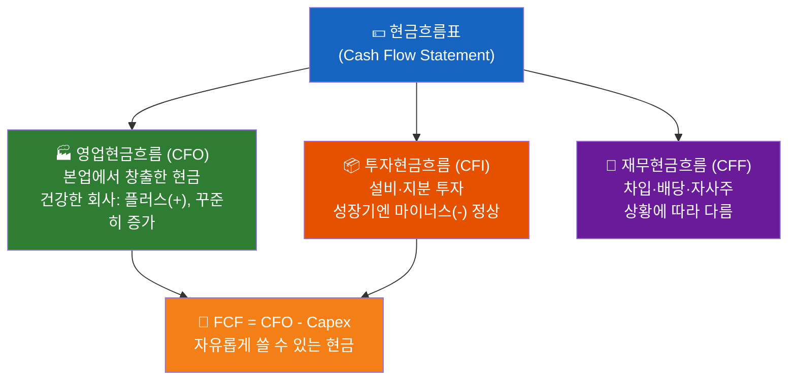
```mermaid
flowchart TD
    CF["💵 현금흐름표\n(Cash Flow Statement)"]

    CF --> CFO["🏭 영업현금흐름 (CFO)\n본업에서 창출한 현금\n건강한 회사: 플러스(+), 꾸준히 증가"]
    CF --> CFI["📦 투자현금흐름 (CFI)\n설비·지분 투자\n성장기엔 마이너스(-) 정상"]
    CF --> CFF["🏦 재무현금흐름 (CFF)\n차입·배당·자사주\n상황에 따라 다름"]

    CFO --> FCF["📐 FCF = CFO - Capex\n자유롭게 쓸 수 있는 현금"]
    CFI --> FCF

    style CF fill:#1565C0,color:#fff
    style CFO fill:#2E7D32,color:#fff
    style CFI fill:#E65100,color:#fff
    style CFF fill:#6A1B9A,color:#fff
    style FCF fill:#F57F17,color:#fff
```

| 구분 | 내용 | 건강한 회사의 패턴 |
|------|------|-------------------|
| **영업현금흐름(CFO)** | 본업에서 창출한 현금 | 플러스(+), 꾸준히 증가 |
| **투자현금흐름(CFI)** | 설비·지분 투자 | 성장기엔 마이너스(-) 정상 |
| **재무현금흐름(CFF)** | 차입·배당·자사주 | 상황에 따라 다름 |

- "이익은 의견이고, 현금은 사실이다(Earnings are an opinion; cash is a fact)"는 말이 있을 만큼, 손익보다 현금이 더 중요한 경우가 있습니다.

### 2. 영업·투자·재무 현금흐름 분석

> 📖 **Wikipedia**: [영업 현금 흐름](https://ko.wikipedia.org/wiki/영업_현금_흐름) · [잉여현금흐름](https://ko.wikipedia.org/wiki/잉여현금흐름)


**현금흐름 패턴으로 기업 단계 파악하기**

| CFO | CFI | CFF | 기업 유형 |
|-----|-----|-----|-----------|
| + | - | - | 이상적인 성숙 기업 (벌어서 투자하고 배당) |
| + | - | + | 성장 기업 (벌지만 차입도 해서 투자) |
| - | - | + | 초기 성장 기업 (아직 적자, 외부 자금 의존) |
| + | + | - | 구조조정 중 (자산 매각으로 부채 상환) |

- 영업현금이 꾸준히 플러스인지, 투자지출이 미래 성장을 위한 것인지, 차입 증가가 위험 신호인지 함께 살펴보는 것이 핵심입니다.

**현금흐름표에서 꼭 확인할 6가지**

| 확인 항목 | 보는 방법 | 해석 포인트 |
|-----------|-----------|-------------|
| **영업현금흐름(CFO)** | 본업에서 현금이 들어오는지 | 장기적으로 플러스가 가장 중요 |
| **순이익 vs CFO** | CFO가 순이익보다 너무 낮지 않은지 | 이익의 질, 매출채권·재고 부담 확인 |
| **투자현금흐름(CFI)** | 설비투자·지분투자·자산매각 확인 | 성장 투자와 생존용 자산매각 구분 |
| **재무현금흐름(CFF)** | 차입·상환·배당·자사주 확인 | 외부 자금 의존도와 주주환원 확인 |
| **FCF** | CFO - Capex | 회사가 자유롭게 쓸 수 있는 현금 |
| **현금및현금성자산 증감** | 기초 현금과 기말 현금 비교 | 실제 현금 체력이 좋아졌는지 확인 |

**순이익과 영업현금흐름이 다르게 움직이는 이유**

| 항목 | CFO에 미치는 영향 | 해석 |
|------|-------------------|------|
| **매출채권 증가** | 감소(-) | 팔았지만 아직 현금을 못 받은 상태 |
| **재고자산 증가** | 감소(-) | 현금이 재고에 묶인 상태 |
| **매입채무 증가** | 증가(+) | 비용 지급을 뒤로 미룬 상태 |
| **감가상각비** | 증가(+) | 비용 처리됐지만 현금 유출은 없는 항목 |
| **법인세·이자 지급** | 감소(-) | 실제 현금 유출 |

**좋은 현금흐름의 예시**

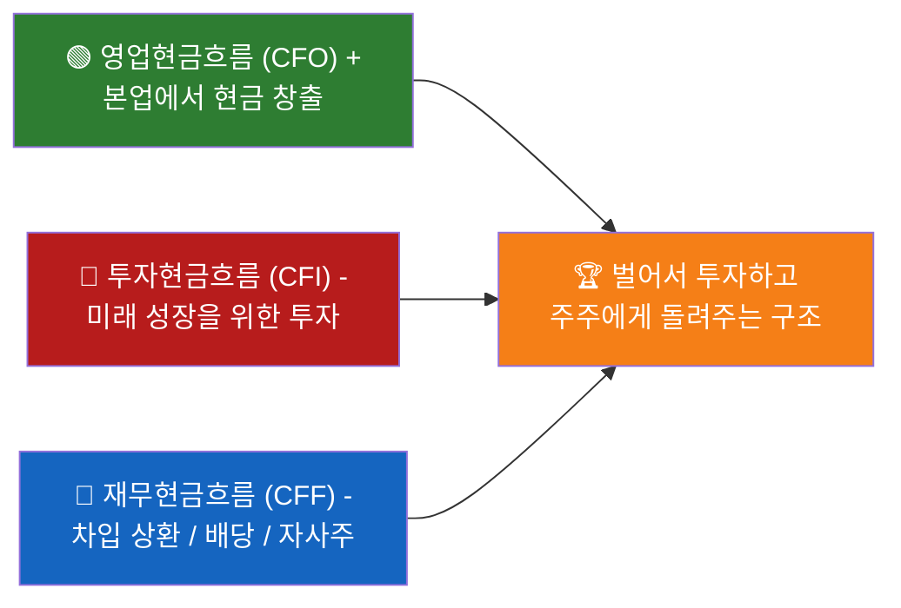
```mermaid
flowchart LR
    CFO["🟢 영업현금흐름 (CFO) +\n본업에서 현금 창출"] --> RESULT["🏆 벌어서 투자하고\n주주에게 돌려주는 구조"]
    CFI["🔴 투자현금흐름 (CFI) -\n미래 성장을 위한 투자"] --> RESULT
    CFF["🔵 재무현금흐름 (CFF) -\n차입 상환 / 배당 / 자사주"] --> RESULT

    style CFO fill:#2E7D32,color:#fff
    style CFI fill:#B71C1C,color:#fff
    style CFF fill:#1565C0,color:#fff
    style RESULT fill:#F57F17,color:#fff
```

**주의해야 할 현금흐름의 예시**

| 상황 | 가능한 해석 |
|------|-------------|
| 순이익 흑자, CFO 반복 적자 | 매출채권·재고 증가, 이익의 질 저하 |
| CFO 적자, CFF 플러스 | 본업 현금 부족을 차입·증자로 메우는 구조 |
| CFI 플러스가 반복 | 성장 투자보다 자산 매각으로 현금 확보 가능성 |
| CFO 플러스지만 FCF 적자 | 설비투자 부담이 크거나 성장 투자 단계 |
| 현금 감소와 단기차입 증가 동시 발생 | 유동성 압박 가능성 |

### 3. 재무제표 3종 연결 분석

> 📖 **Wikipedia**: [재무제표](https://ko.wikipedia.org/wiki/재무제표)

재무제표는 각각 따로 보는 것이 아니라, 아래 순서로 연결해서 읽어야 합니다.

| 순서 | 보는 표 | 핵심 질문 |
|------|---------|-----------|
| 1 | **손익계산서** | 회사가 돈을 벌고 있는가? 본업 이익률은 좋아지는가? |
| 2 | **대차대조표/재무상태표** | 그 성장이 부채를 늘려 만든 것인가, 자본을 쌓아 만든 것인가? |
| 3 | **현금흐름표** | 회계상 이익이 실제 현금으로 들어오고 있는가? |

**연결해서 보는 대표 사례**

| 관찰된 현상 | 추가로 확인할 표 | 해석 |
|-------------|------------------|------|
| 매출과 영업이익 증가 | 대차대조표의 매출채권·재고 | 현금 회수가 잘 되는 성장인지 확인 |
| 순이익 증가 | 현금흐름표의 CFO | 이익이 실제 현금으로 바뀌는지 확인 |
| 자산 증가 | 대차대조표의 부채·자본 | 차입 성장인지 이익 누적 성장인지 확인 |
| 투자현금흐름 대규모 마이너스 | 손익계산서의 향후 매출·이익 | 설비투자가 성과로 이어지는지 확인 |
| 재무현금흐름 플러스 | 대차대조표의 차입금 | 신규 투자용 차입인지 생존용 차입인지 구분 |

**한 문장 분석 템플릿**

```
이 회사는 손익계산서상 [매출/영업이익]이 [증가/감소]하고 있으며,
재무상태표상 [부채/현금/재고/매출채권]은 [안정/악화]되고,
현금흐름표상 영업현금흐름은 [플러스/마이너스]이므로
[건강한 성장/수익성 개선/유동성 주의/이익의 질 점검 필요]로 판단한다.
```

### 4. 기업가치 평가 개요

> 📖 **Wikipedia**: [기업가치](https://ko.wikipedia.org/wiki/기업가치) · [가중평균자본비용](https://ko.wikipedia.org/wiki/가중평균자본비용)

**쉽게 이해하기**
- 기업가치 평가는 "이 회사가 지금 시장에서 얼마 정도로 평가받아야 할까?"를 따져보는 과정입니다.
- 단순히 주가만 보는 것이 아니라, 회사가 앞으로 벌어들일 현금과 현재 재무 상태를 함께 고려합니다.

**장표에서 볼 포인트**
- 이 장표는 이후의 DCF, EVA, FCF 같은 방법들이 왜 필요한지 배경을 설명하는 역할을 합니다.
- 가치 평가는 정답 하나를 맞히는 일이 아니라, 가정이 바뀌면 결과도 달라진다는 점을 이해하는 것이 중요합니다.

**기업가치(EV)와 주주가치(Equity Value) 구분**

| 구분 | 뜻 | 왜 중요한가 |
|------|----|-------------|
| **기업가치(EV)** | 사업 전체를 인수한다고 보고 평가한 가치 | 부채 포함 기준이라 기업 자체 체력을 보기 좋음 |
| **주주가치(Equity Value)** | 기업가치에서 순부채를 반영한 뒤 주주 몫으로 남는 가치 | 실제 주가와 연결되는 가치 |

```text
기업가치(EV) = 주주가치 + 순부채
주주가치 = 기업가치(EV) - 순부채
```

- 현금이 많고 부채가 적은 회사는 같은 EV라도 주주가치가 더 크게 남을 수 있습니다.
- 반대로 영업이익은 좋아 보여도 순부채가 크면 주주 입장에서 체감 가치는 줄어들 수 있습니다.

**기업가치 분석 체크리스트**

1. **본업의 현금 창출력**: CFO와 FCF가 꾸준한가?
2. **재무 안전성**: 순부채, 이자 부담, 유동성은 감당 가능한가?
3. **성장 가정의 현실성**: 매출 성장률과 마진 개선 가정이 산업 평균과 맞는가?
4. **할인율의 적절성**: 금리, 사업 위험, 자본 구조가 반영됐는가?
5. **결과 해석 방식**: 단일 숫자보다 보수·기준·낙관 시나리오 범위로 보는가?

### 5. 절대가치 평가: DCF, EVA, FCF 개념

> 📖 **Wikipedia**: [현금 흐름 할인법](https://ko.wikipedia.org/wiki/현금_흐름_할인법) · [경제적 부가가치](https://ko.wikipedia.org/wiki/경제적_부가가치) · [잉여현금흐름](https://ko.wikipedia.org/wiki/잉여현금흐름)


> **절대가치 평가란?**
> 다른 회사와 비교하지 않고, 이 회사가 앞으로 벌어들일 현금을 직접 계산해서 "이 회사는 얼마짜리인가?"를 스스로 따져보는 방법입니다. 마치 가게를 살 때 "이 가게가 앞으로 매년 얼마를 벌 수 있을까?"를 따져보는 것과 같습니다.

---

#### 5-1. FCF (Free Cash Flow, 잉여현금흐름)

> **초급자 비유**
> 용돈을 받아서(영업현금흐름) 연필, 공책을 산 뒤(설비투자) 남은 돈이 FCF입니다.
> 이 남은 돈으로 저축도 하고, 친구에게 빌린 돈도 갚고, 부모님께 용돈도 드릴 수 있습니다.
> 회사도 마찬가지입니다. FCF가 크고 꾸준할수록 "진짜 돈을 잘 버는 회사"입니다.

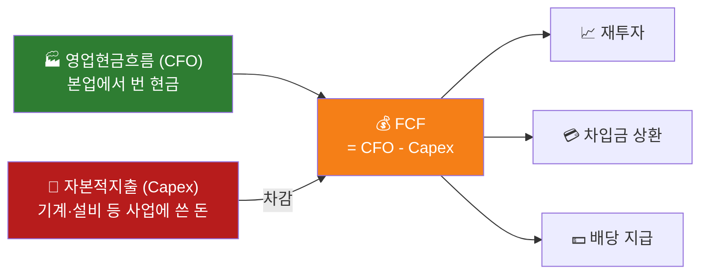
```mermaid
flowchart LR
    CFO["🏭 영업현금흐름 (CFO)\n본업에서 번 현금"]
    CAP["🔧 자본적지출 (Capex)\n기계·설비 등 사업에 쓴 돈"]
    FCF["💰 FCF\n= CFO - Capex"]
    USE1["📈 재투자"]
    USE2["💳 차입금 상환"]
    USE3["💵 배당 지급"]

    CFO --> FCF
    CAP -->|"차감"| FCF
    FCF --> USE1
    FCF --> USE2
    FCF --> USE3

    style CFO fill:#2E7D32,color:#fff
    style FCF fill:#F57F17,color:#fff
    style CAP fill:#B71C1C,color:#fff
```

**FCF를 쉽게 이해하는 예시**

| 항목 | 금액 | 설명 |
|------|------|------|
| 영업현금흐름(CFO) | +200억 | 물건 팔고 서비스 제공해서 실제 들어온 현금 |
| 설비투자(Capex) | -50억 | 공장, 기계 등 사업에 다시 투자한 돈 |
| **FCF (남은 현금)** | **+150억** | **주주 배당, 차입금 상환, 재투자에 쓸 수 있는 진짜 여유 돈** |

**FCF가 중요한 이유**
- 회계 이익은 숫자를 '조정'할 여지가 있지만, FCF는 통장에 실제로 들어온 현금입니다.
- FCF가 꾸준히 플러스인 기업은 외부 자금 없이 스스로 성장할 수 있습니다.
- FCF를 주식 수로 나누면 **주당 FCF**를 구할 수 있어, 주가와 직접 비교할 수 있습니다.


---

#### 5-2. DCF (Discounted Cash Flow, 할인현금흐름)

> **초급자 비유**
> "1년 뒤에 받을 1만 원"과 "지금 당장 받는 1만 원" 중 어느 쪽이 더 좋나요?
> 당연히 **지금 받는 1만 원**입니다! 지금 받으면 은행에 넣어 이자도 받을 수 있으니까요.
> DCF는 이 원리를 이용해, 미래에 받을 현금을 **지금 기준의 가치**로 바꾸어 회사값을 계산합니다.

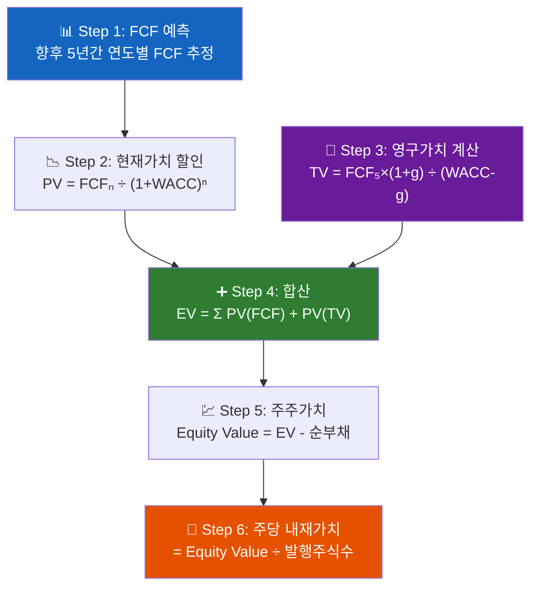
```mermaid
flowchart TD
    FCF["📊 Step 1: FCF 예측\n향후 5년간 연도별 FCF 추정"]
    DISC["📉 Step 2: 현재가치 할인\nPV = FCFₙ ÷ (1+WACC)ⁿ"]
    TV["🔭 Step 3: 영구가치 계산\nTV = FCF₅×(1+g) ÷ (WACC-g)"]
    SUM["➕ Step 4: 합산\nEV = Σ PV(FCF) + PV(TV)"]
    EQ["💹 Step 5: 주주가치\nEquity Value = EV - 순부채"]
    SPS["📌 Step 6: 주당 내재가치\n= Equity Value ÷ 발행주식수"]

    FCF --> DISC --> SUM
    TV --> SUM
    SUM --> EQ --> SPS

    style FCF fill:#1565C0,color:#fff
    style TV fill:#6A1B9A,color:#fff
    style SUM fill:#2E7D32,color:#fff
    style SPS fill:#E65100,color:#fff
```

**DCF 계산 4단계**

```
1단계: 앞으로 몇 년간 FCF를 예측한다 (예: 5년)
2단계: 각 연도의 FCF를 "현재 가치"로 할인한다
3단계: 5년 이후 회사가 영원히 벌어들일 가치(영구가치)를 계산한다
4단계: 모두 더하고 부채를 빼면 주주 몫의 가치가 나온다
```

**수식으로 표현하면**

```
기업가치(EV) = FCF₁/(1+r)¹ + FCF₂/(1+r)² + ... + FCFₙ/(1+r)ⁿ + TV/(1+r)ⁿ

영구가치(Terminal Value, TV) = FCFₙ × (1+g) / (r - g)

여기서:
  r = WACC (할인율, 회사의 자본조달 평균 비용)
  g = 영구 성장률 (보통 경제성장률 수준, 2~3%)
```

**할인율(WACC)이란?**
- 회사가 사업을 위해 돈을 빌리거나(부채) 주식을 발행(자본)하는 데 드는 평균 비용입니다.
- 쉽게 말해 "이 회사의 돈 값(투자자 요구 수익률)"이라고 생각하면 됩니다.

```
WACC = 자기자본비율 × 자기자본비용 + 부채비율 × 부채비용 × (1 - 세율)
```

| WACC 요소 | 쉬운 설명 | 일반적 범위 |
|-----------|-----------|-------------|
| 자기자본비용 | 주주가 요구하는 수익률 | 8~15% |
| 부채비용 | 은행 대출 이자율 | 3~7% |
| **WACC (평균)** | **기업 전체의 자본 비용** | **6~12%** |

**DCF의 민감도 — 가정이 바뀌면 가치도 크게 달라집니다**

| 할인율(WACC) | 성장률(g) | 내재가치 예시 |
|-------------|----------|--------------|
| 7% | 3% | 높게 나옴 |
| 10% | 2% | 중간 |
| 13% | 1% | 낮게 나옴 |

> **핵심 교훈**: DCF는 "정확한 답"을 구하는 게 아닙니다. 가정을 바꿔가며 **가치의 범위(보수~낙관)**를 확인하는 도구입니다.


---

#### 5-3. EVA (Economic Value Added, 경제적 부가가치)

> **초급자 비유**
> 친구에게 돈을 빌려 장사를 했을 때, 장사로 번 돈이 이자보다 많아야 진짜 이익입니다.
> 장사 이익 10만원 - 이자 8만원 = 진짜 번 돈 2만원!
> EVA는 이처럼 **회사가 자본 비용(주주·채권자 몫)을 내고도 진짜로 가치를 만들었는지** 따져봅니다.

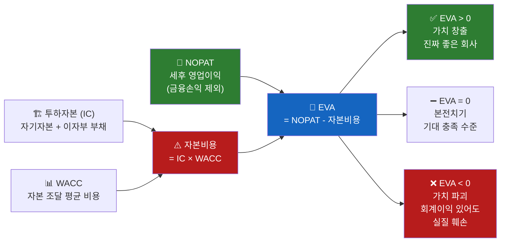
```mermaid
flowchart LR
    NOPAT["💼 NOPAT\n세후 영업이익\n(금융손익 제외)"]
    IC["🏗️ 투하자본 (IC)\n자기자본 + 이자부 부채"]
    WACC["📊 WACC\n자본 조달 평균 비용"]
    COST["⚠️ 자본비용\n= IC × WACC"]
    EVA["📐 EVA\n= NOPAT - 자본비용"]
    POS["✅ EVA > 0\n가치 창출\n진짜 좋은 회사"]
    ZERO["➖ EVA = 0\n본전치기\n기대 충족 수준"]
    NEG["❌ EVA < 0\n가치 파괴\n회계이익 있어도\n실질 훼손"]

    NOPAT --> EVA
    IC --> COST
    WACC --> COST
    COST --> EVA
    EVA --> POS
    EVA --> ZERO
    EVA --> NEG

    style NOPAT fill:#2E7D32,color:#fff
    style COST fill:#B71C1C,color:#fff
    style EVA fill:#1565C0,color:#fff
    style POS fill:#2E7D32,color:#fff
    style NEG fill:#B71C1C,color:#fff
```

```
EVA = NOPAT - 투하자본 × WACC

여기서:
  NOPAT = 세후 영업이익 (금융손익 제외, 진짜 본업 이익)
  투하자본 = 사업에 실제로 투입된 자본 (자기자본 + 이자부 부채)
  WACC = 자본 조달 평균 비용 (주주와 채권자가 원하는 수익률)
```

**EVA 해석 방법**

| EVA 결과 | 의미 | 투자자 관점 |
|----------|------|-------------|
| **EVA > 0** | 자본 비용을 내고도 남는 가치 창출 | 진짜 좋은 회사 |
| **EVA = 0** | 딱 본전치기 | 투자자 기대 충족 수준 |
| **EVA < 0** | 자본 비용도 못 벌어내는 구조 | 회계이익이 있어도 실질 가치 훼손 |

**EVA 예시로 이해하기**

```
A회사:
  세후 영업이익(NOPAT)  = 500억원
  투하자본              = 4,000억원
  WACC                 = 10%
  자본비용              = 4,000억 × 10% = 400억원
  EVA                  = 500억 - 400억 = +100억원  ← 가치 창출!

B회사:
  세후 영업이익(NOPAT)  = 300억원
  투하자본              = 4,000억원
  WACC                 = 10%
  자본비용              = 4,000억 × 10% = 400억원
  EVA                  = 300억 - 400억 = -100억원  ← 회계이익은 있지만 가치 파괴
```

> **핵심 교훈**: 영업이익이 플러스라고 해서 다 좋은 회사가 아닙니다. 자본 비용을 넘어서야 진짜 가치를 만드는 회사입니다.


---

#### 5-4. 세 가지 방법 비교 정리

| 구분 | FCF | DCF | EVA |
|------|-----|-----|-----|
| **핵심 질문** | 이 회사가 실제로 얼마나 현금을 남기나? | 미래 현금을 지금 가치로 환산하면 회사가 얼마인가? | 자본 비용을 내고도 진짜 가치를 만드나? |
| **초급자 비유** | 용돈에서 필수 지출 후 남은 돈 | 미래 용돈의 오늘 가치 | 빌린 돈 이자 내고도 이익이 남나? |
| **강점** | 이익 조작이 어려운 현금 기반 | 내재가치 직접 추정 가능 | 자본 효율성 평가 |
| **약점** | 미래 성장성을 직접 반영 못함 | 가정에 매우 민감 | 투하자본 산정이 복잡 |
| **활용 시점** | 현금 창출력 확인 시 | 성장주 가치 평가 시 | 자본 배분 효율성 점검 시 |

**절대가치 평가 실전 활용 순서**

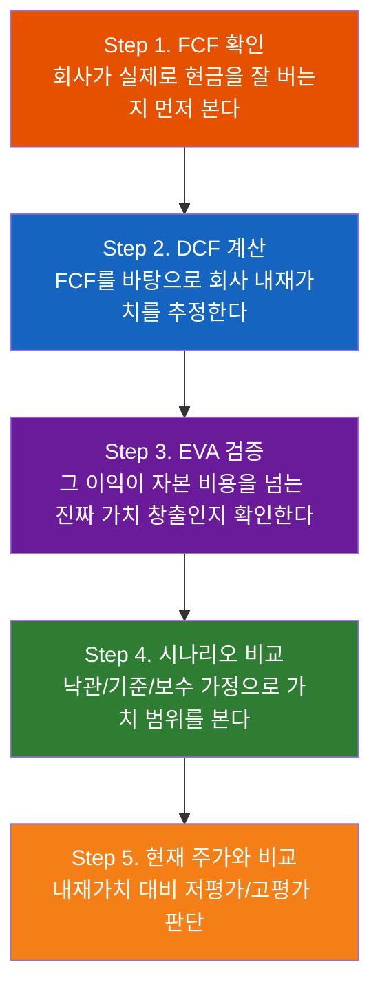
```mermaid
flowchart TD
    S1["Step 1. FCF 확인\n회사가 실제로 현금을 잘 버는지 먼저 본다"]
    S2["Step 2. DCF 계산\nFCF를 바탕으로 회사 내재가치를 추정한다"]
    S3["Step 3. EVA 검증\n그 이익이 자본 비용을 넘는 진짜 가치 창출인지 확인한다"]
    S4["Step 4. 시나리오 비교\n낙관/기준/보수 가정으로 가치 범위를 본다"]
    S5["Step 5. 현재 주가와 비교\n내재가치 대비 저평가/고평가 판단"]

    S1 --> S2 --> S3 --> S4 --> S5

    style S1 fill:#E65100,color:#fff
    style S2 fill:#1565C0,color:#fff
    style S3 fill:#6A1B9A,color:#fff
    style S4 fill:#2E7D32,color:#fff
    style S5 fill:#F57F17,color:#fff
```

# DCF 기업가치 평가 리포트

## 1. 분석 대상


- 회사명:
- 현재 주가:
- 발행주식수:
- 순부채:
- 기준 FCF:

## 2. 핵심 가정


- 예측 기간:
- 연도별 FCF 성장률:
- WACC:
- 영구성장률:
- Terminal Value 방식:

## 3. 평가 결과


- 기업가치(EV):
- 주주가치:
- 주당 내재가치:
- 현재가 대비 상승/하락 여력:
- Terminal Value 비중:

## 4. 시나리오 분석


- Bear:
- Base:
- Bull:

## 5. 민감도 분석


- 가치에 가장 큰 영향을 준 가정:
- WACC 변화 영향:
- 영구성장률 변화 영향:

## 6. 리스크와 한계


- DCF는 가정 기반 모델임
- FCF 예측 오류 가능성
- WACC와 영구성장률에 매우 민감
- 산업 사이클과 재무구조 변화 반영 필요
```

---

#### 6-10. 실습 체크리스트

- [ ] 기본 DCF 계산 함수 작성
- [ ] Bear/Base/Bull 시나리오 테이블 생성
- [ ] WACC × 영구성장률 민감도 테이블 생성
- [ ] 몬테카를로 DCF 시뮬레이션 실행
- [ ] `dcf_dashboard.png` 생성
- [ ] `/api/valuation/dcf` 요청/응답 설계
- [ ] `/api/valuation/dcf/monte-carlo` 요청/응답 설계
- [ ] `dcf_valuation_report.md` 작성

---

## 해보기 활동


오늘은 "이익"이 아니라 "현금"과 "가치"에 집중해서 정리해보세요.

1. 관심 기업 1개를 골라 영업·투자·재무 현금흐름이 각각 플러스인지 마이너스인지 적어보세요.
2. 그 흐름이 왜 나왔는지 기업 상황과 연결해 한 줄씩 설명해보세요.
3. 매출 성장률, 영업이익률, 할인율을 각각 하나의 가정으로 정하고, 어떤 가정이 기업가치에 가장 큰 영향을 줄지 써보세요.
4. 순부채를 확인해 "기업가치와 주주가치 차이가 큰 기업인지" 한 줄로 적어보세요.
5. 마지막으로 "이 회사의 현금흐름은 건강한가?"를 한 문장으로 정리해보세요.


---

## 원문: finance_valuation_multiples.txt

# 상대가치 평가 (밸류에이션 멀티플)


---

>
> 📝 **한자 병기 및 어원 사전**: 이 문서에 등장하는 용어의 한자·어원·일제강점기 유래는 → [voca.md](voca.md)

## 오늘 배울 것 (아주 쉽게)


- PER (주가수익비율) 개념과 활용
- PBR, EV/EBITDA, PSR 멀티플
- 업종별 적정 멀티플 기준
- 실습: 국내 종목 멀티플 스크리닝 및 비교

---

## 🔗 참고 사이트 & 데이터 원천


> 이 문서(상대가치 평가 — PER·PBR·EV/EBITDA·PSR 멀티플)의 실습에 필요한 공식 데이터 출처와 참고 사이트입니다. ⚿ 는 API 키 또는 승인이 필요한 항목입니다.

### 📊 국내 공식 데이터

| 기관 | URL | API 키 | 제공 데이터 |
|------|-----|--------|-------------|
| DART(전자공시시스템) | <https://opendart.fss.or.kr> | ⚿ 필요 | EPS·BPS 산출용 재무제표, 주식수 공시 |
| KRX 한국거래소 | <https://www.krx.co.kr> | 불필요(웹 조회) | 업종별 PER·PBR 통계, 시가총액 |
| KRX Data Marketplace | <https://openapi.krx.co.kr> | ⚿ 필요 | 시장 통계·멀티플 API |
| KIND(상장공시시스템) | <https://kind.krx.co.kr> | 불필요(웹 조회) | 종목별 재무 요약·멀티플 참고 |
| 금융투자협회(KOFIA) | <https://www.kofia.or.kr> | 불필요(웹 조회) | 자본시장 밸류에이션 통계 |
| 금융감독원(FSS) | <https://www.fss.or.kr> | 불필요(웹 조회) | 금융회사 자산·수익 통계 |

### 🌍 해외 공식 데이터

| 기관 | URL | API 키 | 제공 데이터 |
|------|-----|--------|-------------|
| yfinance (PyPI) | <https://pypi.org/project/yfinance> | 불필요 | 국내외 종목 PER·PBR·EV/EBITDA |
| pykrx (PyPI) | <https://pypi.org/project/pykrx> | 불필요 | 국내 종목 시장 데이터·멀티플 |
| SEC EDGAR API | <https://data.sec.gov/api/xbrl/companyfacts> | 불필요 | 미국 기업 EPS·BPS 원시 데이터 |

### 📈 리서치·차트·포탈 참고

| 분류 | 사이트 | URL | 활용 용도 |
|------|--------|-----|-----------|
| 리서치 플랫폼 | FnGuide 데이터 | <https://comp.fnguide.com> | 종목별 PER·PBR·EV/EBITDA 현황 |
| 차트 플랫폼 | TradingView | <https://www.tradingview.com> | 멀티플 비교 차트·업종 필터 |
| 차트 플랫폼 | Investing.com | <https://www.investing.com> | 글로벌 종목 멀티플 비교 |
| 금융 포탈 | 네이버 금융 | <https://finance.naver.com> | 종목별 PER·PBR·ROE 요약 |
| 금융 포탈 | 다음 금융 | <https://finance.daum.net> | 종목 재무·밸류에이션 현황 |
| 금융 미디어 | 머니투데이 방송(MTN) | <https://mtn.co.kr> | 밸류에이션·주가 분석 뉴스 |
| 금융 미디어 | 연합인포맥스 | <https://news.einfomax.co.kr> | 종목·업종 멀티플 속보 |
| 증권사 리서치 | 삼성증권 | <https://www.samsungpop.com> | PER·PBR 기반 목표주가 리포트 |
| 증권사 리서치 | KB증권 | <https://www.kbsec.com> | 업종별 밸류에이션 분석 리포트 |

---

# 주식 투자 용어 해설: 티커(Ticker)

주식 시장에서 **티커(Ticker)**는 특정 종목을 빠르고 정확하게 식별하기 위해 부여된 **고유의 약자(심볼)**를 의미합니다.

## 1. 유래


과거에는 주식 시세를 종이 띠(**Ticker Tape**)에 인쇄하여 전달했습니다. 이때 회사 이름을 모두 기입하기에는 지면이 부족하고 시간이 오래 걸렸기 때문에, 짧은 알파벳 기호로 표시하던 습관에서 유래되었습니다.

---

## 2. 국가별 티커의 형태


국가마다 티커를 구성하는 방식에는 차이가 있습니다.

### 미국 (문자 중심)
영문 알파벳 대문자로 구성되며, 보통 회사 이름과 연관성이 높습니다.
* **AAPL**: 애플 (Apple)
* **TSLA**: 테슬라 (Tesla)
* **MSFT**: 마이크로소프트 (Microsoft)
* **O**: 리얼티 인컴 (Realty Income) - *단일 철자를 사용하는 경우도 있음*

### 한국 (숫자 중심)
한국에서는 '티커'라는 말 대신 주로 **'종목코드'**라고 부르며, 6자리의 숫자로 구성됩니다.
* **005930**: 삼성전자
* **035420**: NAVER
* **373220**: LG에너지솔루션

---

## 3. 티커 사용의 장점


1.  **정확성**: 이름이 유사한 기업 간의 혼동을 방지합니다. (예: Zoom Video Communications의 티커는 `ZM`)
2.  **신속성**: 긴 회사명 대신 짧은 코드를 입력하여 빠르게 검색 및 매매가 가능합니다.
3.  **범용성**: 전 세계 투자자와 시스템이 동일한 기호를 사용하므로 정보 전달이 명확합니다.

---

## 💡 참고사항


해외 주식 시장에서는 티커 대신 **'심볼(Symbol)'**이라는 용어를 혼용해서 사용하기도 합니다. HTS나 MTS에서 종목을 찾을 때 이 티커를 활용하면 가장 정확한 검색 결과를 얻을 수 있습니다.

### 1. PER (주가수익비율) 개념과 활용

> 📖 **Wikipedia**: [주가수익비율](https://ko.wikipedia.org/wiki/주가수익비율)


**PER 계산 공식**

```
PER = 주가 / 주당순이익(EPS)
    = 시가총액 / 당기순이익
```


- PER 20배 = 지금 이익 수준이라면 20년이 지나야 투자금을 회수한다는 뜻
- 높은 PER: 시장이 미래 고성장을 기대 / 낮은 PER: 저평가이거나 성장 정체·위험 반영
- **적자 기업에는 PER 계산 불가**, 일회성 이익이 섞이면 왜곡될 수 있습니다.

#### 1-1. 한국 PER vs 미국 PER 차이 (비교 시 주의점)

같은 업종이라도 **한국 PER와 미국 PER를 1:1로 단순 비교하면 왜곡**될 수 있습니다.

| 비교 축 | 한국 시장(예시) | 미국 시장(예시) | 왜 중요한가 |
|--------|----------------|----------------|-------------|
| **시장 구조** | 제조·수출 대형주 비중 높음 | 플랫폼·소프트웨어 등 고성장주 비중 높음 | 성장주 비중이 높을수록 시장 평균 PER이 높아지기 쉬움 |
| **EPS 기준 표기** | 사이트별 TTM/최근연환산 혼재 | TTM·Forward 구분 표기가 비교적 명확 | 분모(EPS) 기준이 다르면 PER 숫자 자체가 달라짐 |
| **주주환원 정책** | 배당·자사주 소각 강도 기업별 편차 큼 | 자사주 매입·소각이 활발한 기업 다수 | 동일 이익이어도 주식 수 변화로 EPS/PER 해석 차이 발생 |
| **금리·할인율 환경** | 국내 금리와 원화 리스크 반영 | 미 연준 금리·달러 사이클 반영 | 할인율이 높아지면 적정 PER은 낮아지는 경향 |
| **세금·회계 차이** | 한국 법인세·K-IFRS 환경 | 미국 법인세·US GAAP 환경 | 세후이익·회계 인식 차이로 국가 간 단순 비교 왜곡 가능 |

**실무 체크리스트**

1. **같은 업종·같은 성장 단계** 기업만 비교합니다.
2. **TTM vs Forward PER**를 반드시 구분합니다.
3. 환율·금리·세율 차이를 함께 보고, 최종 판단은 **PER 단일 지표가 아니라 ROE·FCF·성장률**과 같이 확인합니다.

#### 1-2. 조엘 그린블라트의 매직 포뮬러: 좋은 회사를 싼 가격에 찾기

**조엘 그린블라트(Joel Greenblatt)**는 가치투자 방식으로 알려진 투자자이자 『*The Little Book That Beats the Market*』의 저자입니다. 이 책에서 소개한 **매직 포뮬러(Magic Formula)**는 많은 기업을 두 가지 질문으로 정리해 후보를 고르는 방법입니다.

> **① 이 회사는 사업을 잘하는가?** → 자본수익률(ROC)이 높은가?
> **② 이 회사의 가격은 이익에 비해 싼가?** → 이익수익률(Earnings Yield)이 높은가?

쉽게 말해, **"돈을 효율적으로 버는 회사"를 "이익에 비해 낮은 가격"에 사려는 규칙**입니다. 한 가지 숫자만 보고 고르는 대신, 사업의 질과 가격을 함께 보려는 점이 핵심입니다.

| 확인할 점 | 매직 포뮬러의 지표 | 쉬운 뜻 | 일반적인 해석 |
|---|---|---|---|
| 사업의 질 | 자본수익률(ROC) | 회사가 사업에 투입한 돈으로 이익을 얼마나 잘 만드는가 | 높을수록 적은 자본으로 이익을 잘 내는 경향 |
| 가격의 매력 | 이익수익률 | 지금 가격으로 샀을 때 영업이익이 얼마나 돌아오는가 | 높을수록 이익 대비 가격이 낮은 경향 |

**계산을 조금 더 정확히 보면** 원래 방식에서는 보통 다음처럼 측정합니다. 여기서 EBIT은 이자·세금 차감 전 영업이익이고, EV는 시가총액에 순부채 등을 반영한 기업가치입니다.

```text
자본수익률(ROC) = EBIT / (순운전자본 + 순유형고정자산)
이익수익률      = EBIT / EV
```

PER와 연결해서 이해하면 더 쉽습니다. **이익수익률은 PER의 역수와 비슷한 방향**을 보는 지표입니다. 예를 들어 PER가 낮으면(다른 조건이 같다면) 이익수익률은 높아질 수 있습니다. 다만 매직 포뮬러는 순이익과 시가총액 대신 EBIT과 EV를 사용하므로, PER의 단순한 역수와 숫자가 정확히 같지는 않습니다.

**후보를 고르는 과정**

1. 비교할 수 있는 기업 목록을 만듭니다. 금융업처럼 재무구조가 매우 다른 업종, 지나치게 작은 기업 등은 기준에 따라 별도로 제외할 수 있습니다.
2. 각 기업의 자본수익률을 높은 순으로, 이익수익률도 높은 순으로 각각 순위를 매깁니다.
3. 두 순위를 더합니다. 합계가 작을수록 두 기준을 모두 잘 만족한 후보입니다.
4. 상위 후보라도 재무제표, 부채, 일회성 이익, 산업 전망을 다시 확인한 뒤 분산·장기 관점에서 판단합니다.

| 가상 기업 | ROC 순위 | 이익수익률 순위 | 순위 합계 | 해석 |
|---|---:|---:|---:|---|
| A사 | 2위 | 3위 | 5점 | 사업의 질과 가격을 모두 비교적 잘 충족 |
| B사 | 1위 | 20위 | 21점 | 사업은 훌륭하지만 가격이 비쌀 수 있음 |
| C사 | 18위 | 1위 | 19점 | 가격은 싸 보이지만 사업의 질을 더 점검해야 함 |

**꼭 알아둘 한계**

- 이 공식은 **매수 신호나 수익 보장 공식이 아닙니다.** 특정 기간에는 시장보다 성과가 부진할 수 있습니다.
- 높은 이익수익률은 시장이 성장 둔화, 부채, 소송, 산업 침체 같은 위험을 이미 가격에 반영한 결과일 수도 있습니다.
- EBIT·EV·운전자본의 계산 기준과 재무 데이터 시점에 따라 결과가 달라집니다. 특히 금융업·적자 기업·자산구조가 특수한 기업은 단순 비교에 주의해야 합니다.
- 따라서 이 방법은 **많은 종목에서 조사할 후보를 좁히는 스크리닝 도구**로 쓰고, 최종 투자 판단 전에는 사업 내용과 위험을 별도로 검토해야 합니다.

> 📚 참고: Joel Greenblatt, *The Little Book That Beats the Market*. 이 책은 좋은 기업을 합리적인 가격에 고르는 규칙 기반 접근을 설명합니다.

**멀티플 레벨별 해석 (PER 기준)**

```mermaid
quadrantChart
    title PER 수준 vs 성장률 — 밸류에이션 포지셔닝
    x-axis 낮은 성장률 --> 높은 성장률
    y-axis 낮은 PER --> 높은 PER
    quadrant-1 고성장 프리미엄 (정당한 높은 PER)
    quadrant-2 버블 위험 (성장 없는 고PER)
    quadrant-3 가치주 구간 (저PER·저성장)
    quadrant-4 숨겨진 저평가 (고성장·저PER)
    플랫폼IT: [0.85, 0.80]
    바이오성장주: [0.90, 0.90]
    반도체: [0.70, 0.65]
    소비재: [0.45, 0.40]
    은행금융: [0.30, 0.25]
    전통제조: [0.20, 0.30]
    과열성장주: [0.30, 0.85]
    가치저평가: [0.75, 0.20]
```

### 2. PBR, EV/EBITDA, PSR 멀티플

> 📖 **Wikipedia**: [주가순자산비율](https://ko.wikipedia.org/wiki/주가순자산비율) · [기업가치](https://ko.wikipedia.org/wiki/기업가치) · [EBITDA](https://ko.wikipedia.org/wiki/EBITDA)


| 멀티플 | 공식 | 언제 유용한가 |
|--------|------|---------------|
| **PBR** | 주가 / 주당순자산(BPS) | 자산 중심 업종 (은행, 부동산), 해산 가치 비교 |
| **EV/EBITDA** | 기업가치 / EBITDA | 부채 구조 비교, 인수합병 가치 평가 |
| **PSR** | 시가총액 / 매출액 | 적자 성장 기업, 매출이 핵심인 초기 기업 |

- 이익이 불안정한 기업은 PER보다 **PSR이나 EV/EBITDA**가 더 유용할 수 있습니다.
- 어떤 멀티플이 맞는지는 기업 특성(성장 단계·자산 구조·이익 안정성)에 따라 달라집니다.

**EV/EBITDA를 조금 더 풀어서 보기**


- **시가총액만 보면 놓치는 것**: 부채가 많은 회사와 무차입 회사는 같은 시가총액이어도 실제 인수 부담이 다릅니다.
- **EBITDA가 유용한 이유**: 감가상각, 이자, 세금 영향을 덜 받아 업종 내 비교가 쉬워집니다.
- **주의점**: 설비투자 부담이 큰 업종은 EBITDA가 실제 현금창출력보다 좋아 보일 수 있으니 Capex도 함께 봐야 합니다.

### 3. 업종별 적정 멀티플 기준

> 📖 **Wikipedia**: [기업 가치 평가](https://ko.wikipedia.org/wiki/기업_가치_평가)


| 업종 | 주요 멀티플 | 대략적 범위 | 이유 |
|------|-------------|-------------|------|
| 은행·금융 | PBR | 0.5~1.5배 | 자산 가치 중심 |
| 반도체 | EV/EBITDA | 10~25배 | 사이클 평탄화 목적 |
| 플랫폼·IT | PER 또는 PSR | 20~50배+ | 고성장 프리미엄 |
| 소비재·유통 | PER | 10~20배 | 안정적 이익 |
| 바이오 | PSR | 적자라 PER 미사용 | 파이프라인 가치 |

- 멀티플이 낮다고 무조건 저평가가 아니라, **성장 둔화나 재무 위험이 반영된 결과**일 수도 있습니다.

**업종별 멀티플 선택 프로세스**

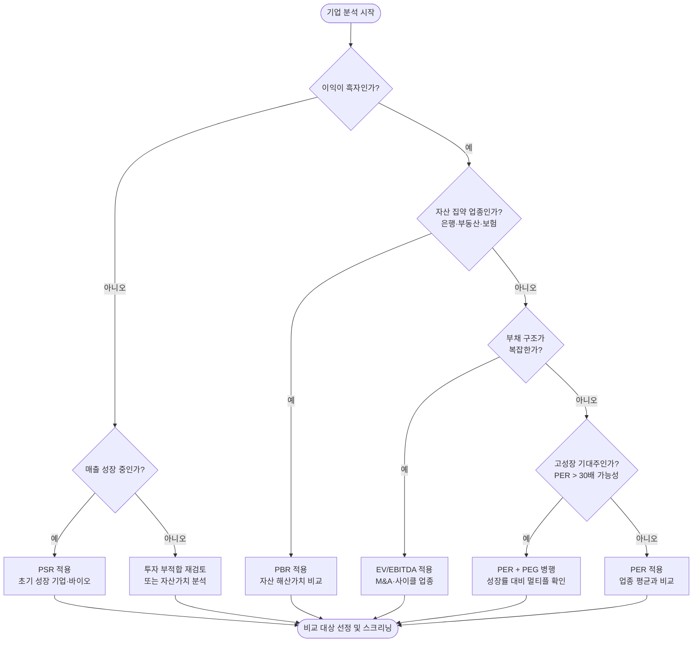
```mermaid
flowchart TD
    A([기업 분석 시작]) --> B{이익이 흑자인가?}
    B -- 아니오 --> C{매출 성장 중인가?}
    C -- 예 --> D[PSR 적용\n초기 성장 기업·바이오]
    C -- 아니오 --> E[투자 부적합 재검토\n또는 자산가치 분석]
    B -- 예 --> F{자산 집약 업종인가?\n은행·부동산·보험}
    F -- 예 --> G[PBR 적용\n자산 해산가치 비교]
    F -- 아니오 --> H{부채 구조가\n복잡한가?}
    H -- 예 --> I[EV/EBITDA 적용\nM&A·사이클 업종]
    H -- 아니오 --> J{고성장 기대주인가?\nPER > 30배 가능성}
    J -- 예 --> K[PER + PEG 병행\n성장률 대비 멀티플 확인]
    J -- 아니오 --> L[PER 적용\n업종 평균과 비교]
    D --> M([비교 대상 선정 및 스크리닝])
    E --> M
    G --> M
    I --> M
    K --> M
    L --> M
```

### 4. 실습: 국내 종목 멀티플 스크리닝 및 비교

**쉽게 이해하기**
- 스크리닝은 많은 종목 중에서 원하는 조건에 맞는 후보를 빠르게 추리는 과정입니다.
- 예를 들어 같은 업종 안에서 PER은 낮고 영업이익률은 높은 기업을 찾으면, "실적 대비 저평가 후보"를 골라볼 수 있습니다.

**장표에서 볼 포인트**
- 이 장표는 멀티플 개념을 실제 종목 선택 과정으로 연결하는 역할을 합니다.
- 조건을 너무 많이 걸면 좋은 기업을 놓칠 수 있으니, 먼저 2~3개의 핵심 기준으로 좁힌 뒤 추가로 검토하는 방식이 효율적입니다.

**기업가치 분석용 비교 체크리스트**

| 확인 항목 | 왜 필요한가 | 실무 해석 |
|-----------|-------------|-----------|
| **동일 업종·유사 비즈니스 모델** | 멀티플 비교의 출발점 | 은행과 플랫폼 기업을 같은 기준으로 비교하면 왜곡 |
| **성장률 차이** | 높은 성장 기업은 프리미엄 가능 | 멀티플이 높아도 성장으로 설명되는지 확인 |
| **부채 구조** | EV/EBITDA 해석에 직접 영향 | 차입 급증 기업은 EV가 빠르게 높아질 수 있음 |
| **일회성 이익/손실** | PER, EBITDA 왜곡 방지 | 자산 매각 이익이 포함됐는지 점검 |
| **현금흐름과 Capex** | 숫자의 질 확인 | EBITDA가 좋아도 FCF가 약하면 할인 필요 |

---

#### 4-1. 레퍼런스 사이트 찾기 및 데이터 원천 정리

국내 종목의 멀티플(PER·PBR·EV/EBITDA 등)은 여러 사이트에서 제공하는데, 정의와 기준이 조금씩 다릅니다. 아래 표로 원천별 특징을 먼저 정리하고, 수집할 사이트를 결정합니다.

| 구분 | 사이트 | 가입/인증 | 확인할 데이터 | 실습 포인트 |
|------|--------|-----------|---------------|-------------|
| 국내 증권 원천 | [KRX 정보데이터시스템](https://data.krx.co.kr/) | 무료 회원가입 | 업종별 PER/PBR/배당수익률 통계 | 코스피·코스닥 전 종목의 공식 멀티플 제공 |
| 국내 공시 원천 | [DART 전자공시시스템](https://dart.fss.or.kr/) | Open API 인증키 필요 | 사업보고서·분기보고서 재무수치 | EPS·BPS·EV 계산의 기초 데이터 |
| 국내 포털 | [NAVER Finance 종목 분석](https://finance.naver.com/) | 로그인 불필요 | 종목별 PER·PBR·ROE 요약 | 빠른 참고용, 스크린 기준 확인 |
| 전문 금융 데이터 | [FnGuide (Dataguide)](https://www.fnguide.com/) | 유료 구독 | 업종 평균 멀티플, 컨센서스 EPS | 기관·운용사 수준의 상세 멀티플 |
| Python 라이브러리 | [yfinance](https://pypi.org/project/yfinance/) | 별도 키 없음 | 상장 종목 PER·PBR·EV/EBITDA | KS 티커로 국내 종목 직접 조회 가능 |
| 거시 통계 보강 | [한국은행 ECOS](https://ecos.bok.or.kr/) | Open API 인증키 필요 | 기업 금융통계, 산업별 매출·이익 집계 | 업종별 평균 멀티플 보완 |

**가입 및 키 발급 체크리스트**

1. **KRX 정보데이터시스템**: `data.krx.co.kr` 접속 → 회원가입 → 주식 → 종목정보 → 업종별 PER/PBR 메뉴에서 CSV 다운로드 가능.
2. **DART OpenAPI**: `opendart.fss.or.kr` 접속 → 인증키 신청 → 발급 키를 `.env`의 `DART_API_KEY`에 저장.
3. **ECOS**: `ecos.bok.or.kr` 접속 → 회원가입/로그인 → Open API → 인증키 신청 → `.env`의 `BOK_API_KEY`에 저장.
4. **yfinance**: 별도 가입 없이 `pip install yfinance`로 설치 후 바로 사용 가능. KS(코스피)·KQ(코스닥) 티커 형식 사용.

**유사 정보 비교: 같은 종목의 PER이 사이트마다 다른 이유**

| 비교 항목 | NAVER Finance | yfinance | 확인 질문 |
|-----------|---------------|----------|-----------|
| EPS 기준 | 최근 12개월(TTM) | TTM 또는 Forward | 과거 실적 기준인가, 컨센서스 예상인가? |
| 주식 수 | 보통주 발행 주식 수 기준 | 가중평균 희석 주식 수 포함 가능 | 자사주·우선주 처리 방법은? |
| 통화 처리 | 원화 | 원화(한국 상장) | 외화 환산이 포함됐는가? |
| 업데이트 주기 | 실시간~당일 | 거래소 반영 지연 가능 | 수집 시점의 주가와 EPS 기준일이 맞는가? |

---

#### 4-2. yfinance로 국내 종목 멀티플 수집

`yfinance`는 별도 API Key 없이 바로 사용할 수 있어 실습 진입 장벽이 낮습니다. 한국 상장 종목은 코스피 `.KS`, 코스닥 `.KQ`를 티커에 붙입니다.

**추가 패키지 설치**

```bash
pip install yfinance pandas matplotlib seaborn
```

**국내 업종 대표 종목 티커 정의**


**멀티플 수집 함수**


---

#### 4-3. 표준 데이터 스키마

출처가 달라도 아래 구조로 통일하면 스크리닝·시각화·보고서에서 재사용하기 쉽습니다.

| 컬럼 | 예시 | 설명 |
|------|------|------|
| `sector` | `반도체` | GICS 업종 또는 직접 분류 |
| `company` | `삼성전자` | 기업 이름 |
| `ticker` | `005930.KS` | yfinance 티커 |
| `market_cap` | `4200000` | 시가총액 (억 원) |
| `per` | `13.5` | 주가수익비율 (TTM) |
| `forward_per` | `11.2` | 선행 PER (컨센서스 기준) |
| `pbr` | `1.1` | 주가순자산비율 |
| `psr` | `1.8` | 주가매출비율 |
| `ev_ebitda` | `8.4` | EV/EBITDA |
| `roe_pct` | `8.5` | 자기자본이익률 (%) |
| `op_margin_pct` | `12.3` | 영업이익률 (%) |
| `revenue_growth_pct` | `5.1` | 매출 성장률 (%) |
| `debt_to_equity` | `42.0` | 부채비율 (D/E) |
| `source` | `yfinance` | 데이터 원천 |
| `fetch_date` | `2025-01-31` | 수집일 |

---

#### 4-4. 멀티플 스크리닝 필터 구현

조건 기반 필터로 후보 종목을 좁힙니다. 먼저 2~3개 핵심 조건으로 시작한 뒤, 추가 조건을 붙이는 방식이 실무적입니다.


**스크리닝 조건 선택 가이드**

| 스크리닝 목적 | 핵심 조건 | 참고 조건 |
|--------------|-----------|----------|
| 가치주 발굴 | PER ≤ 업종 평균, PBR ≤ 1.5 | ROE ≥ 8%, 부채비율 낮음 |
| 성장주 발굴 | 매출성장률 ≥ 15%, Forward PER 확인 | ROE 높음, PBR 프리미엄 허용 |
| 자산주 발굴 | PBR ≤ 0.7, 부채비율 낮음 | 배당수익률 확인 |
| M&A 대상 | EV/EBITDA ≤ 8, 순현금 기업 | FCF 양호 여부 함께 확인 |

---

#### 4-5. 시각화: 멀티플 비교 차트

수집한 데이터를 세 가지 방식으로 시각화합니다.

**① 섹터별 PER·PBR 막대 차트 비교**


**② ROE vs PBR 산점도 — "성장 대비 저평가" 식별**


**③ 멀티플 히트맵 — 종목 간 지표 한눈에 비교**


**최종 산출물 목록**

```text
multiples_raw.csv          ← 수집된 원본 멀티플 데이터
sector_multiples_bar.png   ← 섹터별 PER/PBR 막대 차트
roe_vs_pbr_scatter.png     ← ROE vs PBR 산점도
multiples_heatmap.png      ← 종목 간 멀티플 히트맵
```

---

#### 4-6. 데이터 품질 및 해석 유의사항

- **yfinance TTM EPS는 부정확할 수 있습니다.** 특히 분기 실적이 최근 반영되지 않거나 일회성 손익이 섞인 경우 PER이 왜곡될 수 있으므로, 중요한 종목은 DART 공시 원문으로 EPS를 재확인합니다.
- **업종이 달라지면 비교 기준도 달라집니다.** PER이 5배인 은행주와 PER이 50배인 바이오주를 같은 기준으로 비교하면 의미 없는 순위가 나옵니다. 섹터 필터를 먼저 적용한 뒤 비교합니다.
- **PER 미산출(NaN) 기업은 적자이거나 EPS가 음수입니다.** 이 경우 PSR이나 EV/EBITDA로 대체해 평가합니다.
- **EV/EBITDA에서 고차입 기업은 EV가 과대계상될 수 있습니다.** 순차입금(총차입금 − 현금성자산)을 함께 보고, Capex가 큰 업종은 EBITDA가 실제 현금창출력을 과장할 수 있습니다.
- **수집일 기준 주가와 재무 기준일을 맞춰야 합니다.** 분기 실적 발표 전후로 PER이 크게 달라질 수 있으므로, 데이터에 `fetch_date`를 반드시 기록합니다.
- **보고서에는 원천·수집일·EPS 기준(TTM/Forward)·결측 처리 방법을 표시합니다.**

---

## 📌 멀티플에 영향을 주는 외부 요인

### 기준금리 (Base Rate) — 적정 PER의 기준선이 바뀐다


주식의 **적정 PER**은 금리 수준에 따라 달라집니다.

```
적정 PER (대략) = 1 / 무위험수익률(Rf)

금리 2%  → 적정 PER ≈ 50배
금리 4%  → 적정 PER ≈ 25배
금리 6%  → 적정 PER ≈ 17배
금리 10% → 적정 PER ≈ 10배
```

| 금리 방향 | 멀티플 영향 | 투자 시사점 |
|----------|------------|------------|
| **기준금리 인상** | PER 기준 부담 ↑ → 적정 주가 ↓ | 성장주 부담, 가치주·배당주 상대적 유리 |
| **기준금리 인하** | PER 기준 여유 ↑ → 적정 주가 ↑ | 성장주 부양, 장기채·부동산도 수혜 |

> 💡 DCF에서 WACC = Rf + 위험프리미엄. 기준금리 1%p 상승 → WACC 1%p 상승 → 적정주가 평균 10~20% 하락 가능.

**데이터 확인**: [한국은행 ECOS](https://ecos.bok.or.kr) → 기준금리 시계열 / [FRED](https://fred.stlouisfed.org) → 미국 연방기금 목표금리

---

### 시장금리 (Market Rate) — 기준금리보다 빠른 선행 지표


시장금리는 기준금리 결정 이전에 경기 기대를 선반영합니다.

| 시장금리 지표 | 설명 | 투자 활용 |
|-------------|------|----------|
| **국고채 10년물** | 무위험수익률 기준 · DCF 할인율 | 장기 금리 방향성 파악 |
| **국고채 3년물** | 중기 정책 기대 반영 | 기준금리 전망 선행지표 |
| **회사채 신용스프레드** | 회사채 − 국고채 수익률 차이 | 확대 시 경기 우려·신용 경색 신호 |
| **CD금리(91일물)** | 변동금리 기준 · 단기 자금 지표 | 주담대·기업 단기차입 금리와 연동 |
| **장단기 금리차** | 10년물 − 2년물 (역전 시 주의) | 경기침체 6~18개월 선행 지표 |

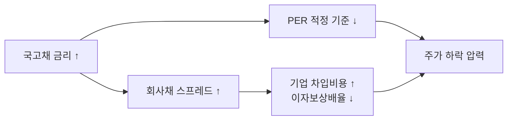
```mermaid
flowchart LR
    A["국고채 금리 ↑"] --> B["PER 적정 기준 ↓"]
    B --> C["주가 하락 압력"]
    A --> D["회사채 스프레드 ↑"]
    D --> E["기업 차입비용 ↑\n이자보상배율 ↓"]
    E --> C
```

**장단기 금리차 역전 → 경기침체 선행 신호**

```
미국 장단기 금리차(10Y-2Y) 역전 역사
2000년 → 닷컴 버블 붕괴
2007년 → 금융위기
2019년 → 코로나 침체 선행
```

**데이터 확인**: [금융투자협회 채권정보](https://www.kofiabond.or.kr) / [KRX 채권](https://www.krx.co.kr)

---

### 투자자 심리 (Investor Sentiment) — 단기 주가를 움직이는 감정


**"시장은 단기적으로 투표 기계, 장기적으로 저울이다."** — 벤저민 그레이엄

기업 펀더멘탈이 좋아도 심리가 극공포 상태이면 주가가 펀더멘탈 이하로 떨어지고,
반대로 심리가 극탐욕이면 펀더멘탈 이상으로 올라갑니다.

**주요 심리 지표**

| 지표 | 설명 | 해석 기준 |
|------|------|----------|
| **공포탐욕지수** | CNN Fear & Greed 0~100 | 0~20: 극공포(역발상 매수 검토) / 80~100: 극탐욕(비중 축소 검토) |
| **VIX (공포지수)** | S&P500 30일 변동성 기대 | 20 초과: 불안 / 30 초과: 패닉 |
| **VKOSPI (코스피 변동성지수)** | KOSPI200 옵션 기반 30일 변동성 기대 | 20 내외: 안정 / 25 초과: 경계 / 30 초과: 국내 패닉 구간 |
| **투자자 수급** | 외국인·기관·개인 순매수 | 외국인 지속 순매수: 긍정 신호 |
| **신용잔고** | 개인 투자자 빚투 규모 | 급증 → 레버리지 과열 → 조정 시 낙폭 확대 위험 |
| **공매도 비율** | 거래량 대비 공매도 비중 | 급증 → 약세 심리 과열 / 감소 → 숏커버링 기대 |

**VIX (CBOE Volatility Index) 상세 설명**

VIX는 **시카고 옵션거래소(CBOE)** 가 산출하는 변동성 지수로, S&P500 지수 옵션의 **내재변동성(Implied Volatility)** 을 가중 평균하여 향후 **30일간의 시장 변동성을 연율화(%)**한 수치입니다.

- 티커: `^VIX` (yfinance), `VIXCLS` (FRED)
- 수치 해석: "시장 참여자들이 향후 30일간 S&P500이 얼마나 흔들릴 것으로 예상하는가"
- VIX 20 = 연간 기준 ±20% 변동을 예상 (월 기준 약 ±5.8%)

**VIX 구간별 해석**

| VIX 수치 | 시장 상태 | 투자자 행동 시사점 |
|----------|----------|------------------|
| 10 미만 | 극저 변동성 / 과도한 낙관 | 과열·안일 경계, 변동성 상승 리스크 주시 |
| 10 ~ 20 | 안정 구간 (정상 범위) | 일반적 추세 투자 환경 |
| 20 ~ 25 | 불확실성 증가 | 포지션 점검, 리스크 관리 시작 |
| 25 ~ 30 | 주의 / 리스크오프 초입 | 비중 축소 또는 헤지 검토 |
| 30 ~ 40 | 공포 구간 | 역발상 분할 매수 검토 시작 |
| 40 이상 | 패닉 / 시장 위기 | 역사적 저점 형성 가능성↑, 단기 극심한 변동 |

**역사적 VIX 급등 사례**

| 시기 | 사건 | VIX 고점 |
|------|------|---------|
| 1998 | 러시아 디폴트 · LTCM 위기 | 약 45 |
| 2001 | 9·11 테러 | 약 43 |
| 2008 | 글로벌 금융위기 (리먼 사태) | **약 80** (역사적 최고) |
| 2010 | 유럽 재정위기 (그리스) | 약 45 |
| 2011 | 미국 신용등급 강등 | 약 48 |
| 2015 | 중국 위안화 평가절하 | 약 40 |
| 2018 | 볼마겟돈 (VIX ETF 폭발) | 약 37 |
| 2020 | COVID-19 팬데믹 | **약 82** (역대 최고 수준) |
| 2022 | 러시아-우크라이나, 미국 급격한 금리인상 | 약 36 |

**VIX와 주가의 역상관 관계**

VIX와 S&P500은 **일반적으로 음(-)의 상관관계**를 가집니다.

```
S&P500↓ (공포 확산) → 투자자들이 풋옵션 매수 급증 → 옵션 내재변동성↑ → VIX↑
S&P500↑ (안정 회복) → 풋옵션 수요 감소 → 옵션 내재변동성↓ → VIX↓
```

> ⚠️ 역상관이 항상 성립하지는 않습니다. 상승 국면에서도 불확실성이 크면 VIX가 동반 상승할 수 있습니다.

**VIX 활용 투자 포인트**

| 상황 | 해석 | 활용 전략 |
|------|------|---------|
| VIX < 15 (장기 저점) | 시장 자기만족·과열 | 안일함 경계, 헤지 비용 저렴할 때 풋옵션/방어 ETF 고려 |
| VIX 30~40 급등 | 공포 극대화 | 역발상 분할 매수 검토 (단, 추가 하락 가능성 열어둬야) |
| VIX 40~50 이상 | 패닉·시스템 리스크 | 분할 매수 강화, 현금 비중 확보와 병행 |
| VIX 급락 전환 | 공포 완화·반등 신호 | 모멘텀 회복 초입, 포지션 확대 신호 |

**VIX ETF/상품 투자 주의사항**

VIX 자체는 직접 매매 불가 — VIX 연계 상품(ETF/ETP) 투자 시 주의:

- **콘탱고(Contango) 손실**: VIX 선물은 만기가 짧아 월별 롤오버 시 지속적인 비용 발생 → 장기 보유 시 큰 손실 가능
- **VXX, UVXY 등**: 단기 헤지·트레이딩 목적으로만 활용, 장기 보유 비적합
- **인버스 VIX (SVXY 등)**: VIX 하락에 베팅하는 상품, 2018년 볼마겟돈처럼 VIX 급등 시 단기간 90% 이상 손실 가능

**VIX vs VKOSPI 빠른 비교**

| 구분 | VIX | VKOSPI |
|------|-----|--------|
| 정식 명칭 | CBOE Volatility Index | 코스피 변동성지수 |
| 대표 시장 | 미국(S&P500) | 한국(KOSPI200) |
| 산출 기관 | CBOE (시카고 옵션거래소) | KRX (한국거래소) |
| 산출 기반 | S&P500 옵션 내재변동성 | KOSPI200 옵션 내재변동성 |
| 주 활용 맥락 | 글로벌 위험회피 심리 | 국내 증시 단기 스트레스 |
| 함께 볼 지표 | 달러인덱스, 미 국채금리 | 원/달러 환율, 외국인 수급 |
| 2020 팬데믹 고점 | 약 82 | 약 80 |

> 실무에서는 VIX만 보지 말고 VKOSPI를 같이 확인해 **글로벌 리스크와 국내 수급 충격을 분리해서 해석**하는 것이 좋습니다.
> - VIX만 급등 + VKOSPI 안정 → 글로벌 충격이지만 국내 영향 제한적
> - VIX 안정 + VKOSPI 급등 → 국내 수급/정치/경제 이벤트 중심 충격
> - 두 지수 동반 급등 → 글로벌 리스크가 국내로 전이, 외국인 이탈 가능성 높음

**버블 경고 신호 vs 저점 신호**

| 버블 경고 (탐욕 극단) | 저점 신호 (공포 극단) |
|---------------------|---------------------|
| PER 역대 상위 10% | PER 역대 하위 10% |
| 신용잔고 급증 | 개인 패닉 매도 |
| IPO 청약 폭발, 주변인 모두 주식 | 증시 퇴출 종목 속출 |
| 코인·부동산 동반 급등 | 기관·외국인 저가 매집 |

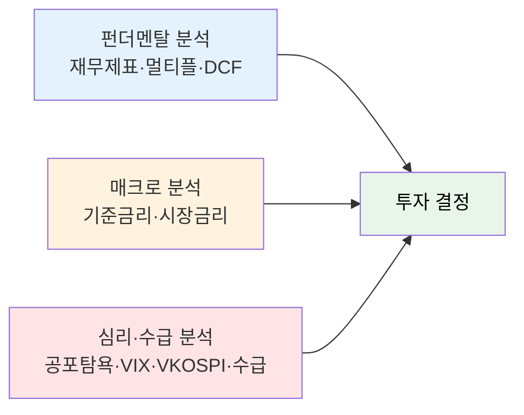
```mermaid
flowchart LR
    A["펀더멘탈 분석\n재무제표·멀티플·DCF"] --> D["투자 결정"]
    B["매크로 분석\n기준금리·시장금리"] --> D
    C["심리·수급 분석\n공포탐욕·VIX·VKOSPI·수급"] --> D

    style A fill:#E3F2FD
    style B fill:#FFF3E0
    style C fill:#FFE4E6
    style D fill:#E8F5E9,color:#000
```

> ⚠️ 심리 지표는 타이밍 도구입니다. 펀더멘탈 분석 없이 심리만 보고 투자하면 위험합니다.

---

## 해보기 활동


멀티플 비교는 "숫자 읽기"보다 "비교 이유 설명하기"가 더 중요합니다.

1. 같은 업종 기업 3개를 골라 PER, PBR, EV/EBITDA 중 확인 가능한 값들을 표로 정리해보세요.
2. 어떤 기업은 왜 PER보다 PBR이나 PSR이 더 적합한지 한 줄로 써보세요.
3. 업종 평균보다 높은 멀티플을 받는 기업 1개를 고르고, 시장이 왜 프리미엄을 주는지 추정해보세요.
4. EV/EBITDA가 낮아 보여도 실제로는 위험할 수 있는 이유를 순부채·Capex 관점에서 적어보세요.
5. 마지막으로 "지금 가장 먼저 추가 확인하고 싶은 기업"을 1개 고르고 이유를 적어보세요.

---

# 주식 시장의 실적 발표: 어닝 서프라이즈와 어닝 쇼크 이해하기

주식 시장에서 **‘어닝(Earning)’**은 기업의 **실적 발표**를 뜻합니다. 기업들은 보통 분기별, 연도별로 장사를 얼마나 잘했는지 성적표를 공개합니다.

이때 시장의 예상치(증권가 전망치 평균, 이를 '컨센서스'라고 합니다)와 비교해 실제 실적이 어떻게 나왔느냐에 따라 **어닝 서프라이즈**와 **어닝 쇼크**로 나뉩니다.

---

## 1. 어닝 서프라이즈 (Earning Surprise)
> 💡 **한 줄 요약:** 시장의 기대를 훌쩍 뛰어넘은 **'대박 성적표'**

* **의미:** 기업이 발표한 실제 영업이익이나 순이익이 시장에서 예상했던 것보다 **훨씬 더 좋게 나온 경우**를 말합니다.
* **시험 비유:** 평소에 80점 정도 받을 줄 알았던 아이가 시험에서 100점을 맞아와서 모두를 깜짝 놀라게 한 상황입니다.
* **주가에 미치는 영향:** 대개 호재로 작용하여 **주가가 상승**하는 경향이 있습니다. 기업의 미래 성장성이 높게 평가되면서 투자자들이 몰리기 때문입니다.

---

## 2. 어닝 쇼크 (Earning Shock)
> 💡 **한 줄 요약:** 시장의 기대에 한참 못 미친 **'충격적인 성적표'**

* **의미:** 기업의 실적이 단순히 줄어든 것을 넘어, 시장이 예상했던 기대치보다 **훨씬 낮게 나온 경우**를 말합니다. (※ 단순히 적자를 낸 것뿐만 아니라, '예상보다 훨씬 못했다'는 점이 핵심입니다.)
* **시험 비유:** 공부를 잘해서 당연히 90점은 나올 줄 알았던 아이가 50점을 받아와서 모두에게 충격을 준 상황입니다.
* **주가에 미치는 영향:** 악재로 작용하여 **주가가 급락**하는 경우가 많습니다. 시장의 신뢰를 잃고 실망한 투자자들이 매물을 쏟아내기 때문입니다.

---

## 📌 한눈에 비교하기

| 구분 | 실제 실적 vs 시장 예상치 | 주가 영향 (일반적) | 투자자 반응 |
| :--- | :--- | :--- | :--- |
| **어닝 서프라이즈** | 실제 실적 **>** 시장 예상치 | 📈 **상승** | "와, 생각보다 돈을 훨씬 잘 버네! 사자!" |
| **어닝 쇼크** | 실제 실적 **<** 시장 예상치 | 📉 **하락** | "앗, 이 정도로 장사를 못 했을 줄이야... 팔자!" |

> ⚠️ **주의할 점 (주식 시장의 특성)**
> 실적이 좋게 나왔는데도 주가가 떨어지거나(재료 소멸로 인한 차익 실현), 실적이 나쁜데도 주가가 오르는 경우가 있습니다. 주가는 '미래의 가치'를 선반영하는 특성이 있기 때문에, 실적 발표 이후 기업이 제시하는 **향후 전망(가이던스)**이 어떠한지도 함께 확인하는 것이 중요합니다.

---

# 주식 종목명 구분 및 배당 제도 총정리

## 1. 주식 종목명 뒤에 붙는 '우', 'A', 'B'의 의미

### 1.1 보통주 vs 우선주(우)
* **보통주 (예: 삼성전자)**
    * **특징:** 주주총회에 참여해 표를 던질 수 있는 **의결권**이 있습니다.
    * **대상:** 회사의 경영에 참여하고 싶거나, 일반적인 주가 상승 차익을 노리는 투자자에게 적합합니다.
* **우선주 (예: 삼성전자우)**
    * **특징:** 의결권이 없는 대신, 보통주보다 **배당금을 더 많이(우선해서)** 받습니다.
    * **대상:** 경영권에는 관심 없고, 안정적인 배당 수익을 원하는 투자자에게 적합합니다.

### 1.2 우선주 뒤의 숫자 (예: 현대차2우B, 현대차3우B)
우선주를 여러 번 발행했을 때, 발행한 순서대로 숫자를 붙입니다. 숫자가 클수록 나중에 발행된 주식이며, 발행 시기마다 배당률이나 조건이 조금씩 다를 수 있습니다.
* **현대차우:** 1번째로 발행한 우선주
* **현대차2우B:** 2번째로 발행한 우선주
* **현대차3우B:** 3번째로 발행한 우선주

### 1.3 알파벳 A, B, C의 의미 (국내 vs 해외)
* **국내 주식에서의 'B' (예: CJ4우B):** **'신형 우선주'**를 뜻합니다. (영어 'Bond-like'에서 유래). 일반 우선주와 달리 **"최하 이 정도 배당률(예: 연 2%)은 무조건 보장해 주겠다"**는 채권형 조건이 붙어 있습니다.
* **해외 주식에서의 A, B, C (예: 구글 알파벳 Class A / C):** 주식의 **'등급(Class)'**을 나누어 의결권에 차등을 둘 때 사용합니다.
    * **알파벳 Class A (GOOGL):** 1주당 1개의 의결권 있음 (일반 투자자 거래용)
    * **알파벳 Class B:** 1주당 10개의 의결권 있음 (창업주 및 내부 경영진 보유, 거래 불가)
    * **알파벳 Class C (GOOG):** 의결권이 없음 (배당 및 주가 이익만 향유)

---

## 2. 주식배당의 조건과 일정

### 2.1 주식배당을 받기 위한 3가지 조건
1.  **회사의 이익 발생:** 당기순이익이 발생하여 배당 재원이 있어야 합니다.
2.  **이사회 및 주주총회 결의:** 주주총회에서 최종 승인을 받아야 합니다.
3.  **배당기준일까지 주식 보유:** 회사가 지정한 배당기준일에 주주명부에 등재되어 있어야 합니다.

### 2.2 배당을 받기 위한 매수 타이밍 (12월 결산법인 예시)
국내 주식 시장은 매수 후 실제 입고까지 **2영업일(D+2)**이 소요되므로, 배당기준일보다 최소 2영업일 전에 매수해야 합니다.

| 단계 | 명칭 | 설명 | 예시 일정 |
| :--- | :--- | :--- | :--- |
| **1** | **주식 매수 마감일** | 배당을 받기 위해 무조건 주식을 사야 하는 마지막 날 | 12월 28일 |
| **2** | **배당락일** | 배당받을 권리가 사라지는 날 (이날 매수 시 배당 불가, 주가 인위적 하락) | 12월 29일 |
| **3** | **배당기준일** | 주주명부에 내 이름이 올라가 있어야 하는 기준일 | 12월 30일 |

> ⚠️ **주의:** 최근 상법 개정으로 **"배당액 선확정 후 배당기준일 지정"** 방식을 채택하는 기업이 늘었습니다. 연말 일괄 매수보다는 개별 기업의 공시를 확인해야 합니다.

### 2.3 실제 주식 입고 프로세스
1.  **배당기준일 확정:** 주주 명부 마감
2.  **정기 주주총회 개최 (보통 3월):** 주식배당 안건 승인 (승인일로부터 1개월 이내 지급 의무)
3.  **주식 실제 입고 (보통 4월):** 증권 계좌로 주식이 자동 입고됨

---

## 3. 현금배당 vs 주식배당 장단점 및 비교

### 3.1 종합 비교

| 구분 | 현금배당 (Cash Dividend) | 주식배당 (Stock Dividend) |
| :--- | :--- | :--- |
| **개념** | 회사의 이익을 **현금(돈)**으로 지급 | 회사의 이익을 **새로운 주식**으로 지급 |
| **장점** | · 즉시 현금 확보 가능 (재투자/생활비)<br>· 배당 소득이 확실하고 직관적임 | · 세금(배당소득세) 이연 효과 (매도 시까지)<br>· 기업이 현금을 유보하여 미래 성장에 재투자 가능 |
| **단점** | · **15.4%의 배당소득세** 원천징수<br>· 금융소득종합과세 위험 노출 | · **배당락**으로 인해 초기 자산 총액 변동 없음<br>· 주식 수 증가로 주당 가치 희석 가능성 |

### 3.2 투자자 성향별 유리한 상황

#### 💡 현금배당이 유리한 경우
* **현금 흐름이 필요할 때:** 배당금으로 제2의 월급을 만들거나 다른 자산에 재투자하고자 할 때
* **성숙기 기업 투자 시:** 은행, 통신, 유틸리티 등 대규모 투자가 끝나고 안정적 이익을 내는 대기업 투자 시
* **소액 투자자:** 연간 금융소득이 2,000만 원 이하로 배당소득세 부담이 상대적으로 적을 때

#### 💡 주식배당이 유리한 경우
* **고성장 기업 투자 시:** 회사가 현금을 유보하여 R&D나 설비에 재투자하고, 주주는 향후 기업 성장에 따른 주가 상승(복리 효과)을 노릴 때
* **절세 및 세금 이연이 필요할 때:** 현금배당과 달리 주식을 매도하기 전까지 과세가 유예되므로 고액 자산가의 금융소득종합과세 회피 대안으로 활용
* **유통 주식 수 확대가 필요할 때:** 거래량이 너무 적은 숨은 우량주의 경우, 주식 수 증가로 거래가 활성화되어 주가에 호재로 작용 가능


---

## 원문: finance_technical_analysis_1.txt

# 기술적 분석 I (추세 & 지표)


---

>
> 📝 **한자 병기 및 어원 사전**: 이 문서에 등장하는 용어의 한자·어원·일제강점기 유래는 → [voca.md](voca.md)

## 오늘 배울 것 (아주 쉽게)


- 지지선(Support)과 저항선(Resistance)
- 이동평균선(MA)과 골든크로스·데드크로스
- 갭(Gap) 반전 분석
- 되돌림 분석 (피보나치 되돌림)
- 보조지표: RSI, MACD, 볼린저밴드
- 실습: 기술적 지표 계산 및 시각화

---

## 🔗 참고 사이트 & 데이터 원천


> 이 문서(기술적 분석 I — 추세·이동평균·RSI·MACD·볼린저밴드)의 실습에 필요한 공식 데이터 출처와 참고 사이트입니다. ⚿ 는 API 키 또는 승인이 필요한 항목입니다.

### 📊 국내외 시장 데이터

| 기관/서비스 | URL | API 키 | 제공 데이터 |
|------------|-----|--------|-------------|
| yfinance (PyPI) | <https://pypi.org/project/yfinance> | 불필요 | 국내외 종목 OHLCV 시계열 |
| pykrx (PyPI) | <https://pypi.org/project/pykrx> | 불필요 | 국내 종목·ETF 주가 시계열 |
| pandas-ta (PyPI) | <https://pypi.org/project/pandas-ta> | 불필요 | 130+ 기술 지표 자동 계산 라이브러리 |
| mplfinance (PyPI) | <https://pypi.org/project/mplfinance> | 불필요 | 캔들 차트·기술 지표 시각화 |
| KRX Data Marketplace | <https://openapi.krx.co.kr> | ⚿ 필요 | 국내 공식 시장 데이터 API |

### 📈 차트·트레이딩 플랫폼 (학습·레퍼런스)

| 서비스 | URL | 활용 용도 |
|--------|-----|-----------|
| TradingView | <https://www.tradingview.com> | 이동평균·RSI·MACD·볼린저밴드 인터랙티브 차트 |
| TradingView Pine Script 문서 | <https://www.tradingview.com/pine-script-docs> | 지표 로직 레퍼런스 |
| Investing.com | <https://www.investing.com> | 기술 지표 분석·시그널 참고 |
| StockCharts | <https://stockcharts.com> | 기술 분석 지표 설명·차트 패턴 사전 |

### 🏦 국내 HTS/MTS & 증권사 (기술적 분석 실전 참고)

| 서비스 | URL | 활용 용도 |
|--------|-----|-----------|
| 키움증권 영웅문 | <https://www.kiwoom.com> | HTS 기술 지표 실전 설정법 |
| 미래에셋증권 m.Hero | <https://securities.miraeasset.com> | MTS 기술 지표 활용 |
| 네이버 금융 차트 | <https://finance.naver.com> | 국내 종목 캔들·이동평균 차트 |
| 다음 금융 차트 | <https://finance.daum.net> | 보조지표 포함 차트 조회 |

### 📰 금융 미디어 (시황·기술적 분석 뉴스)

| 서비스 | URL | 활용 용도 |
|--------|-----|-----------|
| 머니투데이 방송(MTN) | <https://mtn.co.kr> | 기술적 분석 시황 해설 방송 |
| 한국경제TV(WOW TV) | <https://www.wowtv.co.kr> | 차트 분석·매매 전략 방송 |
| 연합인포맥스 | <https://news.einfomax.co.kr> | 시장 기술 분석 속보 |

---

### 0. 추세분석 (Trend Analysis) — 가장 먼저 봐야 할 것

> 📖 **Wikipedia**: [기술적 분석](https://ko.wikipedia.org/wiki/기술적_분석_(금융)) · [추세선](https://ko.wikipedia.org/wiki/추세선_(금융))


**추세란 무엇인가?**

> "추세를 따라가라(Trend is your friend)" — 기술적 분석의 제1 원칙

추세는 가격이 **방향을 가지고 지속적으로 움직이는 흐름**입니다. 모든 기술적 분석은 추세 파악에서 시작합니다.

#### 추세의 세 가지 종류

| 추세 | 정의 | 특징 | 매매 관점 |
|------|------|------|-----------|
| **상승추세 (Uptrend)** | 고점과 저점이 연속해서 높아짐 (HH·HL) | 저점에서 매수 기회 발생 | 추세 방향으로 매수 |
| **하락추세 (Downtrend)** | 고점과 저점이 연속해서 낮아짐 (LH·LL) | 고점에서 매도 기회 발생 | 현금 보유 또는 공매도 |
| **횡보 (Sideways)** | 일정 범위 내에서 등락 반복 | 지지·저항 구간 매매 유효 | 박스권 상하단 역매매 |

**상승·하락·횡보 추세 구조**

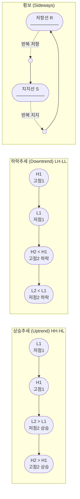
```mermaid
flowchart LR
    subgraph UP["상승추세 (Uptrend)  HH·HL"]
        L1_up(["L1\n저점1"]) --> H1_up(["H1\n고점1"])
        H1_up --> L2_up(["L2 > L1\n저점2 상승"])
        L2_up --> H2_up(["H2 > H1\n고점2 상승"])
    end
    subgraph DOWN["하락추세 (Downtrend)  LH·LL"]
        H1_dn(["H1\n고점1"]) --> L1_dn(["L1\n저점1"])
        L1_dn --> H2_dn(["H2 < H1\n고점2 하락"])
        H2_dn --> L2_dn(["L2 < L1\n저점2 하락"])
    end
    subgraph SIDE["횡보 (Sideways)"]
        R(["저항선 R\n─────────"]) -.->|"반복 저항"| MID1((" "))
        MID1 --> S(["지지선 S\n─────────"])
        S -.->|"반복 지지"| MID2((" "))
        MID2 --> R
    end
```

#### 추세선 긋는 법 (실전)

**상승 추세선**: 연속된 **저점 2개 이상**을 이어 아래에서 위로 올라가는 선
**하락 추세선**: 연속된 **고점 2개 이상**을 이어 위에서 아래로 내려가는 선

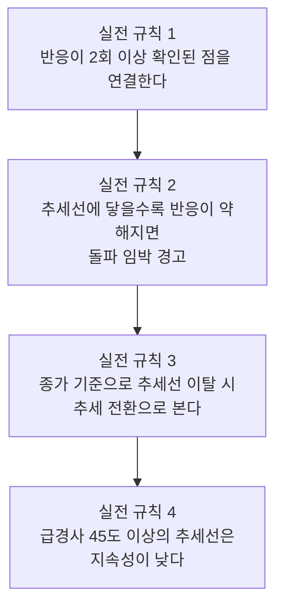
```mermaid
flowchart TD
    R1[실전 규칙 1\n반응이 2회 이상 확인된 점을 연결한다]
    R2[실전 규칙 2\n추세선에 닿을수록 반응이 약해지면\n돌파 임박 경고]
    R3[실전 규칙 3\n종가 기준으로 추세선 이탈 시\n추세 전환으로 본다]
    R4[실전 규칙 4\n급경사 45도 이상의 추세선은\n지속성이 낮다]
    R1 --> R2 --> R3 --> R4
```

#### 추세 채널 (Trend Channel)

추세선과 **평행한 선**을 그어 가격이 움직이는 통로(채널)를 표시합니다.

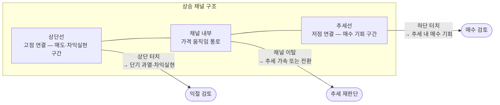
```mermaid
flowchart LR
    subgraph CHANNEL["상승 채널 구조"]
        direction LR
        TOP["상단선\n고점 연결 — 매도·차익실현 구간"]
        MID_CH["채널 내부\n가격 움직임 통로"]
        BOT["추세선\n저점 연결 — 매수 기회 구간"]
        TOP --- MID_CH --- BOT
    end
    BOT -- "하단 터치\n→ 추세 내 매수 기회" --> ACT_B([매수 검토])
    TOP -- "상단 터치\n→ 단기 과열·차익실현" --> ACT_S([익절 검토])
    MID_CH -- "채널 이탈\n→ 추세 가속 또는 전환" --> ACT_X([추세 재판단])
```

- 채널 **상단 터치**: 단기 과열, 차익실현 구간
- 채널 **하단 터치**: 추세 내 매수 기회
- 채널 **이탈**: 추세 가속 또는 추세 전환 신호

#### 추세 강도 판단

| 방법 | 기준 | 해석 |
|------|------|------|
| **ADX (평균방향성지수)** | ADX > 25 | 강한 추세 존재 |
| | ADX < 20 | 추세 없음 (횡보) |
| **거래량** | 추세 방향에서 거래량 증가 | 추세 신뢰도 상승 |
| | 추세 방향에서 거래량 감소 | 추세 약화 징후 |
| **이동평균 배열** | 단기 > 중기 > 장기 (정배열) | 상승 추세 강함 |
| | 단기 < 중기 < 장기 (역배열) | 하락 추세 강함 |

**실전 추세 분석 6단계 프로세스**

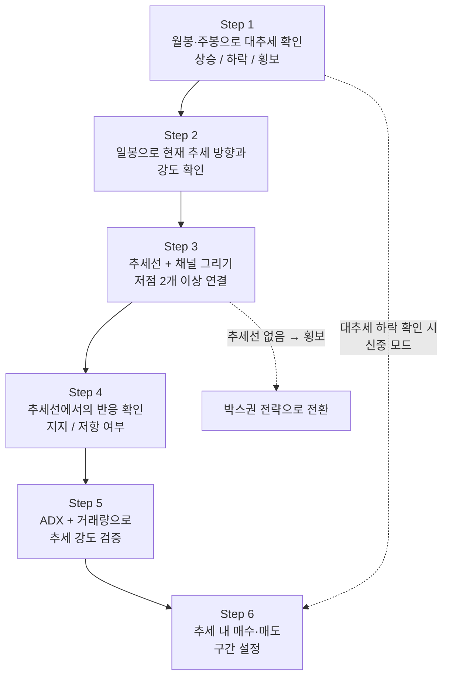
```mermaid
flowchart TD
    S1["Step 1\n월봉·주봉으로 대추세 확인\n상승 / 하락 / 횡보"] --> S2
    S2["Step 2\n일봉으로 현재 추세 방향과\n강도 확인"] --> S3
    S3["Step 3\n추세선 + 채널 그리기\n저점 2개 이상 연결"] --> S4
    S4["Step 4\n추세선에서의 반응 확인\n지지 / 저항 여부"] --> S5
    S5["Step 5\nADX + 거래량으로\n추세 강도 검증"] --> S6
    S6["Step 6\n추세 내 매수·매도\n구간 설정"]

    S1 -.->|"대추세 하락 확인 시\n신중 모드"| S6
    S3 -.->|"추세선 없음 → 횡보"| BOX["박스권 전략으로 전환"]
```

---

### 1. 지지선(Support)과 저항선(Resistance)

> 📖 **Wikipedia**: [기술적 분석](https://ko.wikipedia.org/wiki/기술적_분석_(금융))


- **지지선**: 가격이 내려오다가 자주 멈추는 구간 — 매수 세력이 모이는 가격대
- **저항선**: 올라가다가 자주 막히는 구간 — 매도 세력이 모이는 가격대

많은 투자자가 비슷한 가격대를 중요하게 보기 때문에 차트에 반복 반응 구간이 생깁니다.

- **역할 전환**: 돌파된 저항선은 이후 지지선으로, 붕괴된 지지선은 이후 저항선으로 바뀌는 경우가 많습니다.
- 선을 정확히 한 가격으로 보기보다 **여러 번 반응한 가격대 범위**로 보는 것이 실전에 가깝습니다.

**실전 활용법**

| 상황 | 대응 |
|------|------|
| 가격이 지지선 접근 + 거래량 감소 | 지지 유지 가능성 → 매수 검토 |
| 가격이 지지선 이탈 + 거래량 급증 | 지지 붕괴 → 다음 지지선으로 목표 하향 |
| 가격이 저항선 돌파 + 거래량 급증 | 돌파 신뢰 → 매수 진입 또는 목표가 상향 |
| 저항선 돌파 후 눌림목 (이전 저항 = 새 지지) | 역할 전환 확인 → 추가 매수 기회 |

**삼성전자 예시 — 역할 전환**

```
저항선 70,000원 → 3차례 저항 후 돌파
돌파 후 70,000원이 지지선으로 역할 전환
다음 목표: 이전 고점 80,000원대
```

### 2. 이동평균선(MA)과 골든크로스·데드크로스

> 📖 **Wikipedia**: [이동 평균](https://ko.wikipedia.org/wiki/이동_평균) · [골든 크로스](https://ko.wikipedia.org/wiki/골든_크로스)


| 이동평균선 | 기간 | 용도 |
|-----------|------|------|
| MA5 (단기) | 5일 | 단기 모멘텀 |
| MA20 (중기) | 20일 | 월간 추세 |
| MA60 (중장기) | 60일 | 분기 추세 |
| MA200 (장기) | 200일 | 장기 추세 기준선 |

---

# 📊 이동평균선과 추세 분석

## 이동평균선 구분
| 구분 | 대표 기간 | 특징 | 활용 |
|------|------------|------|------|
| 단기선 | 5일, 20일 | 주가 변동에 민감, 빠른 신호 발생 | 단타·스윙 매매 타이밍 포착 |
| 중기선 | 60일, 120일 | 한 달~분기 흐름 반영, 중심축 역할 | 스윙·중기 추세 매매 |
| 장기선 | 240일 | 6개월~1년 흐름 반영, 신뢰도 높음 | 대세 추세 판단, 기관·장기 투자자 활용 |

---

## 장기 이동평균선의 장점
- 추세 파악 용이성: 큰 방향성을 보여주므로 상승·하락장의 전환점 확인에 유용  
- 지지·저항 역할: 장기선 위는 강세장, 아래는 약세장으로 해석  
- 기관 투자자 기준: 장기 투자 전략의 핵심 지표  

---

## 골든크로스와 데드크로스


### 골든크로스 (Golden Cross)
- 단기선이 장기선을 **위로 돌파**
- 상승 추세 전환 신호 → 매수 시그널

### 데드크로스 (Dead Cross)
- 단기선이 장기선을 **아래로 돌파**
- 하락 추세 전환 신호 → 매도 시그널

---

## 결론
- 5일·20일선 → 단기 흐름 확인  
- 60일·120일선 → 중기 추세 파악  
- 240일선 → 장기 대세 방향성 판단  
- 장기선은 추세 파악에 가장 유용하며, 단기·중기선과 함께 조합해 보는 것이 효과적

---

## 참고
- 골든크로스: 상승 전환 신호  
- 데드크로스: 하락 전환 신호  
- MACD와 함께 보면 신뢰도 상승

---


**골든크로스·데드크로스 발생 시나리오**

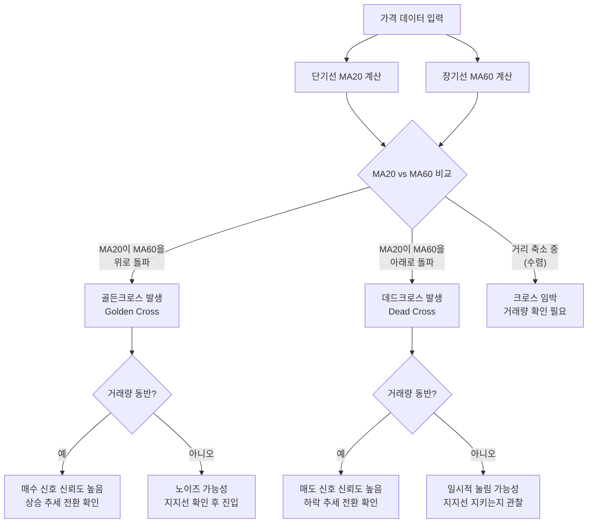
```mermaid
flowchart TD
    PX[가격 데이터 입력] --> MA20[단기선 MA20 계산]
    PX --> MA60[장기선 MA60 계산]

    MA20 --> CMP{MA20 vs MA60 비교}
    MA60 --> CMP

    CMP -- "MA20이 MA60을\n위로 돌파" --> GC["골든크로스 발생\nGolden Cross"]
    CMP -- "MA20이 MA60을\n아래로 돌파" --> DC["데드크로스 발생\nDead Cross"]
    CMP -- "거리 축소 중\n(수렴)" --> CV["크로스 임박\n거래량 확인 필요"]

    GC --> GC_V{거래량 동반?}
    GC_V -- 예 --> GC_BUY["매수 신호 신뢰도 높음\n상승 추세 전환 확인"]
    GC_V -- 아니오 --> GC_WAIT["노이즈 가능성\n지지선 확인 후 진입"]

    DC --> DC_V{거래량 동반?}
    DC_V -- 예 --> DC_SELL["매도 신호 신뢰도 높음\n하락 추세 전환 확인"]
    DC_V -- 아니오 --> DC_WAIT["일시적 눌림 가능성\n지지선 지키는지 관찰"]
```

- **골든크로스**: 단기선(MA20)이 장기선(MA60)을 위로 돌파 → 상승 추세 전환 신호
- **데드크로스**: 단기선이 장기선을 아래로 돌파 → 하락 추세 전환 신호
- 크로스 하나만 보지 않고 **거래량·지지저항**과 함께 봐야 신호 신뢰도가 높아집니다.

**이동평균선 정배열·역배열 실전 판단**

```
정배열(상승 강세):  MA5 > MA20 > MA60 > MA200
역배열(하락 약세):  MA5 < MA20 < MA60 < MA200
```

| 이동평균 활용 | 실전 포인트 |
|--------------|-------------|
| MA5·MA20 골든크로스 | 단기 매수 신호, 빠르지만 노이즈 많음 |
| MA20·MA60 골든크로스 | 중기 추세 전환 신호, 신뢰도 높음 |
| 가격이 MA200 위 → 아래 이탈 | 장기 하락 추세 전환 경고 |
| MA20이 지지선 역할 | 눌림목 매수 대기 구간 |

**실전 예시**: 코스피 2020년 코로나 저점 이후 MA20 > MA60 골든크로스 발생 → 이후 12개월 상승 추세 지속

### 3. 갭(Gap) 반전 분석

> 📖 **Wikipedia**: [갭 (금융)](https://ko.wikipedia.org/wiki/갭_(금융))


갭은 전날 종가와 다음 날 시가 사이에 가격이 크게 비어 있는 구간입니다.

| 갭 종류 | 특징 | 의미 |
|---------|------|------|
| **보통 갭** | 작은 갭, 빠르게 메움 | 일시적 수급 불균형 |
| **돌파 갭(Breakaway)** | 박스권·저항선 돌파 후 발생 | 강한 추세 시작 신호 |
| **달아나는 갭(Runaway)** | 추세 중간에 발생 | 추세 지속 신호 |
| **소진 갭(Exhaustion)** | 추세 끝에서 마지막 힘 | 추세 마감 경고 |

- 갭이 나온 뒤 거래량이 붙는지, 다시 메워지는지 확인하면 일시 반응인지 추세 시작인지 구분됩니다.

**갭 상승 후 체크리스트**

```
갭 상승 후 체크리스트:
□ 거래량이 평균의 2배 이상인가?  → 강한 추세 시작 가능성
□ 다음 날 갭을 메우려는 시도가 있는가?  → 소진갭 가능성
□ 갭 발생 전 박스권 상단을 돌파했는가?  → 돌파 갭 (추세 시작)
□ 갭 발생 후 5일 내 갭을 완전히 메우는가?  → 보통 갭 (일시적)
```

**실전 예시**: 실적 서프라이즈 발표 후 상승 갭 → 거래량 동반 + 박스권 돌파 → 돌파 갭으로 판단 → 눌림목 매수 전략 유효

### 4. 되돌림 분석 (피보나치 되돌림)

> 📖 **Wikipedia**: [피보나치 수열](https://ko.wikipedia.org/wiki/피보나치_수열) · [피보나치 되돌림](https://ko.wikipedia.org/wiki/피보나치_되돌림)


피보나치 수열에서 파생된 비율을 이용해 조정이 멈출 만한 구간을 가늠합니다.

**주요 피보나치 되돌림 레벨**

| 레벨 | 의미 |
|------|------|
| 23.6% | 약한 조정 후 지지 |
| 38.2% | 일반적 조정의 지지 |
| **50.0%** | 심리적 중간점 |
| **61.8%** | 황금비율 — 강력한 지지·저항 |
| 78.6% | 깊은 되돌림 |

- 피보나치 비율을 맹신하기보다 **지지선·저항선과 겹치는 구간**을 우선적으로 신뢰합니다.

**되돌림 실전 활용**

```
실전 예시:
주가가 50,000 → 80,000원으로 상승 후 조정 시작
피보나치 되돌림 적용:
  38.2% 되돌림 = 80,000 - (80,000-50,000)×0.382 = 68,540원 → 1차 지지
  61.8% 되돌림 = 80,000 - (80,000-50,000)×0.618 = 61,460원 → 강한 지지
68,540원 구간 + MA20 지지 겹침 → 높은 신뢰도의 매수 구간
```

| 되돌림 깊이 | 추세 강도 | 대응 |
|------------|----------|------|
| 23.6% 이하 | 매우 강한 상승 추세 | 추격 매수 가능 |
| 38.2% | 건강한 조정 | 눌림목 매수 적기 |
| 61.8% | 추세 확인 구간 | 신중한 매수 |
| 78.6% 초과 | 추세 약화 가능성 | 손절 후 관망 |

### 5. 보조지표: RSI, MACD, 볼린저밴드

> 📖 **Wikipedia**: [상대강도지수](https://ko.wikipedia.org/wiki/상대강도지수) · [MACD](https://ko.wikipedia.org/wiki/MACD) · [볼린저 밴드](https://ko.wikipedia.org/wiki/볼린저_밴드)


**RSI (Relative Strength Index, 상대강도지수)**

```
RSI = 100 - 100 / (1 + RS)
RS  = 14일 평균 상승폭 / 14일 평균 하락폭
```


**RSI 신호 판단 흐름**

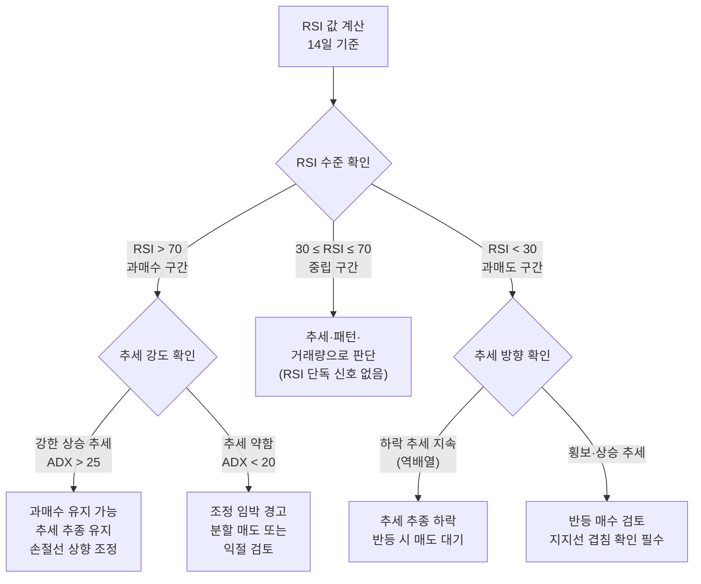
```mermaid
flowchart TD
    RSI_IN[RSI 값 계산\n14일 기준] --> RSI_CHK{RSI 수준 확인}

    RSI_CHK -- "RSI > 70\n과매수 구간" --> OB{추세 강도 확인}
    OB -- "강한 상승 추세\nADX > 25" --> OB_HOLD["과매수 유지 가능\n추세 추종 유지\n손절선 상향 조정"]
    OB -- "추세 약함\nADX < 20" --> OB_SELL["조정 임박 경고\n분할 매도 또는\n익절 검토"]

    RSI_CHK -- "30 ≤ RSI ≤ 70\n중립 구간" --> MID["추세·패턴·\n거래량으로 판단\n(RSI 단독 신호 없음)"]

    RSI_CHK -- "RSI < 30\n과매도 구간" --> OS{추세 방향 확인}
    OS -- "하락 추세 지속\n(역배열)" --> OS_WAIT["추세 추종 하락\n반등 시 매도 대기"]
    OS -- "횡보·상승 추세" --> OS_BUY["반등 매수 검토\n지지선 겹침 확인 필수"]
```

**MACD (Moving Average Convergence Divergence)**

```
MACD    = EMA12 - EMA26
Signal  = MACD의 9일 EMA
히스토그램 = MACD - Signal
```


**MACD 신호 판단 흐름**

```mermaid
flowchart TD
    MACD_IN[MACD / Signal / 히스토그램 계산] --> HIST{히스토그램 방향}

    HIST -- "0선 상향 돌파\n(음→양 전환)" --> BUY_SIG["매수 신호\nMACD가 Signal 위로"]
    HIST -- "0선 하향 돌파\n(양→음 전환)" --> SELL_SIG["매도 신호\nMACD가 Signal 아래로"]
    HIST -- "양수 확대 중" --> TREND_UP["상승 모멘텀 강화\n추세 추종 유지"]
    HIST -- "음수 확대 중" --> TREND_DN["하락 모멘텀 강화\n현금 보유 또는 공매도"]

    BUY_SIG --> DIV{가격과 MACD\n다이버전스 확인}
    SELL_SIG --> DIV
    DIV -- "상승 다이버전스\n(가격↓ MACD↑)" --> DIV_BUY["추세 반전 가능성\n강한 매수 신호"]
    DIV -- "하락 다이버전스\n(가격↑ MACD↓)" --> DIV_SELL["추세 약화 경고\n매도 준비"]
```

**볼린저밴드 (Bollinger Bands)**

```
중심선    = MA20
상단밴드   = MA20 + 2σ (표준편차)
하단밴드   = MA20 - 2σ
```


- 밴드 폭 좁아짐(수렴) → 변동성 축소, 곧 큰 움직임 예고
- 가격이 상단 터치 후 꺾임 → 과열 주의

지표 간 방향이 일치하는지 확인하는 습관이 신호 신뢰도를 높입니다.

## 해보기 활동


오늘은 차트에서 "어디를 봐야 하는지"를 직접 표시해보세요.

1. [pykrx](https://github.com/sharebook-kr/pykrx) 또는 yfinance로 관심 종목 1개의 최근 1년 OHLCV를 수집하고, 가격·고가·저가·거래량이 모두 정상적으로 들어왔는지 확인하세요.
2. 위 멀티패널 차트 코드를 실행해 4패널 차트를 그리고, 골든크로스·데드크로스가 발생한 날짜와 당시 주가를 기록하세요.
3. 교육데이터플랫폼 시각화가이드 6가지 유형 중 **시간·분포·관계** 3가지를 골라 기술적 분석 차트로 각각 구현하세요. 예: 시간(MA 추이), 분포(일별 수익률 히스토그램), 관계(가격 vs 거래량 산점도).
4. RSI 과매수 구간(70 초과)에서 실제로 가격이 조정되었는지, 추세가 지속되었는지 차트에서 최소 2개 구간을 찾아 비교하세요.
5. MACD 히스토그램이 음수에서 양수로 전환되는 시점(매수 신호)과 실제 주가 반응을 비교해, "신호가 맞았던 경우"와 "맞지 않았던 경우"를 각각 1개씩 찾으세요.
6. 수정 주가와 수정 전 주가로 각각 MA20을 계산하고, 배당·분할이 있던 날짜 전후로 두 선이 어떻게 달라지는지 확인하세요.
7. 최종 산출물로 `technical_analysis_report.pdf` 목차를 만들고, 데이터 출처·수집일·지표 파라미터·수정 주가 여부·투자 유의사항을 포함하세요.


---

# 주식에서 왜 "이동평균"이라고 부르는가?

**이동평균(Moving Average)**의 "이동(moving)"은 평균값이 **시간에 따라 지속적으로 갱신되며 앞으로 이동**한다는 특성을 정확히 나타냅니다.

## 1. 이동평균의 계산 방식

이동평균은 특정 기간(예: 5일, 20일, 60일)의 가격(주로 종가)을 평균 내어 계산합니다.

### 단순 이동평균(SMA) 예시 (5일 이동평균)
- 오늘 포함 최근 5일 종가의 평균 = (오늘 + 1일전 + 2일전 + 3일전 + 4일전) ÷ 5
- **내일**이 되면 가장 오래된 날짜(4일전)가 빠지고, 새로운 오늘(내일) 가격이 들어와 평균이 다시 계산됩니다.

이처럼 **가장 오래된 데이터가 제외되고 최신 데이터가 포함**되는 과정을 반복하기 때문에, 평균선이 차트상에서 **시간축을 따라 계속 이동**합니다. 그래서 "이동"이라는 단어를 사용합니다.

## 2. "이동"이라는 표현의 의미

- **정적 평균(Static Average)**: 고정된 기간 전체의 평균 (예: 2025년 1월~12월 전체 평균). 한 번 계산하면 변하지 않음.
- **이동 평균(Moving Average)**: "이동하는 창(moving window)"이 시간과 함께 앞으로 이동하면서 평균을 계속 갱신.

이 **이동하는 창** 개념이 "Moving Average"라는 이름의 핵심입니다.

## 3. 실전에서의 의미

이동평균은 가격의 **추세(Trend)**를 평활화(Smoothing)하여 판단하기 쉽게 해줍니다.

- **골든크로스**: 단기 이동평균이 장기 이동평균을 위로 뚫고 올라갈 때 → 상승 추세 전환 신호
- **데드크로스**: 단기 이동평균이 장기 이동평균을 아래로 뚫고 내려갈 때 → 하락 추세 전환 신호

이러한 신호가 가능한 이유는 평균이 실시간으로 "이동"하면서 최근 가격 흐름을 지속적으로 반영하기 때문입니다.

---

# 📊 국내 및 미국 주식 시장 거래 시간대 정리

## 1. 국내 주식 시장 거래 시간 (한국거래소 기준)
한국 주식 시장은 정규장 전후로 시간외 거래가 촘촘하게 나누어져 있어, 전략에 따라 다양한 시간대에 거래할 수 있습니다.

| 구분 | 거래 시간 | 특징 및 매매 방식 |
| :--- | :--- | :--- |
| **장시작 전 동시호가** | 08:30 ~ 09:00 | 주문을 모았다가 09:00 정각에 하나의 시가로 체결 |
| **정규장** | **09:00 ~ 15:30** | 실시간으로 가격이 맞으면 바로 체결되는 메인 시장 |
| **장마감 동시호가** | 15:20 ~ 15:30 | 마지막 10분간 주문을 모아 15:30에 최종 종가 확정 |
| **장후 시간외 종가** | 15:40 ~ 16:00 | 당일 확정된 **종가 고정**으로 실시간 선착순 체결 |
| **시간외 단일가** | 16:00 ~ 18:00 | 10분마다 주문을 모아서 체결 (당일 종가 대비 ±10% 제한) |

---

## 2. 미국 주식 시장 거래 시간 (한국 시간 기준)
미국 증시는 정규장 앞뒤로 프리마켓(장전 거래)과 애프터마켓(장후 거래)이 길게 열립니다. 또한, 국내 주요 증권사를 통해 낮 시간대에도 거래할 수 있는 주간거래(데이마켓) 서비스가 제공되어 사실상 24시간 가깝게 거래가 가능합니다.

> 💡 **주의:** 미국은 **서머타임(3월 둘째 주 일요일 ~ 11월 첫째 주 일요일)** 적용 여부에 따라 한국 시간이 1시간씩 당겨지거나 늦춰집니다.

### ☀️ 서머타임 적용 시 (3월 ~ 11월)
* **주간거래 (데이마켓):** 09:00 ~ 16:30 (증권사별 상이)
* **프리마켓 (장전 거래):** **17:00 ~ 22:30** (일부 증권사는 18:00부터 지원)
* **정규장 (본장):** **22:30 ~ 익일 05:00** (거래량이 가장 많고 변동성이 활발한 시간)
* **애프터마켓 (장후 거래):** 05:00 ~ 07:00 (증권사별로 최대 09:00까지 연장 지원)

### ❄️ 서머타임 해제 시 (11월 ~ 익년 3월)
* **주간거래 (데이마켓):** 10:00 ~ 17:30
* **프리마켓 (장전 거래):** **18:00 ~ 23:30**
* **정규장 (본장):** **23:30 ~ 익일 06:00**
* **애프터마켓 (장후 거래):** 06:00 ~ 08:00

---

## ⚠️ 거래 시 유의사항
1. **정규장 외 거래의 변동성:** 프리마켓, 애프터마켓, 주간거래는 정규장에 비해 참여자가 적어 **거래량이 부족**할 수 있습니다. 
2. **호가 스프레드:** 매수와 매도 가격 간의 격차가 벌어지기 쉬우므로, 원하는 가격에 즉시 체결되지 않거나 순간적으로 가격이 급변할 수 있습니다.
3. **주문 방식 추천:** 변동성 리스크를 줄이기 위해 정규장 외 시간대에는 시장가 주문보다는 가급적 **지정가 주문**을 사용하는 것이 안전합니다.


"이동평균"이라는 이름은 평균이 **고정되어 있지 않고, 새로운 데이터가 들어올 때마다 창이 이동하며 계속 갱신된다**는 본질적인 특징을 가장 잘 드러내는 표현입니다.

영어권에서도 **Moving Average**, 한국어로도 **이동평균**이 국제적으로 통용되는 표준 용어입니다.

---

# 한국 주식 상한가·하한가 기준 안내

한국 주식 시장(코스피, 코스닥)의 **상한가**와 **하한가** 기준에 대한 설명입니다.

---

## 1. 상한가와 하한가란?

주식 시장에서 하루 동안 개별 종목의 주가가 움직일 수 있는 **최대 상승 제한 폭(상한가)**과 **최대 하락 제한 폭(하한가)**을 의미합니다. 

급격한 주가 변동으로부터 투자자를 보호하고 시장의 안정을 유지하기 위해 도입된 일종의 안전장치(가격제한폭 제도)입니다.

---

## 2. 현재 대한민국 주식 시장 기준

현재 한국거래소(KRX) 코스피와 코스닥 시장의 가격제한폭은 **기준가 대비 ±30%**입니다.

* **상한가:** 당일 기준가 + 30%
* **하한가:** 당일 기준가 - 30%

> 💡 **참고 (역사적 변경):** 과거에는 ±15%였으나, 시장의 자율성을 높이기 위해 2015년 6월 15일부터 현재의 ±30%로 확대되었습니다.

---

## 3. 가격 계산 방식 (호가단위 적용)

상한가와 하한가를 계산할 때는 단순히 30%를 곱하는 것에 그치지 않고, 주가 원미만 단위 절사 및 **호가 가격 단위**에 맞춰 조정됩니다.

### 호가 가격 단위 (코스피/코스닥 공통)
주가 범위에 따라 움직일 수 있는 최소 가격 단위가 다릅니다.

| 주가 범위 | 호가 단위 |
| :--- | :--- |
| 2,000원 미만 | 1원 |
| 2,000원 이상 ~ 5,000원 미만 | 5원 |
| 5,000원 이상 ~ 20,000원 미만 | 10원 |
| 20,000원 이상 ~ 50,000원 미만 | 50원 |
| 50,000원 이상 ~ 200,000원 미만 | 100원 |
| 200,000원 이상 ~ 500,000원 미만 | 500원 |
| 500,000원 이상 | 1,000원 |

### 🧮 예시: 기준가가 10,000원인 주식의 상한가 계산
1. **단순 30% 계산:** 10,000원 × 1.30 = 13,000원
2. **호가 단위 확인:** 10,000원 이상 ~ 20,000원 미만 구간의 호가 단위는 **10원**입니다.
3. **최종 상한가:** 13,000원은 10원 단위로 딱 떨어지므로, 이 종목의 당일 상한가는 **13,000원**이 됩니다.

---

## 4. 예외 및 특이사항

* **정리매매 종목:** 상장폐지가 결정되어 마지막으로 거래 기회를 주는 '정리매매' 기간에는 **상·하한가 제한폭이 적용되지 않습니다.** (하루에 몇백 %가 오르거나 내릴 수 있음)
* **신규 상장 주식:** 신규 상장일에는 공모가의 **60% ~ 400%**까지 가격 제한폭이 훨씬 넓게 적용됩니다.
* **미국 주식 시장:** 미국(NYSE, NASDAQ 등)은 한국과 달리 **상한가, 하한가 제도가 없습니다.** 대신 시장 전체가 급락할 때 매매를 일시 중단하는 '서킷 브레이커'나 개별 종목 변동성 완화 장치만 존재합니다.

---

# 주식 및 자산 시장의 시간대별 거래 활성화 분석

본 문서는 하루 중 자산 시장(주식, 가상화폐 등)의 거래가 활발한 시간대와 그 배경 원인에 대해 분석한 내용을 담고 있습니다.

---

## 1. 하루 중 거래가 가장 활발한 시간대

자산 시장에서 하루 중 거래량과 변동성이 가장 높은 시간대는 보통 **장 개시 직후**와 **장 마감 직전**입니다. 트레이더들 사이에서는 거래량 차트가 잔 모양을 닮았다고 하여 이를 **'유자(U)형 패턴'** 또는 **'컵 패턴'**이라고 부릅니다.

### ⚡ 피크 타임 1: 장 개시 후 1시간 (오전 09:00 ~ 10:00)
하루 중 거래량과 변동성이 가장 높은 황금 시간대입니다. 전체 하루 거래량의 상당 부분이 이 시기에 집중됩니다.
* **원인:** 정규장이 닫혀 있던 밤새 쌓인 뉴스, 미국 증시 흐름, 기업 공시 등의 정보가 개장과 동시에 한꺼번에 가격에 반영됩니다.
* **특징:** 가격 변동이 매우 빠르고 거칠기 때문에 단타 매매(데이 트레이딩) 투자자들이 가장 집중하는 시간입니다.

### 🔔 피크 타임 2: 장 마감 전 1시간 (오후 14:30 ~ 15:30)
장 마감이 다가오면서 다시 한번 거래량이 크게 솟구치는 시간대입니다. 특히 마지막 30분(오후 15:00 ~ 15:30)은 '파워 아워(Power Hour)'라고 불립니다.
* **원인:** 기관 투자자나 외국인들이 하루의 포지션을 정리하거나 내일을 위한 물량을 확보(종가 베팅)합니다. 당일 단타 매매를 하던 개인 투자자들도 오버나이트 리스크를 피하기 위해 현금화하는 움직임이 겹칩니다.
* **특징:** 당일 주가의 최종 종가가 결정되는 순간이므로 비교적 신뢰도 높은 추세가 형성됩니다.

### 💤 가장 한산한 시간대: 점심 및 오후 초반 (오전 11:30 ~ 오후 14:00)
기관 트레이더들의 점심 휴식 등으로 인해 시장 유동성이 급격히 줄어듭니다. 거래량이 적어 주가가 횡보하거나, 작은 주문에도 가격이 왜곡되는 경향이 있습니다.

---

## 2. 오후 4시대 한산함 vs 저녁 8시 이후 활성화의 원인

오후 4시대는 폭풍이 지나간 듯 고요한 반면, 저녁 8시가 넘어가면서 시장이 다시 꿈틀거리는 현상은 **글로벌 금융 중심지(미국 및 유럽)의 시차와 출근 시간** 때문입니다.

### 📉 오후 4시대가 한산한 이유: "아시아 시장의 퇴근"
대한민국 정규장(15:30 마감)을 비롯하여 중국, 일본 등 아시아 주요 증시가 오후 4시 전후로 모두 종료됩니다. 아시아 지역의 대형 투자자(기관, 고래)들이 거래를 마치고 퇴근하므로 유동성이 일시적으로 바닥을 치게 됩니다.

### 🔥 저녁 8시 이후 활발해지는 이유: "서구권 시장의 출근"
한국 시간 저녁 8시(20:00)는 지구 반대편의 **유럽 시장이 한창 돌아가는 시간**인 동시에, 세계 최대 시장인 **미국 증시의 프리마켓(장전 시간외 거래)이 본격화되는 시간**입니다.

1. **미국 프리마켓 활성화:** 미국 본장 개장 전, 저녁 6~8시부터 기관들과 글로벌 투자자들의 사전 거래가 활발해집니다. 주요 경제 지표와 기업 실적 발표가 이 시간에 집중됩니다.
2. **유럽 증시와의 교차:** 런던, 프랑크푸르트 등 유럽 증시의 오후 거래와 미국의 오전 거래 준비 시간이 맞물리며 글로벌 자금 이동이 극대화됩니다.

---

## 📊 자산별 저녁 8시 이후 흐름 요약

* **가상화폐 (비트코인 등):** 24시간 거래되지만, 미국 동부 기준 아침 시간(한국 시간 저녁 7~8시)에 서구권 트레이더들이 모니터 앞에 앉으면서 거래량과 변동성이 폭발합니다.
* **해외 주식 (미국 주식):** 본장 개장 전에 뉴스나 지표를 확인한 투자자들이 프리마켓에서 주문을 쏟아내며 거래량이 치솟습니다.
* **국내 주식 야간 거래:** 저녁 6시부터 밤 10시까지 진행되는 시간외 단일가 매매 및 야간 선물 시장에서 미국 시장의 분위기를 선반영하려는 움직임이 나타납니다.

---
*요약하자면, 오후 4시는 아시아 트레이더들이 컴퓨터를 끄는 시간이고, 저녁 8시는 전 세계 자금의 절대다수를 움직이는 미국과 유럽의 트레이더들이 출근해 거래를 시작하는 시간이기 때문입니다.*


---

## 원문: finance_technical_analysis_2.txt

# 기술적 분석 II (패턴 & 엘리어트 파동)


---

>
> 📝 **한자 병기 및 어원 사전**: 이 문서에 등장하는 용어의 한자·어원·일제강점기 유래는 → [voca.md](voca.md)

## 오늘 배울 것


- 캔들 패턴 분석 (도지, 망치, 장악형 등)
- 차트 패턴 분석 (헤드앤숄더, 이중천장 등)
- 엘리어트 파동 이론 개요
- 실습: 종목 선정 후 기본적·기술적 분석 통합 리포트

---

## 🔗 참고 사이트 & 데이터 원천


> 이 문서(기술적 분석 II — 캔들 패턴·차트 패턴·엘리어트 파동·통합 리포트)의 실습에 필요한 공식 데이터 출처와 참고 사이트입니다. ⚿ 는 API 키 또는 승인이 필요한 항목입니다.

### 📊 국내외 시장 데이터

| 기관/서비스 | URL | API 키 | 제공 데이터 |
|------------|-----|--------|-------------|
| yfinance (PyPI) | <https://pypi.org/project/yfinance> | 불필요 | 국내외 종목 OHLCV·재무 데이터 |
| pykrx (PyPI) | <https://pypi.org/project/pykrx> | 불필요 | 국내 종목 주가·거래량 시계열 |
| mplfinance (PyPI) | <https://pypi.org/project/mplfinance> | 불필요 | 캔들 패턴·차트 패턴 시각화 |
| pandas-ta (PyPI) | <https://pypi.org/project/pandas-ta> | 불필요 | 캔들 패턴 감지·기술 지표 계산 |
| DART(전자공시시스템) | <https://opendart.fss.or.kr> | ⚿ 필요 | 통합 리포트용 기업 재무 데이터 |
| KRX Data Marketplace | <https://openapi.krx.co.kr> | ⚿ 필요 | 공식 OHLCV 데이터 |

### 📈 차트·트레이딩 플랫폼 (학습·레퍼런스)

| 서비스 | URL | 활용 용도 |
|--------|-----|-----------|
| TradingView | <https://www.tradingview.com> | 캔들·차트 패턴 실시간 확인, 엘리어트 파동 도구 |
| Investing.com | <https://www.investing.com> | 기술 패턴 자동 감지·시그널 |
| StockCharts | <https://stockcharts.com> | 차트 패턴 사전·학습 자료 |

### 🏦 증권사 리서치센터 (통합 리포트 레퍼런스)

| 증권사 | URL | 활용 용도 |
|--------|-----|-----------|
| 미래에셋증권 리서치 | <https://securities.miraeasset.com> | 기본적·기술적 통합 분석 리포트 양식 |
| 삼성증권 리서치 | <https://www.samsungpop.com> | 종목 리포트·매매 의견 구조 참고 |
| 대신증권 리서치 | <https://www.daishin.com> | 기술적 분석 포함 주간 리포트 |
| 신한투자증권 | <https://www.shinhaninvest.com> | 통합 리포트 형식 참고 |
| FnGuide | <https://www.fnguide.com> | 컨센서스·투자의견 데이터 |

### 📰 금융 미디어 & 정보 포탈

| 서비스 | URL | 활용 용도 |
|--------|-----|-----------|
| 머니투데이 방송(MTN) | <https://mtn.co.kr> | 패턴·파동 분석 시황 해설 |
| 한국경제TV(WOW TV) | <https://www.wowtv.co.kr> | 기술 분석 실전 매매 방송 |
| 네이버 금융 | <https://finance.naver.com> | 종목 차트·기업 정보 조회 |
| 금융감독원(FSS) | <https://www.fss.or.kr> | 공시·감독 규정 확인 |
| 금융위원회 | <https://www.fsc.go.kr> | 자본시장·증권 규제 정보 |

---

### 1. 캔들 패턴 분석 (도지, 망치, 장악형 등)

> 📖 **Wikipedia**: [캔들스틱 차트](https://ko.wikipedia.org/wiki/캔들스틱_차트)

캔들 차트 하나(봉)는 시가·고가·저가·종가를 한눈에 보여줍니다. 캔들의 몸통 크기와 꼬리 길이가 그날의 매수·매도 심리를 나타냅니다.

**캔들의 구조**

```mermaid
block-beta
  columns 1
  H["🔺 고가 (High)\n위 꼬리 / 윗 그림자"]
  O["📦 시가 (Open)\n음봉: 시가 > 종가 → 하락 (빨간/회색)"]
  C["📦 종가 (Close)\n양봉: 시가 < 종가 → 상승 (파란/흰색)"]
  L["🔻 저가 (Low)\n아래 꼬리 / 아랫 그림자"]

  H --> O
  O --> C
  C --> L
```


**OHLC 관계도**

```mermaid
flowchart TD
    H(["고가 High"]):::high
    O(["시가 Open"]):::open
    C(["종가 Close"]):::close
    L(["저가 Low"]):::low

    H -->|"위 꼬리"| O
    O -->|"몸통 (음봉: O > C)"| C
    C -->|"아래 꼬리"| L

    classDef high fill:#ff6b6b,color:#fff,stroke:#c0392b
    classDef open fill:#f39c12,color:#fff,stroke:#d35400
    classDef close fill:#3498db,color:#fff,stroke:#2980b9
    classDef low fill:#2ecc71,color:#fff,stroke:#27ae60
```

**주요 캔들 패턴**

| 패턴 | 모양 특징 | 의미 |
|------|-----------|------|
| **도지(Doji)** | 몸통이 거의 없음 (시가≈종가) | 매수·매도 균형, 방향 전환 가능성 |
| **망치(Hammer)** | 짧은 몸통 + 긴 아래 꼬리 (하락 후 나타남) | 매도세가 결국 매수세에 밀림 → 반등 신호 |
| **역망치(Inverted Hammer)** | 짧은 몸통 + 긴 위 꼬리 (하락 후 나타남) | 매수 시도 후 저항, 반등 가능성 |
| **교수형(Hanging Man)** | 망치와 모양 같지만 상승 후 나타남 | 상승 추세 마감 신호 |
| **불리쉬 엔걸핑(Bullish Engulfing)** | 큰 양봉이 앞날 음봉 전체를 덮음 | 강한 매수 전환 신호 |
| **베어리쉬 엔걸핑(Bearish Engulfing)** | 큰 음봉이 앞날 양봉 전체를 덮음 | 강한 매도 전환 신호 |
| **샛별(Morning Star)** | 음봉 → 도지 → 양봉 3캔들 조합 | 바닥 반전 강한 신호 |


**캔들 패턴 실전 활용 — 패턴만으로 매매하면 안 되는 이유**

| 체크 항목 | 이유 |
|-----------|------|
| 패턴 발생 위치 (지지선·저항선 근처인가?) | 위치가 맞아야 신뢰도 상승 |
| 거래량이 평균보다 많은가? | 거래량 동반 시 신호 강도 증가 |
| 다음 봉이 방향을 확인해주는가? | 확인봉 없이 단독 진입은 위험 |
| 추세 방향과 일치하는가? | 추세 역방향 패턴은 성공률 낮음 |

**실전 신뢰도 판단 흐름**

```mermaid
flowchart TD
    A([캔들 패턴 발견]) --> B{지지·저항선\n근처인가?}
    B -- 아니오 --> Z1([신뢰도 낮음 → 관망])
    B -- 예 --> C{거래량\n평균 초과?}
    C -- 아니오 --> Z2([신호 약함 → 소규모 진입])
    C -- 예 --> D{다음 봉이\n방향 확인?}
    D -- 아니오 --> Z3([확인봉 대기])
    D -- 예 --> E{추세 방향\n일치?}
    E -- 아니오 --> Z4([역추세 패턴 → 신중])
    E -- 예 --> F([✅ 4조건 충족 → 높은 신뢰도 매수·매도 신호])

    style A fill:#34495e,color:#fff
    style F fill:#27ae60,color:#fff
    style Z1 fill:#c0392b,color:#fff
    style Z2 fill:#e67e22,color:#fff
    style Z3 fill:#f39c12,color:#fff
    style Z4 fill:#8e44ad,color:#fff
```

**캔들 패턴 Python 시각화**


---

### 2. 차트 패턴 분석 (헤드앤숄더, 이중천장 등)

> 📖 **Wikipedia**: [기술적 분석](https://ko.wikipedia.org/wiki/기술적_분석_(금융)) · [머리어깨형](https://ko.wikipedia.org/wiki/머리어깨형)

차트 패턴은 여러 캔들에 걸쳐 형성되는 **가격 흐름의 모양**으로, 추세 전환이나 지속을 예측하는 데 활용합니다.


**반전 패턴 (Reversal Patterns)**

| 패턴 | 모양 | 신호 |
|------|------|------|
| **헤드앤숄더(H&S)** | 세 봉우리 (중간이 가장 높음) | 상승 추세 종료, 하락 전환 |
| **역 헤드앤숄더** | 세 골짜기 (중간이 가장 낮음) | 하락 추세 종료, 상승 전환 |
| **이중천장(Double Top)** | M자 모양 (두 개의 비슷한 고점) | 강한 저항, 하락 전환 |
| **이중바닥(Double Bottom)** | W자 모양 (두 개의 비슷한 저점) | 강한 지지, 상승 전환 |

**헤드앤숄더 패턴 구조**

```mermaid
xychart-beta
    title "헤드앤숄더 (Head & Shoulders) 패턴"
    x-axis ["t1", "LS고점", "t3", "Head고점", "t5", "RS고점", "t7", "넥라인 이탈", "t9"]
    y-axis "가격" 90 --> 160
    line [100, 130, 115, 155, 120, 132, 108, 95, 85]
```

```mermaid
flowchart LR
    subgraph HnS["헤드앤숄더 형성 과정"]
        direction LR
        LS["왼쪽 어깨\n(Left Shoulder)\n1차 고점"]
        H["머리 (Head)\n2차 고점\n가장 높음"]
        RS["오른쪽 어깨\n(Right Shoulder)\n3차 고점\n머리보다 낮음"]
        NL["넥라인\n(Neckline)\n두 골짜기 연결"]
        BD["넥라인 하향 이탈\n↓ 매도 신호 확정"]
        TP["목표가 계산\n= 넥라인 - (머리 - 넥라인)"]
    end

    LS --> H --> RS --> NL --> BD --> TP

    style LS fill:#3498db,color:#fff
    style H fill:#e74c3c,color:#fff
    style RS fill:#3498db,color:#fff
    style NL fill:#f39c12,color:#fff
    style BD fill:#c0392b,color:#fff
    style TP fill:#8e44ad,color:#fff
```


**지속 패턴 (Continuation Patterns)**

| 패턴 | 의미 |
|------|------|
| **삼각수렴(Triangle)** | 변동성 축소 후 기존 방향으로 돌파 |
| **깃발(Flag)** | 급등/급락 후 잠시 쉬고 같은 방향 지속 |
| **페넌트(Pennant)** | 깃발과 유사하나 삼각 수렴 형태 |

**차트 패턴 실전 목표가 계산법**

```mermaid
flowchart TD
    A([패턴 확인]) --> B{패턴 유형?}

    B -->|헤드앤숄더| C["목표가 (하락)\n= 넥라인 - (헤드 고점 - 넥라인)"]
    B -->|이중천장| D["목표가 (하락)\n= 넥라인 - (천장 고점 - 넥라인)"]
    B -->|이중바닥| E["목표가 (상승)\n= 넥라인 + (넥라인 - 바닥 저점)"]
    B -->|삼각수렴| F["목표가\n= 돌파점 ± 삼각형 최대 높이"]

    C --> G([포지션 설정 & 손절선 결정])
    D --> G
    E --> G
    F --> G

    style A fill:#2c3e50,color:#fff
    style G fill:#27ae60,color:#fff
    style C fill:#e74c3c,color:#fff
    style D fill:#e74c3c,color:#fff
    style E fill:#3498db,color:#fff
    style F fill:#9b59b6,color:#fff
```

**패턴 신뢰도 높이는 조건**

| 조건 | 효과 |
|------|------|
| 패턴 형성에 시간이 오래 걸릴수록 | 돌파 후 움직임이 크고 신뢰도 높음 |
| 돌파 시 거래량 급증 | 돌파의 진정성 확인 |
| 넥라인 돌파 후 눌림목에서 지지 확인 | 재진입 기회이자 패턴 확정 |
| 여러 시간대(일봉·주봉)에서 동시 형성 | 더 강한 신호 |

---

### 3. 엘리어트 파동 이론 (Elliott Wave Theory)

> 📖 **Wikipedia**: [엘리엇 파동 이론](https://ko.wikipedia.org/wiki/엘리엇_파동_이론) · [피보나치 수열](https://ko.wikipedia.org/wiki/피보나치_수열)

랄프 넬슨 엘리어트(Ralph Nelson Elliott)가 1930년대에 제안한 이론으로, 주가가 **군중 심리의 반복 패턴**에 따라 파동 형태로 움직인다고 봅니다.


---

#### 3-1. 기본 파동 구조 — 충격 5파 + 조정 3파

상승 추세에서는 **5개의 충격파(임펄스)**와 **3개의 조정파(a-b-c)**가 한 사이클을 이룹니다.

**엘리어트 기본 8파동 구조**

```mermaid
xychart-beta
    title "엘리어트 파동 기본 구조 (충격 5파 + 조정 a-b-c)"
    x-axis ["시작", "1파↑", "2파↓", "3파↑", "4파↓", "5파↑", "a파↓", "b파↑", "c파↓"]
    y-axis "가격 (상대)" 60 --> 160
    line [80, 110, 95, 145, 130, 155, 130, 142, 108]
```

| 파동 구분 | 파동 | 방향 | 군중 심리 |
|-----------|------|------|-----------|
| 충격파(추세) | **1파** | 상승 | 소수만 인식, "반등 아닐까?" |
| 충격파(추세) | **2파** | 하락 | "역시 하락이었어" 공포 매도 |
| 충격파(추세) | **3파** | 강상승 | "진짜 상승이다!" 추세 추종 |
| 충격파(추세) | **4파** | 하락 | 이익 실현, 단기 조정 |
| 충격파(추세) | **5파** | 약상승 | "아직 올라!" 뒤늦은 매수 |
| 조정파(역추세) | **a파** | 하락 | "잠깐 조정이겠지" 낙관 |
| 조정파(역추세) | **b파** | 상승 | "역시 오르네" 반등 매수 |
| 조정파(역추세) | **c파** | 강하락 | 패닉셀, 손절 쏟아짐 |

---

#### 3-2. 절대 불변 규칙 3가지

> 이 규칙 중 하나라도 어기면 파동 카운팅을 전부 재시작해야 합니다.

```mermaid
flowchart TD
    R1["규칙 1\n2파는 1파의 시작점 이하로\n내려가면 안 된다\n(0% 이하 이탈 = 카운팅 무효)"]
    R2["규칙 2\n3파는 5개 충격파 중\n가장 짧은 파동이 되면 안 된다\n(1파·5파 중 하나보다 반드시 길어야)"]
    R3["규칙 3\n4파는 1파의 가격 영역과\n겹치면 안 된다\n(4파 저점 < 1파 고점 → 무효)"]

    CHECK{규칙 위반 발생?}
    VALID([카운팅 유효 → 분석 계속])
    RESET([카운팅 전면 재시작])

    R1 --> CHECK
    R2 --> CHECK
    R3 --> CHECK
    CHECK -->|"모두 준수"| VALID
    CHECK -->|"하나라도 위반"| RESET

    style R1 fill:#e74c3c,color:#fff
    style R2 fill:#e74c3c,color:#fff
    style R3 fill:#e74c3c,color:#fff
    style VALID fill:#27ae60,color:#fff
    style RESET fill:#c0392b,color:#fff
```

---

#### 3-3. 피보나치 비율과 각 파동의 관계

엘리어트 파동이론과 피보나치 수열은 분리할 수 없습니다. 각 파동의 크기는 피보나치 비율을 따르는 경향이 있습니다.

| 파동 | 일반적 피보나치 목표 | 설명 |
|------|---------------------|------|
| **2파** (1파 되돌림) | 0.618 × 1파 크기 | 1파 상승분의 61.8% 되돌림 구간 진입 대기 |
| **3파** (1파 대비 연장) | 1.618 × 1파 크기 | 3파 목표가 = 1파 시작 + (1파 크기 × 1.618) |
| **4파** (3파 되돌림) | 0.382 × 3파 크기 | 3파 상승분의 38.2% 되돌림 (얕은 조정) |
| **5파** (1파와 동일하거나 더 짧음) | 0.618 × 3파 또는 1파와 동일 | 3파 대비 짧게 끝나면 종료 임박 신호 |
| **a파** (5파 되돌림) | 0.382~0.618 × 5파 크기 | a파 크기로 c파 목표 예측 |
| **c파** (a파 연장) | a파 크기와 동일하거나 1.618배 | c파 = a파 시작 - (a파 크기 × 1.0~1.618) |

**실전 예시 (코스피 2020~2022 가상 적용)**

```
2020.03 코스피 1,457 (바닥) → 1파 시작
2020.06 코스피 2,200 → 1파 완성 (+51%)
2020.09 코스피 1,900 → 2파 완성 (1파의 40% 되돌림 ≈ 피보나치 38.2%)
2021.01 코스피 3,266 → 3파 완성 (1파의 2.7배 ≈ 피보나치 261.8%)
2021.05 코스피 2,890 → 4파 완성 (3파의 20% 되돌림)
2021.07 코스피 3,305 → 5파 완성 (새 고점, 거래량 3파 대비 감소)
2022.09 코스피 2,155 → a-b-c 조정 완성
```

**피보나치 되돌림 수준별 파동 매핑**

```mermaid
xychart-beta
    title "피보나치 되돌림 레벨 (1파 크기 = 100 기준)"
    x-axis ["23.6%", "38.2%", "50.0%", "61.8%", "78.6%", "100%", "161.8%", "261.8%"]
    y-axis "되돌림·확장 비율 (%)" 0 --> 280
    bar [23.6, 38.2, 50.0, 61.8, 78.6, 100, 161.8, 261.8]
```

---

#### 3-4. 조정파동의 3가지 유형

5파 상승 후 나타나는 a-b-c 조정은 모두 같은 형태가 아닙니다. 3가지 주요 유형이 있습니다.

**유형 1: 지그재그(Zigzag) — 5-3-5 구조**

```mermaid
xychart-beta
    title "지그재그 조정 (Zigzag: 5-3-5 구조)"
    x-axis ["5파 고점", "a1", "a2", "a3", "a4", "a저점(b시작)", "b반등", "b고점", "c시작", "c1", "c2", "c3", "c저점"]
    y-axis "가격" 60 --> 110
    line [105, 98, 102, 92, 96, 85, 90, 93, 88, 82, 78, 75, 70]
```

- 가장 흔한 조정 패턴
- c파가 a파 저점 아래로 하락 → 큰 되돌림
- 2파에서 자주 나타남

**유형 2: 플랫(Flat) — 3-3-5 구조**

```mermaid
xychart-beta
    title "플랫 조정 (Flat: 3-3-5 구조)"
    x-axis ["5파 고점", "a1", "a저점", "b반등1", "b고점(5파근처)", "c시작", "c1", "c2", "c저점(a저점근처)"]
    y-axis "가격" 75 --> 110
    line [105, 98, 93, 100, 104, 99, 92, 88, 86]
```

- 조정 폭이 얕아 강세장 신호
- 4파에서 자주 나타남

**유형 3: 삼각형(Triangle) — 3-3-3-3-3 구조**

```mermaid
xychart-beta
    title "삼각형 조정 (Triangle: 3-3-3-3-3 수렴)"
    x-axis ["시작", "a고점", "a저점", "b고점", "b저점", "c고점", "c저점", "d고점", "d저점", "e고점", "돌파"]
    y-axis "가격" 80 --> 120
    line [100, 115, 88, 110, 91, 106, 93, 103, 95, 100, 118]
```

- 변동성이 점점 줄어드는 패턴
- 4파 또는 b파에서 나타남
- 삼각형 돌파 방향이 다음 추세 방향

| 유형 | 구조 | c파 위치 | 발생 위치 | 함의 |
|------|------|----------|-----------|------|
| 지그재그 | 5-3-5 | a파 저점 아래 | 주로 2파 | 큰 조정, 매수 기회 낮음 |
| 플랫 | 3-3-5 | a파 저점 근처 | 주로 4파 | 얕은 조정, 추세 강건 |
| 삼각형 | 3-3-3-3-3 | 수렴 후 돌파 | 4파·b파 | 돌파 전 에너지 축적 |

---

#### 3-5. 파동의 프랙탈 구조 (파동 속 파동)

엘리어트 파동의 핵심 특성은 **자기 유사성(프랙탈)**입니다. 큰 파동 하나가 작은 파동들의 집합입니다.

```mermaid
flowchart TD
    GS["Grand Supercycle\n수십 년 단위"]
    SC["Supercycle\n수년 단위"]
    CY["Cycle\n연 단위"]
    PR["Primary\n월 단위"]
    IT["Intermediate\n주 단위"]
    MN["Minor\n일봉"]
    MT["Minute\n분봉"]
    NT["Minuette\n틱/초 단위"]

    GS --> SC --> CY --> PR --> IT --> MN --> MT --> NT

    style GS fill:#1a252f,color:#fff
    style SC fill:#2c3e50,color:#fff
    style CY fill:#34495e,color:#fff
    style PR fill:#2980b9,color:#fff
    style IT fill:#3498db,color:#fff
    style MN fill:#5dade2,color:#fff
    style MT fill:#85c1e9,color:#000
    style NT fill:#aed6f1,color:#000
```

**실전 의미**: 일봉에서 보이는 5파 구조 전체가, 주봉으로 보면 단 하나의 3파일 수 있습니다.
→ 분석 시 **시간대를 여러 개 겹쳐 보는 것**이 중요합니다.

---

#### 3-6. 파동별 실전 매매 전략

| 파동 위치 | 가능한 전략 | 진입 조건 | 손절 기준 |
|-----------|------------|-----------|-----------|
| **2파 완성** | 3파 시작 예상 매수 | RSI 과매도 + 피보나치 61.8% 지지 + 거래량 반등 | 1파 시작점 이탈 시 |
| **3파 진행 중** | 추세 추종 매수 | 이전 고점 돌파 + 거래량 급증 + 정배열 | 4파 시작 조짐(다이버전스) 시 |
| **4파 완성** | 5파 예상 진입 (소형 포지션) | 피보나치 38.2% 지지 + 지지선 반등 확인 | 1파 고점 하향 이탈 시 |
| **5파 말단** | 포지션 축소 / 매도 준비 | RSI 다이버전스 + 거래량 감소 + 피보나치 확장 161.8% | 새로운 고점 형성 시 재검토 |
| **c파 완성** | 새 1파 매수 | 이전 저항선 돌파 + 거래량 회복 + MACD 골든크로스 | c파 저점 이탈 시 |

---

#### 3-7. 실전 파동 식별 6단계 프로세스

```mermaid
flowchart TD
    S1["Step 1. 시간대 설정\n주봉(큰 그림) + 일봉(실전 진입)\n두 시간대 동시 분석"]
    S2["Step 2. 명확한 고점·저점 식별\n최소 3~5개 유의미한\n전환점(swing high/low) 표시"]
    S3["Step 3. 절대 규칙 3가지 검증\n2파: 0% 이하 이탈 여부\n3파: 가장 짧은지 여부\n4파: 1파 고점 침범 여부"]
    S4["Step 4. 피보나치 비율 대조\n각 파동 크기가\n피보나치 비율에 부합하는지 확인"]
    S5["Step 5. 거래량 패턴 확인\n3파: 폭발 / 5파: 3파보다 감소\n조정파: 전반적 감소"]
    S6["Step 6. 보조지표 교차 확인\nRSI·MACD 다이버전스로\n5파·c파 완성 확인"]

    RESULT_V([✅ 카운팅 신뢰 → 매매 전략 수립])
    RESULT_I([⚠️ 규칙 위반 발견 → Step 1부터 재시작])

    S1 --> S2 --> S3 --> S4 --> S5 --> S6
    S3 -->|"규칙 위반"| RESULT_I
    S6 -->|"모든 단계 통과"| RESULT_V

    style S1 fill:#2c3e50,color:#fff
    style S2 fill:#2980b9,color:#fff
    style S3 fill:#e74c3c,color:#fff
    style S4 fill:#f39c12,color:#fff
    style S5 fill:#27ae60,color:#fff
    style S6 fill:#8e44ad,color:#fff
    style RESULT_V fill:#1e8449,color:#fff
    style RESULT_I fill:#922b21,color:#fff
```

---

#### 3-8. 거래량으로 파동 확인하기

| 파동 | 기대되는 거래량 패턴 | 이유 |
|------|---------------------|------|
| 1파 | 평균 이상, 상승 시 | 소수가 먼저 매수 |
| 2파 | 1파보다 감소 | 공포 매도 후 소강 |
| **3파** | **폭발적 증가 (가장 많음)** | 추세 추종 + 뉴스 + 기관 매수 |
| 4파 | 3파보다 감소 | 이익 실현, 관망 |
| 5파 | 3파보다 적음 | 뒤늦은 개인 매수, 기관 매도 |
| a파 | 갑자기 증가 | 예상 못한 하락 |
| b파 | 감소 | 반등이지만 신뢰도 낮음 |
| c파 | 증가 (패닉셀) | 손절물량 + 공매도 |

---

#### 3-9. 실전 조합 전략 — 피보나치·보조지표 연동

```
[최강 매수 조건 — 3파 진입]
  엘리어트 2파 저점 근처
  + 피보나치 61.8% 되돌림 지지
  + RSI < 30 (과매도)
  + MACD 히스토그램 반전 (음→양)
  + 거래량 바닥 후 반등
  → 3파 상승 진입 조건 충족 → 강한 매수 신호

[최강 매도 조건 — 5파 청산]
  엘리어트 5파 고점 근처
  + 피보나치 확장 161.8% 도달
  + RSI 70 이상 + 다이버전스 발생
  + MACD 하락 전환 조짐
  + 거래량 5파가 3파보다 적음
  → a파 시작 경고 → 매도 또는 이익 실현 신호

[조정 완료 확인 — c파 바닥 매수]
  a파·c파 크기 동일 (or c파 = a파 × 1.618)
  + 피보나치 61.8~78.6% 되돌림 지지
  + 캔들 망치봉·역망치봉
  + 거래량 급감 후 반등
  → 새로운 1파 시작 가능성
```

---

#### 3-10. 주의사항 및 한계

| 항목 | 내용 |
|------|------|
| **주관성** | 파동 카운팅은 전문가마다 다를 수 있어 '정답'이 없음 |
| **후행성** | 파동이 완성돼야 확인 가능 — "지나야 보임" 비판 |
| **단독 사용 금지** | RSI·MACD·피보나치·거래량과 반드시 병행 |
| **시간대 선택** | 분봉·일봉·주봉 시간대에 따라 카운팅 결과가 달라짐 |
| **실패 확률** | 5파 이후 반드시 조정이 오지만 시점 예측은 불확실 |


---

### 4. 실습: 종목 선정 후 기본적·기술적 분석 통합 리포트

> 실제 증권사·자산운용사·투자은행에서 사용하는 **주식 리서치 리포트(Equity Research Report)** 수준의 통합 분석 리포트를 작성하는 전 과정을 단계별로 안내합니다.

---

#### 4-1. 통합 리포트란 무엇인가?

기본적 분석(Fundamental Analysis)과 기술적 분석(Technical Analysis)은 각각 단독으로는 한계가 있습니다.

| 구분 | 기본적 분석 | 기술적 분석 |
|------|------------|------------|
| **핵심 질문** | "이 기업이 싼가, 비싼가?" | "지금이 사야 할 때인가?" |
| **주요 도구** | PER, PBR, DCF, EV/EBITDA | MA, RSI, MACD, 볼린저밴드, 파동 |
| **시간 지평** | 중·장기 (6개월~수년) | 단·중기 (수일~수개월) |
| **한계** | 매수 타이밍을 알 수 없음 | 기업 내재가치를 알 수 없음 |

**통합 리포트**는 두 분석을 결합해 "좋은 기업을 좋은 가격과 좋은 타이밍에 사는" 의사결정 체계를 만듭니다.

```mermaid
flowchart LR
    FA["기본적 분석\n(Fundamental)\n내재가치 산출\n저평가 여부 확인"]
    TA["기술적 분석\n(Technical)\n차트 신호 확인\n진입 타이밍 포착"]
    INT["통합 판단\n(Integrated)\nBull / Bear / Neutral\n투자의견 + 목표주가"]

    FA -->|"밸류에이션 점수"| INT
    TA -->|"기술적 신호 점수"| INT
    INT -->|"최종 투자의견"| DECISION["매수 / 관망 / 매도\n+ 목표주가\n+ 손절가"]

    style FA fill:#2980b9,color:#fff
    style TA fill:#8e44ad,color:#fff
    style INT fill:#27ae60,color:#fff
    style DECISION fill:#1a252f,color:#fff
```

---

#### 4-2. Step 1 — 종목 선정 (스크리닝)

통합 리포트를 작성하기 전 분석 대상 종목을 체계적으로 선정합니다.

**종목 선정 3단계 깔때기(Funnel)**

```mermaid
flowchart TD
    POOL["전체 상장 종목\n코스피·코스닥 약 2,500개\n미국 NYSE·NASDAQ 약 6,000개"]

    F1["1차 스크리닝 — 정량 필터\n시가총액 ≥ 1조 원 이상\n최근 3년 영업이익 흑자\n부채비율 ≤ 200%\nPER 0 < x ≤ 업종 평균 × 1.5"]
    F2["2차 스크리닝 — 성장성·수익성 필터\nROE ≥ 10%\n매출 YoY 성장 ≥ 5%\n영업이익률 ≥ 업종 평균\nFCF(잉여현금흐름) > 0"]
    F3["3차 스크리닝 — 기술적 필터\n52주 신고가 대비 -30% 이내\nMA20 > MA60 (정배열)\n거래량 20일 평균 이상"]
    CAND["후보 종목 5~10개 확보"]
    FINAL["최종 분석 대상\n1~3개 선정\n심층 통합 분석 진행"]

    POOL --> F1
    F1 -->|"약 300~500개"| F2
    F2 -->|"약 50~100개"| F3
    F3 -->|"약 10~20개"| CAND
    CAND -->|"업종·테마 분산 고려"| FINAL

    style POOL fill:#34495e,color:#fff
    style F1 fill:#2980b9,color:#fff
    style F2 fill:#2ecc71,color:#fff
    style F3 fill:#8e44ad,color:#fff
    style CAND fill:#f39c12,color:#fff
    style FINAL fill:#e74c3c,color:#fff
```


---

#### 4-3. Step 2 — 기본적 분석 섹션 작성

선정된 종목에 대해 5개 영역을 분석합니다.

**기본적 분석 5-Block 구조**

```mermaid
flowchart TD
    subgraph Block1["① 기업 개요 & 비즈니스 모델"]
        B1a["사업 부문별 매출 비중\n(파이차트)"]
        B1b["경쟁우위(Moat) 분석\n— 브랜드·특허·네트워크효과·원가우위"]
        B1c["ESG 등급 및 지배구조"]
    end

    subgraph Block2["② 재무제표 분석 (3~5개년)"]
        B2a["손익계산서\n매출·영업이익·순이익 추이"]
        B2b["대차대조표\n자산·부채·자본 구조"]
        B2c["현금흐름표\nCFO·CFI·CFF 구분"]
    end

    subgraph Block3["③ 수익성·안정성 지표"]
        B3a["ROE / ROA / ROIC"]
        B3b["부채비율·유동비율·이자보상배율"]
        B3c["영업이익률·순이익률·EBITDA 마진"]
    end

    subgraph Block4["④ 밸류에이션 (절대·상대)"]
        B4a["PER·PBR·PSR·EV/EBITDA\n업종 평균 대비 비교"]
        B4b["DCF (현금흐름할인)\n내재가치 산출"]
        B4c["목표주가 밴드\n상단·하단·중앙값"]
    end

    subgraph Block5["⑤ 리스크 요인"]
        B5a["산업 구조 리스크\n(Porter's 5 Forces)"]
        B5b["기업 고유 리스크\n(규제·경쟁·매출 집중도)"]
        B5c["거시경제 민감도\n(금리·환율·원자재)"]
    end

    Block1 --> Block2 --> Block3 --> Block4 --> Block5

    style Block1 fill:#2980b9,color:#fff
    style Block2 fill:#27ae60,color:#fff
    style Block3 fill:#8e44ad,color:#fff
    style Block4 fill:#e74c3c,color:#fff
    style Block5 fill:#f39c12,color:#fff
```


---

#### 4-4. Step 3 — 기술적 분석 섹션 작성

기본적 분석으로 종목이 선정되면, 기술적 분석으로 **진입 타이밍**과 **손절/목표가**를 설정합니다.

**기술적 분석 체크리스트 (7항목)**

| 번호 | 체크 항목 | 강세 신호 (Bullish) | 약세 신호 (Bearish) |
|------|----------|-------------------|-------------------|
| ① | **추세** | MA20 > MA60 정배열 | MA20 < MA60 역배열 |
| ② | **RSI** | 30~50 구간 (과매도 회복) | 70 이상 (과매수) |
| ③ | **MACD** | 골든크로스 + 히스토그램 양전환 | 데드크로스 + 히스토그램 음전환 |
| ④ | **볼린저밴드** | 하단 터치 후 반등 | 상단 터치 후 반락 |
| ⑤ | **거래량** | 상승 시 거래량 증가 | 상승 시 거래량 감소 |
| ⑥ | **캔들 패턴** | 망치봉·불리쉬 엔걸핑·샛별 | 교수형·베어리쉬 엔걸핑·저녁별 |
| ⑦ | **차트 패턴** | 이중바닥·역H&S 돌파 | 이중천장·H&S 넥라인 이탈 |


---

#### 4-5. Step 4 — 통합 판단 프레임워크 (스코어링)

기본적 분석과 기술적 분석 결과를 합산해 **투자의견**과 **목표주가 밴드**를 산출합니다.

**통합 스코어링 매트릭스**

| 항목 | 평가 기준 | 만점 | 가중치 |
|------|----------|------|--------|
| **기본적 분석** | | **40점** | **40%** |
| — 밸류에이션 | PER·PBR·EV/EBITDA 업종 대비 저평가 | 10점 | |
| — DCF 업사이드 | 내재가치 대비 현재가 할인율 | 10점 | |
| — 수익성·성장성 | ROE ≥ 15%, 매출 성장 ≥ 10% | 10점 | |
| — 재무 안정성 | 부채비율·이자보상배율 양호 | 10점 | |
| **기술적 분석** | | **40점** | **40%** |
| — 추세·MA | 정배열·골든크로스 | 10점 | |
| — 모멘텀 | RSI·MACD 강세 | 10점 | |
| — 볼린저밴드 | 위치·방향성 | 10점 | |
| — 거래량·패턴 | 거래량 확인·차트 패턴 | 10점 | |
| **거시·산업 환경** | | **20점** | **20%** |
| — 금리·경기 | 업종에 유리한 금리·경기 국면 | 10점 | |
| — 산업 성장성 | 업종 TAM 확대·규제 완화 | 10점 | |
| **총점** | | **100점** | **100%** |

```mermaid
flowchart TD
    FA_SCORE["기본적 분석 점수\n0~40점"]
    TA_SCORE["기술적 분석 점수\n0~40점"]
    MACRO_SCORE["거시·산업 점수\n0~20점"]
    TOTAL["총점 합산\n(0~100점)"]

    TOTAL --> JUDGE{총점 범위}
    JUDGE -->|"75점 이상"| BUY(["✅ 강력 매수\nStrong Buy\n목표주가: DCF 상단\n손절가: 지지선 -5%"])
    JUDGE -->|"60~74점"| ACCUM(["🟢 매수 (분할 매수)\nBuy\n목표주가: DCF 중앙값\n손절가: MA60 이탈"])
    JUDGE -->|"45~59점"| HOLD(["⚪ 중립·보유\nHold\n목표주가: 현재 ±10%\n손절 없음 (모니터링)"])
    JUDGE -->|"30~44점"| REDUCE(["🟡 비중 축소\nUnderperform\n목표주가: 현재 -10%"])
    JUDGE -->|"29점 이하"| SELL(["🔴 매도\nSell\n목표주가: 하방 리스크\n즉시 손절 검토"])

    FA_SCORE --> TOTAL
    TA_SCORE --> TOTAL
    MACRO_SCORE --> TOTAL

    style FA_SCORE fill:#2980b9,color:#fff
    style TA_SCORE fill:#8e44ad,color:#fff
    style MACRO_SCORE fill:#27ae60,color:#fff
    style TOTAL fill:#2c3e50,color:#fff
    style BUY fill:#1e8449,color:#fff
    style ACCUM fill:#27ae60,color:#fff
    style HOLD fill:#7f8c8d,color:#fff
    style REDUCE fill:#f39c12,color:#fff
    style SELL fill:#922b21,color:#fff
```

---

#### 4-7. 통합 리포트 구성 요소 — 실제 증권사·금융기관 표준 섹션

실제 Goldman Sachs, Morgan Stanley, JP Morgan, 미래에셋증권, 한국투자증권 등의 **주식 리서치 리포트(Equity Research Report)** 구조를 참고한 표준 템플릿입니다.

```mermaid
flowchart TD
    subgraph COVER["📄 표지 (Cover Page)"]
        C1["기업명 · 종목코드 · 섹터"]
        C2["투자의견 (Buy/Hold/Sell)"]
        C3["목표주가 · 현재가 · 업사이드"]
        C4["리포트 발행일 · 애널리스트 정보"]
    end

    subgraph EXEC["📋 Executive Summary (1페이지)"]
        E1["핵심 투자 포인트 3가지"]
        E2["밸류에이션 요약 테이블"]
        E3["리스크 요약"]
    end

    subgraph BIZ["🏢 기업·산업 개요 (1~2페이지)"]
        B1["비즈니스 모델 설명"]
        B2["사업 부문별 매출 비중"]
        B3["경쟁 지위 · 시장점유율"]
        B4["산업 구조 분석 (Porter's 5 Forces)"]
    end

    subgraph FIN["📊 재무 분석 (2~3페이지)"]
        F1["손익계산서 추이 (3~5개년)"]
        F2["대차대조표 분석"]
        F3["현금흐름표 (FCF 추이)"]
        F4["주요 재무비율 비교 테이블"]
    end

    subgraph VAL["💰 밸류에이션 (1~2페이지)"]
        V1["PER·PBR·EV/EBITDA 업종 비교"]
        V2["DCF 민감도 분석 테이블"]
        V3["목표주가 산출 근거"]
        V4["Bull/Base/Bear 시나리오"]
    end

    subgraph TECH["📈 기술적 분석 (1페이지)"]
        T1["주가 차트 + MA + 볼린저밴드"]
        T2["RSI · MACD · 거래량"]
        T3["지지선·저항선·목표가 표시"]
        T4["차트 패턴 및 파동 분석"]
    end

    subgraph RISK["⚠️ 리스크 요인 (0.5페이지)"]
        R1["투자 리스크 목록"]
        R2["시나리오별 영향도"]
    end

    subgraph DISC["📝 Disclaimer"]
        D1["투자 유의사항 · 법적 고지"]
    end

    COVER --> EXEC --> BIZ --> FIN --> VAL --> TECH --> RISK --> DISC

    style COVER fill:#2c3e50,color:#fff
    style EXEC  fill:#2980b9,color:#fff
    style BIZ   fill:#27ae60,color:#fff
    style FIN   fill:#8e44ad,color:#fff
    style VAL   fill:#e74c3c,color:#fff
    style TECH  fill:#f39c12,color:#000
    style RISK  fill:#7f8c8d,color:#fff
    style DISC  fill:#1a252f,color:#fff
```

---

#### 4-8. UI 제안 — 실제 금융기관 수준의 통합 분석 대시보드

> 아래는 실제 Bloomberg Terminal, Refinitiv Eikon, 키움 HTS, 미래에셋 MTS 수준의 **통합 투자분석 대시보드 UI**를 웹 앱으로 구현하는 상세 제안입니다.

##### UI 전체 레이아웃 구조

```
┌─────────────────────────────────────────────────────────────────────────────┐
│  HEADER: 종목 검색창 │ 종목명 · 현재가 · 등락률 │ 투자의견 배지 │ 날짜·시간  │
├──────────────────────────────┬──────────────────────────────────────────────┤
│  LEFT PANEL (30%)            │  CENTER PANEL (45%)                          │
│  ┌────────────────────────┐  │  ┌──────────────────────────────────────────┐│
│  │ 기업 개요              │  │  │  메인 주가 차트                          ││
│  │ · 기업명 · 종목코드    │  │  │  · 캔들 차트 (OHLCV)                    ││
│  │ · 섹터 · 업종          │  │  │  · MA20 / MA60 / MA120 오버레이         ││
│  │ · 시가총액             │  │  │  · 볼린저밴드 음영                      ││
│  │ · 52주 고/저가         │  │  │  · 거래량 바 차트 (하단)                ││
│  ├────────────────────────┤  │  │  · 지지선·저항선 자동 표시              ││
│  │ 밸류에이션 지표        │  │  │  · 이벤트 마커 (실적·배당 발표일)       ││
│  │ ┌──────┬──────┬──────┐│  │  └──────────────────────────────────────────┘│
│  │ │ PER  │ PBR  │ PSR  ││  │  ┌──────────────────┐ ┌──────────────────────┐│
│  │ │ 12.3 │ 1.8  │ 2.1  ││  │  │  RSI (14)        │ │  MACD (12/26/9)     ││
│  │ └──────┴──────┴──────┘│  │  │  [퍼플 라인]     │ │  [파랑/빨강 + 히스] ││
│  │ EV/EBITDA: 8.2x       │  │  │  ── 70 과매수 ── │ │  ── 0선 ──          ││
│  │ DCF 목표가: 85,000     │  │  │  ── 30 과매도 ── │ └──────────────────────┘│
│  │ 업사이드: +18.3%       │  │  └──────────────────┘                        │
│  ├────────────────────────┤  └──────────────────────────────────────────────┘
│  │ 수익성 지표            │
│  │ ROE:  18.5%  ✅       │  RIGHT PANEL (25%)
│  │ ROA:   9.2%  ✅       │  ┌──────────────────────────────────────────────┐
│  │ 영업이익률: 14.3% ✅   │  │  통합 투자의견                              │
│  ├────────────────────────┤  │  ┌──────────────────────────────────────────┐│
│  │ 재무 안정성            │  │  │           ✅ 매수 (Buy)                  ││
│  │ 부채비율: 65%   ✅    │  │  │         목표주가: ₩85,000               ││
│  │ 유동비율: 180%  ✅    │  │  │         현재가:   ₩71,800               ││
│  │ 이자보상: 12.4x ✅    │  │  │         업사이드: +18.3%                ││
│  ├────────────────────────┤  │  └──────────────────────────────────────────┘│
│  │ 성장성                 │  │                                              │
│  │ 매출 성장: +12.4% ✅  │  │  종합 점수: ████████░░  78 / 100            │
│  │ 영업익 성장: +8.1% ⚠️ │  │                                              │
│  └────────────────────────┘  │  기본적 분석:  ██████░░  38 / 50           │
│                               │  기술적 분석:  ██████░░  35 / 50           │
│                               │  거시·산업:    ████░░░░  15 / 20           │
│                               ├──────────────────────────────────────────────┤
│                               │  기술적 신호 체크리스트                     │
│                               │  ✅ MA 정배열  ✅ RSI 중립권               │
│                               │  ✅ MACD 골든  ⚠️ BB 상단 근처            │
│                               │  ✅ 거래량 증가                            │
│                               ├──────────────────────────────────────────────┤
│                               │  기술적 신호 레이더차트                     │
│                               │  [오각형 레이더 — 5개 지표]                 │
│                               ├──────────────────────────────────────────────┤
│                               │  ⚠️ 리스크 요인                            │
│                               │  • 고PER 밸류에이션 부담: 낮음              │
│                               │  • RSI 과매수: 없음                         │
│                               │  • 역배열 추세: 없음                        │
│                               └──────────────────────────────────────────────┘
└─────────────────────────────────────────────────────────────────────────────┘

FOOTER: 탭 네비게이션
[ 종합 대시보드 ] | [ 재무 분석 ] | [ 밸류에이션 ] | [ 기술적 분석 ] | [ 비교 분석 ] | [ 백테스트 ]
```

##### UI 상세 컴포넌트 명세

**① 헤더 (Header Bar)**

| 컴포넌트 | 기능 | 구현 방식 |
|----------|------|-----------|
| 종목 검색창 | 종목명·코드 입력 → 자동완성 | `<input>` + Fetch API (종목 DB) |
| 현재가 · 등락률 | 실시간 or 지연 시세 | WebSocket / REST polling |
| 투자의견 배지 | Buy/Hold/Sell 색상 배지 | CSS badge (green/gray/red) |
| 리포트 다운로드 | PDF 출력 버튼 | `window.print()` 또는 html2canvas |

**② 좌측 패널 — 기본적 분석 패널**

```mermaid
flowchart TD
    subgraph LeftPanel["좌측 패널 컴포넌트"]
        direction TB
        COMPANY["기업 개요 카드\n로고 · 이름 · 코드 · 섹터"]
        VAL_TABLE["밸류에이션 테이블\nPER · PBR · PSR · EV/EBITDA\n업종 평균과 색상 비교\n(초과=빨강, 할인=초록)"]
        PROFIT["수익성 미터\nROE · ROA · 영업이익률\n진행바(Progress Bar) 표시"]
        STAB["안정성 게이지\n부채비율 · 유동비율\n신호등(🟢🟡🔴) 표시"]
        GROWTH["성장성 스파크라인\n3~5개년 매출·이익 미니 차트"]
        DCF_BOX["DCF 목표가 박스\n현재가 vs 목표가 애니메이션\n업사이드 강조 표시"]
    end

    COMPANY --> VAL_TABLE --> PROFIT --> STAB --> GROWTH --> DCF_BOX
```

**③ 중앙 패널 — 차트 영역**

```mermaid
flowchart TD
    subgraph CenterPanel["중앙 패널 — 차트 영역"]
        direction TB

        TOOLBAR["차트 툴바\n기간 선택: 1M·3M·6M·1Y·3Y·5Y\n지표 토글: MA·BB·RSI·MACD·거래량\n차트 타입: 캔들·라인·OHLC"]

        MAIN_CHART["메인 차트 (Canvas / SVG)\n캔들스틱 + MA 오버레이\n볼린저밴드 음영\n이벤트 마커 (실적발표 ★)"]

        CROSSHAIR["크로스헤어 + 툴팁\n마우스 위치 날짜·가격\nOHLCV 실시간 표시"]

        INDICATOR_AREA["보조지표 서브플롯\n▸ RSI — 과매수·과매도 음영\n▸ MACD — 히스토그램 컬러\n▸ 거래량 — 양봉/음봉 색상"]

        PATTERN_OVERLAY["차트 패턴 오버레이\n감지된 패턴에 레이블 표시\n(지지선·저항선·목표가 라인)"]
    end

    TOOLBAR --> MAIN_CHART
    MAIN_CHART --> CROSSHAIR
    MAIN_CHART --> INDICATOR_AREA
    MAIN_CHART --> PATTERN_OVERLAY
```

**④ 우측 패널 — 통합 투자의견 패널**

```mermaid
flowchart TD
    subgraph RightPanel["우측 패널 — 투자의견 패널"]
        direction TB

        VERDICT_CARD["투자의견 카드\n(애니메이션 등장)\n배경색으로 Buy=초록, Sell=빨강\n목표주가 · 업사이드 강조"]

        SCORE_BAR["종합 점수 프로그레스바\n기본적 38/50\n기술적 35/50\n거시·산업 15/20\n=======\n합계 88/100"]

        CHECKLIST["기술적 신호 체크리스트\n✅·⚠️·❌ 아이콘으로\n5개 신호 한눈에 표시"]

        RADAR_CHART["레이더차트 (5각형)\n추세·RSI·MACD·BB·거래량\nCanvas 또는 Chart.js"]

        RISK_LIST["리스크 요인 아코디언\n클릭하면 상세 설명 펼침\n각 리스크별 심각도 배지"]

        SCENARIO["시나리오 분석 테이블\nBull / Base / Bear\n목표주가 · 확률(%) 표시"]
    end

    VERDICT_CARD --> SCORE_BAR --> CHECKLIST --> RADAR_CHART --> RISK_LIST --> SCENARIO
```

**⑤ 하단 탭 — 세부 분석 페이지**

| 탭 | 주요 컴포넌트 | 데이터 소스 |
|----|-------------|-----------|
| **종합 대시보드** | 3-패널 레이아웃 전체 | 위 설명 전체 |
| **재무 분석** | 손익·대차·현금흐름 3탭 + 연도별 차트 | yfinance financials |
| **밸류에이션** | PER Band 차트 + DCF 민감도 테이블 | 계산된 지표 |
| **기술적 분석** | 전체화면 차트 + 파동·패턴 분석 탭 | OHLCV 데이터 |
| **비교 분석** | 동종 업종 3~5개 종목 레이더차트 비교 | 다중 종목 병렬 |
| **백테스트** | 전략 파라미터 입력 → 누적수익률·샤프 | `/api/quant/backtest` |

---

#### 4-9. UI 구현 가이드 — 프론트엔드 아키텍처

**컴포넌트 의존 관계**

```mermaid
flowchart LR
    subgraph Frontend["프론트엔드 (Vanilla JS + Chart.js)"]
        SEARCH["StockSearch\n종목 검색 컴포넌트"]
        HEADER["HeaderBar\n현재가·등락률 표시"]
        LEFTPANEL["FundamentalPanel\n기본적 분석 카드들"]
        CHART["IntegratedChart\n캔들+MA+BB+지표\n(Canvas API / Chart.js)"]
        RIGHTPANEL["VerdictPanel\n투자의견·스코어링"]
        TABS["TabNavigator\n하단 탭 전환"]
    end

    subgraph Backend["백엔드 (FastAPI)"]
        API_STOCK["GET /api/stock/{ticker}\n기본 정보 + 재무 지표"]
        API_PRICE["GET /api/price/{ticker}\nOHLCV 시계열"]
        API_SCORE["GET /api/score/{ticker}\n통합 스코어링 결과"]
        API_BT["POST /api/quant/backtest\n백테스트 실행"]
    end

    SEARCH -->|ticker 전달| HEADER
    SEARCH -->|ticker 전달| LEFTPANEL
    SEARCH -->|ticker 전달| CHART
    SEARCH -->|ticker 전달| RIGHTPANEL

    LEFTPANEL -->|GET| API_STOCK
    CHART     -->|GET| API_PRICE
    RIGHTPANEL -->|GET| API_SCORE
    TABS      -->|POST| API_BT

    style Frontend fill:#2c3e50,color:#fff
    style Backend  fill:#1a252f,color:#fff
    style API_SCORE fill:#e74c3c,color:#fff
```

**통합 스코어링 API 엔드포인트**


**프론트엔드 스코어 렌더링 (JavaScript)**

```javascript
// verdictPanel.js — 통합 투자의견 렌더링
async function renderVerdictPanel(ticker) {
    const data = await fetch(`/api/score/${ticker}`).then(r => r.json());

    // 투자의견 카드 색상 매핑
    const verdictColors = {
        "강력매수": "#1e8449",
        "매수":     "#27ae60",
        "중립":     "#7f8c8d",
        "비중축소": "#f39c12",
        "매도":     "#922b21",
    };

    // 투자의견 카드 업데이트
    document.getElementById("verdict-badge").textContent  = data.verdict;
    document.getElementById("verdict-badge").style.background = verdictColors[data.verdict];
    document.getElementById("target-price").textContent   = `₩${data.dcf_target.toLocaleString()}`;
    document.getElementById("upside-pct").textContent     = `${data.upside_pct > 0 ? "+" : ""}${data.upside_pct.toFixed(1)}%`;

    // 점수 프로그레스바 애니메이션
    animateProgressBar("fa-score-bar",    data.fa_score,    50);
    animateProgressBar("ta-score-bar",    data.ta_score,    50);
    animateProgressBar("macro-score-bar", data.macro_score, 20);

    // 신호 체크리스트 업데이트
    Object.entries(data.signals).forEach(([key, value]) => {
        const icon = value.includes("🟢") ? "✅" : value.includes("🔴") ? "❌" : "⚠️";
        document.getElementById(`signal-${key}`).textContent = `${icon} ${key}: ${value}`;
    });

    // 레이더차트 업데이트
    renderRadarChart("radar-canvas", data.signals);
}

function animateProgressBar(id, value, max) {
    const el  = document.getElementById(id);
    const pct = Math.round(value / max * 100);
    el.style.transition = "width 0.8s ease-in-out";
    el.style.width = `${pct}%`;
    el.textContent = `${value}/${max}`;
}
```

---

#### 4-10. 통합 리포트 실습 해보기

실제 기업에 적용해 통합 리포트를 완성하는 단계별 실습 가이드입니다.

```mermaid
flowchart TD
    STEP1["Step 1. 종목 선정\n아래 후보 중 관심 종목 1개 선정\n• 삼성전자 (005930.KS)\n• SK하이닉스 (000660.KS)\n• NAVER (035420.KS)\n• 엔비디아 (NVDA)\n• 애플 (AAPL)"]

    STEP2["Step 2. fundamental_analysis() 실행\n→ PER·PBR·ROE·DCF 수치 확인\n→ 각 지표가 업종 평균 대비\n   고평가/저평가 여부 메모"]

    STEP3["Step 3. technical_analysis() 실행\n→ 7개 체크리스트 신호 확인\n→ 강세 신호 몇 개인지 집계\n→ 진입 타이밍 적합 여부 판단"]

    STEP4["Step 4. integrated_report() 실행\n→ 통합 리포트 PNG 자동 생성\n→ 투자의견 및 총점 확인\n→ 리스크 요인 목록 검토"]

    STEP5["Step 5. 의견 작성\n→ 만약 내가 펀드매니저라면\n   이 종목에 투자하겠는가?\n→ 찬성·반대 근거 3가지씩 작성"]

    STEP6["Step 6. 비교 분석 (선택)\n같은 섹터 경쟁사 1개 추가\n→ 두 종목 총점 비교\n→ 어느 종목이 더 매력적인가?"]

    STEP1 --> STEP2 --> STEP3 --> STEP4 --> STEP5 --> STEP6

    style STEP1 fill:#2980b9,color:#fff
    style STEP2 fill:#8e44ad,color:#fff
    style STEP3 fill:#27ae60,color:#fff
    style STEP4 fill:#e74c3c,color:#fff
    style STEP5 fill:#f39c12,color:#fff
    style STEP6 fill:#1a252f,color:#fff
```

> **실습 체크포인트**
> - [ ] 선정 종목의 DCF 업사이드가 +20% 이상인가?
> - [ ] 기본적 분석 5개 항목 중 3개 이상이 "✅"인가?
> - [ ] 기술적 신호 7개 중 4개 이상이 "강세"인가?
> - [ ] 통합 점수가 60점 이상 (매수 의견)인가?
> - [ ] 리스크 요인이 3개 이하인가?
> - [ ] 경쟁사 대비 밸류에이션 이점이 있는가?

---

## 웹앱 실습 연계


### Tab 5 (보조지표) — 볼린저밴드 + RSI + MACD 통합 뷰

```mermaid
flowchart LR
    subgraph Tab5["Tab 5: 보조지표 (technicalChart.js)"]
        direction TB
        BB["calcBB(prices, n=20, mult=2)\n→ {mid, upper, lower}"]
        RSI["calcRSI(prices, n=14)\n→ RSI 배열"]
        MACD["calcMACD(prices)\n→ {macd, signal, hist}"]
        MA["calcMA(prices, n)\n→ 이동평균 배열"]
    end

    subgraph Render["렌더링"]
        MAIN["메인 캔버스\nCandleChart.drawBand(upper, lower)\nCandleChart.drawLine(mid, color)"]
        MINI1["RSI 미니 서브플롯\ndrawMiniChart(canvas, rsiData, '#8e44ad', 'RSI')"]
        MINI2["MACD 미니 서브플롯\ndrawMiniChart(canvas, macdData, '#2980b9', 'MACD')"]
    end

    BB --> MAIN
    MA --> MAIN
    RSI --> MINI1
    MACD --> MINI2

    style Tab5 fill:#2c3e50,color:#fff
    style Render fill:#1a252f,color:#fff
```

**`drawMiniChart` 함수 시그니처**

```javascript
// technicalChart.js
// drawMiniChart(canvas, data, color, title)
// canvas: HTMLCanvasElement — 서브플롯 캔버스
// data:   number[]          — RSI 또는 MACD 값 배열
// color:  string            — 선 색상 (hex 또는 CSS 색상명)
// title:  string            — 차트 상단 라벨

drawMiniChart(rsiCanvas,  calcRSI(prices, 14),    '#8e44ad', 'RSI(14)');
drawMiniChart(macdCanvas, calcMACD(prices).macd,  '#2980b9', 'MACD');
```

---

### Tab 7 (종합리포트) — 5신호 스코어링 시스템

웹앱의 Tab 7은 5개 기술적 신호에 점수를 부여해 매수/관망/매도 판단을 자동 생성합니다.

**스코어링 로직**

| 신호 | 조건 | 점수 |
|------|------|------|
| 신호 1: RSI 과매도 | RSI < 30 | +2점 |
| 신호 2: MACD 골든크로스 | MACD > Signal | +2점 |
| 신호 3: 볼린저밴드 하단 터치 | Close <= BB_lower | +1점 |
| 신호 4: 거래량 평균 초과 | Volume > MA20_volume | +1점 |
| 신호 5: 단기MA > 장기MA (정배열) | MA20 > MA60 | +1점 |
| **총점 범위** | **최소 0점 ~ 최대 7점** | — |

**스코어링 판정 흐름**

```mermaid
flowchart TD
    START([기술적 신호 수집 시작])

    S1{RSI < 30\n과매도?}
    S2{MACD > Signal\n골든크로스?}
    S3{Close <= BB_lower\n하단 터치?}
    S4{Volume > MA20_vol\n거래량 초과?}
    S5{MA20 > MA60\n정배열?}

    A1["+2점"]
    A2["+2점"]
    A3["+1점"]
    A4["+1점"]
    A5["+1점"]

    B1["0점"]
    B2["0점"]
    B3["0점"]
    B4["0점"]
    B5["0점"]

    TOTAL["총점 집계\n(최대 7점)"]

    JUDGE{총점은?}
    BUY(["✅ BUY\n5점 이상\n강한 매수 신호"])
    HOLD(["⚠️ HOLD\n3~4점\n관망·소규모 대기"])
    SELL(["🔴 SELL\n2점 이하\n매수 자제·매도 검토"])

    START --> S1
    S1 -->|예| A1
    S1 -->|아니오| B1
    A1 --> S2
    B1 --> S2

    S2 -->|예| A2
    S2 -->|아니오| B2
    A2 --> S3
    B2 --> S3

    S3 -->|예| A3
    S3 -->|아니오| B3
    A3 --> S4
    B3 --> S4

    S4 -->|예| A4
    S4 -->|아니오| B4
    A4 --> S5
    B4 --> S5

    S5 -->|예| A5
    S5 -->|아니오| B5
    A5 --> TOTAL
    B5 --> TOTAL

    TOTAL --> JUDGE
    JUDGE -->|"5점 이상"| BUY
    JUDGE -->|"3~4점"| HOLD
    JUDGE -->|"2점 이하"| SELL

    style START fill:#2c3e50,color:#fff
    style BUY fill:#1e8449,color:#fff
    style HOLD fill:#b7950b,color:#fff
    style SELL fill:#922b21,color:#fff
    style A1 fill:#27ae60,color:#fff
    style A2 fill:#27ae60,color:#fff
    style A3 fill:#27ae60,color:#fff
    style A4 fill:#27ae60,color:#fff
    style A5 fill:#27ae60,color:#fff
```

**Tab 7 스코어링 JavaScript 구현 구조**

```javascript
// technicalChart.js — Tab 7 종합리포트 스코어링
function calcSignalScore(prices, volumes) {
    let score = 0;
    const n = prices.length;

    const rsi    = calcRSI(prices, 14);
    const bb     = calcBB(prices, 20, 2);      // {mid, upper, lower}
    const macdObj = calcMACD(prices);           // {macd, signal, hist}
    const ma20   = calcMA(prices, 20);
    const ma60   = calcMA(prices, 60);
    const vol20  = calcMA(volumes, 20);         // 거래량 20일 평균

    const latestRSI    = rsi[n - 1];
    const latestPrice  = prices[n - 1];
    const latestMACD   = macdObj.macd[n - 1];
    const latestSignal = macdObj.signal[n - 1];
    const latestBBlow  = bb.lower[n - 1];
    const latestVol    = volumes[n - 1];
    const latestVol20  = vol20[n - 1];
    const latestMA20   = ma20[n - 1];
    const latestMA60   = ma60[n - 1];

    // 신호 1: RSI 과매도 (+2점)
    if (latestRSI < 30) score += 2;

    // 신호 2: MACD 골든크로스 (+2점)
    if (latestMACD > latestSignal) score += 2;

    // 신호 3: 볼린저밴드 하단 터치 (+1점)
    if (latestPrice <= latestBBlow) score += 1;

    // 신호 4: 거래량 20일 평균 초과 (+1점)
    if (latestVol > latestVol20) score += 1;

    // 신호 5: 단기MA > 장기MA 정배열 (+1점)
    if (latestMA20 > latestMA60) score += 1;

    // 판정
    if (score >= 5) return { score, verdict: "BUY" };
    if (score >= 3) return { score, verdict: "HOLD" };
    return { score, verdict: "SELL" };
}
```

---

### 백테스트 API 연계 (`/api/quant/backtest`)

웹앱의 파이썬 백엔드는 이동평균 크로스오버 전략 백테스트를 제공합니다.

```mermaid
flowchart LR
    subgraph Frontend["프론트엔드 (vanilla JS)"]
        UI["fast_ma / slow_ma / n_days\n파라미터 입력 UI"]
        FETCH["fetch('/api/quant/backtest', {method: 'POST'})"]
        IMG["차트 PNG 표시\n<img src=data:image/png>"]
        METRICS["지표 표시\ntotal_return / sharpe\nmax_drawdown / win_rate / n_trades"]
    end

    subgraph Backend["백엔드 (FastAPI)"]
        EP["POST /api/quant/backtest\nBacktestRequest(\n  fast_ma: int = 20,\n  slow_ma: int = 60,\n  n_days: int = 1260\n)"]
        CALC["이동평균 크로스오버\n백테스트 계산"]
        RESP["BacktestResponse\n{chart_png, metrics}"]
    end

    UI --> FETCH --> EP --> CALC --> RESP --> IMG
    RESP --> METRICS

    style Frontend fill:#2c3e50,color:#fff
    style Backend fill:#1a252f,color:#fff
    style EP fill:#e74c3c,color:#fff
```


**백테스트 전략 핵심 로직 (Python)**


---

## 해보기 활동


1. 관심 종목의 최근 차트를 보고 이중천장·이중바닥·헤드앤숄더 중 가장 가까운 패턴이 있는지 표시해보세요.
3. 엘리어트 파동 관점에서 최근 주가 흐름이 어느 파동 위치에 있을 것 같은지 추정해보고, 그 근거를 두 가지 이상 써보세요.
5. `/api/quant/backtest` API를 호출할 때 `fast_ma=5, slow_ma=20`과 `fast_ma=20, slow_ma=60`의 샤프 비율과 최대 낙폭을 비교해보세요.

# [주식 상식] 주식 종목 이름 뒤에 붙는 '우'의 의미와 차이점

주식 시장에서 같은 기업 이름 뒤에 **'우'**가 붙은 종목을 자주 볼 수 있습니다. (예: 삼성전자와 삼성전자우, 현대차와 현대차우) 

여기서 **'우'**는 **'우선주(Preferred Stock)'**를 뜻하며, '우'가 붙지 않은 주식은 **'보통주(Common Stock)'**라고 부릅니다. 두 주식의 핵심적인 차이점과 특징을 정리해 드립니다.

---

## 1. 핵심 차이점 3가지

### ① 의결권 (주주총회 투표권)
* **보통주:** 주주총회에 참석하여 회사의 주요 경영 사항에 대해 찬반 투표를 할 수 있는 **의결권이 있습니다.**
* **우선주:** 회사의 경영 참여를 위한 **의결권이 없습니다.** 대신 경제적인 이득을 우선적으로 챙기는 주식입니다.

### ② 배당금 (이익 분배)
* **보통주:** 우선주에 비해 배당 순위가 밀리며, 배당률도 상대적으로 낮습니다.
* **우선주:** 의결권을 포기한 대가로, 보통주보다 **배당금을 더 많이, 그리고 먼저(우선적으로)** 받습니다. (통상 액면가의 1% 내외를 더 지급)

### ③ 주가 및 거래량
* **보통주:** 시장의 대표 가격을 형성하며, 발행 주식 수가 많아 거래가 활발합니다.
* **우선주:** 보통주보다 주가가 **10~20% 정도 저렴하게** 형성되는 것이 일반적입니다. 다만, 발행 주식 수가 적어 사고팔 때 거래량이 부족할 수 있습니다.

---

## 2. 보통주 vs 우선주 한눈에 보기

| 구분 | 보통주 (예: 삼성전자) | 우선주 (예: 삼성전자우) |
| :--- | :--- | :--- |
| **의결권 (투표권)** | **있음** | **없음** |
| **배당금 지급** | 기준 배당 | **더 많이, 우선적으로 지급** |
| **주식 가격** | 상대적으로 비쌈 | 보통주 대비 10~20% 저렴함 |
| **거래량** | 많음 (원활한 매매 가능) | 상대적으로 적음 |
| **주요 투자 목적** | 시세 차익, 경영권 참여 | **안정적인 고배당 수익** |

---

## 3. 알면 유용한 추가 팁

### 💡 종목 뒤에 '우B'는 무엇인가요? (예: 현대차2우B)
* **숫자 (2, 3 등):** 발행된 순서를 의미합니다. (두 번째로 발행된 우선주)
* **B (Bond):** 채권(Bond)의 성격을 가진 우선주를 뜻합니다. 회사가 적자가 나더라도 정해진 최저 배당률을 보장해 주거나, 올해 못 준 배당금을 내년에 누적해서 주는 등 **배당 보장 요건이 더 강화된 신형 우선주**입니다.

### 📌 어떤 사람에게 적합할까요?
* 회사의 주주총회나 경영에는 관심이 없고, **오직 은행 예적금보다 높은 배당 수익이나 안정적인 현금 흐름을 원하시는 투자자**에게는 보통주보다 가격이 저렴해 배당수익률이 더 높은 **우선주 투자**가 매력적인 선택이 될 수 있습니다.

---

# 코넥스 시장 주식 거래 방법

## 거래 경로
- **[거래소 플랫폼](ca://s?q=코넥스시장_거래소_플랫폼)**  
  코스피·코스닥과 동일하게 **한국거래소(KRX) 전산망**을 통해 거래가 이루어짐.
- **[증권사 HTS/MTS](ca://s?q=코넥스시장_HTS_MTS_거래)**  
  증권사 홈트레이딩시스템(HTS), 모바일트레이딩시스템(MTS), 또는 영업점을 통해 매매 가능.

## 투자자 요건
- **[기관·전문투자자](ca://s?q=코넥스시장_전문투자자_거래)**: 별도 제한 없이 거래 가능.  
- **[일반 개인투자자](ca://s?q=코넥스시장_투자자_요건)**:  
  - 금융투자협회 지정 교육 이수  
  - 3천만 원 이상 예탁금 유지 조건 충족 필요  

## 거래 시간
- **[정규장](ca://s?q=코넥스시장_거래시간)**: 오전 9시 ~ 오후 3시 30분  
- 코스피·코스닥과 동일한 시간대에 운영됨.

---

## 요약
코넥스 시장 주식은 **증권사 계좌를 통해 KRX 시스템에서 거래**되며,  
일반 개인은 일정 요건을 충족해야 참여할 수 있습니다.


---

# 금융기관별 대출 상품, 이자 계산식 및 상환 가이드북

본 가이드북은 은행, 카드사, 기타 금융기관의 주요 대출 상품별 특징과 이자 계산 방식, 그리고 중도상환 및 만기 상환 시 유의해야 할 핵심 금융 정보를 집약한 보고서입니다.

---

## 1. 금융기관별 주요 대출 상품 비교

### 1.1 제1금융권 (시중은행, 인터넷전문은행)
* **주요 상품**: 신용대출, 주택담보대출, 전세자금대출, 마이너스통장(한도대출)
* **특징**: 금리가 가장 낮고 한도가 안정적이나, 심사 기준(신용점수, DSR 등)이 엄격합니다.
* **마이너스통장 특이사항**: 일반 대출과 달리 부여된 한도 내에서 쓴 금액과 기간에 대해서만 이자가 복리로 발생합니다.

### 1.2 제2금융권 (카드사, 캐피탈, 저축은행)
* **주요 상품**: 
    * **단기카드대출 (현금서비스)**: 소액 단기 급전 목적, 다음 달 결제일에 상환.
    * **장기카드대출 (카드론)**: 수개월~수개년에 걸쳐 분할 상환하는 신용대출 상품.
    * **신용대출 및 신차 할보**: 저축은행 및 캐피탈사의 중·고금리 대출.
* **특징**: 은행 대비 심사가 유연하고 실행이 빠르나, 금리가 상대적으로 높으며 신용점수 하락 폭이 은행보다 클 수 있습니다.

### 1.3 기타 기관 (정책금융, 대부업 등)
* **정책 서민금융**: 서민금융진흥원(햇살론), 주택금융공사(디딤돌·보금자리론) 등 저소득·저신용자 또는 무주택자를 위한 우대 금리 상품.
* **등록대부업**: 법정 최고금리(연 20%) 이내에서 실행되는 최후순위 대출.

---

## 2. 이자율 계산 방식 및 공식

대출 이자는 기본적으로 **'빌린 원금 x 연이자율 x 사용일수 ÷ 365(윤년은 366)'**의 일할 계산을 원칙으로 합니다.

### 2.1 일반 신용/담보대출 및 카드사 대출 (일할 계산)
대출을 받은 날부터 상환하기 전날까지의 일수를 계산하여 이자를 부과합니다. (선결제 시 이자가 줄어드는 원리)

$$\text{이 자} = \text{대출 원금} \times \text{연 이자율} \times \frac{\text{대출 이용일수}}{365}$$

### 2.2 마이너스통장 (한도대출) 이자 계산
매일 마감 잔액(최고 잔액 적용 공식 포함) 기준 사용한 금액에 대해 일할 계산된 이자가 한 달에 한 번 원금에 가산(대출 원장 반영)됩니다. 이 때문에 이자에 이자가 붙는 **복리 효과**가 발생합니다.

$$\text{일일 이자} = \text{당일 마이너스 사용 잔액} \times \frac{\text{연 이자율}}{365}$$

---

## 3. 대출 상환 방식 종류

어떤 상환 방식을 선택하느냐에 따라 총지출되는 이자의 합계가 크게 달라집니다.

```
[상환 방식별 총 이자 부담 크기 비교]
만기일시상환 > 원금균등상환 > 원리금균등상환 (초기 잔액이 느리게 줄어들수록 이자가 많음)
```

1.  **원리금균등분할상환**: 매달 [원금 + 이자]의 합계 금액을 동일하게 맞추어 납부하는 방식입니다. 초기에는 이자의 비중이 높고 갈수록 원금 상환 비중이 커집니다. 자금 계획 수립에 유리합니다.
2.  **원금균등분할상환**: 매달 동일한 액수의 '원금'을 갚고, 남은 잔액에 대한 이자를 더해 내는 방식입니다. 매달 총 결제 금액이 줄어들며, 세 가지 방식 중 **총이자가 가장 적습니다.**
3.  **만기일시상환**: 대출 기간 동안에는 이자만 매달 내다가, 만기일에 원금 전액을 한 번에 갚는 방식입니다. 매월 부담은 적으나 **총이자 부담이 가장 큽니다.**

---

## 4. 중도상환 및 선결제(조기상환) 핵심 포인트

* **중도상환 수수료 여부**:
    * **제1금융권(은행)**: 보통 대출 실행 후 3년 이내에 갚으면 0.5% ~ 1.5% 수준의 중도상환 수수료가 일수 계산되어 부과됩니다. (정책 자금이나 일부 상품은 면제되기도 함)
    * **카드사 단기대출(현금서비스)/카드론**: 대부분 **중도상환 수수료가 없습니다.** 따라서 자금이 생기는 즉시 선결제하는 것이 무조건 유리합니다.
* **신용점수 관리**: 단기·장기 카드대출의 잔액을 조기에 상환하여 없애면, 보유 대출 건수와 기대출 금액이 감소하여 신용평가사(NICE, KCB)의 신용점수 회복에 매우 긍정적인 영향을 미칩니다.


---

## 원문: finance_industry_analysis.txt

# 산업 분석


>
> 📝 **한자 병기 및 어원 사전**: 이 문서에 등장하는 용어의 한자·어원·일제강점기 유래는 → [voca.md](voca.md)

## 오늘 배울 것


- 산업 경쟁력 분석 개념 (Porter's 5 Forces)
- 산업 분석 모형: SWOT, PEST
- 산업 수명주기(Industry Life Cycle)
- 주요 산업별 분석 방법 (반도체, 2차전지, 바이오 등)
- 실습: 특정 산업 분석 리포트 작성

---

## 🔗 참고 사이트 & 데이터 원천


> 이 문서(산업 분석 — Porter's 5 Forces·SWOT·PEST·수명주기)의 실습에 필요한 공식 데이터 출처와 참고 사이트입니다. ⚿ 는 API 키 또는 승인이 필요한 항목입니다.

### 📊 국내 공식 데이터

| 기관 | URL | API 키 | 제공 데이터 |
|------|-----|--------|-------------|
| DART(전자공시시스템) | <https://opendart.fss.or.kr> | ⚿ 필요 | 기업 공시, 사업보고서, 재무제표 |
| KRX 한국거래소 | <https://www.krx.co.kr> | 불필요(웹 조회) | 업종 분류, 섹터별 지수, 상장 기업 목록 |
| KRX Data Marketplace | <https://openapi.krx.co.kr> | ⚿ 필요 | 시장 통계·지수·업종 데이터 API |
| 금융투자협회(KOFIA) | <https://www.kofia.or.kr> | 불필요(웹 조회) | 업종별 자본시장 통계 |
| 한국산업연구원(KIET) | <https://www.kiet.re.kr> | 불필요(웹 조회) | 산업 동향·전망 보고서 |
| 한국무역협회(KITA) | <https://www.kita.net> | 불필요(웹 조회) | 수출입 통계, 산업별 무역 현황 |
| 중소벤처기업부 | <https://www.mss.go.kr> | 불필요(웹 조회) | 창업·벤처 산업 현황 |

### 🌍 해외 공식 데이터

| 기관 | URL | API 키 | 제공 데이터 |
|------|-----|--------|-------------|
| SEC EDGAR | <https://www.sec.gov/developer> | 불필요 | 미국 기업 공시·재무 데이터 |
| SIC 산업 분류 (EDGAR) | <https://www.sec.gov/info/edgar/siccodes.htm> | 불필요 | 미국 표준산업분류(SIC) 코드 |
| Bloomberg Industry | <https://www.bloomberg.com/markets/sectors> | 불필요(웹 조회) | 글로벌 섹터·산업 동향 |

### 📈 차트·리서치·뉴스 참고

| 분류 | 사이트 | URL | 활용 용도 |
|------|--------|-----|-----------|
| 차트 플랫폼 | TradingView | <https://www.tradingview.com> | 섹터 ETF·업종 비교 차트 |
| 금융 포탈 | 네이버 금융 | <https://finance.naver.com> | 국내 업종별 지수·등락 현황 |
| 금융 포탈 | 다음 금융 | <https://finance.daum.net> | 섹터·테마 현황 |
| 리서치 플랫폼 | FnGuide | <https://www.fnguide.com> | 산업 리포트·컨센서스 |
| 금융 미디어 | 머니투데이 방송(MTN) | <https://mtn.co.kr> | 산업·섹터 분석 뉴스 |
| 금융 미디어 | 이데일리 | <https://www.edaily.co.kr> | 산업 동향·기업 뉴스 |
| 금융 감독 | 금융감독원(FSS) | <https://www.fss.or.kr> | 업종별 금융 감독 통계 |
| 금융 정책 | 금융위원회 | <https://www.fsc.go.kr> | 자본시장 정책 동향 |

---

### 1. 산업 경쟁력 분석 개념 (Porter's 5 Forces)

> 📖 **Wikipedia**: [포터의 다섯 가지 경쟁 요인](https://ko.wikipedia.org/wiki/포터의_다섯_가지_경쟁_요인) · [마이클 포터](https://ko.wikipedia.org/wiki/마이클_포터)

Porter's 5 Forces는 마이클 포터(Harvard)가 개발한 산업 경쟁강도 분석 도구입니다. 기업이 속한 산업의 **구조적 매력도**를 5가지 힘으로 평가합니다.


**5가지 경쟁 압력**

```mermaid
flowchart TD
    NEW["🆕 신규 진입자 위협\n(진입장벽 높을수록 유리)"]
    SUP["🏭 공급자 협상력\n(낮을수록 유리)"]
    BUY["🛒 구매자 협상력\n(낮을수록 유리)"]
    SUB["🔄 대체재 위협\n(낮을수록 유리)"]
    RIV["⚔️ 산업 내 경쟁 강도\n(낮을수록 유리)"]

    NEW -->|"위에서 압박"| RIV
    SUP -->|"왼쪽에서 압박"| RIV
    BUY -->|"오른쪽에서 압박"| RIV
    SUB -->|"아래에서 압박"| RIV
```

| 힘 | 설명 | 높을수록 산업 매력도 |
|----|------|---------------------|
| **신규 진입자 위협** | 새 경쟁자가 얼마나 쉽게 들어올 수 있는가 | 낮을수록 좋음 (높은 진입장벽) |
| **공급자 협상력** | 원재료·부품 공급자가 가격을 결정하는 힘 | 낮을수록 좋음 |
| **구매자 협상력** | 고객이 가격 인하를 요구할 수 있는 힘 | 낮을수록 좋음 |
| **대체재 위협** | 다른 방법으로 같은 수요를 충족시킬 수 있는 정도 | 낮을수록 좋음 |
| **기존 경쟁자 간 경쟁** | 현재 같은 산업 내 경쟁 강도 | 낮을수록 좋음 |

**적용 예시: 반도체 산업**

| 힘 | 수준 | 이유 |
|----|------|------|
| 신규 진입자 | 낮음 (진입장벽 높음) | 수십조 원의 팹 투자, 기술 장벽 |
| 공급자 협상력 | 중간~높음 | 희귀 소재·장비 독점 (ASML 등) |
| 구매자 협상력 | 중간 | 범용 메모리는 가격 경쟁, HBM은 고객 협상력 낮음 |
| 대체재 위협 | 낮음 | 반도체를 대체할 기술 없음 |
| 경쟁 강도 | 높음 | 삼성·SK하이닉스·마이크론 등 치열한 경쟁 |


### 2. 산업 분석 모형: SWOT, PEST

> 📖 **Wikipedia**: [SWOT 분석](https://ko.wikipedia.org/wiki/SWOT_분석) · [PEST 분석](https://ko.wikipedia.org/wiki/PEST_분석)

**SWOT 분석**

기업·산업의 내부 역량(S·W)과 외부 환경(O·T)을 매트릭스로 정리합니다.

```mermaid
quadrantChart
    title SWOT 분석 매트릭스
    x-axis 부정적 --> 긍정적
    y-axis 외부 환경 --> 내부 역량
    quadrant-1 Strengths 강점
    quadrant-2 Weaknesses 약점
    quadrant-3 Threats 위협
    quadrant-4 Opportunities 기회
    기술 경쟁력: [0.8, 0.8]
    브랜드 파워: [0.7, 0.7]
    원가 구조 취약: [0.2, 0.75]
    AI 수요 급증: [0.75, 0.25]
    신흥국 시장 개척: [0.65, 0.3]
    중국 경쟁사 부상: [0.25, 0.2]
    수출 규제 리스크: [0.3, 0.3]
```


**PEST 분석**

거시환경을 4가지 관점에서 체계적으로 파악합니다.

```mermaid
mindmap
  root((PEST 분석))
    P 정치·규제
      반도체 수출 규제
      바이오 허가 규제
      탄소 중립 정책
    E 경제 환경
      금리 변동
      환율 리스크
      경기 사이클
    S 사회·트렌드
      고령화 → 헬스케어↑
      MZ 소비 패턴
      ESG 투자 확대
    T 기술 변화
      AI 수요 급증
      EV 전환 가속
      반도체 미세화 한계
```

| 요소 | 내용 | 투자 관련 예시 |
|------|------|----------------|
| **P (Political)** | 정치·규제 환경 | 반도체 수출규제, 바이오 허가 규제 |
| **E (Economic)** | 경제 환경 | 금리, 환율, 경기 사이클 |
| **S (Social)** | 사회·인구 트렌드 | 고령화(헬스케어↑), MZ 소비 패턴 |
| **T (Technological)** | 기술 변화 | AI 수요 급증, EV 전환 |


---

### 3. 산업 수명주기(Industry Life Cycle)

> 📖 **Wikipedia**: [제품 수명 주기](https://ko.wikipedia.org/wiki/제품_수명_주기) · [산업](https://ko.wikipedia.org/wiki/산업)

모든 산업은 탄생부터 쇠퇴까지 전형적인 성장 곡선을 따릅니다.

```mermaid
timeline
    title 산업 수명주기 — 투자 전략
    도입기 : 적자·고성장 잠재력
           : 소수 선도 기업 집중
           : 실패 위험 높음
    성장기 : 매출 급증·경쟁자 유입
           : 높은 PER 성장으로 정당화
           : 시장 점유율 싸움
    성숙기 : 안정적 이익·고배당
           : 멀티플 수렴
           : 배당수익률 중요
    쇠퇴기 : 매출 하락·구조조정
           : 특별 상황 투자(자산가치)
           : 일반 투자자 기피
```


**투자 관점에서의 수명주기**

| 단계 | 특징 | 투자 시 주의점 |
|------|------|----------------|
| **도입기** | 적자, 높은 성장 잠재력 | 실패 위험 높음, 소수 선도 기업에 집중 |
| **성장기** | 매출 급증, 경쟁자 유입 | PER 높지만 성장으로 정당화 가능 |
| **성숙기** | 안정적 이익, 고배당 | 멀티플 수렴, 배당수익률 중요 |
| **쇠퇴기** | 매출 하락, 구조조정 | 특별 상황 투자(자산 가치) 외 기피 |


### 4. 주요 산업별 핵심 분석 지표

> 📖 **Wikipedia**: [반도체](https://ko.wikipedia.org/wiki/반도체) · [리튬 이온 배터리](https://ko.wikipedia.org/wiki/리튬_이온_배터리) · [바이오의약품](https://ko.wikipedia.org/wiki/바이오의약품)

산업마다 먼저 봐야 하는 숫자가 다릅니다.

**반도체**

| 지표 | 설명 |
|------|------|
| ASP (평균판매가격) | 메모리 가격 사이클 파악 |
| 가동률(Utilization Rate) | 공장 가동 효율 |
| DRAM 현물가 vs 계약가 | 수요·공급 밸런스 선행 |
| Capex(설비투자) | 차세대 투자 방향 |


**2차전지(배터리)**

| 지표 | 설명 |
|------|------|
| 배터리 팩 가격($/kWh) | 원가 경쟁력 지표 |
| 에너지 밀도(Wh/kg) | 기술 우위 |
| 리튬·코발트 원자재 가격 | 원가 변동 선행 |
| EV 침투율 | 수요 성장 모멘텀 |


**바이오·헬스케어**

| 지표 | 설명 |
|------|------|
| 임상 파이프라인 단계 | 승인 가능성과 가치 |
| FDA/MFDS 허가 | 규제 리스크 |
| 특허 만료일 | 제네릭 경쟁 진입 시점 |
| R&D 비용/매출 비율 | 연구 집중도 |


### 5. 실습: 산업 분석 리포트 작성 및 대시보드 고도화

이번 실습의 목표는 단순히 차트 1개를 그리는 것이 아니라, **공식 데이터 탐색 → API 수집 → 표준 데이터셋 생성 → 웹 대시보드 → PDF 리포트 출력**까지 이어지는 산업 분석 파이프라인을 설계하는 것입니다.

---

#### 5-1. 실습 목표

최종 산출물은 다음과 같습니다.

| 산출물 | 파일/화면 | 설명 |
|---|---|---|
| 산업 데이터 카탈로그 | `industry_sources.md` | 공식 데이터 출처, 가입/키 발급, 사용 지표 정리 |
| 가격 데이터 | `industry_prices.csv` | 대표 기업/ETF의 가격, 수익률, 변동성 |
| 재무 데이터 | `industry_financials.csv` | 매출, 영업이익, 순이익, 자산, 부채 등 |
| 표준 분석 데이터 | `industry_dataset.csv` | 기업·산업·지표를 표준 컬럼으로 통합 |
| 대시보드 이미지 | `industry_dashboard.png` | 수익률, 밸류에이션, 성장성, 5 Forces 요약 |
| 웹 API 설계 | `/api/industry/dashboard` | 산업별 데이터, 차트, 점수 반환 |
| PDF 리포트 | `industry_report.pdf` | 산업 분석 결론과 투자 유의사항 |

**분석 질문 예시**

1. 선택한 산업은 도입기, 성장기, 성숙기, 쇠퇴기 중 어디에 가까운가?
2. Porter's 5 Forces 관점에서 산업 매력도는 높은가?
3. 같은 산업 내 기업들의 매출 성장률, 이익률, 주가 수익률은 어떻게 다른가?
4. 산업 ETF와 대표 종목 중 어느 쪽의 위험 대비 성과가 좋은가?
5. PDF 리포트 한 장으로 요약한다면 어떤 결론을 제시할 수 있는가?

---

#### 5-2. 공식 데이터 탐색 및 가입

산업 분석은 데이터 출처가 섞이기 쉽습니다. 먼저 어떤 데이터가 공식 원천인지, 어떤 데이터가 보조 원천인지 구분합니다.

| 출처 | 데이터 | 인증 | 실습 활용 |
|---|---|---|---|
| [OpenDART](https://opendart.fss.or.kr/) | 국내 상장사 공시, 사업보고서, 재무제표 | API Key 필요 | 삼성전자, SK하이닉스 등 국내 기업 재무 |
| [SEC EDGAR](https://www.sec.gov/edgar/sec-api-documentation) | 미국 기업 공시, submissions, XBRL company facts | Key 불필요, User-Agent 필요 | NVIDIA, Intel, TSMC ADR 등 글로벌 기업 재무 |
| [KRX Data Marketplace](https://openapi.krx.co.kr/) | 한국 거래소 시세, 지수, 섹터, 종목 데이터 | 회원가입, 인증키/활용신청 | 국내 섹터·주식 데이터 보강 |
| [KOSIS OpenAPI](https://kosis.kr/openapi/devGuide/devGuide_0201List.do) | 산업생산, 출하, 재고, 고용 등 통계 | API Key 필요 | 산업 경기 지표 |
| [한국은행 ECOS](https://ecos.bok.or.kr/) | 금리, 환율, GDP, 산업 관련 거시지표 | API Key 필요 | 산업 PEST의 경제 환경 |
| `yfinance` | 주가, ETF, 일부 환율·원자재 | Key 불필요 | 빠른 실습과 대시보드 프로토타입 |


#### 📦 연간 출하액 및 수입액 (Year間 出荷額 · 輸入額)

KOSIS에서 제공하는 **광업제조업조사** 및 **무역통계** 데이터에서 핵심적으로 활용되는 두 지표입니다. 산업 규모·수요 구조·국내 생산 역량을 파악하는 데 필수입니다.

| 용어 | 한자 | 영문 | 정의 | 데이터 출처 |
|------|------|------|------|-------------|
| **연간 출하액** | 年間 出荷額 | Annual Shipment Value | 사업체(공장·광산)가 1년간 외부로 **출고·판매한 제품의 총 금액**. 생산 완료 후 실제로 출고된 시점 기준으로 집계 | KOSIS 광업제조업조사 |
| **연간 수입액** | 年間 輸入額 | Annual Import Value | 1년간 외국으로부터 국내로 **반입된 상품의 총 금액**. 관세청 수출입통계 기준, CIF(운임·보험 포함) 가격으로 집계 | KOSIS·한국무역협회(KITA) |

**두 지표의 관계와 투자 활용**

| 구분 | 출하액 높음 | 수입액 높음 |
|------|-------------|-------------|
| **의미** | 국내 제조업 생산·공급 확대 | 국내 수요가 크거나 자국 생산 부족 |
| **투자 시사점** | 제조 관련 기업 매출 성장 기대 | 원자재·중간재 수입 의존 → 환율·원자재 가격 리스크 |
| **경기 국면** | 동행지표 — 현재 생산 경기 반영 | 선행·동행 혼합 — 내수 및 수출 수요 파악 |

**출하액 vs 매출액 차이**

```
출하액: 공장 출고 기준 → 재고 포함 여부와 무관하게 "나간 물량"의 가치
매출액: 기업 회계 기준 → 대금 청구·인식 시점 기준 (수익 인식 원칙 적용)

예시:
  12월에 출고(출하액 집계) → 1월에 대금 청구(매출 인식)
  → 연간 출하액과 연간 매출액은 집계 시점이 다를 수 있음
```

**산업별 출하액 활용 포인트**

| 산업 | 출하액 체크 포인트 |
|------|--------------------|
| 반도체 | 분기 출하액 증감률 → 메모리 업황 사이클 선행 파악 |
| 자동차 | 완성차 출하 대수·금액 → 공장 가동률·수출 경쟁력 |
| 철강·소재 | 출하액 ÷ 생산액 비율 → 재고 누적 여부 점검 |
| 화학·정유 | 수입액 비중(원유·나프타) → 원가 구조 및 마진 변동성 |

> 💡 **투자 분석 활용**: 특정 산업의 연간 출하액이 전년 대비 증가하면 해당 업종의 **매출 성장 가시성이 높다**는 신호입니다. 반면 수입액이 동시에 급증하면 원가 부담이 커지고 있어 **영업이익률 압박** 가능성을 추가 확인해야 합니다.

`.env`에는 아래처럼 키를 저장합니다.

```bash
DART_API_KEY=발급받은_DART_KEY
KOSIS_API_KEY=발급받은_KOSIS_KEY
BOK_API_KEY=발급받은_ECOS_KEY
FRED_API_KEY=발급받은_FRED_KEY
```

추가 패키지:

```bash
pip install requests yfinance pandas matplotlib seaborn reportlab
```

---

#### 5-3. 분석 대상 산업과 기업 정의

처음에는 반도체 산업으로 실습합니다. 이후 2차전지, 바이오, 금융, 에너지로 바꿔도 같은 구조를 재사용할 수 있습니다.


**주의:** DART의 `corp_code`와 SEC의 CIK는 기업을 정확히 식별하는 키입니다. 실제 프로젝트에서는 티커만 저장하지 말고 원천 식별자를 반드시 함께 저장합니다.

---

#### 5-4. 표준 데이터셋 스키마

여러 원천을 하나로 합치려면 표준 컬럼이 필요합니다.

| 컬럼 | 예시 | 설명 |
|---|---|---|
| `date` | `2024-12-31` | 기준일 |
| `industry` | `Semiconductor` | 산업명 |
| `company` | `NVIDIA` | 기업명 |
| `ticker` | `NVDA` | 시장 티커 |
| `country` | `US` | 국가 |
| `source` | `DART`, `SEC`, `YFINANCE` | 데이터 출처 |
| `metric` | `revenue`, `operating_income`, `price_return_1y` | 지표명 |
| `value` | `12345.0` | 값 |
| `unit` | `KRW`, `USD`, `%` | 단위 |
| `period` | `FY2024`, `2024Q4`, `1Y` | 기간 |

---

#### 5-5. 1단계: 주가·ETF 데이터 수집


---

### 위의 0401.py 를 실행해 보세요.

---
# 📊 상관관계 히트맵과 변동성 분석 쉽게 이해하기

## 🟦 상관관계 히트맵
상관관계 히트맵은 **친구들이 얼마나 같이 움직이는지** 보여주는 그림이에요.

- 예시:  
  - 철수랑 영희가 항상 같이 뛰어놀면 → **둘은 비슷하게 움직인다 (상관관계 높음)**  
  - 철수는 축구만 하고, 영희는 책만 읽으면 → **둘은 다르게 움직인다 (상관관계 낮음)**  

주식도 똑같아요.  
- 삼성전자와 SK하이닉스는 같은 반도체 회사라서 가격이 비슷하게 움직일 때가 많아요.  
- 엔비디아와 인텔은 서로 다른 길을 갈 때도 있어서 덜 비슷하게 움직일 수 있어요.  

👉 히트맵은 “누가 누구랑 같이 움직이는지”를 색깔로 보여주는 **친구 관계도** 같은 거예요.

---

## 📈 변동성 분석 (Rolling Volatility)
변동성은 **얼마나 흔들리는지**를 나타내요.

- 예시:  
  - 철수가 매일 똑같이 10분만 뛰면 → **안정적 (변동성 낮음)**  
  - 영희는 어떤 날은 1시간 뛰고, 어떤 날은 안 뛰면 → **들쭉날쭉 (변동성 높음)**  

주식도 마찬가지예요.  
- 어떤 회사 주가는 매일 조금씩만 움직이면 → 안전한 느낌 (변동성 낮음).  
- 어떤 회사 주가는 하루에 훅 오르거나 훅 떨어지면 → 위험한 느낌 (변동성 높음).  

👉 **30일 이동 변동성**은 “최근 한 달 동안 얼마나 흔들렸는지”를 보여주는 그래프예요.

---


### 생성된 csv 를 기반으로 AI 를 이용해서 위의 예시를 기반으로 하는 아래와 유사한 py 소스를 만들어 테스트 하세요.

```
import seaborn as sns

# 상관관계 계산
##########################

# 히트맵 그리기
#################################################
#################################################

plt.title("Correlation Heatmap of Semiconductor Stocks")
plt.tight_layout()
plt.savefig("correlation_heatmap.png", dpi=150, bbox_inches="tight")
plt.show()
```

```
# 30일 이동 변동성 계산
volatility = returns.rolling(window=30).std()

# 그래프 그리기
###################################################
###################################################
###################################################

plt.title("30-Day Rolling Volatility")
plt.ylabel("Volatility (%)")
plt.grid(True, alpha=0.3)
plt.legend()
plt.tight_layout()
plt.savefig("rolling_volatility.png", dpi=150, bbox_inches="tight")
plt.show()
```


#### 5-6. 2단계: OpenDART 재무 데이터 수집

DART는 국내 기업의 사업보고서와 주요 재무계정을 가져오는 데 사용합니다.


---

#### 5-7. 3단계: SEC EDGAR company facts 수집

SEC의 `companyfacts` API는 CIK 기준으로 XBRL 재무 항목을 JSON으로 제공합니다. 요청 시 User-Agent를 명확히 넣는 것이 좋습니다.


---

#### 5-8. 4단계: 표준 데이터셋 생성


---

#### 5-9. 5단계: 산업 대시보드 생성


---

#### 5-10. 웹 대시보드/API 설계

현재 repo의 산업 분석 API를 다음처럼 고도화할 수 있습니다.

| 엔드포인트 | 메서드 | 역할 |
|---|---|---|
| `/api/industry/sources` | `GET` | DART, SEC, KRX, KOSIS 등 사용 가능 데이터 출처 반환 |
| `/api/industry/companies` | `GET` | 산업별 대표 기업/ETF 목록 반환 |
| `/api/industry/dashboard` | `POST` | 가격·재무·SWOT·5 Forces·수명주기 대시보드 반환 |
| `/api/industry/financials` | `POST` | DART/SEC 재무 데이터 수집 및 표준화 |
| `/api/industry/report.pdf` | `POST` | 산업 분석 PDF 리포트 생성 |

**요청 예시**


**응답 예시**


**권장 파일 구조**

```text
app
├── backend
│   ├── services
│   │   ├── industry_sources.py       # DART/SEC/KRX/KOSIS/yfinance 수집
│   │   ├── industry_normalizer.py    # 표준 스키마 변환
│   │   ├── industry_scoring.py       # 5 Forces, SWOT, 수명주기 점수화
│   │   ├── industry_visualizer.py    # 대시보드 차트 생성
│   │   └── industry_report.py        # PDF/Markdown 리포트 생성
│   └── main.py
└── frontend
    └── js
        └── views
            └── industryDashboard.js
```

---

#### 5-11. PDF 리포트 구성

PDF는 “차트를 많이 넣는 자료”가 아니라, 투자자가 바로 결론을 읽을 수 있는 문서로 구성합니다.

```text
표지
  - 산업명, 분석 기간, 작성일, 데이터 출처

1페이지: Executive Summary
  - 산업 수명주기
  - 산업 매력도
  - 핵심 수혜/위험 요인
  - 대표 기업 성과 요약

2페이지: 산업 구조 분석
  - Porter's 5 Forces
  - 진입장벽, 공급자, 구매자, 대체재, 경쟁 강도

3페이지: 기업·ETF 비교
  - 1년 누적 수익률
  - 변동성
  - 재무 성장성/수익성

4페이지: SWOT/PEST
  - 정책, 경제, 사회, 기술 요인
  - 강점, 약점, 기회, 위협

5페이지: 결론과 유의사항
  - 투자 아이디어
  - 리스크
  - 데이터 한계
```

간단한 PDF 출력은 `matplotlib.backends.backend_pdf.PdfPages`로 시작할 수 있습니다.


---

#### 5-12. 리포트 템플릿

```markdown
# 산업 분석 리포트

## 1. 분석 대상


- 산업:
- 대표 기업:
- 대표 ETF:
- 분석 기간:
- 데이터 출처:

## 2. 산업 구조


- Porter's 5 Forces:
- 산업 매력도:
- 진입장벽:
- 공급망 리스크:

## 3. 수명주기 판단


- 현재 단계:
- 근거:
- 다음 단계로 이동할 신호:

## 4. 기업/ETF 비교


- 수익률:
- 변동성:
- 매출 성장:
- 이익률:
- 밸류에이션:

## 5. SWOT/PEST


- Strength:
- Weakness:
- Opportunity:
- Threat:
- P/E/S/T 요인:

## 6. 결론


- 투자 아이디어:
- 주요 리스크:
- 추가 확인 데이터:
```

---

#### 5-13. 실습 체크리스트

- [ ] `industry_sources.md`에 공식 데이터 출처와 키 발급 방법 정리
- [ ] `industry_prices.csv` 생성
- [ ] `industry_dart_financials.csv` 또는 `industry_sec_financials.csv` 생성
- [ ] `industry_dataset.csv` 표준 스키마 생성
- [ ] `industry_dashboard.png` 생성
- [ ] Porter's 5 Forces 점수표 작성
- [ ] SWOT/PEST 표 작성
- [ ] `/api/industry/dashboard` 요청/응답 설계
- [ ] `industry_report.pdf` 생성

---

## 해보기 활동


1. 관심 있는 산업 1개를 고르고, 공식 데이터 출처를 DART/SEC/KRX/KOSIS/ECOS/yfinance 중 최소 3개 이상으로 정리하세요.
2. 선택 산업의 대표 기업 5개와 대표 ETF 1개를 정하고 `industry_prices.csv`와 `industry_price_return.png`를 생성하세요.
3. 국내 기업은 OpenDART, 미국 기업은 SEC EDGAR에서 재무 데이터를 1개 이상 수집해 `industry_dataset.csv` 표준 스키마로 변환하세요.
4. Porter's 5 Forces 각 항목을 0~10점으로 평가하고, 점수의 근거를 한 문장씩 작성하세요.
5. SWOT/PEST 분석표를 작성하고, 각 항목을 대시보드나 PDF에 넣을 수 있는 짧은 문장으로 정리하세요.
6. `/api/industry/dashboard`와 `/api/industry/report.pdf`를 만든다고 가정하고 요청 JSON, 응답 JSON, 서비스 파일 구조를 설계하세요.
7. 최종 결과를 `industry_report.pdf` 목차에 맞춰 정리하고, 투자 결론과 데이터 한계를 함께 작성하세요.

---

# 빅테크 기업들의 AI 투자 전략

빅테크 기업들은 AI 분야에 천문학적인 자금을 투입하고 있습니다. 이는 단순한 기술 개발 지원을 넘어, **미래 산업의 주도권을 확보하기 위한 전략적 포트폴리오 투자**입니다.

## 1. 주요 투자 현황

- **마이크로소프트 (Microsoft)**  
  OpenAI (ChatGPT 개발사)에 **약 130억 달러** 투자.  
  Azure 클라우드와 긴밀하게 연계되어 있으며, Bing, Copilot 등 자사 제품에 기술 통합.

- **구글 (Google)**  
  경쟁사 **Anthropic** (Claude AI 개발사)에 **약 400억 달러** 투자.  
  자체 Gemini (제미나이) 모델을 보유하고 있음에도 대규모 투자 단행.

- **아마존 (Amazon)**  
  - Anthropic에 **80억 달러**  
  - OpenAI에 추가 **500억 달러**  
  경쟁 관계에 있는 두 주요 AI 기업에 **동시 투자**.

## 2. 투자 행태의 특징과 이상함

일반적인 산업 논리에서 보기 드문 전략입니다.

- 구글은 자사 모델(Gemini)과 경쟁하는 Anthropic에 대규모 투자  
- 아마존은 경쟁사인 OpenAI와 Anthropic **둘 다**에 투자  

이는 마치 **삼성전자가 TSMC에 투자**하거나, **신한은행이 우리은행에 투자**하는 것과 유사한 상황입니다.

## 3. 투자 이유: 승자를 예측할 수 없다

AI 기술의 발전 속도가 매우 빠르고, 리더십이 급변하기 때문입니다.

- **2년 전 (2023년경)**: OpenAI가 ChatGPT로 압도적 선두
- **현재**: Anthropic의 Claude가 빠른 성장세로 추격
- **미래**: 내년 또는 그 이후에는 새로운 플레이어(xAI, Meta 등)가 등장할 가능성 높음

### 빅테크가 분산 투자하는 주요 목적

- **리스크 헤징 (Risk Hedging)**: 단일 기업에 모든 것을 걸지 않음
- **승자 독식 대비**: 최종 승자에 미리 지분 확보
- **기술 접근권 확보**: 투자 기업의 최신 모델을 우선적으로 활용
- **생태계 영향력 유지**: AI 시장 전체 성장의 이익 공유

## 4. 전략적 함의

이러한 “**모든 말에 베팅(Betting on All Horses)**” 전략은 AI가 아직 초기 단계이며, 기술·비즈니스 모델·규제 환경이 모두 불확실하다는 점을 명확히 보여줍니다.

빅테크 기업들은 단순 투자자가 아닌 **전략적 파트너**로서의 위치를 확보하려 하고 있으며, 이는 앞으로도 상당 기간 지속될 가능성이 높습니다.


---

# 글로벌 주식 시장별 티커(종목 코드) 체계 비교 가이드

국내외 주식 시장에서 사용하는 티커(Ticker, 종목 코드)는 국가 및 거래소마다 고유의 규칙을 가지고 있습니다. 한국(코스피/코스닥), 중국, 일본 및 미국의 티커 체계와 차이점을 상세히 정리한 자료입니다.

---

## 1. 대한민국 주식 시장 (코스피 vs 코스닥)

한국거래소(KRX) 시스템상 **코스피(KOSPI)와 코스닥(KOSDAQ)의 티커 구성 방식에는 차이가 없습니다.** 두 시장 모두 동일한 표준 체계를 따릅니다.

* **기본 구조:** 표준 코드(12자리)에서 유래한 **6자리 단축 코드**를 사용합니다.
* **보통주:** 숫자로만 구성된 6자리 체계입니다.
    * *예시:* 삼성전자 (`005930` - 코스피), 에코프로비엠 (`247540` - 코스닥)
* **우선주:** 보통주 코드 끝에 `K`, `L`, `M` 등의 알파벳이 붙거나 `1`, `2` 같은 숫자가 조합되어 6자리를 맞춥니다.
    * *예시:* 삼성전자우 (`005935`)

### 💡 번호 대역에 대한 오해와 진실
> **"코스피는 앞자리가 0이고, 코스닥은 숫자가 더 큰가요?"**
> 
> 이는 시장 구분이 아니라 **상장 시기**에 따른 착시 현상입니다. 과거에 상장된 유서 깊은 대기업(주로 코스피)들이 `00XXXX` 계열의 낮은 번호를 선점했고, 비교적 최근에 상장된 기업들이나 IT·바이오 벤처기업(주로 코스닥)들이 `2XXXXX`, `3XXXXX` 등의 높은 번호를 배정받았기 때문입니다. 코스피에 새로 상장하는 기업도 기존 번호가 만료되면 큰 숫자를 부여받으므로 **티커 숫자만으로는 시장을 완벽히 구분할 수 없습니다.**

---

## 2. 중국 주식 시장 (상하이 / 선전 / 홍콩)

중국은 한국과 마찬가지로 **6자리 숫자**를 사용하지만, **앞자리 숫자를 통해 시장과 주식 종류(내국인용 A주 / 외국인용 B주 등)를 명확하게 구분**할 수 있다는 점이 특징입니다.

* **상하이 증권거래소 (SSE):** 주로 `60XXXX` 또는 메인보드 외에 기술주 중심의 과창판은 `688XXX`로 시작합니다.
    * *예시:* 귀주모태주 (`600519`)
* **선전 증권거래소 (SZSE):** 주로 `00XXXX` 또는 벤처·성장기업 중심의 창업판은 `30XXXX`로 시작합니다.
    * *예시:* BYD(비야디) (`002594`)
* **홍콩 증권거래소 (HKEX):** 중국 본토와 달리 **4자리 또는 5자리 숫자** 티커를 사용합니다.
    * *예시:* 텐센트 (`00700` 또는 `700`)

---

## 3. 일본 주식 시장 (도쿄 증권거래소)

일본(도쿄증권거래소 - TSE)은 전통적으로 **4자리 숫자** 티커를 사용해 왔으나, 최근 번호 고갈 문제로 새로운 변화를 겪고 있습니다.

* **업종별 번호대 지정:** 과거부터 업종에 따라 대략적인 번호대를 나누어 배정했습니다. (예: 7000번대는 수송용 장비·자동차, 6000~7000번대는 전기기기 및 전자 부품 등)
    * *예시:* 토요타 자동차 (`7203`), 소니 그룹 (`6758`), 닌텐도 (`7974`)
* **최근의 변화 (알파벳 도입):** 4자리 숫자가 점차 부족해짐에 따라, **2024년 1월 이후 신규 상장하는 기업부터는 4자리 중 두 번째와 네 번째 자리에 영문 알파벳을 혼용**하여 부여하기 시작했습니다. (예: `1A2B` 형태)

---

## 4. 미국 주식 시장 (NYSE / NASDAQ)

아시아 국가들이 주로 숫자를 사용하는 반면, 미국은 기업명을 직관적으로 유추할 수 있는 **영문 알파벳 문자(1~5글자)**를 티커로 사용합니다.

* **구조:** 회사명에서 자음을 따거나 브랜드명을 그대로 사용합니다.
    * *예시:* 애플 (`AAPL`), 마이크로소프트 (`MSFT`), 테슬라 (`TSLA`), 아마존 (`AMZN`)
* **시장 구분:** 과거에는 글자 수(뉴욕증권거래소는 1~3자, 나스닥은 4자 이상)로 시장 구분이 어느 정도 가능했으나, 현재는 규정이 완화되어 티커 글자 수만으로는 거래소를 구분하기 어렵습니다.

---

## 📊 한눈에 비교하는 글로벌 주식 티커 체계 요약

| 국가 | 주요 거래소 | 티커 형태 | 시장/업종 식별성 | 주요 특징 |
| :--- | :--- | :--- | :--- | :--- |
| **한국** | 코스피 / 코스닥 | **6자리 숫자** | 불가능 | 상장 시기에 따라 순차 부여 (구분 모호) |
| **중국** | 상하이 / 선전 | **6자리 숫자** | **가능 (앞자리 번호대)** | 앞자리로 시장 및 주식 종류(A주/B주) 식별 가능 |
| **일본** | 도쿄 (TSE) | **4자리 숫자** (최근 알파벳 혼용) | **가능 (업종별 번호대)** | 번호 부족으로 인해 2024년부터 알파벳 조합 시작 |
| **미국** | NYSE / NASDAQ | **영문 알파벳 (1~5자)** | 불가능 | 기업명을 직관적으로 연상할 수 있는 문자 중심 |

---
*본 가이드는 한국거래소(KRX) 및 글로벌 주요 거래소의 표준 종목 코드 체계를 기준으로 작성되었습니다.*


---

## 원문: finance_industry_analysis_practice.txt

# 산업 분석 실습


---

>
> 📝 **한자 병기 및 어원 사전**: 이 문서에 등장하는 용어의 한자·어원·일제강점기 유래는 → [voca.md](voca.md)

## 오늘 배울 것 (아주 쉽게)

- 산업별 핵심 지표(KPI) 정리
- 동종 업계 비교 분석 (Peer Comparison)
- 산업 뉴스·공시 데이터 활용
- 실습: 산업별 주요 종목 재무 비교

---

## 🔗 참고 사이트 & 데이터 원천

> 이 문서(산업 분석 실습 — KPI·Peer Comparison·공시 데이터)의 실습에 필요한 공식 데이터 출처와 참고 사이트입니다. ⚿ 는 API 키 또는 승인이 필요한 항목입니다.

### 📊 국내 공식 데이터

| 기관 | URL | API 키 | 제공 데이터 |
|------|-----|--------|-------------|
| DART(전자공시시스템) | <https://opendart.fss.or.kr> | ⚿ 필요 | 사업보고서, 재무제표, 임원·대주주 현황 |
| KRX 한국거래소 | <https://www.krx.co.kr> | 불필요(웹 조회) | 업종 분류, 시가총액, 거래량 통계 |
| KRX Data Marketplace | <https://openapi.krx.co.kr> | ⚿ 필요 | 업종·종목별 시장 통계 API |
| KIND(상장공시시스템) | <https://kind.krx.co.kr> | 불필요(웹 조회) | 상장 기업 공시·재무 요약 |
| 금융투자협회(KOFIA) | <https://www.kofia.or.kr> | 불필요(웹 조회) | 자본시장 통계·업종별 현황 |
| 금융감독원(FSS) DART | <https://www.fss.or.kr> | 불필요(웹 조회) | 공시·감독 통계 정보 |

### 🌍 해외 공식 데이터

| 기관 | URL | API 키 | 제공 데이터 |
|------|-----|--------|-------------|
| SEC EDGAR Company Facts | <https://data.sec.gov/api/xbrl/companyfacts> | 불필요 | 미국 기업 XBRL 재무 데이터 |
| yfinance (PyPI) | <https://pypi.org/project/yfinance> | 불필요 | 주가·재무·배당 데이터 (야후 파이낸스) |

### 📈 리서치·뉴스·포탈 참고

| 분류 | 사이트 | URL | 활용 용도 |
|------|--------|-----|-----------|
| 리서치 플랫폼 | FnGuide | <https://www.fnguide.com> | 산업 리포트·종목 컨센서스·KPI |
| 리서치 플랫폼 | 에프앤가이드 데이터 | <https://comp.fnguide.com> | 재무·멀티플·Peer 데이터 |
| 차트 플랫폼 | TradingView | <https://www.tradingview.com> | 업종별 비교 차트 |
| 차트 플랫폼 | Investing.com | <https://www.investing.com> | 섹터 ETF·종목 비교 |
| 금융 포탈 | 네이버 금융 | <https://finance.naver.com> | 업종별 등락·종목 현황 |
| 금융 포탈 | 다음 금융 | <https://finance.daum.net> | 업종·테마 현황 |
| 금융 미디어 | 머니투데이 방송(MTN) | <https://mtn.co.kr> | 산업·종목 분석 뉴스 |
| 금융 미디어 | 연합인포맥스 | <https://news.einfomax.co.kr> | 업종·기업 속보 |
| 증권사 리서치 | 미래에셋증권 리서치 | <https://securities.miraeasset.com> | 업종·종목 리포트 |
| 증권사 리서치 | 삼성증권 리서치 | <https://www.samsungpop.com> | Peer Comparison 리포트 |

---

### 1. 산업별 핵심 지표(KPI) 정리

> 📖 **Wikipedia**: [핵심 성과 지표](https://ko.wikipedia.org/wiki/핵심_성과_지표)

**개념**

KPI(Key Performance Indicator)는 산업마다 다릅니다. 어떤 숫자를 먼저 봐야 하는지 알아야 분석이 깊어집니다.


| 산업 | 핵심 KPI | 의미 |
|------|----------|------|
| 반도체 | ASP(평균판매단가), 가동률 | 가격 사이클과 공급 여력 |
| 유통·커머스 | 점포당 매출, 객단가, GMV | 운영 효율성 |
| 플랫폼·SaaS | MAU(월활성사용자), ARR, 이탈률 | 성장성과 유지율 |
| 금융·은행 | NIM(순이자마진), ROE, 대손충당금 | 수익성과 건전성 |
| 정유·화학 | 크랙마진, 정제마진, 스프레드 | 제품가-원가 차이 |
| 바이오 | 임상단계, R&D/매출 비율 | 파이프라인 가치 |

- 업종별로 가장 의미 있는 2~3개 지표를 고르는 기준을 익히는 것이 핵심입니다.
- 숫자를 많이 보는 것이 아니라 **의미 있는 숫자를 선택**하는 능력이 산업 분석의 핵심입니다.

### 2. 동종 업계 비교 분석 (Peer Comparison)

> 📖 **Wikipedia**: [벤치마킹](https://ko.wikipedia.org/wiki/벤치마킹) · [기업 가치 평가](https://ko.wikipedia.org/wiki/기업_가치_평가)

**개념**

한 회사를 혼자 보지 않고 비슷한 구조의 경쟁사와 나란히 놓고 상대 평가합니다.


비교 항목 예시:

| 지표 | 왜 비교하나 |
|------|------------|
| 매출 성장률 | 같은 시장에서 누가 빠르게 크는가 |
| 영업이익률 | 같은 매출로 누가 더 많이 남기는가 |
| PER/PBR | 시장이 각 기업을 어떻게 다르게 평가하는가 |
| 부채비율 | 재무 건전성 차이 |
| ROE | 자본 효율성 |

- 비교 대상의 **사업 구조가 실제로 비슷한지** 먼저 확인해야 멀티플 차이를 제대로 해석할 수 있습니다.
- "절대 점수"보다 **비교 위치**를 파악하는 연습이 중요합니다.

**Peer Comparison 분석 흐름**

```mermaid
flowchart LR
    A["비교 대상 선정\n(같은 사업 구조 확인)"] --> B["데이터 수집\nyfinance / DART"]
    B --> C["지표 정규화\n동일 기준 적용"]
    C --> D["상대 순위 파악\n(PER, PBR, ROE, 영업이익률)"]
    D --> E{"가장 저평가된\n기업은?"}
    E -->|"할인 이유 있음"| F["리스크 요인 분석\n→ 관망 or 소극적 매수"]
    E -->|"할인 이유 없음"| G["매수 기회 포착\n→ 비중 확대 검토"]
```

### 3. 산업 뉴스·공시 데이터 활용

> 📖 **Wikipedia**: [공시](https://ko.wikipedia.org/wiki/공시_(자본시장))

**개념**

재무 숫자만으로는 "왜 숫자가 바뀌었는지" 알 수 없습니다. 뉴스와 공시를 병행해야 원인을 파악할 수 있습니다.


**공시 종류와 투자 관련도**

| 공시 유형 | 내용 | 투자 관련 포인트 |
|-----------|------|-----------------|
| 실적 발표 | 분기·연간 재무결과 | 컨센서스 대비 서프라이즈 여부 |
| 유상증자 | 신규 주식 발행 | 단기 희석 부담 vs 장기 투자 재원 |
| 자사주 매입 | 회사가 자기 주식 구매 | 주주환원 신호, 저평가 자신감 |
| 대규모 수주 | 신규 계약 체결 | 미래 매출 가시성 확보 |
| 경영권 변경 | 대주주 지분 변동 | 기업 방향성 변화 |

- 실적이 좋아졌다면 "무슨 사건이 있었는지", 실적이 나빠졌다면 "일시적 요인인지 구조적 문제인지"를 함께 적는 습관이 분석 품질을 높입니다.

**공시 → 투자 판단 연결 흐름**

```mermaid
flowchart TD
    PUB["공시 발생\n(실적/증자/수주/경영권)"] --> READ["공시 내용 파악\n수치 + 맥락"]
    READ --> Q{"일시적 요인?\nvs\n구조적 변화?"}
    Q -->|"일시적"| TMP["단기 변동성 활용\n→ 기존 투자 유지"]
    Q -->|"구조적"| STR["투자 논리 재검토\n→ 비중 조정"]
    STR --> KPI["관련 KPI 재추적\n다음 분기 확인"]
    TMP --> KPI
```

### 4. 실습: 산업별 주요 종목 재무 비교 고도화


#### 4-1. 고도화 목표: 단순 재무 4종에서 다차원 Peer 비교로 확장

기존 실습은 `PER`, `PBR`, `ROE`, `영업이익률`을 막대 차트로 비교하는 수준입니다. 고도화 실습에서는 같은 기업을 **성장성·수익성·안정성·효율성·밸류에이션·모멘텀·리스크·산업 KPI** 관점으로 나누어 봅니다.

| 분석 축 | 대표 지표 | 핵심 질문 |
|---|---|---|
| 성장성 | 매출 성장률, EPS 성장률, 영업이익 성장률 | 누가 더 빠르게 크는가? |
| 수익성 | 매출총이익률, 영업이익률, 순이익률, ROE, ROA | 같은 매출로 누가 더 많이 남기는가? |
| 안정성 | 부채비율, 유동비율, 순차입금 | 침체기에도 버틸 수 있는가? |
| 효율성 | 자산회전율, 재고회전율, 운전자본 회전 | 자산을 얼마나 효율적으로 쓰는가? |
| 밸류에이션 | PER, PBR, PSR, EV/EBITDA | 성장과 이익 대비 비싼가 싼가? |
| 모멘텀 | 1개월/3개월/1년 수익률, 52주 고점 대비 낙폭 | 시장이 지금 선호하는가? |
| 리스크 | 변동성, 최대낙폭(MDD), 베타 | 가격 위험이 큰가? |
| 산업 KPI | HBM 비중, NIM, ARR, 수주잔고, R&D/매출 | 업종의 진짜 경쟁력이 있는가? |

최종 산출물:

```text
peer_raw_metrics.csv
peer_comparison_dataset.csv
peer_score_table.csv
peer_comparison_dashboard.png
peer_comparison_report.md
```

---

#### 4-2. 비교 대상과 원천 식별자 정리


비교 대상은 “같은 산업”이라는 이름만으로 묶지 말고, 실제 사업 구조가 얼마나 비슷한지 먼저 기록합니다. 예를 들어 NVIDIA와 SK하이닉스는 모두 반도체지만 매출 구조와 마진 구조가 크게 다르므로, 멀티플 차이를 그대로 저평가/고평가로 해석하면 위험합니다.

---

#### 4-3. 다차원 지표 수집 코드


`yfinance.info`는 결측이 있을 수 있으므로, 실제 보고서에서는 DART/SEC/사업보고서 원문으로 중요한 수치를 재확인합니다.

---

#### 4-4. 표준 비교 데이터 만들기


---

#### 4-5. Peer 점수화

낮을수록 좋은 지표(`부채비율`, `PER`, `변동성`)는 점수 방향을 뒤집습니다.


---

#### 4-6. 입체적 시각화: 히트맵, 산점도, 종합 점수


---

#### 4-7. 산업별 KPI 추가

재무제표만으로는 산업의 핵심 경쟁력을 놓칠 수 있습니다. 업종별 KPI를 직접 입력하거나 공시에서 추출해 추가합니다.

| 산업 | KPI 예시 | 비교 포인트 |
|---|---|---|
| 반도체 | HBM 매출 비중, Capex, 가동률, ASP | 사이클과 기술 우위 |
| 2차전지 | 수주잔고, 배터리 출하량, kWh당 원가 | 규모의 경제와 원가 |
| SaaS | ARR, NRR, CAC Payback, Churn | 반복매출 품질 |
| 은행 | NIM, 연체율, CET1, 대손비용률 | 수익성과 건전성 |
| 바이오 | 파이프라인 단계, 임상 성공률, R&D/매출 | 기술 옵션 가치 |


---

#### 4-8. 고도화 웹앱/API 설계

기존 `/api/industry/peer`는 4개 지표 막대 차트 중심입니다. 고도화 버전은 지표 그룹, 점수화, 차트 타입, 산업 KPI를 선택할 수 있게 설계합니다.

| 엔드포인트 | 메서드 | 역할 |
|---|---|---|
| `/api/industry/peer-advanced` | `POST` | 다차원 Peer 비교 데이터와 차트 반환 |
| `/api/industry/peer-scores` | `POST` | 성장·수익·안정·밸류·모멘텀 점수 계산 |
| `/api/industry/peer-kpi` | `POST` | 산업별 KPI 입력/저장/점수화 |
| `/api/industry/peer-report` | `POST` | Markdown/PDF용 분석 요약 생성 |

**요청 예시**

```json
{
  "industry": "Semiconductor",
  "peers": {
    "Samsung Electronics": "005930.KS",
    "SK Hynix": "000660.KS",
    "NVIDIA": "NVDA",
    "Intel": "INTC",
    "TSMC ADR": "TSM"
  },
  "metric_groups": ["growth", "profitability", "stability", "valuation", "momentum", "risk"],
  "chart_types": ["heatmap", "scatter_growth_value", "roe_pbr", "score_bar"],
  "include_industry_kpi": true,
  "period": "1y"
}
```

**응답 예시**

```json
{
  "industry": "Semiconductor",
  "top_peer": "NVIDIA",
  "undervalued_candidates": ["SK Hynix"],
  "risk_flags": [
    "Intel은 수익성과 모멘텀 점수가 낮아 turnaround 여부 확인 필요",
    "국가와 회계 기준이 섞여 있어 환율 및 회계기준 차이 조정 필요"
  ],
  "charts": {
    "dashboard": "<base64 PNG>",
    "heatmap": "<base64 PNG>",
    "scatter": "<base64 PNG>"
  },
  "table": [
    {"company": "NVIDIA", "growth_score": 95, "profitability_score": 90, "valuation_score": 35, "total_score": 78}
  ]
}
```

**화면 탭 구성**

```text
1. Overview: 종합 점수, 상위/하위 기업, 위험 플래그
2. Metrics: 재무 지표 테이블, 결측 표시, 단위 표시
3. Valuation: PER/PBR/PSR/EV/EBITDA 비교
4. Quality: ROE/ROA/마진/현금흐름 비교
5. Risk: 부채비율/변동성/MDD 비교
6. Industry KPI: 업종 특화 KPI 입력 및 점수화
7. Report: Markdown/PDF 리포트 생성
```

---

#### 4-9. 리포트 템플릿

```markdown
# 산업별 Peer Comparison 리포트

## 1. 비교 대상


- 산업:
- 기업:
- 기간:
- 데이터 출처:

## 2. 종합 결론


- 가장 균형 잡힌 기업:
- 성장성 1위:
- 수익성 1위:
- 밸류에이션 매력 후보:
- 주요 리스크:

## 3. 지표별 분석


- 성장성:
- 수익성:
- 안정성:
- 효율성:
- 밸류에이션:
- 모멘텀/리스크:

## 4. 산업 KPI 분석


- 핵심 KPI:
- KPI 기준 우위 기업:
- 재무 지표와 KPI의 차이:

## 5. 투자 판단


- 관심 기업:
- 관망 기업:
- 추가 확인 데이터:
- 데이터 한계:
```

---

#### 4-10. 실습 체크리스트

- [ ] 비교 기업 4~6개 선정
- [ ] `peer_raw_metrics.csv` 생성
- [ ] `peer_comparison_dataset.csv` 생성
- [ ] `peer_score_table.csv` 생성
- [ ] `peer_comparison_dashboard.png` 생성
- [ ] 산업별 KPI 3개 이상 추가
- [ ] `/api/industry/peer-advanced` 요청/응답 설계
- [ ] `peer_comparison_report.md` 작성

---

## 웹앱 실습 연계


Python Quant Lab 웹앱의 **산업 분석** 메뉴는 현재 4개의 탭으로 구성됩니다. 이번 실습에서는 기존 탭을 유지하되, Peer Comparison 탭을 `peer-advanced` 방식으로 확장하는 방향을 설계합니다.

### API 전체 흐름

```mermaid
sequenceDiagram
    participant U as 사용자 브라우저
    participant JS as industryAnalysis.js
    participant API as FastAPI 백엔드
    participant YF as yfinance / matplotlib

    U->>JS: 탭 선택 + 파라미터 입력
    JS->>API: POST /api/industry/{endpoint}
    API->>YF: 데이터 수집 / 차트 생성
    YF-->>API: DataFrame / Figure
    API-->>JS: JSON (base64 PNG + 요약 데이터)
    JS-->>U: 차트 이미지 렌더링
```

---

### 탭 1 — 포터 5 Forces 분석

```
POST /api/industry/porter
Content-Type: application/json
```

**요청 예시**

```json
{
  "industry": "2차전지",
  "scores": {
    "경쟁강도":      7.0,
    "신규진입 위협": 4.0,
    "대체재 위협":   3.0,
    "구매자 교섭력": 6.0,
    "공급자 교섭력": 8.0
  }
}
```

- scores 값 범위: 0(위협 없음) ~ 10(위협 극대)
- 5개 키 모두 필수 입력

**응답**

```json
{
  "chart": "<base64 PNG 문자열>",
  "summary": {
    "경쟁강도": 7.0,
    "신규진입 위협": 4.0,
    "대체재 위협": 3.0,
    "구매자 교섭력": 6.0,
    "공급자 교섭력": 8.0
  }
}
```

반환된 차트는 5개 축의 레이더(거미줄) 차트로, 산업 매력도를 한눈에 파악할 수 있습니다.

---

### 탭 2 — 섹터 비교

```
POST /api/industry/sector
Content-Type: application/json
```

**요청 예시**

```json
{
  "tickers": ["SOXX", "XLE", "XLF", "XLV", "XLK", "XLI"],
  "period": "1y"
}
```

| 티커 | 섹터 |
|------|------|
| SOXX | 반도체 |
| XLE  | 에너지 |
| XLF  | 금융 |
| XLV  | 헬스케어 |
| XLK  | IT |
| XLI  | 산업재 |

- tickers를 생략하면 위 6개 ETF가 기본값으로 사용됩니다.
- period 예시: `"1y"`, `"6mo"`, `"3mo"`, `"ytd"`

**응답**

```json
{
  "chart": "<base64 PNG 문자열>",
  "performance": {
    "SOXX": 32.5,
    "XLK":  28.1,
    "XLV":  12.3,
    "XLF":   9.8,
    "XLE":  -3.2,
    "XLI":   7.6
  }
}
```

---

### 탭 3 — Peer Comparison

```
POST /api/industry/peer
Content-Type: application/json
```

**요청 예시**

```json
{
  "tickers": {
    "삼성전자":  "005930.KS",
    "SK하이닉스": "000660.KS",
    "엔비디아":  "NVDA",
    "TSMC":     "TSM"
  }
}
```

- 키: 화면에 표시될 회사 이름 (한글 가능)
- 값: Yahoo Finance 티커 (한국 주식은 `.KS` 또는 `.KQ` 접미사)

**응답**

```json
{
  "chart": "<base64 PNG 문자열>",
  "data": [
    { "기업": "삼성전자", "PER": 13.2, "PBR": 1.1, "ROE": 8.5, "영업이익률": 12.3 },
    { "기업": "SK하이닉스", "PER": 18.7, "PBR": 1.9, "ROE": 14.2, "영업이익률": 22.1 }
  ]
}
```

차트는 PER, PBR, ROE, 영업이익률 4개 지표를 나란히 비교하는 막대 차트입니다.

---

### 탭 4 — 수명주기 분석

```
POST /api/industry/lifecycle
Content-Type: application/json
```

**요청 예시**

```json
{
  "stage": "성장기",
  "industry": "AI 반도체"
}
```

- stage: `"도입기"` | `"성장기"` | `"성숙기"` | `"쇠퇴기"` 중 하나

**응답**

```json
{
  "chart": "<base64 PNG 문자열>",
  "strategy": "성장기 산업은 높은 PER을 감수하더라도 시장 점유율 확대 기업에 집중. 진입 경쟁이 심화되므로 해자(moat) 보유 여부 확인 필수."
}
```

수명주기 곡선 위에 현재 단계 위치가 강조 표시되고, 해당 단계의 투자 전략이 텍스트로 함께 제공됩니다.

---

### 프론트엔드 연동 구조

```mermaid
flowchart LR
    subgraph Frontend["프론트엔드 (industryAnalysis.js)"]
        T1["포터 5 Forces 탭"]
        T2["섹터 비교 탭"]
        T3["Peer 비교 탭"]
        T4["수명주기 탭"]
    end

    subgraph Backend["FastAPI 백엔드"]
        E1["POST /api/industry/porter\nPorterRequest"]
        E2["POST /api/industry/sector\nSectorRequest"]
        E3["POST /api/industry/peer\nPeerRequest"]
        E4["POST /api/industry/lifecycle\nLifecycleRequest"]
    end

    subgraph Data["데이터·차트"]
        YF["yfinance\n주가·재무 데이터"]
        MPL["matplotlib\n레이더·막대·수명주기 차트"]
    end

    T1 --> E1
    T2 --> E2
    T3 --> E3
    T4 --> E4

    E1 --> MPL
    E2 --> YF --> MPL
    E3 --> YF --> MPL
    E4 --> MPL

    MPL -->|"base64 PNG"| Frontend
```

---

## 해보기 활동


1. 관심 있는 산업 1개를 고르고 비교 기업 4~6개를 선정하세요. 비교 대상의 사업 구조가 어떻게 비슷하고 어떻게 다른지 먼저 적으세요.
2. 성장성, 수익성, 안정성, 밸류에이션, 모멘텀, 리스크 지표를 각각 2개 이상 골라 `peer_comparison_dataset.csv`를 만드세요.
3. 점수화 규칙을 직접 정하고 `peer_score_table.csv`를 생성한 뒤, 종합 점수 1위 기업과 그 이유를 설명하세요.
4. PER vs 매출 성장률, ROE vs PBR 산점도를 그리고 “비싸지만 좋은 기업”과 “싸지만 이유가 있는 기업”을 구분해보세요.
5. 선택 산업의 업종 KPI를 3개 이상 추가하고, 재무 지표만 봤을 때와 결론이 달라지는지 비교하세요.
6. 기존 `/api/industry/peer`보다 확장된 `/api/industry/peer-advanced`의 요청 JSON, 응답 JSON, 화면 탭 구성을 설계하세요.
7. 최종 결과를 `peer_comparison_report.md` 템플릿에 맞춰 정리하세요.

---

# 한국 주식 시장 섹터 구분

## 주요 분류 기준
한국 주식 시장에서는 국제 표준 **GICS**를 기반으로 하되, 국내 실정에 맞춘 **WICS**(FnGuide 제공) 기준을 가장 널리 사용합니다.  
증권사 HTS, 네이버 금융 등에서 주로 확인할 수 있는 체계입니다.

## 대분류 섹터 (WICS/GICS 기준)

| 대분류 (Sector)       | 주요 포함 업종 예시                          | 특징 |
|-----------------------|---------------------------------------------|------|
| **에너지**            | 석유·가스, 에너지 장비·서비스               | 원자재 가격에 민감 |
| **소재 (Materials)**  | 화학, 철강, 비철금속, 종이·목재            | 경기 민감 |
| **산업재**            | 기계, 건설, 운송, 자본재                    | 경기 민감 |
| **경기소비재**        | 자동차, 의류, 유통, 소비자 서비스           | 경기 민감 (임의소비) |
| **필수소비재**        | 식품, 음료, 담배, 가정용품                  | 경기 방어적 |
| **건강관리 (헬스케어)** | 제약, 의료기기, 바이오                      | 성장주 성격 강함 |
| **금융**              | 은행, 보험, 증권, 다각화 금융               | 금리·경기 영향 |
| **IT (정보기술)**     | 반도체, 디스플레이, 소프트웨어, 하드웨어   | 한국 시장 대표 섹터 |
| **통신서비스**        | 이동통신, 통신 장비                         | 안정적 현금 흐름 |
| **유틸리티**          | 전기·가스, 수도 등                           | 규제 산업, 방어적 |

> ※ GICS 기준으로는 **부동산** 섹터가 별도로 존재하나, WICS에서는 금융이나 기타로 분류되는 경우가 많습니다.

## 기타 분류 방식
- **한국거래소(KRX) 산업지수**: 코스피·코스닥별 업종 분류 (전기전자, 화학, 의약품 등)
- **통계청 KSIC**: 경제 활동 기준 산업 분류
- **테마 섹터**: 2차전지, 반도체, 바이오, 방산, 로봇 등 투자자 중심 세부 그룹

## 참고 사항
- 섹터별 성과는 경기 사이클, 금리 환경, 글로벌 수요 등에 따라 크게 변동됩니다.
- 실시간 섹터 현황은 증권사 HTS나 네이버 금융의 업종/섹터 메뉴에서 확인 가능합니다.

---

# 📊 ETF 리밸런싱

## 📌 핵심 개념
- **[리밸런싱 정의](ca://s?q=ETF_리밸런싱_정의)**: 처음 설정한 자산 비율(예: 주식 70%, 채권 30%)을 시장 변동으로 인해 달라진 비율을 원래대로 되돌리는 과정  
- **[목적](ca://s?q=ETF_리밸런싱_목적)**:
  - 리스크 관리 (한쪽 자산 쏠림 방지)  
  - 수익 실현 (상승 자산 일부 매도)  
  - 저가 매수 효과 (하락 자산 비중 확대)  

---

## 🔄 리밸런싱 방식
- **[정기 리밸런싱](ca://s?q=ETF_정기_리밸런싱)**: 6개월~1년마다 고정된 시점에 실행. 장기 투자자에게 적합  
- **[비정기 리밸런싱](ca://s?q=ETF_비정기_리밸런싱)**: 자산 비율이 목표 대비 ±5% 이상 변할 때 실행. 적극적 투자자에게 유용  
- **[자동 리밸런싱](ca://s?q=ETF_자동_리밸런싱)**: 증권사 MTS, 로보어드바이저 활용. 초보자에게 편리  

---

## 📊 리밸런싱 효과 (시뮬레이션)
- **리밸런싱 없음**: 평균수익률 7.1%, 변동성 13.5%, 최대낙폭 -28%  
- **연 1회 리밸런싱**: 평균수익률 7.8%, 변동성 11.9%, 최대낙폭 -22%  

👉 단순히 비율을 되돌렸을 뿐인데 **수익률 상승 + 리스크 감소** 효과  

---

## ⚖️ 비교: 정기 vs 트리거 리밸런싱
| 방식 | 장점 | 단점 |
|------|------|------|
| **[정기 리밸런싱](ca://s?q=ETF_정기_리밸런싱)** | 단순, 관리 용이 | 시장 급변 시 대응 부족 |
| **[트리거 리밸런싱](ca://s?q=ETF_비정기_리밸런싱)** | 유연, 리스크 대응 | 관리 복잡, 거래 비용 증가 |

---

# M7과 MANGOS — 미국 빅테크 투자 용어

M7과 **MANGOS(망고스)**는 개별 기업의 이름이 아니라, **미국 뉴욕 증시를 이끄는 거대 빅테크 기업들을 묶어서 부르는 투자 용어(신조어)**입니다. 두 용어에 포함된 기업들은 다음과 같습니다.

## 1. M7 (Magnificent 7)

2023~2024년 미국 증시 상승을 주도했던 7대 대형 기술 기업을 뜻합니다.

- Microsoft (마이크로소프트)
- Apple (애플)
- NVIDIA (엔비디아)
- Google (구글 / 알파벳)
- Amazon (아마존)
- Meta (메타 / 구 페이스북)
- Tesla (테슬라)

## 2. MANGOS (망고스)

최근 AI(인공지능)와 우주 항공 중심의 패권 변화에 맞춰 M7을 대체하기 위해 월가에서 새롭게 떠오른 6대 거물 기업군의 앞 글자를 딴 단어입니다. 기존 M7에서 스마트폰, 이커머스 중심이었던 애플, 아마존, MS, 테슬라가 빠지고 핵심 AI 및 우주 인프라 기업들이 들어간 것이 특징입니다.

- Meta (메타) - AI 모델 생태계 구축
- Anthropic (앤트로픽) - '클로드'를 개발한 AI 스타트업
- NVIDIA (엔비디아) - AI 반도체 압도적 1위
- Google (구글) - AI 인프라 및 클라우드
- OpenAI (오픈AI) - '챗GPT' 개발사
- SpaceX (스페이스X) - 일론 머스크의 우주 기업 (위성통신망 스타링크 인프라)

> 💡 **요약**: M7이나 망고스라는 이름의 회사가 있는 것이 아니라, 미국 주식시장에서 가장 잘나가는 메타, 엔비디아, 구글, 오픈AI, 스페이스X 같은 초거대 테크 기업들을 묶어서 부르는 별명입니다.

---

# 무어의 법칙과 황의 법칙 — 반도체 산업의 성장 공식과 투자 시사점

> 📖 **Wikipedia**: [무어의 법칙](https://ko.wikipedia.org/wiki/무어의_법칙)
>

M7·MANGOS에 속한 기업 대부분(NVIDIA, Google, Meta, Apple)의 사업 기반은 결국 **반도체 성능이 얼마나 빨리, 얼마나 싸게 좋아지는가**에 달려 있습니다. 이 흐름을 설명하는 두 가지 핵심 법칙이 무어의 법칙과 황의 법칙입니다. 위 4-7절의 반도체 KPI(HBM 비중, Capex, 가동률, ASP)를 해석할 때도 이 두 법칙이 배경 논리로 자주 쓰입니다.

## 1. 무어의 법칙 (Moore's Law)

**제안자**: 고든 무어(Gordon Moore), 인텔(Intel) 공동창업자 — 1965년 논문 "Cramming more components onto integrated circuits"에서 처음 제시

**핵심 내용**: 반도체 집적회로(IC) 안에 들어가는 **트랜지스터 수가 약 18~24개월마다 2배로 늘어난다**는 경험적 법칙입니다. (1965년 초안에서는 "매년 2배"라고 했다가, 1975년 "2년마다 2배"로 수정했고, 실무에서는 흔히 "18개월"로 인용됩니다.)

| 항목 | 내용 |
|---|---|
| 의미 | 트랜지스터 집적도 ↑ → 연산 성능 ↑, 단가 ↓가 기하급수적으로 동시에 진행 |
| 근거 기술 | 미세공정(Process Node) 축소 — 90nm → 65nm → 28nm → 7nm → 3nm → 2nm |
| 산업 영향 | 반도체·PC·스마트폰·클라우드 산업 50년 성장의 근본 동력 |
| 최근 논쟁 | 원자 크기 한계에 근접하며 "무어의 법칙 둔화/종료" 논쟁 지속 |
| 대안 기술 | GAA(Gate-All-Around) 트랜지스터, 3D 적층(Chiplet), EUV 노광, More than Moore(패키징 혁신) |

**투자 관점 시사점**

- 파운드리(TSMC·삼성전자 파운드리) 업체의 **공정 미세화 로드맵**은 곧 기술 경쟁력이자 밸류에이션의 근거가 됩니다.
- 무어의 법칙이 둔화될수록 성능 향상의 무게중심이 **설계·패키징(Chiplet, HBM 적층)** 쪽으로 이동 — 이는 위 4-7절 KPI 표의 "HBM 매출 비중"이 최근 반도체 기업 경쟁력 평가에서 중요해진 배경이기도 합니다.
- Capex 사이클(신규 공장·장비 투자) 분석 시, "다음 미세공정 전환 시점이 언제인가"를 함께 봐야 합니다.

## 2. 황의 법칙 (Hwang's Law, 黃의 法則)

**제안자**: 황창규(Hwang Chang-gyu), 당시 삼성전자 반도체총괄 사장 — 2002년 국제반도체회로학술회의(ISSCC)에서 발표

**핵심 내용**: **메모리 반도체(특히 낸드플래시)의 집적도가 매년(1년마다) 2배씩 증가한다**는 법칙으로, 무어의 법칙(18~24개월 주기)보다 더 빠른 성장 속도를 주장했습니다. 1999년부터 2002년까지 삼성전자가 매년 세계 최초로 용량이 2배인 메모리 신제품(플래시메모리)을 출시한 실적을 근거로 제시되었습니다.

| 항목 | 내용 |
|---|---|
| 발표 시점/장소 | 2002년, ISSCC(국제반도체회로학술회의) |
| 대상 | D램이 아닌 낸드플래시 등 메모리 반도체 집적도 |
| 주기 | 1년(무어의 법칙 대비 2배 빠른 속도) |
| 상징성 | 한국(삼성전자)이 메모리 반도체 기술 주도권을 쥐었음을 보여주는 상징적 법칙 |
| 이후 전개 | 2008년 전후로 매년 2배 성장세가 꺾이면서 "황의 법칙이 깨졌다"는 평가도 존재 — 이후 메모리 산업은 다시 무어의 법칙에 가까운 속도로 회귀 |

**투자 관점 시사점**

- 황의 법칙은 삼성전자·SK하이닉스 등 **한국 메모리 반도체 기업의 기술 프리미엄**을 설명하는 논리로 자주 인용됩니다.
- 다만 2008년 이후 성장 속도가 둔화된 사례는, "기술 우위가 영원하지 않으며 사이클마다 재검증이 필요하다"는 교훈으로 활용할 수 있습니다 — 위 4-2절에서 강조한 "비교 대상 기업의 사업 구조가 실제로 비슷한지 확인" 원칙과 같은 맥락입니다.
- 최근 HBM(고대역폭 메모리) 경쟁에서 SK하이닉스·삼성전자·마이크론이 다시 "누가 더 빠르게 용량/대역폭을 2배로 늘리는가" 경쟁을 벌이는 것은 황의 법칙적 서사가 재현되는 사례로 볼 수 있습니다.

## 3. 혼동 주의 — 또 다른 "황(Huang)의 법칙"

영어권에서는 NVIDIA CEO **젠슨 황(Jensen Huang)**이 주장한 "GPU의 AI 연산 성능이 무어의 법칙보다 훨씬 빠르게(하드웨어 미세화뿐 아니라 CUDA·텐서코어 등 소프트웨어·아키텍처 최적화까지 더해) 매년 수 배씩 향상된다"는 주장을 언론이 **"Huang's Law"**라고 부르기도 합니다. 한글로 표기하면 삼성 황창규의 "황의 법칙"과 똑같이 들리지만, **제안자·대상·시기가 전혀 다른 별개의 개념**이므로 자료를 읽을 때 어느 "황의 법칙"을 가리키는지 문맥으로 구분해야 합니다.

| 구분 | 황의 법칙 (황창규) | Huang's Law (젠슨 황) |
|---|---|---|
| 제안자 | 황창규 (삼성전자) | 젠슨 황 (NVIDIA CEO) |
| 발표 시기 | 2002년 | 2018년 이후 NVIDIA 발표 자료에서 반복 언급 |
| 대상 | 메모리 반도체(낸드플래시) 집적도 | GPU의 AI 연산 성능(하드웨어+소프트웨어 종합) |
| 투자 연결 | 삼성전자·SK하이닉스 메모리 사이클 | NVIDIA·AI 반도체 밸류에이션 근거 |

## 4. 두 법칙과 반도체 Peer 비교 실습 연결

위 4절의 반도체 Peer Comparison 실습(삼성전자·SK하이닉스·NVIDIA·Intel·TSMC)에서 두 법칙은 다음과 같이 해석에 활용할 수 있습니다.

```mermaid
flowchart LR
    A["무어의 법칙\n(트랜지스터 집적도, 18~24개월)"] --> C["파운드리 경쟁력\nTSMC·삼성 파운드리"]
    B["황의 법칙\n(메모리 집적도, 1년)"] --> D["메모리 사이클\n삼성전자·SK하이닉스"]
    E["Huang's Law\n(GPU AI 성능, 소프트웨어+하드웨어)"] --> F["AI 반도체 밸류에이션\nNVIDIA"]
    C --> G["Capex/가동률 KPI로 확인"]
    D --> G
    F --> G
```

- **밸류에이션 정당화 논리 검증**: "이 회사는 법칙대로 계속 2배씩 성장할 것"이라는 서사만으로 고밸류에이션을 받아들이기 전에, 실제 KPI(ASP, 가동률, HBM 비중 등)로 법칙이 실제로 유지되고 있는지 확인해야 합니다.
- **사이클 전환점 포착**: 황의 법칙처럼 한때 유효했던 성장 속도가 꺾인 사례가 있으므로, "성장 둔화 신호"를 조기에 감지하는 것이 리스크 관리의 핵심입니다.

---

# 반도체 소비량의 시대별 변화와 주식투자 열풍

> 📖 **Wikipedia**: [반도체](https://ko.wikipedia.org/wiki/반도체) · [닷컴 버블](https://ko.wikipedia.org/wiki/닷컴_버블) · [반도체 슈퍼사이클](https://ko.wikipedia.org/wiki/반도체_산업)
>

반도체는 "무엇에 쓰이는가"가 시대마다 바뀌면서 소비량이 계단식으로 폭증해 왔고, 그 계단마다 증시에서는 관련 기업을 중심으로 한 투자 열풍이 함께 일어났습니다. 위에서 다룬 무어의 법칙·황의 법칙이 "얼마나 빨리 좋아지는가"를 설명한다면, 이 절은 "무엇이 그 성능을 다 소비했는가 — 그리고 그때 투자자들은 무엇을 샀는가"를 시대순으로 정리합니다.

## 1. 태동기 (1970~80년대) — 계산기·군수·초기 컴퓨터

- **소비처**: 계산기, 군사·항공 전자장비, 메인프레임 컴퓨터 등 제한적 산업 수요
- **핵심 사건**: 인텔(Intel)의 마이크로프로세서 4004(1971) 출시, 이후 일본 반도체 기업(NEC·도시바·히타치)이 D램 시장에서 미국을 압도하며 부상
- **투자 열풍**: 1980년대 **일본 반도체 버블** — 일본 기업들이 세계 D램 시장의 절반 이상을 차지하며 도쿄 증시 반도체·전자주가 급등. 이후 1986년 미·일 반도체 협정과 엔고로 성장세가 꺾이며 버블 논란으로 이어짐

## 2. PC 혁명기 (1980년대 말~1990년대) — 개인용 컴퓨터의 보급

- **소비처**: IBM PC 호환기종 확산, 인텔 x86 CPU + 마이크로소프트 윈도우(Wintel 동맹)
- **핵심 사건**: 삼성전자가 1983년 반도체 사업 진출을 선언하며 메모리 반도체 후발주자로 등장, 1990년대 들어 D램 세계 1위로 도약
- **투자 열풍**: 미국 나스닥에서 인텔·마이크로소프트가 "PC 성장주"로 재평가받으며 장기 상승, 한국에서도 삼성전자가 코스피 대표주로 자리잡기 시작

## 3. 닷컴 버블기 (1990년대 말~2000년대 초) — 인터넷 인프라 수요

- **소비처**: 인터넷 서버, 통신 장비(라우터·스위치), 초고속 인터넷 모뎀
- **핵심 사건**: 1995~2000년 "인터넷이 세상을 바꾼다"는 기대감에 통신·반도체 장비 투자가 과잉으로 몰림
- **투자 열풍**: **닷컴 버블(Dot-com Bubble)** — 나스닥 지수가 2000년 3월 5,000선까지 폭등했다가 이후 2년간 78% 폭락. 실제 수요보다 앞서간 설비 투자와 묻지마 투자가 겹쳐 반도체·통신장비주가 급등락한 대표 사례입니다.

## 4. 모바일·스마트폰기 (2007~2010년대 중반) — 손안의 컴퓨터

- **소비처**: 스마트폰용 AP(모바일 프로세서), 낸드플래시, 카메라 이미지센서
- **핵심 사건**: 2007년 애플 아이폰 출시 이후 전 세계 스마트폰 보급이 폭발적으로 확산, 퀄컴(AP), 삼성전자·SK하이닉스(메모리), TSMC(파운드리)가 동반 성장
- **투자 열풍**: 애플이 시가총액 세계 1위로 부상하며 "애플 밸류체인(공급망)" 투자 테마가 형성. 국내에서는 스마트폰 부품·소재주가 코스닥 대표 테마로 부각

## 5. 클라우드·데이터센터기 (2010년대) — 서버향 메모리 슈퍼사이클

- **소비처**: 아마존 AWS·마이크로소프트 애저·구글 클라우드 등 하이퍼스케일러의 데이터센터 서버
- **핵심 사건**: 기업들이 자체 서버 대신 클라우드로 전환하면서 서버향 D램·SSD 수요가 급증, 2017~2018년 메모리 반도체 가격이 사상 최고치로 치솟은 **1차 반도체 슈퍼사이클**
- **투자 열풍**: 삼성전자·SK하이닉스 주가가 사상 최고가를 경신했고, 클라우드 3사(아마존·마이크로소프트·구글)가 미국 증시 대형 성장주로 자리매김

## 6. 팬데믹 특수기 (2020~2022년) — 비대면 수요와 반도체 대란

- **소비처**: 재택근무용 PC·노트북, 화상회의 장비, 게임기(콘솔), 이후 경기 회복과 함께 자동차용 반도체
- **핵심 사건**: 코로나19로 인한 비대면 수요 폭증 → 반도체 공장 가동 차질과 겹치며 **글로벌 반도체 공급 대란**(차량용 반도체 품귀) 발생
- **투자 열풍**: 2020~2021년 전 세계적 "동학개미·서학개미" 주식투자 붐과 맞물려 삼성전자·SK하이닉스·필라델피아 반도체지수(SOX)가 급등, 이후 2022년 금리 인상과 수요 둔화로 급락하는 사이클을 재현

## 7. AI 붐기 (2022년 말~현재) — 생성형 AI와 GPU·HBM 슈퍼사이클

- **소비처**: 생성형 AI 모델 학습·추론용 GPU, HBM(고대역폭 메모리), AI 데이터센터 인프라
- **핵심 사건**: 2022년 11월 OpenAI의 챗GPT(ChatGPT) 출시를 기점으로 빅테크들의 AI 인프라 투자가 폭증. 엔비디아의 AI 반도체(GPU)와 SK하이닉스·삼성전자의 HBM이 핵심 병목 부품으로 부상
- **투자 열풍**: 엔비디아가 2023~2024년 사이 시가총액 세계 1위권으로 도약하며 M7·MANGOS(위 참고) 같은 신조어를 낳았고, 국내에서는 SK하이닉스가 HBM 경쟁력을 앞세워 시가총액 상위권으로 재평가. "AI 반도체 = 21세기 원유"라는 비유가 등장할 만큼 반도체 소비량과 주가가 강하게 연동

## 시대별 요약표

| 시대 | 핵심 소비처 | 대표 기업 | 투자 열풍 |
|---|---|---|---|
| 1970~80년대 | 계산기·군수·메인프레임 | 인텔, 일본 D램 3사 | 일본 반도체 버블 |
| 1980년대 말~90년대 | 개인용 PC | 인텔, 마이크로소프트, 삼성전자 | Wintel 성장주 랠리 |
| 1990년대 말~2000년대 초 | 인터넷 서버·통신장비 | 시스코, 인텔 | 닷컴 버블·붕괴 |
| 2007~2010년대 중반 | 스마트폰 | 애플, 퀄컴, TSMC | 애플 밸류체인 테마 |
| 2010년대 | 클라우드 데이터센터 | 삼성전자, SK하이닉스, AWS | 1차 메모리 슈퍼사이클 |
| 2020~2022년 | 비대면·차량용 반도체 | 삼성전자, SOX 지수 전반 | 동학개미·서학개미 붐 → 급락 |
| 2022년 말~현재 | 생성형 AI GPU·HBM | 엔비디아, SK하이닉스 | AI 반도체 슈퍼사이클 |

```mermaid
timeline
    title 반도체 소비처 변화와 주식투자 열풍
    1970~80년대 : 계산기·군수·메인프레임 : 일본 반도체 버블
    1980말~90년대 : PC 보급(Wintel) : 인텔·MS 성장주 랠리
    1990말~2000초 : 인터넷 서버·통신장비 : 닷컴 버블·붕괴
    2007~2010중반 : 스마트폰(아이폰) : 애플 밸류체인 테마
    2010년대 : 클라우드 데이터센터 : 1차 메모리 슈퍼사이클
    2020~2022 : 비대면·차량용 반도체 : 동학·서학개미 붐과 급락
    2022말~현재 : 생성형 AI GPU·HBM : AI 반도체 슈퍼사이클
```

## 📌 핵심 인사이트

- **반도체 소비량은 "무엇이 새로 대중화되는가"를 따라 계단식으로 늘어났습니다.** 계산기 → PC → 인터넷 → 스마트폰 → 클라우드 → AI 순으로 소비처가 바뀔 때마다 반도체 수요의 규모 자체가 한 단계씩 커졌습니다.
- **모든 소비처 전환기마다 예외 없이 증시 열풍이 동반되었습니다.** 다만 열풍이 실제 수요 증가로 뒷받침된 경우(PC, 스마트폰, 클라우드, AI)와 수요를 과도하게 앞서간 경우(닷컴 버블)가 섞여 있어, 열풍 자체가 항상 정당한 것은 아니었습니다.
- **한국 기업(삼성전자·SK하이닉스)은 메모리 반도체라는 한 축을 통해 매 사이클에 반복적으로 올라탔습니다.** PC 시대의 D램, 스마트폰 시대의 낸드, 클라우드 시대의 서버 D램, AI 시대의 HBM까지 — 소비처는 바뀌었지만 "메모리를 판다"는 사업 구조는 이어지고 있습니다.

## ⚠️ 전략적 시사점

- 새로운 반도체 소비처가 등장할 때(예: AI) 초기에는 **인프라(GPU·HBM) 공급 기업**이 먼저 수혜를 받고, 이후 그 인프라 위에서 돌아가는 **응용 서비스 기업**으로 수혜가 확산되는 패턴을 참고할 수 있습니다.
- 닷컴 버블 사례처럼, "이번 소비처는 다르다"는 서사만으로 투자하기보다 위 4-7절의 산업 KPI(가동률, ASP, 수주잔고 등)로 **실제 수요가 투자 규모를 따라오고 있는지** 점검하는 습관이 중요합니다.
- 반도체 슈퍼사이클은 상승과 하강이 반복되는 경기순환(Cyclical) 산업 특성을 가지므로, 매수 시점뿐 아니라 사이클 후반부에 나타나는 재고 증가·가격 하락 신호를 함께 추적해야 합니다.

---

# 나노공정(Process Node)의 기술적 의미

> 📖 **Wikipedia**: [반도체 소자 제작](https://ko.wikipedia.org/wiki/반도체_소자_제작) · [FinFET](https://ko.wikipedia.org/wiki/FinFET) · [극자외선 노광](https://ko.wikipedia.org/wiki/극자외선_노광)
>

앞서 무어의 법칙에서 "미세공정(Process Node)"이라는 표현이 나왔습니다. 뉴스에서 흔히 "삼성전자 3나노 파운드리", "TSMC 2나노 양산" 같은 문구를 접하는데, 이 "나노(nm)"가 실제로 무엇을 의미하는지 정확히 아는 투자자는 많지 않습니다. 이 절에서는 나노공정의 기술적 실체와, 그것이 왜 반도체 기업의 경쟁력·주가를 좌우하는지 설명합니다.

## 1. "나노(nm)"가 원래 가리키던 것

- 1990~2000년대 초까지 공정 이름(예: 90nm, 65nm)은 트랜지스터의 **게이트 길이(Gate Length)**, 즉 전류를 켜고 끄는 스위치 부분의 실제 물리적 크기를 의미했습니다.
- 이 수치가 작을수록 트랜지스터 하나의 크기가 작아지고, 같은 면적(웨이퍼)에 더 많은 트랜지스터를 집어넣을 수 있어 무어의 법칙(집적도 2배 증가)이 성립했습니다.

## 2. 2010년대 이후 — "나노"는 실제 크기가 아닌 마케팅 이름

- 2011년 인텔이 22nm 공정에 **FinFET(3차원 입체 트랜지스터)** 구조를 처음 도입하면서부터, 공정 이름의 숫자와 실제 물리적 치수가 더 이상 일치하지 않게 되었습니다.
- 이후 각 파운드리(TSMC·삼성·인텔)마다 같은 "7nm"라도 실제 트랜지스터 밀도가 다르며, 사실상 **세대 구분을 위한 브랜드 명칭**에 가깝습니다.
- 그래서 최근에는 실제 성능 비교 시 나노 숫자보다 **트랜지스터 밀도(mm²당 개수), 전력 효율, 클럭 속도** 같은 실측 지표를 함께 확인해야 합니다.

## 3. 미세공정을 가능하게 한 핵심 기술 3가지

| 기술 | 도입 시점(대략) | 기술적 의미 |
|---|---|---|
| **FinFET(핀펫)** | 2011년 22nm(인텔) | 트랜지스터를 평면이 아닌 지느러미(Fin) 모양 3차원 구조로 세워, 누설전류를 줄이고 집적도를 높임 |
| **EUV(극자외선) 노광** | 2018년 7nm 전후(삼성·TSMC) | 기존 DUV(불화아르곤) 광원보다 파장이 훨씬 짧은 극자외선을 사용해 더 미세한 회로 패턴을 웨이퍼에 새김 |
| **GAA(Gate-All-Around) / 나노시트** | 2022년 3nm(삼성전자 세계 최초 양산) | FinFET보다 한 단계 더 발전한 구조로, 게이트가 채널을 4면 모두 감싸 전류 제어력을 극대화 |

## 4. 공정이 미세해질수록 좋아지는 것 3가지

| 효과 | 설명 |
|---|---|
| **성능(속도) 향상** | 트랜지스터가 작아질수록 전자 이동 거리가 짧아져 더 빠른 클럭 속도 구현 가능 |
| **소비전력·발열 감소** | 같은 연산을 더 적은 전압·전류로 처리 → 스마트폰 배터리 수명, 데이터센터 전기료에 직결 |
| **웨이퍼당 칩 생산량(원가) 개선** | 칩 하나의 면적이 작아지면 원판(웨이퍼) 한 장에서 더 많은 칩을 뽑아낼 수 있어 개당 원가 하락 |

## 5. 투자 관점에서 나노공정이 중요한 이유

- **파운드리 경쟁의 핵심 지표**: TSMC·삼성전자·인텔 파운드리는 "누가 더 미세한 공정을 먼저, 더 높은 수율(Yield)로 양산하는가"로 고객사(애플·엔비디아·퀄컴)를 유치합니다. 수율이 낮으면 아무리 미세공정이 앞서도 수익성이 나빠집니다.
- **최선단(Leading-edge) vs 레거시(Legacy) 공정 분리**: 최신 AI 칩·모바일 AP는 최선단 공정(3nm 이하)이 필요하지만, 차량용 반도체·전력 반도체는 여전히 28nm 이상의 성숙 공정으로도 충분한 경우가 많아, 기업의 공정 포트폴리오에 따라 수혜 사이클이 다릅니다.
- **설비투자(Capex) 부담의 근거**: 미세공정으로 갈수록 EUV 노광 장비(ASML 독점 공급) 한 대당 가격이 수천억 원에 달해, 최선단 경쟁에 뛰어들 수 있는 기업이 TSMC·삼성전자·인텔 등 소수로 압축되는 배경이 됩니다.

---

# 한국의 반도체 강국 지위와 주식투자 열풍의 관계

> 📖 **Wikipedia**: [대한민국의 반도체 산업](https://ko.wikipedia.org/wiki/대한민국의_반도체_산업) · [삼성전자](https://ko.wikipedia.org/wiki/삼성전자) · [SK하이닉스](https://ko.wikipedia.org/wiki/SK하이닉스)
>

한국이 메모리 반도체 세계 1위 국가가 된 과정과, 국내 증시에서 반도체주가 "국민주"로 자리잡은 과정은 서로 떼어놓고 볼 수 없습니다. 반도체 산업의 성장이 곧 한국 개인투자자들의 자산 형성 역사와 겹치기 때문입니다.

## 1. 한국 반도체 산업의 태동 (1974~1983년)

- 1974년 한국반도체(현 SK하이닉스의 전신 중 하나)가 국내 최초로 반도체 웨이퍼 가공에 진출했지만 기술·자본 부족으로 고전했습니다.
- **1983년 2월 이병철 삼성 회장의 '도쿄 선언'**: 당시 세계 시장이 이미 일본·미국 기업들로 포화 상태였음에도, 삼성이 반도체(D램) 사업에 본격 진출하겠다고 선언했습니다. 업계에서는 무모한 도전이라는 평가가 지배적이었습니다.
- 같은 해 삼성은 미국·일본보다 훨씬 짧은 기간에 64K D램 개발에 성공하며 후발주자 추격의 발판을 마련했습니다.

## 2. 추격과 역전 (1980년대 말~1990년대)

- 삼성전자는 1992년 세계 최초로 64M D램을 개발하며 처음으로 메모리 반도체 기술에서 선두로 올라섰고, 이후 D램 시장 점유율 세계 1위를 지속적으로 유지하게 됩니다.
- 현대전자(현 SK하이닉스)도 D램 시장에 뛰어들며 한국은 삼성·현대(LG반도체) 등 복수 기업이 경쟁하는 구도를 형성했습니다.

## 3. IMF 외환위기와 구조조정 (1997~2001년)

- 1997년 외환위기 이후 정부 주도의 '빅딜(대규모 사업 교환)' 정책으로 LG반도체와 현대전자의 반도체 사업이 강제 통합되었습니다.
- 이 통합 법인이 이후 채권단 관리를 거쳐 2012년 SK그룹에 인수되며 지금의 **SK하이닉스**가 되었습니다. 즉, 오늘날 한국 메모리 반도체를 지탱하는 "삼성전자-SK하이닉스 양강 구도"는 외환위기 구조조정의 결과물입니다.

## 4. 메모리 초강국 지위 확립 (2000년대~현재)

- 2000년대 이후 한국은 D램·낸드플래시 세계 시장 점유율에서 지속적으로 50~70% 안팎을 차지하며 명실상부한 메모리 반도체 초강국으로 자리잡았습니다.
- 2020년대 들어서는 SK하이닉스가 AI 반도체 핵심 부품인 HBM(고대역폭 메모리) 시장에서 기술 우위를 확보하며, 메모리를 넘어 AI 인프라 공급망의 핵심 국가로 위상이 확대되었습니다.

## 5. 반도체 성장사와 한국 주식투자 열풍의 접점

| 시기 | 반도체 산업 이벤트 | 국내 주식투자 열풍 |
|---|---|---|
| 1992년 | 삼성전자 64M D램 세계 최초 개발 | 삼성전자, 코스피 시가총액 상위 종목으로 부상 시작 |
| 1997~2001년 | IMF 외환위기, 반도체 빅딜 구조조정 | 증시 폭락 후 회복 과정에서 삼성전자가 우량주로 재평가 |
| 2000년대 중반 | 삼성전자 메모리 반도체 초격차 구축 | "국민주" 삼성전자 장기 보유 문화 형성, 액면분할 이전 고가주 상징 |
| 2017~2018년 | 서버향 메모리 슈퍼사이클, 사상 최고 실적 | 삼성전자·SK하이닉스 동반 주가 최고치 경신 |
| 2018년 5월 | 삼성전자 50:1 액면분할 | 소액으로도 접근 가능해지며 개인투자자 저변 확대 |
| 2020~2021년 | 코로나19 이후 비대면 특수, 반도체 슈퍼사이클 | **동학개미운동** — 개인투자자가 외국인 매도 물량을 받아내며 삼성전자를 대거 매수, "삼성전자 10만전자" 기대감 확산 |
| 2023년~현재 | SK하이닉스 HBM 기술 우위, AI 반도체 슈퍼사이클 | SK하이닉스가 시가총액 상위권으로 재평가, AI 관련주 투자 열풍 재점화 |

```mermaid
flowchart TD
    A["1983 이병철 도쿄 선언\n삼성 반도체 진출"] --> B["1992 삼성전자\n64M D램 세계 최초 개발"]
    B --> C["1997~2001 IMF 외환위기\n빅딜 구조조정 → SK하이닉스 탄생"]
    C --> D["2000년대\n메모리 세계 점유율 50~70%"]
    D --> E["2017~18 서버 메모리\n슈퍼사이클 최고 실적"]
    E --> F["2018 삼성전자\n액면분할 → 개인투자자 접근성↑"]
    F --> G["2020~21 동학개미운동\n삼성전자 국민주 열풍"]
    G --> H["2023~현재 HBM·AI 반도체\nSK하이닉스 재평가"]
```

## 📌 핵심 인사이트

- **한국의 반도체 강국 지위는 "기술 추격 → 위기를 통한 구조조정 → 초격차 확립"이라는 3단계를 거쳐 만들어졌습니다.** 특히 IMF 외환위기라는 국가적 위기가 역설적으로 SK하이닉스 탄생과 산업 재편의 계기가 되었다는 점이 특징적입니다.
- **반도체 기업의 성장과 개인투자자의 주식투자 열풍은 항상 같은 타이밍에 맞물려 왔습니다.** 실적이 사상 최고치를 기록하는 시점(2017~18년, 2020~21년)마다 개인투자자의 매수세가 집중되었는데, 이는 실적 정점이 곧 주가 정점과 가까울 수 있다는 점에서 유의가 필요합니다.
- **액면분할(2018년) 같은 제도적 변화도 투자 열풍의 촉매가 되었습니다.** 기술력만이 아니라 "얼마나 쉽게 살 수 있는가"도 국민주 형성에 큰 영향을 미쳤습니다.

## ⚠️ 전략적 시사점

- 한국 반도체 기업에 투자할 때는 나노공정 경쟁력(3nm/2nm 파운드리 수율), 메모리 사이클(가격·재고), HBM 같은 신규 응용처 점유율을 함께 봐야 "기술 서사"와 "실제 실적"의 괴리를 줄일 수 있습니다.
- "동학개미운동"처럼 실적 정점 부근에서 개인 매수세가 몰리는 패턴이 반복되어 왔으므로, 열풍이 커질수록 위 4-7절의 KPI(가동률, ASP, 수주잔고)로 사이클 후반 신호를 교차 검증하는 습관이 중요합니다.
- 한국은 메모리(D램·낸드·HBM)에 강점이 있지만 비메모리(시스템반도체) 파운드리에서는 TSMC 대비 점유율 격차가 있다는 점도 함께 고려해 투자 비중을 판단해야 합니다.

---

# SK하이닉스의 ADR(미국예탁증서)과 나스닥 상장

> 📖 **Wikipedia**: [주식예탁증서](https://ko.wikipedia.org/wiki/주식예탁증서) · [American depositary receipt](https://en.wikipedia.org/wiki/American_depositary_receipt)
>
>
> ⚠️ 아래 일정·금액은 2026년 7월 상장 시점 기준 **잠정(Pending)** 수치이며, 실제 발행가·물량은 수요예측 결과에 따라 변동될 수 있습니다.

SK하이닉스는 2026년 7월 코스피 상장을 유지한 채 미국 나스닥에 ADR을 상장하는 대규모 자금조달을 추진하고 있습니다. 위에서 다룬 "메모리 초강국" 서사가 이제 **미국 자본시장에서 직접 자금을 조달하는 단계**로 이어진 사례로, 한국 반도체 투자사에서 매우 상징적인 이벤트입니다.

## 1. ADR(American Depositary Receipt)이란

- 외국 기업의 주식을 미국 예탁은행(Depositary Bank)이 대신 보관하고, 그 주식을 기초자산으로 미국 증권시장에서 달러로 거래할 수 있도록 발행하는 **주식예탁증서**입니다.
- 미국 투자자는 원화로 환전해 한국 증시(코스피)에서 직접 주식을 사는 대신, 미국 증권계좌에서 ADR을 달러로 매매하며 사실상 같은 기업에 투자하는 효과를 얻습니다.
- 원주(기초주식)는 국내 예탁결제원 등에 보관되고, ADR은 그 보관 증서를 기반으로 미국에서 유통되는 "그림자 주식"에 가깝습니다.

## 2. ADR의 3단계 레벨

| 레벨 | 거래 시장 | 신주 발행(자금조달) | 특징 |
|---|---|---|---|
| **레벨 1** | 미국 장외시장(OTC) | 불가 | 상장 절차가 가장 간단, 기존 발행 주식만 유통, 공시 의무 최소 |
| **레벨 2** | 뉴욕증권거래소(NYSE)·나스닥 상장 | 불가 | 거래소 상장으로 접근성은 높지만 신주 발행(자금조달) 기능은 없음 |
| **레벨 3** | 뉴욕증권거래소·나스닥 상장 | **가능** | 신주를 발행해 미국 투자자로부터 직접 자금을 조달, SEC 공시 의무가 가장 엄격 |

SK하이닉스가 추진하는 이번 상장은 신주를 발행해 실제 자금을 조달하는 **레벨 3 ADR**에 해당합니다.

## 3. SK하이닉스 ADR 상장 개요 (2026년 7월 기준 잠정)

| 항목 | 내용 |
|---|---|
| 상장 시장 | 나스닥 글로벌 셀렉트 마켓(Nasdaq Global Select Market) |
| 티커 | **SKHY** |
| 예탁 비율 | 보통주 1주 = ADR **10주** (10:1) |
| 신주 발행 규모 | 최대 약 1,779만 주 (기존 발행주식의 약 2.5%) |
| 조달 예정 금액 | 최대 약 45조 4,500억 원(약 294억 달러) — ADR 공모 사상 최대 규모(2014년 알리바바 NYSE 상장 218억 달러 상회) |
| 잠정 일정 | 나스닥 상장·거래 개시 7월 10일 → 청약·납입 7월 14일 → 국내 신주 상장 7월 29일 |
| 기존 예탁증서 | 룩셈부르크 증권거래소 GDR(티커 HYXS LX)을 이미 운영 중 — 이번이 최초의 해외 예탁증서는 아님 |

## 4. 자금 조달 목적 — HBM 생산능력 확충

이번 ADR은 재무구조 보강이 아니라 **차세대 AI 메모리 수요에 대응하기 위한 설비투자(Capex) 재원 마련**이 명확한 목적입니다.

- 용인 반도체 클러스터 1기 팹(Fab) 건설
- 청주 P&T7 어드밴스드 패키징(HBM 후공정) 공장 건설
- EUV(극자외선) 노광 장비 등 첨단 장비 도입
- 최태원 SK그룹 회장은 용인 클러스터 완공 시점을 원래 2045년에서 **2033년으로 12년 앞당기겠다**고 발표

이는 위 "나노공정" 절에서 설명한 EUV 장비 투자 부담, 그리고 "반도체 소비량의 시대별 변화" 절의 AI 붐기 HBM 슈퍼사이클과 직접 연결됩니다. SK하이닉스는 글로벌 HBM 시장 점유율 약 58~60%를 차지하며 엔비디아向 공급을 주도하고 있어, 이번 조달 자금은 사실상 "AI 메모리 초격차를 지키기 위한 실탄"으로 해석됩니다.

## 5. 투자 의미

### 5-1. 미국(서학개미) 투자자 관점

- 원화 환전 없이 **달러 계좌로 직접** SK하이닉스에 투자할 수 있게 되어 환전 절차와 환전 수수료 부담이 사라집니다.
- 나스닥 상장 이후 필라델피아반도체지수(SOX)나 반도체 관련 ETF에 편입될 가능성이 열리면서, 이런 지수·ETF를 추종하는 **패시브 자금의 자동 유입**을 기대할 수 있습니다.
- 다만 원주(000660.KS)와 ADR(SKHY)은 같은 기업이지만 별개 시장에서 거래되므로, 거래시간 차이·환율 변동에 따라 두 가격 사이에 일시적인 **괴리(프리미엄/디스카운트)**가 발생할 수 있고, 이는 재정거래(Arbitrage) 기회이자 리스크가 됩니다.

### 5-2. 국내(동학개미) 투자자 관점

- 신주 발행 물량(약 2.5%)만큼 기존 주주의 지분 가치가 희석되는 것은 단기적으로 부담 요인입니다.
- 다만 조달 자금이 HBM 증설이라는 명확한 성장 재원으로 쓰이므로, 장기적으로는 생산능력 확대 → 매출·이익 성장으로 이어질 수 있다는 시각도 존재합니다. 위 "황의 법칙" 절에서 다룬 것처럼, 실제로 생산능력이 그 성장 서사를 뒷받침하는지 후속 실적으로 검증하는 과정이 필요합니다.
- 국내 유동성 일부가 미국 ADR 쪽으로 분산될 가능성이 있는 반면, 나스닥 상장에 따른 글로벌 인지도·밸류에이션 재평가(리레이팅) 기대감도 함께 거론됩니다.

### 5-3. 한국 반도체 산업 전체에 대한 상징성

- 한국 기업이 자국 상장을 유지한 채 대규모 자금을 미국 자본시장에서 직접 조달하는 것은 이례적인 사례로, "메모리 반도체 강국"의 위상이 국내 증시를 넘어 **글로벌 자본시장에서 인정받는 단계**로 진입했다는 상징적 의미가 있습니다.
- 향후 삼성전자를 비롯한 다른 국내 대형 기술기업이 유사한 해외 자금조달 구조를 검토하는 선례가 될 가능성도 있습니다.

```mermaid
flowchart LR
    A["국내 코스피 상장 유지\n000660.KS"] --> B["나스닥 레벨3 ADR\nSKHY, 10:1 비율"]
    B --> C["신주 발행\n최대 1,779만주(2.5%)"]
    C --> D["조달자금 ~45.4조원"]
    D --> E["용인 클러스터·청주 P&T7\nEUV 장비 투자"]
    E --> F["HBM 생산능력 확충\n점유율 58~60% 방어"]
    F --> G["AI 메모리 슈퍼사이클\n엔비디아向 공급 확대"]
```

## 📌 핵심 인사이트

- **이번 ADR은 단순 해외 상장이 아니라 "레벨 3"(신주 발행형) 상장으로, 실제 대규모 자금(최대 약 294억 달러)을 미국 자본시장에서 직접 조달하는 딜입니다.** 알리바바의 2014년 뉴욕 상장(218억 달러)을 넘어서는 ADR 공모 사상 최대 규모로 평가됩니다.
- **조달 목적이 재무구조 개선이 아니라 HBM 생산설비 투자로 명확히 지정**되어 있어, 이번 딜의 성패는 결국 향후 HBM 수요와 SK하이닉스의 점유율 유지 여부에 달려 있습니다.
- **원주와 ADR이라는 두 개의 거래 시장이 생기면서**, 국내 투자자와 미국 투자자가 같은 기업을 다른 시장·다른 통화·다른 거래시간에 거래하게 되는 구조적 변화가 발생합니다.

## ⚠️ 전략적 시사점

- 국내 투자자라면 신주 발행에 따른 단기 희석 효과와 장기 HBM 증설 효과 중 어느 쪽이 주가에 더 크게 반영되는지, 상장 이후 실제 주가 흐름과 실적 발표(2026년 7월 29일 전후 2분기 실적)를 함께 확인할 필요가 있습니다.
- 미국 투자자(또는 미국 계좌를 보유한 서학개미)라면 SKHY의 유동성이 초기에는 원주 대비 낮을 수 있어, 스프레드(매수·매도 호가 차이)와 원주 대비 괴리율을 확인한 뒤 매매하는 것이 안전합니다.
- ADR 상장 이후 SOX 지수·반도체 ETF 편입 여부가 확정되는 시점을 추적하면, 편입 공식화 전후로 발생할 수 있는 수급 이벤트(패시브 자금 유입)를 미리 가늠하는 데 도움이 됩니다.

Sources:
- [SK hynix Confirms Nasdaq Listing, Seeking Up to $29 Billion in a Record ADR Offering](https://www.techtimes.com/articles/318997/20260625/sk-hynix-confirms-nasdaq-listing-seeking-29-billion-record-adr-offering.htm)
- [South Korea's SK Hynix plans $29 billion Nasdaq ADR listing - CNBC](https://www.cnbc.com/2026/06/24/sk-hynix-nasdaq-adr-listing-south-korea.html)
- [SK Hynix US Listing: July 10 Nasdaq ADR Plan, $29B Raise - EBC Financial Group](https://www.ebc.com/forex/sk-hynix-us-listing-adr-nasdaq-july-2026)
- [SK하이닉스 내달 미국 ADR 상장 추진···45조 유상증자 - 경향신문](https://www.khan.co.kr/article/202606241718001)
- [SK하이닉스 ADR 미국 상장 총정리 - 헬프미 블로그](https://www.help-me.kr/blog/article/sk-hynix-adr-stock-dilution-capital-increase-registration/)
- [SK Hynix Nasdaq Listing: SKHY AI Stock Explained - IndMoney](https://www.indmoney.com/blog/us-stocks/sk-hynix-nasdaq-listing-skhy-ai-stock-explained)

---

# 코스피 6대 그룹 계열사와 산업별 슈퍼사이클

> 📖 **Wikipedia**: [대한민국의 대기업 집단](https://ko.wikipedia.org/wiki/대한민국의_대기업_집단) · [지주회사](https://ko.wikipedia.org/wiki/지주회사) · [슈퍼사이클](https://ko.wikipedia.org/wiki/슈퍼사이클)
>

코스피 시가총액 상위 종목 상당수는 삼성·SK·현대차·LG·롯데·두산 같은 대기업 집단(재벌 그룹)의 계열사입니다. 이 종목들은 서로 업종이 다르더라도 **같은 그룹이라는 이유만으로 함께 움직이는 "그룹주 동조화" 현상**이 자주 나타나며, 동시에 각 그룹이 주력으로 삼는 산업마다 고유한 슈퍼사이클(장기 호황·불황 파동)을 갖습니다. 위에서 다룬 반도체 슈퍼사이클(삼성전자·SK하이닉스)이 그 대표적 사례이며, 이 절에서는 다른 그룹으로 시야를 넓혀 비교합니다.

## 1. 그룹주 동조화란

- 같은 대기업 집단 소속 계열사들은 지주회사·총수 일가 지분구조로 얽혀 있어, 한 계열사의 호재·악재(지배구조 이슈, 승계, 대규모 투자 발표 등)가 다른 계열사 주가에도 영향을 미치는 경우가 많습니다.
- 이를 **그룹주 동조화(Conglomerate Co-movement)**라 부르며, 실적과 무관하게 "그룹 전체 테마"로 매수·매도가 몰리는 장세가 종종 나타납니다.
- 다만 계열사마다 실제로 속한 업종과 사이클이 다르므로, 동조화가 과도하게 나타나면 오히려 개별 기업의 펀더멘털과 괴리되는 왜곡이 발생할 수 있습니다.

## 2. 6대 그룹 핵심 코스피 계열사와 대표 슈퍼사이클

| 그룹 | 대표 코스피 계열사(예시) | 핵심 업종 | 연관된 슈퍼사이클 |
|---|---|---|---|
| **삼성그룹** | 삼성전자, 삼성SDI, 삼성물산, 삼성생명, 삼성화재, 삼성바이오로직스 | 반도체·디스플레이·금융·바이오 | 메모리·파운드리 반도체 슈퍼사이클, 배터리 소재 |
| **SK그룹** | SK하이닉스, SK이노베이션, SK텔레콤, SK바이오팜, SK스퀘어 | 반도체·정유화학·통신·바이오 | HBM·AI 메모리 슈퍼사이클, 정유·화학 다운사이클 |
| **현대차그룹** | 현대차, 기아, 현대모비스, 현대제철, 현대글로비스 | 완성차·부품·철강·물류 | 자동차 판매 사이클, 전기차(EV) 전환 사이클, 철강 업황 사이클 |
| **LG그룹** | LG전자, LG화학, LG에너지솔루션, LG디스플레이, LG유플러스 | 가전·배터리 소재·2차전지·디스플레이·통신 | 2차전지(배터리) 슈퍼사이클, 디스플레이(OLED) 업황 사이클 |
| **롯데그룹** | 롯데쇼핑, 롯데케미칼, 롯데칠성음료, 롯데지주 | 유통·석유화학·식음료 | 소비 경기 사이클, 범용 석유화학 다운사이클 |
| **두산그룹** | 두산에너빌리티, 두산밥캣, 두산로보틱스, 두산퓨얼셀 | 원전·에너지 설비·건설기계·로봇 | 원전·에너지 인프라 슈퍼사이클, 건설기계 경기 사이클 |

> ※ 그룹 지배구조·계열사 편입 현황은 공정거래위원회의 "공시대상기업집단" 지정 결과에 따라 매년 바뀔 수 있으므로, 최신 계열사 목록은 [공정거래위원회 기업집단포털](https://groupopni.ftc.go.kr)에서 확인하는 것이 정확합니다.

## 3. 그룹별 슈퍼사이클의 성격 차이

각 그룹의 핵심 산업이 다르므로, "슈퍼사이클"이라는 같은 표현을 쓰더라도 그 원인과 파동 주기는 서로 다릅니다.

| 그룹 | 슈퍼사이클을 만드는 근본 동인 | 최근 대표 국면 |
|---|---|---|
| 삼성·SK | AI·클라우드발 반도체 수요 폭증, 미세공정·HBM 기술 경쟁 (위 무어의 법칙·황의 법칙 절 참고) | 2023년 말~현재 AI 반도체 슈퍼사이클 |
| LG | 전기차 보급 확산에 따른 배터리 셀·소재 수요 증가, 완성차 업체와의 장기 공급계약 | 2021~2023년 2차전지 랠리 이후 2024년 전기차 수요 둔화(캐즘) 조정 |
| 현대차 | 전기차 전환, 신흥국 자동차 수요, 원자재(철강)·환율 변동 | 2023년 고금리 속 완성차 실적 호조, 이후 전기차 캐즘 영향 |
| 두산 | 원전 재가동·신규 발전 수요, 데이터센터發 전력 인프라 투자 확대 | 2023년 이후 원전·에너지 설비 재평가, AI 데이터센터發 전력 수요 연계 |
| 롯데 | 내수 소비 경기, 범용 석유화학 공급 과잉(중국發) | 2022년 이후 화학 업황 부진 국면 지속 |

## 4. 그룹주 동조화의 메커니즘

```mermaid
flowchart TD
    A["그룹 이슈 발생\n(총수 사법 리스크·승계·대규모 투자)"] --> B["지주회사 주가 반응\n삼성물산·SK스퀘어·LG·롯데지주 등"]
    B --> C["계열사 전반 테마 매수/매도"]
    D["업종별 슈퍼사이클\n(반도체/배터리/원전/자동차)"] --> E["해당 업종 계열사 개별 실적"]
    C --> F["그룹주 전체 주가 흐름"]
    E --> F
    F --> G{"동조화가 펀더멘털과\n일치하는가?"}
    G -->|"일치"| H["정상적 그룹 테마 장세"]
    G -->|"괴리"| I["개별 계열사 재평가 리스크\n(지주사 할인 등)"]
```

- **지주회사 할인(Holding Discount)**: 삼성물산·LG·SK스퀘어·롯데지주처럼 계열사 지분을 보유한 지주회사는, 보유 지분 가치를 그대로 인정받지 못하고 순자산가치(NAV) 대비 할인되어 거래되는 경향이 있습니다. 그룹 전체 호재가 있어도 지주사 주가는 자회사보다 덜 반응하는 경우가 많습니다.
- **계열사 간 사업구조 차이**: 같은 그룹이라도 삼성전자(반도체)와 삼성생명(보험)처럼 사업 성격이 전혀 다른 계열사가 섞여 있어, "그룹 테마"로 함께 오르내리는 것이 항상 펀더멘털에 부합하지는 않습니다.
- **총수 리스크**: 오너 일가의 사법 리스크·경영권 분쟁·승계 이슈는 실적과 무관하게 그룹 전체 계열사 주가에 단기 영향을 줄 수 있습니다.

## 📌 핵심 인사이트

- **"그룹주"라는 분류는 투자 판단의 출발점일 뿐, 결론이 되어서는 안 됩니다.** 같은 삼성그룹이라도 삼성전자는 반도체 슈퍼사이클을, 삼성생명은 금리·보험 업황을 따라 움직이므로 그룹명만 보고 동일하게 취급하면 판단을 그르치기 쉽습니다.
- **슈퍼사이클의 진원지(반도체·배터리·원전·자동차)를 먼저 파악하고, 그 사이클의 핵심 수혜 계열사를 구분해서 봐야 합니다.** 예를 들어 AI 반도체 슈퍼사이클의 핵심은 삼성전자·SK하이닉스이지 삼성물산이 아닙니다.
- **지주회사 할인 구조 때문에, 그룹 전체 가치 대비 지주사 주가가 저평가된 것처럼 보이는 경우가 있습니다.** 이는 저평가 매력일 수도 있지만, 자회사 실적이 지주사 주가에 온전히 반영되지 않는 구조적 한계이기도 합니다.

## ⚠️ 전략적 시사점

- 그룹주를 볼 때는 위 4절의 Peer Comparison 방법론을 계열사가 아니라 **업종이 같은 경쟁사** 기준으로 다시 적용해야 합니다. (예: LG에너지솔루션은 LG그룹이 아니라 삼성SDI·SK온·CATL과 비교)
- 그룹 전체가 테마로 급등할 때는 어느 계열사가 실제 사이클의 진원지인지, 어느 계열사가 단순히 "묻어가는" 종목인지 구분해 비중을 조절하는 것이 리스크 관리에 도움이 됩니다.
- 지주회사(삼성물산·LG·SK스퀘어·롯데지주·두산 등)에 투자할 때는 NAV(순자산가치) 대비 할인율과 그 할인율이 최근 확대·축소되는 추세인지를 함께 확인해야 합니다.


---

## 원문: finance_macro_analysis_practice.txt

# 거시경제 상황 분석 실습


>
> 📝 **한자 병기 및 어원 사전**: 이 문서에 등장하는 용어의 한자·어원·일제강점기 유래는 → [voca.md](voca.md)

## 오늘 배울 것


- 경기 사이클(Expansion, Peak, Contraction, Trough) 이해
- 경기 선행/동행/후행 지표
- 통화량(M1, M2)과 유동성 분석
- 실습: 거시경제 대시보드 구성 및 현황 분석

---

## 🔗 참고 사이트 & 데이터 원천


> 이 문서(거시경제 상황 분석·경기사이클·통화량)의 실습에 필요한 공식 데이터 출처와 참고 사이트입니다. ⚿ 는 API 키 또는 승인이 필요한 항목입니다.

### 📊 국내 공식 데이터

| 기관 | URL | API 키 | 제공 데이터 |
|------|-----|--------|-------------|
| 한국은행 ECOS | <https://ecos.bok.or.kr> | ⚿ 필요 | M1/M2 통화량, 경기종합지수, 기준금리 |
| 통계청 KOSIS | <https://kosis.kr> | ⚿ 권장 | GDP 성장률, 고용, 산업생산지수 |
| 기획재정부 경제통계 | <https://www.moef.go.kr> | 불필요(웹 조회) | 경기동향·재정 현황 |
| 공공데이터포털 | <https://www.data.go.kr> | ⚿ 필요 | 경기선행·동행·후행지수 API |
| 금융위원회 | <https://www.fsc.go.kr> | 불필요(웹 조회) | 금융안정 보고서, 거시건전성 지표 |
| 금융감독원(FSS) | <https://www.fss.or.kr> | 불필요(웹 조회) | 거시 금융 감독 통계 |

### 🌍 해외 공식 데이터

| 기관 | URL | API 키 | 제공 데이터 |
|------|-----|--------|-------------|
| FRED (St. Louis Fed) | <https://fred.stlouisfed.org> | ⚿ 권장 | M1/M2, 경기선행지수, 실업률, ISM 지수 |
| OECD Composite Leading Indicators | <https://data.oecd.org> | 불필요 | 국가별 경기선행지수(CLI) |
| World Bank | <https://data.worldbank.org> | 불필요 | GDP·성장률·국제수지 장기 시계열 |
| IMF Data (WEO) | <https://www.imf.org/en/Data> | 불필요 | 세계경제전망, 국가별 경기사이클 |
| Conference Board (미국) | <https://www.conference-board.org> | 불필요(웹 조회) | 미국 경기선행지수(LEI) |

### 📈 차트 & 뉴스 참고

| 분류 | 사이트 | URL | 활용 용도 |
|------|--------|-----|-----------|
| 차트 플랫폼 | TradingView | <https://www.tradingview.com> | 경기지표·시장 종합 차트 |
| 차트 플랫폼 | Investing.com | <https://www.investing.com> | 경제 캘린더·경기지표 발표 일정 |
| 금융 포탈 | 네이버 금융 | <https://finance.naver.com> | 국내 경기·지수 현황 |
| 금융 미디어 | 머니투데이 방송(MTN) | <https://mtn.co.kr> | 경기사이클·통화량 뉴스 해설 |
| 금융 미디어 | 한국경제TV(WOW TV) | <https://www.wowtv.co.kr> | 거시경제 분석 방송 |
| 연구기관 | 한국개발연구원(KDI) | <https://www.kdi.re.kr> | 경기 전망·분석 보고서 |
| 연구기관 | 한국금융연구원(KIF) | <https://www.kif.re.kr> | 금융·거시경제 연구 보고서 |

---


### 1. 경기 사이클(Expansion, Peak, Contraction, Trough) 이해

> 📖 **Wikipedia**: [경기 순환](https://ko.wikipedia.org/wiki/경기_순환) · [경기침체](https://ko.wikipedia.org/wiki/경기침체)

경기는 끊임없이 순환합니다. 이 사이클을 이해하면 **지금이 어느 국면인지** 파악해 투자 전략을 조정할 수 있습니다.

**4단계 경기 사이클**

```mermaid
stateDiagram-v2
    direction LR
    [*] --> Trough

    Trough --> Expansion : 정부 부양 · 금리 인하\n경기민감주 선매수 기회
    Expansion --> Peak   : GDP↑ 고용↑ 기업실적↑\n주식·원자재·부동산 유리
    Peak --> Contraction : 성장 둔화 시작 · 물가 고점\n인플레 자산·현금 비중 확대
    Contraction --> Trough : GDP↓ 실업↑ 기업이익↓\n채권·금·방어주 유리

    note right of Expansion
        유리한 자산:
        주식, 원자재, 부동산
    end note
    note right of Contraction
        유리한 자산:
        채권, 금, 방어주
    end note
```

**국면별 투자 전략 요약**

| 국면 | 경제 특징 | 유리한 자산 |
|------|-----------|-------------|
| **Expansion(확장)** | GDP↑, 고용↑, 기업실적↑ | 주식, 원자재, 부동산 |
| **Peak(정점)** | 성장 둔화 시작, 물가 고점 | 인플레 자산, 현금 비중 확대 |
| **Contraction(수축)** | GDP↓, 실업↑, 기업이익↓ | 채권, 금, 방어주 |
| **Trough(저점)** | 침체 바닥, 정부 부양 시작 | 경기민감주 선매수 기회 |


**경기 사이클별 섹터 로테이션**

```mermaid
flowchart LR
    subgraph EX_E["확장 초기"]
        direction TB
        E1["소재"] & E2["에너지"] & E3["산업재"]
    end
    subgraph EX_L["확장 후기"]
        direction TB
        L1["에너지"] & L2["금융"]
    end
    subgraph CON["수축"]
        direction TB
        C1["헬스케어"] & C2["유틸리티"] & C3["필수소비재"]
    end
    subgraph TRO["저점"]
        direction TB
        T1["IT"] & T2["경기소비재"]
    end

    EX_E --> EX_L --> CON --> TRO --> EX_E
```

| 국면 | 유리한 섹터 | 불리한 섹터 |
|------|-------------|-------------|
| 확장 초기 | 소재, 에너지, 산업재 | 유틸리티, 필수소비재 |
| 확장 후기 | 에너지, 금융 | 기술, 소비재 |
| 수축 | 헬스케어, 유틸리티, 필수소비재 | 에너지, 소재, 금융 |
| 저점 | IT, 경기소비재 | 필수소비재 |


### 2. 경기 선행/동행/후행 지표

> 📖 **Wikipedia**: [경기종합지수](https://ko.wikipedia.org/wiki/경기종합지수) · [구매관리자지수](https://ko.wikipedia.org/wiki/구매관리자지수)

경기지표는 **언제 경기를 반영하는지**에 따라 세 가지로 나뉩니다.

**3종 지표의 시간 관계**

```mermaid
flowchart LR
    A["선행지표\n(Leading)\n경기보다 먼저 움직임"] -->|수개월 선행| B["실제 경기 변화"]
    B -->|동시 반영| C["동행지표\n(Coincident)\n현재 경기 상태"]
    B -->|수개월 후행| D["후행지표\n(Lagging)\n추세 확인용"]

    style A fill:#8e44ad,color:#fff
    style C fill:#2980b9,color:#fff
    style D fill:#7f8c8d,color:#fff
```

**선행지표 (Leading Indicators)**

경기보다 먼저 움직이는 지표 — 미래 경기를 예측하는 데 활용합니다.

| 지표 | 설명 |
|------|------|
| 주가지수 | 미래 기업 실적 기대를 반영 |
| 건축허가 건수 | 미래 건설투자 선행 |
| ISM 제조업 PMI | 기업 구매관리자 경기 전망 |
| 소비자 기대지수 | 향후 소비 의향 반영 |
| 장단기 금리 스프레드 | 역전 시 경기침체 신호 |

**장단기 금리 역전 → 경기침체 경로**

```mermaid
flowchart LR
    A["단기금리 > 장기금리\n(금리 역전)"] --> B["은행 대출 수익성 감소"]
    A --> C["투자자 경기침체 우려 반영"]
    B --> D["대출 위축 → 기업투자 감소"]
    C & D --> E["실제 경기침체\n(6~18개월 후)"]

    style A fill:#c0392b,color:#fff
    style E fill:#922b21,color:#fff
```


**동행지표 (Coincident Indicators)**

현재 경기 상황을 나타내는 지표입니다.

| 지표 | 설명 |
|------|------|
| GDP | 현재 경제 규모 |
| 산업생산지수 | 실제 생산량 현황 |
| 취업자 수 | 노동시장 실제 상태 |
| 소매판매 | 실제 소비 상황 |

**후행지표 (Lagging Indicators)**

경기 변화 후 나중에 반영되는 지표 — 추세 확인용입니다.

| 지표 | 설명 |
|------|------|
| 실업률 | 해고 후 한참 지나서 반영 |
| 대출 잔액 | 경기 이후 금융 반응 |
| CPI | 물가는 경기 후행 |


---

### https://www.data.go.kr/ 에서 아래 조건으로 API 사용 예시를 test 폴더에 py 소스로 만드세요.

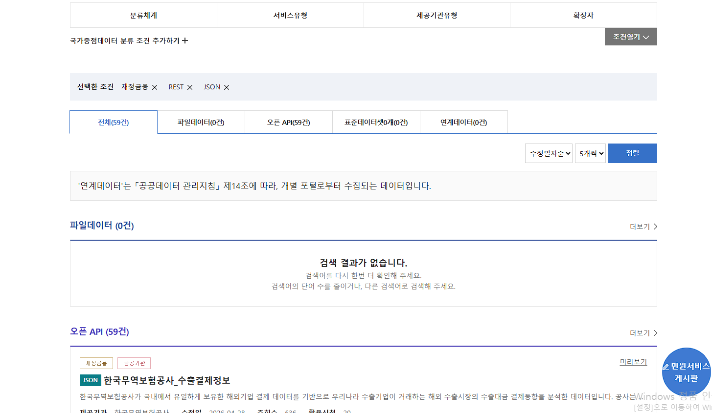

### 예시는 test 폴더에 0301.py 로 있습니다. 참고하세요.

### 아래 이미지와 같이 본인의 이용 현황 중 API 이용 건을 10회 이상으로 하여, 화면 캡쳐 및 공유 하세요.

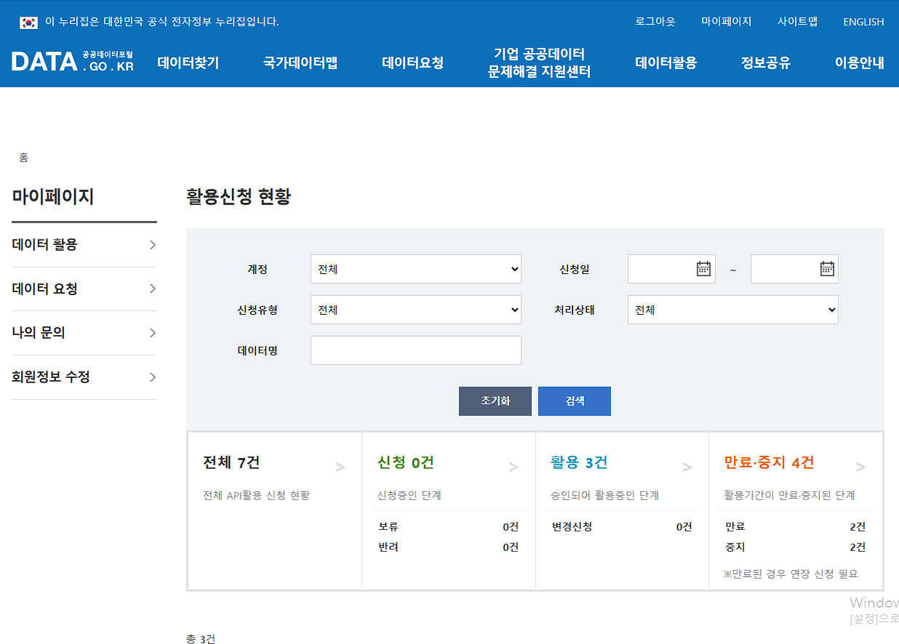

---

### 3. 통화량(M1, M2)과 유동성 분석

> 📖 **Wikipedia**: [통화량](https://ko.wikipedia.org/wiki/통화량) · [유동성](https://ko.wikipedia.org/wiki/유동성_(경제학)) · [양적 완화](https://ko.wikipedia.org/wiki/양적_완화)

**통화량의 종류**

중앙은행은 얼마나 많은 돈이 경제에 돌아다니는지를 단계별로 측정합니다.

```mermaid
flowchart TD
    M0["본원통화 M0\n중앙은행 발행 화폐\n(가장 좁은 범위)"]
    M1["M1 협의통화\nM0 + 요구불예금\n(즉시 사용 가능)"]
    M2["M2 광의통화\nM1 + 저축예금 + 단기 금융상품\n(일반적 통화량 기준)"]

    M0 -->|포함| M1
    M1 -->|포함| M2

    style M0 fill:#2980b9,color:#fff
    style M1 fill:#8e44ad,color:#fff
    style M2 fill:#27ae60,color:#fff
```

| 구분 | 포함 내용 | 특징 |
|------|-----------|------|
| **본원통화(M0)** | 중앙은행이 발행한 화폐 | 가장 좁은 범위 |
| **M1 (협의통화)** | 현금 + 요구불예금 | 즉시 사용 가능한 돈 |
| **M2 (광의통화)** | M1 + 저축예금 + 단기 금융상품 | 일반적인 통화량 기준 |


**양적완화(QE)와 양적긴축(QT) 파급 경로**

```mermaid
flowchart TD
    subgraph QE["양적완화 (QE)"]
        QE1["중앙은행\n국채·MBS 매입"] --> QE2["시중 유동성 증가\n(M2 급증)"]
        QE2 --> QE3["자산 가격 상승 압력\n주식·부동산·원자재"]
        QE3 --> QE4["경기 부양\n대출·투자 활성화"]
    end

    subgraph QT["양적긴축 (QT)"]
        QT1["중앙은행\n보유 채권 만기 미재투자"] --> QT2["시중 유동성 감소\n(M2 축소)"]
        QT2 --> QT3["자산 가격 하락 압력\n금리 상승"]
        QT3 --> QT4["경기 냉각\n대출 비용 증가"]
    end

    style QE fill:#eafaf1
    style QT fill:#fdecea
    style QE1 fill:#27ae60,color:#fff
    style QT1 fill:#c0392b,color:#fff
```


**M2 증가율과 자산 시장 관계**

```mermaid
flowchart LR
    A["M2 급증\n(QE, 재정 확장)"] -->|유동성 넘침| B["위험자산 선호\n주식·원자재 상승"]
    C["M2 감소\n(QT, 금리 인상)"] -->|유동성 회수| D["안전자산 선호\n채권·달러 강세"]

    style A fill:#27ae60,color:#fff
    style B fill:#1e8449,color:#fff
    style C fill:#c0392b,color:#fff
    style D fill:#922b21,color:#fff
```

### 4. 실습: 거시경제 대시보드 구성 및 현황 분석

이번 실습은 단순한 6개 차트 모음에서 출발해, **경기국면 판정·위험 경보·시나리오 분석·웹 대시보드·리포트 출력**까지 확장할 수 있는 형태로 고도화합니다.

---

#### 4-1. 완성 목표

최종 산출물은 아래와 같습니다.

| 산출물 | 파일/화면 | 설명 |
|---|---|---|
| 원천 데이터 | `macro_dashboard_raw.csv` | yfinance/FRED/ECOS 등에서 수집한 원자료 |
| 분석 데이터 | `macro_dashboard_features.csv` | 변화율, 이동평균, z-score, 스프레드, 경기 점수 |
| 이미지 대시보드 | `macro_dashboard.png` | 주요 지표 6~9개 패널 차트 |
| 신호 테이블 | `macro_signal_table.csv` | 선행/동행/후행 지표별 상태와 점수 |
| 리포트 | `macro_dashboard_report.md` | 현재 경기국면 해석, 위험요인, 투자 아이디어 |
| 웹 API 설계 | `/api/macro/dashboard` | 대시보드 데이터·차트·경보 반환 |

**핵심 질문**

1. 지금은 확장, 정점, 수축, 저점 중 어느 국면에 가까운가?
2. 선행지표는 경기 둔화 또는 회복을 먼저 말하고 있는가?
3. 금리, 유가, 달러, VIX 중 위험 신호가 강한 것은 무엇인가?
4. 유동성(M2)과 위험자산(S&P500/KOSPI)은 같은 방향으로 움직이는가?
5. 대시보드의 결론을 투자 행동으로 연결한다면 무엇을 줄이고 무엇을 늘릴 것인가?

---

#### 4-2. 대시보드 지표 설계

대시보드는 지표를 많이 넣는 것보다 **선행·동행·후행·시장심리·유동성**으로 역할을 나누는 것이 중요합니다.

| 분류 | 지표 | 예시 코드/티커 | 주기 | 해석 포인트 |
|---|---|---|---|---|
| 선행 | 장단기 금리차 | FRED `T10Y2Y`, `T10Y3M` | 일별 | 음수면 경기침체 경보 |
| 선행 | VIX | yfinance `^VIX`, FRED `VIXCLS` | 일별 | 급등 시 위험회피 심리 |
| 선행 | 주가지수 | `^GSPC`, `^KS11` | 일별 | 미래 이익 기대 반영 |
| 선행 | 소비심리 | FRED `UMCSENT` | 월별 | 소비 둔화/회복 확인 |
| 동행 | 산업생산 | FRED `INDPRO` | 월별 | 현재 생산활동 |
| 동행 | 고용 | FRED `PAYEMS` | 월별 | 현재 경기 체력 |
| 후행 | 실업률 | FRED `UNRATE` | 월별 | 경기 악화 확인 |
| 후행 | CPI | FRED `CPIAUCSL` | 월별 | 물가 압력과 정책 제약 |
| 유동성 | M2 | FRED `M2SL` | 월별 | QE/QT, 유동성 환경 |
| 원자재 | WTI, 금 | `CL=F`, `GC=F` | 일별 | 인플레/위험회피 신호 |
| 환율 | 달러인덱스, USD/KRW | `DX-Y.NYB`, `KRW=X` | 일별 | 달러 유동성·외국인 수급 |

한국 중심 대시보드로 확장할 때는 ECOS/KOSIS에서 기준금리, 원/달러 환율, M2, CPI, 실업률, 수출입, 산업생산 코드를 찾아 같은 구조로 붙입니다.

---

#### 4-3. 환경 변수와 추가 패키지

빠른 실습은 `yfinance`만으로 가능하지만, 경기국면 판정을 고도화하려면 FRED API Key를 추가합니다.

```bash
FRED_API_KEY=발급받은_FRED_KEY
BOK_API_KEY=발급받은_ECOS_KEY
KOSIS_API_KEY=발급받은_KOSIS_KEY
```

```bash
pip install requests seaborn plotly statsmodels reportlab
```

---

#### 4-4. 1단계: 시장 데이터 대시보드 만들기

API Key 없이 바로 실행할 수 있는 기본 버전입니다.


---

#### 4-5. 2단계: 변화율·변동성·z-score 계산

대시보드는 단순 현재값보다 “최근 변화가 평소보다 큰가?”를 보여줘야 합니다.


**z-score 해석**

| z-score | 해석 |
|---|---|
| `2 이상` | 과열 또는 극단적 강세 |
| `1 ~ 2` | 평균보다 강함 |
| `-1 ~ 1` | 보통 범위 |
| `-2 ~ -1` | 평균보다 약함 |
| `-2 이하` | 극단적 약세 또는 스트레스 |

---

#### 4-6. 3단계: FRED로 경기·유동성 지표 추가

FRED 지표를 붙이면 시장 가격뿐 아니라 경기의 실제 체력까지 볼 수 있습니다.


---

#### 4-7. 4단계: 경기국면 점수화

아래 규칙은 학습용 예시입니다. 실제 운용에서는 기준값과 가중치를 검증해야 합니다.

| 항목 | 확장 신호 | 수축 신호 |
|---|---|---|
| 주식 | S&P500 6개월 수익률 `> 0` | S&P500 6개월 수익률 `< 0` |
| 변동성 | VIX `< 20` | VIX `> 25` |
| 금리차 | `T10Y2Y > 0` | `T10Y2Y < 0` |
| 물가 | CPI YoY 둔화 | CPI YoY 가속 |
| 고용 | 실업률 하락 | 실업률 상승 |
| 유동성 | M2 YoY 상승 | M2 YoY 둔화/감소 |


**점수 해석**

| 점수 | 국면 후보 | 대시보드 메시지 |
|---|---|---|
| `0~1` | 수축 | 위험자산 방어, 현금·채권·금 점검 |
| `2~3` | 저점/회복 | 경기민감주와 주식 비중 회복 검토 |
| `4` | 확장 | 주식·원자재 우호, 과열 지표 감시 |
| `5~6` | 정점/과열 | 인플레·금리·VIX 급등 위험 관리 |

---

#### 4-8. 5단계: 위험 경보 만들기

대시보드에는 사용자가 바로 볼 수 있는 경보가 필요합니다.


---

#### 4-9. 6단계: 고도화 대시보드 레이아웃

웹 화면은 차트를 많이 쌓기보다, 반복적으로 판단하기 쉬운 정보 구조가 좋아야 합니다.

```text
상단 컨트롤
  - 국가: US / KR / Global
  - 기간: 1Y / 3Y / 5Y / 10Y
  - 기준 빈도: D / M / Q
  - 보기 모드: 시장 / 경기 / 유동성 / 전체

1행: 현재 국면 요약
  - 경기국면 배지: Expansion, Peak, Contraction, Trough
  - Macro Score
  - 주요 경보 3개
  - 데이터 기준일

2행: KPI 카드
  - S&P500 6M
  - 10Y-2Y Spread
  - CPI YoY
  - Unemployment
  - M2 YoY
  - VIX

3행: 시계열 차트
  - 주식/금리/유가/달러/VIX
  - M2와 주가지수 비교
  - CPI와 금리 비교

4행: 분석 차트
  - 경기국면 점수 추이
  - 상관관계 히트맵
  - 롤링 상관관계
  - 시나리오별 시뮬레이션 비교

출력
  - CSV 다운로드
  - PNG 저장
  - Markdown/PDF 리포트 생성
```

---

#### 4-10. 웹앱/API 고도화 설계

현재 웹앱의 `/api/macro/realtime`, `/api/macro/simulation`을 아래처럼 확장합니다.

| 엔드포인트 | 메서드 | 역할 |
|---|---|---|
| `/api/macro/dashboard` | `POST` | 대시보드 전체 데이터, KPI, 경보 반환 |
| `/api/macro/cycle-score` | `POST` | 경기국면 점수와 국면 후보 반환 |
| `/api/macro/liquidity` | `POST` | M2, 금리, 주가지수 유동성 분석 |
| `/api/macro/alerts` | `POST` | 위험 경보만 빠르게 반환 |
| `/api/macro/dashboard/report` | `POST` | Markdown/PDF 리포트 생성 |

**요청 예시**


**응답 예시**


**권장 파일 구조**

```text
app
├── backend
│   ├── services
│   │   ├── macro_sources.py       # yfinance/FRED/ECOS/KOSIS 수집
│   │   ├── macro_features.py      # 변화율, z-score, 스프레드
│   │   ├── macro_cycle.py         # 경기국면 점수화
│   │   ├── macro_alerts.py        # 위험 경보 생성
│   │   └── macro_report.py        # 리포트 생성
│   └── main.py
└── frontend
    └── js
        └── views
            └── macroDashboard.js
```

---

#### 4-11. 시뮬레이션 탭 고도화

`/api/macro/simulation`은 학습용으로 매우 좋습니다. 고도화 방향은 사용자가 경기 충격을 직접 조정하게 만드는 것입니다.

| 파라미터 | 예시 | 의미 |
|---|---|---|
| `n_days` | `504` | 시뮬레이션 기간 |
| `seed` | `42` | 재현 가능한 난수 |
| `inflation_shock` | `0.3` | 물가 충격 강도 |
| `rate_shock` | `0.2` | 금리 충격 강도 |
| `oil_shock` | `-0.15` | 유가 충격 |
| `risk_aversion` | `0.4` | VIX/주가 변동성 확대 |


---

#### 4-12. 현황 분석 리포트 템플릿

`macro_dashboard_report.md`는 아래 형식으로 작성합니다.

```markdown
# 거시경제 대시보드 현황 분석

## 1. 분석 조건


- 기준일:
- 기간:
- 데이터 출처:
- 사용 지표:
- 결측 처리:

## 2. 현재 경기국면


- Macro Score:
- 추정 국면:
- 근거 지표:

## 3. 선행/동행/후행 지표 점검


- 선행지표:
- 동행지표:
- 후행지표:

## 4. 위험 경보


- 금리:
- 물가:
- 유동성:
- 변동성:
- 환율:

## 5. 투자 관점 요약


- 주식:
- 채권:
- 원자재:
- 달러/환율:
- 현금 비중:

## 6. 한계


- 점수화 규칙은 학습용이며 검증이 필요함
- 시장 데이터와 공식 통계의 발표 시차가 다름
- 국면 판정은 확률적 판단이며 단정이 아님
```

---

#### 4-13. 실습 체크리스트

- [ ] `macro_dashboard_raw.csv` 생성
- [ ] `macro_fred_dashboard.csv` 생성
- [ ] `macro_dashboard_features.csv` 생성
- [ ] `macro_signal_table.csv` 생성
- [ ] `macro_dashboard.png` 생성
- [ ] 경기국면 점수화 규칙 6개 이상 작성
- [ ] 위험 경보 규칙 4개 이상 작성
- [ ] `/api/macro/dashboard` 요청/응답 설계
- [ ] `macro_dashboard_report.md` 작성

---

## 웹앱 실습 연계


이 챕터의 개념은 Python Quant Lab 웹앱의 두 거시경제 탭으로 직접 체험할 수 있습니다.

### 거시경제현황 1 (실시간) — `/api/macro/realtime`

실제 Yahoo Finance 데이터를 이용해 선행·동행·후행 지표를 한 번에 조회합니다.

```mermaid
sequenceDiagram
    participant U as 사용자 (브라우저)
    participant JS as macroRealtime.js
    participant API as /api/macro/realtime
    participant YF as Yahoo Finance

    U->>JS: 선행지표 티커 선택 후 "조회"
    JS->>API: POST /api/macro/realtime<br/>{tickers: ["^TNX","^IRX","^VIX"], period: "2y"}
    API->>YF: yf.download(tickers, period="2y")
    alt 정상 응답
        YF-->>API: 금리 · VIX 시계열
        API-->>JS: {is_simulated: false, summary: {...}}
    else Rate-limited
        API-->>JS: {is_simulated: true, warning: "GBM 시뮬레이션 사용 중"}
    end
    JS-->>U: 차트 + 요약 테이블 렌더링
```

**경기 사이클 국면별 추천 티커 조합**

| 분석 목적 | tickers | period |
|---|---|---|
| 선행지표 모니터링 | `["^TNX", "^IRX", "^VIX", "^GSPC"]` | `"2y"` |
| 동행지표 확인 | `["^GSPC", "^KS11", "CL=F"]` | `"1y"` |
| 후행지표 추적 | `["^TNX", "GC=F", "KRW=X"]` | `"3y"` |
| QE/QT 영향 분석 | `["^GSPC", "GC=F", "^TNX", "DX-Y.NYB"]` | `"5y"` |

### 거시경제현황 2 (시뮬레이션) — `/api/macro/simulation`

GBM 4단계 경기 사이클 시뮬레이션으로 섹터 로테이션 전략을 연습합니다.

```mermaid
flowchart TD
    A["시뮬레이션 차트 분석"] --> B{"KOSPI·S&P\n방향은?"}
    B -->|상승 추세| C{"CPI(물가)\n수준은?"}
    B -->|하락 추세| D["수축기 또는 침체기\n→ 채권·금 비중 확대 검토"]
    C -->|낮음·안정| E["상승기(Expansion)\n→ 주식·원자재 선호"]
    C -->|높음·가속| F["과열기(Peak)\n→ 현금·인플레 자산 비중 확대"]
    D --> G{"WTI·금리\n반등 신호?"}
    G -->|있음| H["회복기(Trough)\n→ 경기민감주 선매수 기회"]
    G -->|없음| I["침체 지속\n→ 방어주·채권 유지"]

    style A fill:#2980b9,color:#fff
    style E fill:#27ae60,color:#fff
    style F fill:#e67e22,color:#fff
    style H fill:#8e44ad,color:#fff
    style D fill:#c0392b,color:#fff
```

---

## 해보기 활동


1. yfinance 기본 대시보드에서 `S&P500`, `KOSPI`, `US10Y`, `WTI`, `Gold`, `DollarIndex`, `USDKRW`, `VIX`를 수집하고 `macro_dashboard.png`를 생성하세요.
2. FRED에서 `T10Y2Y`, `M2SL`, `CPIAUCSL`, `UNRATE`, `INDPRO`, `PAYEMS`를 수집해 `macro_fred_dashboard.csv`를 만드세요.
3. 경기국면 점수화 규칙을 최소 6개 만들고, 최근 12개월의 `macro_score`와 `cycle`을 표로 출력하세요.
4. 위험 경보 규칙을 최소 4개 만들고, 현재 경보를 `normal`, `warning`, `danger`로 분류하세요.
5. 현재 경기가 확장·정점·수축·저점 중 어느 국면에 가깝다고 생각하는지, 선행/동행/후행 지표를 각각 1개 이상 근거로 설명하세요.
6. `/api/macro/dashboard`를 만든다고 가정하고 요청 JSON, 응답 JSON, 필요한 서비스 파일 목록을 작성하세요.
7. 최종 결과를 `macro_dashboard_report.md`에 정리하고, 투자 관점에서 주식·채권·원자재·달러·현금 비중에 대한 결론을 작성하세요.

---

## 최근 10년 이내 한국이 경제 강국으로 평가받는 거시경제적 원인

1. **수출 경쟁력 고도화**
   - 반도체, 배터리, 자동차, 조선 등 고부가가치 산업 중심으로 수출 구조가 강화되었습니다.
   - 글로벌 공급망 재편 과정에서 핵심 중간재·완성재 공급국 역할이 커졌습니다.

2. **대외건전성 개선**
   - 경상수지 흑자 기조와 충분한 외환보유액이 대외 충격 대응력을 높였습니다.
   - 단기 외채 비중 관리와 금융시스템 안정화로 외환위기 재발 위험을 낮췄습니다.

3. **통화·재정 정책 대응력**
   - 한국은행의 물가·경기 균형 대응과 정부의 확장·긴축 재정 운용이 경기 변동 완화에 기여했습니다.
   - 팬데믹, 고금리, 고물가 국면에서 정책 공조가 비교적 신속하게 작동했습니다.

4. **제조업 기반 + 디지털 전환 동시 진행**
   - 강한 제조업 기반 위에서 AI, 플랫폼, 바이오, 첨단소재 등 신산업 투자가 병행되었습니다.
   - 생산성 향상과 산업 포트폴리오 다변화가 중장기 성장 기대를 높였습니다.

5. **인프라·교육·기술 축적**
   - 고속 통신망, 물류, 전력 인프라와 높은 교육 수준이 기술 확산 속도를 높였습니다.
   - 연구개발(R&D) 투자와 숙련 인력이 혁신 역량을 뒷받침했습니다.

6. **자본시장 성숙과 기업 지배구조 개선 압력**
   - 연기금·기관투자자 비중 확대, 주주환원 강화 흐름이 기업가치 제고를 촉진했습니다.
   - ESG, 공시 투명성, 이사회 독립성 요구가 글로벌 투자자 신뢰에 긍정적으로 작용했습니다.

> 정리하면, 한국의 경제 강국화는 단일 요인보다 **수출 경쟁력·정책 대응력·대외건전성·기술혁신**이 결합된 결과로 볼 수 있습니다.

---

# 블랙록(BlackRock)과 알라딘(Aladdin) 플랫폼 개요

블랙록(BlackRock)은 전 세계 금융 시장을 움직이는 **세계 최대의 자산운용사**입니다. 워낙 규모가 크고 영향력이 막강하다 보니 "자본시장의 그림자 정부", "세상을 지배하는 회사" 같은 거창한 수식어가 따라붙기도 합니다.

---

## 1. 블랙록은 얼마나 큰 회사인가요?
* **운용 자산(AUM):** 2020년대 중반 기준, 블랙록이 굴리는 자산은 **약 10조 달러(한화 약 1경 3,000조~1경 4,000조 원)**를 넘나듭니다. 이는 대한민국 1년 GDP의 6~7배에 달하는 돈을 회사 하나가 운용하고 있는 수준입니다.
* **지분 소유:** 전 세계 거의 모든 대기업(애플, 마이크로소프트, 구글, 삼성전자 등)의 주요 주주 명단을 뜯어보면 블랙록의 이름이 상위권에 반드시 들어가 있습니다.

## 2. 주력 상품 및 서비스
블랙록을 상징하는 핵심 키워드는 **'iShares(아이셰어즈)'**와 **'알라딘(Aladdin)'**입니다.

* **iShares (ETF 브랜드):** 전 세계 ETF(상장지수펀드) 시장의 압도적인 1위 브랜드입니다. 주식 시장에서 흔히 거래하는 수많은 ETF가 바로 블랙록의 제품입니다.
* **알라딘(Aladdin):** 블랙록의 핵심 경쟁력인 **AI 기반 위험 관리 플랫폼**입니다. 전 세계 수많은 금융기관이 이 시스템을 이용해 리스크를 관리하며, 알라딘이 분석하는 자산 규모만 해도 전 세계 자산의 상당 부분을 차지합니다.

## 3. 왜 이렇게 유명하고 영향력이 클까요?
* **시장 방향성 결정:** 블랙록의 CEO인 **래리 핑크(Larry Fink)**가 매년 전 세계 기업 CEO들에게 보내는 연례 서한은 금융권의 '트렌드 지침서' 대접을 받습니다. 예를 들어, 블랙록이 "ESG(환경·사회·지배구조) 경영을 안 하는 기업에는 투자하지 않겠다"고 선언하자 전 세계 기업들이 부랴부랴 친환경 정책을 도입했을 정도입니다.
* **비트코인 현물 ETF:** 최근 몇 년 사이에는 가상자산 시장에도 거대한 발자국을 남겼습니다. 블랙록이 신청하고 승인받은 비트코인 현물 ETF($IBIT$)는 기관 투자자들의 자금을 암호화폐 시장으로 끌어들이는 결정적인 계기가 되었습니다.

---

## 4. AI 기반 위험 관리 플랫폼 '알라딘(Aladdin)' 안내

알라딘(Aladdin)의 공식 웹사이트 및 소개 페이지 주소는 다음과 같습니다.

* **공식 소개 페이지:** [https://www.blackrock.com/aladdin](https://www.blackrock.com/aladdin)
* **기관 투자자 전용 소개 페이지:** [https://www.blackrock.com/institutions/en-us/investment-capabilities/technolgy/aladdin-portfolio-management-software](https://www.blackrock.com/institutions/en-us/investment-capabilities/technolgy/aladdin-portfolio-management-software)
* **알라딘 클라이언트 로그인 페이지:** [https://www.blackrock.com/apps/login/index.html](https://www.blackrock.com/apps/login/index.html)

---

# 📊 최근 5년간 요일별 증시 패턴 분석

## 1. 월요일 vs 금요일
| 국가 | 주요 지수 | 월요일 평균 수익률 | 금요일 평균 수익률 | 특징 |
|------|-----------|-------------------|-------------------|------|
| **[한국 KOSPI](ca://s?q=KOSPI_요일별_분석)** | KOSPI | **-0.12%** | **+0.18%** | 월요일은 글로벌 악재 반영, 금요일은 외국인·기관 매수세 유입 |
| **[미국 S&P 500](ca://s?q=S%26P500_요일별_분석)** | S&P 500 | **-0.08%** | **+0.22%** | ‘Monday Effect’ 존재, 금요일은 주말 전 위험회피 매수 |
| **[일본 니케이225](ca://s?q=Nikkei225_요일별_분석)** | Nikkei 225 | **-0.10%** | **+0.15%** | 월요일 약세, 금요일은 엔화 약세 기대감 반영 |
| **[중국 상하이종합](ca://s?q=상하이종합_요일별_분석)** | Shanghai Composite | **-0.05%** | **+0.12%** | 월요일은 정책 불확실성 반영, 금요일은 국유기업·기관 매수 |
| **[대만 TAIEX](ca://s?q=TAIEX_요일별_분석)** | TAIEX | **-0.07%** | **+0.20%** | 반도체주 중심, 금요일에 기술주 반등세 강함 |

---

## 2. 화·수·목 패턴
| 국가 | 주요 지수 | 화요일 평균 | 수요일 평균 | 목요일 평균 | 특징 |
|------|-----------|-------------|-------------|-------------|------|
| **[한국 KOSPI](ca://s?q=KOSPI_요일별_분석)** | KOSPI | **+0.05%** | **+0.02%** | **-0.03%** | 화요일은 전일 반등세, 수요일은 보합, 목요일은 기관 매도세 영향 |
| **[미국 S&P 500](ca://s?q=S%26P500_요일별_분석)** | S&P 500 | **+0.10%** | **+0.04%** | **-0.06%** | 화요일 강세, 수요일은 실적 발표 영향, 목요일은 주말 전 조정 |
| **[일본 니케이225](ca://s?q=Nikkei225_요일별_분석)** | Nikkei 225 | **+0.07%** | **+0.03%** | **-0.05%** | 화요일은 엔화 약세 반영, 목요일은 수출주 차익실현 |
| **[중국 상하이종합](ca://s?q=상하이종합_요일별_분석)** | Shanghai Composite | **+0.04%** | **+0.01%** | **-0.02%** | 화요일은 정책 기대 반영, 목요일은 국유기업 매도세 |
| **[대만 TAIEX](ca://s?q=TAIEX_요일별_분석)** | TAIEX | **+0.08%** | **+0.05%** | **-0.04%** | 화·수는 반도체주 반등, 목요일은 차익실현 매도세 |

---

## 📌 핵심 인사이트
- **월요일 약세(Monday Effect)**: 전 세계적으로 월요일은 전주말 악재 반영, 투자심리 위축으로 하락 확률이 높음.  
- **금요일 강세(Weekend Effect)**: 기관·외국인 투자자들이 주말 전 포지션을 정리하면서 매수세가 유입되는 경향.  
- **화요일 반등세**: 전일 하락을 되돌리는 흐름이 많음.  
- **수요일 보합세**: 특별한 이벤트 없으면 변동성 적음.  
- **목요일 조정세**: 차익실현 매도세가 나타나며 금요일 반등을 위한 조정 국면.  

---

## ⚠️ 전략적 시사점
- **화요일 매수 → 금요일 매도** 전략이 평균적으로 가장 유리한 흐름.  
- **목요일은 조정 국면**이 많아 단기 매매에는 불리할 수 있음.  
- **수요일은 중립적**이라 특별한 이벤트(실적 발표, 정책 발표)가 없으면 관망세가 많음.  


> ⚠️ **참고사항 (접근 권한)**
> 알라딘은 일반 개인 투자자가 가입하거나 결제해서 사용할 수 있는 대중적인 프로그램이 아닙니다. 전 세계 대형 은행, 연기금, 자산운용사, 보험사 등 **철저히 B2B(기관 투자자) 중심으로 제공되는 폐쇄형 시스템**입니다. 
> 
> 따라서 위 주소의 메인 페이지에서 시스템의 기능, 관련 뉴스, 백서(White Paper) 등은 자유롭게 둘러보실 수 있지만, 실제 프로그램을 실행하는 로그인 화면은 미리 계약된 금융기관의 계정이 있어야만 접근할 수 있습니다.

---

# 📆 월초·월말 효과 (Calendar Effect) — 왜 유독 월초에 증시가 출렁일까

> 📖 **Wikipedia**: [계절 효과](https://ko.wikipedia.org/wiki/계절_효과) · [턴 오브 더 먼스 효과](https://en.wikipedia.org/wiki/Turn_of_the_month_effect)
>

매달 초만 되면 증시가 유독 출렁이는 것처럼 느껴지는 경험은 착각이 아닙니다. 금융 학계와 투자 업계에서는 이를 **'계절 효과(Calendar Effect)'** 또는 **'월말·월초 효과'**라는 시장 이상 현상(Anomaly)으로 분석합니다. 위 [요일별 증시 패턴](#-최근-5년간-요일별-증시-패턴-분석)이 "요일" 단위의 계절 효과라면, 아래 4가지는 "월(月)" 단위의 계절 효과입니다.

## 1. 매월 초 쏟아지는 핵심 경제지표의 공포

매달 1일에서 5일 사이에는 증시의 방향을 결정하는 전 세계(특히 미국과 한국)의 핵심 경제 지표들이 무더기로 발표됩니다.

| 지표 | 발표 시점 | 발표 주체 | 시장 영향 |
|------|-----------|-----------|-----------|
| **미국 ISM 제조업 지수** | 매월 1영업일 | 공급관리협회(ISM) | 50 기준선 상회/하회로 경기 확장·수축 판단 |
| **미국 비농업 고용지표(NFP)** | 매월 첫째 주 금요일 | 美 노동통계국(BLS) | 고용 서프라이즈 → 금리 인하/인상 기대 변화 |
| **한국 수출입 동향** | 매월 1일 정각 | 관세청·산업통상자원부 | 반도체·자동차 등 주력 업종 실적 선행 신호 |
| **한국 소비자물가(CPI)** | 매월 초순 | 통계청 | 한국은행 금리 결정의 핵심 근거 |

시장이 과열되어 있거나 불안할 때, 투자자들은 "지표가 나쁘게 나와서 경기 침체가 오면 어쩌지?", "지표가 너무 좋아서 금리를 안 내리면 어쩌지?" 하는 양방향 불안 심리를 갖게 됩니다. 이 때문에 월초 지표 발표를 확인하기 직전, 위험을 피하려는 거대 자금(기관·외국인)이 주식을 미리 팔아치우면서 변동성이 커지게 됩니다.

## 2. 기관투자자들의 포트폴리오 리밸런싱

펀드나 연기금 같은 거대 기관들은 매달 말이나 매달 초에 자신들이 가진 주식 비중을 재조정(리밸런싱)합니다.

- 지난달에 목표치보다 너무 많이 오른 주식은 차익 실현을 위해 기계적으로 매도합니다.
- 이때 시가총액이 큰 대형주 위주로 매물이 쏟아지면, 지수 전체가 툭 떨어지는 현상이 발생합니다.

## 3. 선물·옵션 만기일과 윈도우 드레싱의 후폭풍

매달 중순이나 말에 있는 파생상품 만기일, 그리고 분기 말(3월 말·6월 말·9월 말·12월 말) 기관들의 수익률 관리용 매수(윈도우 드레싱)가 끝난 직후인 '새로운 달의 초입'에는 시장을 떠받치던 힘이 일시적으로 빠지게 됩니다. 억지로 올렸던 주가가 월초가 되면서 제자리로 돌아오는 과정에서 급락하는 것처럼 보일 수 있습니다.

## 4. 사람의 뇌가 기억하는 '기분 탓' (심리적 요인)

투자 심리학적으로 사람은 돈을 벌었을 때보다 잃었을 때의 충격을 2~3배 더 강하게 기억하는 **손실 회피(Loss Aversion)** 성향이 있습니다. 실제 통계적으로는 월초에 주가가 오른 날도 많지만, 하필 내가 가진 종목이 떨어졌거나 유독 낙폭이 컸던 날들의 기억이 강렬하게 남으면서 "왜 월초만 되면 폭락하지?"라는 패턴으로 뇌에 각인되는 확증 편향·착시 효과도 일부 작용합니다.

---

## 📌 핵심 인사이트
- **월초는 정보 밀도가 가장 높은 시기**: ISM·고용지표·수출입 동향 등 경기 판단의 핵심 지표가 며칠 사이 몰려서 발표됩니다.
- **리밸런싱·윈도우 드레싱의 되돌림**: 월말에 인위적으로 눌리거나 띄워진 가격이 월초에 정상화되는 과정에서 변동성이 커집니다.
- **통계적 착시 주의**: 월초 하락이 매번 반복되는 확정된 법칙이 아니라, 손실을 더 강하게 기억하는 심리적 편향이 패턴처럼 느껴지게 만드는 측면도 있습니다.

## ⚠️ 전략적 시사점
- 굳이 월초 변동성에 휘말리기 싫다면, **핵심 지표 발표(ISM·NFP·수출입)가 나오고 시장이 방향을 잡은 이후**에 매매하는 것도 좋은 전략이 될 수 있습니다.
- 리밸런싱발 매물은 개별 기업의 펀더멘털 악화가 아닌 **수급 요인**이므로, 단기 급락을 저가 매수 기회로 활용할지는 하락 원인(지표 vs 수급)을 구분해서 판단해야 합니다.
- 월초 효과를 매매 전략으로 쓰려면 "며칠이 진짜 유의미하게 하락했는지" 통계 검증(평균·표준편차·t-검정)을 먼저 거치는 것이 착시 효과를 피하는 방법입니다.

---

# 🌱 ESG(환경·사회·지배구조)의 이해와 데이터 투자 관점의 활용

본 문서는 최근 자본시장과 기업 경영의 핵심 패러다임으로 자리 잡은 ESG의 개념과 중요성, 그리고 AI 모델링 및 퀀트(Quant) 투자 관점에서의 데이터 활용 방안을 정리한 가이드입니다.

---

## 1. ESG 개요 및 핵심 구성 요소

ESG는 기업의 비재무적 성과를 평가하는 세 가지 핵심 요소를 의미합니다. 과거의 재무제표(매출, 영업이익)가 기업의 '현재 수익성'을 나타낸다면, ESG는 기업의 '지속 가능성과 장기적 생존 능력'을 평가합니다.

* **E (Environmental, 환경):** 기후변화 대응, 탄소 배출 감축, 자원 순환, 재생에너지 사용 등
* **S (Social, 사회):** 인권 존중, 노동 환경 개선, 데이터 프라이버시, 고객 만족, 지역사회 기여 등
* **G (Governance, 지배구조):** 주주 권리 보호, 이사회 구성의 다양성과 독립성, 감사 기구 운영, 투명한 회계 및 윤리 경영 등

---

## 2. ESG가 기업과 투자 시장에서 중요해진 4가지 이유


### ① 실질적인 '생존 리스크' 관리
과거에는 비재무적 리스크(환경 오염, 노동 갑질, 독단 경영 등)가 발생해도 주가나 매출에 미치는 영향이 단기에 그쳤습니다. 그러나 현재는 이러한 리스크가 발생 시 불매운동, 브랜드 가치 폭락 등으로 이어져 기업이 한순간에 파산 위기에 몰릴 수 있습니다. 즉, ESG는 기업 경영의 강력한 **위험 관리(Risk Management) 도구**입니다.

### ② 글로벌 기관투자자의 돈의 흐름 (수탁자 책임)
세계 최대 자산운용사인 블랙록(BlackRock)을 비롯하여 대한민국 국민연금(NPS) 등 글로벌 거대 자본들이 **스튜어드십 코드(Stewardship Code)**를 기반으로 주주권을 적극 행사하고 있습니다. 이들은 "ESG 성과가 미흡한 기업에는 투자하지 않거나 비중을 줄이겠다"고 선언했기 때문에, 기업 입장에서는 자금 조달을 위해 ESG를 필수적으로 도입해야 합니다.

### ③ 전 세계적인 법제화 및 무역 장벽화
ESG는 단순한 캠페인을 넘어 무역 규제로 진화하고 있습니다.
* **유럽연합(EU)·미국:** ESG 공시 의무화 추진
* **공급망 실사법:** 대기업뿐만 아니라 그 대기업에 부품을 납품하는 중소 협력업체의 ESG 리스크까지 강제로 점검하도록 규제
* **결과:** ESG 기준을 맞추지 못하면 수출 길 자체가 막히는 글로벌 무역 장벽이 되었습니다.

### ④ MZ세대의 가치 소비 트렌드
시장의 핵심 소비층으로 부상한 젊은 소비자들은 제품의 기능뿐만 아니라 기업의 도덕성을 고려합니다. 친환경적이거나 윤리적인 기업의 제품에는 기꺼이 더 높은 비용을 지불(Value Consumption)하지만, 사회적 물의를 일으킨 기업의 제품은 적극적으로 불매합니다.

---

## 3. 데이터 레이크(Data Lake) 및 AI/퀀트 투자에서의 ESG 활용

AI 예측 모델을 구축하거나 퀀트 투자를 수행하는 엔지니어/투자자 관점에서 ESG 데이터는 시장의 초과 수익을 발굴하거나 하방 리스크를 방어할 수 있는 훌륭한 **대안 데이터(Alternative Data)** 세트가 됩니다.

### 📊 데이터 파이프라인에서의 ESG 데이터 처리 매핑

```text
[Data Sources] -------------------> [Data Lake] -----------> [Feature Engineering] --------> [AI / Quant Model]
- 뉴스 기사 / SNS 텍스트 (비정형)       - Raw Texts               - NLP 감성 분석 (Sentiment Score)     - 리스크 필터링 (Filter-out)
- 지속가능경영보고서 PDF (비정형)       - Raw PDFs                - 핵심 키워드 임베딩 벡터             - 장기 알파(Alpha) 변수 반영
- ESG 전문 평가기관 지수 (정형)         - Structured Scores       - 정형 스코어 결합 및 정규화

```


---


# 코스피(KOSPI) 지수 산정 방식

코스피(KOSPI) 지수는 **'시가총액식'** 방식으로 산정됩니다. 즉, 코스피 시장에 상장된 모든 기업의 전체 덩치(시가총액)를 다 더한 뒤, 이를 기준이 되는 과거의 특정 시점과 비교하여 점수화하는 방식입니다.

---

## 1. 코스피 산정 공식

$$\text{코스피 지수} = \frac{\text{비교시점(현재)의 시가총액}}{\text{기준시점(1980년 1월 4일)의 시가총액}} \times 100$$

* **시가총액**: 개별 기업의 `현재 주가 × 발행 주식 수`를 의미합니다. 코스피 전체 시가총액은 시장에 상장된 모든 종목의 시가총액을 합산한 금액입니다.
* **기준시점**: **1980년 1월 4일**을 기준으로 삼습니다. 당시 코스피 상장 기업들의 시가총액 합계를 **'100포인트'**로 정의했습니다.

> 💡 **예시를 통한 이해**
> 만약 현재 코스피 지수가 **2,600**이라면, 국내 증시의 전체 규모가 기준시점인 1980년에 비해 **26배** 성장했다는 의미입니다.

---

## 2. 주요 특징: 시가총액 가중 방식

코스피는 모든 기업의 주가를 동일하게 반영하지 않고, **기업의 크기(시가총액)에 비례하여 가중치**를 둡니다. 

따라서 시가총액 규모가 작은 중소기업 수십 개의 주가가 크게 오르더라도, 시가총액 비중이 압도적인 대형주(예: 삼성전자, SK하이닉스 등)의 주가가 하락하면 코스피 지수는 하락할 수 있습니다.

---

## <h2>3. 지수의 왜곡 방지 (기준시가총액의 수정)</h2>

기업이 유상증자/무상증자를 하거나 새로운 거대 기업이 신규 상장(IPO)을 하면, 주가 변동과 상관없이 시장 전체의 시가총액(분자)이 급격히 변동하게 됩니다.

이로 인해 지수가 왜곡되는 현상을 막기 위해, 한국거래소(KRX)는 분모에 있는 **'기준시점의 시가총액'을 공식에 따라 실시간으로 수정(보정)**합니다. 이를 통해 순수한 주가 변동에 따른 증시 흐름만을 정확하게 반영하게 됩니다.

---

# 골드만삭스(Goldman Sachs) 글로벌·월간 리포트 확인 방법

골드만삭스(Goldman Sachs)를 비롯한 글로벌 투자은행(IB)의 오리지널 리포트는 원칙적으로 **유료 고객(기관 투자자, 거액 자산가)에게만 실시간으로 제공**됩니다. 

하지만 일반 개인 투자자도 **무료로 이용할 수 있는 공식 경로**와 **우회 방법**이 존재합니다. 매월 발행되는 시장 전망, 경제 분석, AI 등 테마별 레포트를 확인하는 대표적인 방법들을 정리해 드립니다.

---

## 1. 가장 정확한 공식 무료 경로 (홈페이지 & 앱)
골드만삭스는 일반 대중과 잠재 고객을 위해 리포트의 핵심 요약본과 일부 공개용 풀 리포트를 무료로 제공하고 있습니다.

* **Goldman Sachs Insights (웹사이트)**
  * 골드만삭스의 가장 대표적인 리포트인 **`Top of Mind`**(글로벌 매크로 이슈 분석), 테마별 스페셜 리포트를 무료로 읽을 수 있는 공식 페이지입니다.
  * *메뉴 경로:* `goldmansachs.com` ➔ `Insights`
* **Goldman Sachs Research Public Page (공개 리포트 아카이브)**
  * 골드만삭스 리서치 부서에서 발간하는 심층 보고서 중 일부를 일반인에게 공개하는 공식 아카이브입니다.
  * *메뉴 경로:* `gspublishing.com/content/public.html`
* **GS Now (모바일 앱) 활용**
  * 골드만삭스에서 운영하는 무료 모바일 앱입니다. 실시간 시장 브리핑, 오디오 콘텐츠, 주요 경제 분석 리포트 요약을 스마트폰으로 간편하게 받아볼 수 있습니다.

---

## 2. 이메일 구독 서비스 활용 (`Briefings`)
매번 사이트에 접속하기 번거롭다면, 골드만삭스의 공식 뉴스레터인 **`Briefings`**를 구독하는 것이 가장 좋습니다.

* 구독을 신청하면 주간/월간 단위로 글로벌 경제를 흔드는 주요 동인, 금융시장 전망, 그리고 최신 리포트 요약본을 메일함으로 바로 보내줍니다.
* *신청 방법:* Insights 페이지 하단에서 이메일 주소 입력 후 구독.

---

## 3. 원문 전체(Full Report)를 구하는 우회 팁
핵심 요약본이 아닌 수십 페이지에 달하는 **오리지널 PDF 원문**을 보고 싶다면 아래의 방법을 활용해 보세요.

* **구글 고급 검색 필터 활용 (가장 유용)**
  * 기관 투자자들이 공유 목적으로 인터넷에 올린 PDF 파일들이 구글에 색인되는 경우가 많습니다.
  * 구글 검색창에 `보고서 제목 키워드 + filetype:pdf`를 검색하면 원문을 찾아낼 수 있습니다.
  * *예시:* `Goldman Sachs AI investment boom filetype:pdf`
* **해외 주식 커뮤니티 및 아카이브 사이트**
  * **레딧(Reddit):** `r/stocks`나 `r/investing` 같은 대형 주식 서브레딧에 "Goldman Sachs Report"를 검색하면 글로벌 유저들이 드롭박스나 구글 드라이브 링크로 최신 PDF 원문을 공유하곤 합니다.
  * **DocPlayer / Scribd:** 전 세계 문서 공유 플랫폼으로, 골드만삭스의 지난 월간 리포트 원문이 업로드되어 있는 경우가 많습니다.

---

## 💡 이용 시 참고사항
* 🌐 **언어의 장벽:** 모든 공식 리포트는 **영어**로 작성됩니다. 영어가 부담스러우시다면 원문 PDF를 다운로드한 후, *DeepL*이나 *네이버 파파고* 같은 AI 문서 번역기를 활용하시면 매끄러운 한글로 읽으실 수 있습니다.
* ⏳ **시차 발생:** 무료로 공개되는 정보는 유료 회원들에게 먼저 서비스된 후 **짧게는 며칠에서 길게는 몇 주 뒤에 공개**됩니다. 따라서 단기 트레이딩보다는 글로벌 거시경제(매크로) 흐름을 파악하는 장기 투자 관점으로 활용하시는 것을 추천합니다.


---

## 원문: finance_economic_indicators.txt

# 경제지표 분석 (물가, 유가 등)

---

### https://ecos.bok.or.kr/#/StatisticsByTheme/KoreanStat100

# 한국은행 ECOS 100대 지표 쉽게 이해하기

한국은행 경제통계시스템(ECOS)의 **100대 지표**는 한국 경제를 파악하는 데 가장 중요한 핵심 지표들입니다.  
경제 뉴스와 금융 시장에서 자주 등장하는 지표를 중심으로 쉽게 정리하였습니다.

## 먼저 알아둘 말: 인디케이터(Indicator, 지표)란?

인디케이터는 복잡한 경제나 시장의 상태를 **숫자 하나 또는 숫자의 흐름으로 보여 주는 계기판**입니다. 자동차의 연료 게이지 하나만으로 차 전체 상태를 판단할 수 없듯, 한 지표만 보고 경제나 투자 결과를 단정하면 안 됩니다.

| 종류 | 쉬운 뜻 | 예시 | 이렇게 읽어 보기 |
|---|---|---|---|
| **경제 인디케이터** | 나라 경제의 온도계 | CPI, 실업률, 기준금리, 수출액 | CPI가 높아지면 물가 압력이 커졌는지 살핀다 |
| **시장 인디케이터** | 금융시장의 분위기 표시등 | 코스피, 원/달러 환율, 국고채 금리, VIX | 원/달러 환율 상승은 원화 가치 하락과 연결해 해석한다 |
| **기술적 인디케이터** | 과거 가격·거래량으로 계산한 보조도구 | 이동평균선, RSI, MACD | RSI가 낮다고 곧바로 반등한다고 단정하지 않고 추세·뉴스와 함께 본다 |

**쉬운 예시:** 편의점에서 라면·우유·교통비 같은 생활비가 전반적으로 올랐다는 느낌은 개인 경험이다. 이를 많은 품목과 가구의 가격으로 모아 숫자로 만든 것이 소비자물가(CPI) 같은 경제 인디케이터다. 반면 RSI는 물가를 재는 지표가 아니라, 주가가 최근에 빠르게 오르거나 내렸는지를 계산하는 기술적 인디케이터다.

**기본 사용법:** 숫자의 높고 낮음뿐 아니라 이전 달·작년 같은 달과 비교해 변화 방향을 보고, 발표 시점·산출 방식·다른 지표도 함께 확인한다. 지표는 판단을 돕는 자료이지 미래 수익을 보장하는 신호는 아니다.

## 1. 금융 분야 주요 지표 (자산운용에서 특히 중요)

- **기준금리 (정책금리)**  
  한국은행이 결정하는 가장 중요한 금리. 모든 시장금리의 기준이 됩니다. 기준금리가 오르면 대출이 줄고 경기가 위축되며, 내리면 반대 효과가 나타납니다.

- **시장금리**  
  - 단기: CD금리, 콜금리 등  
  - 장기: 국고채 3년·5년·10년물 수익률  
  국고채 수익률은 회사채·대출금리의 기준으로 사용되며, 금리가 상승하면 채권 가격은 하락합니다.

- **예금금리 / 대출금리**  
  은행에서 실제 적용되는 예금 이자율과 대출 이자율. 가계와 기업의 자금 조달 비용을 직접적으로 보여줍니다.

- **가계신용·가계대출 및 연체율**  
  가계가 은행에서 빌린 총 금액과, 대출을 제때 갚지 못하는 비율. 연체율 상승은 금융 위험 신호로 해석됩니다.

- **M1·M2 통화 증가율**  
  - M1: 현금 + 요구불예금 (가장 유동성 높은 돈)  
  - M2: M1 + 정기예금 등 (경제 전체에 풀린 돈의 양)  
  M2 증가율이 높으면 물가 상승 압력, 낮으면 경기 둔화 가능성이 있습니다.

## 2. 물가 분야 주요 지표

- **소비자물가 상승률 (CPI)**  
  일반 국민이 실제로 느끼는 물가 상승률. 식료품, 주거, 교통 등 소비 바구니 가격 변동을 측정합니다. 한국은행의 물가 안정 목표(약 2%) 달성 여부를 판단하는 핵심 지표입니다.

- **생산자물가 상승률**  
  기업 간 거래 가격 변동률. 원자재 가격 변화가 먼저 반영되어 향후 소비자물가에 선행하는 경향이 있습니다.

- **근원물가 상승률**  
  식료품과 에너지 가격을 제외한 기조적 물가. 일시적 충격을 제외하고 본질적인 물가 흐름을 파악할 때 사용합니다.

## 3. 실물 경제·경기 관련 주요 지표

- **경제성장률 (GDP 성장률)**  
  우리나라 경제가 얼마나 성장했는지를 보여주는 가장 종합적인 지표. 분기별·연간으로 발표됩니다.

- **민간소비 증가율**  
  가계의 소비 동향. 내수 경기의 핵심 동력입니다.

- **설비투자 증가율**  
  기업이 기계·설비에 투자하는 규모. 미래 성장 잠재력을 보여주는 지표입니다.

- **건설투자 증가율**  
  건물·인프라 건설 투자 동향. 부동산 시장과 밀접한 관련이 있습니다.

- **경상수지**  
  상품·서비스 수출입, 해외 투자 수익 등을 합한 국제수지. 지속적인 흑자는 원화 가치 상승 요인이 됩니다.

- **환율 (원/달러)**  
  1달러를 사는 데 필요한 원화 금액. 수출 기업에는 낮은 환율이, 해외 여행·수입에는 높은 환율이 유리합니다.

## 4. 고용·임금 관련 주요 지표

- **실업률**  
  일할 의사가 있는 사람 중 실제로 일하지 못하는 비율.

- **고용률**  
  15세 이상 인구 중 실제로 일하고 있는 사람의 비율.

- **시간당 명목임금**  
  노동자들이 시간당 받는 평균 임금 수준.

## 활용 팁 (취업 준비 시)

- **자산운용·리서치 직무**에서는 **기준금리, 국고채 수익률, M2, 가계대출, CPI**를 가장 주의 깊게 살펴보세요.  
- ECOS 페이지에서 각 지표를 클릭하면 최신 수치, 그래프, 과거 추이를 바로 확인할 수 있습니다.

---

>
> 📝 **한자 병기 및 어원 사전**: 이 문서에 등장하는 용어의 한자·어원·일제강점기 유래는 → [voca.md](voca.md)

## 오늘 배울 것


- 소비자물가지수(CPI)와 생산자물가지수(PPI)
- 유가(WTI, 브렌트유) 분석
- 환율과 주가의 관계
- 실업률, GDP 성장률 지표 해석
- 실습: 주요 경제지표 데이터 수집 및 상관관계 분석

---

## 🔗 참고 사이트 & 데이터 원천


> 이 문서(경제지표 — 물가·유가·환율·실업률)의 실습에 필요한 공식 데이터 출처와 참고 사이트입니다. ⚿ 는 API 키 또는 승인이 필요한 항목입니다.

### 📊 국내 공식 데이터

| 기관 | URL | API 키 | 제공 데이터 |
|------|-----|--------|-------------|
| 통계청 KOSIS | <https://kosis.kr> | ⚿ 권장 | 국내 CPI, PPI, 고용통계, GDP |
| 한국은행 ECOS | <https://ecos.bok.or.kr> | ⚿ 필요 | 환율, 물가지수, 수출입물가 |
| 공공데이터포털 | <https://www.data.go.kr> | ⚿ 필요 | 유가, 원자재 공공 데이터 |
| 산업통상자원부 에너지 통계 | <https://www.motie.go.kr> | 불필요(웹 조회) | 국내 유가·에너지 소비 현황 |

### 🌍 해외 공식 데이터

| 기관 | URL | API 키 | 제공 데이터 |
|------|-----|--------|-------------|
| FRED (St. Louis Fed) | <https://fred.stlouisfed.org> | ⚿ 권장 | CPI, PCE, PPI, 실업률, GDP |
| BLS (미국 노동통계국) | <https://www.bls.gov/developers> | ⚿ 권장 | CPI, PPI, 실업률 원시 데이터 |
| BEA (미국 경제분석국) | <https://apps.bea.gov/api> | ⚿ 필요 | GDP, PCE, 소득 데이터 |
| EIA (미국 에너지정보청) | <https://www.eia.gov/opendata> | ⚿ 필요 | WTI·브렌트 유가, 천연가스, 재고 |
| OECD Data | <https://data.oecd.org> | 불필요 | 국가별 CPI·실업률·GDP 비교 |
| World Bank | <https://data.worldbank.org> | 불필요 | 글로벌 경제 지표 장기 시계열 |
| IMF Data | <https://www.imf.org/en/Data> | 불필요 | 세계경제전망(WEO), 물가·성장률 |

### 📈 차트 & 뉴스 참고

| 분류 | 사이트 | URL | 활용 용도 |
|------|--------|-----|-----------|
| 차트 플랫폼 | TradingView | <https://www.tradingview.com> | 유가·환율·물가 관련 차트 |
| 차트 플랫폼 | Investing.com | <https://www.investing.com> | 경제 지표 캘린더·실시간 시세 |
| 금융 포탈 | 네이버 금융 | <https://finance.naver.com> | 국내 경제지표·환율 현황 |
| 금융 미디어 | 머니투데이 방송(MTN) | <https://mtn.co.kr> | 물가·유가·환율 뉴스 분석 |
| 금융 미디어 | 이데일리 | <https://www.edaily.co.kr> | 경제지표 발표 속보 |
| 금융 정책 | 금융위원회 | <https://www.fsc.go.kr> | 물가·금융안정 정책 정보 |
| 금융 감독 | 금융감독원(FSS) | <https://www.fss.or.kr> | 금융시장 안정 모니터링 |

---

### 1. 소비자물가지수(CPI)와 생산자물가지수(PPI)

> 📖 **Wikipedia**: [소비자 물가 지수](https://ko.wikipedia.org/wiki/소비자_물가_지수) · [생산자 물가 지수](https://ko.wikipedia.org/wiki/생산자_물가_지수) · [인플레이션](https://ko.wikipedia.org/wiki/인플레이션)

**CPI (Consumer Price Index, 소비자물가지수)**

소비자가 실제로 구매하는 상품·서비스 바구니의 가격 변화를 측정하는 지표입니다.

- 기준: 특정 연도를 100으로 설정해 상대적 변화를 나타냄
- 발표: 한국 통계청 (월 1회), 미국 BLS (월 1회)
- **핵심 근원물가(Core CPI)**: 에너지·식품을 제외한 CPI → 변동성이 낮아 추세 파악에 유리

**CPI 수치별 중앙은행 반응**

```mermaid
flowchart LR
    A["CPI 목표치 초과\n(예: 4%+)"] -->|과도한 인플레이션| B["금리 인상 압력"]
    C["CPI 목표치 근처\n(예: 2%)"] -->|적정 수준| D["정책 유지"]
    E["CPI 목표치 미달\n(예: 0~1%)"] -->|디플레이션 위험| F["금리 인하 압력"]

    style A fill:#ff6b6b,color:#fff
    style B fill:#c0392b,color:#fff
    style C fill:#2ecc71,color:#fff
    style D fill:#27ae60,color:#fff
    style E fill:#3498db,color:#fff
    style F fill:#2980b9,color:#fff
```


**PPI (Producer Price Index, 생산자물가지수)**

기업이 생산·판매하는 상품의 가격 변화를 측정합니다. CPI보다 **선행성**이 있어 미래 물가를 예측하는 데 사용됩니다.

**PPI → CPI 파급 경로**

```mermaid
flowchart LR
    A["원자재·에너지\n가격 상승"] --> B["PPI 상승\n(생산자물가)"]
    B --> C["기업 원가 상승"]
    C --> D["제품 가격 전가"]
    D --> E["CPI 상승\n(소비자물가)"]
    E --> F["중앙은행\n금리 인상 검토"]

    style A fill:#e67e22,color:#fff
    style B fill:#d35400,color:#fff
    style E fill:#c0392b,color:#fff
    style F fill:#922b21,color:#fff
```


### 2. 유가(WTI, 브렌트유) 분석

> 📖 **Wikipedia**: [서부 텍사스 원유](https://ko.wikipedia.org/wiki/서부_텍사스_원유) · [브렌트유](https://ko.wikipedia.org/wiki/브렌트유) · [석유수출국기구](https://ko.wikipedia.org/wiki/석유수출국기구)

**WTI vs 브렌트유**

| 구분 | WTI (West Texas Intermediate) | 브렌트유 (Brent Crude) |
|------|-------------------------------|------------------------|
| 원산지 | 미국 텍사스 | 북해 |
| 기준 시장 | NYMEX (뉴욕) | ICE (런던) |
| 특징 | 미국 기준 원유, 경질유 | 글로벌 기준 원유 (세계 원유 70%+ 기준) |
| 가격 차이 | 보통 WTI가 $1~3 저렴 | — |


**유가 상승 시 경제 파급 경로**

```mermaid
flowchart TD
    A["유가 ↑"] --> B["에너지 비용 증가"]
    B --> C["기업 원가 상승"]
    B --> D["물가 상승 (CPI↑)"]
    C --> E["기업 이익 감소"]
    D --> F["소비 여력 감소"]
    E --> G["경기 둔화 압력"]
    F --> G

    style A fill:#e74c3c,color:#fff
    style G fill:#922b21,color:#fff
```

**유가 하락 시 경제 파급 경로**

```mermaid
flowchart TD
    A["유가 ↓"] --> B["에너지 수입비용 감소"]
    B --> C["경상수지 개선\n(한국 등 수입국)"]
    B --> D["소비자 가처분소득 증가"]
    C --> E["원화 강세 압력"]
    D --> F["소비 증가 → 내수 확대"]

    style A fill:#27ae60,color:#fff
    style C fill:#1e8449,color:#fff
    style F fill:#1e8449,color:#fff
```

**산업별 유가 영향**

```mermaid
flowchart LR
    subgraph UP["유가 ↑ 수혜"]
        U1["정유"]
        U2["에너지"]
        U3["유전서비스"]
    end
    subgraph DOWN["유가 ↑ 피해"]
        D1["항공"]
        D2["해운"]
        D3["화학(원료 의존)"]
    end

    OIL_UP["유가 상승"] --> UP
    OIL_UP --> DOWN

    style OIL_UP fill:#e74c3c,color:#fff
    style UP fill:#f9ebea
    style DOWN fill:#eaf2ff
```


#### 위의 예시 실행 시
```
(.venv) root@DESKTOP-CLQV18N:/home/ubuntu/investment-analysis/test# python3 0201.py
[*********************100%***********************]  1 of 1 completed
Traceback (most recent call last):
  File "/home/ubuntu/investment-analysis/test/0201.py", line 10, in <module>
    print(f"최근 종가: ${oil.iloc[-1]:.2f}/배럴")
                        ^^^^^^^^^^^^^^^^^^
TypeError: unsupported format string passed to Series.__format__
```
#### 오류 해결 하세요.


### 3. 환율과 주가의 관계

> 📖 **Wikipedia**: [환율](https://ko.wikipedia.org/wiki/환율) · [외환시장](https://ko.wikipedia.org/wiki/외환시장)

**환율의 기본 개념**

환율은 두 통화의 교환 비율입니다. 원/달러 환율이 1,350원이라면, 달러 1개를 사려면 1,350원이 필요하다는 뜻입니다.

**원화 약세(환율 ↑) 파급 경로**

```mermaid
flowchart LR
    A["원화 약세\n(환율 ↑)"] --> B["수출기업 가격 경쟁력 ↑"]
    A --> C["수입 물가 상승"]
    A --> D["외국인 자금 유출 압력"]

    B --> E["수출 대기업\n실적 개선 기대"]
    C --> F["CPI 상승 → 금리 인상 압력"]
    D --> G["코스피 하락 압력"]

    style A fill:#e67e22,color:#fff
```

**원화 강세(환율 ↓) 파급 경로**

```mermaid
flowchart LR
    A["원화 강세\n(환율 ↓)"] --> B["수입 물가 하락"]
    A --> C["외국인 자금 유입 용이"]
    A --> D["수입기업·내수 기업 유리"]

    C --> E["코스피 상승 압력"]
    B --> F["CPI 안정 → 금리 동결 가능"]

    style A fill:#27ae60,color:#fff
```

**코스피와 환율의 상호작용**

```mermaid
flowchart TD
    A["외국인 한국 주식 매도"] --> B["달러 매수 수요 증가"]
    B --> C["원화 약세 (환율 ↑)"]
    C --> D["추가 외국인 이탈 우려"]
    D --> A

    E["위험선호 심리 상승"] --> F["신흥국 자금 유입"]
    F --> G["원화 강세 (환율 ↓)"]
    G --> H["코스피 상승"]
    H --> E

    style A fill:#c0392b,color:#fff
    style E fill:#27ae60,color:#fff
```


### 3-1. 외국인의 주가상승 신호

> 📖 **Wikipedia**: [외국인 투자자](https://ko.wikipedia.org/wiki/외국인_투자자) · [코스피](https://ko.wikipedia.org/wiki/코스피)

한국 주식시장에서 **외국인 투자자**는 코스피 시가총액의 약 30~35%를 차지하는 핵심 수급 세력입니다. 외국인의 순매수·순매도 동향은 주가 방향의 중요한 선행 지표로 활용됩니다.

**외국인 순매수가 주가 상승 신호로 해석되는 구조**

```mermaid
flowchart TD
    A["외국인 순매수 지속\n(달러→원화 환전)"] --> B["원화 강세 압력"]
    A --> C["코스피 주가 상승 압력"]
    B --> D["추가 외국인 유입 여건 개선\n(환율 수익률 부담 감소)"]
    C --> E["개인·기관 추종 매수"]
    D --> F["주가 상승 모멘텀 강화"]
    E --> F

    style A fill:#27ae60,color:#fff
    style F fill:#2ecc71,color:#fff
```

**외국인 주가상승 신호 체크 포인트**

| 신호 | 확인 방법 | 신뢰도 |
|------|---------|--------|
| **5일 이상 연속 순매수** | KRX 투자자별 매매동향 | ★★★★★ |
| **외국인 보유비율 지속 증가** | data.krx.co.kr 종목별 외국인 보유 현황 | ★★★★☆ |
| **원화 강세 동반** | USD/KRW 환율 하락 추세 | ★★★☆☆ |
| **대형주 중심 매수** | 코스피200 핵심 종목 집중 매수 | ★★★★☆ |
| **거래대금 동반 증가** | 순매수 + 거래대금 급증 | ★★★★☆ |

**외국인 매수 vs 매도 시 시장 반응 비교**

| 외국인 동향 | 환율 영향 | 주가 영향 | 투자자 대응 |
|------------|---------|---------|-----------|
| **대규모 순매수** | 원화 강세 (환율 ↓) | 코스피 상승 압력 | 비중 확대 검토 |
| **5일 이상 연속 순매수** | 원화 강세 지속 | 강한 상승 모멘텀 | 모멘텀 추종 전략 |
| **대규모 순매도** | 원화 약세 (환율 ↑) | 코스피 하락 압력 | 리스크 점검·손절 기준 확인 |
| **연속 순매도** | 원화 약세 심화 | 추가 이탈 악순환 가능 | 방어 포지션 검토 |


> ⚠️ **주의사항**: 외국인 순매수가 항상 주가 상승으로 이어지지는 않습니다. 파생상품 헤지, 인덱스 리밸런싱, 배당 차익거래 목적의 매수는 주가 상승 신호로 보기 어렵습니다. **순매수의 지속성, 대상 종목, 환율 동향, 거래대금**을 종합해 판단해야 합니다.

---

### 4. 실업률, GDP 성장률 지표 해석

> 📖 **Wikipedia**: [실업률](https://ko.wikipedia.org/wiki/실업률) · [국내총생산](https://ko.wikipedia.org/wiki/국내총생산) · [경기침체](https://ko.wikipedia.org/wiki/경기침체)

**GDP 성장률 (Gross Domestic Product Growth Rate)**

GDP는 일정 기간 국내에서 생산된 모든 재화·서비스의 시장 가치 합계입니다.

- **성장률 = (금기 GDP - 전기 GDP) / 전기 GDP × 100**
- 분기별 발표 (QoQ: 전분기 대비, YoY: 전년 동기 대비)

**GDP 성장률 구간별 신호**

```mermaid
flowchart LR
    A["GDP 성장률 2%+"] -->|안정 성장| B["주식·위험자산\n선호 환경"]
    C["GDP 성장률 0% 근처"] -->|침체 우려| D["방어주·채권\n비중 확대 검토"]
    E["GDP 2분기 연속 마이너스"] -->|기술적 경기침체| F["경기부양책 기대\n금리 인하 압력"]

    style A fill:#27ae60,color:#fff
    style B fill:#1e8449,color:#fff
    style C fill:#e67e22,color:#fff
    style E fill:#c0392b,color:#fff
    style F fill:#922b21,color:#fff
```


**실업률 (Unemployment Rate)**

경제활동인구 중 일할 의사가 있으나 직업이 없는 사람의 비율입니다.

**실업률 신호와 시장 반응**

```mermaid
flowchart LR
    subgraph LOW["실업률 하락 (낮음)"]
        L1["경기 호황\n소비 여력 증가"] --> L2["단기 호재\n+ 인플레이션 우려"]
    end
    subgraph HIGH["실업률 상승 (높음)"]
        H1["경기 침체\n소비 감소"] --> H2["악재\n+ 경기부양 기대"]
    end
```


**미국 고용지표 발표 순서**

```mermaid
flowchart LR
    A["수요일\nADP 민간 고용 발표\n(선행 지표)"] --> B["금요일\nNFP 비농업 고용\n+ 실업률 동시 발표"]
    B --> C["시장 즉각 반응\n금리·환율·주가 변동"]

    style A fill:#3498db,color:#fff
    style B fill:#e74c3c,color:#fff
    style C fill:#7f8c8d,color:#fff
```

| 지표 | 발표 시기 | 핵심 수치 |
|------|-----------|-----------|
| 비농업 고용(NFP) | 매월 첫째 금요일 | 전월 대비 증감 인원 |
| 실업률 | NFP 동시 발표 | % |
| ADP 민간 고용 | NFP 발표 2일 전 수요일 | 선행 지표 |

### 5. 실습: 주요 경제지표 데이터 수집 및 상관관계 분석

이번 실습은 **시장 데이터만 빠르게 확인하는 yfinance 버전**과 **공식 경제통계 API를 함께 쓰는 확장 버전**으로 나눕니다. 최종 산출물은 `macro_correlation.csv`, `macro_correlation.png`, `macro_rolling_corr.png`, `macro_report.md`입니다.

---

#### 5-1. 실습 목표와 분석 질문

**실습 목표**

1. CPI, PPI, GDP, 실업률, 금리, 유가, 환율, 주가지수 데이터를 수집합니다.
2. 일별·월별·분기별로 다른 데이터 빈도를 월별 기준으로 맞춥니다.
3. 수준값(level), 변화율(return), 전년동월비(YoY)를 구분해 상관관계를 계산합니다.
4. 전체 기간 상관관계뿐 아니라 12개월 롤링 상관관계와 선행·후행 관계를 확인합니다.
5. 웹앱 API와 연결할 수 있는 데이터 구조와 화면 구성을 설계합니다.

**분석 질문 예시**

| 질문 | 필요한 지표 | 분석 방법 |
|---|---|---|
| 유가 상승은 물가 상승과 함께 움직였는가? | WTI, CPI, PPI | 월별 YoY 상관계수, 3개월 시차 상관 |
| 달러 강세는 주가지수에 부정적인가? | 달러인덱스, USD/KRW, S&P500, KOSPI | 월간 수익률 상관계수 |
| 금리 상승기에 금 가격은 약했는가? | 10년물 금리, 금, 달러인덱스 | 산점도, 롤링 상관 |
| 경기 둔화 신호와 주식시장은 언제 연결되는가? | 실업률, GDP, 장단기금리차, S&P500 | 분기/월별 리샘플링, 시차 상관 |

---

#### 5-2. 데이터 출처와 가입/키 발급

실습에서는 `yfinance`로 빠르게 시작한 뒤, 공식 API를 하나씩 붙이는 순서를 권장합니다.

| 출처 | 주요 지표 | 인증 | 실습 용도 |
|---|---|---|---|
| [Yahoo Finance/yfinance](https://pypi.org/project/yfinance/) | WTI, 금, 달러인덱스, S&P500, KOSPI, 환율, 미국채 | 별도 키 없음 | 빠른 시장 데이터 실습 |
| [FRED](https://fred.stlouisfed.org/) | CPI, PPI, GDP, 실업률, 금리, 스프레드 | API Key 권장 | 미국 거시지표 통합 수집 |
| [BLS Public Data API](https://www.bls.gov/bls/api_features.htm) | CPI, PPI, 실업률, 고용 | 공개 API, 등록키 선택 | 미국 노동·물가 원천 확인 |
| [BEA API](https://www.bea.gov/open-data) | GDP, 개인소비, 소득, 기업이익 | API Key 필요 | 미국 국민계정 원천 확인 |
| [EIA API](https://www.eia.gov/opendata/documentation.php) | WTI, Brent, 에너지 재고·수급 | API Key 필요 | 유가 원천 데이터 보강 |
| [한국은행 ECOS](https://ecos.bok.or.kr/) | 기준금리, 환율, GDP, CPI, 시장금리 | API Key 필요 | 한국 거시지표 수집 |
| [KOSIS OpenAPI](https://kosis.kr/openapi/devGuide/devGuide_0201List.do) | 소비자물가, 실업률, 산업활동 | API Key 필요 | 통계청 공식 통계 수집 |

`.env`에는 아래처럼 키를 저장합니다. 키가 없어도 yfinance와 일부 공개 API 실습은 가능합니다.

```bash
FRED_API_KEY=발급받은_FRED_KEY
BLS_API_KEY=선택사항_BLS_KEY
BEA_API_KEY=발급받은_BEA_KEY
EIA_API_KEY=발급받은_EIA_KEY
BOK_API_KEY=발급받은_ECOS_KEY
KOSIS_API_KEY=발급받은_KOSIS_KEY
```

**추가 패키지**

현재 repo의 기본 패키지에 더해, 아래 패키지를 설치하면 실습 코드를 그대로 실행하기 쉽습니다.

```bash
pip install requests seaborn plotly statsmodels openpyxl
```

---

#### 5-3. 표준 데이터 스키마

출처가 달라도 아래 구조로 맞춰 두면 FastAPI, CSV, 차트, 보고서에서 재사용하기 쉽습니다.

| 컬럼 | 예시 | 설명 |
|---|---|---|
| `date` | `2024-12-31` | 관측일 |
| `country` | `US`, `KR` | 국가 |
| `source` | `FRED`, `BLS`, `YFINANCE` | 데이터 출처 |
| `series_id` | `CPIAUCSL`, `CL=F` | 원천 코드 |
| `series_name` | `US CPI`, `WTI` | 표시명 |
| `frequency` | `D`, `M`, `Q` | 원천 주기 |
| `value` | `4.23` | 원천 값 |
| `unit` | `%`, `index`, `USD` | 단위 |
| `transform` | `level`, `return`, `yoy` | 분석용 변환 방식 |

---

#### 5-4. 1단계: yfinance로 빠른 시장 데이터 수집

먼저 일별 금융시장 데이터를 수집합니다. 이 단계는 API Key가 없어도 실행할 수 있어 실습 진입점으로 좋습니다.


**주의할 점**

- `^TNX`는 미국 10년물 금리 자체가 아니라 Yahoo Finance 표기상 10배 조정된 수익률처럼 보일 수 있으므로, 화면 표시 전에 단위와 스케일을 확인합니다.
- `KRW=X`는 USD/KRW 환율입니다. 값이 오르면 원화 약세입니다.
- 선물 가격(`CL=F`, `GC=F`)은 롤오버 영향이 있어 장기 분석에서는 공식 현물 또는 연속선물 정의를 확인합니다.

---

#### 5-5. 2단계: FRED 공식 거시지표 수집

FRED는 CPI, PPI, GDP, 실업률, 금리, 스프레드를 한 번에 가져오기 좋습니다.

| 지표 | FRED 코드 | 주기 | 변환 권장 |
|---|---|---|---|
| 소비자물가지수 | `CPIAUCSL` | 월별 | YoY |
| 생산자물가지수 | `PPIACO` | 월별 | YoY |
| 실업률 | `UNRATE` | 월별 | level, 차분 |
| 실질 GDP | `GDPC1` | 분기별 | QoQ 연율 또는 YoY |
| 연방기금금리 | `FEDFUNDS` | 월별 | level |
| 미국 10년물 국채 | `DGS10` | 일별 | 월말 또는 월평균 |
| 장단기 스프레드 | `T10Y2Y` | 일별 | 월평균 |


---

#### 5-6. 3단계: BLS, BEA, EIA 원천 API 보강

FRED만으로도 실습은 가능하지만, “공식 원천에서 직접 수집한다”는 감각을 익히려면 BLS, BEA, EIA 호출도 한 번씩 해봅니다.

**BLS: CPI·실업률 직접 조회**


**BEA: 분기 GDP 조회**


**EIA: WTI 현물 가격 조회**

EIA API v2는 데이터셋별 라우트와 파라미터가 다를 수 있으므로, 먼저 문서의 API Browser에서 WTI 시리즈 라우트를 확인합니다. 빠른 실습에서는 FRED의 `DCOILWTICO` 또는 yfinance `CL=F`를 쓰고, 보고서에는 원천 차이를 적습니다.


---

#### 5-7. 4단계: 빈도 통일과 분석용 변환

상관관계 분석에서 가장 흔한 실수는 일별 금융시장 데이터와 월별/분기별 경제지표를 그대로 붙이는 것입니다. 아래처럼 월말 또는 월평균 기준으로 맞춥니다.


**변환 선택 원칙**

| 데이터 | 권장 변환 | 이유 |
|---|---|---|
| 주가지수, 유가, 금, 환율 | 월간 수익률 | 가격 레벨보다 변화율 비교가 자연스러움 |
| CPI, PPI | YoY 또는 MoM | 물가의 추세 변화 확인 |
| 실업률 | level 또는 차분 | 상승/하락 방향 자체가 중요 |
| GDP | QoQ, YoY | 분기 지표이므로 월별 분석 시 보간/ffill 주의 |
| 금리 | level 또는 차분 | 금리 레벨과 변화폭 모두 의미 있음 |

---

#### 5-8. 5단계: 상관관계 히트맵


**해석 기준**

| 상관계수 | 해석 |
|---|---|
| `0.7 ~ 1.0` | 강한 양의 관계 |
| `0.3 ~ 0.7` | 중간 양의 관계 |
| `-0.3 ~ 0.3` | 뚜렷한 선형 관계 약함 |
| `-0.7 ~ -0.3` | 중간 음의 관계 |
| `-1.0 ~ -0.7` | 강한 음의 관계 |

상관관계는 인과관계가 아닙니다. 예를 들어 유가와 CPI가 같이 올랐더라도, 유가가 CPI를 전부 설명한다는 뜻은 아닙니다.

---

#### 5-9. 6단계: 롤링 상관관계와 시차 상관관계

전체 기간 상관계수 하나만 보면 국면 변화를 놓칩니다. 12개월 롤링 상관관계로 관계가 언제 강해졌는지 확인합니다.


시차 상관관계는 “A가 먼저 움직이고 B가 뒤따르는가?”를 보는 기초 도구입니다.


`lag_months > 0`에서 상관관계가 높으면 `x`가 먼저 움직인 뒤 `y`가 뒤따랐을 가능성을 검토합니다. 단, 통계적 검정과 경제적 해석을 함께 해야 합니다.

---

#### 5-10. 7단계: 산점도와 회귀선


위 코드의 x축은 FRED 10년물 금리의 월간 변화폭입니다. yfinance의 `US10Y_ret`를 쓰면 금리 자체의 변화율이 되므로, 금리 분석에서는 보통 `US10Y_FRED_diff`처럼 금리 차분을 쓰는 편이 더 자연스럽습니다.

---

#### 5-11. 웹앱 실습 연계

현재 웹앱에는 거시경제현황 API가 있으므로, 이 실습을 다음 구조로 확장할 수 있습니다.

```mermaid
sequenceDiagram
    participant U as 사용자
    participant F as frontend/rate 또는 macro dashboard
    participant A as FastAPI
    participant S as macro_sources.py
    participant C as macro_correlation.py

    U->>F: 지표, 기간, 변환 방식 선택
    F->>A: POST /api/macro/correlation
    A->>S: FRED/yfinance/BLS/BEA 데이터 수집
    S-->>A: 표준 스키마 DataFrame
    A->>C: 빈도 통일, 변화율, 상관/시차 분석
    C-->>A: correlation matrix, rolling corr, chart paths
    A-->>F: JSON + PNG/PDF 다운로드 링크
```

**추천 API 설계**

| 엔드포인트 | 메서드 | 역할 |
|---|---|---|
| `/api/macro/indicators` | `GET` | 사용 가능한 지표 목록과 출처 반환 |
| `/api/macro/history` | `POST` | 선택 지표의 표준화된 시계열 반환 |
| `/api/macro/correlation` | `POST` | 상관계수 행렬과 히트맵 생성 |
| `/api/macro/rolling-correlation` | `POST` | 두 지표의 롤링 상관계수 반환 |
| `/api/macro/lag-correlation` | `POST` | 선행·후행 상관관계 계산 |
| `/api/macro/report` | `POST` | Markdown/PDF 리포트 생성 |

**요청 예시**


**응답 예시**


---

#### 5-12. 리포트 작성 템플릿

실습 결과는 아래 형식으로 `macro_report.md`에 정리합니다.

```markdown
# 주요 경제지표 상관관계 분석 리포트

## 1. 분석 조건


- 기간:
- 사용 데이터:
- 데이터 출처:
- 빈도 변환:
- 결측 처리:

## 2. 주요 결과


- 가장 강한 양의 상관:
- 가장 강한 음의 상관:
- 롤링 상관관계가 크게 바뀐 시점:
- 시차 상관관계에서 확인한 선행 후보:

## 3. 해석


- 물가와 유가:
- 달러와 주식:
- 금리와 주식:
- 실업률/GDP와 위험자산:

## 4. 한계


- 상관관계는 인과관계가 아님
- 월별/분기별 데이터 정렬 방식에 따라 결과가 달라질 수 있음
- 선물/현물/지수 데이터 정의 차이를 확인해야 함
```

---

#### 5-13. 실습 체크리스트

- [ ] `macro_market_daily.csv` 생성
- [ ] `macro_fred_raw.csv` 생성
- [ ] `macro_analysis_monthly.csv` 생성
- [ ] `macro_correlation.csv` 생성
- [ ] `macro_correlation.png` 생성
- [ ] `macro_rolling_corr.png` 생성
- [ ] `macro_lag_correlation.png` 생성
- [ ] `macro_report.md` 작성
- [ ] 데이터 출처, 조회일, 결측 처리 방식 기록

---

## 해보기 활동


1. FRED에서 `CPIAUCSL`, `PPIACO`, `UNRATE`, `GDPC1`, `DGS10`, `T10Y2Y`를 수집하고 각 지표의 주기와 단위를 표로 정리하세요.
2. yfinance에서 `CL=F`, `DX-Y.NYB`, `GC=F`, `^GSPC`, `^KS11`, `KRW=X`를 수집해 월별 수익률 데이터로 변환하세요.
3. 유가(`WTI_ret`)와 CPI(`US_CPI_yoy`)의 전체 기간 상관계수와 12개월 롤링 상관계수를 비교하세요.
4. 달러인덱스와 S&P500, USD/KRW와 KOSPI의 상관계수를 비교하고 한국 시장에서 환율 변수가 더 민감했는지 해석하세요.
5. 장단기금리차(`T10Y2Y`)와 S&P500의 시차 상관관계를 계산해, 어느 lag에서 절댓값이 가장 큰지 확인하세요.
6. 상관계수가 높은 지표쌍 2개를 골라 산점도와 회귀선을 그리고, 경제적 해석과 한계를 각각 3문장으로 정리하세요.
7. 위 결과를 `macro_report.md` 형식으로 정리하고, 웹앱에 `/api/macro/correlation`을 추가한다면 필요한 입력값과 출력값을 설계하세요.

---

# 소부장이란?

**소부장**은 ‘소재·부품·장비’의 줄임말로, 반도체·배터리·디스플레이·자동차 등 한국 제조업의 핵심 기반을 뜻합니다.  
특히 2019년 일본의 반도체 소재 수출 규제 이후 기술 자립과 공급망 안정화를 위해 국가적으로 강조된 개념입니다.

---

## 📌 소부장의 의미
- **소재**: 제품을 만드는 원재료 (예: 실리콘 웨이퍼, OLED 발광 소재).
- **부품**: 소재를 가공해 완제품에 들어가는 기능 단위 (예: 카메라 모듈, 메모리 반도체).
- **장비**: 소재·부품을 생산·조립하는 기계 및 설비 (예: 반도체 노광 장비, 디스플레이 증착 장비).

---

## ⚙️ 왜 중요한가?
- 산업 경쟁력 강화: 핵심 소재·부품을 안정적으로 공급 → 완제품 품질 향상
- 경제 안보: 해외 의존도를 줄여 공급망 위기 대응
- 성장 동력: 첨단 기술 확보 시 자체적으로 수출 산업으로 발전 가능

---

## 🔑 소부장과 한국 산업
- 반도체 소부장: 삼성전자·SK하이닉스에 장비·소재 납품 (EUV 공정 장비, HBM용 소재)
- 배터리 소부장: 전기차 배터리용 양극재·음극재·전해액
- 디스플레이 소부장: OLED 패널용 필름, 증착 장비

---

## 📊 소부장 관련 기업 예시

| 기업 | 산업군 | 주요 제품 |
|---|---|---|
| 삼성전자 | 반도체 | 메모리, 칩셋 |
| 엘앤에프 | 소재 | 2차전지 양극재 |
| 원익IPS | 장비 | 반도체 제조 장비 |
| 에코프로비엠 | 소재 | 전기차 배터리 소재 |
| 한화에어로스페이스 | 부품 | 항공기·방산 부품 |

---

## 🚨 투자·경제적 관점
- 정부 지원: R&D 세제 혜택, 국책 과제 참여 기업에 자금 지원
- 투자 전략: 개별 종목 대신 소부장 ETF (예: KODEX 반도체소부장, TIGER 소부장) 활용 가능
- 위험 요소: 대기업보다 변동성 큼 → 분할 매수 권장


---

## 원문: finance_foreign_investor_flows.txt

# 우리나라 주식 시장의 외국인 매수·매도 및 자본 국적 확인 방법

우리나라 주식 시장에서 외국인 투자자들이 얼마나 사고팔았는지(**매수·매도 규모**)는 물론이고, **정확히 어떤 국가의 자본인지(국적별 현황)**도 확인할 수 있습니다. 

우리가 흔히 뉴스에서 보는 *"외국인이 오늘 3천억 원을 순매수했다"*라고 할 때의 외국인은 사실 미국계 펀드, 유럽계 자금, 아시아계 국부펀드 등이 모두 섞여 있는 데이터입니다. 이를 구체적으로 갈라볼 수 있는 방법과 한계를 정리해 드립니다.

---

## 1. 외국인 매수·매도 동향 확인 (실시간/당일)
가장 기본적인 외국인 매수·매도 총액은 장중 실시간 또는 당일 마감 후 즉시 확인이 가능합니다.

* **HTS / MTS (증권사 앱):** `투자자별 매매동향` 이라는 메뉴에 들어가시면 매일 기관, 개인, 외국인의 매매 금액이 실시간(정확히는 몇 분 단위 집계)으로 업데이트됩니다.
* **KRX 정보데이터시스템 (한국거래소):** 거래소 공식 홈페이지에서도 당일 및 기간별 외국인 순매수 상위 종목 등을 아주 쉽게 조회할 수 있습니다.

---

## 2. 외국인 자본의 '정확한 국적' 확인 (월별)
**결론부터 말씀드리면 알 수 있습니다. 다만 '실시간'은 아니고 한 달에 한 번 공식 통계가 나옵니다.**

금융감독원(금감원)에서는 매달 초 **`보도자료`** 형태로 **'O월 외국인 투자동향'**을 발표합니다. 여기에는 국내 주식을 보유하거나 매매한 외국인의 국적이 아주 상세하게 집계됩니다.

### 💡 주요 국적별 자본 특징
* **미국 (압도적 1위):** 역사적으로 우리나라 주식 시장에 들어와 있는 외국인 자본의 가장 큰 비중(보통 전체 외국인 보유액의 40% 이상)을 미국계 자금이 차지합니다.
* **영국·유럽계:** 미국 다음으로 큰 비중을 차지하며, 주로 연기금이나 대형 뮤추얼 펀드 등 장기 투자 성향의 자금이 많습니다.
* **싱가포르·홍콩 등 아시아계:** 국부펀드 자금도 있으나, 상대적으로 단기 시세차익을 노리는 헤지펀드 비중도 높은 편입니다.
* **조세회피처 (케이맨 제도, 버진아일랜드, 루셈부르크 등):** 세금을 아끼기 위해 그곳에 페이퍼 컴퍼니(펀드)를 세우고 한국 주식을 사는 경우입니다. 실제 자금 주권자는 미국·유럽계이거나 혹은 한국인 자산가(일명 **'검은 머리 외국인'**)일 가능성이 존재합니다.

---

## 3. 국적별 자금 데이터 조회 경로

매달 발표되는 세부 통계를 직접 확인하고 싶으시다면 아래의 경로를 추천합니다.

1. **금융감독원 홈페이지 (fss.or.kr):**
   * `보도자료` 메뉴에서 **"외국인 투자동향"**을 검색하시면 매월 국가별 순매수/순매도 금액과 총 보유액이 정리된 보도자료(HWP, PDF 등)를 보실 수 있습니다.
2. **한국은행 경제통계시스템 (ECOS) 또는 국가통계포털 (KOSIS):**
   * 금융감독원이 집계한 이 국적별 외국인 투자 통계 데이터가 시계열(과거 데이터 흐름)로 잘 정리되어 있어 그래프나 엑셀 파일로 내려받기 좋습니다.

---

## ⚠️ 투자 참고 시 주의해야 할 한계점
주식 투자를 하실 때 "지금 들어오는 외국인이 단기성 자금인지, 장기성 자금인지" 파악하는 게 중요합니다. 

* 보통 **미국·영국계 자금**은 연기금이나 뮤추얼 펀드가 많아 비교적 **장기 투자 성향**을 띱니다.
* 반면 **싱가포르, 홍콩, 조세회피처계 자금**은 **헤지펀드나 증권사(CIB) 자금**인 경우가 많아 치고 빠지는 속도가 빠릅니다.

> ❌ **단, 실시간 확인은 불가능합니다.**
> 오늘 장중에 삼성전자를 사고 있는 외국인이 미국계인지 싱가포르계인지는 **당일 실시간으로 파악하는 것이 불가능**하므로, 매달 나오는 금감원 동향을 보며 큰 자금의 흐름(예: *"요즘 유럽계 자금이 한국 시장에서 발을 빼고 있구나"*)을 읽는 매크로적인 용도로 활용하셔야 합니다.
>
---

# 코스피 · 코스닥 거래량 상위 200 종목

> **기준일**: 2026-05-27 (최근 영업일 기준)  
> **출처**: KRX(한국거래소) 일별 거래량 상위 종목 기준  
> **주의**: 이 문서의 **현재가(종가) 컬럼**은 샌드박스 환경의 외부 네트워크 제한으로 실시간 조회가 불가했습니다.  
> 아래 [Python 스크립트](#실시간-주가-조회-스크립트)를 로컬에서 실행하면 정확한 당일 종가를 얻을 수 있습니다.

---

## 📊 코스피(KOSPI) — 거래량 상위 200 종목

| 순위 | 회사명 | 종목코드 | 현재가(원) | 업종 |
|:----:|--------|:--------:|:---------:|------|
| 1 | 삼성전자 | 005930 | - | 반도체/전자 |
| 2 | SK하이닉스 | 000660 | - | 반도체 |
| 3 | POSCO홀딩스 | 005490 | - | 철강/소재 |
| 4 | 카카오 | 035720 | - | IT/플랫폼 |
| 5 | 현대차 | 005380 | - | 자동차 |
| 6 | 기아 | 000270 | - | 자동차 |
| 7 | LG에너지솔루션 | 373220 | - | 배터리 |
| 8 | 셀트리온 | 068270 | - | 바이오 |
| 9 | 삼성바이오로직스 | 207940 | - | 바이오 |
| 10 | NAVER | 035420 | - | IT/플랫폼 |
| 11 | LG화학 | 051910 | - | 화학/배터리 |
| 12 | 카카오뱅크 | 323410 | - | 인터넷은행 |
| 13 | KB금융 | 105560 | - | 금융지주 |
| 14 | 신한지주 | 055550 | - | 금융지주 |
| 15 | 하나금융지주 | 086790 | - | 금융지주 |
| 16 | 한국전력 | 015760 | - | 전력/유틸리티 |
| 17 | LG전자 | 066570 | - | 전자 |
| 18 | SK이노베이션 | 096770 | - | 에너지/배터리 |
| 19 | HMM | 011200 | - | 해운 |
| 20 | 삼성SDI | 006400 | - | 배터리 |
| 21 | 두산에너빌리티 | 034020 | - | 원전/플랜트 |
| 22 | 한화에어로스페이스 | 012450 | - | 방위산업 |
| 23 | HD현대중공업 | 329180 | - | 조선 |
| 24 | 한국조선해양 | 009540 | - | 조선지주 |
| 25 | 삼성물산 | 028260 | - | 건설/지주 |
| 26 | SK | 034730 | - | 지주 |
| 27 | LG | 003550 | - | 지주 |
| 28 | 포스코퓨처엠 | 003670 | - | 양극재/소재 |
| 29 | 현대모비스 | 012330 | - | 자동차부품 |
| 30 | 삼성전기 | 009150 | - | 전자부품 |
| 31 | 한화솔루션 | 009830 | - | 태양광/화학 |
| 32 | 에코프로머티 | 450080 | - | 이차전지소재 |
| 33 | 롯데케미칼 | 011170 | - | 화학 |
| 34 | KT&G | 033780 | - | 담배/생활용품 |
| 35 | SK텔레콤 | 017670 | - | 통신 |
| 36 | KT | 030200 | - | 통신 |
| 37 | LG유플러스 | 032640 | - | 통신 |
| 38 | 삼성화재 | 000810 | - | 보험 |
| 39 | DB손해보험 | 005830 | - | 보험 |
| 40 | 현대해상 | 001450 | - | 보험 |
| 41 | 한화생명 | 088350 | - | 보험 |
| 42 | 미래에셋증권 | 006800 | - | 증권 |
| 43 | 키움증권 | 039490 | - | 증권 |
| 44 | NH투자증권 | 005940 | - | 증권 |
| 45 | 삼성증권 | 016360 | - | 증권 |
| 46 | 현대건설 | 000720 | - | 건설 |
| 47 | GS건설 | 006360 | - | 건설 |
| 48 | DL이앤씨 | 375500 | - | 건설 |
| 49 | 대우건설 | 047040 | - | 건설 |
| 50 | 고려아연 | 010130 | - | 비철금속 |
| 51 | 영풍 | 000670 | - | 비철금속 |
| 52 | 풍산 | 103140 | - | 비철금속/동 |
| 53 | 한국항공우주 | 047810 | - | 방위/항공 |
| 54 | LIG넥스원 | 079550 | - | 방위산업 |
| 55 | 한화시스템 | 272210 | - | 방위/IT |
| 56 | 현대로템 | 064350 | - | 방위/철도 |
| 57 | 삼성중공업 | 010140 | - | 조선 |
| 58 | 한화오션 | 042660 | - | 조선 |
| 59 | S-Oil | 010950 | - | 정유 |
| 60 | GS | 078930 | - | 정유지주 |
| 61 | HD현대 | 267250 | - | 지주/조선 |
| 62 | HD현대마린솔루션 | 443060 | - | 선박서비스 |
| 63 | 현대글로비스 | 086280 | - | 물류 |
| 64 | CJ제일제당 | 097950 | - | 식품 |
| 65 | 오리온 | 271560 | - | 식품 |
| 66 | 농심 | 004370 | - | 식품 |
| 67 | 롯데칠성 | 005300 | - | 음료 |
| 68 | 한국금융지주 | 071050 | - | 금융지주 |
| 69 | 우리금융지주 | 316140 | - | 금융지주 |
| 70 | 기업은행 | 024110 | - | 은행 |
| 71 | BNK금융지주 | 138930 | - | 금융지주 |
| 72 | DGB금융지주 | 139130 | - | 금융지주 |
| 73 | 롯데쇼핑 | 023530 | - | 유통 |
| 74 | 이마트 | 139480 | - | 유통 |
| 75 | 현대백화점 | 069960 | - | 백화점 |
| 76 | 신세계 | 004170 | - | 유통/백화점 |
| 77 | BGF리테일 | 282330 | - | 편의점 |
| 78 | GS리테일 | 007070 | - | 유통/편의점 |
| 79 | 아모레퍼시픽 | 090430 | - | 화장품 |
| 80 | LG생활건강 | 051900 | - | 화장품/생활 |
| 81 | 코스맥스 | 192820 | - | 화장품ODM |
| 82 | 한국콜마 | 161890 | - | 화장품ODM |
| 83 | 제일기획 | 030000 | - | 광고 |
| 84 | 삼성SDS | 018260 | - | IT서비스 |
| 85 | 카카오페이 | 377300 | - | 핀테크 |
| 86 | 크래프톤 | 259960 | - | 게임 |
| 87 | 넷마블 | 251270 | - | 게임 |
| 88 | 엔씨소프트 | 036570 | - | 게임 |
| 89 | 펄어비스 | 263750 | - | 게임 |
| 90 | 하이브 | 352820 | - | 엔터테인먼트 |
| 91 | SM엔터테인먼트 | 041510 | - | 엔터 |
| 92 | JYP엔터테인먼트 | 035900 | - | 엔터 |
| 93 | YG엔터테인먼트 | 122870 | - | 엔터 |
| 94 | CJ ENM | 035760 | - | 미디어/엔터 |
| 95 | 스튜디오드래곤 | 253450 | - | 콘텐츠 |
| 96 | 금호석유 | 011780 | - | 화학/고무 |
| 97 | OCI홀딩스 | 010060 | - | 화학/태양광 |
| 98 | 효성 | 004800 | - | 지주/화학 |
| 99 | 코오롱인더 | 120110 | - | 화학/소재 |
| 100 | 현대제철 | 004020 | - | 철강 |
| 101 | 동국제강 | 001230 | - | 철강 |
| 102 | 세아베스틸지주 | 001430 | - | 특수강 |
| 103 | 두산밥캣 | 241560 | - | 건설장비 |
| 104 | 두산퓨얼셀 | 336260 | - | 수소/연료전지 |
| 105 | LS | 006260 | - | 전선/지주 |
| 106 | LS Electric | 010120 | - | 전기장비 |
| 107 | SKC | 011790 | - | 화학/동박 |
| 108 | 엔켐 | 348370 | - | 전해질 |
| 109 | 성일하이텍 | 365340 | - | 배터리재활용 |
| 110 | 코스모화학 | 005420 | - | 이차전지소재 |
| 111 | 포스코DX | 022100 | - | IT/스마트팩토리 |
| 112 | 현대오토에버 | 307950 | - | IT/모빌리티 |
| 113 | 현대위아 | 011210 | - | 자동차부품 |
| 114 | 한온시스템 | 018880 | - | 자동차부품 |
| 115 | HL만도 | 204320 | - | 자동차부품 |
| 116 | 삼성전자우 | 005935 | - | 반도체(우선주) |
| 117 | 현대차2우B | 005387 | - | 자동차(우선주) |
| 118 | 기아우 | 000272 | - | 자동차(우선주) |
| 119 | LG화학우 | 051915 | - | 화학(우선주) |
| 120 | 한국가스공사 | 036460 | - | 가스/에너지 |
| 121 | 한국지역난방공사 | 071320 | - | 에너지 |
| 122 | 한전KPS | 051600 | - | 발전설비 |
| 123 | 한전기술 | 052690 | - | 원전기술 |
| 124 | 두산 | 000150 | - | 지주 |
| 125 | 호텔신라 | 008770 | - | 여행/면세 |
| 126 | 강원랜드 | 035250 | - | 카지노 |
| 127 | 파라다이스 | 034230 | - | 카지노 |
| 128 | 한진칼 | 180640 | - | 항공지주 |
| 129 | 대한항공 | 003490 | - | 항공 |
| 130 | 아시아나항공 | 020560 | - | 항공 |
| 131 | 진에어 | 272450 | - | 저가항공 |
| 132 | 제주항공 | 089590 | - | 저가항공 |
| 133 | 티웨이항공 | 091810 | - | 저가항공 |
| 134 | 코오롱글로벌 | 003070 | - | 건설/유통 |
| 135 | 맥쿼리인프라 | 088980 | - | 인프라펀드 |
| 136 | 한화 | 000880 | - | 방위/화학 |
| 137 | SK바이오팜 | 326030 | - | 바이오/제약 |
| 138 | 유한양행 | 000100 | - | 제약 |
| 139 | 한미약품 | 128940 | - | 제약 |
| 140 | 동아에스티 | 170900 | - | 제약 |
| 141 | 녹십자 | 006280 | - | 제약 |
| 142 | 보령 | 003850 | - | 제약 |
| 143 | 종근당 | 185750 | - | 제약 |
| 144 | 대웅제약 | 069620 | - | 제약 |
| 145 | 신풍제약 | 019170 | - | 제약 |
| 146 | 일동제약 | 249420 | - | 제약 |
| 147 | 광동제약 | 009290 | - | 제약 |
| 148 | JW중외제약 | 001060 | - | 제약 |
| 149 | 경동나비엔 | 009450 | - | 보일러/에너지 |
| 150 | 한솔케미칼 | 014680 | - | 화학/반도체소재 |
| 151 | 솔브레인 | 357780 | - | 반도체소재 |
| 152 | 동진쎄미켐 | 005290 | - | 반도체소재 |
| 153 | 원익IPS | 240810 | - | 반도체장비 |
| 154 | 주성엔지니어링 | 036930 | - | 반도체장비 |
| 155 | 테스 | 095610 | - | 반도체장비 |
| 156 | 피에스케이 | 319660 | - | 반도체장비 |
| 157 | 이오테크닉스 | 039030 | - | 레이저장비 |
| 158 | 코미코 | 183300 | - | 반도체부품 |
| 159 | 하나머티리얼즈 | 166090 | - | 반도체소재 |
| 160 | DB하이텍 | 000990 | - | 반도체파운드리 |
| 161 | 리노공업 | 058470 | - | 반도체장비 |
| 162 | 심텍 | 036710 | - | PCB/반도체 |
| 163 | 대덕전자 | 353200 | - | PCB |
| 164 | 한미반도체 | 042700 | - | 반도체장비 |
| 165 | ISC | 095340 | - | 반도체소켓 |
| 166 | 티씨케이 | 064760 | - | 반도체소재 |
| 167 | 원익머트리얼즈 | 104830 | - | 반도체소재 |
| 168 | 후성 | 093370 | - | 불소화합물 |
| 169 | 케이씨텍 | 281820 | - | 반도체장비 |
| 170 | 하이트진로 | 000080 | - | 주류 |
| 171 | 한국토지신탁 | 034830 | - | 부동산 |
| 172 | 에스원 | 012750 | - | 보안 |
| 173 | 태광산업 | 003240 | - | 섬유/화학 |
| 174 | 한국철강 | 104700 | - | 철강 |
| 175 | 휴켐스 | 069260 | - | 화학 |
| 176 | 대한유화 | 006650 | - | 화학 |
| 177 | 포스코엠텍 | 009520 | - | 이차전지소재 |
| 178 | 일진머티리얼즈 | 020150 | - | 동박/소재 |
| 179 | 제우스 | 079370 | - | 반도체장비 |
| 180 | SK바이오사이언스 | 302440 | - | 백신/바이오 |
| 181 | 코웨이 | 021240 | - | 생활가전 |
| 182 | 동화약품 | 000020 | - | 제약 |
| 183 | 대한전선 | 001440 | - | 전선 |
| 184 | 국일제지 | 078130 | - | 이차전지분리막 |
| 185 | 새빗켐 | 400080 | - | 배터리재활용 |
| 186 | 포인트엔지니어링 | 390110 | - | 반도체 |
| 187 | 일동홀딩스 | 000230 | - | 제약지주 |
| 188 | 동화기업 | 025900 | - | 전해질소재 |
| 189 | 넥스틴 | 348210 | - | 반도체장비 |
| 190 | 가온전선 | 가온확인 | - | 전선 |
| 191 | 이수스페셜티케미컬 | 015230 | - | 화학/전해액 |
| 192 | 성우하이텍 | 015750 | - | 자동차부품 |
| 193 | 서연이화 | 279650 | - | 자동차내장 |
| 194 | 화신 | 010690 | - | 자동차부품 |
| 195 | 모트렉스 | 118990 | - | 차량용디스플레이 |
| 196 | 아이에이 | 038880 | - | 자동차센서 |
| 197 | 엠에스오토텍 | 123040 | - | 자동차부품 |
| 198 | 와이씨켐 | 344820 | - | 반도체소재 |
| 199 | 피에스케이홀딩스 | 000990 | - | 반도체 |
| 200 | 에코마케팅 | 230360 | - | 디지털마케팅 |

---

## 📊 코스닥(KOSDAQ) — 거래량 상위 200 종목

| 순위 | 회사명 | 종목코드 | 현재가(원) | 업종 |
|:----:|--------|:--------:|:---------:|------|
| 1 | 에코프로비엠 | 247540 | - | 양극재 |
| 2 | 에코프로 | 086520 | - | 지주/양극재 |
| 3 | HLB | 028300 | - | 바이오/항암 |
| 4 | 알테오젠 | 196170 | - | 바이오/SC |
| 5 | 엘앤에프 | 066970 | - | 양극재 |
| 6 | 셀트리온제약 | 068760 | - | 제약 |
| 7 | 카카오게임즈 | 293490 | - | 게임 |
| 8 | 셀트리온헬스케어 | 091990 | - | 바이오 |
| 9 | 씨젠 | 096530 | - | 체외진단 |
| 10 | 파마리서치 | 214450 | - | 바이오/의약 |
| 11 | 클래시스 | 214150 | - | 의료기기 |
| 12 | 레인보우로보틱스 | 277810 | - | 로봇 |
| 13 | 두산로보틱스 | 454910 | - | 로봇 |
| 14 | 리가켐바이오 | 141080 | - | 바이오/ADC |
| 15 | 오스코텍 | 039200 | - | 신약/바이오 |
| 16 | 보로노이 | 310210 | - | 바이오 |
| 17 | 지씨셀 | 144510 | - | 세포치료 |
| 18 | 제넥신 | 095700 | - | 바이오 |
| 19 | 에이비엘바이오 | 298380 | - | 바이오 |
| 20 | 유바이오로직스 | 206650 | - | 백신/바이오 |
| 21 | 메디톡스 | 086900 | - | 보툴리눔 |
| 22 | 휴젤 | 145020 | - | 필러/보툴리눔 |
| 23 | 한올바이오파마 | 009420 | - | 바이오 |
| 24 | 파미셀 | 005690 | - | 줄기세포 |
| 25 | 코스모신소재 | 005070 | - | 이차전지소재 |
| 26 | 천보 | 278280 | - | 전해질/소재 |
| 27 | 대주전자재료 | 078600 | - | 음극재 |
| 28 | 나노신소재 | 121600 | - | 소재 |
| 29 | 원익피앤이 | 217910 | - | 배터리장비 |
| 30 | 필에너지 | 378340 | - | 배터리장비 |
| 31 | 엠플러스 | 259630 | - | 배터리장비 |
| 32 | 하나기술 | 299880 | - | 배터리장비 |
| 33 | 씨아이에스 | 222080 | - | 배터리소재 |
| 34 | 피엔티 | 137400 | - | 배터리장비 |
| 35 | 솔루엠 | 248070 | - | 전자부품 |
| 36 | 동일기연 | 032960 | - | 전자부품 |
| 37 | 코리아써키트 | 007810 | - | PCB |
| 38 | 인터플렉스 | 051310 | - | FPCB |
| 39 | HLB제약 | 047920 | - | 제약/바이오 |
| 40 | HLB바이오스텝 | 278650 | - | 바이오 |
| 41 | HLB글로벌 | 052300 | - | 바이오 |
| 42 | HLB생명과학 | 067630 | - | 제약 |
| 43 | 엑세스바이오 | 950130 | - | 체외진단 |
| 44 | 진매트릭스 | 109820 | - | 체외진단 |
| 45 | 랩지노믹스 | 084650 | - | 진단 |
| 46 | 씨앤지하이테크 | 043610 | - | 반도체장비 |
| 47 | 원익QnC | 074600 | - | 반도체소재 |
| 48 | 유진테크 | 084370 | - | 반도체장비 |
| 49 | 에스티아이 | 039440 | - | 반도체장비 |
| 50 | 오로스테크놀로지 | 322310 | - | 반도체장비 |
| 51 | 테크윙 | 089030 | - | 반도체장비 |
| 52 | 한양이엔지 | 045100 | - | 반도체장비 |
| 53 | 더블유씨피 | 393890 | - | 분리막 |
| 54 | 네오위즈 | 095660 | - | 게임 |
| 55 | 위메이드 | 112040 | - | 게임/블록체인 |
| 56 | 컴투스 | 078340 | - | 게임 |
| 57 | 드래곤플라이 | 030350 | - | 게임 |
| 58 | 조이시티 | 067000 | - | 게임 |
| 59 | 컴투스홀딩스 | 063080 | - | 게임 |
| 60 | 덱스터 | 206560 | - | VFX/콘텐츠 |
| 61 | 쇼박스 | 086980 | - | 영화배급 |
| 62 | NEW | 160550 | - | 엔터/영화 |
| 63 | FNC엔터 | 173940 | - | 엔터 |
| 64 | 큐브엔터 | 182360 | - | 엔터 |
| 65 | 원방테크 | 053080 | - | 클린룸설비 |
| 66 | 티이엠씨 | 425420 | - | 반도체소재 |
| 67 | 에이피티씨 | 278700 | - | 반도체장비 |
| 68 | 코세스 | 089880 | - | 반도체장비 |
| 69 | 에스피시스템스 | 302570 | - | 반도체장비 |
| 70 | 이노와이어리스 | 073490 | - | 통신장비 |
| 71 | 서진시스템 | 178320 | - | 통신/방산 |
| 72 | 다산네트웍스 | 039560 | - | 네트워크 |
| 73 | 에치에프알 | 230240 | - | 통신장비 |
| 74 | 쏠리드 | 050890 | - | 무선중계기 |
| 75 | 비씨엔씨 | 241840 | - | 반도체부품 |
| 76 | 엠케이전자 | 033160 | - | 반도체소재 |
| 77 | 와이솔 | 122990 | - | RF필터 |
| 78 | 오이솔루션 | 099440 | - | 광통신 |
| 79 | 옵티시스 | 109080 | - | 광통신 |
| 80 | 뷰노 | 338220 | - | AI의료 |
| 81 | 루닛 | 328130 | - | AI의료 |
| 82 | 딥노이드 | 315640 | - | AI |
| 83 | 셀바스AI | 108860 | - | AI음성 |
| 84 | 코난테크놀로지 | 402030 | - | AI |
| 85 | 마인즈랩 | 377220 | - | AI |
| 86 | 서울바이오시스 | 328380 | - | LED |
| 87 | 쎄미시스코 | 136510 | - | 반도체 |
| 88 | 비스토스 | 108320 | - | 의료기기 |
| 89 | 인바디 | 041830 | - | 의료기기 |
| 90 | 레이 | 228670 | - | 의료기기 |
| 91 | 오스템임플란트 | 048260 | - | 임플란트 |
| 92 | 덴티움 | 145720 | - | 임플란트 |
| 93 | 디오 | 039840 | - | 임플란트 |
| 94 | 바텍 | 043150 | - | 치과기기 |
| 95 | 고영 | 098460 | - | 검사장비 |
| 96 | 어보브반도체 | 102120 | - | 반도체 |
| 97 | 에이디테크놀로지 | 200710 | - | 반도체설계 |
| 98 | 칩스앤미디어 | 094360 | - | 반도체IP |
| 99 | 아나패스 | 123860 | - | 반도체 |
| 100 | 텔레칩스 | 054450 | - | 반도체 |
| 101 | 동운아나텍 | 094170 | - | 반도체 |
| 102 | 켐트로닉스 | 089010 | - | 화학/IT부품 |
| 103 | 인터로조 | 119610 | - | 콘택트렌즈 |
| 104 | 압타바이오 | 293780 | - | 바이오 |
| 105 | 엔지켐생명과학 | 183490 | - | 방사선차폐/바이오 |
| 106 | 지놈앤컴퍼니 | 314130 | - | 마이크로바이옴 |
| 107 | 앱클론 | 174900 | - | 바이오/ADC |
| 108 | 오가노이드사이언스 | 388260 | - | 바이오 |
| 109 | 바이젠셀 | 308080 | - | 면역세포치료 |
| 110 | 청호나이스 | 033540 | - | 정수기 |
| 111 | 아이센스 | 099190 | - | 혈당측정 |
| 112 | 바이오플러스 | 099430 | - | HA소재 |
| 113 | 메디포스트 | 078160 | - | 줄기세포 |
| 114 | 안트로젠 | 065660 | - | 줄기세포 |
| 115 | 케어젠 | 214370 | - | 펩타이드 |
| 116 | 콜마비앤에이치 | 200130 | - | 건기식/화장품 |
| 117 | 코스맥스엔비티 | 222040 | - | 건기식 |
| 118 | 한국비엔씨 | 256840 | - | 백신/바이오 |
| 119 | 녹십자웰빙 | 066980 | - | 건강기능식품 |
| 120 | 이연제약 | 102460 | - | 제약 |
| 121 | 솔브레인홀딩스 | 036830 | - | 반도체소재지주 |
| 122 | 디엔에프 | 092070 | - | 반도체소재 |
| 123 | 나인테크 | 267320 | - | 배터리장비 |
| 124 | 에이프로 | 262260 | - | 배터리장비 |
| 125 | 엔에스 | 217820 | - | 배터리장비 |
| 126 | 코윈테크 | 282880 | - | 자동화장비 |
| 127 | 제이에스코퍼레이션 | 194370 | - | 이차전지부품 |
| 128 | 일진전기 | 103590 | - | 전력기기 |
| 129 | 한올바이오파마 | 009420 | - | 바이오 |
| 130 | 지씨셀 | 144510 | - | 세포치료 |
| 131 | 퀀타매트릭스 | 317690 | - | 진단 |
| 132 | 원익홀딩스 | 030530 | - | 지주 |
| 133 | 진양제약 | 007370 | - | 제약 |
| 134 | 메디프론 | 065650 | - | 제약/CRO |
| 135 | 에이치피오 | 357230 | - | 정수기/생활 |
| 136 | 지트리비앤티 | 115450 | - | 안과바이오 |
| 137 | 에스바이오메딕스 | 307880 | - | 줄기세포 |
| 138 | 이뮨메드 | 214236 | - | 바이오 |
| 139 | 지에스이 | 053050 | - | 바이오가스 |
| 140 | 와이지엔터플러스 | 036560 | - | 엔터 |
| 141 | 판타지오 | 032800 | - | 엔터 |
| 142 | 초록뱀미디어 | 047820 | - | 미디어 |
| 143 | 버킷스튜디오 | 066410 | - | 엔터 |
| 144 | 스튜디오미르 | 408920 | - | 애니메이션 |
| 145 | 테라젠이텍스 | 199800 | - | 바이오 |
| 146 | 오리엔트바이오 | 002630 | - | 동물약품 |
| 147 | 티씨씨스틸 | 002720 | - | 철강 |
| 148 | 에이치엘비파워 | 043220 | - | 전력/방산 |
| 149 | 에스이티아이 | 069730 | - | 배터리장비 |
| 150 | 에프티코리아 | 080720 | - | 자동차부품 |
| 151 | 대성엘텍 | 086620 | - | 자동차전장 |
| 152 | 넥스트칩 | 092600 | - | 반도체 |
| 153 | 실리콘웍스 | 108320 | - | 반도체 |
| 154 | 제이오 | 418550 | - | 반도체 |
| 155 | 이노에이스 | 229800 | - | 전자부품 |
| 156 | 피에스케이홀딩스 | 319660 | - | 반도체장비 |
| 157 | 원방테크 | 053080 | - | 클린룸설비 |
| 158 | 고영 | 098460 | - | 검사장비 |
| 159 | 리드 | 136480 | - | 반도체 |
| 160 | 에스코넥 | 096630 | - | 통신부품 |
| 161 | 쎄크 | 082270 | - | 반도체검사 |
| 162 | 케이엔제이 | 054630 | - | 반도체소재 |
| 163 | 에스티아이 | 039440 | - | 반도체장비 |
| 164 | 위드텍 | 184480 | - | 기상환경 |
| 165 | 아이씨에이치 | 053800 | - | PCB장비 |
| 166 | 영신금속 | 035000 | - | 금속 |
| 167 | 코스모신소재 | 005070 | - | 이차전지소재 |
| 168 | 한국비엔씨 | 256840 | - | 백신/바이오 |
| 169 | 지놈앤컴퍼니 | 314130 | - | 마이크로바이옴 |
| 170 | 플리토 | 300080 | - | AI/번역 |
| 171 | 마크로젠 | 038290 | - | 유전체분석 |
| 172 | 랩지노믹스 | 084650 | - | 진단 |
| 173 | 씨젠 | 096530 | - | 체외진단 |
| 174 | 에이치피오 | 357230 | - | 정수기 |
| 175 | 아이씨디 | 040910 | - | 반도체장비 |
| 176 | 피에스케이 | 319660 | - | 반도체장비 |
| 177 | 네패스아크 | 330860 | - | 반도체패키지 |
| 178 | 하나마이크론 | 067310 | - | 반도체패키지 |
| 179 | 오킨스전자 | 080580 | - | 반도체소켓 |
| 180 | 리노공업 | 058470 | - | 반도체소켓 |
| 181 | 아이엠티 | 179290 | - | 반도체장비 |
| 182 | 넥스틴 | 348210 | - | 반도체장비 |
| 183 | 제우스 | 079370 | - | 반도체장비 |
| 184 | 포인트엔지니어링 | 390110 | - | 반도체 |
| 185 | 이수스페셜티케미컬 | 015230 | - | 화학/전해액 |
| 186 | 동화기업 | 025900 | - | 전해질소재 |
| 187 | 일진전기 | 103590 | - | 전력기기 |
| 188 | 국일제지 | 078130 | - | 이차전지분리막 |
| 189 | 에코마케팅 | 230360 | - | 디지털마케팅 |
| 190 | 콘텐츠리퍼블릭 | 260790 | - | 콘텐츠 |
| 191 | 덱스터 | 206560 | - | VFX |
| 192 | 마크로젠 | 038290 | - | 유전체 |
| 193 | 플리토 | 300080 | - | AI번역 |
| 194 | 비씨엔씨 | 241840 | - | 반도체부품 |
| 195 | 원익QnC | 074600 | - | 반도체소재 |
| 196 | 테라젠이텍스 | 199800 | - | 바이오 |
| 197 | 케어젠 | 214370 | - | 펩타이드/바이오 |
| 198 | 노바렉스 | 대기업확인 | - | 건기식 |
| 199 | 이연제약 | 102460 | - | 제약 |
| 200 | 스튜디오미르 | 408920 | - | 애니메이션 |

---

## 🔄 실시간 주가 조회 스크립트

> 아래 Python 스크립트를 **인터넷이 연결된 로컬 환경**에서 실행하면 당일 기준 거래량 상위 200 종목과 종가를 정확히 조회할 수 있습니다.


> **데이터 출처**: [KRX 정보데이터시스템](https://data.krx.co.kr) · [네이버 증권 거래량 순위](https://finance.naver.com/sise/sise_quant.naver?sosok=0)

---

# AI 시대의 메모리 기술: HBM3E, HBM4, LPDDR5

## 📌 HBM 계열 메모리 (AI 핵심)
- **HBM3E**
  - 최대 1.2TB/s 대역폭, 9Gbps 이상 핀 속도
  - GPU·AI 가속기에서 대규모 데이터 처리에 활용
  - 전력 효율 개선으로 데이터센터 운영비 절감 효과

- **HBM4**
  - 2048-bit 인터페이스, 최대 2TB/s급 대역폭
  - 32~64GB 용량, 전력 효율 30% 이상 향상
  - 차세대 AI 모델 학습, 초고성능 데이터센터에 최적화

---

## 📱 LPDDR5 (모바일·엣지 AI 필수)
- 스마트폰·노트북·엣지 디바이스용 저전력 메모리
- 최대 6.4Gbps 전송 속도, LPDDR4 대비 50% 이상 향상
- 낮은 전력 소모로 배터리 효율 극대화
- 모바일 AI 연산, 자율주행 차량, IoT 기기에서 활용

---

## 🔑 비교 정리

| 메모리 | 대역폭/속도 | 용량 | 전력 효율 | 주요 활용 분야 |
|--------|-------------|------|-----------|----------------|
| HBM3E  | ~1.2TB/s, 9Gbps+ | 24~36GB | 기존 대비 20% ↑ | AI 가속기, HPC |
| HBM4   | ~2TB/s, 12Gbps+ | 32~64GB | 기존 대비 30% ↑ | 차세대 AI, 데이터센터 |
| LPDDR5 | ~6.4Gbps | 수 GB 단위 | 저전력 최적화 | 모바일, 엣지 AI |

---

## 🚀 활용 사례
- **HBM3E**: NVIDIA H100, AMD MI300 GPU, 대규모 AI 학습, 슈퍼컴퓨터
- **HBM4**: GPT-5급 모델 학습, HPC, AI 반도체
- **LPDDR5**: 스마트폰 AI, 엣지 디바이스, 자율주행 차량

---

## 🔮 미래 필요한 장치와 환경
- AI 전용 메모리: GPU 외 NPU, TPU 등 맞춤형 구조 필요
- 패키징 기술: TSV 적층 구조 발열 관리 → 냉각 기술 발전 필수
- 저전력 메모리: 모바일·엣지 AI 확산으로 MRAM, ReRAM 등 차세대 메모리 중요
- 스토리지-메모리 융합: CXL 기반 메모리 풀링, 공유 아키텍처 도입 전망


---

## 원문: finance_accounting_tax_basics.txt

# 개인·법인·세무·회계 기초 상식

> 📖 **Wikipedia**: [법인](https://ko.wikipedia.org/wiki/법인) · [주식회사](https://ko.wikipedia.org/wiki/주식회사) · [법인세](https://ko.wikipedia.org/wiki/법인세) · [소득세](https://ko.wikipedia.org/wiki/소득세)
>
> 📝 **한자 병기 및 어원 사전**: 이 문서에 등장하는 용어의 한자·어원·일제강점기 유래는 → [voca.md](voca.md)

퀀트·투자 분석을 하다 보면 기업의 **재무제표·세금·법적 구조**를 이해하는 것이 필수입니다. 기업이 왜 이런 회계처리를 하는지, 세금을 얼마나 내는지를 모르면 재무 분석이 왜곡됩니다.

## 들어가기 — 운용의 기본 개념

**운용(運用)**은 돈을 그냥 보관하는 것이 아니라, **투자를 통해 돈을 불리는 활동**입니다.

- 예금은 원금 보존 중심, 운용은 수익 창출 중심입니다.
- 운용의 핵심은 수익률을 높이면서도 손실 위험을 관리하는 균형입니다.
- 즉, 좋은 운용은 “많이 버는 것”과 “크게 잃지 않는 것”을 함께 추구합니다.

### Tenbagger(텐배거)란?

**Tenbagger**는 투자 원금이 **10배(10-bagger)**가 된 종목 또는 투자 성과를 뜻합니다.

- 100만 원이 1,000만 원이 되면 텐배거입니다.
- 장기 복리, 기업 성장, 분산 투자, 리스크 관리가 텐배거 가능성을 높입니다.
- 단기 급등만 노리기보다, 재무·산업·경쟁력을 함께 보는 분석이 중요합니다.

---

## A. 사람과 법인 — 법적 주체의 구분


### ① 사업체(事業體) 정의·구분

#### 사업체란?

**사업체(事業體, Business Entity)**는 경제적 목적(영리 또는 비영리)을 달성하기 위해 인적·물적 자원을 결합하여 재화나 서비스를 생산·판매·제공하는 **독립적인 활동 단위**입니다.

- 개인이 혼자 운영하는 1인 가게부터 수십만 명이 일하는 대기업까지 모두 사업체입니다.
- 법적으로 독립된 인격(법인)이 될 수도 있고, 자연인인 개인이 사업체의 주체가 될 수도 있습니다.
- 투자 분석에서는 사업체의 **법적 형태·규모·영리성**을 파악하는 것이 재무구조 이해의 출발점입니다.

#### 사업체 구분

사업체는 다음 세 가지 기준으로 나눌 수 있습니다.

**1) 영리성 기준**

| 구분 | 정의 | 예시 |
|------|------|------|
| **영리 사업체** | 이익 창출을 목적으로 하며, 이익을 구성원(주주·사원)에게 분배 | 주식회사, 개인사업자 |
| **비영리 사업체** | 공익·학술·종교 등 비영리 목적 추구, 이익 분배 금지 | 사단법인, 재단법인, 비영리 사단 |

**2) 법인 여부 기준**

| 구분 | 정의 | 핵심 특징 |
|------|------|----------|
| **법인 사업체** | 법률에 의해 법적 인격이 부여된 독립 조직 | 법인 자신이 계약·소송·납세 주체, 소유자와 재산 분리 |
| **비법인(개인) 사업체** | 자연인(개인)이 직접 사업 주체가 되는 형태 | 사업주 개인이 모든 권리·의무·채무를 직접 부담 |

**3) 규모 기준**

| 구분 | 기준(요약) | 대표 지원·규제 |
|------|-----------|--------------|
| **대기업** | 공정거래법상 공시대상기업집단·상호출자제한기업집단 | 내부거래 제한, 지배구조 공시 의무 |
| **중소기업** | 중소기업기본법상 업종별 매출·자산·독립성 요건 | 정책자금·세제감면·보증 지원 |
| **소상공인** | 소상공인기본법상 업종별 상시근로자 5인/10인 미만 | 소상공인시장진흥공단·지역신보 지원 |

> 💡 하나의 사업체는 위 세 기준이 **교차**합니다. 예를 들어 "영리·법인·중소기업인 주식회사"처럼 세 기준을 동시에 적용해 볼 수 있습니다.

---

### ② 자연인(個人) vs 법인(法人)

| 구분 | 자연인 (Natural Person) | 법인 (Legal Person / Corporation) |
|------|------------------------|-----------------------------------|
| 의미 | 태어나면서 권리·의무의 주체가 되는 사람 | 법이 사람처럼 권리·의무 능력을 부여한 **인위적 존재** |
| 사례 | 홍길동 씨 (개인) | 삼성전자 주식회사, 사단법인 XX협회 |
| 설립 방법 | 출생 | 설립 등기 (법원·등기소) |
| 사망/소멸 | 자연사 | 해산·청산 |
| 세금 | 소득세 (종합소득세·근로소득세) | 법인세 |
| 재산 | 본인 재산 = 개인 재산 | 법인 재산 ≠ 주주 재산 (분리) |
| 채무 책임 | 본인 전 재산으로 무한 책임 | 원칙적으로 법인 재산 한도 내 |

> 💡 법인이 **별도의 법적 인격**을 가진다는 것이 핵심입니다. 삼성전자가 빚을 져도, 이재용 회장이 개인 재산으로 갚을 의무는 없습니다(주주 유한 책임).

---

### ③ 개인사업자 vs 법인사업자

사업을 할 때는 **개인사업자**와 **법인사업자(회사)** 중 하나를 선택합니다.

| 구분 | 개인사업자 | 법인사업자 |
|------|-----------|-----------|
| 법적 주체 | 자연인(사장 본인) | 별도 법인 |
| 설립 절차 | 사업자 등록 (세무서, 간단) | 법인 설립 등기 (법원) + 사업자 등록 |
| 최저 자본금 | 없음 | 없음 (단, 주식회사는 실무상 최소 100만원 이상) |
| 소득세 vs 법인세 | **종합소득세** (6~45% 누진) | **법인세** (9~24%, 낮은 세율) |
| 대표자 급여 | 비용 처리 **불가** (사장 소득 = 사업 소득) | 비용 처리 **가능** (급여로 처리) |
| 채무 책임 | **무한 책임** — 사업 빚 = 개인 빚 | **유한 책임** — 출자액 한도 |
| 대출·투자 유치 | 상대적으로 어려움 | 주식 발행·외부 투자 유치 용이 |
| 폐업 절차 | 간단 (폐업 신고) | 복잡 (청산·등기 말소) |
| 적합 상황 | 소규모 자영업·초기 1인 사업 | 성장을 목표로 한 사업, 투자 유치 필요 시 |

> 💡 **절세 전략**: 연 소득이 약 5,000만원을 초과하면 소득세 세율이 법인세보다 높아지기 시작합니다. 이 시점에 법인 전환을 검토하는 경우가 많습니다.

#### 🧾 사업자등록번호(10자리) 구성 체계

한국의 사업자등록번호는 보통 `123-45-67890` 형식(총 10자리)으로 쓰며, 다음처럼 읽습니다.

| 구간 | 자리수 | 의미 |
|------|------|------|
| **앞 3자리** | 3 | 관할 세무서 코드(등록 관서 식별) |
| **가운데 2자리** | 2 | 사업자 유형·등록 단위 구분 코드 |
| **다음 4자리** | 4 | 해당 사업자의 일련번호 |
| **마지막 1자리** | 1 | 검증번호(오입력 확인용 체크 숫자) |

```
예시: 123-45-67890
 - 123: 관할 세무서 코드
 - 45: 사업자 유형·등록 단위 구분 코드
 - 6789: 사업자 일련번호
 - 0: 검증번호
```

> ℹ️ `67890`은 마지막 5자리 묶음이며, 내부적으로는 `6789(일련번호) + 0(검증번호)`로 나뉩니다.

> 💡 실무에서는 거래처 등록 시 **하이픈을 제거한 10자리 숫자**로 입력을 요구하는 시스템도 많습니다.

#### 🏢 법인등록번호(13자리) 구성 체계

한국의 법인등록번호는 보통 `123456-1234567` 형식(총 13자리)으로 쓰며, 다음처럼 읽습니다.

| 구간 | 자리수 | 의미 |
|------|------|------|
| **앞 6자리** | 6 | 등기소·법인 구분 코드 |
| **다음 6자리** | 6 | 해당 법인의 일련번호 |
| **마지막 1자리** | 1 | 검증번호(오입력 확인용 체크 숫자) |

```
예시: 123456-6543217
 - 123456: 등기소·법인 구분 코드
 - 6543217: 뒤 7자리(일련번호 6자리 + 검증번호 1자리)
 - 654321: 법인 일련번호
 - 7: 검증번호
```

> ℹ️ 법인등록번호는 **사업자등록번호(10자리)**와 다른 번호이며, 법인등기부등본·법인 실체 확인에 사용됩니다.

> 💡 실무에서는 시스템에 따라 하이픈을 제거한 **13자리 숫자** 입력을 요구하기도 합니다.

### ④ 기업 규모 분류(대기업·중소기업·소상공인) 기준

실무에서는 기업 규모를 **단일 숫자 하나**로 나누지 않고, 법령 목적에 따라 기준을 달리 적용합니다.

| 구분 | 일반적 판단 기준(요약) | 실무 포인트 |
|------|------------------------|------------|
| **대기업** | 공정거래법상 **상호출자제한기업집단/공시대상기업집단** 등으로 분류되는 대규모 기업집단 중심 | 계열사 범위, 내부거래·공시 규제, 지배구조 공시 의무가 중요 |
| **중소기업** | 중소기업기본법상 업종별 매출액 기준 + 자산·독립성 요건 충족 | 정책자금·세제감면·보증지원 대상 여부를 먼저 확인 |
| **소상공인** | 소상공인기본법상 **상시근로자 수(업종별 5인/10인 미만)** 및 매출 요건 충족 | 지역신보·소상공인시장진흥공단 지원사업 적용 여부가 핵심 |

> ⚠️ 기준은 법령 개정과 업종에 따라 달라질 수 있으므로, 실제 업무에서는 중소벤처기업부 고시·공정위 공시의 최신 기준을 반드시 확인해야 합니다.

---

## B. 회사의 종류 — 책임 구조에 따른 분류


상법은 회사를 **책임 방식**에 따라 5종으로 구분합니다.

| 회사 형태 | 사원의 책임 | 특징 | 실제 사용 |
|-----------|-----------|------|----------|
| **합명회사** | **전원 무한 책임** | 소수 신뢰 관계, 인적 회사 | 거의 없음 |
| **합자회사** | 무한책임사원 + 유한책임사원 혼합 | 투자자 보호 일부 가능 | 드묾 |
| **유한책임회사** | **전원 유한 책임** | 미국 LLC와 유사, 내부 자유도 높음 | 스타트업·VC |
| **유한회사** | **전원 유한 책임** | 사원 50인 이하, 비공개 | 중소기업 |
| **주식회사** | **전원 유한 책임** | 주식 발행, 공개·상장 가능 | **가장 보편적** |

### ① 무한책임 (Unlimited Liability)

사업체의 채무를 **개인 재산으로도 끝까지 갚아야** 하는 책임 구조입니다.

```
사업 빚 1억원 발생
  └── 무한책임 → 개인 통장·집·자동차까지 전부 상환 의무
```

- 해당: 개인사업자, 합명회사 사원, 합자회사 무한책임사원
- 위험: 사업 실패 시 개인 파산으로 이어질 수 있음

### ② 유한책임 (Limited Liability)

**출자한 금액 한도 내에서만** 책임지는 구조입니다.

```
주식 1,000만원어치 투자
  └── 유한책임 → 최대 손실 = 1,000만원 (개인 재산 추가 손실 없음)
```

- 해당: 주식회사 주주, 유한회사·유한책임회사 사원
- 의의: 위험 부담을 투자액으로 제한 → 대규모 자본 조달 가능

> 💡 유한책임 덕분에 수백만 명이 삼성전자 주식을 살 수 있습니다. 회사가 망해도 주가가 0원이 될 뿐, 개인이 회사 빚을 갚지 않아도 됩니다.

---

## C. 주식회사 (株式會社, Corporation)


### ① 주식회사의 구조

```
주주 (출자자·소유자)
  │  출자 (주식 매입)
  ▼
주식회사 (법인)
  │  선임
  ▼
이사회 (Board of Directors)
  │  경영 위임
  ▼
대표이사 (CEO) + 경영진
```

| 기관 | 역할 |
|------|------|
| **주주총회** | 최고 의사결정 기관. 이사 선임, 합병, 정관 변경 등 |
| **이사회** | 경영 감독. 주요 업무 결의 |
| **대표이사** | 회사 대표, 일상 경영 집행 |
| **감사** | 이사 업무·회계 감시 |

### ② 주식 (株式, Share)

| 항목 | 내용 |
|------|------|
| 의미 | 주식회사 소유권(지분)을 균등하게 나눈 단위 |
| 종류 | 보통주 (의결권 O) / 우선주 (배당 우선, 의결권 X) |
| 액면가 | 정관에 기재된 주당 명목 금액 (보통 100원·500원·5,000원) |
| 시가 | 시장에서 거래되는 실제 가격 |
| 배당 | 이익 일부를 주주에게 분배 |
| 의결권 | 1주 = 1표 (보통주 기준) |

### ③ 상장 vs 비상장

| 구분 | 상장(公開)회사 | 비상장(私的)회사 |
|------|--------------|----------------|
| 주식 거래 | 거래소(KRX)에서 자유롭게 매매 | 장외·개인간 거래 |
| 공시 의무 | DART 공시 의무 (강함) | 거의 없음 |
| 자금 조달 | IPO·유상증자로 불특정 다수에게 | 제한적 |
| 대표 예시 | 삼성전자, 카카오 | 카카오 (상장 전), 비상장 중소기업 |

### ④ 주식회사의 공시 방법·공시 내용 수준·예시

주식회사의 공시는 투자자가 회사 상태를 비교적 공정하게 알 수 있도록 만드는 **공식 정보 공개 절차**입니다.

| 구분 | 무엇을 통해 공개하나 | 투자자가 보는 포인트 |
|------|----------------------|----------------------|
| **정기공시** | DART(전자공시시스템): 사업보고서·반기보고서·분기보고서 | 매출·이익 추세, 부채비율, 현금흐름, 감사의견 |
| **수시공시** | DART 및 거래소(KIND) 공시 | 합병·분할·대규모 투자·소송·경영권 변경 등 즉시성 이슈 |
| **IR/보도자료** | 회사 홈페이지 IR, 실적발표 자료 | 법적 공시 보완용 참고자료(핵심 수치는 공시와 대조 필요) |

#### 공시 내용의 수준(신뢰도·구속력) 이해

| 수준 | 특징 | 예시 |
|------|------|------|
| **높음 (법정 공시)** | 법령 기반 제출, 허위·누락 시 제재 가능, 투자 판단의 기준 자료 | 사업보고서, 분기보고서, 주요사항보고서 |
| **중간 (거래소 공시)** | 상장 규정 기반 공시, 시장에 빠르게 전달 | 조회공시 답변, 공정공시, 불성실공시 관련 공지 |
| **보완 (IR·인터뷰)** | 이해를 돕는 설명 자료이나 법정 공시 대비 구속력은 낮음 | 실적발표 슬라이드, 경영진 인터뷰 |

> 💡 실무 팁: **IR 자료에서 본 숫자·표현은 반드시 DART 원문 공시로 교차 확인**하는 습관이 중요합니다.

#### 초보 투자자용 공시 읽기 예시

1. **분기보고서 확인**: 최근 4개 분기 매출·영업이익이 꾸준한지 먼저 본다.  
2. **수시공시 확인**: 같은 기간에 유상증자·전환사채·대규모 차입 공시가 있었는지 본다.  
3. **해석 결합**: 실적은 개선인데 자금조달 공시가 잦다면, 성장 투자인지 유동성 악화 신호인지 추가 점검한다.

### ⑤ 지배구조(企業支配構造, Corporate Governance)의 의미

**지배구조**는 회사에서 누가 의사결정을 하고, 누가 이를 감시·견제하는지에 대한 구조입니다.

| 구성 요소 | 핵심 질문 | 투자자 관점 |
|----------|----------|------------|
| **소유 구조** | 최대주주·특수관계인 지분이 어떻게 구성되는가? | 지배력 집중이 과도하면 소수주주 권익 침해 위험 증가 |
| **이사회 구조** | 사외이사·전문위원회가 실질적으로 작동하는가? | 경영진 견제 기능이 약하면 의사결정 왜곡 가능 |
| **감사·내부통제** | 회계·준법 통제가 독립적으로 운영되는가? | 분식회계·내부자 거래 리스크를 조기 점검 가능 |
| **주주권 보호** | 배당정책·공시·의결권 절차가 투명한가? | 장기적으로 기업가치 할인(코리아 디스카운트) 완화에 중요 |

> 💡 같은 실적의 기업이라도 지배구조가 투명한 회사는 자본조달 비용이 낮고, 장기 밸류에이션에서 프리미엄을 받는 경향이 있습니다.

### ⑥ 법인의 상태 변화 — 파산·회생·회생절차·상장폐지

회사는 항상 잘 되는 것만은 아닙니다. 몸이 아프면 병원에 가듯, 회사도 상태가 나빠지면 단계가 바뀝니다.

| 상태 | 쉬운 뜻 | 한자/영단어 | 초급자 예시 |
|------|---------|-------------|------------|
| **파산** | 빚을 갚을 힘이 거의 없어, 문을 닫는 마지막 상태 | 破産 (Bankruptcy) | 문구점이 돈을 못 갚아 가게를 완전히 닫는 상황 |
| **회생** | 완전히 끝내지 않고, 살릴 방법을 찾아 다시 일어나는 것 | 回生 (Rehabilitation / Turnaround) | 아픈 화분에 물·햇빛을 다시 맞춰서 살려보는 것 |
| **회생절차** | 법원이 정한 규칙에 따라 빚을 조정하고 회사를 살리는 공식 과정 | 回生節次 (Rehabilitation Procedure) | 담임선생님이 규칙표를 만들어 반 친구들 갈등을 순서대로 해결하는 것 |
| **상장폐지** | 주식시장에서 그 회사 주식을 더 이상 사고팔 수 없게 되는 것 | 上場廢止 (Delisting) | 학교 장터에서 팔던 쿠폰이 규칙 위반으로 장터 목록에서 빠지는 것 |

#### 한눈에 흐름 보기

```
경영 악화
  ├─ 회생 시도 (스스로 구조조정)
  ├─ 회생절차 (법원 관리 아래 정상화 시도)
  └─ 실패하면 파산 가능

상장회사라면 별도로
  └─ 거래소 기준 미달 시 상장폐지 가능
```

#### 투자자 관점에서 아주 쉽게

- **파산**: 남은 돈을 나눠 갚아도 부족할 수 있어 주주 손실이 매우 큽니다.
- **회생**: 살아날 가능성은 있지만 시간이 오래 걸리고 불확실성이 큽니다.
- **회생절차**: 법원 관리로 질서는 생기지만, 기존 주식 가치가 크게 줄 수 있습니다.
- **상장폐지**: 시장에서 바로 매매가 어려워져 현금화가 매우 힘들어질 수 있습니다.

> 💡 쉬운 기억법: **파산=끝**, **회생=살리기 도전**, **회생절차=법원 규칙으로 살리기**, **상장폐지=시장 거래 정지에 가까운 퇴장**.

---

## D. 세금 — 개인과 법인의 차이


### ① 소득세 (所得稅, Income Tax) — 개인

| 과세표준 | 세율 | 누진공제 |
|---------|------|---------|
| 1,400만원 이하 | **6%** | — |
| 1,400~5,000만원 | **15%** | 126만원 |
| 5,000~8,800만원 | **24%** | 576만원 |
| 8,800만원~1.5억원 | **35%** | 1,544만원 |
| 1.5억~3억원 | **38%** | 1,994만원 |
| 3억~5억원 | **40%** | 2,594만원 |
| 5억~10억원 | **42%** | 3,594만원 |
| 10억원 초과 | **45%** | 6,594만원 |

> 지방소득세 10% 추가 → 최고 세율 실질 **49.5%**


### 위의 실습

- wsl 환경에서 history 명령으로 기존 venv 사용 환경 체크
- source .venv/bin/activate
- cd test
- vi 편집, :set paste 로 복제
- python3 0101.py

```
(.venv) root@DESKTOP-CLQV18N:/home/ubuntu/investment-analysis/test# python3 0101.py
소득   30,000,000원 → 세금   3,240,000원 (실효세율 10.8%)
소득   80,000,000원 → 세금  13,440,000원 (실효세율 16.8%)
소득  200,000,000원 → 세금  56,060,000원 (실효세율 28.0%)
소득  500,000,000원 → 세금 174,060,000원 (실효세율 34.8%)
```


### ② 법인세 (法人稅, Corporate Tax) — 법인

| 과세표준 | 세율 |
|---------|------|
| 2억원 이하 | **9%** |
| 2억~200억원 | **19%** |
| 200억~3,000억원 | **21%** |
| 3,000억원 초과 | **24%** |

> 지방소득세 10% 추가 → 최고 실질 세율 **26.4%**


### 위의 py 소스는 test 폴더에 있으므로 각자 실행 합니다.
### 이후 등장하는 모든 py 소스 예시는 각자 test 폴더에 0101.py .. 01nn 의 명명규칙으로 만들어서 테스트 합니다.
### 본인 작업 py 소스에는 상세한 주석을 추가합니다. (일반 ai 플랫폼 grok, copilot, openai 등을 이용)


> 💡 **법인 전환 시점**: 과세표준이 약 5,000만원을 넘으면 소득세(24%)가 법인세(9~19%)보다 높아지기 시작합니다.

---

## E. 세무 기초


### ① 세금 분류 체계

```
세금
├── 국세 (국가)
│   ├── 직접세: 소득세, 법인세, 상속세, 증여세
│   └── 간접세: 부가가치세(VAT), 개별소비세
└── 지방세 (지자체)
    ├── 취득세, 재산세
    └── 지방소득세 (소득세·법인세의 10%)
```

### ② 부가가치세 (VAT)

| 항목 | 내용 |
|------|------|
| 세율 | **10%** |
| 납부액 | 매출세액 − 매입세액 |
| 신고 주기 | 연 2회 (1월, 7월) |


### ③ 원천징수 세율

| 소득 종류 | 세율 |
|-----------|------|
| 이자·배당소득 | **15.4%** |
| 프리랜서(사업소득) | **3.3%** |
| 근로소득 | 간이세액표 |

---

## E-A. 조세의 분류


조세(租稅)는 **국가 또는 지방자치단체가 재정 수입을 위해 법률에 따라 강제적으로 징수하는 금전급부**입니다. 분류 기준에 따라 다양하게 나뉩니다.

---

### ① 과세 주체(부과 주체)에 따른 분류

세금을 **누가 부과·징수하느냐**에 따라 나눕니다.

| 구분 | 정의 | 주요 세목 |
|------|------|-----------|
| **국세 (國稅)** | 중앙정부(국가)가 부과·징수 | 소득세, 법인세, 부가가치세, 상속세, 증여세, 개별소비세, 종합부동산세 |
| **지방세 (地方稅)** | 지방자치단체(시·도, 시·군·구)가 부과·징수 | 취득세, 재산세, 지방소득세, 지방교육세, 주민세 |

```
세금
├── 국세 (국가 → 세무서·국세청)
│   ├── 내국세: 소득세, 법인세, 부가가치세, 상속·증여세 등
│   └── 관세: 수입품에 부과
└── 지방세 (지자체 → 시청·구청)
    ├── 도세: 취득세, 지방소비세
    └── 시·군세: 재산세, 주민세, 지방소득세
```

> 💡 지방소득세는 소득세·법인세 산출세액의 **10%**를 별도로 납부합니다. 예: 소득세 1,000만 원 → 지방소득세 100만 원 추가.

---

### ② 전가(轉嫁) 여부에 따른 분류 — 직접세 vs 간접세

세금 부담이 **납세자 본인에게 귀착되느냐, 타인에게 전가되느냐**에 따라 나눕니다.

| 구분 | 정의 | 특징 | 주요 세목 |
|------|------|------|-----------|
| **직접세 (Direct Tax)** | 납세자(세금 내는 사람) = 담세자(실제 부담자) | 소득·재산에 비례, 누진 적용 가능 | 소득세, 법인세, 상속세, 증여세, 종합부동산세 |
| **간접세 (Indirect Tax)** | 납세자 ≠ 담세자 (판매자가 내지만 소비자가 부담) | 물가에 포함되어 최종 소비자가 실질 부담 | 부가가치세(VAT), 개별소비세, 주세, 담배소비세 |

```
[직접세 예시] 소득세
  월급쟁이 → 소득세 원천징수 → 국가
  납세자 = 담세자 (본인 부담)

[간접세 예시] 부가가치세(VAT)
  소비자 → 상품 구매 시 VAT 포함 가격 지불
    → 판매자(납세자)가 국가에 납부
  납세자(판매자) ≠ 담세자(소비자)
```

> 💡 간접세는 소득 수준에 관계없이 동일한 금액을 부담하므로 **역진성**(저소득자에게 상대적으로 부담이 큰 현상)이 나타납니다.

> ✅ **금융소득(이자·배당)은 직접세**로 분류되며, 기본적으로 **이자소득세/배당소득세 14% + 지방소득세 1.4%(총 15.4%)**가 원천징수됩니다.  
> 연간 금융소득(이자+배당) 합계가 **2,000만 원 초과**하면 종합소득에 합산해 종합과세합니다.

---

### ③ 과세 대상(과세 물건)에 따른 분류

**무엇에 세금을 매기느냐**에 따라 나눕니다.

| 과세 유형 | 정의 | 세목 예시 |
|-----------|------|-----------|
| **소득세 계열** | 소득(벌어들인 돈)에 부과 | 소득세, 법인세, 지방소득세 |
| **재산세 계열** | 보유 재산(자산)에 부과 | 재산세, 종합부동산세, 상속세, 증여세 |
| **소비세 계열** | 소비(지출·구매)에 부과 | 부가가치세, 개별소비세, 주세, 담배소비세 |
| **유통세 계열** | 재산·권리의 이전(거래)에 부과 | 취득세, 인지세, 증권거래세 |

```
투자자 관련 세금 흐름 예시
  주식 매입 → 증권거래세 (유통세)
  주식 보유 → 배당소득세 (소득세)
  주식 매도 차익 → 금융투자소득세/양도소득세 (소득세)
  부동산 취득 → 취득세 (유통세)
  부동산 보유 → 재산세·종부세 (재산세)
  부동산 양도 → 양도소득세 (소득세)
```

---

### ④ 세율 구조에 따른 분류

**세율이 어떻게 적용되느냐**에 따라 나눕니다.

| 구분 | 정의 | 특징 | 예시 |
|------|------|------|------|
| **누진세 (Progressive Tax)** | 과세표준이 클수록 높은 세율 적용 | 소득 재분배 효과 | 소득세 (6~45%), 법인세 (9~24%) |
| **비례세 (Proportional Tax)** | 과세표준에 관계없이 동일 세율 | 단순·명확 | 부가가치세 (10%), 취득세 (4%) |
| **역진세 (Regressive Tax)** | 과세표준이 커질수록 실효세율 하락 | 저소득층 상대적 부담 증가 | 일부 간접세 (소득 대비) |


---

### ⑤ 사용 목적에 따른 분류

**세수를 특정 목적에 사용하느냐**에 따라 나눕니다.

| 구분 | 정의 | 예시 |
|------|------|------|
| **보통세 (General Tax)** | 특정 용도 지정 없이 일반 재정으로 사용 | 소득세, 법인세, 부가가치세 |
| **목적세 (Earmarked Tax)** | 특정 목적에만 사용하도록 지정 | 교육세(교육 재원), 농어촌특별세(농어촌 지원), 지방교육세 |

---

### ⑥ 납세 방법에 따른 분류

**세금을 어떻게 결정하고 납부하느냐**에 따라 나눕니다.

| 구분 | 정의 | 예시 |
|------|------|------|
| **신고납세 (Self-Assessment)** | 납세자가 스스로 계산·신고·납부 | 소득세(종합소득세 신고), 법인세, 부가가치세 |
| **부과납세 (Government Assessment)** | 과세관청이 세액을 결정·고지하면 납부 | 재산세, 종합부동산세, 자동차세 |
| **원천징수 (Withholding Tax)** | 지급자가 지급 시 세금을 미리 떼고 납부 | 근로소득세, 이자·배당소득세(15.4%), 프리랜서(3.3%) |

```
[원천징수 흐름]
  회사(지급자) → 직원 급여에서 소득세 미리 공제
    → 세무서에 납부 (다음달 10일까지)
    → 직원은 연말정산으로 정산
```

---

### 🗺️ 조세 분류 전체 요약

```
조세(租稅)
│
├── [과세 주체] 국세 / 지방세
│
├── [전가 여부] 직접세 (소득·재산에 직접 부과)
│              간접세 (소비·거래에 부과, 소비자 전가)
│
├── [과세 대상] 소득세계 / 재산세계 / 소비세계 / 유통세계
│
├── [세율 구조] 누진세 / 비례세 / 역진세
│
├── [사용 목적] 보통세 / 목적세
│
└── [납세 방법] 신고납세 / 부과납세 / 원천징수
```

| 투자자 핵심 체크포인트 | 관련 세목 | 분류 |
|------------------------|-----------|------|
| 주식 배당 수익 | 배당소득세 14% (+지방세 1.4%) | 국세·직접세·소득세계·비례세·원천징수 |
| 이자 수익 | 이자소득세 14% (+지방세 1.4%) | 국세·직접세·소득세계·비례세·원천징수 |
| 부동산 양도 차익 | 양도소득세 (6~45% 누진) | 국세·직접세·소득세계·누진세·신고납세 |
| 부동산 보유 | 재산세·종합부동산세 | 지방세·국세·직접세·재산세계·부과납세 |
| 상품 구매(소비) | 부가가치세 10% | 국세·간접세·소비세계·비례세 |

---

## E-B. 일상생활 속 세금 상식


> 세금은 투자·사업에만 관련된 것이 아닙니다. 월급을 받고, 커피를 사고, 차를 사고, 집을 사는 **모든 일상** 속에 세금이 녹아 있습니다.

---

### ① 월급쟁이의 세금 — 근로소득세와 연말정산

직장인의 세금은 **회사가 매월 급여에서 미리 원천징수**하고, 연말에 실제 세액과 비교해 **환급 or 추가납부**합니다.

```
[월급 흐름]
  총급여
  − 비과세(식대 월 20만원, 차량유지비 월 20만원 등)
  = 과세 급여
  − 각종 공제 (인적공제, 신용카드, 의료비, 교육비, 기부금 등)
  = 과세표준
  × 세율(6~45% 누진)
  = 산출세액
  − 세액공제
  = 결정세액
  ↔ 기납부세액(원천징수 합계) 비교
  → 환급 or 추가납부
```

**핵심 공제 항목 요약**

| 공제 항목 | 한도·조건 | 절세 팁 |
|-----------|-----------|---------|
| **신용카드·체크카드** | 총급여 25% 초과분의 15~40% 공제 | 체크카드·현금영수증이 공제율 높음 |
| **의료비** | 총급여 3% 초과분의 15% (본인·장애인은 한도 없음) | 본인 의료비는 한도 없이 공제 |
| **교육비** | 본인 전액, 자녀 1인당 300만원 | 학원비는 제외(학교·교육기관만) |
| **보험료** | 보장성보험 연 100만원 한도 15% 공제 | 자동차보험, 실손보험 포함 |
| **연금저축·IRP** | 연금저축 600만원 + IRP 합산 900만원 한도, 세액공제 13~16.5% | 소득이 낮을수록 공제율 높음 |
| **기부금** | 법정·지정 기부금 15~30% 공제 | 고향사랑기부제: 10만원 이하 전액 세액공제 |

> 💡 **13월의 월급**: 공제 항목을 잘 챙기면 수십만~수백만원 환급 가능. 반대로 소득공제 누락 시 추가납부가 발생합니다.

---

### ② 프리랜서·부업 소득의 세금

| 구분 | 원천징수 | 신고 의무 | 비고 |
|------|----------|-----------|------|
| **프리랜서 소득** | 3.3% 원천징수 (소득세 3% + 지방소득세 0.3%) | 5월 종합소득세 신고 | 필요경비 인정 가능 |
| **유튜브·블로그 수익** | 별도 원천징수 없음 | 5월 종합소득세 신고 | 연 100만원 초과 시 신고 의무 |
| **직장인 부업 소득** | 프리랜서와 동일 | 근로소득 + 사업소득 합산 신고 | 연 300만원 초과 시 합산 |
| **중고 거래** | 없음 | 반복·영리 목적 시 신고 대상 | 생활용품 단순 처분은 비과세 |

```
[프리랜서 절세 포인트]
  수입 100만원 × 3.3% = 3.3만원 원천징수
  → 5월 신고 시 필요경비(장비, 교통비, 통신비 등) 공제
  → 실제 납부 세금 줄어들 수 있음 (환급 가능)
```

---

### ③ 소비할 때 내는 세금 — 부가가치세(VAT)

우리가 물건을 살 때 이미 가격에 포함된 세금입니다.

```
커피 한 잔 5,000원
  → 실제 가격 4,545원 + VAT 455원(10%)
  → 가게 사장이 매 분기 국세청에 455원 납부
  → 소비자는 자신도 모르게 세금을 낸 것
```

**VAT 관련 일상 상식**

| 상황 | 세금 여부 |
|------|-----------|
| 마트·편의점·식당 구매 | 포함 (현금영수증 요청 시 소득공제 가능) |
| 대형 슈퍼마켓 농축산물 | **면세** (가공 전 식품) |
| 의료·교육 서비스 | **면세** |
| 해외직구 (150달러 초과) | 관세 + VAT 별도 부과 |
| 영수증 없이 현금 결제 | 소득공제 불가 → 현금영수증 반드시 챙길 것 |

---

### ④ 자동차 관련 세금

차를 사고 보유하고 운전할 때마다 세금이 발생합니다.

| 단계 | 세금 | 세율·금액 |
|------|------|-----------|
| **구입 시** | 취득세 | 차값의 7% (비영업용 승용차 기준) |
| **구입 시** | 개별소비세 | 출고가의 5% (2,000cc 초과) |
| **구입 시** | 교육세·부가세 | 개별소비세의 30%, 최종 합산가에 VAT 10% |
| **보유 시** | 자동차세 | 배기량 기준 (cc당 80~200원 × cc, 연 2회 납부) |
| **주유 시** | 교통·에너지·환경세 | 휘발유 1ℓ당 약 529원 고정세 포함 |

> 💡 **자동차세 연납 할인**: 1월에 1년치 선납하면 최대 5% 할인 혜택이 있습니다.

```
[예시] 2,000cc 국산 승용차 2,500만원 구입 시
  취득세: 2,500만원 × 7% = 175만원
  자동차세: 2,000cc × 200원 = 40만원/년
```

---

### ⑤ 부동산 관련 세금 — 사고·보유·팔 때

| 단계 | 세금 | 세율 |
|------|------|------|
| **살 때 (취득)** | 취득세 | 1주택 1~3%, 2주택 8%, 3주택 이상 12% |
| **보유 중** | 재산세 | 공시가격의 0.1~0.4% (매년 6·9월) |
| **보유 중** | 종합부동산세 (종부세) | 공시가 합산 9억원(1주택 12억) 초과 시 추가 부과 |
| **팔 때 (양도)** | 양도소득세 | 보유기간·주택수에 따라 6~82% |

**1세대 1주택 비과세 요건**

```
① 양도가액 12억원 이하
② 보유기간 2년 이상 (조정대상지역은 거주 2년 이상)
→ 위 조건 충족 시 양도소득세 전액 비과세
```

> 💡 **장기보유특별공제**: 3년 이상 보유 시 양도차익의 최대 80%까지 공제 (1주택 10년 이상 보유·거주 시).

---

### ⑥ 가족 간 돈 이체 — 증여세 주의

가족이라도 **일정 금액 이상 무상으로 돈·재산을 주면 증여세**가 발생합니다.

| 증여자 | 10년 합산 공제 한도 |
|--------|---------------------|
| 배우자 | **6억원** |
| 직계존속 (부모·조부모) | **5천만원** (미성년자 2천만원) |
| 직계비속 (자녀·손자녀) | **5천만원** |
| 기타 친족 (형제·자매 등) | **1천만원** |

```
[예시] 부모가 성인 자녀에게 8천만원 이체
  → 공제 5천만원 초과분 3천만원에 증여세 10% = 300만원 납부
  → 신고 기한: 증여일이 속하는 달의 말일부터 3개월 이내
```

> ⚠️ **주의**: 증여 사실을 숨기다 적발되면 가산세(무신고 20%, 납부지연 1일 0.022%)가 붙습니다. 금액이 크다면 반드시 신고하세요.

---

### ⑦ 금융 소득에 붙는 세금 — 이자·배당

| 소득 유형 | 세율 | 원천징수 여부 |
|-----------|------|---------------|
| 은행 예·적금 이자 | **15.4%** (소득세 14% + 지방소득세 1.4%) | 지급 시 자동 차감 |
| 주식 배당금 | **15.4%** | 지급 시 자동 차감 |
| 연간 금융소득 2천만원 초과 | 금융소득 전액 종합과세 | 5월 종합소득세 신고 추가 |

```
[예시] 예금 이자 100만원 수령
  → 이자 100만원 − 세금 15.4만원 = 실수령 84.6만원
  → 별도 신고 불필요 (원천징수로 종결)
```

---

### ⑧ 상속세 기초 상식

부모님이 돌아가신 후 재산을 물려받을 때 부과됩니다.

| 과세표준 | 세율 | 누진공제 |
|----------|------|----------|
| 1억 이하 | 10% | — |
| 1억~5억 | 20% | 1천만원 |
| 5억~10억 | 30% | 6천만원 |
| 10억~30억 | 40% | 1억 6천만원 |
| 30억 초과 | 50% | 4억 6천만원 |

**기초공제·일괄공제**

```
일괄공제 5억원 (배우자 있을 경우 배우자 공제 최소 5억~최대 30억 추가)
→ 실질적으로 배우자+자녀 있는 일반 가정은 10억원까지 비과세인 경우 많음
신고 기한: 상속 개시일(사망일)로부터 6개월 이내
```

---

### ⑨ 세금 납부·신고 주요 일정

| 시기 | 세금 | 대상 |
|------|------|------|
| **1월** | 자동차세 연납(할인) | 자동차 보유자 |
| **2월** | 연말정산 환급·추가납부 | 직장인 |
| **5월** | **종합소득세 신고·납부** | 사업소득·기타소득자, 금융소득 2천만원 초과자 등 |
| **6월** | 재산세 (건물분) | 부동산 보유자 |
| **7월** | 자동차세 2기분 | 자동차 보유자 |
| **9월** | 재산세 (토지분) | 부동산 보유자 |
| **11월** | 종합부동산세 | 고가 부동산 보유자 |
| **12월** | 자동차세 2기분 납부 | 자동차 보유자 |

> 💡 홈택스(hometax.go.kr) 또는 손택스(모바일 앱)에서 대부분의 세금 조회·신고·납부가 가능합니다.

---

### 🗺️ 일상생활 세금 한눈에 정리

```
[나의 하루 속 세금]

아침 출근
  └─ 버스·지하철 → 부가가치세 면제 (대중교통)
  └─ 자가용 주유 → 교통세·부가세 포함

점심 식사
  └─ 식당 영수증 → VAT 10% 포함
  └─ 현금 결제 시 현금영수증 → 연말정산 소득공제

월급날
  └─ 급여에서 원천징수 (소득세 + 4대보험)
  └─ 연말에 연말정산으로 정산

재산 관련
  └─ 집 구매 → 취득세
  └─ 집 보유 → 재산세·종부세
  └─ 집 매도 → 양도소득세 (1주택 2년 이상이면 비과세)

가족 간 돈 이전
  └─ 부모 → 자녀 5천만원 초과 → 증여세 신고 필요
```

---

## E-C. 납세자 유형별 과세기준·기장 방법 완전 정리


> 💬 같은 1억원을 벌어도 **"어떤 신분으로 버느냐"**에 따라 세율·신고 방식·기장 의무가 완전히 달라집니다. 이 섹션에서는 직장인·프리랜서·개인사업자·법인 네 가지 유형을 체계적으로 비교합니다.

---

### ① 4가지 납세자 유형 한눈에 비교

| 구분 | 일반 직장인 | 프리랜서 | 개인사업자 | 법인 |
|------|-----------|---------|-----------|------|
| 소득 유형 | 근로소득 | 사업소득 (인적용역) | 사업소득 | 법인 소득 |
| 세금 종류 | 근로소득세 → 연말정산 | 종합소득세 | 종합소득세 + 부가세 | 법인세 + 부가세 |
| 원천징수 | 회사가 간이세액표로 매월 원천징수 | 지급자가 **3.3%** 원천징수 | 없음 (직접 납부) | 없음 (직접 납부) |
| 부가가치세 | 해당 없음 | 원칙 해당 없음 (인적용역은 면세) | 일반·간이과세자 구분 | 일반과세자 |
| 기장 의무 | 없음 (회사 처리) | 수입금액 따라 간편장부/복식부기 | 수입금액 따라 간편장부/복식부기 | **복식부기 의무** |
| 연간 신고 | 연말정산(2월) / 부업 있으면 5월 종소세 | **5월 종합소득세** | **5월 종합소득세** + 부가세 2회 | **3월 법인세** + 부가세 2회 |
| 4대보험 | 직장가입자 (50% 회사 부담) | 지역가입자 | 지역가입자 | 직장가입자 (법인이 50% 부담) |
| 대표자 급여 | - | - | 비용 불인정 (사업소득 = 대표 소득) | **비용 인정** (급여로 처리) |
| 절세 핵심 | 연말정산 공제 최대화 | 필요경비 증빙 관리 | 경비율/복식부기 선택, 부가세 환급 | 급여·퇴직금·법인카드 비용화 |

---

### ② 일반 직장인 (근로소득자)

#### 과세 흐름

```
총급여 (연봉)
  − 근로소득공제 (소득 구간별 차감)
  = 근로소득금액
  − 인적공제 (본인·배우자·부양가족 각 150만원)
  − 특별소득공제 (건강보험료, 주택청약 등)
  − 기타 소득공제 (신용카드, 연금저축 등)
  = 과세표준
  × 세율 (6~45% 누진)
  = 산출세액
  − 세액공제 (근로소득공제, 자녀, 월세, 보험료 등)
  = 결정세액
  ↔ 기납부세액 (원천징수 합계) 비교
  → 환급 or 추가납부 (연말정산, 매년 2월)
```

#### 근로소득공제율 (2024년)

| 총급여 구간 | 공제율 | 한도 |
|-----------|-------|------|
| 500만원 이하 | 70% | — |
| 500만~1,500만원 | 40% | — |
| 1,500만~4,500만원 | 15% | — |
| 4,500만~1억원 | 5% | — |
| 1억원 초과 | 2% | **2,000만원** |

#### 비과세 주요 항목

| 항목 | 월 한도 | 비고 |
|------|--------|------|
| 식대 | **20만원** | 현물 제공 시 별도 비과세 |
| 차량유지비 (자가운전) | **20만원** | 본인 차량 업무 사용 |
| 연구·개발비 (이공계) | **20만원** | 연구원·기술직 |
| 출산·보육 수당 | **10만원** | 6세 이하 자녀 |
| 국외근로소득 | **300만원** | 해외 파견 근무 |

#### 핵심 공제·절세 포인트

```
연말정산 환급을 최대화하는 방법:

① 연금저축 + IRP 납입 → 세액공제 13~16.5% (연 900만원 한도)
② 신용카드보다 체크카드·현금영수증 → 공제율 30% (신카 15%)
③ 의료비 → 총급여 3% 초과분의 15% 공제 (본인은 한도 없음)
④ 월세 세액공제 → 총급여 8천만원 이하, 월세 17% 공제 (연 1,000만원 한도)
⑤ 고향사랑기부제 → 10만원까지 110% 세액공제 (연간 2,000만원 한도)
```

> 💡 **5월 종합소득세 추가 신고 의무**: 근로소득 외에 ①부업 수입(연 300만원 초과), ②금융소득(연 2,000만원 초과), ③임대소득 등이 있으면 5월에 별도 종합소득세 신고가 필요합니다.

---

### ③ 프리랜서 (사업소득 인적용역 제공자)

프리랜서는 법적으로 **사업소득**을 얻는 개인입니다. 소속 회사가 없으며, 여러 클라이언트에게 용역을 제공하고 수입을 받습니다.

#### 원천징수 구조

```
계약금액 100만원 수령 시:
  → 클라이언트가 3.3% 공제 후 지급
  → 실수령 = 967,000원
  → 원천징수 33,000원 = 소득세 30,000원 + 지방소득세 3,000원

5월 종합소득세 신고 시:
  → 연간 수입 합계에서 필요경비 차감 후 세금 재계산
  → 기납부 원천징수액 공제 → 환급 또는 추가납부
```

#### 과세 흐름

```
연간 총수입금액
  − 필요경비 (실제 증빙 or 경비율 적용)
  = 사업소득금액
  + 다른 소득 합산 (근로·이자·배당 등)
  = 종합소득금액
  − 소득공제
  = 과세표준
  × 세율 (6~45%)
  = 산출세액
  − 기납부 원천징수액 (3.3%)
  = 추가납부 or 환급
```

#### 기장 의무와 필요경비 처리 방법

| 방법 | 대상 | 특징 |
|------|------|------|
| **복식부기** | 직전년도 수입 7,500만원 이상 | 세무사 필요, 모든 거래 이중 기록, 가장 정확 |
| **간편장부** | 직전년도 수입 7,500만원 미만 | 수입·지출 단순 기록, 초보자 가능 |
| **단순경비율** | 직전년도 수입 2,400만원 미만 (업종별 다름) | 증빙 없이 일정 비율로 경비 인정 |
| **기준경비율** | 단순경비율 초과자 | 주요 경비 증빙 + 나머지 일정 비율로 인정 |

> ⚠️ 기장 의무자가 기장을 안 하면 **무기장 가산세 20%** 부과.

#### 단순경비율 예시 (주요 업종)

| 업종 | 단순경비율 |
|------|-----------|
| 프리랜서 강사·강연 | 약 61.4% |
| IT 개발·컨설팅 | 약 64.1% |
| 디자이너·작가 | 약 68.0% |
| 방송·유튜버 | 약 72.1% |
| 번역·통역 | 약 70.4% |

> 💡 단순경비율이 높을수록 과세 소득이 줄어 세금이 적습니다.


---

### ④ 개인사업자 (自營業者)

개인사업자는 스스로 사업체를 운영하는 자연인입니다. 직원을 고용할 수 있고 사업자등록증을 보유합니다.

#### 부가가치세 유형 분류

| 구분 | 일반과세자 | 간이과세자 |
|------|-----------|-----------|
| 기준 | 연 매출 **8,000만원 이상** | 연 매출 **8,000만원 미만** |
| 부가세 계산 | 매출세액(10%) − 매입세액 | 업종별 부가가치율 × 10% |
| 세금계산서 | 발급 의무 있음 | 8,000만원 미만 시 발급 의무 없음 (영수증 대신) |
| 납부 | 매출세액 − 매입세액 납부 | 매출 × 업종부가가치율 × 10% 납부 |
| 환급 | 가능 (매입세액 > 매출세액) | **불가** |
| 적합 | B2B 거래, 매입세액 환급 필요 시 | 소규모 소비자 대상 자영업 |

```
[일반과세자 부가세 계산 예시]
매출 1,000만원 × 10% = 매출세액 100만원
매입 600만원  × 10% = 매입세액  60만원
→ 납부 부가세 = 100 − 60 = 40만원

[간이과세자 부가세 계산 예시]
매출 1,000만원 × 업종부가가치율(40%) × 10% = 납부세액 40만원
→ 단, 연 매출 4,800만원 미만이면 납부세액 면제
```

#### 기장 의무 구분 기준 (업종별 수입금액)

| 구분 | 복식부기 의무자 | 간편장부 대상자 |
|------|---------------|----------------|
| **도소매·부동산 매매업** | 직전년도 수입 **3억원 이상** | 3억원 미만 |
| **제조업·숙박업·음식점업** | 직전년도 수입 **1.5억원 이상** | 1.5억원 미만 |
| **서비스업·기타** | 직전년도 수입 **7,500만원 이상** | 7,500만원 미만 |

> 💡 신규 사업자는 첫 해에 한해 **간편장부 또는 추계신고** 가능.

#### 필요경비 인정 주요 항목

| 경비 항목 | 인정 여부 | 주의사항 |
|---------|---------|---------|
| 매입원가·상품 구입비 | ✅ 전액 | 세금계산서·영수증 필수 |
| 임직원 급여 | ✅ 전액 | 원천징수 신고 필수 |
| 사무실 임차료 | ✅ 전액 | 임대차 계약서 보관 |
| 광고비·마케팅비 | ✅ 전액 | 증빙 완비 시 |
| 접대비 | ✅ 한도 내 | 연간 2,400만원 + 수입금액 비례 한도 |
| 차량 관련비 | ✅ 일부 | 업무용 사용 비율만 인정 |
| 대표자 본인 급여 | ❌ **불인정** | 개인사업자 핵심 불이익 |
| 대표자 건강보험료 | ✅ 일부 | 지역가입자 보험료 필요경비 인정 |

#### 개인사업자 세금 신고 일정

| 시기 | 세금 | 내용 |
|------|------|------|
| **1월 25일** | 부가가치세 (2기 확정) | 전년도 7~12월 매출·매입 신고 |
| **5월 31일** | **종합소득세** | 전년도 모든 소득 합산 신고·납부 |
| **7월 25일** | 부가가치세 (1기 확정) | 당년도 1~6월 매출·매입 신고 |
| (4월·10월) | 부가가치세 예정고지 | 직전 신고세액의 50% 자동 고지 |


---

### ⑤ 법인 (法人)

#### 법인세 과세 흐름

```
각 사업연도 소득 (회계이익)
  + 익금산입·손금불산입 (세법상 추가 과세)
  − 손금산입·익금불산입 (세법상 비용 추가 인정)
  = 각 사업연도 소득금액
  − 이월결손금 공제 (최대 60~80%)
  − 비과세소득·소득공제
  = 과세표준
  × 세율 (9% / 19% / 21% / 24%)
  = 산출세액
  − 세액공제·감면 (R&D, 고용, 투자 등)
  − 중간예납 세액
  = 납부 법인세
```

#### 법인의 기장 의무 (복식부기)

법인은 규모와 관계없이 **반드시 복식부기로 장부를 기장**해야 합니다.

| 항목 | 내용 |
|------|------|
| 기장 방식 | **복식부기 필수** (선택 여지 없음) |
| 결산 | 사업연도 종료 후 **3개월 이내** 법인세 신고·납부 (12월 결산법인 → 3월 31일) |
| 외부감사 | 자산총액 120억 이상 등 일정 기준 이상이면 외부 감사인 지정 의무 |
| 세금계산서 | 모든 공급 거래에 세금계산서 발급 의무 |
| 지급명세서 | 임직원·외주 지급 내역 1월 말까지 제출 |

#### 법인의 비용 처리 특권

| 항목 | 법인 | 개인사업자 |
|------|------|-----------|
| 대표이사 급여 | ✅ **손금 처리 가능** | ❌ 불가 |
| 대표이사 퇴직금 | ✅ 법인이 적립·지급 가능 | ❌ 불가 |
| 법인 차량 | ✅ 업무용 전액 비용화 | ❌ 일부만 인정 |
| 법인카드 사용 | ✅ 전액 비용 처리 | 제한적 |
| 복리후생비 | ✅ 임직원 혜택 비용화 | 제한적 |
| 연구개발비 세액공제 | ✅ 최대 25% | 가능하나 규모 제한 |

#### 법인 세금 신고 일정 (12월 결산 기준)

| 시기 | 세금 | 내용 |
|------|------|------|
| **1월 25일** | 부가가치세 (2기 확정) | 전년도 7~12월 |
| **2월 말** | 지급명세서 제출 | 임직원·외주 지급 내역 |
| **3월 31일** | **법인세 신고·납부** | 전년도 사업연도 소득 |
| **4월 25일** | 부가가치세 (1기 예정) | 1~3월 매출 예정 신고 |
| **7월 25일** | 부가가치세 (1기 확정) | 1~6월 매출 확정 신고 |
| **8월** | 법인세 **중간예납** | 직전 연도 세액의 50% |
| **10월 25일** | 부가가치세 (2기 예정) | 7~9월 매출 예정 신고 |

---

### ⑥ 기장 방법 심화 — 복식부기 vs 간편장부 vs 추계신고

#### 기장 방법 비교

| 구분 | 복식부기 | 간편장부 | 추계신고 (경비율) |
|------|---------|---------|----------------|
| 대상 | 법인 전체, 수입 일정 이상 개인사업자·프리랜서 | 영세 개인사업자·프리랜서 | 장부 미작성자 (기장 의무자 제외) |
| 방식 | 차변·대변 이중 기록 (재무제표 작성) | 수입·지출 단순 기록 | 경비율 적용, 세무서 추산 |
| 장점 | 재무제표 작성 가능, 결손금 이월, 세무 조사 유리 | 간단, 세무사 없이 가능 | 증빙 없어도 신고 가능 |
| 단점 | 전문가 필요, 비용 발생 | 법인 불가, 복식부기 이후 전환 필요 | **추계 가산세 20%**, 경비 인정 범위 제한 |
| 결손금 이월 | ✅ 가능 (10년) | ✅ 가능 | ❌ 불가 |
| 세무사 필요성 | 높음 | 중간 | 낮음 (단, 불이익 큼) |

#### 간편장부 기입 예시

```
[간편장부 — 4월 기록 예시]

날짜     | 거래내용        | 수입      | 지출
---------|---------------|----------|----------
04/05    | A사 납품 대금   | 500,000  |
04/10    | 재료 구입       |          | 200,000
04/15    | B사 용역료      | 300,000  |
04/20    | 임차료 납부     |          | 150,000
04/25    | C사 납품 대금   | 400,000  |
---------|-----------------------------------------
월합계   |               | 1,200,000 | 350,000
순수익   | 850,000원      |           |
```

#### 추계신고 — 단순경비율 vs 기준경비율

```
[단순경비율 방식]
  수입금액 × (1 − 단순경비율) = 소득금액

  예시: 수입 3,000만원, 단순경비율 64.1%
  소득금액 = 3,000만 × (1 − 0.641) = 1,077만원
  → 이 금액에 소득세율 적용

[기준경비율 방식]
  소득금액 = 수입금액 − 주요경비 − (수입금액 × 기준경비율)
  주요경비 = 매입비용 + 임차료 + 인건비 (반드시 증빙 필요)
  기준경비율 = 업종별 나머지 경비율 (단순경비율보다 낮음)

  예시: 수입 1억, 주요경비 5,000만, 기준경비율 13.5%
  소득금액 = 1억 − 5,000만 − (1억 × 0.135) = 3,650만원
```

---

### ⑦ 납세자 유형 전환 시 고려사항

#### 개인사업자 → 법인 전환 검토 시점

```
법인 전환을 고려할 체크리스트:

✅ 연간 사업소득이 5,000만원 초과 (소득세 > 법인세 시점)
✅ 외부 투자 유치 또는 공동 대표 구성이 필요할 때
✅ 대표자 퇴직금 적립으로 노후 자금 마련이 필요할 때
✅ 직원 채용이 많아 4대보험·복리후생 비용화가 유리할 때
✅ 사업 리스크 분리 (무한책임 → 유한책임)가 필요할 때

❌ 법인 전환이 불리한 경우:
  - 연소득 5,000만원 미만 (세금 차이 미미 vs 법인 운영비용 발생)
  - 사업 초기 불확실성이 높아 폐업 가능성이 있을 때
  - 회계·세무 관리 인프라가 없을 때
```

#### 프리랜서 → 개인사업자 전환 시점

| 상황 | 권장 |
|------|------|
| 거래처가 사업자등록증 요구 | 개인사업자 등록 |
| 연 매출 2,400만원 이상 + 부가세 환급 기대 | 일반과세자 등록 |
| 직원 고용 필요 | 개인사업자 등록 후 4대보험 신고 |
| 사업장(사무실) 임차 | 사업자등록 필요 |

---

### ⑧ 4대보험 — 유형별 비교

| 항목 | 직장인 | 프리랜서 | 개인사업자 | 법인 대표 |
|------|--------|---------|-----------|---------|
| 건강보험 | 직장가입자 (보수의 7.09%, 절반 회사 부담) | **지역가입자** (소득·재산 합산 산정) | **지역가입자** | 직장가입자 (법인이 50% 부담) |
| 국민연금 | 직장가입자 (보수의 9%, 절반 회사 부담) | 지역가입자 (임의 가입 or 소득 기준 부과) | 지역가입자 | 직장가입자 |
| 고용보험 | ✅ 가입 | 계약 형태 따라 일부 가입 가능 | ❌ 대상 아님 | 대표이사 임의 가입 가능 |
| 산재보험 | ✅ 가입 | 특수형태 근로자는 일부 적용 | 소규모 임의 가입 가능 | ✅ 가입 |

> 💡 **지역가입자 건강보험료**: 소득·재산·자동차를 모두 합산해 산정하므로 직장 건강보험료보다 높을 수 있습니다. 법인 설립 시 직장가입자로 전환되면 보험료가 줄어드는 경우가 많습니다.

---

### ⑨ 세금 종합 비교표 — 동일 수입 1억원 기준 시뮬레이션

```
[가정]
  연간 수입 1억원
  필요경비/급여: 4,000만원
  과세 소득: 6,000만원

① 직장인 (연봉 1억)
   → 근로소득공제 후 과세표준 약 8,100만원
   → 소득세 약 1,890만원 (실효세율 18.9%)
   → 4대보험 약 450만원 (본인 부담분)
   → 총 부담 약 2,340만원

② 프리랜서 (수입 1억, 경비율 64.1%)
   → 과세소득 약 3,590만원
   → 소득세 약 408만원 (실효세율 4.1%)
   → 건강보험(지역) 약 300만원
   → 총 부담 약 708만원
   ※ 단, 경비율 적용 외 실제 경비가 많으면 결과 달라짐

③ 개인사업자 (매출 1억, 실제 경비 4,000만원)
   → 사업소득 6,000만원
   → 소득세 약 1,000만원 (실효세율 10.0%)
   → 부가세 별도 (매출세액 - 매입세액)
   → 건강보험(지역) 약 350만원
   → 총 부담 약 1,350만원 + 부가세

④ 법인 (매출 1억, 대표 급여 4,000만원, 법인 소득 6,000만원)
   → 법인세: 6,000만원 × 9% = 540만원
   → 대표 급여 소득세: 별도 (연말정산)
   → 대표 소득세: 약 300만원
   → 총 법인세 + 대표 소득세 약 840만원
   ※ 배당 시 추가 세금 발생, 이중과세 구조
```

> ⚠️ 위 수치는 **개략적 비교**입니다. 실제 세금은 공제·감면·지역 차이·사업 유형에 따라 달라지므로 반드시 세무사 상담을 받으시기 바랍니다.

---

### 🗺️ 납세자 유형별 세금 흐름 요약

```
[직장인]
  회사 → 매월 원천징수 → 국세청
  → 2월 연말정산 (환급 or 추가납부)
  → 부업 있으면 5월 종합소득세 추가 신고

[프리랜서]
  클라이언트 → 3.3% 원천징수 후 지급
  → 5월 종합소득세 신고 (필요경비 공제 후)
  → 환급 또는 추가납부

[개인사업자]
  매출 발생 → 부가가치세 1월·7월 신고
  → 5월 종합소득세 신고
  → 기장(간편장부 or 복식부기) 필요

[법인]
  매출 발생 → 부가가치세 1월·4월·7월·10월 신고
  → 3월 법인세 신고 (복식부기 기반 재무제표)
  → 대표이사 급여는 별도 연말정산
  → 8월 법인세 중간예납
```

---

## F. 회계 기초 — 재무제표


### ① 재무제표 3대 보고서

| 보고서 | 질문 | 항목 |
|--------|------|------|
| 재무상태표 (B/S) | 재산·빚이 얼마? | 자산 = 부채 + 자본 |
| 손익계산서 (I/S) | 얼마 벌었나? | 매출 → 영업이익 → 순이익 |
| 현금흐름표 (C/F) | 현금이 실제 얼마 들어왔나? | 영업·투자·재무 현금흐름 |

### ② 손익계산서 흐름

```
매출액
  − 매출원가
= 매출총이익
  − 판관비(SG&A)
= 영업이익(EBIT)
  ± 영업외손익(이자·환율)
= 세전이익(EBT)
  − 법인세
= 당기순이익
```

### ③ 세무조정 — 회계이익 vs 과세소득

```
회계이익(당기순이익)
  + 손금불산입(세법 불인정 비용)
  − 익금불산입(이중과세 방지)
= 과세표준 × 법인세율 = 산출세액
  − 세액공제·감면
= 납부 법인세
```

---

## F-A. 자산의 기본 개념


> 📖 **Wikipedia**: [자산](https://ko.wikipedia.org/wiki/자산) · [재무상태표](https://ko.wikipedia.org/wiki/재무상태표) · [감가상각](https://ko.wikipedia.org/wiki/감가상각)

### ① 자산(資産)이란?

**자산(Asset)**은 과거 사건의 결과로 기업(또는 개인)이 **통제하고 있고, 미래에 경제적 이익이 유입될 것으로 기대되는 자원**입니다.

```
핵심 조건 (모두 충족해야 자산으로 인식):
  ① 통제(Control)    — 내가 사용하거나 처분할 수 있어야 함
  ② 경제적 효익      — 미래에 현금흐름이나 가치를 가져다줘야 함
  ③ 신뢰성 있는 측정 — 금액을 합리적으로 추정할 수 있어야 함

예시:
  ✅ 자산: 공장 건물, 현금, 매출채권, 특허권, 주식 보유
  ❌ 자산 아님: 계약 체결 전 예정 수주, 내부 개발 중인 브랜드 가치
```

---

### ② 자산의 분류 체계

**[분류 1] 유동성(환금성)에 따른 분류 — 재무상태표 기본 구조**

| 구분 | 기준 | 내용 | 예시 |
|------|------|------|------|
| **유동자산** (Current Assets) | **1년 이내** 현금화 가능 | 빠르게 쓰거나 팔 수 있는 자산 | 현금·예금, 매출채권, 재고자산, 단기금융상품 |
| **비유동자산** (Non-current Assets) | **1년 초과** 보유 | 장기 보유·운용 목적 자산 | 건물·기계, 토지, 투자주식, 특허권, 이연법인세 |

```
재무상태표(Balance Sheet) 왼쪽
─────────────────────────────────────────
자산 (Assets)
│
├── 유동자산
│   ├── 현금 및 현금성자산   100억
│   ├── 단기금융상품          50억
│   ├── 매출채권             200억
│   └── 재고자산             150억
│       유동자산 합계        500억
│
└── 비유동자산
    ├── 토지·건물·기계(유형)  800억
    ├── 특허권·영업권(무형)   100억
    └── 장기투자주식(투자)    200억
        비유동자산 합계     1,100억

자산 총계                   1,600억
```

---

**[분류 2] 형태에 따른 분류**

| 구분 | 영문 | 특성 | 예시 |
|------|------|------|------|
| **유형자산** | Tangible Assets | 눈에 보이고 만질 수 있는 자산 | 토지, 건물, 기계, 차량, 설비 |
| **무형자산** | Intangible Assets | 물리적 형태 없음, 법적·경제적 권리 | 특허권, 상표권, 영업권(Goodwill), 소프트웨어 |
| **금융자산** | Financial Assets | 계약에 의한 청구권·수익권 | 현금, 예금, 주식, 채권, 파생상품 |

> 💡 **영업권(Goodwill)**: 기업 인수 시 시장가치를 초과해 지불한 금액. 브랜드력·고객 관계·기술력 등 눈에 안 보이는 가치를 돈으로 나타낸 것.

#### 재고자산의 종류 (기업 운영 관점)

| 재고자산 종류 | 의미 | 투자자 체크포인트 |
|--------------|------|-------------------|
| **원재료** | 아직 생산에 투입되지 않은 재료 | 원재료 급증 시 향후 생산 증가인지, 수요 둔화에 따른 적체인지 구분 필요 |
| **재공품** | 생산 중이지만 완성되지 않은 자산 | 장기 체류 시 공정 지연·원가 상승 리스크 점검 |
| **제품** | 생산 완료 후 판매 대기 중인 완제품 | 판매 속도 둔화 시 할인판매·재고평가손실 가능성 증가 |
| **상품** | 외부에서 매입해 재판매하는 물품 | 유통·리테일 기업에서 회전율 저하 여부가 핵심 |
| **저장품** | 소모품·부품 등 보조 성격 재고 | 규모가 급증하면 관리 비효율 또는 비정상 구매 신호 가능 |

#### 유형자산의 주요 종류와 설명

| 유형자산 종류 | 설명 | 특징 |
|--------------|------|------|
| **토지** | 사업에 사용하는 부지 | 일반적으로 감가상각 대상 아님 |
| **건물** | 공장·사무실·물류센터 등 | 장기 내용연수, 유지보수비와 함께 관리 필요 |
| **기계장치** | 생산 설비, 라인 장비 | 생산성·수율과 직결, 감가상각 부담이 큼 |
| **차량운반구** | 영업·물류·운송 차량 | 사용량·노후화에 따라 교체 주기 짧은 편 |
| **공구·기구·비품** | 업무용 장비, 사무 집기, IT 기기 | 금액은 상대적으로 작아도 누적 시 비용 영향 존재 |

---

**[분류 3] 실물자산 vs 금융자산 — 투자자 관점**

| 구분 | 실물자산 (Real Assets) | 금융자산 (Financial Assets) |
|------|----------------------|--------------------------|
| 본질 | 직접 가치를 창출하는 자원 | 실물자산에 대한 청구권 |
| 예시 | 공장·설비·토지·특허·재고 | 주식·채권·예금·파생상품 |
| 수익 | 생산·운용에서 발생 | 이자·배당·자본이득 |
| 인플레이션 | 가격 상승 시 함께 오름 | 명목가치 고정 시 실질가치 하락 |
| 퀀트 활용 | DCF 밸류에이션 기반 | 가격·수익률 모델링 기반 |

---

### ③ 자산 = 부채 + 자본 (회계 등식)

회계의 가장 기본 원칙입니다. **자산은 어딘가에서 조달한 것**이며, 조달 원천이 부채(빌린 돈)와 자본(내 돈)입니다.

```
자산 (Assets) = 부채 (Liabilities) + 자본 (Equity)
─────────────────────────────────────────────────────
내가 가진 것 = 남한테 빌린 것 + 내 것

예시:
  집을 5억에 샀을 때:
    자산 5억 = 대출(부채) 3억 + 내 돈(자본) 2억

  회사가 자산 1,600억을 보유할 때:
    자산 1,600억 = 부채(차입금·채권 등) 900억 + 자본(주주 출자·유보이익) 700억
```

| 항목 | 정의 | 투자자에게 의미 |
|------|------|---------------|
| **자산(A)** | 기업이 보유한 모든 경제적 자원 | 기업이 뭘 갖고 있는가 |
| **부채(L)** | 타인에게 갚아야 할 의무 | 얼마를 빌렸는가 |
| **자본(E = A - L)** | 주주의 몫 (순자산) | 실질적인 주주 가치 |

> 💡 **순자산(Net Asset) = 자본 = 자산 - 부채**. 주가순자산비율(PBR)의 기준이 되는 값입니다. `PBR = 시가총액 ÷ 순자산`

---

### ④ 자산의 가치 측정 방법

같은 자산이라도 **어떤 기준으로 측정하느냐**에 따라 금액이 달라집니다.

| 측정 기준 | 영문 | 정의 | 특징 |
|---------|------|------|------|
| **취득원가** | Historical Cost | 처음 살 때 지불한 금액 | 안정적이나 현재 가치 반영 못함 |
| **공정가치** | Fair Value | 현재 시장에서 거래될 합리적 가격 | 현실적이나 변동성 있음 |
| **장부가치** | Book Value | 취득원가 - 누적 감가상각 - 손상차손 | 회계장부에 기록된 금액 |
| **시장가치** | Market Value | 실제 시장에서 거래되는 가격 | 주가·부동산 시세 등 |
| **청산가치** | Liquidation Value | 강제 매각 시 회수 가능 금액 | 장부가치보다 낮을 때가 많음 |


```
  취득원가:          1,000,000,000원
  연간 감가상각:       25,000,000원
  누적 감가상각:      250,000,000원
  장부가치 (Book):    750,000,000원
  시장가치 (Market): 1,300,000,000원
  미실현 평가손익:   +550,000,000원  ← 장부가치보다 5.5억 높음
```

---

### ⑤ 감가상각 (Depreciation) — 자산 가치가 줄어드는 것을 인식하는 방법

**유형자산**은 사용할수록 노후화되므로, 그 가치 감소를 비용으로 인식합니다.

```
건물 10억, 내용연수 40년 (정액법)

  구입 시:   장부가치 10억
  10년 후:   장부가치 7.5억 (2.5억 감가)
  20년 후:   장부가치 5억   (5억 감가)
  40년 후:   장부가치 0원   (완전 상각)

매년 2,500만원씩 손익계산서에 '감가상각비' 비용 계상
→ 당기순이익 감소 BUT 실제 현금 유출은 없음 (비현금 비용)
```

| 감가상각 방법 | 원리 | 특성 |
|------------|------|------|
| **정액법** (Straight-line) | 매년 동일한 금액 상각 | 예측 쉬움, 국내 가장 일반적 |
| **정률법** (Declining Balance) | 장부가치의 일정 % 상각 → 초기에 더 많이 비용 인식 | 초기 이익 작고, 후기 이익 큼 |
| **생산량비례법** | 실제 생산량에 비례해 상각 | 기계 등 사용량 측정 가능한 자산에 적합 |

> 💡 **EBITDA**: 세전이익(E) + 이자(I) + 세금(T) + **감가상각(DA)**. 감가상각이 클수록 EBITDA와 순이익의 차이가 커집니다. 장치 산업(반도체·통신·항공)은 EBITDA로 수익성을 비교하는 이유가 여기에 있습니다.

#### 감가상각을 볼 때 꼭 이해할 점

| 관점 | 핵심 설명 | 해석 포인트 |
|------|-----------|-------------|
| **손익계산서** | 감가상각비가 영업비용으로 반영되어 이익 감소 | 설비투자 큰 기업은 회계이익 변동이 커질 수 있음 |
| **현금흐름표** | 감가상각비는 비현금 비용이므로 영업활동현금흐름 계산 시 가산 | 순이익 대비 CFO 차이를 해석할 때 필수 |
| **재무상태표** | 누적 감가상각이 커질수록 장부가치 하락 | 장부가치 하락이 곧 실질 가치 하락과 동일한지 별도 판단 필요 |
| **투자 분석** | CAPEX 대비 감가상각 수준 비교로 투자 단계 파악 가능 | CAPEX ≫ 감가상각이면 확장기, 반대면 성숙기 신호 가능 |

---

### ⑥ 개인의 자산 vs 법인의 자산

| 구분 | 개인 자산 | 법인 자산 |
|------|---------|---------|
| 소유 주체 | 자연인 본인 | 법인 (주주와 분리) |
| 부채 책임 | 개인 전 재산 (무한책임, 일반적) | 법인 자산 한도 (유한책임) |
| 세금 | 보유: 재산세·종합부동산세 / 처분: 양도소득세 | 보유: 법인세 / 처분: 법인세에 포함 |
| 상속·증여 | 상속세·증여세 직접 부과 | 법인 주식 이전으로 간접 이전 가능 |
| 자산 감가상각 | 사업소득 있는 경우 일부 인정 | 세법상 감가상각 전액 손금 처리 가능 |


---

## G. 배당과 이중과세


```
법인 이익 1,000만원
  − 법인세 9%  = 90만원
  = 세후 910만원 → 주주 배당
    − 배당소득세 15.4% = 140만원
    = 주주 실수령 770만원
```

> 배당세액공제(11%) 제도로 이중과세 일부 완화.

---

## I. ISA — 개인종합자산관리계좌 (Individual Savings Account)


> 📖 **Wikipedia**: [개인종합자산관리계좌](https://ko.wikipedia.org/wiki/개인종합자산관리계좌)

### ① ISA란?

**ISA(Individual Savings Account)**는 하나의 계좌 안에 예금·펀드·ETF·ELS·리츠 등 **다양한 금융상품을 담아 운용**하면서 **세금 혜택**을 받는 절세 투자 계좌입니다.

```
일반 계좌:
  펀드 A 이익 +100만원 → 세금 15.4만원
  펀드 B 손실 -50만원  → 손실 공제 없음
  실수령: 100 − 15.4 − 50 = 34.6만원

ISA 계좌:
  펀드 A 이익 +100만원
  펀드 B 손실 -50만원
  손익 통산 순이익 = 50만원
  비과세 한도 200만원 → 전액 비과세 (세금 0원!)
  실수령: 50만원
```

### ② ISA 유형·가입 조건·혜택 비교

| 구분 | 일반형 | 서민형 | 농어민형 |
|------|--------|--------|---------|
| 가입 대상 | 19세 이상 거주자 (근로·사업소득자) | 총급여 5천만원 또는 종합소득 3,800만원 이하 | 농어민 (소득 무관) |
| 비과세 한도 | **200만원** | **400만원** | **400만원** |
| 초과분 과세 | 9.9% **분리과세** | 9.9% 분리과세 | 9.9% 분리과세 |
| 의무 가입 기간 | **3년** | **3년** | **3년** |
| 연간 납입 한도 | **2,000만원** | 2,000만원 | 2,000만원 |
| 총 납입 한도 | **1억원** | 1억원 | 1억원 |

### ③ ISA 투자 가능 상품

| 상품 | 비고 |
|------|------|
| **예금·적금** | 확정 이자 |
| **국내 상장 ETF** | 주식·채권·리츠·원자재 ETF |
| **공모펀드** | 국내·해외 주식형·채권형 |
| **ELS·DLS** | 파생결합증권 |
| **리츠(REITs)** | 부동산투자신탁 |

> ⚠️ 해외 주식 직접 투자는 ISA에서 불가. ETF로 우회 투자해야 합니다.

### ④ ISA 세금 혜택 계산


### ⑤ ISA와 포트폴리오 연관성

```
계좌 유형별 자산 배분 최적화

  ISA 계좌         → 채권 ETF, 배당 ETF, ELS, 예금
                      (이자·배당 세금 절약 극대화)

  연금저축·IRP    → 장기 성장 자산 (주식형 ETF)
                      (납입 시 세액공제 + 과세 이연)

  일반 계좌       → 성장주, 해외 주식 직접 투자
                      (국내 주식 매매차익 비과세)
```

| 계좌 | 세금 혜택 | 의무 기간 | 적합 자산 |
|------|---------|---------|---------|
| **ISA** | 손익 통산 + 비과세 200/400만원 + 9.9% 분리과세 | 3년 | 채권 ETF, 배당 ETF |
| **연금저축** | 납입 세액공제 16.5%/13.2% + 과세 이연 | 55세 | 장기 주식 ETF |
| **IRP** | 연금저축 + 추가 세액공제 | 55세 | 위험자산 70% 제한 |
| **일반** | 없음 | 없음 | 해외 주식, 단기 매매 |

---

## J. 종합소득세 vs 금융소득종합과세 — 차이와 연계


### ① 종합소득세(종소세)란?

**종합소득세**는 개인이 1년 동안 **모든 소득을 합산**해서 납부하는 세금입니다.

합산되는 소득의 종류:

| 소득 유형 | 예시 |
|---------|------|
| **근로소득** | 월급, 보너스 |
| **사업소득** | 자영업·프리랜서 수입 |
| **이자소득** | 예금 이자, 채권 이자 |
| **배당소득** | 주식 배당금, 펀드 분배금 |
| **연금소득** | 국민연금, 사적 연금 |
| **기타소득** | 강의료, 원고료, 경품 등 |
| **임대소득** | 부동산 임대 수입 |

> 💡 **이자소득 + 배당소득 = 금융소득**. 이 금융소득이 연 **2,000만원을 초과**하면 종합과세 대상이 됩니다.

### ② 금융소득 분리과세 vs 종합과세

| 구분 | 분리과세 | 종합과세 |
|------|---------|---------|
| 대상 | 금융소득 연 2,000만원 **이하** | 금융소득 연 2,000만원 **초과분** |
| 세율 | **15.4%** 원천징수로 종결 | 다른 소득과 합산 → 최고 49.5% |
| 신고 | 원천징수로 끝 (별도 신고 불필요) | **5월 종합소득세 신고 필수** |
| 유리한 경우 | 금융소득 적을 때, 다른 소득 높을 때 | 다른 소득이 없거나 낮을 때 |

```
[금융소득 종합과세 예시]

연봉 8,000만원 직장인 (종합세율 35%)
이자+배당 3,000만원 수령 시:

  원천징수 이미 뗀 금액:
    3,000만원 × 15.4% = 462만원

  2,000만원 초과분 = 1,000만원 → 종합과세
  기존 소득 8,000만원 + 초과 금융소득 1,000만원
  = 9,000만원 → 세율 35% 적용

  추가 납부세액 = 1,000만원 × (35% - 15.4%) = 196만원 추가 납부

  → 고소득자일수록 금융소득이 많으면 세 부담 급증!
```

### ③ 금융소득 종합과세 회피 절세 전략

| 전략 | 방법 |
|------|------|
| **ISA 활용** | 이자·배당을 ISA 계좌 안에 담아 운용 → 금융소득 합산 제외 |
| **연금 전환** | 이자·배당 대신 연금 형태로 수령 → 연금소득 분리 과세 |
| **배우자 분산** | 금융자산을 배우자에게 증여해 각자 2,000만원 이하 유지 |
| **비과세 상품** | 장기저축성보험, 비과세 펀드, 농어촌특별세 면제 상품 |
| **해외 계좌 이용** | 해외 주식 매매차익은 양도소득(분류과세) → 금융소득 미포함 |

### ④ 과세·비과세·분리과세 개념 정리

| 구분 | 의미 | 예시 |
|------|------|------|
| **과세** | 세금을 내야 하는 소득 | 대부분의 이자·배당·근로소득 |
| **비과세** | 법에서 세금 면제 | ISA 비과세 한도 내, 장기저축성보험 만기 수령 |
| **분리과세** | 다른 소득과 합산하지 않고 낮은 세율로 끝냄 | ISA 초과분 9.9%, 금융소득 2천만원 이하 15.4% |
| **종합과세** | 다른 소득과 합산해 누진세율 적용 | 금융소득 2천만원 초과분 |
| **원천징수** | 지급자가 미리 세금을 떼고 지급 | 이자·배당 지급 시 증권사·은행이 15.4% 공제 |


---

## K. 과세·비과세·서민·일반인 관련 세금 정책 정리


### ① 소득 수준별 세금 차등 정책의 원리

한국 세금 제도는 **응능 부담 원칙(Ability-to-Pay)**을 기반으로 합니다.

> 소득이 많을수록 더 많이 내야 공평하다는 원칙.
> → 소득세 누진세율(6%~45%), 법인세 누진세율(9%~24%)

### ② 서민·저소득자 세금 혜택

| 혜택 | 대상 | 내용 |
|------|------|------|
| **근로장려금(EITC)** | 총소득 3,800만원 이하 근로자·자영업자 | 근로 의욕 고취 목적 현금 지원 |
| **서민형 ISA** | 총급여 5천만원 또는 종합소득 3,800만원 이하 | 비과세 한도 400만원 (일반형의 2배) |
| **소득공제 장기펀드** | 총급여 5천만원 이하 | 납입액 40% 소득공제 |
| **농어촌특별세 면제** | 농어민 | 금융투자 일부 비과세 |
| **기초공제·인적공제** | 전체 납세자 | 본인 150만원 + 부양가족 1인당 150만원 공제 |

### ③ 비과세 금융상품 종류

| 상품 | 비과세 조건 |
|------|-----------|
| **장기저축성보험** | 10년 이상 유지, 매월 150만원 이하 납입 |
| **비과세 종합저축** | 65세 이상·장애인 등, 원금 5천만원까지 이자 비과세 |
| **ISA 비과세 한도** | 만기 해지 시 200만원(일반형)/400만원(서민형) |
| **농어민 비과세 예탁금** | 농협·수협 조합원, 3천만원까지 이자 비과세 |
| **해외 주식 매매차익** | 연 250만원 이하 → 비과세 (초과 시 22% 양도소득세) |

---

## L. 금융·투자·법인 운용의 법률 기초 🏛️


> 💬 **초급자도 OK!** 어려운 법률 이름이 나와도 겁먹지 마세요. 핵심 아이디어는 아주 단순합니다 — "돈에 관한 약속과 규칙"이에요.

---

### ① 왜 법이 필요할까요? 🤔

```
🍕 피자 가게 비유:
   규칙 없이 장사하면?
   → 사장이 마음대로 가격 바꾸고, 불량 재료 써도 모름
   → 손님(소비자)이 피해를 봐도 하소연할 곳이 없음

   규칙(법)이 생기면?
   → 가격 표시 의무, 위생 기준, 환불 규정이 생김
   → 손님도, 사장도 안전하게 장사 가능!

금융도 똑같아요.
돈 거래에는 사기·불공정·파산 위험이 크기 때문에
나라(국가)가 법을 만들어 모두를 보호합니다.
```

---

### ② 금융 관련 핵심 법률 📚

#### 🔑 자본시장과 금융투자업에 관한 법률 (자본시장법)

- **언제 만들어졌나요?** 2009년 시행. 주식·채권·펀드·파생상품 등 거의 모든 금융투자 상품과 회사를 하나의 법으로 묶은 큰 법이에요.
- **쉽게 말하면?** 투자 시장의 '게임 규칙책'이에요.

| 자본시장법이 정하는 것 | 쉬운 설명 |
|----------------------|---------|
| **투자 위험 고지 의무** | 금융사가 상품을 팔 때 "이 상품은 손해가 날 수 있어요"라고 반드시 알려야 함 |
| **적합성 원칙** | 노인·초보에게 위험한 상품 함부로 팔면 안 됨 — 고객에게 맞는 상품만 권해야 함 |
| **불공정 거래 금지** | 내부자 거래, 시세조종, 거짓 정보 유포 금지 |
| **공시 의무** | 상장회사는 중요한 정보를 DART에 공개해야 함 |
| **인가·등록제** | 증권사, 자산운용사 등은 금융위원회 허가 없이 영업 불가 |

```
🎮 게임 비유:
   "스타트 버튼을 누르기 전에 게임 설명서를 줘야 한다"
   → 금융상품도 가입 전 필수 설명 의무!

   "치트키(불법 프로그램) 사용 금지"
   → 내부 정보 이용한 매매도 불법!
```

> 💡 **내부자 거래(Insider Trading)란?** 예를 들어 삼성전자 직원이 "다음 달 깜짝 실적이 나온다"는 비밀 정보를 미리 알고 주식을 사는 것. 일반 투자자보다 불공평한 이득이라서 **5년 이하 징역 또는 이득액의 3~5배 벌금**형을 받아요.

##### 자본시장법·금융위원회규정 세부 체계 보완 정리

| 구분 | 핵심 내용 | 투자자/실무 포인트 |
|------|---------|------------------|
| **총설** | 자본시장법은 금융투자상품·업자·공시·불공정거래·제재를 하나의 체계로 통합한 기본법 | 학습 순서를 `상품 → 업자 → 공시 → 불공정거래/제재`로 잡으면 이해가 빠름 |
| **금융투자상품 및 금융투자업** | 증권·파생상품의 법적 분류, 투자매매·중개·집합투자·자문·일임·신탁업의 인가 단위 규율 | 같은 상품이라도 "누가 어떤 라이선스로 판매하는지"를 함께 확인 |
| **금융투자업자에 대한 규제·감독** | 인가·등록 유지요건, 자기자본/순자본비율(NCR), 내부통제·위험관리, 이해상충 관리 의무 | 금융위(정책·제도)와 금감원(검사·제재)의 역할 분담을 구분해 이해 |
| **투자매매업자·투자중개업자 영업행위규제** | 적합성·적정성 원칙, 설명의무, 부당권유 금지, 손실보전 금지, 판매기록 보관 의무 | 분쟁 시 계약서·설명서·녹취/기록이 핵심 증빙 자료 |
| **증권 발행시장 공시제도** | 증권신고서, 투자설명서, 정정신고, 효력발생 제도 등 발행 단계 공시 규율 | IPO·유상증자 투자 전 "정정공시 이력"까지 반드시 확인 |
| **증권 유통시장 공시제도** | 정기공시(사업·반기·분기), 수시공시, 주요사항보고, 지분공시(대량·임원) 체계 | 가격 급변 구간에서는 실적보다 수시공시/지분변동 공시가 선행 신호가 되기 쉬움 |
| **기업의 인수합병(M&A) 관련 제도** | 공개매수, 합병·분할·주식교환 공시, 주식매수청구권, 소수주주 보호장치 | 프리미엄·희석·지배구조 변화가 기업가치에 미치는 영향 점검 |
| **장외거래 및 주식 소유제한** | K-OTC·비상장 장외거래 규율, 대량보유 보고(5%룰), 업권별 소유한도·겸영 제한 | 비상장/장외거래는 유동성·정보비대칭 리스크를 추가로 반영 |
| **불공정거래행위에 대한 규제** | 미공개중요정보 이용, 시세조종, 부정거래, 시장질서교란 행위 금지 및 형사·행정 제재 | 테마주 과열 국면은 불공정거래 조사 리스크를 항상 동반 |
| **금융기관 검사 및 제재 규정** | 검사(정기·수시) 절차, 위반사실 통지, 의견제출, 제재심, 과징금·과태료·임원문책 | 제재 공시는 해당 회사의 통제수준과 향후 영업 리스크 판단 자료 |
| **자본시장 조사업무규정** | 거래소·금감원 시장감시, 조사개시, 자료요구, 검찰통보·행정처분 연계 절차 | 조사 착수/통보 뉴스 자체가 단기 변동성 확대 요인 |
| **[부록] 금융투자전문인력과 자격시험 규정** | 투자권유자문인력·투자운용인력·리스크관리 등 직무별 등록요건, 교육, 자격시험 체계 | 자격명칭보다 "수행 가능한 업무 범위"와 등록 유지요건 확인이 실무 핵심 |

```
한 줄 정리:
  자본시장법 = "시장 운영 규칙"
  금융위원회규정 = "실무 세부 룰북"
  두 축을 함께 봐야 실제 투자·컴플라이언스 판단이 됩니다.
```

---

#### 🔑 금융소비자 보호에 관한 법률 (금융소비자보호법, 2021년 시행)

##### ① 제정 배경

- **대규모 불완전판매 사건**: DLS·라임·옵티머스 등 고난도 상품 판매 과정에서 설명 부족, 적합성 위반 문제가 반복됐습니다.
- **업권별 규제 파편화**: 은행·증권·보험·여전업 규제가 분절돼 동일한 판매행위라도 보호 수준이 달랐습니다.
- **소비자 중심 전환 필요**: "팔고 끝" 관행에서 "판매 전·중·후 책임" 체계로 전환하기 위해 단일법 제정이 추진됐습니다.

##### ② 금융소비자보호법 개관

| 항목 | 내용 |
|------|------|
| **법 목적** | 금융소비자 권익 증진, 금융상품 판매질서 확립, 신뢰 회복 |
| **적용 대상** | 예금성·대출성·보장성·투자성 금융상품 전반 |
| **핵심 체계** | 6대 판매원칙 + 소비자 권리 + 위반 시 강력 제재 |
| **감독 구조** | 금융위 정책·제도, 금감원 검사·분쟁조정 연계 |

##### ③ 금융소비자보호법 주요내용

| 핵심 규정 | 내용 | 쉬운 설명 |
|---------|------|---------|
| **6대 판매 원칙** | 적합성·적정성·설명의무·불공정행위금지·부당권유금지·광고규제 | 상품 팔 때 지켜야 할 6가지 약속 |
| **청약 철회권** | 가입 후 **일정 기간 내(예금적금 7일, 펀드·보험 15일)** 해지 가능 | "아 이거 아닌데~" 하면 취소 가능! |
| **위법계약 해지권** | 판매 규정 위반 시 5년 이내 계약 해지 요청 가능 | 잘못 팔면 소비자가 해지 가능 |
| **손해배상 입증책임 전환** | 금융사가 "우리 잘못 아니다"를 입증해야 함 | 소비자 보호 강화 |
| **자료 보관·설명기록 의무** | 판매 과정 설명·권유 자료를 보관해 분쟁 시 확인 가능 | "누가 무엇을 설명했는지" 추적 가능 |
| **징벌적 과징금·제재 강화** | 위반행위에 과징금·과태료·임직원 제재 부과 가능 | 규정 위반 비용을 크게 높여 억제 |

```
🛒 마트 비유:
   마트에서 유통기한 지난 음식 팔면 → 식품위생법 위반
   금융사가 위험한 상품 설명 없이 팔면 → 금융소비자보호법 위반
   둘 다 소비자를 보호하기 위한 규칙이에요!
```

---

#### 🔑 예금자 보호법

- **쉽게 말하면?** 은행이 망해도 내 돈 일부를 국가(예금보험공사)가 돌려주는 제도예요.

```
🏦 예시:
   A은행에 3,000만원 예금
   → A은행 갑자기 파산!
   → 예금보험공사가 최대 5,000만원까지 대신 지급 ✅

   5,000만원 초과분은 돌려받지 못할 수 있어요 ⚠️
```

| 보호 되는 상품 | 보호 안 되는 상품 |
|-------------|---------------|
| 예금·적금·부금·예탁금 | 주식·채권·펀드·ELS |
| 개인·법인 모두 | 외화예금 일부 제외 |

> 💡 **1인당 5,000만원 한도**는 같은 금융기관 내 모든 계좌 합산이에요. 1억원이 있다면 두 은행에 5,000만원씩 나눠 예치하면 전액 보호!

---

#### 🔑 상법 (商法) — 회사의 운영 규칙

- **쉽게 말하면?** 회사를 만들고, 운영하고, 없애는 모든 규칙을 담은 법이에요.

```
🏗️ 집 짓기 비유:
   건축법 없이 집을 지으면? → 마음대로 짓다가 무너짐
   상법 없이 회사 운영하면? → 사장 마음대로 해서 주주·직원 피해 발생
```

| 상법 주요 규정 | 내용 |
|-------------|------|
| **이사의 충실의무** | 이사는 회사와 주주를 위해 일해야 함 (개인 이익 먼저 X) |
| **이사의 선관주의의무** | 이사는 '평균적으로 주의 깊은 전문가'처럼 행동해야 함 |
| **주주총회 결의 사항** | 합병·분할·정관 변경·이사 선임은 주주 동의 필수 |
| **소수주주권** | 주식 1% 이상 보유 시 이사 해임 청구, 회계장부 열람 가능 |
| **배당 규제** | 이익 없으면 배당 불가, 채권자 보호 최우선 |

> 💡 **이사의 의무를 어기면?** 주주가 이사를 상대로 **주주대표소송**을 제기해 회사 손해를 배상받을 수 있어요.

##### 회사법(상법 회사편) 핵심 체계 보완 정리

| 구분 | 핵심 내용 | 투자자/실무 포인트 |
|------|---------|------------------|
| **주식회사 개념** | 주주는 출자한 금액 한도 내에서 책임을 지는 유한책임 구조, 회사는 독립된 법인격 보유 | 개인재산과 회사재산이 법적으로 분리된다는 점이 핵심 |
| **주식과 주주** | 주식은 회사 지분 단위이며, 주주는 의결권·배당청구권·잔여재산분배청구권 등 권리를 가짐 | 보통주/우선주 권리 차이와 의결권 제한 여부를 확인 |
| **주식회사의 기관** | 주주총회, 이사회, 대표이사, 감사(또는 감사위원회)로 의사결정·집행·감시 기능 분담 | 기관 간 견제장치가 약한 회사는 지배구조 리스크가 커질 수 있음 |
| **신주의 발행** | 자금조달을 위해 새로운 주식을 발행하며, 기존 주주 신주인수권 보호 원칙 적용 | 유상증자는 자금확충 효과와 함께 기존 지분 희석 가능성 동반 |
| **자본금의 감소** | 결손 보전 또는 재무구조 개선을 위해 감자(유·무상) 실시, 채권자 보호절차 필요 | 감자는 회계상 정리 신호일 수 있어 공시 목적과 조건을 함께 해석 |
| **회사의 회계** | 상법상 회계장부 작성, 재무제표 승인, 이익배당 가능이익 산정 등 회계절차 준수 의무 | 배당 가능이익·이익잉여금 흐름을 보면 배당 지속가능성 판단 가능 |
| **사채** | 회사가 자금조달을 위해 발행하는 채무증권(일반사채, 전환사채, 신주인수권부사채 등) | 표면금리뿐 아니라 만기·전환조건·희석효과까지 함께 확인 |
| **회사의 합병·분할** | 조직재편 시 합병계약/분할계획, 주주총회 특별결의, 채권자보호·공시 절차 필요 | 합병비율과 분할 후 지배구조 변화가 주주가치에 직접 영향 |

##### 직무윤리 핵심 체계 보완 정리

| 구분 | 핵심 내용 | 투자자/실무 포인트 |
|------|---------|------------------|
| **직무윤리 일반** | 성실·공정·독립성·비밀유지·이해상충 회피를 기본 원칙으로 직무 수행 | "법 위반이 아니어도" 신뢰 훼손 가능성이 있으면 윤리 리스크로 관리 |
| **금융투자업 직무윤리** | 고객이익 우선, 적합한 권유, 미공개정보 이용 금지, 자기매매·접대·겸직 등 이해상충 통제 | 판매실적보다 고객 적합성·설명충실성이 장기 신뢰를 결정 |
| **준수절차 및 위반 시 제재** | 윤리규정 제정 → 교육/서약 → 사전승인·모니터링 → 내부신고·조사 → 징계·당국보고 절차 운영 | 위반 시 내부 징계(경고·감봉·해임) + 대외 제재(과태료·직무정지·등록취소·형사처벌)까지 연계 가능 |

##### 금융투자 윤리·도덕적해이 — 뉴스 보도 사례 정리

> 아래는 국내외 주요 언론에 반복 보도된 대표 사례를 학습 목적에 맞게 요약한 것입니다.

| 사례(보도 시기) | 언론에 보도된 핵심 내용 | 윤리 이슈 | 도덕적해이(모럴 해저드) 포인트 | 투자자/실무 체크포인트 |
|---|---|---|---|---|
| **해외금리 연계 DLF 대규모 손실** (2019) | 일부 고위험 파생결합상품이 원금손실 가능성 대비 설명이 부족했다는 지적과 분쟁이 크게 보도됨 | 설명의무·적합성 원칙 미흡 가능성 | 판매자는 수수료를 먼저 얻고, 손실은 고객이 대부분 부담하는 구조가 문제로 지적됨 | "원금손실 가능성, 최대손실, 조기상환 조건"을 서면/녹취 기준으로 확인 |
| **라임·옵티머스 펀드 환매중단** (2019~2020) | 기초자산 부실·유동성 문제, 판매·운용·사후관리 전반의 내부통제 미흡 이슈가 대규모로 보도됨 | 고객자산 선관의무·운용투명성·이해상충 관리 | 운용사는 성과보수 유인을 가지지만 손실 부담은 투자자에게 집중되는 비대칭이 발생 | 자산구성, 환매조건, 수탁/사무관리사 역할, 정기 공시의 일관성 점검 |
| **SG증권발 CFD 연계 주가 급락 사태** (2023) | CFD(차액결제거래) 기반 과도한 레버리지·반대매매 연쇄로 급락이 발생했다는 보도가 이어짐 | 레버리지 상품 권유 시 위험고지·적합성 판단 | 단기 수수료/거래유인 확대가 과도한 위험노출로 이어질 수 있음 | 레버리지 배수, 추가증거금 규칙, 반대매매 트리거를 사전에 수치로 확인 |
| **글로벌 LIBOR 조작 사건** (2012 전후) | 일부 글로벌 금융사가 금리 산정 과정에서 부적절 행위를 한 사건이 국제적으로 보도됨 | 시장질서 훼손·벤치마크 신뢰 훼손 | 소수 행위자가 시장 기준값에 영향 주고 이익을 사유화하는 구조적 유인 | "가격 형성 구조가 투명한가"와 "감독·감사 체계가 독립적인가"를 확인 |

> ✅ 실무 요약: **고수익 제안일수록 "누가 이익을 먼저 얻고, 손실을 누가 최종 부담하는지"를 먼저 점검**하면 윤리 리스크와 도덕적해이를 빠르게 식별할 수 있습니다.

---

### ③ 투자 관련 세금 법률 🧾

#### 🔑 국세기본법 — 세금 절차의 기본 규칙

```
국세기본법은 "세금을 어떤 절차로 부과·징수·환급할지"를 정한 공통 규칙입니다.

쉬운 말로:
  소득세법·법인세법이 "무슨 세금을 내는지"를 정한다면,
  국세기본법은 "언제, 어떻게 내고 다투는지"를 정하는 절차법이에요.
```

| 핵심 항목 | 내용 | 투자자 관점 |
|---------|------|-----------|
| **신고·납부 기한** | 법정 신고기한 내 신고·납부 의무 | 해외주식 양도차익은 보통 5월 확정신고 |
| **가산세** | 무신고·과소신고·납부지연 시 추가 부담 | "늦게 내면 원금+추가비용" 구조 |
| **국세부과 제척기간** | 일반적으로 5년(사기·부정은 10년 등) | 과거 거래도 일정 기간 내 추징 가능 |
| **경정청구·불복** | 과다납부 시 환급 청구, 과세 불복 절차 보장 | 투자자 권리구제 통로 |

> 💡 핵심: "세금 종류"만 아는 것보다 **기한·증빙·신고 절차**를 지키는 것이 실제 절세와 리스크 관리에 더 중요합니다.

#### 🔑 소득세법 — 이자·배당·양도소득 과세의 본체

| 구분 | 과세 방식 | 기본 세율/구조 | 신고 포인트 |
|------|---------|--------------|-----------|
| **이자소득** | 원천징수 후 분리과세(원칙) | 14% + 지방소득세 1.4% = **15.4%** | 금융소득 합계 2,000만원 초과 시 종합과세 |
| **배당소득** | 원천징수 후 분리과세(원칙) | **15.4%** | 고배당·고금리 자산 비중 높을수록 종합과세 주의 |
| **국내 상장주식 양도소득** | 소액주주 원칙적 비과세 | 대주주·특정 비상장주식은 과세 | 대주주 기준·판정시점은 매년 최신 규정 확인 |
| **해외주식 양도소득** | 분류과세(별도 신고) | 연간 손익통산 후 기본공제 250만원, 초과분 **22%(지방세 포함)** | 다음 해 5월 확정신고·납부 |

```
투자자가 헷갈리는 핵심
  이자·배당 = "받을 때 원천징수"
  양도차익 = "연말 손익 계산 후 신고"

  즉, 돈 들어오는 시점의 과세 구조가 서로 다릅니다.
```

#### 🔑 증권거래세법 (Securities Transaction Tax Law)

```
증권거래세는 "이익"이 아니라 "매도 거래금액"에 붙는 유통세 성격의 세금입니다.
```

| 구분 | 세율 (2024년 기준) | 과세 포인트 |
|------|------------------|-----------|
| 코스피 | 0.03% (+ 농특세 0.15%) | 매도 체결 시 과세 |
| 코스닥 | 0.18% | 매도 체결 시 과세 |
| K-OTC | 0.18% + 농특세 0.15% | 시장별 세율 구조 상이 |
| 비상장 | 0.35% | 거래 형태별 예외 규정 존재 |

##### 납세의무의 성립(成立) 관점에서 보면

- **성립 시점(언제 세금 의무가 생기나?)**: 주식을 **매도 체결한 때(거래가 성사된 시점)** 납세의무가 성립합니다.
- **납부 방식(누가 실제로 내나?)**: 투자자가 따로 납부서를 작성하기보다, 보통 **증권사가 매도대금에서 자동 공제**해 원천적으로 처리합니다.

```
초급자 비유
  중고 장난감을 친구에게 "팔기로 약속이 딱 된 순간"
  → "수수료를 내야 하는 약속"이 바로 생김(= 납세의무 성립)
  실제 돈 전달할 때는
  → 엄마가 수수료를 먼저 떼고 남은 돈을 주는 것과 비슷함(= 원천 공제)
```

#### 🔑 양도소득세 (Capital Gains Tax)

```
🏠 부동산을 팔 때는 보통 양도소득세가 과세되고,
📈 금융투자에서는 자산 종류·거주자 여부·시장(국내/해외)에 따라 과세 방식이 달라집니다.

🌍 해외 주식 양도소득세(대표 구조):
   1년 손익통산 후 순이익 - 250만원 기본공제
   × 22% (지방소득세 포함) = 납부세액

   예시: 해외 주식 이익 1,000만원
   → (1,000만 - 250만) × 22% = 165만원 세금
   → 다음 해 5월에 직접 신고·납부
```

#### 금융투자소득세 (금투세) — 미래 예정 세금

| 항목 | 내용 |
|------|------|
| 개요 | 국내 주식·펀드 매매차익에도 세금 부과 예정 |
| 기본공제 | 주식·펀드 5,000만원, 채권·파생 250만원 |
| 세율 | 과세표준 3억원 이하 20%, 초과 25% |
| 시행 여부 | 2025년 폐지 결정 (정치적 논의 지속 중) |

> ⚠️ 금투세는 도입 여부가 정책에 따라 바뀔 수 있으니 최신 뉴스를 확인하세요!

#### 🔑 기타 금융세제 체크포인트

| 제도 | 핵심 혜택/의무 | 투자 실무 포인트 |
|------|---------------|----------------|
| **ISA** | 손익통산, 비과세 한도(일반형 200만원/서민형 400만원), 초과분 9.9% 분리과세 | 이자·배당 중심 자산 배치 시 절세 효과 큼 |
| **연금저축·IRP** | 납입 시 세액공제 + 운용 중 과세이연 + 연금수령 시 저율과세 | 중도해지 시 세제혜택 환수 가능성 확인 |
| **해외금융계좌 신고** | 해외계좌 잔액이 기준금액을 넘으면 신고 의무 발생 | 미신고 가산세 리스크가 커서 사전 점검 필수 |
| **지방소득세 연동** | 소득세·양도소득세 등에 지방소득세가 연동 부과 | 실효세율 계산 시 국세+지방세 함께 반영 |

---

### ④ 법인 운용 관련 주요 법률 🏢

#### 법인세법 — 회사가 내는 세금의 규칙

```
법인세법 = 회사(법인)가 언제, 얼마나 세금을 내야 하는지 정한 법

핵심 개념:
   익금(益金) = 세법상 수익 (회계상 수익 + 추가 과세항목)
   손금(損金) = 세법상 비용 (회계상 비용 중 세법이 인정하는 것)
   과세표준 = 익금 - 손금
   납부세액 = 과세표준 × 세율 - 세액공제
```

| 법인세법 중요 규정 | 쉬운 설명 |
|----------------|---------|
| **접대비 한도** | 밥값·선물비용은 일정 한도 내에서만 비용 인정 |
| **감가상각 규정** | 건물·기계는 정해진 방식대로만 비용 처리 가능 |
| **이월결손금** | 올해 손실을 최대 15년간 다음 이익에서 차감 가능 |
| **세액공제·감면** | R&D 투자, 설비 투자, 고용 창출 시 세금 감면 혜택 |


#### 공정거래법 (독점규제 및 공정거래에 관한 법률)

- **쉽게 말하면?** "한 회사가 시장을 독점해서 소비자를 피해 입히면 안 된다"는 규칙이에요.

```
🍫 초콜릿 비유:
   초콜릿 회사가 딱 1개뿐이라면?
   → 가격 마음대로 올려도 소비자가 살 수밖에 없어요 (독점)

   그래서 공정거래법으로:
   ① 기업 합병이 너무 크면 공정거래위원회 심사 필수
   ② 담합(가격 짜고치기) 엄격히 금지 → 매출의 최대 10% 과징금
   ③ 갑질(불공정 거래) 금지
```

| 위반 사례 | 결과 |
|---------|------|
| 담합 (가격 짬짜미) | 매출액의 최대 10% 과징금 + 형사처벌 |
| 시장지배적 지위 남용 | 시정명령·과징금 |
| 불공정 하도급 거래 | 원사업자 제재 |

#### 외부감사법 (주식회사 등의 외부감사에 관한 법률)

- **쉽게 말하면?** 일정 규모 이상의 회사는 **외부 감사인(공인회계사)**이 재무제표를 검사받아야 한다는 법이에요.

```
📋 성적표 비유:
   학생이 스스로 성적표 쓰면 → 100점 쓸 수 있잖아요?
   그래서 선생님(외부 감사인)이 직접 확인!

   외부감사 대상:
   → 자산 120억 이상 OR 부채 70억 이상 OR 종업원 100명 이상 등
   → 상장회사는 무조건 필수!
```

#### 감사보고서 vs 사업보고서 (무엇이 다른가?)

| 구분 | 감사보고서 | 사업보고서 |
|------|-----------|-----------|
| 핵심 목적 | 재무제표가 회계기준에 맞는지 외부감사인이 의견 제시 | 회사의 사업·재무·지배구조·위험요인을 종합 공시 |
| 작성/검증 주체 | 회사가 작성한 재무제표를 외부감사인이 감사 | 회사(경영진)가 작성하여 정기공시 |
| 투자자 체크포인트 | 감사의견(적정/한정/부적정/의견거절), 강조사항, 계속기업 불확실성 | 사업 개요, 주요 리스크, 재무추이, 최대주주·임원 현황, 자금조달 계획 |
| 관계 | "숫자가 믿을 만한가?"를 확인 | "회사가 무엇을 하고 어디로 가는가?"를 확인 |

> ✅ 실무에서는 **사업보고서로 회사 전체를 이해**하고, **감사보고서로 숫자의 신뢰성**을 교차 점검합니다.

#### 외부감사법상 대상회사(핵심 정리)

외부감사법상 외부감사는 모든 회사에 일괄 적용되는 것이 아니라, 법에서 정한 회사 유형·규모 기준에 해당할 때 적용됩니다.

| 구분 | 외부감사 대상 여부 | 설명 |
|------|------------------|------|
| 상장회사(유가증권·코스닥·코넥스) | 필수 | 투자자 보호를 위해 원칙적으로 외부감사 대상 |
| 금융회사 등 공공성 높은 회사 | 필수 | 금융업 특성상 공시·감독 요구 수준이 높음 |
| 일정 규모 이상의 비상장 주식회사 | 해당 시 필수 | 자산·부채·매출·종업원 등 시행령 기준 충족 시 대상 |

대표적인 규모 판단 예시(학습용):

- 자산 120억 원 이상  
- 부채 70억 원 이상  
- 매출 100억 원 이상  
- 종업원 100명 이상  

위와 같은 지표 충족 여부로 외부감사 대상 여부를 판단합니다(세부 적용은 회사 형태·연도별 법령 개정 확인 필요).

| 감사 의견 종류 | 의미 |
|-------------|------|
| **적정(Unqualified)** | "재무제표 믿을 수 있어요" ✅ |
| **한정(Qualified)** | "일부 문제 있지만 대체로 OK" ⚠️ |
| **부적정(Adverse)** | "재무제표 심하게 잘못됨" ❌ |
| **의견거절(Disclaimer)** | "감사 자체가 불가능" 🚫 |

> 💡 투자 전 DART에서 '감사보고서'를 확인하고, 적정 의견인지 꼭 체크하세요!

---

### ⑤ 주요 금융 기관과 규제 기구 🏛️

```
대한민국 금융 감독 체계:

  기획재정부 (기재부)
  └── 세금 정책, 거시경제 총괄

  금융위원회 (금융위)
  ├── 금융 정책·법규 제·개정
  ├── 금융사 인가·허가
  └── 산하: 금융감독원(금감원), 예금보험공사, 한국거래소

  금융감독원 (금감원)
  ├── 금융회사 검사·감독
  ├── 소비자 민원 처리
  └── 불공정 거래 조사

  한국거래소 (KRX)
  ├── 주식·채권·파생상품 시장 운영
  ├── 상장 심사
  └── 시장 감시 (이상 거래 모니터링)
```

| 기관 | 하는 일 | 비유 |
|------|--------|------|
| **금융위원회** | 금융 법규 만들기 | 국회(규칙 만드는 곳) |
| **금융감독원** | 금융사 감시·감독 | 경찰 (규칙 지키는지 감시) |
| **예금보험공사** | 예금 보호 5,000만원 | 보험회사 (은행 망하면 배상) |
| **한국거래소** | 주식 시장 운영 | 경기장 (공정한 게임 공간 제공) |
| **공정거래위원회** | 독점·담합 금지 | 심판 (불공정 게임 막기) |

---

### ⑥ 투자자를 보호하는 핵심 원칙 3가지 🛡️

```
🥇 원칙 1: 정보 공개 (공시)
   "투자자가 알아야 할 것은 모두 공개한다"
   → 상장회사는 분기마다 실적 발표 (분기보고서·사업보고서)
   → 중요 사건 발생 시 즉시 공시 (주요사항보고서)
   → 허위 공시는 형사처벌!

🥈 원칙 2: 공정한 거래
   "모든 투자자는 같은 조건으로 거래한다"
   → 시세조종 금지
   → 내부자 거래 금지
   → 허위 정보 유포 금지

🥉 원칙 3: 투자자 적합성
   "투자자에게 맞는 상품만 판다"
   → 위험 성향 파악 (투자 성향 설문)
   → 초보에게 고위험 상품 판매 금지
   → 손실 가능성 반드시 설명
```

---

### ⑦ 법인 설립·운영 단계별 법적 절차 📋

```
[법인 설립 ~ 운영 흐름도]

① 정관 작성
   └── 회사 이름, 목적, 자본금, 주식 수 등 기재

② 자본금 납입
   └── 주주들이 주식 대금을 은행에 입금
   └── 최저 자본금 제한 없음 (단, 실무상 최소 100만원 이상)

③ 법인 등기 (법원 등기소)
   └── 법인 탄생! 이때부터 법적 인격 생김

④ 사업자 등록 (세무서)
   └── 세금 납부·사업 가능

⑤ 4대보험 취득 신고 (직원 고용 시)
   └── 국민연금·건강보험·고용보험·산재보험

⑥ 부가세·법인세 신고 (정기)
   └── 부가세: 연 2회 (1월, 7월)
   └── 법인세: 연 1회 (결산월 + 3개월 내)

⑦ 외부감사 (해당 시)
   └── 자산 120억 이상 등 일정 규모 이상이면 필수

⑧ 주주총회 (연 1회 이상)
   └── 재무제표 승인, 이사 선임, 배당 결정
```


---

### ⑧ 꼭 알아야 할 법률 용어 사전 📖

| 용어 | 뜻 | 초급자 비유 |
|------|-----|-----------|
| **법인격** | 법이 회사에게 부여한 '사람으로서의 권리·의무 능력' | 캐릭터가 게임 안에서 행동할 수 있는 능력 |
| **유한책임** | 투자한 돈만큼만 책임지면 됨 | 게임에서 내가 산 목숨(3개)만 쓰면 끝 |
| **공시** | 기업이 중요한 정보를 공개하는 것 | 학교 게시판에 공지사항 올리기 |
| **내부자 거래** | 비밀 정보를 이용해 주식 매매 | 시험 답안지를 미리 훔쳐보고 공부하기 (반칙!) |
| **시세조종** | 주가를 인위적으로 올리거나 내리는 행위 | 게임 점수판 몰래 바꾸기 (부정행위!) |
| **적합성 원칙** | 고객에게 맞는 상품만 권유해야 함 | 초급자에게 대학교 수학 문제집 팔면 안 됨 |
| **청약 철회** | 계약 후 일정 기간 내 취소 권리 | 온라인 쇼핑 후 7일 이내 반품 |
| **과징금** | 법 위반 시 내는 벌금 (행정처분) | 교칙 위반 시 벌점 |
| **손금** | 법인세법이 비용으로 인정하는 항목 | 숙제(비용)를 선생님이 정식으로 인정해줌 |
| **익금** | 법인세법이 수입으로 인정하는 항목 | 시험 점수를 공식적으로 성적에 반영 |

---

### ⑨ 금융·투자·법인 법률 한눈에 정리 🗺️

```
[나의 돈과 관련된 법률 지도]

💰 개인 투자자
├── 예금·적금 → 예금자보호법 (5,000만원 보장)
├── 주식 투자 → 자본시장법 (공정 거래 보장)
├── 금융 피해 → 금융소비자보호법 (철회·해지 권리)
└── 세금 → 소득세법 (이자·배당·양도소득세)

🏢 법인(회사)
├── 설립·운영 → 상법 (이사 의무, 주주총회 등)
├── 세금 → 법인세법 (익금·손금·세액공제)
├── 회계 감사 → 외부감사법 (투명한 재무제표)
├── 시장 거래 → 자본시장법 (공시, 불공정 금지)
└── 공정 경쟁 → 공정거래법 (독점·담합 금지)

🗂️ 법인 운영 실무
├── 법인등기부 → 대법원 인터넷등기소 (iros.go.kr) 열람·발급
├── 이사등기 → 주주총회 결의 후 2주 이내 법원 등기소 신청
├── 법인세 신고 → 결산 후 3개월 이내 홈택스 또는 세무사 대리
├── 기장 → 복식부기 의무, 세무사 월 기장 또는 내부 담당자
└── 세무회계 아웃소싱 → 세무사·CPA 위탁 (기장·신고·자문)

🏛️ 규제 기관
├── 금융위원회 → 정책·인가
├── 금융감독원 → 검사·감독
├── 한국거래소 → 시장 운영
├── 예금보험공사 → 예금 보호
└── 공정거래위원회 → 경쟁 질서
```

> 💡 **정리**: 돈과 투자에는 항상 법이 따라다닙니다. 법을 알면 내 권리를 지킬 수 있고, 올바른 투자 결정을 내릴 수 있습니다. 어렵게 느껴져도 하나씩 알아가면 됩니다! 🌱

---

### ⑩ 법인 운영 실무 — 등기·기장·세무·아웃소싱 🗂️

> 법인을 설립한 뒤에도 **등기 유지**, **일상적인 기장**, **세금 신고**, **외부 전문가 활용**이라는 네 가지 실무 축이 돌아갑니다.  
> 이 섹션에서는 투자·창업을 준비하는 사람이 반드시 알아야 할 법인 운영 실무를 초보자 눈높이로 정리합니다.

---

#### 📄 법인등기부 (法人登記簿) — 회사의 '주민등록증'

```
법인등기부등본 = 법원 등기소가 관리하는 회사의 공식 신분증

  ┌─────────────────────────────────────────────────────┐
  │ 상호(회사명)          │ (주)퀀트랩                       │
  │ 본점 주소             │ 서울시 강남구 …                  │
  │ 설립연월일            │ 2022년 03월 15일                 │
  │ 목적(사업 목적)       │ 소프트웨어 개발업, 투자 자문업 등  │
  │ 1주의 금액            │ 5,000원                          │
  │ 발행주식 총수         │ 2,000주                          │
  │ 자본금                │ 10,000,000원                     │
  │ 대표이사              │ 홍길동 (임기: 2022.03 ~ 2025.03) │
  │ 이사                  │ 이퀀트, 박분석                   │
  │ 감사                  │ 최감사                           │
  └─────────────────────────────────────────────────────┘
```

| 구성 항목 | 내용 | 중요한 이유 |
|----------|------|-----------|
| **표제부** | 상호·주소·목적·자본금 | 회사의 기본 정보 |
| **갑구(甲區)** | 대표이사·이사·감사 인적 사항 및 임기 | 대표 권한 확인 |
| **을구(乙區)** | 근저당권·압류 등 담보·부담 사항 | 부채·담보 확인 |

**등기부등본 열람·발급 방법**

```
방법 1 — 온라인 (무료 열람 / 유료 발급)
   → 대법원 인터넷 등기소: https://iros.go.kr
   → 법인등기 → 법인명 또는 등록번호 검색
   → 열람: 700원 / 발급(정본): 1,000원

방법 2 — 방문 발급
   → 가까운 지방법원·등기소 민원실
   → 용지에 회사 상호·등록번호 기재 후 창구 신청

💡 계약서 체결, 금융 거래, 정부 지원 신청 시
   거래처나 기관이 등기부등본 제출을 요구하는 경우가 많습니다.
```

> ⚠️ **유효기간 주의**: 발급일 기준 3개월 이내 서류를 요구하는 경우가 많으므로  
> 필요 직전에 발급하는 것이 좋습니다.

---

#### 👔 이사등기 (理事登記) — 임원 변경의 공식 기록

```
이사(理事) = 회사를 대신해 경영을 담당하는 사람
이사등기   = 이사의 취임·사임·임기 만료를 법원 등기소에 기록하는 절차

🏫 학교 비유:
   반장(이사)이 바뀌면 → 학교 공식 문서(등기부)에 새 반장 이름 올리기!
```

**이사등기가 필요한 시점**

| 사유 | 설명 | 등기 기한 |
|------|------|---------|
| **신규 취임** | 새 이사 선임 (주주총회 결의 후) | 결의일로부터 **2주 이내** |
| **임기 만료 후 재선임** | 같은 사람이 계속 이사 역할 | 임기 만료일로부터 **2주 이내** |
| **사임·해임** | 이사가 스스로 그만두거나 해임됨 | 사임·해임일로부터 **2주 이내** |
| **대표이사 변경** | 대표이사가 바뀌는 경우 | 결의일로부터 **2주 이내** |

**이사 취임 등기 절차 흐름**

```
① 주주총회(또는 이사회) 개최
   └── 이사 선임 결의 → 의사록 작성·날인

② 취임 서류 준비
   └── 취임승낙서 (신규 이사 서명)
   └── 인감증명서 (신규 이사)
   └── 주민등록증 사본

③ 법원 등기소 신청
   └── 등기신청서 작성
   └── 등록면허세 납부 (이사 1인당 40,200원, 서울 기준)
   └── 법무사 대리 신청 또는 직접 접수

④ 등기 완료 → 등기부등본 갱신 확인
```

> ⚠️ **2주 기한 초과 시**: 과태료 최대 500만원이 부과될 수 있습니다.  
> 이사 임기(통상 2~3년)가 가까워지면 미리 일정을 확인하세요!

**대표이사 vs 이사 vs 감사 — 역할 비교**

| 직책 | 역할 | 등기 여부 |
|------|------|---------|
| **대표이사** | 회사를 대외적으로 대표, 계약 체결 | 필수 등기 |
| **이사** | 경영 참여, 이사회 의결 | 필수 등기 |
| **감사(監事)** | 이사회·회계 감시·감독 | 필수 등기 |
| **직원·임원** | 실무 담당 (등기 불요) | 등기 불필요 |

---

#### 🧾 법인세 신고 실무 — 연간 세금 일정과 절차

```
법인세 납부 일정 (12월 결산 법인 기준)

  1월       2월       3월       4월 ← 신고·납부 마감 (3월 31일)
  │         │         │         │
  결산 준비  재무제표    세무조정   법인세 신고·납부
  시작       확정       작업      (전년도 소득 기준)

  8월 ← 중간예납 마감 (8월 31일)
  │
  직전 사업연도 법인세액의 50% 또는 실적 기준 선납
```

**법인세 신고 5단계 흐름**

```
Step 1 결산 (決算)
   → 1년치 매출·비용·이익을 계산해 재무제표 완성
   → 손익계산서·대차대조표·현금흐름표 확정

Step 2 세무조정 (稅務調整)
   → 회계상 이익 ≠ 세법상 과세소득
   → 익금산입·손금산입·익금불산입·손금불산입 항목 조정

       회계상 당기순이익
       + 익금산입 (세법이 수익으로 추가하는 항목)
       - 손금산입 (세법이 비용으로 추가 인정하는 항목)
       ±세무조정
       = 각사업연도 소득금액 (과세표준)

Step 3 과세표준·세액 계산
   → 이월결손금 차감 → 비과세소득 공제 → 세율 적용
   → 세액공제·감면 적용 → 최종 납부 세액 산출

Step 4 법인세 신고서 제출
   → 홈택스(www.hometax.go.kr) 전자신고 또는 세무사 대리
   → 사업연도 종료일로부터 3개월 이내 (12월 결산: 익년 3월 31일)

Step 5 법인세 납부
   → 신고서 제출 기한과 동일
   → 분납 가능: 납부세액 1,000만원 초과 시 2개월 내 분할 납부
```

**법인세 세율 (2024년 기준)**

| 과세표준 | 세율 |
|---------|------|
| 2억원 이하 | 9% |
| 2억원 초과 ~ 200억원 이하 | 19% |
| 200억원 초과 ~ 3,000억원 이하 | 21% |
| 3,000억원 초과 | 24% |


**손금 인정 여부 핵심 체크리스트**

| 항목 | 손금 인정 | 한도·조건 |
|------|---------|---------|
| 임직원 급여·상여 | ✅ | 정관·주주총회 결의 범위 내 |
| 접대비 | ✅ (한도 있음) | 연간 1,200만원 + 수입금액 0.03~0.2% |
| 업무용 차량 | ✅ (한도 있음) | 연간 800만원 이내 감가상각 |
| 대표이사 개인 경비 | ❌ | 업무 무관 지출은 손금 불인정 |
| 벌금·과태료 | ❌ | 법률 위반 비용은 항상 손금 불인정 |
| 기부금 (지정기부금) | ✅ (한도 있음) | 소득금액의 10% 이내 |

---

#### 📚 기장 (記帳) — 매일매일의 재무 기록

```
기장(記帳) = 회사의 모든 돈 거래를 장부에 기록하는 것

🍱 도시락 가게 비유:
   재료비 10,000원 → 장부에 '비용 10,000원' 기록
   도시락 판매 15,000원 → 장부에 '매출 15,000원' 기록
   → 이렇게 매일 기록 = 기장!
```

**복식부기 의무 — 법인은 예외 없이 필수**

```
단식부기 (개인 가계부 방식)      복식부기 (법인 의무)
───────────────────────       ───────────────────────────────
수입 15,000     지출 10,000    차변(借邊)        대변(貸邊)
                              매출채권 15,000 / 매출 15,000
                              매입원가 10,000 / 현금 10,000

→ 단순하지만 자산·부채 파악 어려움   → 자산·부채·자본 완전 파악 가능
→ 법인은 사용 불가 (세법상 무기장)   → 법인세법 제112조: 법인 복식부기 의무
```

**기장 월간 사이클**

```
매월 반복되는 기장 업무 흐름

  1~10일  ── 전월 거래내역 정리
              └── 세금계산서·영수증 수집·분류
              └── 통장·카드 내역 대사(對査)

  10~20일 ── 분개(分介) 및 전표 입력
              └── 회계 프로그램(더존·세무사랑 등)에 입력
              └── 매입·매출 전표 구분

  20~25일 ── 부가세 예정 확인 (분기 해당 월)
              └── 매출세액 - 매입세액 = 납부(환급)세액 계산

  말일    ── 월계표·시산표 점검
              └── 오류 항목 수정
              └── 다음달 업무 인계
```

| 기장 방식 | 설명 | 세금 혜택 |
|----------|------|---------|
| **성실 기장** | 모든 거래를 정확히 기록 | 세액공제·감면 최대 적용 가능 |
| **무기장** | 장부를 아예 기록하지 않음 | 산출세액의 **20% 가산세** 부과 |
| **불성실 기장** | 기록은 했으나 허위·누락 | 부정 과소신고 가산세 40% 부과 |

> 💡 법인은 무기장이 허용되지 않습니다. 반드시 복식부기로 기장해야 하며,  
> 미기장 시 세금 불이익 외에도 세무조사 선정 위험이 높아집니다.

---

#### 🤝 세무회계 아웃소싱 — 전문가에게 맡기기

```
세무회계 아웃소싱 = 기장·세금 신고 업무를 외부 전문가에게 위탁

🏥 병원 비유:
   아픈 곳을 직접 수술하려 하지 않듯,
   복잡한 세금·회계도 전문가(세무사·CPA)에게 맡기는 것!
```

**세무 대리인 종류**

| 자격 | 주요 업무 | 특징 |
|------|---------|------|
| **세무사** | 기장 대행, 세금 신고, 세무조사 대리 | 세금 전문, 중소법인에 적합 |
| **공인회계사 (CPA)** | 기장 대행, 세금 신고, 외부감사, 재무 자문 | 회계·감사 전문, 외부감사 대상 법인에 적합 |
| **세무법인·회계법인** | 복수 전문가 팀 서비스 | 중견·대기업 규모에 적합 |

**아웃소싱 업무 범위 구분**

```
기장 대행 (월 단위 계약)
   └── 매월 세금계산서·영수증 수집·분류
   └── 회계 프로그램 입력·전표 처리
   └── 부가가치세 예정·확정 신고 (연 4회)
   └── 원천세 신고 (월별)

세무 신고 대행 (연 단위)
   └── 법인세 신고·납부 (연 1회)
   └── 중간예납 신고 (연 1회)
   └── 지방세(법인지방소득세) 신고 (연 1회)

추가 서비스 (별도 계약)
   └── 급여 처리·4대보험 신고 (Payroll)
   └── 세무조사 대리·대응
   └── 가지급금·가수금 정리 자문
   └── 법인세 절세 컨설팅
```

**월 기장료 기준 (2024년 시장 평균)**

| 법인 규모 | 월 매출 기준 | 월 기장료 (세무사 기준) |
|----------|-----------|----------------------|
| 소규모 | 1억 미만 | 100,000 ~ 200,000원 |
| 소형 | 1억 ~ 5억 | 200,000 ~ 400,000원 |
| 중형 | 5억 ~ 20억 | 400,000 ~ 800,000원 |
| 중대형 | 20억 ~ 100억 | 800,000 ~ 2,000,000원 |

> ※ 기장료 외에 법인세 신고 별도 보수, 세무조사 대리 보수 등이 추가될 수 있습니다.  
> 계약 전 업무 범위와 금액을 명확히 협의하세요.

**아웃소싱 장단점 비교**

| 구분 | 장점 | 단점 |
|------|------|------|
| **아웃소싱** | 전문가 활용, 인건비 절감, 세무 리스크 분산 | 내부 회계 역량 미축적, 비용 지출 |
| **내부 직원 채용** | 즉각 대응, 사내 노하우 축적 | 채용·인건비·4대보험 부담 |

**세무사·회계사 선택 체크리스트**

```
✅ 우리 업종 경험 다수 보유 여부 (업종별 세무 이슈 상이)
✅ 기장 프로그램 및 전자신고 시스템 운용 능력
✅ 응답 속도·커뮤니케이션 방식 (카카오·이메일·전화 등)
✅ 세무조사 대리 경험 및 사후 서비스 범위
✅ 계약서상 업무 범위·보수·해지 조건 명확 여부
✅ 자격증 보유 확인 (한국세무사회·한국공인회계사회 검색)
```

---

#### 🗺️ 법인 운영 실무 한눈에 정리

```
[창업 후 법인 운영 연간 실무 캘린더]

  1월 ── 부가세 확정신고 (전년 하반기분, 1/25까지)
  2월 ── 임직원 연말정산·원천세 신고
  3월 ── 법인세 신고·납부 (12월 결산 기준, 3/31까지)
         법인지방소득세 신고 (4/30까지)
  4월 ── 부가세 예정신고 (1분기, 4/25까지)
  5월 ── (개인사업자 종합소득세, 법인 해당 없음)
  6월ㆍ7월 ── 부가세 확정신고 (상반기분, 7/25까지)
  8월 ── 법인세 중간예납 (8/31까지)
  10월 ── 부가세 예정신고 (3분기, 10/25까지)
  12월 ── 결산 준비 시작, 이사 임기 만료 여부 점검
         이사등기 갱신 필요 시 주주총회 소집

매월 ── 기장 (세금계산서·영수증 정리, 원천세 신고)
매년 ── 법인등기부 열람 (대표이사 임기·등기 사항 확인)
```

| 실무 항목 | 담당 | 주기 | 법적 기한 위반 시 |
|---------|------|------|----------------|
| 법인등기부 유지 | 법무사·대표이사 | 변경 시 즉시 | 과태료 최대 500만원 |
| 이사등기 변경 | 법무사 | 변경 후 2주 이내 | 과태료 최대 500만원 |
| 부가세 신고 | 세무사 | 연 4회 | 미신고 가산세 20% |
| 법인세 신고 | 세무사·CPA | 연 1회 | 무신고 가산세 20% |
| 기장 | 세무사 (아웃소싱) | 매월 | 무기장 가산세 20% |
| 주주총회 의사록 | 대표이사 | 연 1회 이상 | 상법 위반 |

---

### ⑪ 법인 대출 심사 기준 및 대출금 운용 범위 💳

> 법인이 은행·금융기관에서 대출을 받으려면 **개인 대출과는 다른 심사 기준**이 적용됩니다.  
> 또한 대출금으로 무엇을 해도 되는지(주식 투자·부동산 임대 등) 자주 질문이 나옵니다.  
> 여기서는 심사 기준과 운용 범위를 실무 관점에서 정리합니다.

---

#### 📋 1. 법인 대출 심사 기준

은행은 법인 대출 신청 시 **재무 요인**과 **비재무 요인** 두 축으로 심사합니다.

##### ① 재무(定量) 심사 항목

| 심사 항목 | 주요 지표 | 기준 예시 (은행마다 상이) |
|---------|---------|----------------------|
| **매출·영업이익** | 매출액 증가율, 영업이익률 | 최근 3년 흑자 지속 여부 |
| **부채비율** | 총부채 ÷ 자기자본 × 100 | 200% 이하 (업종 평균 대비) |
| **유동비율** | 유동자산 ÷ 유동부채 × 100 | 100% 이상 (단기 지급 능력) |
| **이자보상배율** | 영업이익 ÷ 이자비용 | 1.5배 이상 (이자 상환 여력) |
| **자기자본비율** | 자기자본 ÷ 총자산 × 100 | 30% 이상 권장 |
| **현금흐름** | 영업활동 현금흐름 (FCF) | 지속적 플러스 여부 |
| **담보·보증** | 부동산·매출채권·동산 담보, 대표이사 연대보증 여부 | 담보 인정비율 60~80% |

```
📊 부채비율 계산 예시:
   자기자본 5억원, 총부채 8억원
   → 부채비율 = 8억 ÷ 5억 × 100 = 160%  ← 양호
   → 200%를 넘으면 고위험으로 금리 가산 또는 한도 축소
```

##### ② 비재무(定性) 심사 항목

| 심사 항목 | 세부 내용 |
|---------|---------|
| **업력·사업 안정성** | 창업 후 2년 이상, 동종업계 경쟁력 |
| **대표이사 신용도** | 개인 신용점수, 과거 연체·부도 이력 |
| **법인 신용등급** | NICE·KCB 등 CB사 법인 신용등급 |
| **사업 목적 부합성** | 대출 자금 용도가 사업 목적과 연관 있는지 |
| **업종 리스크** | 규제 산업(도박·유흥 등)은 대출 제한 |
| **결산 재무제표 신뢰성** | 외부 감사 여부, 세무조정계산서 일치 여부 |

> 💡 **실무 팁**: 창업 초기 법인은 재무 이력이 짧아 **대표이사 신용·담보**가 사실상 핵심 심사 요소가 됩니다.  
> 일정 규모가 되면 법인 자체의 신용등급·재무비율이 중심이 됩니다.

##### ③ 법인 대출 종류별 특징

| 대출 종류 | 설명 | 주요 용도 |
|---------|-----|---------|
| **운전자금 대출** | 원자재 구매·인건비·임대료 등 일상 영업비용 충당 | 매출 발생 전 현금 부족 시 |
| **시설자금 대출** | 공장·설비·사무실 등 고정자산 취득 | 설비 투자, 사무실 매입 |
| **무역금융** | 수출입 결제 대금 일시 지원 | 수출기업 L/C 개설 |
| **기업어음(CP) 할인** | 법인이 발행한 어음을 은행이 할인 매입 | 단기 유동성 확보 |
| **프로젝트 파이낸싱(PF)** | 특정 프로젝트의 미래 현금흐름 담보 | 부동산 개발, 대규모 인프라 |

##### ④ 보증기관(신보·기보 등) 종류와 역할

담보가 부족한 중소·중견 법인은 보증기관 보증서를 통해 은행 대출 승인 가능성을 높일 수 있습니다.

| 구분 | 기관 | 핵심 역할 | 주로 적합한 기업 |
|------|------|----------|------------------|
| **신용보증** | **신용보증기금(KODIT)** | 재무·신용 기반 보증서 발급, 일반 운전자금/시설자금 보증 | 업력 있는 중소·중견기업, 일반 제조·서비스업 |
| **기술보증** | **기술보증기금(KIBO)** | 기술평가(TCB) 기반 보증서 발급, R&D·기술사업화 자금 지원 | 특허·기술력 중심 스타트업/혁신기업 |
| **지역신보** | **지역신용보증재단** | 소상공인·지역 중소기업 보증, 지방자치단체 연계 특례보증 | 소상공인·영세 법인, 지역 기반 사업자 |
| **민간보증** | **서울보증보험(SGI)** | 이행보증·지급보증 등 상거래/계약 관련 보증 제공 | 계약이행·납품·입찰 보증이 필요한 기업 |

> 💡 **실무 포인트**: 은행은 "차주 신용" + "보증기관 보증서"를 함께 심사합니다.  
> 보증비율·보증료율·보증기간은 기관/상품별로 다르며, 보증 심사 승인 후 은행 대출 실행으로 연결됩니다.

##### ⑤ 법인 대출 이자율 구조(실무)

법인 대출 금리는 통상 아래 구조로 결정됩니다.

참고: **COFIX(Cost of Funds Index)**는 은행권의 실제 평균 자금조달비용을 반영한 지수로, 변동금리 대출의 기준금리 산정에 자주 활용됩니다.

```
대출금리 = 기준금리(시장금리 또는 COFIX 등) + 가산금리(신용·담보·업종 리스크) - 우대금리
```

| 구분 | 금리 수준 예시(변동 가능) | 특징 |
|------|------------------------|------|
| **담보대출(우량 법인)** | 연 4~7% 내외 | 담보가치·재무안정성이 좋을수록 금리 인하 가능 |
| **신용대출(일반 중소법인)** | 연 6~10% 내외 | 재무비율·대표이사 신용·업황에 따라 가산금리 확대 |
| **보증부대출(신보/기보 연계)** | 연 4.5~8.5% 내외 + 보증료(연 0.5~2.0% 내외) | 담보 부족 기업 접근성 개선, 보증료 포함한 총조달비용 확인 필요 |
| **정책자금 연계대출** | 일반 시중금리 대비 상대적 저금리 가능 | 정책 목적(창업·수출·고용)에 따라 지원조건 상이 |

> ⚠️ **주의**: 실제 금리는 기준금리 변동, 회사 신용등급, 담보, 보증 여부, 은행 내부등급, 우대조건 충족 여부에 따라 달라집니다.  
> 따라서 계약 전 반드시 **약정금리 + 보증료 + 부대비용**을 합산해 비교해야 합니다.
> 예시: 대출금리 연 5.8% + 보증료율 연 1.2%라면, 단순 총조달비용은 연 7.0%(부대비용 별도) 수준으로 볼 수 있습니다.

##### ⑥ 법인 대출 절차(신청~사후관리)

| 단계 | 주요 내용 | 실무 체크포인트 |
|------|-----------|----------------|
| **1. 사전 상담** | 자금 용도(운전/시설), 필요 금액·기간 확인 | 용도와 실제 집행 계획을 먼저 문서화 |
| **2. 서류 접수** | 재무제표, 부가세 과세표준증명, 국세·지방세 납세증명, 사업계획서 등 제출 | 누락 서류가 있으면 심사 지연 |
| **3. 신용·재무 심사** | 은행 내부등급, 현금흐름, 담보가치, 업종리스크 평가 | 최근 3개년 재무자료 정합성 중요 |
| **4. 보증 심사(필요 시)** | 신보·기보·지역신보 보증 신청 및 승인 | 보증한도·보증비율·보증료율 확인 |
| **5. 약정·실행** | 대출약정 체결, 금리·상환조건 확정 후 실행 | 중도상환수수료·기한이익상실 조항 확인 |
| **6. 사후 관리** | 자금 용도 점검, 재무상태 모니터링, 만기 연장 심사 | 용도 외 사용 시 즉시상환·여신제한 위험 |

---

#### 📈 2. 법인 대출금으로 주식투자 가능한가?

**결론 먼저**: 원칙적으로 **은행·금융기관 대출금으로 주식 투자는 금지 또는 강력히 제한**됩니다.

##### ① 규제 근거

| 규제 | 내용 |
|-----|-----|
| **은행 여신규정** | 운전자금·시설자금 대출금은 해당 용도에만 사용해야 함. 타 용도 유용 시 기한이익 상실(즉시 상환) 조항 적용 |
| **여신거래약관** | 대출 계약서에 "대출금을 유가증권 취득, 투기성 자산 매입에 사용할 수 없다"는 조항 명시 |
| **금융감독원 지도** | 부동산·주식 등 투기성 자금으로 흘러가는 것을 방지하기 위한 용도 외 사용 모니터링 |

```
⚠️ 기한이익 상실 (期限利益 喪失):
   = "분할 상환하기로 한 권리를 잃고 전액 즉시 갚아야 하는 상황"
   
   예: 1억원을 3년 만기로 빌렸는데 주식 투자에 사용하다 발각
     → 은행이 잔액 전액을 즉시 갚으라고 요구할 수 있음
```

##### ② 예외적으로 허용되는 경우

| 허용 유형 | 조건 |
|---------|-----|
| **기업 M&A·전략적 투자** | 사업 목적과 직접 연관된 타 법인 주식 취득 (지분 투자, 자회사 편입) → 사전에 은행에 용도 명시 후 시설자금 등으로 별도 약정 |
| **벤처·신기술 사업자 투자** | 중소기업창업투자회사·신기술금융사 등 정책 금융 지원 시 투자 목적 명시 허용 |
| **자기자금(자본금·유보이익)** | 대출금이 아닌 법인 고유 자금은 정관·이사회 결의 범위 내에서 주식 투자 가능 |

> ⚠️ **주의**: 대출금을 주식 계좌로 이체한 뒤 투자하는 행위는 금융기관이 이상 거래로 탐지할 수 있습니다.  
> 적발 시 대출 기한이익 상실, 향후 여신 제한, 세무조사 연계 위험이 있습니다.

---

#### 🏠 3. 법인 대출금으로 부동산 임대 가능한가?

**결론 먼저**: **운전자금·시설자금 명목 대출금으로 임대용 부동산 취득은 원칙적으로 불가**합니다.  
단, 법인이 부동산 임대업을 사업 목적으로 등록하고 적절한 대출 상품을 이용하는 경우는 다릅니다.

##### ① 불가한 경우 (용도 외 사용)

```
예: 제조업 법인이 "운전자금" 명목으로 빌린 3억원으로
    수익형 오피스텔을 구입해 임대 수익을 얻으려는 경우
    
→ 대출 계약서상 용도 위반
→ 발각 시 기한이익 상실 + 향후 여신 제한
→ 세무서에서 업종 외 수입으로 법인세 추가 과세
```

##### ② 가능한 경우 (적법한 구조)

| 구조 | 조건 |
|-----|-----|
| **법인 사업목적에 부동산 임대업 포함** | 정관에 '부동산 임대업' 추가, 사업자등록에 업종 코드 등록 |
| **부동산 담보 시설자금 대출** | 임대용 건물 취득 목적임을 명시하고 부동산 담보 대출 실행 |
| **PF(프로젝트 파이낸싱)** | 개발 후 임대 목적의 건물 신축 시 PF 활용 가능 |
| **기업 업무용 부동산** | 사무실·공장 등 자가 사용 목적 부동산 취득은 시설자금으로 정상 처리 |

> 💡 **실무 조언**: 부동산 임대를 목적으로 한다면 처음부터 정관에 업종을 넣고, 은행에 용도를 투명하게 신고하는 것이 리스크를 없애는 방법입니다.

##### ③ 법인의 부동산 임대 시 세금 처리

| 항목 | 내용 |
|-----|-----|
| **임대 수입 과세** | 법인세 과세 대상 익금으로 처리 |
| **부가가치세** | 상가 임대는 부가세 과세, 주택 임대는 면세 |
| **취득세** | 부동산 취득 시 취득세 납부 (일반 법인 4.4%, 주택 중과 가능) |
| **종합부동산세** | 법인 보유 주택은 중과세 (2주택 이상 시 최고 6%) |

---

#### 💼 4. 법인 대출금으로 허용되는 자산운용 범위

##### ① 대출금 용도별 허용·제한 정리

| 자산운용 항목 | 운전자금 대출 | 시설자금 대출 | 자기자금(자본금·유보이익) |
|------------|:---------:|:---------:|:-------------------:|
| 원자재·재고 구입 | ✅ 가능 | ❌ 불가 | ✅ 가능 |
| 인건비·임대료 지급 | ✅ 가능 | ❌ 불가 | ✅ 가능 |
| 공장·설비 취득 | ❌ 불가 | ✅ 가능 | ✅ 가능 |
| 사무실·업무용 부동산 취득 | ❌ 불가 | ✅ 가능 | ✅ 가능 |
| 임대용 부동산 취득 | ❌ 불가 | ❌ 불가 (별도 약정 필요) | ✅ 가능 (사업목적 등록 시) |
| 상장주식·ETF 투자 | ❌ 불가 | ❌ 불가 | ⚠️ 가능하나 이사회 결의 필요 |
| 타 법인 지분 취득 (M&A) | ❌ 불가 | ❌ 불가 (별도 M&A 금융) | ✅ 가능 (이사회·주주총회 결의) |
| 금·원자재 등 실물자산 | ❌ 불가 | ❌ 불가 | ⚠️ 사업 관련성 판단 필요 |
| 암호화폐(가상자산) | ❌ 불가 | ❌ 불가 | ⚠️ 정관·이사회 결의·회계처리 주의 |
| 예금·MMF 단기 운용 | ✅ 일시적 가능 | ✅ 일시적 가능 | ✅ 가능 |

> ⚠️ 표의 "자기자금 ✅"는 법률상 금지가 없다는 의미이며, 실제로는 **이사회 결의**, **정관 목적 사업 범위**, **세무처리** 등을 반드시 확인해야 합니다.

##### ② 법인이 자기자금으로 금융자산에 투자할 때 주의사항

```
📌 법인 금융투자 체크리스트:

1️⃣ 정관 확인
   → 정관 목적 사업에 "금융상품 투자", "유가증권 취득" 등이 포함되어 있는지

2️⃣ 이사회(또는 주주총회) 결의
   → 주요 투자 결정은 이사회 결의가 필요 (상법 393조)
   → 자기자본 10% 이상의 대규모 투자는 주주총회 특별결의 요구 가능

3️⃣ 회계처리
   → 단기 투자: 당기손익-공정가치 측정 금융자산 (FVPL)
   → 장기 투자·전략 투자: 지분법 적용 관계기업 또는 FVOCI
   → 손익이 법인세 과세 대상

4️⃣ 손실 리스크
   → 투자 손실은 법인 재무제표에 그대로 반영 → 대출 심사에 불리해짐
   → 금융기관이 재무비율 악화 감지 시 조기 상환 요구 가능
```

##### ③ 법인 대출금 운용 원칙 요약

```
[법인 대출금 운용 원칙]

✅ 허용:   대출 계약서에 명시된 용도 (운전자금·시설자금)
✅ 허용:   단기 여유자금의 예금·MMF 운용 (용도 내 일시 운용)
⚠️ 조건부: 사업 목적 연관된 법인 지분 취득 (사전 은행 협의 필수)
❌ 금지:   주식·코인·임대용 부동산 등 투기성 자산 취득
❌ 금지:   계열사 불법 자금 지원 (공정거래법 내부거래 규제)

위반 시 결과:
  1단계 → 기한이익 상실 (전액 즉시 상환 요구)
  2단계 → 신용등급 하락, 금융기관 여신 제한
  3단계 → 세무조사 연계 (용도 외 사용 = 가지급금 처리 가능)
  4단계 → 대표이사 형사 책임 (사기적 대출, 배임 등)
```

| 위반 리스크 | 설명 |
|-----------|-----|
| **기한이익 상실** | 잔액 전액 즉시 상환 요구 |
| **가지급금 처리** | 세무서에서 대표자 가지급금으로 간주 → 인정이자 과세 |
| **배임죄** | 법인 자금을 대표이사가 사적으로 운용 시 형사책임 (형법 355조) |
| **금융거래 제한** | 여신 제한·블랙리스트 등록 → 향후 대출 불가 |

---

#### 🗺️ 법인 대출 & 자산운용 한눈에 정리

```
[법인 자금 조달 및 운용 구조]

법인 자금 조달
├── 자기자금 (자본금·유보이익)
│     └── 운용 자유도 높음 (정관·이사회 범위 내)
└── 외부 차입 (은행 대출)
      ├── 운전자금 대출 → 영업비용(원자재·인건비 등)에만 사용
      └── 시설자금 대출 → 고정자산(설비·사무실) 취득에만 사용

주식 투자 (대출금 사용)       → ❌ 원칙 금지
부동산 임대 (대출금 사용)     → ❌ 원칙 금지 (별도 약정 필요)
예금·MMF 단기 운용 (대출금)  → ✅ 일시적 허용
M&A·전략 지분투자 (대출금)   → ⚠️ 사전 협의·별도 약정 후 허용

주식 투자 (자기자금)          → ✅ 이사회 결의 후 가능
부동산 임대 (자기자금)        → ✅ 사업목적 등록 후 가능
```

> 💡 **핵심 원칙**: 대출금은 "신청한 용도 그대로" 사용해야 합니다. 투자·임대 등 수익 창출 목적의 자산운용은 **자기자금**으로, 또는 **전용 금융 상품**(부동산 담보 대출, M&A 금융 등)을 이용하는 것이 원칙입니다.

---

## H. 퀀트 분석에서 세금이 중요한 이유


| 분석 항목 | 세금 연관성 |
|-----------|-----------|
| EPS | 법인세 후 순이익 기준 → 실효세율 변화가 EPS 직접 영향 |
| FCF / DCF | 세후영업이익(NOPAT) 기반 → 법인세율 변동 시 밸류에이션 전체 변화 |
| 배당수익률 | 배당소득세 15.4% 차감 후 실질 수익 계산 필요 |
| PER 국가 간 비교 | 법인세율 차이 → 세후이익 달라짐 → 단순 비교 왜곡 |
| 이연법인세 | 갑자기 커지면 과세소득↔회계이익 간 큰 괴리 신호 |


---

>
> 📝 **한자 병기 및 어원 사전**: 이 문서에 등장하는 용어의 한자·어원·일제강점기 유래는 → [voca.md](voca.md)

---

## 선수 지식 — 경영·경제 기초 상식


> 매크로 분석을 제대로 하려면 기업·산업 구조를 읽는 언어가 먼저 필요합니다. 뉴스·공시·재무제표에 반복 등장하는 기본 개념을 정리합니다.

### A. 업종과 업태 — 기업을 분류하는 두 가지 축

투자 분석에서 기업을 분류할 때 **업종**과 **업태** 두 개념이 자주 혼용됩니다. 엄밀히 구분하면 다음과 같습니다.

#### ① 업종 (業種, Industry / Sector)

**"무엇을 만들거나 서비스하는가"** — 취급하는 재화·서비스의 종류로 분류합니다.

| 업종 | 대표 기업 | 비고 |
|------|---------|------|
| 반도체 | 삼성전자, SK하이닉스 | 제조업 내 세부 업종 |
| 자동차 | 현대차, 기아 | 제조업 |
| 금융(은행) | KB국민, 신한 | 금융업 |
| 유통·소매 | 이마트, 쿠팡 | 서비스업 |
| 바이오·제약 | 셀트리온, 한미약품 | 제조+서비스 혼합 |

> 주식시장에서 업종은 **KOSPI 업종 분류(24종)**나 **GICS(글로벌산업분류기준)** 로 표준화됩니다.

#### ② 업태 (業態, Business Format / Type of Business)

**"어떤 방식으로 사업을 하는가"** — 영업 형태·유통 방식·비즈니스 모델로 분류합니다.

| 업태 | 설명 | 예시 |
|------|------|------|
| 제조업 | 원재료를 가공해 완성품 생산 | 삼성전자(가전), 현대차(자동차) |
| 도매업 | 대량 매입해 소매상에 공급 | 의류 도매시장 |
| 소매업 | 최종 소비자에게 직접 판매 | 편의점, 백화점, 쿠팡 |
| 서비스업 | 무형의 서비스 제공 | 병원, 학원, 컨설팅 |
| 플랫폼업 | 공급자-소비자 연결 중개 | 카카오, 배달의민족, 에어비앤비 |
| 구독형 | 월정액 반복 과금 | 넷플릭스, 어도비 |
| 프랜차이즈 | 브랜드·시스템을 가맹점에 제공 | 맥도날드, 스타벅스 |

#### ③ 업종 vs 업태 — 핵심 차이

```
업종: "무엇을 팔아?"        업태: "어떻게 팔아?"
─────────────────────────────────────────────
같은 업종(식품)이라도:
  CJ제일제당 → 제조업 (공장에서 만들어 납품)
  이마트 → 소매업 (소비자에게 직접 판매)
  마켓컬리 → 플랫폼·소매업 (온라인 새벽배송)
```

> 💡 **투자 분석 활용**: 같은 업종 내에서도 업태가 다르면 수익 구조(매출원가율, 재고 위험, 마진)가 전혀 다릅니다. 제조업체와 플랫폼 기업의 PER를 단순 비교하면 안 되는 이유입니다.

---

### B. 산업 분류 체계 — GICS와 KSIC

#### ① GICS (Global Industry Classification Standard)

MSCI와 S&P가 공동 개발한 **글로벌 표준 산업 분류**. 글로벌 ETF·지수·포트폴리오 분석의 공통 언어입니다.

```
GICS 4단계 분류

섹터 (11개)
  └── 산업군 (25개)
        └── 산업 (74개)
              └── 세부산업 (163개)
```

| 섹터 | 대표 기업 | 특징 |
|------|---------|------|
| **에너지** | 엑슨모빌, SK이노베이션 | 유가에 민감 |
| **소재** | POSCO, 다우케미칼 | 경기 민감 |
| **산업재** | 현대건설, 캐터필러 | 설비투자 연동 |
| **경기소비재** | 현대차, 아마존 | 경기에 따라 소비 변화 |
| **필수소비재** | CJ제일제당, P&G | 경기 방어적 |
| **헬스케어** | 삼성바이오, 존슨앤존슨 | 고령화 수혜 |
| **금융** | KB금융, JP모건 | 금리에 민감 |
| **IT** | 삼성전자, 애플, NVIDIA | 성장주 대표 |
| **통신서비스** | SK텔레콤, 알파벳(구글) | 플랫폼·통신 혼재 |
| **유틸리티** | 한국전력, 넥스트에라 | 고배당·방어적 |
| **부동산** | 삼성리츠, 프롤로지스 | 금리에 역방향 |

#### ② KSIC (한국표준산업분류)

통계청이 관리하는 **국내 표준 산업 분류**. 사업자등록증·통계 신고의 공식 기준입니다.

| 대분류 | 설명 | 코드 |
|--------|------|------|
| 농업·임업·어업 | 1차 산업 | A |
| 광업 | 자원 채굴 | B |
| 제조업 | 가공·생산 | C |
| 전기·가스·증기 | 에너지 공급 | D |
| 건설업 | 토목·건축 | F |
| 도·소매업 | 유통 | G |
| 금융·보험업 | 금융 서비스 | K |
| 정보통신업 | IT·소프트웨어 | J |

> 💡 **사업자등록 시 업종·업태 기재**: 세무서에 사업자등록을 할 때 업종(KSIC 코드)과 업태(영업 형태 서술)를 모두 기재합니다. 이것이 세금 신고와 통계의 기초가 됩니다.

---

### C. 기업의 가치사슬 (Value Chain)

마이클 포터가 제시한 **가치사슬**은 기업이 가치를 창출하는 활동의 흐름입니다.

```
[제조업 가치사슬 예시 — 현대차]

원재료 조달 → 부품 제조 → 완성차 조립 → 유통·판매 → 애프터서비스
(POSCO 철강)  (현대모비스)  (현대차 공장)  (딜러십·현대캐피탈)  (블루핸즈)
     ↑                                                      ↑
  업스트림(Upstream)                                  다운스트림(Downstream)
```

| 포지션 | 의미 | 예시 |
|--------|------|------|
| **업스트림** | 원재료·부품 공급 단계 | 철강, 반도체 소재, 석유 채굴 |
| **미드스트림** | 가공·제조·운반 | 정유, 완성차 조립, 물류 |
| **다운스트림** | 소비자와 가장 가까운 단계 | 소매, 유통, 서비스 |

> 💡 **퀀트 활용**: 원자재 가격 상승 → 업스트림 기업 수혜, 다운스트림 기업 비용 압박. 가치사슬 위치를 알면 원자재·환율·금리 충격이 어느 기업에 얼마나 영향을 주는지 예측할 수 있습니다.

---

### D. B2B · B2C · B2G — 거래 상대방에 따른 분류

| 구분 | 의미 | 특징 | 대표 기업 |
|------|------|------|---------|
| **B2C** (Business to Consumer) | 기업 → 소비자 | 대량·소액 거래, 브랜드 중요 | 삼성전자(가전), 네이버, 스타벅스 |
| **B2B** (Business to Business) | 기업 → 기업 | 소량·고액 거래, 관계·신뢰 중요 | 삼성전자(반도체→애플), POSCO, SAP |
| **B2G** (Business to Government) | 기업 → 정부·공공기관 | 입찰·규제 중심, 장기 계약 | 한국항공우주(KAI), 두산중공업 |
| **C2C** (Consumer to Consumer) | 소비자 ↔ 소비자 | 플랫폼 중개, 신뢰 문제 | 당근마켓, 중고나라 |

> 💡 B2B 기업은 B2C보다 **매출 집중도(상위 고객 의존도)**가 높아 특정 고객사 이탈 리스크가 큽니다. 재무제표의 `매출처 집중도`를 확인해야 합니다.

---

### E. 경기 사이클과 업종 순환

거시경제 분석의 핵심은 **경기 국면**에 따라 어떤 업종이 유리한지 파악하는 것입니다.

```
[경기 사이클 4국면]

     회복기              확장기             둔화기              침체기
  (Recovery)          (Expansion)        (Slowdown)         (Recession)
      │                   │                  │                   │
금리 낮음→상승         금리 높음          금리 인하 시작        금리 급인하
실업↓ GDP↑            소비·투자 활발      소비 둔화            실업↑ GDP↓
      │                   │                  │                   │
유리 업종:            유리 업종:          유리 업종:          유리 업종:
 금융·부동산           에너지·소재         헬스케어·유틸         필수소비재
 경기소비재            IT·산업재           통신서비스            채권·금
```

| 경기 국면 | 특징 | 강세 섹터 |
|-----------|------|----------|
| **회복기** | 경기 바닥 통과, 금리 안정 | 금융, 경기소비재, 부동산 |
| **확장기** | 소비·투자 증가, 물가 상승 | 에너지, 소재, IT, 산업재 |
| **둔화기** | 성장 감속, 금리 정점 | 헬스케어, 유틸리티, 통신 |
| **침체기** | 실업↑, GDP 감소 | 필수소비재, 금(안전자산), 채권 |


---

### F. 매출·이익·현금흐름 — 숫자 읽는 순서

재무제표를 처음 볼 때 어디서부터 읽어야 할지 모르는 경우가 많습니다. 투자 분석용 핵심 숫자만 빠르게 확인하는 순서입니다.

```
Step 1. 매출 규모와 성장률     ← "이 회사 얼마짜리?"
         └── YoY 매출 성장률 = (올해 - 작년) / 작년 × 100

Step 2. 영업이익률              ← "본업은 얼마나 잘하나?"
         └── 영업이익률 = 영업이익 / 매출액 × 100

Step 3. 순이익률·EPS            ← "주주에게 돌아오는 몫"
         └── EPS = 당기순이익 / 발행주식수

Step 4. ROE (자기자본이익률)    ← "자본 효율성"
         └── ROE = 당기순이익 / 자기자본 × 100

Step 5. 부채비율                ← "재무 건전성"
         └── 부채비율 = 총부채 / 자기자본 × 100

Step 6. 영업현금흐름            ← "실제 현금이 들어오는가?"
         └── 이익과 현금흐름 괴리가 크면 분식 또는 운전자본 문제
```


---

### G. 시가총액과 기업가치 — 숫자의 의미

> 📖 **Wikipedia**: [시가총액](https://ko.wikipedia.org/wiki/시가총액) · [기업가치](https://ko.wikipedia.org/wiki/기업가치)

**시가총액(市價總額, Market Capitalization)**은 현재 주가 × 발행주식수로 계산하며, 주식 시장이 해당 기업에 부여하는 '가격표'입니다.

```
시가총액 = 주가 × 발행주식수 (총 주식 수)

예시: 삼성전자
  주가: 70,000원 × 발행주식수: 약 60억주 = 시가총액 약 420조원
```

| 지표 | 계산식 | 의미 |
|------|--------|------|
| **시가총액 (Market Cap)** | 주가 × 발행주식수 | 주식시장이 매긴 기업 가치 |
| **EV (기업가치)** | 시가총액 + 순차입금 | 회사 전체 인수 시 필요 금액 |
| **PER** | 주가 / EPS | 이익 대비 주가 수준 (낮을수록 저평가) |
| **PBR** | 주가 / BPS | 순자산 대비 주가 (1 미만 = 장부가보다 쌈) |
| **EV/EBITDA** | EV / EBITDA | 감가상각·이자·세금 전 이익 대비 기업가치 |

**시가총액 규모별 분류 (한국 기준)**

| 분류 | 시가총액 기준 | 특징 |
|------|------------|------|
| **대형주** | 10조원 이상 (KOSPI200 핵심) | 유동성 높음, 외국인 투자 집중 |
| **중형주** | 3조~10조원 | 성장성·안정성 균형 |
| **소형주** | 3천억~3조원 | 변동성 높음, 성장 잠재력 |
| **마이크로캡** | 3천억 미만 | 유동성 낮음, 분석 자료 희소 |


**시가총액에 영향을 주는 주요 이벤트**

| 이벤트 | 주가 변화 | 주식수 변화 | 시가총액 변화 |
|--------|---------|-----------|------------|
| **주가 상승** | ↑ | 변동 없음 | ↑ |
| **주가 하락** | ↓ | 변동 없음 | ↓ |
| **유상증자** | 희석 (↓) | ↑ | 증가 (자금 유입) |
| **무상증자** | 비율만큼 ↓ | ↑ | 변동 없음 |
| **액면분할** | 비율만큼 ↓ | ↑ | **변동 없음** |
| **자사주 소각** | ↑ (주당 가치 상승) | ↓ | 감소 (자본 환원) |

> 💡 **액면분할과 시가총액**: 액면분할은 주당 가격을 낮추고 주식 수를 늘리지만, **시가총액(기업 전체 가치)은 변하지 않습니다**. 예를 들어 5:1 분할 시 주가는 1/5로 줄고 주식 수는 5배가 되어 시가총액은 동일합니다.

## 오늘 배울 것


- 매크로 분석의 정의와 투자에서의 중요성
- 금리(기준금리, 시장금리) 이해
- 금리와 주가·채권의 관계
- 한국은행 및 연준(Fed) 금리 결정 메커니즘
- 실습: 금리 데이터 수집 및 시각화

---

## 🔗 참고 사이트 & 데이터 원천


> 이 문서(매크로 분석·금리)의 실습에 필요한 공식 데이터 출처와 참고 사이트입니다. ⚿ 는 API 키 또는 승인이 필요한 항목입니다.

### 📊 국내 공식 데이터

| 기관 | URL | API 키 | 제공 데이터 |
|------|-----|--------|-------------|
| 한국은행 ECOS | <https://ecos.bok.or.kr> | ⚿ 필요 | 기준금리, 국고채, CD금리, 콜금리, 환율, M1/M2 |
| 금융투자협회(KOFIA) OpenAPI | <https://openapi.kofia.or.kr> | ⚿ 승인 필요 | 채권 시장금리, 국고채·회사채·CD 수익률 |
| KRX Data Marketplace | <https://openapi.krx.co.kr> | ⚿ 필요 | 채권·지수·증권상품 시계열 |
| 금융감독원 금융상품한눈에 | <https://finlife.fss.or.kr> | ⚿ 필요 | 예금·적금·주담대·신용대출 금리 |
| 공공데이터포털 | <https://www.data.go.kr> | ⚿ 필요 | 다양한 금융·경제 공공 데이터 |

### 🌍 해외 공식 데이터

| 기관 | URL | API 키 | 제공 데이터 |
|------|-----|--------|-------------|
| FRED (St. Louis Fed) | <https://fred.stlouisfed.org> | ⚿ 권장 | Fed Funds Rate, 미국 국채 2·10·30년, 스프레드 |
| U.S. Treasury Fiscal Data | <https://fiscaldata.treasury.gov> | 불필요 | 재무부 평균 금리, 재정·채무 데이터 |
| OECD Data API | <https://data.oecd.org> | 불필요 | 국가별 단기·장기 금리, 거시지표 비교 |
| World Bank Open Data | <https://data.worldbank.org> | 불필요 | 국가별 금리·GDP·인플레이션 장기 시계열 |
| IMF Data | <https://www.imf.org/en/Data> | 불필요 | 국제 금융통계(IFS), 세계경제전망(WEO) |

### 📈 차트 & 뉴스 참고

| 분류 | 사이트 | URL | 활용 용도 |
|------|--------|-----|-----------|
| 차트 플랫폼 | TradingView | <https://www.tradingview.com> | 금리·채권 실시간 차트 시각화 |
| 국내 금융 포탈 | 네이버 금융 | <https://finance.naver.com> | 국내 금리·채권·주식 현황 |
| 금융 미디어 | 머니투데이 방송(MTN) | <https://mtn.co.kr> | 금리·경제 뉴스 및 전문가 의견 |
| 금융 미디어 | 한국경제TV(WOW TV) | <https://www.wowtv.co.kr> | 금리·시장 분석 방송 |
| 금융 규제 | 금융감독원(FSS) | <https://www.fss.or.kr> | 금융 감독·규제 동향 |
| 금융 정책 | 금융위원회 | <https://www.fsc.go.kr> | 금융 정책·법령 정보 |

---

### 1. 매크로 분석의 정의와 투자에서의 중요성

> 📖 **Wikipedia**: [거시경제학](https://ko.wikipedia.org/wiki/거시경제학) · [하향식 투자](https://ko.wikipedia.org/wiki/하향식_투자)

**핵심 개념**

매크로(Macro) 분석은 **국가 경제 전체의 흐름**을 보는 하향식(Top-Down) 접근법입니다.

- 개별 기업을 분석하기 전에, 경제가 성장 중인지 수축 중인지부터 파악합니다.
- 금리·물가·환율·실업률 같은 거시경제 지표가 모든 자산 가격에 영향을 주기 때문입니다.

**투자에서 왜 중요한가**

거시경제 환경이 좋을 때는 아무 주식이나 사도 오를 수 있고, 환경이 나쁠 때는 좋은 기업 주식도 떨어질 수 있습니다. 즉 개별 기업 분석 전에 **시장 전체가 상승 국면인지 하락 국면인지**를 먼저 판단하는 것이 순서입니다.

```
Top-Down 분석 순서:
거시경제(매크로) → 산업 → 기업(개별 종목)
```


**핵심 거시경제 지표 요약**

| 지표 | 의미 | 주요 발표 기관 |
|------|------|----------------|
| GDP 성장률 | 경제 규모 성장 속도 | 한국은행, Bureau of Economic Analysis(미국) |
| 금리 | 돈의 가격 | 한국은행, 연준(Fed) |
| CPI(소비자물가) | 인플레이션 수준 | 통계청, BLS(미국) |
| 실업률 | 노동시장 상황 | 통계청, BLS(미국) |
| 환율 | 통화 간 교환 비율 | 외환시장 |

---

### 2. 금리(기준금리, 시장금리) 이해

> 📖 **Wikipedia**: [기준금리](https://ko.wikipedia.org/wiki/기준금리) · [이자율](https://ko.wikipedia.org/wiki/이자율) · [수익률 곡선](https://ko.wikipedia.org/wiki/수익률_곡선)

**기준금리(Base Rate)**

중앙은행이 결정하는 정책 금리로, 모든 금리의 기준점이 됩니다.

- 한국: 한국은행 금융통화위원회가 연 8회 결정
- 미국: 연준(Fed) FOMC가 연 8회 결정


**시장금리(Market Rate)**

시장 참가자들의 수요·공급으로 결정되는 금리입니다.

- **단기금리**: CD금리, 콜금리 (수일~수개월)
- **장기금리**: 국채 10년물 금리 (10년)
- **스프레드**: 장단기 금리 차이 → 경기 예측에 사용


**금리 구조 한눈에 보기**

```
기준금리 ↑
    │
    ├─ CD금리(91일)  ← 단기 시장금리
    ├─ 국고채 3년물  ← 중기 기준
    └─ 국고채 10년물 ← 장기 기준, 경기 전망 반영
```

---

### 3. 금리와 주가·채권의 관계

> 📖 **Wikipedia**: [채권](https://ko.wikipedia.org/wiki/채권_(금융)) · [듀레이션](https://ko.wikipedia.org/wiki/듀레이션_(금융))

**금리와 주가의 관계**

| 금리 방향 | 주식시장 영향 | 이유 |
|-----------|---------------|------|
| 금리 ↑ | 주가 ↓ 압력 | 기업 이자 비용 증가, 미래 이익 할인율 상승, 채권 매력도 증가 |
| 금리 ↓ | 주가 ↑ 압력 | 저금리로 채권 매력 감소, 위험자산 선호 증가, 기업 차입 비용 감소 |


**금리와 채권의 관계 (역방향)**

채권 가격과 금리는 반대로 움직입니다.

- 금리 ↑ → 기존 채권(낮은 쿠폰)의 매력 감소 → 채권 가격 ↓
- 금리 ↓ → 기존 채권의 상대적 매력 증가 → 채권 가격 ↑


**핵심 공식**


---

### 4. 한국은행 및 연준(Fed) 금리 결정 메커니즘

> 📖 **Wikipedia**: [한국은행](https://ko.wikipedia.org/wiki/한국은행) · [연방준비제도](https://ko.wikipedia.org/wiki/연방준비제도) · [연방공개시장위원회](https://ko.wikipedia.org/wiki/연방공개시장위원회)

**한국은행 금융통화위원회(금통위)**

- 총재 포함 7명으로 구성
- 연 8회 정기 회의 (매년 1, 2, 4, 5, 7, 8, 10, 11월)
- 결정 근거: CPI, GDP 성장률, 고용 상황, 부동산 시장


**미국 연방공개시장위원회(FOMC)**

- Fed 의장 포함 12명 투표권자 (지역 연준 총재 4명은 순환)
- 연 8회 정기 회의
- 결정 근거: 물가 안정(CPI 2% 목표) + 완전고용 이중 목표(Dual Mandate)


**금리 결정 신호 읽기**

| 발언·신호 | 의미 |
|-----------|------|
| 매파(Hawkish) | 금리 인상 선호, 인플레이션 억제 우선 |
| 비둘기파(Dovish) | 금리 인하 선호, 경기 부양 우선 |
| 점도표(Dot Plot) | FOMC 위원별 금리 전망 분포도 |

---

### 5. 실습: 금리 데이터 수집 및 시각화

이번 실습의 목표는 단순히 차트 1개를 그리는 것이 아니라, **공식 데이터 탐색 → API 수집 → 표준 데이터셋 생성 → 웹 대시보드 → PDF 리포트 출력**까지 이어지는 작은 금리 분석 서비스를 설계하는 것입니다.

---

#### 5-1. 레퍼런스 사이트 찾기 및 가입, 유사 정보 조회

먼저 금리 데이터를 제공하는 사이트를 직접 확인하고, 같은 지표가 여러 사이트에서 어떻게 다르게 보이는지 비교합니다.

| 구분 | 사이트 | 가입/인증 | 확인할 데이터 | 실습 포인트 |
|---|---|---|---|---|
| 국내 공식 통계 | [한국은행 ECOS](https://ecos.bok.or.kr/) | Open API 인증키 필요 | 기준금리, 국고채, CD, 콜금리, 환율 | 가장 우선해서 신뢰할 국내 금리 원천 |
| 국내 자본시장 | [금융투자협회 KOFIA OpenAPI](https://openapi.kofia.or.kr/main.jsp) | 활용신청 및 승인 필요 | 채권정보센터, 종합통계, 자본시장 정보 | 국고채, 회사채, CD 등 시장금리 보강 |
| 국내 거래소 | [KRX Data Marketplace Open API](https://openapi.krx.co.kr/) | 회원가입, 인증키 신청, API 활용신청 | 채권, 지수, 증권상품 | 금리와 주식/채권시장 데이터를 함께 비교 |
| 미국 공식 통계 | [FRED](https://fred.stlouisfed.org/) | API Key 권장 | Fed Funds, 미국 국채 2년/10년/30년, 스프레드 | 글로벌 금리 분석의 표준 데이터 허브 |
| 미국 재무부 | [U.S. Treasury Fiscal Data API](https://fiscaldata.treasury.gov/api-documentation/) | 가입/토큰 불필요 | 재무부 평균 금리, 재정/채무 관련 금리 | 별도 키 없이 REST API 호출 가능 |
| 예·적금/대출상품 | [금융감독원 금융상품한눈에](https://finlife.fss.or.kr/) | API 인증키 필요 | 정기예금, 적금, 주담대, 전세대출, 신용대출 금리 | 시장금리와 소비자 체감금리 비교 |
| 국제 비교 | [OECD Data API](https://www.oecd.org/en/data/insights/data-explainers/2024/09/api.html) | 공개 API | 국가별 단기/장기금리, 거시지표 | 한국·미국·일본·유럽 금리 비교 |

**가입 및 키 발급 체크리스트**

1. 한국은행 ECOS: `ecos.bok.or.kr` 접속 → 회원가입/로그인 → Open API → 인증키 신청 → 발급 키를 `.env`의 `BOK_API_KEY`에 저장합니다.
2. FRED: FRED 계정 생성 → API Keys 메뉴 → 키 발급 → `.env`의 `FRED_API_KEY`에 저장합니다.
3. KOFIA: OpenAPI 서비스 접속 → 서비스 이용 신청 → 심사/등록 → 승인 후 필요한 API를 호출합니다.
4. KRX: Data Marketplace 회원가입 → 인증키 신청 → API 서비스 목록 검색 → 원하는 서비스 활용신청 → 승인 후 사용합니다.
5. 공공데이터/금융상품 API: 제공기관의 활용신청 화면에서 서비스 키를 발급받고, 호출 제한과 상업적 이용 조건을 확인합니다.

**유사 정보 조회 방법**

같은 금리라도 출처와 정의가 다르면 값이 다를 수 있습니다. 아래처럼 반드시 데이터 정의를 같이 기록합니다.

| 비교 항목 | ECOS | FRED 또는 Treasury | 확인 질문 |
|---|---|---|---|
| 정책금리 | 한국은행 기준금리 | `FEDFUNDS`, `DFEDTARU`, `DFEDTARL` | 일별/월별 중 무엇인가? 목표범위인가, 실효금리인가? |
| 장기금리 | 국고채 10년 | `DGS10` | 종가/고시/평균 중 무엇인가? 휴일 처리는 어떻게 하는가? |
| 단기금리 | CD 91일, 콜금리 | `DGS3MO`, `SOFR` | 은행간 금리인가, 국채금리인가? |
| 스프레드 | 국고채 10년 - 3년 | `T10Y2Y`, `DGS10 - DGS2` | 역전 구간을 경기 신호로 해석할 수 있는가? |
| 체감금리 | 예금/대출상품 금리 | 모기지 금리, 소비자대출 금리 | 신규취급액 기준인가, 잔액 기준인가? |

---

#### 5-2. 금리 데이터 제공 사이트/API 이용방법 정리

실습에서는 다음 순서로 데이터 수집기를 만듭니다.

```text
API 원천
  ├─ 한국은행 ECOS: 국내 정책금리/시장금리
  ├─ FRED: 미국 정책금리/국채금리/스프레드
  ├─ U.S. Treasury: 미국 재무부 금리 데이터
  ├─ KOFIA/KRX: 국내 채권·시장 보강 데이터
  └─ FinLife/Data.go.kr: 예금·대출 상품금리
        ↓
표준 컬럼 변환
        ↓
date, country, source, series_id, series_name, tenor, value, unit
        ↓
CSV/Parquet 저장 + FastAPI 응답 + 시각화
```

**권장 표준 스키마**

| 컬럼 | 예시 | 설명 |
|---|---|---|
| `date` | `2024-12-31` | 관측일 |
| `country` | `KR`, `US` | 국가 |
| `source` | `ECOS`, `FRED`, `KOFIA` | 데이터 출처 |
| `series_id` | `DGS10`, `722Y001/0101000` | 원천 데이터 코드 |
| `series_name` | `US Treasury 10Y` | 화면 표시명 |
| `tenor` | `base`, `3m`, `2y`, `10y` | 만기 구분 |
| `value` | `4.25` | 금리 값 |
| `unit` | `%` | 단위 |
| `frequency` | `D`, `M` | 일별/월별 |
| `is_policy_rate` | `true` | 정책금리 여부 |

**한국은행 ECOS 예시**

ECOS는 URL 경로에 API 키, 응답 형식, 언어, 조회 범위, 통계표 코드, 주기, 기간, 항목 코드를 넣는 방식입니다. 실제 통계표/항목 코드는 ECOS 화면에서 검색해 확인합니다.


**FRED 예시**

FRED는 `series_id` 중심으로 호출합니다. 금리 실습에서 자주 쓰는 코드는 `FEDFUNDS`, `DGS2`, `DGS10`, `DGS30`, `T10Y2Y`입니다.


**U.S. Treasury Fiscal Data 예시**

미국 재무부 Fiscal Data API는 기본적으로 공개 REST API이며, `fields`, `filter`, `sort`, `format`, `page[size]` 같은 파라미터로 필요한 데이터만 가져옵니다.


**yfinance 백업 예시**

API 키 발급 전에는 `yfinance`로 빠르게 실습할 수 있습니다. 단, 공식 통계 API가 아니므로 보고서에는 원천과 한계를 명시합니다.


---

#### 5-3. 시각화 기법 설계: 교육데이터플랫폼 가이드 적용

[교육데이터플랫폼 시각화가이드](https://www.edmgr.kr/intro/service_vslzguide)는 데이터 시각화를 시간, 공간, 분포, 관계, 비교, 인포그래픽으로 구분합니다. 금리 분석 페이지에는 아래처럼 대응시킵니다.

| 시각화 유형 | 금리 분석 적용 | 추천 차트 | 사용자 질문 |
|---|---|---|---|
| 시간 시각화 | 기준금리, 국채금리, CD금리의 변화 | 선 그래프, 영역 차트, 추세선 | 금리는 언제부터 상승/하락했는가? |
| 분포 시각화 | 월별 금리 변화율, 금리 레벨 분포 | 히스토그램, 박스플롯, 누적 영역 | 현재 금리는 과거 분포상 높은 편인가? |
| 관계 시각화 | 금리와 주가, 금리와 환율, 금리와 물가 | 산점도, 버블 차트, 상관관계 히트맵 | 금리 상승기에 어떤 자산이 약했는가? |
| 비교 시각화 | 한국/미국 정책금리, 2년/10년/30년 금리 | 히트맵, 평행좌표, 플로팅 바 | 국가별·만기별 차이가 얼마나 벌어졌는가? |
| 공간 시각화 | 국가별 정책금리 또는 장기금리 | 지도, 도트 플롯맵 | 고금리 국가는 어디인가? |
| 인포그래픽 | 월간 금리 리포트 요약 | KPI 카드, 주석, 핵심 이벤트 | 투자자가 바로 기억해야 할 결론은 무엇인가? |

**금리 대시보드 화면 구성**

```text
상단 필터
  - 국가: 한국/미국/일본/유럽
  - 지표: 기준금리/2년/3년/10년/30년/CD/콜금리
  - 기간: 1년/3년/5년/10년/사용자 지정
  - 빈도: 일별/월별/분기별

본문
  1. KPI: 현재 금리, 전월 대비 변화, 1년 고점/저점, 장단기 스프레드
  2. 시간 시각화: 금리 추이 + 정책 이벤트 주석
  3. 비교 시각화: 만기별 수익률 곡선
  4. 관계 시각화: 금리 vs 주가지수/환율 산점도
  5. 분포 시각화: 금리 변화율 히스토그램
  6. 인포그래픽: 이번 달 핵심 해석 3줄

출력
  - PNG 다운로드
  - CSV 다운로드
  - PDF 리포트 생성
```

**matplotlib 기본 시각화 예시**


---

#### 5-5. 데이터 품질 및 해석 유의사항

- 금리 데이터는 발표 주기와 휴일 정책이 다릅니다. 일별 데이터를 합칠 때는 `inner join`과 `outer join` 결과가 달라질 수 있습니다.
- `DGS10` 같은 미국 국채 금리는 시장금리이고, `FEDFUNDS`는 정책/은행간 금리 성격입니다. 서로 같은 금리처럼 비교하면 안 됩니다.
- 한국 국고채 금리와 미국 국채 금리는 통화, 물가, 성장률, 중앙은행 정책이 다르므로 단순 레벨 비교보다 방향성과 스프레드를 함께 봅니다.
- 결측치는 무조건 전일 값으로 채우지 말고, 원천 데이터가 휴장인지 미발표인지 먼저 구분합니다.
- 보고서에는 반드시 데이터 출처, 조회일, 시리즈 코드, 단위, 결측 처리 방법을 표시합니다.

---

## 부록. 개인·법인·사업자와 세무·회계 기초 상식


> 이 섹션의 상세 내용은 **[44.md](44.md)** 로 이동되었습니다.  
> 법인·개인사업자·소득세·법인세·VAT·재무제표·세무조정 전체 내용은 44.md를 참고하세요.

### 빠른 요약

| 구분 | 개인사업자 | 법인(주식회사) |
|------|-----------|--------------|
| 책임 | 무한 책임 | 유한 책임 (출자액 한도) |
| 세금 | 소득세 (6~45%) | 법인세 (9~24%) |
| 전환 시점 | 연 소득 약 5천만원 초과 시 법인 검토 | — |

| 세금 | 세율 | 비고 |
|------|------|------|
| 소득세 | 6~45% | 지방소득세 10% 추가 |
| 법인세 | 9~24% | 지방소득세 10% 추가 |
| 배당소득세 | 15.4% | 원천징수 |
| 부가가치세 | 10% | 사업자 대리 납부 |

→ **상세 내용**: [44.md — 개인·법인·세무·회계 기초 상식](44.md)

---

### A. 사람과 법인 — 법적 주체의 구분

#### ① 자연인(個人) vs 법인(法人)

| 구분 | 자연인 (Natural Person) | 법인 (Legal Person / Corporation) |
|------|------------------------|-----------------------------------|
| 의미 | 태어나면서 권리·의무의 주체가 되는 사람 | 법이 사람처럼 권리·의무 능력을 부여한 **인위적 존재** |
| 사례 | 홍길동 씨 (개인) | 삼성전자 주식회사, 사단법인 XX협회 |
| 설립 방법 | 출생 | 설립 등기 (법원·등기소) |
| 사망/소멸 | 자연사 | 해산·청산 |
| 세금 | 소득세 (종합소득세·근로소득세) | 법인세 |
| 재산 | 본인 재산 = 개인 재산 | 법인 재산 ≠ 주주 재산 (분리) |
| 채무 책임 | 본인 전 재산으로 무한 책임 | 원칙적으로 법인 재산 한도 내 |

> 💡 법인이 **별도의 법적 인격**을 가진다는 것이 핵심입니다. 삼성전자가 빚을 져도, 이재용 회장이 개인 재산으로 갚을 의무는 없습니다(주주 유한 책임).

---

#### ② 개인사업자 vs 법인사업자

사업을 할 때는 **개인사업자**와 **법인사업자(회사)** 중 하나를 선택합니다.

| 구분 | 개인사업자 | 법인사업자 |
|------|-----------|-----------|
| 법적 주체 | 자연인(사장 본인) | 별도 법인 |
| 설립 절차 | 사업자 등록 (세무서, 간단) | 법인 설립 등기 (법원) + 사업자 등록 |
| 최저 자본금 | 없음 | 없음 (단, 주식회사는 실무상 최소 100만원 이상) |
| 소득세 vs 법인세 | **종합소득세** (6~45% 누진) | **법인세** (9~24%, 낮은 세율) |
| 대표자 급여 | 비용 처리 **불가** (사장 소득 = 사업 소득) | 비용 처리 **가능** (급여로 처리) |
| 채무 책임 | **무한 책임** — 사업 빚 = 개인 빚 | **유한 책임** — 출자액 한도 |
| 대출·투자 유치 | 상대적으로 어려움 | 주식 발행·외부 투자 유치 용이 |
| 폐업 절차 | 간단 (폐업 신고) | 복잡 (청산·등기 말소) |
| 적합 상황 | 소규모 자영업·초기 1인 사업 | 성장을 목표로 한 사업, 투자 유치 필요 시 |

> 💡 **절세 전략**: 연 소득이 약 5,000만원을 초과하면 소득세 세율이 법인세보다 높아지기 시작합니다. 이 시점에 법인 전환을 검토하는 경우가 많습니다.

---

### B. 회사의 종류 — 책임 구조에 따른 분류

상법은 회사를 **책임 방식**에 따라 5종으로 구분합니다.

| 회사 형태 | 사원의 책임 | 특징 | 실제 사용 |
|-----------|-----------|------|----------|
| **합명회사** | **전원 무한 책임** | 소수 신뢰 관계, 인적 회사 | 거의 없음 |
| **합자회사** | 무한책임사원 + 유한책임사원 혼합 | 투자자 보호 일부 가능 | 드묾 |
| **유한책임회사** | **전원 유한 책임** | 미국 LLC와 유사, 내부 자유도 높음 | 스타트업·VC |
| **유한회사** | **전원 유한 책임** | 사원 50인 이하, 비공개 | 중소기업 |
| **주식회사** | **전원 유한 책임** | 주식 발행, 공개·상장 가능 | **가장 보편적** |

---

#### ① 무한책임 (Unlimited Liability)

사업체의 채무를 **개인 재산으로도 끝까지 갚아야** 하는 책임 구조입니다.

```
사업 빚 1억원 발생
  └── 무한책임 → 개인 통장·집·자동차까지 전부 상환 의무
```

- 해당: 개인사업자, 합명회사 사원, 합자회사 무한책임사원
- 위험: 사업 실패 시 개인 파산으로 이어질 수 있음

#### ② 유한책임 (Limited Liability)

**출자한 금액 한도 내에서만** 책임지는 구조입니다.

```
주식 1,000만원어치 투자
  └── 유한책임 → 최대 손실 = 1,000만원 (개인 재산 추가 손실 없음)
```

- 해당: 주식회사 주주, 유한회사·유한책임회사 사원
- 의의: 위험 부담을 투자액으로 제한 → 대규모 자본 조달 가능

> 💡 유한책임 덕분에 수백만 명이 삼성전자 주식을 살 수 있습니다. 회사가 망해도 주가가 0원이 될 뿐, 개인이 회사 빚을 갚지 않아도 됩니다.

---

### C. 주식회사 (株式會社, Corporation)

#### ① 주식회사의 구조

```
주주 (출자자·소유자)
  │  출자 (주식 매입)
  ▼
주식회사 (법인)
  │  선임
  ▼
이사회 (Board of Directors)
  │  경영 위임
  ▼
대표이사 (CEO) + 경영진
```

| 기관 | 역할 |
|------|------|
| **주주총회** | 최고 의사결정 기관. 이사 선임, 합병, 정관 변경 등 |
| **이사회** | 경영 감독. 주요 업무 결의 |
| **대표이사** | 회사 대표, 일상 경영 집행 |
| **감사** | 이사 업무·회계 감시 |

#### ② 주식 (株式, Share)

| 항목 | 내용 |
|------|------|
| 의미 | 주식회사 소유권(지분)을 균등하게 나눈 단위 |
| 종류 | 보통주 (의결권 O) / 우선주 (배당 우선, 의결권 X) |
| 액면가 | 정관에 기재된 주당 명목 금액 (보통 100원·500원·5,000원) |
| 시가 | 시장에서 거래되는 실제 가격 |
| 배당 | 이익 일부를 주주에게 분배 |
| 의결권 | 1주 = 1표 (보통주 기준) |

#### ③ 상장 vs 비상장

| 구분 | 상장(公開)회사 | 비상장(私的)회사 |
|------|--------------|----------------|
| 주식 거래 | 거래소(KRX)에서 자유롭게 매매 | 장외·개인간 거래 |
| 공시 의무 | DART 공시 의무 (강함) | 거의 없음 |
| 자금 조달 | IPO·유상증자로 불특정 다수에게 | 제한적 |
| 대표 예시 | 삼성전자, 카카오 | 카카오 (상장 전), 비상장 중소기업 |

---

### D. 세금 — 개인과 법인의 차이

#### ① 소득세 (所得稅, Income Tax) — 개인

개인의 소득에 부과하는 세금. **누진세율** 구조입니다.

| 과세표준 | 세율 | 누진공제 |
|---------|------|---------|
| 1,400만원 이하 | **6%** | — |
| 1,400~5,000만원 | **15%** | 126만원 |
| 5,000~8,800만원 | **24%** | 576만원 |
| 8,800만원~1.5억원 | **35%** | 1,544만원 |
| 1.5억~3억원 | **38%** | 1,994만원 |
| 3억~5억원 | **40%** | 2,594만원 |
| 5억~10억원 | **42%** | 3,594만원 |
| 10억원 초과 | **45%** | 6,594만원 |

> 지방소득세 10% 추가 → 최고 세율 실질 **49.5%**


**실행 결과:**
```
소득   30,000,000원 → 세금   3,240,000원 (실효세율 10.8%)
소득   80,000,000원 → 세금  13,440,000원 (실효세율 16.8%)
소득  200,000,000원 → 세금  56,060,000원 (실효세율 28.0%)
소득  500,000,000원 → 세금 174,060,000원 (실효세율 34.8%)
```

---

#### ② 법인세 (法人稅, Corporate Tax) — 법인

법인의 각 사업연도 **소득**에 부과하는 세금.

| 과세표준 | 세율 |
|---------|------|
| 2억원 이하 | **9%** |
| 2억~200억원 | **19%** |
| 200억~3,000억원 | **21%** |
| 3,000억원 초과 | **24%** |

> 지방소득세 10% 추가 → 최고 실질 세율 **26.4%**


**실행 결과:**
```
과세표준      1억원 → 법인세      9,000,000원 (실효세율  9.0%)
과세표준      5억원 → 법인세     75,000,000원 (실효세율 15.0%)
과세표준     50억원 → 법인세    930,000,000원 (실효세율 18.6%)
과세표준   4000억원 → 법인세 85,050,000,000원 (실효세율 21.3%)
```

#### ③ 소득세 vs 법인세 비교


> 💡 **법인 전환 시점**: 과세표준이 약 5,000만원을 넘으면 소득세(24%)가 법인세(9~19%)보다 높아지기 시작합니다. 단, 법인 전환 비용·이중과세(법인세 + 배당소득세)를 함께 고려해야 합니다.

---

### E. 세무 기초 — 세금의 종류와 구조

#### ① 세금 분류 체계

```
세금
├── 국세 (국가)
│   ├── 직접세 (납세자 = 담세자)
│   │   ├── 소득세 (개인 소득)
│   │   ├── 법인세 (법인 소득)
│   │   ├── 상속세 (사망으로 인한 재산 이전)
│   │   └── 증여세 (생전 재산 증여)
│   └── 간접세 (납세자 ≠ 담세자)
│       ├── 부가가치세 (VAT, 소비세)
│       └── 개별소비세 (사치품·유류)
└── 지방세 (지자체)
    ├── 취득세 (부동산·차량 취득)
    ├── 재산세 (토지·건물 보유)
    └── 지방소득세 (소득세·법인세의 10%)
```

#### ② 부가가치세 (VAT, Value Added Tax)

소비자가 물건을 살 때 내는 **소비세**. 사업자는 **대리 징수·납부**합니다.

| 항목 | 내용 |
|------|------|
| 세율 | **10%** (면세·영세율 제외) |
| 납세자 | 사업자 (실질 부담은 최종 소비자) |
| 과세 기간 | 6개월 (연 2회 신고·납부) |
| 매출세액 | 매출액 × 10% → 고객으로부터 거두는 세금 |
| 매입세액 | 매입액 × 10% → 구매 시 낸 세금 (공제 가능) |
| 납부액 | **매출세액 − 매입세액** |


#### ③ 원천징수 (源泉徵收, Withholding Tax)

소득을 **지급하는 자**가 세금을 미리 떼어 납부하는 제도.

| 소득 종류 | 원천징수 세율 | 적용 예시 |
|-----------|-------------|---------|
| 근로소득 | 간이세액표 적용 | 월급에서 소득세 선공제 |
| 이자소득 | **15.4%** (소득세 14% + 지방 1.4%) | 은행 예금 이자 |
| 배당소득 | **15.4%** | 주식 배당금 |
| 사업소득(프리랜서) | **3.3%** | 강사료·원고료 |
| 기타소득 | **22%** (필요경비 60% 인정 후) | 강연료·복권 당첨금 |

> 💡 **금융소득 종합과세**: 이자+배당 합계가 연 2,000만원 초과 시 다른 소득과 합산해 종합소득세 신고·납부 의무 발생.

---

### F. 회계 기초 — 재무제표 이해

#### ① 회계의 목적

회계(Accounting)는 **기업의 경제 활동을 측정·기록·보고**하는 것입니다.

| 구분 | 재무회계 | 세무회계 | 관리회계 |
|------|---------|---------|---------|
| 목적 | 외부 이해관계자 보고 | 세금 계산 | 내부 의사결정 지원 |
| 기준 | K-IFRS / K-GAAP | 세법 | 회사 자체 기준 |
| 보고서 | 재무제표 | 세무조정계산서 | 예산·원가 보고서 |
| 강제성 | 법 의무 (상장사) | 법 의무 | 자율 |

#### ② 재무제표 3대 보고서

| 보고서 | 핵심 질문 | 주요 항목 |
|--------|----------|----------|
| **재무상태표** (B/S) | "지금 재산이 얼마고 빚이 얼마냐?" | 자산 = 부채 + 자본 |
| **손익계산서** (I/S) | "이번에 얼마 벌었냐?" | 매출 → 영업이익 → 당기순이익 |
| **현금흐름표** (C/F) | "실제 현금이 얼마나 들어왔냐?" | 영업·투자·재무 활동 현금 |

```
[재무상태표 구조]
자산 (Assets)                부채 (Liabilities)
  ├── 유동자산                  ├── 유동부채 (1년 이내)
  │   ├── 현금·예금              └── 비유동부채 (1년 초과)
  │   ├── 매출채권             자본 (Equity)
  │   └── 재고자산               ├── 자본금 (주주 출자)
  └── 비유동자산                 ├── 이익잉여금 (누적 순이익)
      ├── 유형자산               └── 기타포괄손익누계액
      └── 무형자산
━━━━━━━━━━━━━━━━━━━━━━━━━━━━━━━━━━━━━━━━━━━━━━━
         자산 합계  =  부채 합계 + 자본 합계  (항등식)
```

#### ③ 손익계산서 구조

```
매출액 (Revenue)
  − 매출원가 (Cost of Goods Sold)
━━━━━━━━━━━━━━━━━━
= 매출총이익 (Gross Profit)
  − 판매비와관리비 (SG&A)
━━━━━━━━━━━━━━━━━━
= 영업이익 (Operating Income / EBIT)
  + 영업외수익 (이자수익·배당 등)
  − 영업외비용 (이자비용·환차손 등)
━━━━━━━━━━━━━━━━━━
= 세전이익 (EBT)
  − 법인세 비용
━━━━━━━━━━━━━━━━━━
= 당기순이익 (Net Income)
```


#### ④ 회계 기본 등식과 분개 원리

```
자산 = 부채 + 자본  (재무상태표 항등식)
수익 − 비용 = 이익  (손익계산서)
```

**분개(Journal Entry) 예시:**

| 거래 | 차변 (Debit) | 대변 (Credit) |
|------|------------|--------------|
| 현금 100만원 매출 | 현금 100만원 ↑ | 매출 100만원 ↑ |
| 임직원 급여 50만원 지급 | 급여비용 50만원 ↑ | 현금 50만원 ↓ |
| 설비 200만원 구입 (현금) | 유형자산 200만원 ↑ | 현금 200만원 ↓ |
| 은행 대출 1,000만원 | 현금 1,000만원 ↑ | 차입금 1,000만원 ↑ |

> 💡 **차변 = 자산·비용 증가 / 대변 = 부채·자본·수익 증가**. 양쪽 합계는 항상 같아야 합니다(복식부기).

---

### G. 세무조정 — 회계이익 vs 과세소득

재무회계(K-IFRS) 기준 **회계이익**과 세법 기준 **과세소득**은 다릅니다.

```
회계이익 (당기순이익)
  + 익금산입 (세법은 수익 인정, 회계는 미인식)
  − 손금산입 (세법은 비용 인정, 회계는 미인식)
  − 익금불산입 (회계는 수익, 세법은 비수익)
  + 손금불산입 (회계는 비용, 세법은 불인정)
━━━━━━━━━━━━━━━━━━━━━━━━━━
= 각 사업연도 소득 (과세표준)
  × 법인세율
= 산출 법인세액
  − 세액공제·감면
= 최종 납부 법인세
```

| 항목 | 예시 | 방향 |
|------|------|------|
| **손금불산입** | 업무와 무관한 접대비 초과분, 임원 상여금 한도 초과 | 과세소득 **증가** |
| **익금불산입** | 자회사 배당금 익금불산입 (이중과세 방지) | 과세소득 **감소** |
| **감가상각비** | 회계 내용연수 vs 세법 내용연수 차이 | 임시 차이 발생 |
| **대손충당금** | 회계는 추정·설정, 세법은 실제 대손 확정 시 인정 | 임시 차이 발생 |

> 💡 **이연법인세(Deferred Tax)**: 회계이익과 과세소득의 차이(임시 차이)로 인해 미래에 낼 세금이나 돌려받을 세금을 재무상태표에 미리 계상하는 항목입니다.

---

### H. 배당과 이중과세

법인이 이익을 내면 **법인세 → 배당 → 배당소득세** 순으로 세금이 두 번 부과됩니다.

```
법인 이익 1,000만원
  − 법인세 (예: 9%) 90만원
  = 세후이익 910만원 → 주주에게 배당
    − 배당소득세 15.4%: 140만원
    = 주주 실수령 770만원

이중과세 합산 부담: 90 + 140 = 230만원 (실효 23%)
```

> 💡 이 문제를 완화하기 위해 **배당세액공제** 제도가 있습니다. 종합소득세 신고 시 배당금에 대해 11%를 세액공제 해줍니다.

---

### I. 사업 유형별 세금 흐름 요약


---

### J. 퀀트·투자 분석에서 세금이 중요한 이유

| 분석 항목 | 세금 연관성 |
|-----------|-----------|
| **EPS (주당순이익)** | 법인세 차감 후 당기순이익 기준 → 실효 세율 변화가 EPS에 직접 영향 |
| **FCF (잉여현금흐름)** | 세후 영업이익(NOPAT) 기반 → 법인세율 변화 시 DCF 밸류에이션 전체 변화 |
| **배당수익률** | 배당소득세 15.4% 차감 후 실질 수익 계산 필요 |
| **PER 비교** | 국가별 법인세율 차이 → 세후이익(분모) 달라짐 → 단순 PER 비교 왜곡 가능 |
| **이연법인세** | 재무상태표 항목. 갑자기 커지면 과세소득과 회계이익 간 큰 차이 발생 신호 |
| **세금 혜택** | R&D 세액공제, 중소기업 특별 감면 → 실효 법인세율이 명목보다 훨씬 낮을 수 있음 |


# 시스템트레이딩(System Trading)과 퀀트(Quant) 비교

시스템트레이딩과 퀀트 트레이딩은 밀접하게 관련되어 있지만, 핵심적인 초점과 범위에서 차이가 있습니다.

## 1. 시스템트레이딩 (Systematic Trading)

**정의**: 미리 정의된 규칙(Rules)에 따라 거래를 실행하는 방식입니다. 감정적 판단을 배제하고 일관된 기준에 따라 매매합니다.

**주요 특징**:
- 규칙 기반 실행(Execution)에 중점
- 규칙이 단순할 수도 있고 복잡할 수도 있음 (주로 기술적 지표 중심)
- 완전 자동화 또는 부분 수동 개입 가능
- 개인 투자자도 상대적으로 접근하기 용이

**예시**: RSI가 30 이하일 때 매수하고, 수익률 5% 도달 시 매도하는 고정 규칙 시스템

## 2. 퀀트 트레이딩 (Quantitative Trading)

**정의**: 수학, 통계학, 데이터 과학 기법을 활용하여 모델을 구축하고, 이를 바탕으로 투자 전략을 개발·실행하는 방식입니다.

**주요 특징**:
- 전략 개발(Strategy Design)과 모델링에 중점
- 대량의 데이터(가격, 재무, 대체 데이터)와 수학적·통계적 검증 활용
- 머신러닝, 팩터 모델, 최적화 등 고급 기법 사용
- 고급 프로그래밍 및 금융 공학 지식 요구

**예시**: 다변량 회귀 분석이나 머신러닝을 통해 새로운 팩터를 발굴하고 전략화

## 주요 차이점 비교

| 항목              | 시스템트레이딩                          | 퀀트 트레이딩                              |
|-------------------|---------------------------------------|------------------------------------------|
| **초점**         | 규칙 실행 (How to trade)             | 전략 개발 및 모델링 (What rules to use) |
| **방법론**       | 규칙 기반 (단순~중급)                 | 수학·통계·데이터 과학 기반               |
| **복잡성**       | 상대적으로 단순 가능                  | 고도로 복잡하고 정교함                    |
| **필요 기술**    | 프로그래밍 기본, 규칙 설계            | 고급 수학/통계, Python 등 프로그래밍, 데이터 분석 |
| **포함 관계**    | -                                     | 대부분 시스템트레이딩 형태로 실행 (All quant is systematic, but not vice versa) |

## 요약
**시스템트레이딩**은 “규칙을 정하고 그 규칙을 철저히 따르는 것”에 가깝고,  
**퀀트**는 “데이터와 수학으로 우수한 규칙 자체를 과학적으로 만들어 내는 것”입니다.

따라서 대부분의 퀀트 전략은 시스템트레이딩 형태로 구현되지만, 모든 시스템트레이딩이 퀀트 수준의 분석을 요구하는 것은 아닙니다.

---

## 해보기 활동


1. [한국은행 ECOS](https://ecos.bok.or.kr/)에서 기준금리, 국고채 3년, 국고채 10년, CD 91일 데이터를 찾아 통계표 코드와 항목 코드를 기록하세요.
2. [FRED](https://fred.stlouisfed.org/)에서 `FEDFUNDS`, `DGS2`, `DGS10`, `T10Y2Y`를 조회하고, 각 시리즈의 정의와 빈도를 표로 정리하세요.
3. ECOS와 FRED에서 한국/미국 정책금리 데이터를 수집해 `date, country, source, series_id, value` 형식의 하나의 CSV로 합치세요.
4. 교육데이터플랫폼 시각화가이드의 6가지 유형 중 최소 4가지를 골라 금리 분석 차트로 구현하세요. 예: 시간 시각화(금리 추이), 관계 시각화(금리 vs 주가), 비교 시각화(수익률 곡선), 분포 시각화(변화율 분포).
5. repo에 `/api/rates/history`와 `/api/rates/report.pdf` 설계를 추가한다고 가정하고, 필요한 파일 목록과 함수명을 작성하세요.
6. 금리 상승 구간과 코스피/S&P 500 흐름을 비교해, “금리 상승 = 주가 하락”이라는 단순 공식이 맞았던 구간과 맞지 않았던 구간을 각각 1개씩 찾으세요.
7. 최종 산출물로 `rate_report.pdf` 목차를 만들고, 데이터 출처·조회일·결측 처리·투자 유의사항을 포함하세요.

---

# MSCI 선진국 편입 완벽 정리

**MSCI 선진국 편입**은 우리나라 주식시장이 글로벌 금융시장에서 '선진국 등급'으로 인정받아, 세계적인 투자 기준이 되는 **선진국 지수(DM, Developed Market)**에 진입하는 것을 의미합니다.

여기서 **MSCI**는 미국의 투자은행인 모건스탠리의 자회사(*Morgan Stanley Capital International*)를 뜻하며, 이들이 발표하는 주가지수는 전 세계 글로벌 펀드와 기관투자자들이 투자의 '나침반'으로 삼는 가장 권위 있는 지수입니다.

---

### 1. 현재 우리나라의 증시 위치
MSCI는 전 세계 증시를 시장 발전 수준에 따라 분류합니다.
* **선진시장 (DM):** 미국, 일본, 영국, 홍콩 등
* **신흥시장 (EM):** 한국, 중국, 인도, 브라질 등
* **프런티어시장 (FM):** 베트남, 케냐 등

우리나라는 경제 규모(GDP)나 증시 규모면에서는 이미 선진국 수준에 도달했으나, MSCI 기준에서는 1992년 이후 줄곧 **'신흥시장(EM)'**에 머물러 있습니다. (※ 참고: 또 다른 세계적 지수 산출 기관인 FTSE, S&P 등에서는 한국을 이미 선진국으로 분류하고 있습니다.)

---

### 2. 선진국 지수 편입 시 기대 효과 (장점)
* **글로벌 대형 자금(장기 투자금) 유입:** 전 세계 대형 연기금이나 자산운용사들은 안정적인 '선진국 지수'를 추종하는 자금을 거대하게 운용합니다. 편입 시 이 거대한 패시브 자금이 한국 증시로 자동 유입됩니다.
* **코리아 디스카운트(한국 증시 저평가) 해소:** 한국 주식이 제 가치를 인정받게 되면서 증시 전반의 주가가 한 단계 업그레이드(레벨업)될 수 있습니다.
* **증시 변동성 완화 및 안정성 강화:** 신흥국 시장은 세계 경제가 불안할 때 외국인 자금이 가장 먼저 빠져나가는 취약점이 있습니다. 선진국 지수에 들어가면 장기 성향의 자금이 늘어나 주가 급등락이 줄어듭니다.

---

### 3. 아직 편입되지 못한 이유 (MSCI의 지적 사항)
MSCI는 한국 증시의 경제 규모는 인정하지만, 외국인 투자자가 매매하기 불편한 **'시장 접근성'** 제약 요인들을 지적해 왔습니다.
* **외환시장 제약:** 외국인 투자자들이 원화를 24시간 자유롭게 환전하기 어려움.
* **영문 정보 부족:** 해외 투자자들이 한국 기업의 공시나 금융 정보를 실시간 영문으로 얻기 불편함.
* **제도적 규제:** 공매도 규제, 외국인 투자자 등록 제도(ID 시스템) 등 금융 인프라가 글로벌 표준과 상이함.

---

### 4. 편입을 위한 과정 및 절차
선진국 지수에 바로 직행할 수는 없으며, 정해진 단계를 거쳐야 합니다.
1. **관찰대상국(Watchlist) 등재:** 선진국 편입을 위한 예비 후보 명단에 먼저 이름을 올려야 합니다. (매년 6월 발표)
2. **최종 편입 심사:** 관찰대상국에 오른 후 최소 1년 동안 시장 개선 상황을 검증받습니다.
3. **실제 지수 반영:** 최종 편입 결정이 내려진 후에도 실제 지수 격상 및 자금 이동까지는 통상 1년의 유예기간이 소요됩니다.

우리 정부와 금융당국은 외환시장 마감 시간 연장, 외국인 등록제 폐지, 영문 공시 의무화 등 MSCI 선진국 편입 조건을 충족하기 위해 전방위적인 제도 개선을 지속 추진하고 있습니다.


---

## 원문: finance_aihub_rag_case.txt

# AI Hub 금융·금융법률 데이터로 RAG 만들기

## 목적

AI Hub의 금융 및 법률 분야 데이터셋을 활용해 금융상품, 대출, 소비자보호, 금융 관련 법률을 설명하는 RAG를 구성하는 학습 사례입니다. 이 문서는 특정 데이터셋을 자동으로 내려받거나 재배포하는 방법이 아닙니다. AI Hub 데이터셋 상세 페이지에서 이용정책, 개별 라이선스, 제공 형식, 개인정보·민감정보 처리 조건을 확인하고, 허용된 범위에서 직접 내려받은 파일만 사용합니다.

AI Hub는 데이터 찾기에서 금융과 법률 분야를 제공하므로, 목적에 맞는 데이터셋을 찾는 출발점으로 사용할 수 있습니다.

## 1. AI Hub 가입과 데이터셋 다운로드 신청

AI Hub 데이터는 로그인과 다운로드 신청 절차를 거쳐야 받을 수 있습니다. 아래 순서는 일반적인 흐름이며, 데이터셋마다 심사 여부·소요 시간이 다를 수 있습니다.

1. **회원가입**: [AI Hub](https://aihub.or.kr/) 우측 상단 로그인 → 회원가입에서 개인/기관 구분을 선택하고 이메일 인증 또는 본인인증(휴대폰·아이핀 등)을 완료합니다. 기관 계정은 소속 확인 절차가 추가될 수 있습니다.
2. **데이터셋 검색**: 로그인 후 상단 메뉴 "데이터"(또는 "데이터 찾기")에서 통합검색에 "금융", "법률", "금융소비자", "대부업" 등 키워드를 입력하거나, 왼쪽 분야 필터에서 "금융", "법률/공공행정" 카테고리를 선택합니다.
3. **상세 페이지 확인**: 목록에서 목적에 맞는 데이터셋을 클릭하면 상세 페이지에서 구축목적, 구축량, 데이터 형태(텍스트/이미지 등), 저작권 및 이용정책, 다운로드 파일 구성(Training/Validation, 라벨링데이터/원천데이터)을 확인할 수 있습니다. 이 단계에서 반드시 **이용정책과 출처 표기 의무**를 읽고 기록해 둡니다.
4. **다운로드 신청**: 상세 페이지의 "다운로드" 버튼을 누르면 활용 목적을 입력하는 신청서 작성 화면이 뜹니다. 목적(예: "RAG 학습 실습용")을 간단히 적고 이용약관에 동의한 뒤 신청합니다. 데이터셋에 따라 즉시 승인되거나, 관리자 심사 후 승인 이메일이 오는 경우가 있습니다.
5. **다운로드 실행**: 승인 후 상세 페이지에서 파일을 직접 내려받거나, 대용량 데이터셋은 AI Hub가 제공하는 다운로드 도구(전용 실행 파일 또는 셸 스크립트)를 사용하도록 안내되는 경우가 있습니다. 안내된 방법을 그대로 따릅니다.
6. **압축 해제 및 구조 확인**: 내려받은 파일은 보통 아래와 같은 폴더 구조를 갖습니다(데이터셋마다 이름은 다를 수 있음).

   ```text
   01.데이터/
   ├── 1.Training/
   │   ├── 원천데이터/         # 원문 텍스트, PDF 등
   │   └── 라벨링데이터/       # 구조화된 JSON
   └── 2.Validation/
       ├── 원천데이터/
       └── 라벨링데이터/
   ```

7. **버전·다운로드 일자 기록**: 다운로드 직후 데이터셋명, 버전, 다운로드 일자, 파일 목록을 별도 메모(예: `download_log.md`)에 남깁니다. 나중에 메타데이터(`dataset`, `version`, `verified_at`)를 채울 때 이 기록을 사용합니다.

### 1-1. aihub.or.kr 사이트에서 확인할 화면과 순서

AI Hub의 화면 구성·승인 방식·다운로드 도구는 데이터셋과 운영 정책에 따라 달라질 수 있습니다. 따라서 블로그의 예전 화면을 그대로 따르기보다 매번 **AI Hub 공식 사이트**에서 아래 순서로 확인합니다.

1. **로그인 전 — 데이터 존재와 공개 상태 확인**: <https://www.aihub.or.kr/>에 접속해 **AI 데이터 찾기 → 데이터 찾기**로 이동합니다. 검색창에는 `금융`, `법률`, `금융소비자`, `대출`, `계약`처럼 질문 목적과 가까운 단어를 넣고, 분야·데이터 유형·언어 등의 필터로 후보를 좁힙니다. 목록의 “다운로드” 수나 제목만으로 적합성을 판단하지 않습니다.
2. **상세 페이지 — RAG에 쓸 수 있는지 판단**: 후보를 열어 데이터 설명, 구축·공개 정보, 텍스트/이미지 등 제공 형식, 파일 구성, 데이터셋 버전, 이용정책·라이선스, 출처 표기 조건을 확인합니다. 금융 OCR처럼 이미지 중심 데이터는 그대로 텍스트 RAG에 넣기보다 OCR 품질·개인정보·표 구조를 별도로 검토해야 합니다.
3. **로그인·인증 — 계정 상태 확인**: 회원가입과 로그인 뒤 사이트가 요구하는 본인 또는 휴대폰 인증을 완료합니다. AI Hub FAQ는 인증을 마친 이용자가 데이터셋의 **다운로드** 버튼에서 이용 목적에 맞게 신청할 수 있다고 안내하지만, 실제 승인·추가 서류 여부는 데이터셋별 안내를 우선합니다.
4. **이용 신청 — 목적과 범위를 정확히 작성**: 다운로드 버튼에서 학습·연구·서비스 개발 등 실제 이용 목적을 작성하고 약관에 동의합니다. RAG 실습이라면 “금융·법률 문서의 검색·출처 표시·품질 검증을 위한 내부 학습”처럼 실제 범위만 적습니다. 승인 전에는 우회 다운로드나 자동 수집을 시도하지 않습니다.
5. **다운로드 — 공식 안내 도구만 사용**: AI Hub는 대용량 데이터에 전용 다운로드 프로그램 또는 `aihubshell` 안내를 제공할 수 있습니다. 데이터셋 상세 페이지와 공식 가이드에서 요구하는 OS·설치·명령을 확인해 사용합니다. AI Hub 데이터 찾기 화면은 다운로드가 PC에서 가능하다고 안내하므로, 모바일에서 내려받기보다 PC 환경에서 진행합니다.
6. **다운로드 후 — 원본과 가공본을 분리 보관**: 원본 ZIP·JSON·이미지 등은 접근 권한이 있는 저장소에 보관하고, RAG에는 이용 조건상 허용된 최소 텍스트 가공본만 등록합니다. 원본 파일을 공개 저장소, 외부 메신저, 프롬프트·로그에 그대로 넣거나 재배포하지 않습니다. 논문·보고서·공개 결과물에는 해당 데이터셋의 이용정책이 요구하는 출처 문구를 확인해 반영합니다.
7. **공지·FAQ 재확인**: 다운로드 오류, 정책 변경, 베타·정식 공개 상태, 다운로드 프로그램 변경은 AI Hub의 **공지사항**과 **FAQ**에서 다시 확인합니다. 데이터셋 설명의 기준일과 내가 내려받은 날짜를 함께 남깁니다.

> **외부 기관 제공 데이터 주의:** AI Hub에 올라온 데이터라도 권리자·제공 기관이 별도인 경우에는 그 기관의 이용정책과 다운로드 절차가 추가로 적용될 수 있습니다. “AI Hub에 보인다”는 사실만으로 모든 활용·공개·재배포가 허용되는 것은 아닙니다.

## 2. 데이터셋 선정표

| 확인 항목 | 금융 데이터 예 | 금융법률 데이터 예 |
|---|---|---|
| 질문 목적 | 상품 구조·수수료·민원 FAQ 설명 | 대부업·금리·계약·소비자보호 조문 설명 |
| 원문 단위 | 질문·답변, 상품 안내, 상담 대화 | 법률명·조문·항·호·시행일·해설 |
| 필수 메타데이터 | 데이터셋명, 버전, 출처, 작성·기준일 | 법령명, 조문번호, 시행일, 개정일, 출처 |
| 검토할 위험 | 오래된 상품 조건, 광고성 문장, 개인정보 | 시행일 경과, 조문 누락, 법률자문 오인 |

## 3. 등록 전 정제 절차

1. AI Hub 데이터셋 상세 페이지에서 이용 조건과 출처 표기 요구를 기록합니다.
2. 내려받은 파일에서 허용된 텍스트만 추출합니다. 원본 파일명·데이터셋명·버전·다운로드 일자를 별도 보관합니다.
3. 금융 FAQ는 질문 → 답변 → 기준일 단위로 나눕니다.
4. 법률 자료는 법령명 → 조문 → 항 → 호 → 시행일 구조를 유지합니다. 조문과 단서를 다른 청크로 분리하지 않습니다.
5. 개인정보 또는 민감정보가 포함됐는지 확인하고, 이용 조건과 내부 정책에 따라 제거·비식별화합니다.
6. 텍스트마다 `source`, `dataset`, `version`, `license`, `topic`, `effective_date`, `verified_at` 메타데이터를 넣습니다.

## 4. JSON 예제 구조 이해하고 변환하기

AI Hub의 금융·법률 텍스트 데이터셋은 대부분 "라벨링데이터" 폴더에 JSON 파일로 들어 있습니다. 필드명은 데이터셋마다 다르므로, 실제로는 내려받은 JSON 파일을 열어 구조를 먼저 확인해야 합니다. 아래는 금융 FAQ·법률 조문형 데이터셋에서 흔히 보이는 구조를 정리한 **예시**입니다(특정 데이터셋의 실제 필드를 그대로 옮긴 것이 아닙니다).

```json
{
  "info": {
    "dataset_name": "[실제 데이터셋명]",
    "version": "1.0",
    "category": "금융",
    "license": "AI Hub 이용정책에 따름"
  },
  "data": [
    {
      "doc_id": "FIN-000123",
      "title": "등록 대부업 확인 안내",
      "topic": "대부업·금융소비자보호",
      "effective_date": "2024-01-01",
      "qas": [
        {
          "question": "등록 대부업과 미등록 영업을 구분할 때 무엇을 확인해야 하나요?",
          "answer": "등록 정보, 계약서의 실제 연이율과 수수료, 상호·연락처 일치 여부, 공식 신고·상담 창구를 확인합니다."
        }
      ]
    }
  ]
}
```

법률 조문형 데이터셋은 보통 `law_name`(법령명), `article_no`(조문번호), `clause`(항), `item`(호), `enforcement_date`(시행일) 같은 필드로 계층을 표현합니다. 어떤 구조든 다음 순서로 접근하면 됩니다.

1. `python -c "import json; d=json.load(open('파일.json', encoding='utf-8')); print(list(d.keys()))"` 등으로 최상위 키를 먼저 확인합니다.
2. QA 배열, 조문 배열처럼 실제 텍스트가 들어 있는 위치를 찾습니다.
3. 정제 절차(3장)에서 정한 단위(질문→답변, 법령명→조문→항→호)에 맞춰 매핑할 필드를 정합니다.
4. 아래처럼 변환 스크립트를 작성해 이 프로젝트가 받는 TXT 형식으로 바꿉니다.


실행 전 `SRC_DIR`, `render_chunk`의 필드명을 실제로 다운로드한 JSON 구조에 맞춰 고쳐야 합니다. 스크립트를 실행하면 5장에서 등록할 `aihub_finance_law_chunks.txt`가 만들어집니다.

```bash
python scripts/json_to_txt.py
```

## 5. 이 프로젝트에 등록하는 예시

이 프로젝트는 TXT/PDF 등록을 지원합니다(JSON 직접 업로드는 지원하지 않으므로, 반드시 4장의 변환 과정을 거칩니다). 데이터셋에서 허용된 내용만 UTF-8 TXT 또는 PDF로 정리한 뒤 등록합니다.

파일 전체를 한 번에 등록하려면 `/ingest/file`을 사용합니다.

```bash
curl -X POST http://localhost:8190/ingest/file \
  -F "file=@./prepared/aihub_finance_law_chunks.txt" \
  -F "domain=finance"
```

문서 단위로 메타데이터(제목·document_id)를 직접 지정하며 등록하려면 `/ingest/text`를 사용합니다. 아래는 4장에서 만든 청크 파일을 읽어 문서 단위(`---` 구분)로 반복 등록하는 예시입니다.


```bash
python scripts/upload_chunks.py
```

등록 후에는 이 프로젝트의 채팅 화면 또는 `/chat` API로 7장의 품질 점검 질문을 직접 물어보고, 응답에 출처·기준일이 포함되는지 확인합니다.

예시 정제 문서(4장 변환 스크립트의 출력 결과와 동일한 형식):

```text
제목: 등록 대부업 확인 안내
source: AI Hub
dataset: [실제 데이터셋명]
topic: 대부업·금융소비자보호
effective_date: [기준일]

질문: 등록 대부업과 미등록 영업을 구분할 때 무엇을 확인해야 하나요?
답변: 등록 정보, 계약서의 실제 연이율과 수수료, 상호·연락처 일치 여부,
공식 신고·상담 창구를 확인합니다. 최신 법령과 기관 안내는 별도 원문으로 재확인합니다.
```

## 6. 검색과 답변 정책

- 금융 질문은 상품 설명·수수료·위험 정보를 우선 검색합니다.
- 금융법률 질문은 법령명·조문번호·시행일이 들어 있는 청크를 우선 검색합니다.
- 법 개정 가능성이 있는 질문에는 자료의 기준일을 먼저 보여주고, 국가법령정보센터·금융위원회·금융감독원 등 최신 원문 확인을 안내합니다.
- 근거가 부족하면 추정하지 않고 등록된 문서에서 확인되지 않는다고 답합니다.
- 대출·투자·법률 분쟁에 대한 개인별 결론은 제공하지 않고, 공식 상담·전문가 확인을 안내합니다.

## 7. 품질 점검 질문

1. 등록 대부업의 계약서에서 확인할 항목을 출처와 기준일을 포함해 설명해줘.
2. 법정 최고금리 관련 설명의 근거 조문과 시행일은 무엇이야?
3. 이 답변은 데이터셋의 어느 문서·조문에서 왔고, 최신성 확인이 필요한 부분은 무엇이야?

## 참고

- [AI Hub](https://aihub.or.kr/): 데이터 찾기에서 금융·법률 분야와 개별 데이터셋의 이용 조건을 확인
- [AI Hub 데이터 찾기](https://www.aihub.or.kr/aihubdata/data/list.do): 분야·유형 필터와 데이터셋 상세 페이지 확인(다운로드는 PC 안내 기준)
- [AI Hub 이용정책](https://aihub.or.kr/intrcn/guid/usagepolicy.do?currMenu=151&topMenu=105): 개방 데이터 및 기관 제공 데이터의 이용 조건 확인
- [AI Hub FAQ](https://www.aihub.or.kr/aihubnews/faq/list.do): 인증·다운로드·인용 문구 등 최신 안내 확인
- [금융위원회](https://www.fsc.go.kr/): 금융 정책·법령 안내의 최신성 확인
- [국가법령정보센터](https://www.law.go.kr/): 법령 원문·시행일 확인